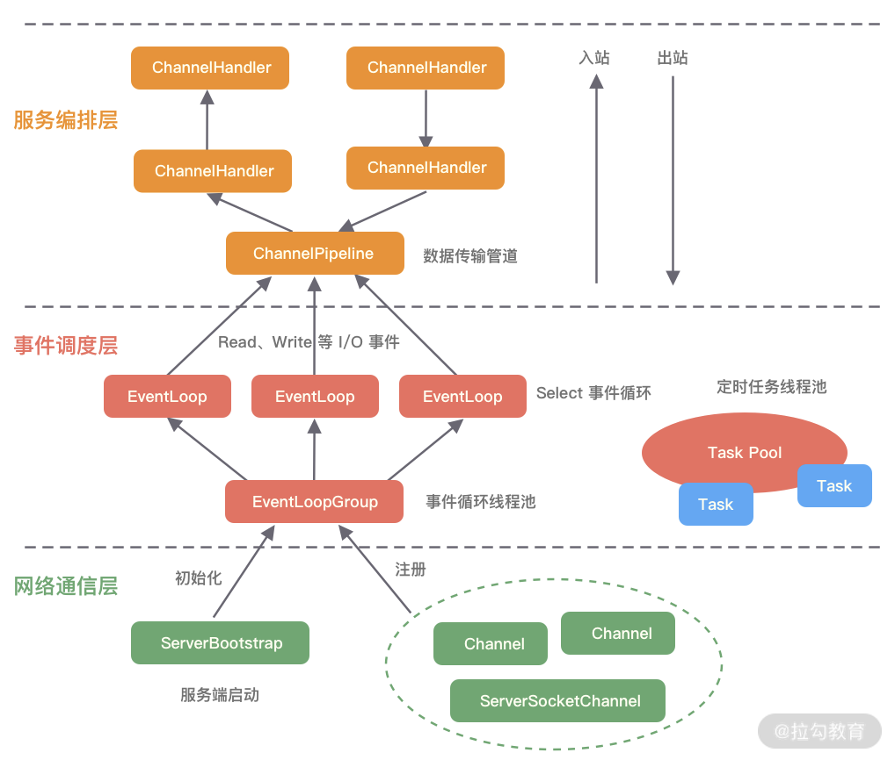

## Introduction

[Netty](https://netty.io) is *an asynchronous event-driven network application framework* for rapid development of maintainable high performance protocol servers & clients

Netty is a [NIO](/docs/CS/Java/JDK/IO/NIO.md) client server framework which enables quick and easy development of network applications such as protocol servers and clients.
It greatly simplifies and streamlines network programming such as TCP and UDP socket server.

- **Ease of use**: Netty is simpler to use than plain Java NIO and has an extensive set of examples covering most use cases
- **Minimal dependency**: As we will see in a minute, you can get the whole framework with just a single dependency
- **Performance**: Netty has better throughput and reduced latency than core Java APIs. It is also scalable thanks to its internal pooling of resources.
- **Security**: Complete SSL/TLS and StartTLS support.


- [Future](/docs/CS/Framework/Netty/Future.md)
- [FastThreadLocal](/docs/CS/Framework/Netty/FastThreadLocal.md)

## Architecture

<div style="text-align: center;">


</div>

<p style="text-align: center;">
Fig.1. Netty architecture.
</p>


Netty 结构一共分为三个模块：

- Core
  Core 核心层是 Netty 最精华的内容，它提供了底层网络通信的通用抽象和实现，包括可扩展的事件模型、通用的通信 API、支持零拷贝的 [ByteBuf](/docs/CS/Framework/Netty/ByteBuf.md) 等。
- Protocol Support
  协议支持层基本上覆盖了主流协议的编解码实现，如 HTTP、SSL、Protobuf、压缩、大文件传输、WebSocket、文本、二进制等主流协议，此外 Netty 还支持自定义应用层协议。Netty 丰富的协议支持降低了用户的开发成本，基于 Netty 我们可以快速开发 HTTP、WebSocket 等服务。
- Transport Service
  传输服务层提供了网络传输能力的定义和实现方法。它支持 Socket、HTTP 隧道、虚拟机管道等传输方式。Netty 对 TCP、UDP 等数据传输做了抽象和封装，用户可以更聚焦在业务逻辑实现上，而不必关系底层数据传输的细节


Netty 的逻辑处理架构为典型网络分层架构设计，共分为网络通信层、事件调度层、服务编排层，每一层各司其职


<div style="text-align: center;">



</div>

<p style="text-align: center;">
Fig.1. Netty logic architecture.
</p>


网络通信层的**核心组件**包含**BootStrap、ServerBootStrap、Channel**三个组件


[Bootstrap](/docs/CS/Framework/Netty/Bootstrap.md) 是“引导”的意思，它主要负责整个 Netty 程序的启动、初始化、服务器连接等过程，它相当于一条主线，串联了 Netty 的其他核心组件

Netty 自己实现的 Channel 是以 JDK NIO Channel 为基础的，相比较于 JDK NIO，Netty 的 Channel 提供了更高层次的抽象，同时屏蔽了底层 Socket 的复杂性，赋予了 Channel 更加强大的功能


事件调度层的职责是通过 Reactor 线程模型对各类事件进行聚合处理，通过 Selector 主循环线程集成多种事件（ I/O 事件、信号事件、定时事件等），实际的业务处理逻辑是交由服务编排层中相关的 Handler 完成。

事件调度层的**核心组件**包括 EventLoopGroup、[EventLoop](/docs/CS/Framework/Netty/EventLoop.md)


服务编排层的职责是负责组装各类服务，它是 Netty 的核心处理链，用以实现网络事件的动态编排和有序传播。

服务编排层的核心组件包括 ChannelPipeline、ChannelHandler、ChannelHandlerContext

## Sequence

源码编译collection 包

cd common 目录 执行 `mvn clean install -DskipTests=true -Dcheckstyle.skip=true`


In Java-based networking, the fundamental construct is the class Socket .
Netty’s Channel interface provides an API that greatly simplifies the complexity of working directly with Socket.
To work with TCP/IP Channels, we will deal with SocketChannel which represents the TCP connection between client and servers:

SocketChannels are managed by EventLoop which is looking for new events, such as incoming data.. When an event occurs, it is eventually passed on to the appropriate Handler for example a ChannelHandler.

Next, to share resources like threads, Netty groups each EventLoop into an EventLoopGroup.

Finally, to handle the bootstrapping of Netty and its resources, you can use the BootStrap class.

Let’s see how to use the above Classes with a simple Server echo example.

> [Example writing a Discard Server](https://netty.io/wiki/user-guide-for-4.x.html#writing-a-discard-server)

### Bind

- [Create EventLoopGroup](/docs/CS/Framework/Netty/EventLoop.md?id=create-eventloopgroup)
- BossEventLoop starts thread when register ServerSocketChannel
- first register(Selector, 0, ServerSocketChannel)
- selectionKey.interestOps(OP_ACCEPT) when fireChannelActive() after bind

```plantuml
skinparam backgroundColor #DDDDDD

title: Bind sequence
participant MainThread as ma
participant ServerBootstrap as sb
participant BossEventLoopGroup as we
participant BossEventLoop as bl
participant ServerSocketChannel as cc
activate ma
ma ->> we: create EventLoopGroup
we ->> bl: create EventLoops
bl -->> bl: openSelector
note right: one Selector per EventLoop
we -->> ma: EventLoopGroup
ma ->> sb: bind()
sb ->> cc: init ServerSocketChannel
note right
init ChannelPipeline 
with ServerBootstrapAceptor
end note
cc -->> sb: ServerSocketChannel with OP_ACCEPT
sb ->> we: register()
note right: not inEventLoop
we ->> bl: execute
sb --> ma: ChannelFuture
deactivate ma
bl --> bl: startThread()
activate bl
bl ->> cc: register(Selector, 0, ServerSocketChannel)
cc ->> cc: invokeHandlerAddedIfNeeded
cc ->> cc: notify the promise
note right: call doBind task
cc ->> cc: fireChannelRegistered
cc --> bl: Registration was complete and successful
bl ->> cc: Channel.bind()
participant AbstractUnsafe as au
cc ->> au: bind()
au -->> cc: doBind()
note left #AAAAAA: javaChannel().bind()
cc ->> au: fireChannelActive
au -->> cc: doBeginRead()
note left: selectionKey.interestOps(OP_ACCEPT)
deactivate bl
```

### Connect

当Main Reactor监听到OP_ACCPET事件活跃后，会在NioServerSocketChannel中accept完成三次握手的客户端连接。并创建NioSocketChannel，伴随着NioSocketChannel的创建其对应的配置类NioSocketChannelConfig类也会随之创建

最终会在NioSocketChannelConfig的父类DefaultChannelConfig的构造器中创建AdaptiveRecvByteBufAllocator。并保存在RecvByteBufAllocator rcvBufAllocator字段中

在new AdaptiveRecvByteBufAllocator()创建AdaptiveRecvByteBufAllocator类实例的时候会先触发AdaptiveRecvByteBufAllocator类的初始化


扩容索引表 SIZE_TABLE 维护size 和 索引的关系
- 当size < 512，索引增加 size + 16
- 当size >= 512，索引增加 size 翻倍

扩容步长 4 缩容步长 1 以initital size 2048为例 对应索引表为33 扩容步长 + 4 = 37 对应size = 32768， 缩容步长 -1 = 32 对应size = 1024


```java

public class AdaptiveRecvByteBufAllocator extends DefaultMaxMessagesRecvByteBufAllocator {

    static final int DEFAULT_MINIMUM = 64;
    // Use an initial value that is bigger than the common MTU of 1500
    static final int DEFAULT_INITIAL = 2048;
    static final int DEFAULT_MAXIMUM = 65536;

    private static final int INDEX_INCREMENT = 4;
    private static final int INDEX_DECREMENT = 1;

    private static final int[] SIZE_TABLE;

    static {
        List<Integer> sizeTable = new ArrayList<Integer>();
        for (int i = 16; i < 512; i += 16) {
            sizeTable.add(i);
        }

        // Suppress a warning since i becomes negative when an integer overflow happens
        for (int i = 512; i > 0; i <<= 1) {
            sizeTable.add(i);
        }

        SIZE_TABLE = new int[sizeTable.size()];
        for (int i = 0; i < SIZE_TABLE.length; i ++) {
            SIZE_TABLE[i] = sizeTable.get(i);
        }
    }
}
```

创建 AdaptiveRecvByteBufAllocator 时设置了size的 最小 最大和默认capcity 同时设置index范围

```java
public class AdaptiveRecvByteBufAllocator extends DefaultMaxMessagesRecvByteBufAllocator {

    private final int minIndex;
    private final int maxIndex;
    private final int initialIndex;
    private final int minCapacity;
    private final int maxCapacity;

    public AdaptiveRecvByteBufAllocator() {
        this(DEFAULT_MINIMUM, DEFAULT_INITIAL, DEFAULT_MAXIMUM);
    }

    public AdaptiveRecvByteBufAllocator(int minimum, int initial, int maximum) {
        checkPositive(minimum, "minimum");
        if (initial < minimum) {
            throw new IllegalArgumentException("initial: " + initial);
        }
        if (maximum < initial) {
            throw new IllegalArgumentException("maximum: " + maximum);
        }

        int minIndex = getSizeTableIndex(minimum);
        if (SIZE_TABLE[minIndex] < minimum) {
            this.minIndex = minIndex + 1;
        } else {
            this.minIndex = minIndex;
        }

        int maxIndex = getSizeTableIndex(maximum);
        if (SIZE_TABLE[maxIndex] > maximum) {
            this.maxIndex = maxIndex - 1;
        } else {
            this.maxIndex = maxIndex;
        }

        int initialIndex = getSizeTableIndex(initial);
        if (SIZE_TABLE[initialIndex] > initial) {
            this.initialIndex = initialIndex - 1;
        } else {
            this.initialIndex = initialIndex;
        }
        this.minCapacity = minimum;
        this.maxCapacity = maximum;
    }

}
```


设置的index 和 capcity 等值被带入到 Handle 中

```java
@SuppressWarnings("deprecation")
@Override
public Handle newHandle() {
    return new HandleImpl(minIndex, maxIndex, initialIndex, minCapacity, maxCapacity);
}
```


在每次read loop循环中都会判断是否continueReading 此时会
对于客户端NioSocketChannel来说，它里边包含的IO数据时客户端发送来的网络数据，长度是不定的，所以才会需要这样一个可以根据每次IO数据的大小来自适应动态调整容量的ByteBuffer来接收
AdaptiveRecvByteBufAllocator并不会真正的去分配ByteBuffer，它只是负责动态调整分配ByteBuffer的大小
真正具体执行内存分配动作的是这里的ByteBufAllocator类型为PooledByteBufAllocator。它会根据AdaptiveRecvByteBufAllocator动态调整出来的大小去真正的申请内存分配ByteBuffer


```java
public class DefaultMaxBytesRecvByteBufAllocator implements MaxBytesRecvByteBufAllocator {
    private volatile int maxBytesPerRead;
    private volatile int maxBytesPerIndividualRead;

    private final class HandleImpl implements ExtendedHandle {
        private int individualReadMax;
        private int bytesToRead;
        private int lastBytesRead;
        private int attemptBytesRead;
    }
}
```


在每次开始从NioSocketChannel中读取数据之前，需要利用PooledByteBufAllocator在内存池中为ByteBuffer分配内存


```java
byteBuf = allocHandle.allocate(allocator);
```


默认初始化大小为2048，这个容量由guess()方法决定


```java
@Override
public ByteBuf allocate(ByteBufAllocator alloc) {
    return alloc.ioBuffer(guess());
}


@Override
public int guess() {
    return Math.min(individualReadMax, bytesToRead);
}
```


在每次通过doReadBytes从NioSocketChannel中读取到数据后，都会调用allocHandle.lastBytesRead(doReadBytes(byteBuf))记录本次读取了多少字节数据


```java
@Override
public void lastBytesRead(int bytes) {
    lastBytesRead = bytes;
    // Ignore if bytes is negative, the interface contract states it will be detected externally after call.
    // The value may be "invalid" after this point, but it doesn't matter because reading will be stopped.
    bytesToRead -= bytes;
}
```


每次read loop循环的末尾都需要通过调用allocHandle.continueReading()来判断是否继续read loop循环读取NioSocketChannel中的数据

```java
private final class HandleImpl implements ExtendedHandle {
    private int individualReadMax;
    private int bytesToRead;
    private int lastBytesRead;
    private int attemptBytesRead;
    private final UncheckedBooleanSupplier defaultMaybeMoreSupplier = new UncheckedBooleanSupplier() {
        @Override
        public boolean get() {
            return attemptBytesRead == lastBytesRead;
        }
    };

    @Override
    public boolean continueReading() {
        return continueReading(defaultMaybeMoreSupplier);
    }

    @Override
    public boolean continueReading(UncheckedBooleanSupplier maybeMoreDataSupplier) {
        // Keep reading if we are allowed to read more bytes, and our last read filled up the buffer we provided.
        return bytesToRead > 0 && maybeMoreDataSupplier.get();
    }

}
```


在每轮read loop结束之后，我们都会调用allocHandle.readComplete()来根据在allocHandle中统计的在本轮read loop中读取字节总大小，来决定在下一轮read loop中是否对DirectByteBuffer进行扩容或者缩容


满足两次缩容条件才会进行缩容，且缩容步长为1，缩容比较谨慎
满足一次扩容条件就进行扩容，并且扩容步长为4， 扩容比较奔放


- BossEventLoop select() for OP_ACCEPT
- WorkerEventLoop starts thread when register
- first register(Selector, 0, SocketChannel)
- selectionKey.interestOps(OP_READ) when fireChannelActive()

```plantuml
skinparam backgroundColor #DDDDDD

title: Connect sequence
participant BossNioEventLoop as bg
participant Channel.Unsafe as us
participant ServerSocketChannel as sc
participant ServerBootstrapAceptor as sa
participant WorkerEventLoopGroup as wg
participant WorkerEventLoop as el
participant SocketChannel as sl
participant ChannelPipeline as pipe
activate bg
bg ->> bg: Selector.select()
note left: OP_ACCEPT event
bg ->> us: NioUnsafe.read()
us ->> sc: create SocketChannel
note right: ServerSocketChannel.accept()
sc -->> us: SocketChannel
us ->> sa: pipeline.fireChannelRead()
sa ->> sa: init SocketChannel
sa ->> wg: regster()
wg ->> el: execute()
el --> el: startThread()
activate el
el -> sl: register(selector, 0, Channel)
sl ->> pipe: fireChannelRegistered()
sl ->> pipe: fireChannelActive()
note right: selectionKey.interestOps(OP_READ)
```

### Read

Netty 读取数据的核心流程，Netty 会在一个 read loop 中不断循环读取 Socket 中的数据直到数据读取完毕或者读取次数已满 16 次，当循环读取了 16 次还没有读取完毕时，Netty 就不能在继续读了，因为 Netty 要保证 Reactor 线程可以均匀的处理注册在它上边的所有 Channel 中的 IO 事件。剩下未读取的数据等到下一次 read loop 在开始读取。

除此之外，在每次 read loop 开始之前，Netty 都会分配一个初始化大小为 2048 的 DirectByteBuffer 来装载从 Socket 中读取到的数据，当整个 read loop 结束时，会根据本次读取数据的总量来判断是否为该 DirectByteBuffer 进行扩容或者缩容，目的是在下一次 read loop 的时候可以为其分配一个容量大小合适的 DirectByteBuffer


Netty服务端对于一次OP_READ事件的处理，会在一个do{}while()循环read loop中分多次从客户端NioSocketChannel中读取网络数据。每次读取我们分配的ByteBuffer容量大小，初始容量为2048。
- ChanneRead事件：一次循环读取一次数据，就触发一次ChannelRead事件。本次最多读取在read loop循环开始分配的DirectByteBuffer容量大小。这个容量会动态调整
- ChannelReadComplete事件：当读取不到数据或者不满足continueReading的任意一个条件就会退出read loop，这时就会触发ChannelReadComplete事件。表示本次OP_READ事件处理完毕

> 触发ChannelReadComplete事件并不代表NioSocketChannel中的数据已经读取完了，只能说明本次OP_READ事件处理完毕
> 因为有可能是客户端发送的数据太多，Netty读了16次还没读完，那就只能等到下次OP_READ事件到来的时候在进行读取了


- ReadComplete contains multiple Reads(max 16)
- AdaptiveRecvByteBufAllocator try 2 reduce size and expand quickly
- default execute in WorkerEventLoop, also can define own ThreadPool when add Handlers

> [!TIP]
>
> Don't use EventLoopGroup to execute business because of its thread affinity.

```plantuml
skinparam backgroundColor #DDDDDD

title: Read sequence
participant WorkEventLoop as we
participant Selector as se
activate we
we ->> we: Selector.select()
note right: OP_READ event
participant Channel.Unsafe as ue
we ->> ue: read()
participant NioSocketChannel as so
participant Allocator as ac
participant ByteBuf as bb
participant ChannelPipeline as pipe
participant ChannelInboundHandler as ch
loop continueReading
    ue ->> ac: allocate()
    ac -->> ue: ByteBuf 
    ue ->> so: doReadBytes(ByteBuf) 
        note over so, bb #AAAAAA
            javaChannel.readBytes()
        end note
    break read EOF
    bb -->> bb: release()
        note over so #AAAAAA
            close = true
        end note
    end
    break IOException | OOM
        so -->> so: closeOnRead()
    end
    alt readPending
        so ->> pipe: fireChannelRead()
        pipe ->> ch: fireChannelRead()
            note right
                handle data
                From Head to Tail
            end note
    end
end
so ->> ac: readComplete()
so ->> pipe: fireChannelReadComplete()
participant ChannelOutboundBuffer as ob
alt close == true
    so -->> so: closeOnRead()
    so -->> pipe: deRegister()
    so -->> so: doCLose()
        note right 
        close javaChannel
        cancel SelectionKey
        end note
    so -->> pipe: deRegister()
    so -->> ob: fail pending message \n ChannelOutboundBuffer = null
    so -->> pipe: fireChannelInactive()
    so -->> pipe: fireChannelUnRegister()
end

```

### Write

Netty 中有两个触发 write 事件传播的方法，它们的传播处理逻辑都是一样的，只不过它们在 pipeline 中的传播起点是不同的。
- channelHandlerContext.write() 方法会从当前 ChannelHandler 开始在 pipeline 中向前传播 write 事件直到 HeadContext。
- channelHandlerContext.channel().write() 方法则会从 pipeline 的尾结点 TailContext 开始在 pipeline 中向前传播 write 事件直到 HeadContext


当异步事件在 pipeline 传播的过程中发生异常时，异步事件就会停止在 pipeline 中传播。所以我们在日常开发中，需要对写操作异常情况进行处理。
- 其中 inbound 类异步事件发生异常时，会触发exceptionCaught事件传播。exceptionCaught 事件本身也是一种 inbound 事件，传播方向会从当前发生异常的 ChannelHandler 开始一直向后传播直到 TailContext。
- 而 outbound 类异步事件发生异常时，则不会触发exceptionCaught事件传播。一般只是通知相关 ChannelFuture。但如果是 flush 事件在传播过程中发生异常，则会触发当前发生异常的 ChannelHandler 中 exceptionCaught 事件回调。


findContextOutbound 方法接收的参数是一个掩码，这个掩码表示要向前查找具有什么样执行资格的 ChannelHandler。因为我们这里调用的是 ChannelHandlerContext 的 write 方法所以 flush = false，传递进来的掩码为 MASK_WRITE，表示我们要向前查找覆盖实现了 write 回调方法的 ChannelOutboundHandler

```java
private AbstractChannelHandlerContext findContextOutbound(int mask) {
    AbstractChannelHandlerContext ctx = this;
    EventExecutor currentExecutor = executor();
    do {
        ctx = ctx.prev;
    } while (skipContext(ctx, currentExecutor, mask, MASK_ONLY_OUTBOUND));
    return ctx;
}

private static boolean skipContext(
        AbstractChannelHandlerContext ctx, EventExecutor currentExecutor, int mask, int onlyMask) {
    // Ensure we correctly handle MASK_EXCEPTION_CAUGHT which is not included in the MASK_EXCEPTION_CAUGHT
    return (ctx.executionMask & (onlyMask | mask)) == 0 ||
            // We can only skip if the EventExecutor is the same as otherwise we need to ensure we offload
            // everything to preserve ordering.
            //
            // See https://github.com/netty/netty/issues/10067
            (ctx.executor() == currentExecutor && (ctx.executionMask & mask) == 0);
}
```


```java


final class ChannelHandlerMask {
    // Using to mask which methods must be called for a ChannelHandler.
    static final int MASK_EXCEPTION_CAUGHT = 1;
    static final int MASK_CHANNEL_REGISTERED = 1 << 1;
    static final int MASK_CHANNEL_UNREGISTERED = 1 << 2;
    static final int MASK_CHANNEL_ACTIVE = 1 << 3;
    static final int MASK_CHANNEL_INACTIVE = 1 << 4;
    static final int MASK_CHANNEL_READ = 1 << 5;
    static final int MASK_CHANNEL_READ_COMPLETE = 1 << 6;
    static final int MASK_USER_EVENT_TRIGGERED = 1 << 7;
    static final int MASK_CHANNEL_WRITABILITY_CHANGED = 1 << 8;
    static final int MASK_BIND = 1 << 9;
    static final int MASK_CONNECT = 1 << 10;
    static final int MASK_DISCONNECT = 1 << 11;
    static final int MASK_CLOSE = 1 << 12;
    static final int MASK_DEREGISTER = 1 << 13;
    static final int MASK_READ = 1 << 14;
    static final int MASK_WRITE = 1 << 15;
    static final int MASK_FLUSH = 1 << 16;

    static final int MASK_ONLY_INBOUND =  MASK_CHANNEL_REGISTERED |
            MASK_CHANNEL_UNREGISTERED | MASK_CHANNEL_ACTIVE | MASK_CHANNEL_INACTIVE | MASK_CHANNEL_READ |
            MASK_CHANNEL_READ_COMPLETE | MASK_USER_EVENT_TRIGGERED | MASK_CHANNEL_WRITABILITY_CHANGED;
    private static final int MASK_ALL_INBOUND = MASK_EXCEPTION_CAUGHT | MASK_ONLY_INBOUND;
    static final int MASK_ONLY_OUTBOUND =  MASK_BIND | MASK_CONNECT | MASK_DISCONNECT |
            MASK_CLOSE | MASK_DEREGISTER | MASK_READ | MASK_WRITE | MASK_FLUSH;
    private static final int MASK_ALL_OUTBOUND = MASK_EXCEPTION_CAUGHT | MASK_ONLY_OUTBOUND;
}
```


在 ChannelHandler 被添加进 pipeline 的时候，Netty 会根据当前 ChannelHandler 的类型以及其覆盖实现的异步事件回调方法，通过 | 运算向 ChannelHandlerContext#executionMask 字段添加该 ChannelHandler 的执行资格


需要在 pipeline 中传播 write 事件，它是一种 outbound 事件，所以需要向前传播，这里通过 ChannelHandlerContext 的前驱指针 prev 拿到当前 ChannelHandler 在 pipeline 中的前一个节点
通过 skipContext 方法判断前驱节点是否具有执行的资格。如果没有执行资格则跳过继续向前查找。如果具有执行资格则返回并响应 write 事件。
在 write 事件传播场景中，执行资格指的是前驱 ChannelHandler 是否是ChannelOutboundHandler 类型的，并且它是否覆盖实现了 write 事件回调方


```java
protected abstract class AbstractUnsafe implements Unsafe {

    private volatile ChannelOutboundBuffer outboundBuffer = new ChannelOutboundBuffer(AbstractChannel.this);
}
```


ChannelOutboundBuffer 其实是一个单链表结构的缓冲队列，链表中的节点类型为 Entry ，由于 ChannelOutboundBuffer 在 Netty 中的作用就是缓存应用程序待发送的网络数据，所以 Entry 中封装的就是待写入 Socket 中的网络发送数据相关的信息，以及 ChannelHandlerContext#write 方法中返回给用户的 ChannelPromise 。这样可以在数据写入Socket之后异步通知应用程序


```java
public final class ChannelOutboundBuffer {
    static final int CHANNEL_OUTBOUND_BUFFER_ENTRY_OVERHEAD =
    SystemPropertyUtil.getInt("io.netty.transport.outboundBufferEntrySizeOverhead", 96);

    private static final InternalLogger logger = InternalLoggerFactory.getInstance(ChannelOutboundBuffer.class);

    private static final FastThreadLocal<ByteBuffer[]> NIO_BUFFERS = new FastThreadLocal<ByteBuffer[]>() {
        @Override
        protected ByteBuffer[] initialValue() throws Exception {
            return new ByteBuffer[1024];
        }
    };

    private final Channel channel;

    // Entry(flushedEntry) --> ... Entry(unflushedEntry) --> ... Entry(tailEntry)
    //
    // The Entry that is the first in the linked-list structure that was flushed
    private Entry flushedEntry;
    // The Entry which is the first unflushed in the linked-list structure
    private Entry unflushedEntry;
    // The Entry which represents the tail of the buffer
    private Entry tailEntry;
    // The number of flushed entries that are not written yet
    private int flushed;

    private int nioBufferCount;
    private long nioBufferSize;
}
```


此外 ChannelOutboundBuffer 中还封装了三个重要的指针：
- unflushedEntry ：该指针指向 ChannelOutboundBuffer 中第一个待发送数据的 Entry。
- tailEntry ：该指针指向 ChannelOutboundBuffer 中最后一个待发送数据的 Entry。通过 unflushedEntry 和 tailEntry 这两个指针，我们可以很方便的定位到待发送数据的 Entry 范围。
- flushedEntry ：当我们通过 flush 操作需要将 ChannelOutboundBuffer 中缓存的待发送数据发送到 Socket 中时，flushedEntry 指针会指向 unflushedEntry 的位置，这样 flushedEntry 指针和 tailEntry 指针之间的 Entry 就是我们即将发送到 Socket 中的网络数据。


Netty 为了防止 ChannelOutboundBuffer 中的待发送数据内存占用无限制的增长从而导致 OOM ，所以引入了高低水位线，作为待发送数据内存占用的上限和下限


```java
public final class WriteBufferWaterMark {

    private static final int DEFAULT_LOW_WATER_MARK = 32 * 1024;
    private static final int DEFAULT_HIGH_WATER_MARK = 64 * 1024;

    public static final WriteBufferWaterMark DEFAULT =
            new WriteBufferWaterMark(DEFAULT_LOW_WATER_MARK, DEFAULT_HIGH_WATER_MARK, false);

    private final int low;
    private final int high;
}
```


每个 Channel 中的待发送数据如果超过 64 KB。Channel 的状态就会变为不可写状态。当内存占用量低于 32 KB时，Channel 的状态会再次变为可写状态


在关闭压缩指针的情况下Entry对象在堆中占用内存大小为96字节
开启则为64字节


这里有一点和 write 事件处理不同的是，当调用 nextChannelHandler 的 flush 回调出现异常的时候，会触发 nextChannelHandler 的 exceptionCaught 回调。

最终flush事件会在pipeline中一直向前传播至HeadContext中，并在 HeadContext 里调用 channel 的 unsafe 类完成 flush 事件的最终处理逻辑


在 Netty 在发送数据的时候，如果发现当前 channel 处于非活跃状态，则将 ChannelOutboundBuffer 中 flushedEntry 与tailEntry 之间的 Entry 对象节点全部删除，并释放发送数据占用的内存空间，同时回收 Entry 对象实例


```java
void failFlushed(Throwable cause, boolean notify) {
    // Make sure that this method does not reenter.  A listener added to the current promise can be notified by the
    // current thread in the tryFailure() call of the loop below, and the listener can trigger another fail() call
    // indirectly (usually by closing the channel.)
    //
    // See https://github.com/netty/netty/issues/1501
    if (inFail) {
        return;
    }

    try {
        inFail = true;
        for (;;) {
            if (!remove0(cause, notify)) {
                break;
            }
        }
    } finally {
        inFail = false;
    }
}
```


当一个 Entry 节点需要从 ChannelOutboundBuffer 中清除时，Netty 需要释放该 Entry 节点中包裹的发送数据 msg 所占用的内存空间。并标记对应的 promise 为失败同时通知对应的 listener ，由于 msg 得到释放，所以需要降低 channelOutboundBuffer 中的内存占用水位线，并根据 boolean notifyWritability 决定是否触发 ChannelWritabilityChanged 事件。最后需要将该 Entry 实例回收至 Recycler 对象池中

```java
private boolean remove0(Throwable cause, boolean notifyWritability) {
    Entry e = flushedEntry;
    if (e == null) {
        clearNioBuffers();
        return false;
    }
    Object msg = e.msg;

    ChannelPromise promise = e.promise;
    int size = e.pendingSize;

    removeEntry(e);

    if (!e.cancelled) {
        // only release message, fail and decrement if it was not canceled before.
        ReferenceCountUtil.safeRelease(msg);

        safeFail(promise, cause);
        decrementPendingOutboundBytes(size, false, notifyWritability);
    }

    // recycle the entry
    e.unguardedRecycle();

    return true;
}
```

doWriteFileRegion 方法中通过 FileChannel#transferTo 方法底层用到的系统调用为 sendFile 实现零拷贝网络文件的传输


OP_WRITE 事件发生后，Netty 直接调用 channel 的 forceFlush 方法
clearOpWrite() 方法，由于 channel 上的 OP_WRITE 事件就绪，表明此时 Socket 缓冲区变为可写状态，从而 Reactor 线程再次来到了 flush 流程中。
当 ChannelOutboundBuffer 中的数据全部写完后 in.isEmpty() ，就需要清理 OP_WRITE 事件，因为此时 Socket 缓冲区是可写的，这种情况下当数据全部写完后，就需要取消对 OP_WRITE 事件的监听，否则 epoll 会不断的通知 Reactor。
同理在 incompleteWrite 方法的 else 分支也需要执行 clearOpWrite() 方法取消对 OP_WRITE 事件的监听


- check isActive & isWritable
- OP_WRITE for could write
- write/flush run in EventLoop

```plantuml
skinparam backgroundColor #DDDDDD

participant Handler as hl
participant ChannelPipeline as pipe
participant ByteBuf as bb
participant HeadContext as hc
participant Channel.Unsafe as ue
participant WorkerEventLoop as we
activate we
hl ->> pipe: write()
pipe ->> hc: write()
hc ->> ue: write()

bb -->> ue: addMessage()
participant SocketChannel as so
participant ChannelOutboundBuffer as ob
alt ChannelOutboundBuffer == null
    note over ue
        release msg prevent resource-leak
        safeSetFailure
    end note
else 
    ue ->> ob: addMessage()
    note over ob: Increment the pending bytes
end
hl ->> pipe: flush()
pipe ->> hc: flush()
hc ->> ue: flush()
ue ->> ob: addFlush()
ue ->> so: doWrite()
loop writeSpinCount > 0
    break msg done
        so ->> so: clearOpWrite()
    end
    ue ->> so: writeInternal()
    so -->> ue: doWriteBytes/doWriteFileRegion
    note left #AAAAAA: javaChannel.write()
end

alt incompleteWrite
    so ->> so: setOpWrite()
else completely
    so ->> so: clearOpWrite()
    so -->> we: Schedule flush again later
end
```


### Shutdown

```plantuml
skinparam backgroundColor #DDDDDD

title: shutdown
actor User
participant EventLoopGroup as eg
participant EventLoop as el
activate el
el -> el: runAllTasks()
User -> eg: shutdownGracefully()
eg -> el: shutdownGracefully()
loop shutdown

    break isShuttingDown
        note over el #AAAAAA: return
    end
    note over el: cas set state \n ST_STARTED -> ST_SHUTTING_DOWN
end
el -> el: confirmShutdown()
note right: runAllTasks() || runShutdownHooks()
el -> el: closeAll()
activate el
participant Channel as ch
participant Selector as se
el -> se: cancel registed channels
el -> ch: close NIO channels
el -> se: cleanup()
se -> se: Selector.close()
deactivate el
deactivate el
```

1. [Create EventLoopGroup](/docs/CS/Framework/Netty/EventLoop.md?id=create-nioeventloopgroup)
2. [Create ServerBootstrap](/docs/CS/Framework/Netty/Bootstrap.md?id=create-serverbootstrap)
3. Set [Channel](/docs/CS/Framework/Netty/Channel.md)
4. Set [ChannelHandler](/docs/CS/Framework/Netty/ChannelHandler.md)
5. Option
6. ChildOption
7. [ServerBootstrap#bind()](/docs/CS/Framework/Netty/Bootstrap.md?id=bind)
8. [ChannelFuture](/docs/CS/Framework/Netty/Future.md)

### close


将读取数据和发送数据的不同之处总结如下几点供大家回忆对比：

在每次 read loop 之前，会分配一个大小固定的 diretByteBuffer 用来装载读取数据。每轮 read loop 完全结束之后，才会决定是否对下一轮的读取过程分配的 directByteBuffer 进行扩容或者缩容。
在每次 write loop 之前，都会获取本次 write loop 最大能够写入的字节数，根据这个最大写入字节数从 ChannelOutboundBuffer 中转换 JDK NIO ByteBuffer 。每次写入 Socket 之后都需要重新评估是否对这个最大写入字节数进行扩容或者缩容。
read loop 和 write loop 都被默认限定最多执行 16 次。
在一个完整的 read loop 中，如果还读取不完数据，直接退出。等到 reactor 线程执行完其他 channel 上的 IO 事件再来读取未读完的数据。
而在一个完整的 write loop 中，数据发送不完，则分两种情况。
Socket 缓冲区满无法在继续写入。这时就需要向 reactor 注册 OP_WRITE 事件。等 Socket 缓冲区变的可写时，epoll 通知 reactor 线程继续发送。
Socket 缓冲区可写，但是由于发送数据太多，导致虽然写满 16 次但依然没有写完。这时就直接向 reactor 丢一个 flushTask 进去，等到 reactor 线程执行完其他 channel 上的 IO 事件，在回过头来执行 flushTask。
OP_READ 事件的注册是在 NioSocketChannel 被注册到对应的 Reactor 中时就会注册。而 OP_WRITE 事件只会在 Socket 缓冲区满的时候才会被注册。当 Socket 缓冲区再次变得可写时，要记得取消 OP_WRITE 事件的监听。否则的话就会一直被通知


## Under Hood


### Memory

- use primitive type rather than wrapper type(long + AtomicLongFieldUpdater rather than AtomicLong)
- reduce object creative
  - class field rather than instance field
- expect map size to reduce expand, AdaptiveRecvByteBufAllocator
- zero copy


AllocateByteBuf


[Memory Pool](/docs/CS/Framework/Netty/memory.md)


### Zero Copy

- Direct Memory
- Composite or wrap ByteBuf
- FileChannel transfer

[Future and Promise](/docs/CS/Framework/Netty/Future.md)

## Links

- [Java NIO](/docs/CS/Java/JDK/IO/NIO.md)
- [Dubbo](/docs/CS/Framework/Dubbo/Dubbo.md)
- [Flink](/docs/CS/Framework/Flink/Flink.md)
- [RocketMQ](/docs/CS/MQ/RocketMQ/RocketMQ.md)
- [Cassandra](/docs/CS/DB/Cassandra.md)
- [Hadoop](/docs/CS/Java/Hadoop/Hadoop.md)
- [ElasticSearch](/docs/CS/Framework/ES/ES.md)

## References

1. [Netty](https://netty.io/)
2. [Thread model](https://netty.io/wiki/thread-model.html)
