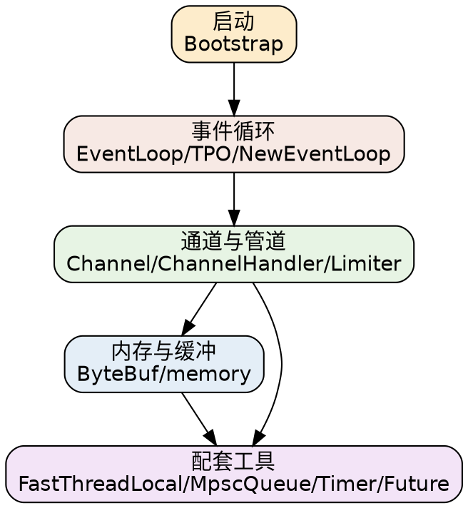

## Introduction

本目录是 **Netty** 的专题索引。Netty 的主线是从「事件循环驱动」出发的一条异步链路：Bootstrap 引导启动 → EventLoop 驱动 → Channel 承载连接 → Pipeline 装配 ChannelHandler → ByteBuf 在内存中读写。围绕这条主线，本目录收录了内存池、线程模型、以及配套的私有工具类笔记。

## 启动与引导

- [Bootstrap](/docs/CS/Framework/Netty/Bootstrap.md)：客户端 / 服务端引导，事件循环组与 ChannelPipeline 装配。

## 事件循环与线程模型

- [EventLoop](/docs/CS/Framework/Netty/EventLoop.md)：事件循环、单线程串行语义、任务提交与执行。
- [TPO](/docs/CS/Framework/Netty/TPO.md)：线程池与 executor 的关系、线程上下文细节。
- [FastThreadLocal](/docs/CS/Framework/Netty/FastThreadLocal.md)：Netty 对 ThreadLocal 的高性能替代（内存池化版本）。

## 通道与管道

- [Channel](/docs/CS/Framework/Netty/Channel.md)：Channel 抽象与状态、事件回调。
- [ChannelHandler](/docs/CS/Framework/Netty/ChannelHandler.md)：入站 / 出站 handler、编解码器、消息流转。
- [Limiter](/docs/CS/Framework/Netty/Limiter.md)：流量整形与限流相关。

## 内存与缓冲

- [ByteBuf](/docs/CS/Framework/Netty/ByteBuf.md)：字节缓冲、堆内 / 直接内存、`ReaderIndex`/`WriterIndex`。
- [memory](/docs/CS/Framework/Netty/memory.md)：内存池（`Arena` / `Chunk` / `Page`）、分配器与零拷贝。

## 异步与配套工具

- [Future](/docs/CS/Framework/Netty/Future.md)：`Future` / `Promise` 异步结果与回调。
- [MpscLinkedQueue](/docs/CS/Framework/Netty/MpscLinkedQueue.md)：多生产者单消费者无锁队列。
- [HashedWheelTimer](/docs/CS/Framework/Netty/HashedWheelTimer.md)：时间轮定时器，高精度分秒级延时任务。

## Links

- [Netty（架构与入口）](/docs/CS/Framework/Netty/Netty.md)
- [Tomcat（同样基于 NIO 的容器）](/docs/CS/Framework/Tomcat/Tomcat.md)
- [gRPC（Netty 上跑 RPC）](/docs/CS/Framework/gRPC/gRPC.md)
- [Framework 总索引](/docs/CS/Framework/README.md)

## References

1. [Netty 4.1 Reference](https://netty.io/wiki/)
2. [Netty Source (GitHub)](https://github.com/netty/netty)
