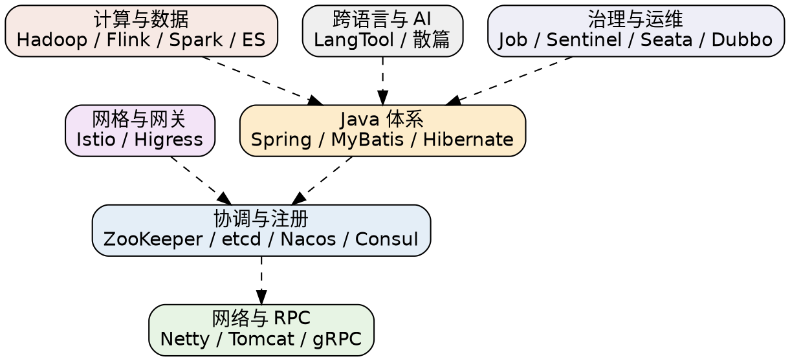

## Introduction

本目录是 **Framework（框架与中间件）** 领域的入口页，收录后端与基础设施层的技术栈笔记：Java 体系（Spring / MyBatis / Dubbo）、分布式协调与服务治理（ZooKeeper / etcd / Nacos / Consul / Sentinel / Seata）、网络与 RPC（Netty / Tomcat / gRPC）、服务网格与网关（Istio / Higress）、计算与数据（Hadoop / Flink / Spark / ES）、响应式编程、以及跨语言与 AI 框架（LangTool 等）。

目录按**技术栈**组织，每个领域一个子目录，多数子目录以与目录同名的笔记为主入口（如 [Spring](/docs/CS/Framework/Spring/Spring.md) 是Spring 全家桶的枢纽）。若某个领域内部笔记较多且已具备完整分层（如 [etcd](/docs/CS/Framework/etcd/README.md)、[ZooKeeper](/docs/CS/Framework/ZooKeeper/README.md)、[nacos](/docs/CS/Framework/nacos/README.md)、[consul](/docs/CS/Framework/consul/README.md)），则额外提供目录首页 `README.md` 作为该领域的分层索引。

## Java 体系

- [Spring](/docs/CS/Framework/Spring/Spring.md)：Spring Framework 7.x 枢纽——IoC/AOP、事务、数据访问、Web、测试，是本库最核心的 Java 笔记。
- [Spring Boot](/docs/CS/Framework/Spring_Boot/Spring_Boot.md)：Boot 4.x 自动装配、内嵌服务器、starter、生产特性。
- [Spring Cloud](/docs/CS/Framework/Spring_Cloud/Spring_Cloud.md)：Cloud 微服务组件（Gateway / OpenFeign / LoadBalancer / Config / Bus / Stream 等），常与 [Nacos](/docs/CS/Framework/nacos/README.md) 搭配。
- [MyBatis](/docs/CS/Framework/MyBatis/MyBatis.md)：持久层框架，源码级解析 mapper、插件、动态 SQL 与一级/二级缓存。
- [Hibernate](/docs/CS/Framework/Hibernate/Hibernate.md)：JPA 实现，实体映射与会话语义。

## 分布式协调与服务注册

按"强一致键值底座 / 配置与注册中心"两类定位取舍，完整维度矩阵见 [etcd 横向对照](/docs/CS/Framework/etcd/compare.md)。

- [etcd](/docs/CS/Framework/etcd/README.md)：K8s 后端首选的强一致 KV，配套完整的共识（raft/tracker）、存储（boltdb/MVCC）、网关、运维笔记。
- [ZooKeeper](/docs/CS/Framework/ZooKeeper/README.md)：经典协调底座，Zab 共识、znode树、watch 与 session 配方。
- [Nacos](/docs/CS/Framework/nacos/README.md)：配置中心 + 注册中心，AP（Distro）与 CP（JRaft）双模式。
- [Consul](/docs/CS/Framework/consul/README.md)：服务网络平台，服务发现 + 服务网格（Envoy mTLS）+ 多DC 联邦，另有成员发现（Serf）与网关专篇。
- [Eureka](/docs/CS/Framework/eureka/eureka.md)：Netflix 注册中心，AP 自注册/续约。
- [BooKeeper](/docs/CS/Framework/BooKeeper/BooKeeper.md)：面向 ZooKeeper 编程的抽象层。

## 服务治理与运维

- [Dubbo](/docs/CS/Framework/Dubbo/Dubbo.md)：RPC 框架，SPI 扩展、自定义协议、服务治理与注册发现。
- [Sentinel](/docs/CS/Framework/Sentinel/Sentinel.md)：流量治理（限流、熔断、热点、系统自适应保护）。
- [Seata](/docs/CS/Framework/Seata/Seata.md)：分布式事务（AT / TCC / XA）。
- [HSF](/docs/CS/Framework/HSF/HSF.md)、[SOFARegistry](/docs/CS/Framework/SOFARegistry.md)：阿里 Sofas 中间件体系（RPC 框架与注册中心）。
- [Hippo4j](/docs/CS/Framework/Hippo4j.md)：动态线程池与监控告警。
- [Job（任务调度）](/docs/CS/Framework/Job/Quartz/Quartz.md)：调度器集合——[Quartz](/docs/CS/Framework/Job/Quartz/Quartz.md)、[xxl-job](/docs/CS/Framework/Job/xxl-job.md)、[PowerJob](/docs/CS/Framework/Job/PowerJob.md)、[ElasticJob](/docs/CS/Framework/Job/ElasticJob.md)、[DolphinScheduler](/docs/CS/Framework/Job/DolphinScheduler.md)、[ScheduleX](/docs/CS/Framework/Job/ScheduleX.md)。

## 网络与 RPC

- [Netty](/docs/CS/Framework/Netty/Netty.md)：NIO 框架，内存池、编解码器、零拷贝、事件循环。
- [Tomcat](/docs/CS/Framework/Tomcat/Tomcat.md)：Servlet/JSP 容器与连接器、线程模型。
- [Jetty](/docs/CS/Framework/Jetty/Jetty.md)：轻量容器与嵌入式服务器。
- [gRPC](/docs/CS/Framework/gRPC/gRPC.md)：跨语言 RPC 框架，配合 Protobuf。
- [kitex](/docs/CS/Framework/kitex.md)（Go）、[Netpoll](/docs/CS/Framework/Netpoll.md)（Go）、[evio](/docs/CS/Framework/evio.md)（Go）：Go 生态的 RPC/网络库。
- [Pandora](/docs/CS/Framework/Pandora.md)：容器内进程管理与网络接管，常与多进程后端服务配合。

## 服务网格与网关

- [Istio](/docs/CS/Framework/Istio/Istio.md)：K8s 原生服务网格，流量治理、安全、Ambient、Envoy 扩展。
- [Higress](/docs/CS/Framework/Higress/Higress.md)：基于 Envoy 的高性能云原生网关（Ingress / API 网关 / AI 代理）。

## 计算与数据

- [Hadoop](/docs/CS/Framework/Hadoop/Hadoop.md)：HDFS 与 MapReduce 生态。
- [Flink](/docs/CS/Framework/Flink/Flink.md)：流批一体计算，DataStream / Table API / 状态与Checkpoint。
- [Spark](/docs/CS/Framework/Spark/Spark.md)：批处理与 Spark SQL。
- [ES](/docs/CS/Framework/ES/ES.md)：Elasticsearch 分布式检索与倒排索引。

## 响应式编程

- [Reactor](/docs/CS/Framework/reactor/reactor.md)：Project Reactor 响应式数据流。
- [RxJava](/docs/CS/Framework/RxJava/RxJava.md)：JVM 响应式库，与 Reactor 对照。

## 跨语言与 AI 框架

- [LangTool（LLM Agent 框架）](/docs/CS/Framework/LangTool/LangChain.md)：以 [LangChain](/docs/CS/Framework/LangTool/LangChain.md) 为主线串起 [LangGraph](/docs/CS/Framework/LangTool/LangGraph.md)、[Langflow](/docs/CS/Framework/LangTool/Langflow.md)、[LangChain4j](/docs/CS/Framework/LangTool/LangChain4j.md)——Java/Python 双生态的 Agent 编排框架。
- [FastAPI](/docs/CS/Framework/FastAPI.md)：Python 现代 Web 框架（异步、类型注解、OpenAPI）。
- [gorm](/docs/CS/Framework/gorm.md)：Go ORM 框架。
- [PydanticAI](/docs/CS/Framework/PydanticAI.md)：Python 侧的类型驱动 AI Agent 框架。

## Links

- [CS 主目录](/docs/CS/CS.md)
- [etcd 横向对照（协调组件选型）](/docs/CS/Framework/etcd/compare.md)
- [Istio](/docs/CS/Framework/Istio/Istio.md)
- [LangTool（AI 领域入口）](/docs/CS/AI/LLM/LLM.md)

## References

1. [Spring Framework Reference](https://docs.spring.io/spring-framework/reference/)
2. [Consul Architecture](https://developer.hashicorp.com/consul/docs/architecture)
3. [etcd Documentation](https://etcd.io/docs/)
4. [Istio Documentation](https://istio.io/latest/docs/)
5. [LangChain Documentation](https://python.langchain.com/docs/)
