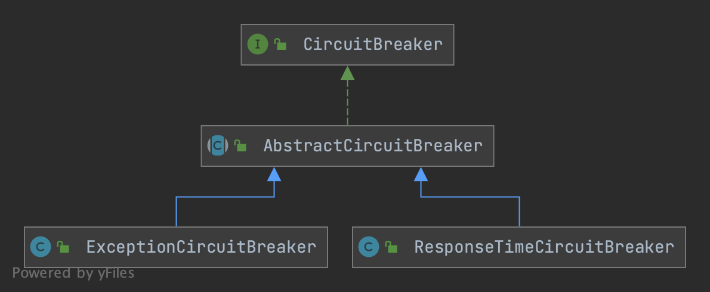

## Introduction


<div style="text-align: center;">



</div>

<p style="text-align: center;">
Fig.1. CircuitBreaker
</p>

```java
public interface CircuitBreaker {

    DegradeRule getRule();

    boolean tryPass(Context context);

    State currentState();

    void onRequestComplete(Context context);

    enum State {
        OPEN,
        HALF_OPEN,
        CLOSED
    }
}

public abstract class AbstractCircuitBreaker implements CircuitBreaker {

    protected final DegradeRule rule;
    protected final int recoveryTimeoutMs;

    private final EventObserverRegistry observerRegistry;

    protected final AtomicReference<State> currentState = new AtomicReference<>(State.CLOSED);
    protected volatile long nextRetryTimestamp;
}
```

## Links

- [Spring Cloud](/docs/CS/Framework/Spring_Cloud/Spring_Cloud.md?id=Circuit-Breaker)