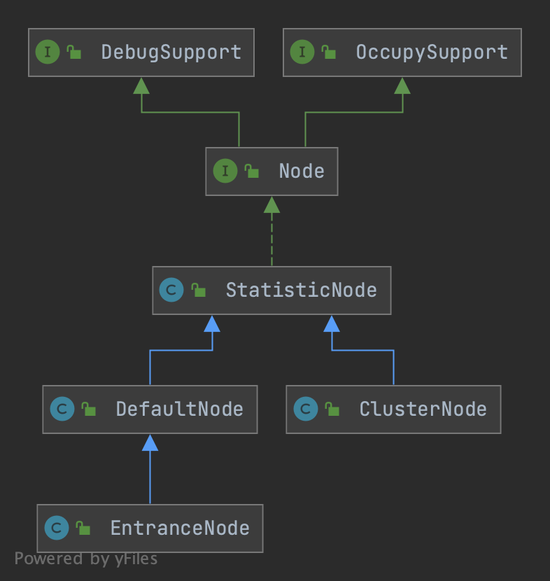

## Overview


## Node
Node holds real-time statistics for resources.




DefaultNode used to hold statistics for specific resource name in the specific context. Each distinct resource in each distinct Context will corresponding to a DefaultNode.
This class may have a list of sub DefaultNodes. Child nodes will be created when calling SphU#entry() or SphO@entry() multiple times in the same Context.

EntranceNode represents the entrance of the invocation tree.
One Context will related to a EntranceNode, which represents the entrance of the invocation tree. New EntranceNode will be created if current context does't have one. Note that same context name will share same EntranceNode globally.

ClusterNode stores summary runtime statistics of the resource, including rt, thread count, qps and so on. Same resource shares the same ClusterNode globally, no matter in which com.alibaba.csp.sentinel.context.Context.
To distinguish invocation from different origin (declared in ContextUtil.enter(String name, String origin)), one ClusterNode holds an originCountMap, this map holds StatisticNode of different origin. Use getOrCreateOriginNode(String) to get Node of the specific origin. Note that 'origin' usually is Service Consumer's app name.


- The ClusterNode is uniquely identified by the ResourceId; 
- the DefaultNode is identified by both the resource id and Context. In other words, one resource id will generate multiple DefaultNode for each distinct context, but only one ClusterNode.

### StatisticNode
The statistic node keep three kinds of real-time statistics metrics:
- metrics in second level (rollingCounterInSecond)
- metrics in minute level (rollingCounterInMinute)
- thread count
Sentinel use sliding window to record and count the resource statistics in real-time. The sliding window infrastructure behind the ArrayMetric is LeapArray.


## Example

Make sure SphU.entry() and Entry.exit() be paired in the same thread, otherwise ErrorEntryFreeException will be thrown.


Conceptually, physical or logical resource that need protection should be surrounded by an entry. The requests to this resource will be blocked if any criteria is met, eg. when any Rule's threshold is exceeded. Once blocked, a BlockException will be thrown.

To configure the criteria, we can use XxxRuleManager.loadRules() to load rules.

Following code is an example, "abc" represent a unique name for the protected resource:
```java
public void foo() {
       Entry entry = null;
       try {
          entry = SphU.entry("abc");
          // resource that need protection
       } catch (BlockException blockException) {
           // when goes there, it is blocked
           // add blocked handle logic here
       } catch (Throwable bizException) {
           // business exception
           Tracer.trace(bizException);
       } finally {
           // ensure finally be executed
           if (entry != null){
               entry.exit();
           }
       }
    }
```
focus on `SphU.entry()`

```java

/**
 * The basic interface for recording statistics and performing rule checking for resources.
 */
public interface Sph extends SphResourceTypeSupport {

    /** Record statistics and perform rule checking for the given resource. */
    Entry entry(String name) throws BlockException;
}
```
1. getContext from [ThreadLocal](/docs/CS/Java/JDK/Concurrency/ThreadLocal.md) or create default Context
2. lookProcessChain and entry all of them
3. call [Slot.entry()](/docs/CS/Framework/Spring_Cloud/Sentinel?id=entry)

```java
public class CtSph implements Sph {

    public static Entry entry(String name) throws BlockException {
        return Env.sph.entry(name, EntryType.OUT, 1, OBJECTS0);
    }
    
    public Entry entry(ResourceWrapper resourceWrapper, int count, Object... args) throws BlockException {
        return entryWithPriority(resourceWrapper, count, false, args);
    }

    @Override
    public Entry entry(String name, EntryType type, int count, Object... args) throws BlockException {
        StringResourceWrapper resource = new StringResourceWrapper(name, type);
        return entry(resource, count, args);
    }

    private Entry entryWithPriority(ResourceWrapper resourceWrapper, int count, boolean prioritized, Object... args)
            throws BlockException {
        Context context = ContextUtil.getContext();
        if (context instanceof NullContext) {
            // The NullContext} indicates that the amount of context has exceeded the threshold,
            // so here init the entry only. No rule checking will be done.
            return new CtEntry(resourceWrapper, null, context);
        }

        if (context == null) {
            // Using default context.
            context = InternalContextUtil.internalEnter(Constants.CONTEXT_DEFAULT_NAME);
        }

        // Global switch is close, no rule checking will do.
        if (!Constants.ON) {
            return new CtEntry(resourceWrapper, null, context);
        }

        ProcessorSlot<Object> chain = lookProcessChain(resourceWrapper);

        /*
         * Means amount of resources (slot chain) exceeds Constants.MAX_SLOT_CHAIN_SIZE},
         * so no rule checking will be done.
         */
        if (chain == null) {
            return new CtEntry(resourceWrapper, null, context);
        }

        Entry e = new CtEntry(resourceWrapper, chain, context);
        try {
            chain.entry(context, resourceWrapper, null, count, prioritized, args);
        } catch (BlockException e1) {
            e.exit(count, args);
            throw e1;
        } catch (Throwable e1) {
            // This should not happen, unless there are errors existing in Sentinel internal.
            RecordLog.info("Sentinel unexpected exception", e1);
        }
        return e;
    }
}
```


### createContext


#### Context
This class holds metadata of current invocation:
- the EntranceNode: the root of the current invocation tree.
- the current Entry: the current invocation point.
- the current Node: the statistics related to the Entry.
- the origin: The origin is useful when we want to control different invoker/consumer separately. Usually the origin could be the Service Consumer's app name or origin IP.
  Each SphU#entry() or SphO#entry() should be in a Context, if we don't invoke ContextUtil#enter() explicitly, DEFAULT context will be used.
  A invocation tree will be created if we invoke SphU#entry() multi times in the same context.
  Same resource in different context will count separately, see NodeSelectorSlot.

```java
public class Context {

    // Context name.
    private final String name;

    // The entrance node of current invocation tree.
    private DefaultNode entranceNode;

    // Current processing entry.
    private Entry curEntry;

    // The origin of this context (usually indicate different invokers, e.g. service consumer name or origin IP).
    private String origin = "";

    private final boolean async;
    ...
}
```


#### trueEnter
Enter the invocation context, which marks as the entrance of an invocation chain. The context is wrapped with [ThreadLocal](/docs/CS/Java/JDK/Concurrency/ThreadLocal.md), meaning that each thread has it's own Context. New context will be created if current thread doesn't have one.

A context will be bound with an EntranceNode, which represents the entrance statistic node of the invocation chain. New EntranceNode will be created if current context does't have one. Note that same context name will share same EntranceNode globally.
The origin node will be created in `com.alibaba.csp.sentinel.slots.clusterbuilder.ClusterBuilderSlot`.

Note that each distinct origin of different resources will lead to creating different new Node, meaning that total amount of created origin statistic nodes will be: **distinct resource name amount * distinct origin count**. So when there are too many origins, memory footprint should be carefully considered.
Same resource in different context will count separately, see NodeSelectorSlot.


**Every modify operations will new HashMap & set volatile contextNameNodeMap after ReentrantLock.lock().**
```java
public class ContextUtil {
    // Store the context in ThreadLocal for easy access.
    private static ThreadLocal<Context> contextHolder = new ThreadLocal<>();

    // Holds all EntranceNode. Each EntranceNode is associated with a distinct context name.
    private static volatile Map<String, DefaultNode> contextNameNodeMap = new HashMap<>();

    private static final ReentrantLock LOCK = new ReentrantLock();
    private static final Context NULL_CONTEXT = new NullContext();

    public static Context enter(String name, String origin) {
        if (Constants.CONTEXT_DEFAULT_NAME.equals(name)) {
            throw new ContextNameDefineException(
                    "The " + Constants.CONTEXT_DEFAULT_NAME + " can't be permit to defined!");
        }
        return trueEnter(name, origin);
    }

    protected static Context trueEnter(String name, String origin) {
        Context context = contextHolder.get();
        if (context == null) {
            Map<String, DefaultNode> localCacheNameMap = contextNameNodeMap;
            DefaultNode node = localCacheNameMap.get(name); // get EntranceNode
            if (node == null) {
                if (localCacheNameMap.size() > Constants.MAX_CONTEXT_NAME_SIZE) {
                    setNullContext();
                    return NULL_CONTEXT;
                } else {
                    LOCK.lock(); // lock for new EntranceNode instance
                    try {
                        node = contextNameNodeMap.get(name);
                        if (node == null) {
                            if (contextNameNodeMap.size() > Constants.MAX_CONTEXT_NAME_SIZE) {
                                setNullContext();
                                return NULL_CONTEXT;
                            } else {
                                node = new EntranceNode(new StringResourceWrapper(name, EntryType.IN), null);
                                // Add entrance node.
                                Constants.ROOT.addChild(node);
                                // volatile
                                Map<String, DefaultNode> newMap = new HashMap<>(contextNameNodeMap.size() + 1);
                                newMap.putAll(contextNameNodeMap);
                                newMap.put(name, node);
                                contextNameNodeMap = newMap; 
                            }
                        }
                    } finally {
                        LOCK.unlock();
                    }
                }
            }
            context = new Context(node, name);
            context.setOrigin(origin);
            contextHolder.set(context);
        }

        return context;
    }
}
```


### lookProcessChain
Get ProcessorSlotChain of the resource. new ProcessorSlotChain will be created if the resource doesn't relate one.
Same resource(ResourceWrapper.equals(Object)) will share the same ProcessorSlotChain globally, no matter in which Context.

Note that total ProcessorSlot count must not exceed Constants.MAX_SLOT_CHAIN_SIZE, otherwise null will return.
```java

public class CtSph implements Sph {

    //Same resource(ResourceWrapper#equals(Object)}) will share the same ProcessorSlotChain, no matter in which Context.
    private static volatile Map<ResourceWrapper, ProcessorSlotChain> chainMap
            = new HashMap<ResourceWrapper, ProcessorSlotChain>();
    
    ProcessorSlot<Object> lookProcessChain(ResourceWrapper resourceWrapper) {
        ProcessorSlotChain chain = chainMap.get(resourceWrapper);
        if (chain == null) {
            synchronized (LOCK) {
                chain = chainMap.get(resourceWrapper);
                if (chain == null) {
                    // Entry size limit.
                    if (chainMap.size() >= Constants.MAX_SLOT_CHAIN_SIZE) {
                        return null;
                    }

                    chain = SlotChainProvider.newSlotChain();
                    Map<ResourceWrapper, ProcessorSlotChain> newMap = new HashMap<ResourceWrapper, ProcessorSlotChain>(
                            chainMap.size() + 1);
                    newMap.putAll(chainMap);
                    newMap.put(resourceWrapper, chain);
                    chainMap = newMap;
                }
            }
        }
        return chain;
    }
}
```

### SlotChainProvider
A provider for creating slot chains via resolved slot chain builder SPI.

```java
public final class SlotChainProvider {
 public static ProcessorSlotChain newSlotChain() {
        if (slotChainBuilder != null) {
            return slotChainBuilder.build();
        }

        // Resolve the slot chain builder SPI.
        slotChainBuilder = SpiLoader.of(SlotChainBuilder.class).loadFirstInstanceOrDefault();

        if (slotChainBuilder == null) {
            // Should not go through here.
            RecordLog.warn("[SlotChainProvider] Wrong state when resolving slot chain builder, using default");
            slotChainBuilder = new DefaultSlotChainBuilder();
        } else {
            RecordLog.info("[SlotChainProvider] Global slot chain builder resolved: {}",
                slotChainBuilder.getClass().getCanonicalName());
        }
        return slotChainBuilder.build();
    }
}

@Spi(isDefault = true)
public class DefaultSlotChainBuilder implements SlotChainBuilder {

    @Override
    public ProcessorSlotChain build() {
        ProcessorSlotChain chain = new DefaultProcessorSlotChain();

        List<ProcessorSlot> sortedSlotList = SpiLoader.of(ProcessorSlot.class).loadInstanceListSorted();
        for (ProcessorSlot slot : sortedSlotList) {
            if (!(slot instanceof AbstractLinkedProcessorSlot)) {
                RecordLog.warn("The ProcessorSlot(" + slot.getClass().getCanonicalName() + ") is not an instance of AbstractLinkedProcessorSlot, can't be added into ProcessorSlotChain");
                continue;
            }

            chain.addLast((AbstractLinkedProcessorSlot<?>) slot);
        }

        return chain;
    }
}
```


## Slot

### entry
```java
/**
 * A container of some process and ways of notification when the process is finished.
 */
public interface ProcessorSlot<T> {
    /** Entrance of this slot.  */
    void entry(Context context, ResourceWrapper resourceWrapper, T param, int count, boolean prioritized,
               Object... args) throws Throwable;
}
```


#### fireEntry
call next `AbstractLinkedProcessorSlot.entry()`
```java
public abstract class AbstractLinkedProcessorSlot<T> implements ProcessorSlot<T> {

    private AbstractLinkedProcessorSlot<?> next = null;

    /** Means finish of entry(Context, ResourceWrapper, Object, int, boolean, Object...). */
    @Override
    public void fireEntry(Context context, ResourceWrapper resourceWrapper, Object obj, int count, boolean prioritized, Object... args)
            throws Throwable {
        if (next != null) {
            next.transformEntry(context, resourceWrapper, obj, count, prioritized, args);
        }
    }

    @SuppressWarnings("unchecked")
    void transformEntry(Context context, ResourceWrapper resourceWrapper, Object o, int count, boolean prioritized, Object... args)
            throws Throwable {
        T t = (T)o;
        entry(context, resourceWrapper, t, count, prioritized, args);
    }
}
```

### NodeSelectorSlot

1. adding a new DefaultNode if needed as the last child in the context. The context's last node is the current node or the parent node of the context.
2. setting itself to the context current node.


It's interesting that we use context name rather resource name as the map key.
Remember that same resource(ResourceWrapper#equals(Object)) will share the same ProcessorSlotChain globally, no matter in which context. So if code goes into #entry(Context, ResourceWrapper, DefaultNode, int, Object...)}, the resource name must be same but context name may not.

If we use `com.alibaba.csp.sentinel.SphU#entry(String resource)` to enter same resource in different context, using context name as map key can distinguish the same resource. In this case, multiple DefaultNodes will be created of the same resource name, for every distinct context (different context name) each.
The calling trace can be displayed by calling `curl http://localhost:8719/tree?type=root`.

```java
@Spi(isSingleton = false, order = Constants.ORDER_NODE_SELECTOR_SLOT) /** -10000 */
public class NodeSelectorSlot extends AbstractLinkedProcessorSlot<Object> {

    /**  DefaultNodes of the same resource in different context. */
    private volatile Map<String, DefaultNode> map = new HashMap<String, DefaultNode>(10);

    @Override
    public void entry(Context context, ResourceWrapper resourceWrapper, Object obj, int count, boolean prioritized, Object... args)
            throws Throwable {
        DefaultNode node = map.get(context.getName());
        if (node == null) {
            synchronized (this) {
                node = map.get(context.getName());
                if (node == null) {
                    node = new DefaultNode(resourceWrapper, null);
                    HashMap<String, DefaultNode> cacheMap = new HashMap<String, DefaultNode>(map.size());
                    cacheMap.putAll(map);
                    cacheMap.put(context.getName(), node);
                    map = cacheMap;
                    // Build invocation tree
                    ((DefaultNode) context.getLastNode()).addChild(node);
                }

            }
        }

        context.setCurNode(node);
        fireEntry(context, resourceWrapper, node, count, prioritized, args);
    }
}
```

### ClusterBuilderSlot
This slot maintains resource running statistics (response time, qps, thread count, exception), and a list of callers as well which is marked by ContextUtil.enter(String origin)
One resource has only one cluster node, while one resource can have multiple default nodes.
```java
@Spi(isSingleton = false, order = Constants.ORDER_CLUSTER_BUILDER_SLOT) /** -9000 */
public class ClusterBuilderSlot extends AbstractLinkedProcessorSlot<DefaultNode> {
    @Override
    public void entry(Context context, ResourceWrapper resourceWrapper, DefaultNode node, int count,
                      boolean prioritized, Object... args)
            throws Throwable {
        if (clusterNode == null) {
            synchronized (lock) {
                if (clusterNode == null) {
                    // Create the cluster node.
                    clusterNode = new ClusterNode(resourceWrapper.getName(), resourceWrapper.getResourceType());
                    HashMap<ResourceWrapper, ClusterNode> newMap = new HashMap<>(Math.max(clusterNodeMap.size(), 16));
                    newMap.putAll(clusterNodeMap);
                    newMap.put(node.getId(), clusterNode);

                    clusterNodeMap = newMap;
                }
            }
        }
        node.setClusterNode(clusterNode);

        /*
         * if context origin is set, we should get or create a new {@link Node} of
         * the specific origin.
         */
        if (!"".equals(context.getOrigin())) {
            Node originNode = node.getClusterNode().getOrCreateOriginNode(context.getOrigin());
            context.getCurEntry().setOriginNode(originNode);
        }

        fireEntry(context, resourceWrapper, node, count, prioritized, args);
    }
}
```

### StatisticSlot
A processor slot that dedicates to real time statistics. When entering this slot, we need to separately count the following information:
- ClusterNode: total statistics of a cluster node of the resource ID.
- Origin node: statistics of a cluster node from different callers/origins.
- DefaultNode: statistics for specific resource name in the specific context.
- Finally, the sum statistics of all entrances.

```java
@Spi(order = Constants.ORDER_STATISTIC_SLOT) /** -7000 */
public class StatisticSlot extends AbstractLinkedProcessorSlot<DefaultNode> {
    @Override
    public void entry(Context context, ResourceWrapper resourceWrapper, DefaultNode node, int count,
                      boolean prioritized, Object... args) throws Throwable {
        try {
            // Do some checking.
            fireEntry(context, resourceWrapper, node, count, prioritized, args);

            // Request passed, add thread count and pass count.
            node.increaseThreadNum();
            node.addPassRequest(count);

            if (context.getCurEntry().getOriginNode() != null) {
                // Add count for origin node.
                context.getCurEntry().getOriginNode().increaseThreadNum();
                context.getCurEntry().getOriginNode().addPassRequest(count);
            }

            if (resourceWrapper.getEntryType() == EntryType.IN) {
                // Add count for global inbound entry node for global statistics.
                Constants.ENTRY_NODE.increaseThreadNum();
                Constants.ENTRY_NODE.addPassRequest(count);
            }

            // Handle pass event with registered entry callback handlers.
            for (ProcessorSlotEntryCallback<DefaultNode> handler : StatisticSlotCallbackRegistry.getEntryCallbacks()) {
                handler.onPass(context, resourceWrapper, node, count, args);
            }
        } catch (PriorityWaitException ex) {
            node.increaseThreadNum();
            if (context.getCurEntry().getOriginNode() != null) {
                // Add count for origin node.
                context.getCurEntry().getOriginNode().increaseThreadNum();
            }

            if (resourceWrapper.getEntryType() == EntryType.IN) {
                // Add count for global inbound entry node for global statistics.
                Constants.ENTRY_NODE.increaseThreadNum();
            }
            // Handle pass event with registered entry callback handlers.
            for (ProcessorSlotEntryCallback<DefaultNode> handler : StatisticSlotCallbackRegistry.getEntryCallbacks()) {
                handler.onPass(context, resourceWrapper, node, count, args);
            }
        } catch (BlockException e) {
            // Blocked, set block exception to current entry.
            context.getCurEntry().setBlockError(e);

            // Add block count.
            node.increaseBlockQps(count);
            if (context.getCurEntry().getOriginNode() != null) {
                context.getCurEntry().getOriginNode().increaseBlockQps(count);
            }

            if (resourceWrapper.getEntryType() == EntryType.IN) {
                // Add count for global inbound entry node for global statistics.
                Constants.ENTRY_NODE.increaseBlockQps(count);
            }

            // Handle block event with registered entry callback handlers.
            for (ProcessorSlotEntryCallback<DefaultNode> handler : StatisticSlotCallbackRegistry.getEntryCallbacks()) {
                handler.onBlocked(e, context, resourceWrapper, node, count, args);
            }

            throw e;
        } catch (Throwable e) {
            // Unexpected internal error, set error to current entry.
            context.getCurEntry().setError(e);

            throw e;
        }
    }
}
```

## Links

- [Spring Cloud](/docs/CS/Framework/Spring_Cloud/Spring_Cloud.md)

## References
1. [How it works](https://github.com/alibaba/Sentinel/wiki/How-it-works)