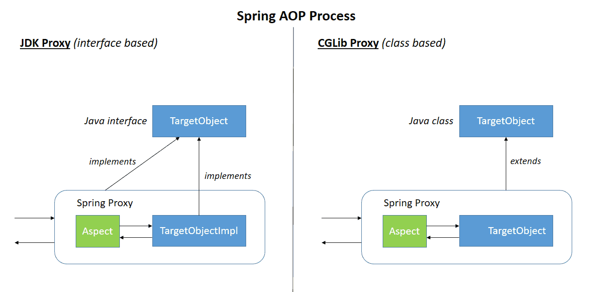
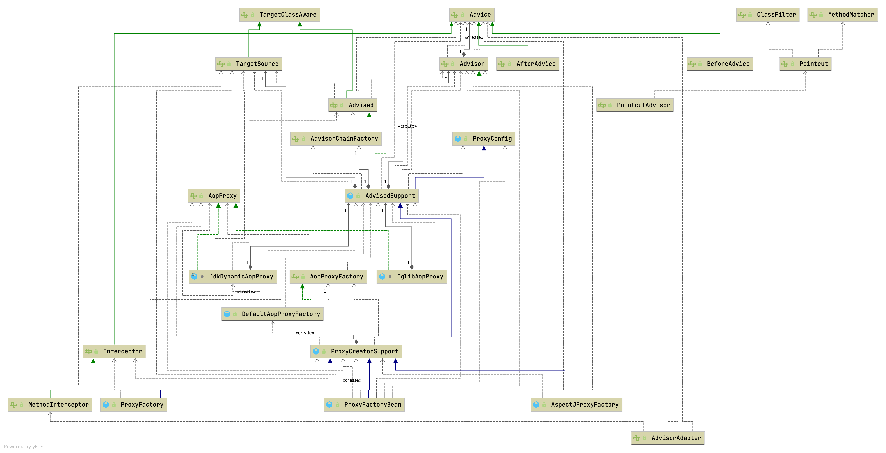
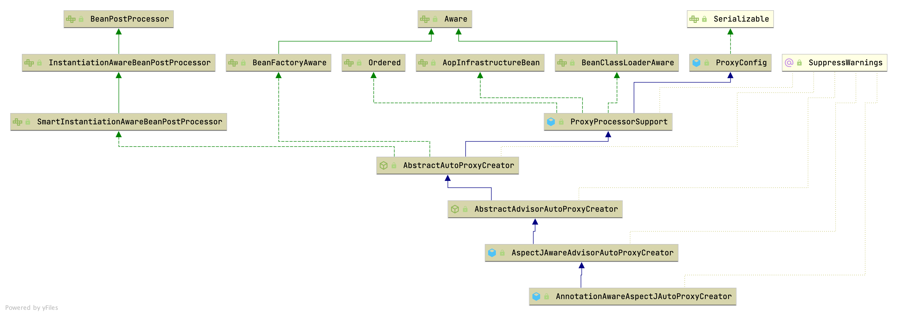

## Introduction

Aspect-Oriented Programming（AOP，面向切面编程）通过提供另一种思考程序结构的方式，补充了 Object-Oriented Programming（OOP，面向对象编程）。
OOP 中模块化的基本单位是类，而在 AOP 中模块化的基本单位是 aspect（切面）。
切面能够模块化跨多个类型和对象的关注点（例如事务管理），这些关注点在 AOP 文献中通常被称为 crosscutting concerns（横切关注点）。

Spring 的关键组件之一是 AOP 框架。
虽然 Spring IoC 容器不依赖于 AOP（意味着如果你不想使用 AOP，可以不用），但 AOP 补充了 Spring IoC，提供了一个非常强大的中间件解决方案。

由于 [AspectJ](/docs/CS/Java/AspectJ.md) 使用编译时和类加载时织入，Spring AOP 则使用运行时织入。

AOP 在 Spring 框架中用于：

- 提供声明式企业服务，特别是作为 EJB 声明式服务的替代方案。其中最重要的服务是[声明式事务管理](/docs/CS/Framework/Spring/Transaction.md?id=Declarative-transaction)。
- 允许用户实现自定义切面，用 AOP 补充他们的 OOP 使用。

如果要代理的目标对象实现了至少一个接口，则使用 JDK 动态代理。目标类型实现的所有接口都会被代理。
如果目标对象没有实现任何接口，则创建 CGLIB 代理。



## AOP Concepts

让我们首先定义一些核心的 AOP 概念和术语。
这些术语并非 Spring 特有。
不幸的是，AOP 的术语并不特别直观。
然而，如果 Spring 使用自己的术语，会更加令人困惑。

- Aspect：跨多个类的关注点的模块化。
  事务管理是企业 Java 应用中横切关注点的一个很好的例子。
  在 Spring AOP 中，切面通过常规类（基于 schema 的方式）或使用 @Aspect 注解的常规类（@AspectJ 风格）来实现。
- Join point：程序执行过程中的一个点，例如方法的执行或异常的处理。在 Spring AOP 中，join point 始终表示方法的执行。
- Advice：切面在特定 join point 处执行的动作。
  不同类型的 advice 包括 "around"、"before" 和 "after" advice（advice 类型稍后讨论）。
  许多 AOP 框架（包括 Spring）将 advice 建模为拦截器，并在 join point 周围维护一个拦截器链。
- Pointcut：匹配 join point 的谓词。Advice 与 pointcut 表达式相关联，并在任何由 pointcut 匹配的 join point 处运行（例如，具有特定名称的方法的执行）。
  由 pointcut 表达式匹配的 join point 概念是 AOP 的核心，Spring 默认使用 AspectJ 的 pointcut 表达式语言。
- Introduction：为类型声明额外的方法或字段。Spring AOP 允许你向任何被 advice 的对象引入新接口（以及相应的实现）。
  例如，你可以使用 introduction 使 bean 实现 IsModified 接口以简化缓存。（Introduction 在 AspectJ 社区中称为 inter-type declaration。）
- Target object：被一个或多个切面 advice 的对象。也称为"被 advice 的对象"。
  由于 Spring AOP 通过运行时代理实现，该对象始终是一个代理对象。
- AOP proxy：由 AOP 框架创建的对象，用于实现切面契约（advise 方法执行等）。在 Spring 框架中，AOP 代理是 JDK 动态代理或 CGLIB 代理。
- Weaving：将切面与其他应用类型或对象链接起来，以创建被 advice 的对象。
  这可以在编译时（例如使用 AspectJ 编译器）、加载时或运行时完成。Spring AOP 与其他纯 Java AOP 框架一样，在运行时执行织入。

### Advice

Spring AOP 包含以下类型的 advice：

- Before advice：在 join point 之前运行的 advice，但无法阻止执行流程继续到 join point（除非抛出异常）。
- After returning advice：在 join point 正常完成后运行的 advice（例如，方法返回且没有抛出异常时）。
- After throwing advice：如果方法通过抛出异常退出时运行的 advice。
- After (finally) advice：无论 join point 以何种方式退出（正常返回或异常返回）都会运行的 advice。
- Around advice：围绕 join point（如方法调用）的 advice。这是最强大的一种 advice。
  Around advice 可以在方法调用前后执行自定义行为。
  它还负责选择是继续执行 join point，还是通过返回自己的返回值或抛出异常来短路被 advice 的方法执行。

Around advice 是最通用的 advice 类型。由于 Spring AOP 与 AspectJ 一样提供了完整的 advice 类型范围，我们建议使用能够实现所需行为的最不强大的 advice 类型。
例如，如果你只需要用方法的返回值更新缓存，实现 after returning advice 比 around advice 更好，尽管 around advice 也能完成同样的工作。
使用最具体的 advice 类型可以提供更简单的编程模型，减少出错的可能性。
例如，你不需要调用用于 around advice 的 proceed() 方法，因此不会忘记调用它。

所有 advice 参数都是静态类型的，因此你可以使用适当类型的 advice 参数（例如方法执行的返回值类型），而不是使用 Object 数组。

由 pointcut 匹配的 join point 概念是 AOP 的关键，这使其区别于仅提供拦截的旧技术。
Pointcuts 使 advice 能够独立于面向对象的层次结构进行定位。
例如，你可以将提供声明式事务管理的 around advice 应用于跨多个对象的一组方法（例如服务层的所有业务操作）。

### Pointcut

```java
public interface Pointcut {
	ClassFilter getClassFilter();

	MethodMatcher getMethodMatcher();

	Pointcut TRUE = TruePointcut.INSTANCE;
}
```

Pointcut 类型：

- StaticMethodMatcherPointcut
- DynamicMethodMatcherPointcut
- AnnotationMatchingPointcut
- ExpressionPointcut
- ControlFlowPointcut
- ComposablePointcut
- TruePointcut

### AOP Hierarchy



## start

### Example

```java
@Configuration
@EnableAspectJAutoProxy
public class AppConfig {

  @Bean
  public FooService fooService() {
    return new FooService();
  }

  @Bean
  public MyAspect myAspect() {
    return new MyAspect();
  }
}

 public class FooService {
       // various methods
   }
   @Aspect
   public class MyAspect {
  
       @Before("execution(* FooService+.*(..))")
       public void advice() {
           // advise FooService methods as appropriate
       }
   }
```

```java
@Target(ElementType.TYPE)
@Retention(RetentionPolicy.RUNTIME)
@Documented
@Import(AspectJAutoProxyRegistrar.class)
public @interface EnableAspectJAutoProxy {
   boolean proxyTargetClass() default false;
   boolean exposeProxy() default false;
}
```

### registerBeanDefinitions

根据给定的 `@EnableAspectJAutoProxy` 注解，向当前 `BeanDefinitionRegistry` 注册一个 **AnnotationAwareAspectJAutoProxyCreator**。

```java
class AspectJAutoProxyRegistrar implements ImportBeanDefinitionRegistrar {

   @Override
   public void registerBeanDefinitions(
         AnnotationMetadata importingClassMetadata, BeanDefinitionRegistry registry) {

      AopConfigUtils.registerAspectJAnnotationAutoProxyCreatorIfNecessary(registry);

      AnnotationAttributes enableAspectJAutoProxy =
            AnnotationConfigUtils.attributesFor(importingClassMetadata, EnableAspectJAutoProxy.class);
      if (enableAspectJAutoProxy != null) {
         if (enableAspectJAutoProxy.getBoolean("proxyTargetClass")) {
            AopConfigUtils.forceAutoProxyCreatorToUseClassProxying(registry);
         }
         if (enableAspectJAutoProxy.getBoolean("exposeProxy")) {
            AopConfigUtils.forceAutoProxyCreatorToExposeProxy(registry);
         }
      }
   }
}
```

#### AnnotationAwareAspectJAutoProxyCreator

```java
// AnnotationAwareAspectJAutoProxyCreator
private List<Pattern> includePatterns;
private AspectJAdvisorFactory aspectJAdvisorFactory;
private BeanFactoryAspectJAdvisorsBuilder aspectJAdvisorsBuilder;

@Override
protected void initBeanFactory(ConfigurableListableBeanFactory beanFactory) {
   super.initBeanFactory(beanFactory);
   if (this.aspectJAdvisorFactory == null) {
      this.aspectJAdvisorFactory = new ReflectiveAspectJAdvisorFactory(beanFactory);
   }
   this.aspectJAdvisorsBuilder =
         new BeanFactoryAspectJAdvisorsBuilderAdapter(beanFactory, this.aspectJAdvisorFactory);
}
```

*AspectJAwareAdvisorAutoProxyCreator 的子类，用于处理当前应用上下文中的所有 **AspectJ 注解切面**以及 Spring Advisors。*
任何 AspectJ 注解类都会被自动识别，如果 Spring AOP 的基于代理的模型能够应用其 advice，则会应用它们。这涵盖了方法执行 joinpoint。
如果使用了 [aop:include](aop:include) 元素，则只有名称与包含模式匹配的 @AspectJ bean 才会被视为用于 Spring 自动代理的切面。

Spring Advisors 的处理遵循 `org.springframework.aop.framework.autoproxy.AbstractAdvisorAutoProxyCreator` 中建立的规则。

#### findEligibleAdvisors

查找所有符合条件的 Advisor 以对该类进行自动代理。

```
// AbstractAdvisorAutoProxyCreator
protected List<Advisor> findEligibleAdvisors(Class<?> beanClass, String beanName) {
   List<Advisor> candidateAdvisors = findCandidateAdvisors();
   List<Advisor> eligibleAdvisors = findAdvisorsThatCanApply(candidateAdvisors, beanClass, beanName);
   extendAdvisors(eligibleAdvisors);
   if (!eligibleAdvisors.isEmpty()) {
      eligibleAdvisors = sortAdvisors(eligibleAdvisors);
   }
   return eligibleAdvisors;
}

// AbstractAdvisorAutoProxyCreator
protected List<Advisor> findCandidateAdvisors() {
		return this.advisorRetrievalHelper.findAdvisorBeans();
	}

// AbstractAdvisorAutoProxyCreator
protected List<Advisor> findAdvisorsThatCanApply(
			List<Advisor> candidateAdvisors, Class<?> beanClass, String beanName) {

		ProxyCreationContext.setCurrentProxiedBeanName(beanName);
		try {
			return AopUtils.findAdvisorsThatCanApply(candidateAdvisors, beanClass);
		}
		finally {
			ProxyCreationContext.setCurrentProxiedBeanName(null);
		}
	}

//  AnnotationAwareAspectJAutoProxyCreator
@Override
protected List<Advisor> findCandidateAdvisors() {
   // Add all the Spring advisors found according to superclass rules.
   List<Advisor> advisors = super.findCandidateAdvisors();
   // Build Advisors for all AspectJ aspects in the bean factory.
   if (this.aspectJAdvisorsBuilder != null) {
      advisors.addAll(this.aspectJAdvisorsBuilder.buildAspectJAdvisors());
   }
   return advisors;
}


// BeanFactoryAdvisorRetrievalHelper
// Helper for retrieving standard Spring Advisors from a BeanFactory, 
// for use with auto-proxying.
public List<Advisor> findAdvisorBeans() {
		// Determine list of advisor bean names, if not cached already.
		String[] advisorNames = this.cachedAdvisorBeanNames;
		if (advisorNames == null) {
			// Do not initialize FactoryBeans here: We need to leave all regular beans
			// uninitialized to let the auto-proxy creator apply to them!
			advisorNames = BeanFactoryUtils.beanNamesForTypeIncludingAncestors(
					this.beanFactory, Advisor.class, true, false);
			this.cachedAdvisorBeanNames = advisorNames;
		}
		if (advisorNames.length == 0) {
			return new ArrayList<>();
		}

		List<Advisor> advisors = new ArrayList<>();
		for (String name : advisorNames) {
			if (isEligibleBean(name)) {
				if (this.beanFactory.isCurrentlyInCreation(name)) {}
				else {
					try {
						advisors.add(this.beanFactory.getBean(name, Advisor.class));
					}
					catch (BeanCreationException ex) {
						Throwable rootCause = ex.getMostSpecificCause();
						if (rootCause instanceof BeanCurrentlyInCreationException) {
							BeanCreationException bce = (BeanCreationException) rootCause;
							String bceBeanName = bce.getBeanName();
							if (bceBeanName != null && this.beanFactory.isCurrentlyInCreation(bceBeanName)) {
								// Ignore: indicates a reference back to the bean we're trying to advise.
								// We want to find advisors other than the currently created bean itself.
								continue;
							}
						}
						throw ex;
					}
				}
			}
		}
		return advisors;
	}
```

## ProxyFactoryBean

ProxyFactoryBean 是一个 FactoryBean 实现，它基于 Spring BeanFactory 中的 beans 构建 AOP 代理。

MethodInterceptor 和 Advisor 通过当前 bean factory 中的 bean 名称列表来识别，通过 "interceptorNames" 属性指定。
列表中的最后一个条目可以是目标 bean 或 TargetSource 的名称；不过，通常更推荐使用 "targetName"/"target"/"targetSource" 属性。

返回一个代理。当客户端从此工厂 bean 获取 beans 时调用。创建要由此工厂返回的 AOP 代理的实例。
对于 singleton，该实例会被缓存；对于 proxy，每次调用 getObject() 都会创建新实例。

```
public Object getObject() throws BeansException {
   initializeAdvisorChain();
   if (isSingleton()) {
      return getSingletonInstance();
   }
   else {
      return newPrototypeInstance();
   }
}
```

### initializeAdvisorChain

创建 advisor（拦截器）链。从 BeanFactory 获取的 Advisor 会在每次添加新的 prototype 实例时刷新。
通过工厂 API 以编程方式添加的拦截器不受此类更改的影响。

```java
public class ProxyFactoryBean extends ProxyCreatorSupport implements FactoryBean<Object>, BeanClassLoaderAware, BeanFactoryAware {
  private synchronized void initializeAdvisorChain() throws AopConfigException, BeansException {
    // return if advisorChainInitialized   

    for (String name : this.interceptorNames) {
      if (name.endsWith(GLOBAL_SUFFIX)) {
        addGlobalAdvisors((ListableBeanFactory) this.beanFactory, name.substring(0, name.length() - GLOBAL_SUFFIX.length()));
      } else {
        Object advice;
        if (this.singleton || this.beanFactory.isSingleton(name)) {
          advice = this.beanFactory.getBean(name);
        } else {
          advice = new PrototypePlaceholderAdvisor(name);
        }
        addAdvisorOnChainCreation(advice);
      }
    }
    this.advisorChainInitialized = true;
  }
}
```

### getSingletonInstance

```
private synchronized Object getSingletonInstance() {
   if (this.singletonInstance == null) {
      this.targetSource = freshTargetSource();
      if (this.autodetectInterfaces && getProxiedInterfaces().length == 0 && !isProxyTargetClass()) {
         // Rely on AOP infrastructure to tell us what interfaces to proxy.
         Class<?> targetClass = getTargetClass();
         if (targetClass == null) {
            throw new FactoryBeanNotInitializedException("Cannot determine target class for proxy");
         }
         setInterfaces(ClassUtils.getAllInterfacesForClass(targetClass, this.proxyClassLoader));
      }
      // Initialize the shared singleton instance.
      super.setFrozen(this.freezeProxy);
      this.singletonInstance = getProxy(createAopProxy());
   }
   return this.singletonInstance;
}
```

### ProxyFactory

根据此工厂中的设置创建一个新的代理。
可以重复调用。如果添加或删除了接口，效果会有所不同。
可以添加和删除拦截器。
使用给定的类加载器（如果需要用于代理创建）。

```java
public class DefaultAopProxyFactory implements AopProxyFactory, Serializable {
  @Override
  public AopProxy createAopProxy(AdvisedSupport config) throws AopConfigException {
    if (config.isOptimize() || config.isProxyTargetClass() || hasNoUserSuppliedProxyInterfaces(config)) {
      Class<?> targetClass = config.getTargetClass();
      if (targetClass.isInterface() || Proxy.isProxyClass(targetClass) || ClassUtils.isLambdaClass(targetClass)) {
        return new JdkDynamicAopProxy(config);
      }
      return new ObjenesisCglibAopProxy(config);
    } else {
      return new JdkDynamicAopProxy(config);
    }
  }
}
```

#### createAopProxy

<!-- tabs:start -->

##### **JdkDynamicAopProxy**

```java
final class JdkDynamicAopProxy implements AopProxy, InvocationHandler, Serializable {
  @Override
  public Object getProxy(@Nullable ClassLoader classLoader) {
    return Proxy.newProxyInstance(determineClassLoader(classLoader), this.proxiedInterfaces, this);
  }
}
```

##### **CglibAopProxy**

Cglib 内联到 Spring

```java
class CglibAopProxy implements AopProxy, Serializable {
  @Override
  public Object getProxy() {
    return buildProxy(null, false);
  }

  private Object buildProxy(@Nullable ClassLoader classLoader, boolean classOnly) {
    try {
      Class<?> rootClass = this.advised.getTargetClass();
      Assert.state(rootClass != null, "Target class must be available for creating a CGLIB proxy");

      Class<?> proxySuperClass = rootClass;
      if (rootClass.getName().contains(ClassUtils.CGLIB_CLASS_SEPARATOR)) {
        proxySuperClass = rootClass.getSuperclass();
        Class<?>[] additionalInterfaces = rootClass.getInterfaces();
        for (Class<?> additionalInterface : additionalInterfaces) {
          this.advised.addInterface(additionalInterface);
        }
      }

      // Validate the class, writing log messages as necessary.
      validateClassIfNecessary(proxySuperClass, classLoader);

      // Configure CGLIB Enhancer...
      Enhancer enhancer = createEnhancer();
      if (classLoader != null) {
        enhancer.setClassLoader(classLoader);
        if (classLoader instanceof SmartClassLoader smartClassLoader &&
                smartClassLoader.isClassReloadable(proxySuperClass)) {
          enhancer.setUseCache(false);
        }
      }
      enhancer.setSuperclass(proxySuperClass);
      enhancer.setInterfaces(AopProxyUtils.completeProxiedInterfaces(this.advised));
      enhancer.setNamingPolicy(SpringNamingPolicy.INSTANCE);
      enhancer.setAttemptLoad(true);
      enhancer.setStrategy(new ClassLoaderAwareGeneratorStrategy(classLoader));

      Callback[] callbacks = getCallbacks(rootClass);
      Class<?>[] types = new Class<?>[callbacks.length];
      for (int x = 0; x < types.length; x++) {
        types[x] = callbacks[x].getClass();
      }
      // fixedInterceptorMap only populated at this point, after getCallbacks call above
      ProxyCallbackFilter filter = new ProxyCallbackFilter(
              this.advised.getConfigurationOnlyCopy(), this.fixedInterceptorMap, this.fixedInterceptorOffset);
      enhancer.setCallbackFilter(filter);
      enhancer.setCallbackTypes(types);

      // Generate the proxy class and create a proxy instance.
      // ProxyCallbackFilter has method introspection capability with Advisor access.
      try {
        return (classOnly ? createProxyClass(enhancer) : createProxyClassAndInstance(enhancer, callbacks));
      } finally {
        // Reduce ProxyCallbackFilter to key-only state for its class cache role
        // in the CGLIB$CALLBACK_FILTER field, not leaking any Advisor state...
        filter.advised.reduceToAdvisorKey();
      }
    } catch (CodeGenerationException | IllegalArgumentException ex) {
      throw new AopConfigException("Could not generate CGLIB subclass of " + this.advised.getTargetClass() +
              ": Common causes of this problem include using a final class or a non-visible class",
              ex);
    } catch (Throwable ex) {
      // TargetSource.getTarget() failed
      throw new AopConfigException("Unexpected AOP exception", ex);
    }
  }
}
```

<!-- tabs:end -->

## Create Proxy

Spring AOP 使用 JDK 动态代理或 CGLIB 为给定的目标对象创建代理。
（如果有选择，首选 JDK 动态代理。）



`AbstractAutoProxyCreator` 实现了 [BeanPostProcessor](/docs/CS/Framework/Spring/IoC.md?id=BeanPostProcessor)

### postProcessBeforeInstantiation

```java
public abstract class AbstractAutoProxyCreator extends ProxyProcessorSupport implements SmartInstantiationAwareBeanPostProcessor, BeanFactoryAware {

    @Override
    public Object getEarlyBeanReference(Object bean, String beanName) {
        Object cacheKey = getCacheKey(bean.getClass(), beanName);
        this.earlyProxyReferences.put(cacheKey, bean);
        return wrapIfNecessary(bean, beanName, cacheKey);
    }

    @Override
    public Object postProcessBeforeInstantiation(Class<?> beanClass, String beanName) {
        Object cacheKey = getCacheKey(beanClass, beanName);

        if (!StringUtils.hasLength(beanName) || !this.targetSourcedBeans.contains(beanName)) {
            if (this.advisedBeans.containsKey(cacheKey)) {
                return null;
            }
            if (isInfrastructureClass(beanClass) || shouldSkip(beanClass, beanName)) {
                this.advisedBeans.put(cacheKey, Boolean.FALSE);
                return null;
            }
        }

        // Create proxy here if we have a custom TargetSource.
        // Suppresses unnecessary default instantiation of the target bean:
        // The TargetSource will handle target instances in a custom fashion.
        TargetSource targetSource = getCustomTargetSource(beanClass, beanName);
        if (targetSource != null) {
            if (StringUtils.hasLength(beanName)) {
                this.targetSourcedBeans.add(beanName);
            }
            Object[] specificInterceptors = getAdvicesAndAdvisorsForBean(beanClass, beanName, targetSource);
            Object proxy = createProxy(beanClass, beanName, specificInterceptors, targetSource);
            this.proxyTypes.put(cacheKey, proxy.getClass());
            return proxy;
        }

        return null;
    }
}
```

#### getAdvicesAndAdvisorsForBean

返回给定的 bean 是否应该被代理，以及要应用哪些额外的 advice（例如 AOP Alliance 拦截器）和 advisor。

```
@Override
	@Nullable
	protected Object[] getAdvicesAndAdvisorsForBean(
			Class<?> beanClass, String beanName, @Nullable TargetSource targetSource) {

		List<Advisor> advisors = findEligibleAdvisors(beanClass, beanName);
		if (advisors.isEmpty()) {
			return DO_NOT_PROXY;
		}
		return advisors.toArray();
	}
```

### postProcessAfterInitialization

如果 bean 被子类识别为要代理的对象，则使用配置的拦截器创建代理。

```
@Override
public Object postProcessAfterInitialization(@Nullable Object bean, String beanName) {
   if (bean != null) {
      Object cacheKey = getCacheKey(bean.getClass(), beanName);
      if (this.earlyProxyReferences.remove(cacheKey) != bean) {
         return wrapIfNecessary(bean, beanName, cacheKey);
      }
   }
   return bean;
}
```

### wrapIfNecessary

如果必要，包装给定的 bean，即如果它有资格被代理。

```
protected Object wrapIfNecessary(Object bean, String beanName, Object cacheKey) {
   if (StringUtils.hasLength(beanName) && this.targetSourcedBeans.contains(beanName)) {
      return bean;
   }
   if (Boolean.FALSE.equals(this.advisedBeans.get(cacheKey))) {
      return bean;
   }
   if (isInfrastructureClass(bean.getClass()) || shouldSkip(bean.getClass(), beanName)) {
      this.advisedBeans.put(cacheKey, Boolean.FALSE);
      return bean;
   }

   // Create proxy if we have advice.
   Object[] specificInterceptors = getAdvicesAndAdvisorsForBean(bean.getClass(), beanName, null);
   if (specificInterceptors != DO_NOT_PROXY) {
      this.advisedBeans.put(cacheKey, Boolean.TRUE);
      Object proxy = createProxy(
            bean.getClass(), beanName, specificInterceptors, new SingletonTargetSource(bean));
      this.proxyTypes.put(cacheKey, proxy.getClass());
      return proxy;
   }

   this.advisedBeans.put(cacheKey, Boolean.FALSE);
   return bean;
}
```

### createProxy

为给定的 bean 创建一个 AOP 代理。

```
protected Object createProxy(Class<?> beanClass, @Nullable String beanName,
      @Nullable Object[] specificInterceptors, TargetSource targetSource) {

   if (this.beanFactory instanceof ConfigurableListableBeanFactory) {
      AutoProxyUtils.exposeTargetClass((ConfigurableListableBeanFactory) this.beanFactory, beanName, beanClass);
   }

   ProxyFactory proxyFactory = new ProxyFactory();
   proxyFactory.copyFrom(this);

   if (!proxyFactory.isProxyTargetClass()) {
      if (shouldProxyTargetClass(beanClass, beanName)) {
         proxyFactory.setProxyTargetClass(true);
      }
      else {
         evaluateProxyInterfaces(beanClass, proxyFactory);
      }
   }

   Advisor[] advisors = buildAdvisors(beanName, specificInterceptors);
   proxyFactory.addAdvisors(advisors);
   proxyFactory.setTargetSource(targetSource);
   customizeProxyFactory(proxyFactory);

   proxyFactory.setFrozen(this.freezeProxy);
   if (advisorsPreFiltered()) {
      proxyFactory.setPreFiltered(true);
   }

   // Use original ClassLoader if bean class not locally loaded in overriding class loader
   ClassLoader classLoader = getProxyClassLoader();
   if (classLoader instanceof SmartClassLoader && classLoader != beanClass.getClassLoader()) {
      classLoader = ((SmartClassLoader) classLoader).getOriginalClassLoader();
   }
   return proxyFactory.getProxy(classLoader);
}
```

#### buildAdvisors

确定给定 bean 的 advisor，包括特定的拦截器以及公共拦截器，所有内容都适配为 Advisor 接口。

```
protected Advisor[] buildAdvisors(@Nullable String beanName, @Nullable Object[] specificInterceptors) {
		// Handle prototypes correctly...
		Advisor[] commonInterceptors = resolveInterceptorNames();

		List<Object> allInterceptors = new ArrayList<>();
		if (specificInterceptors != null) {
			if (specificInterceptors.length > 0) {
				// specificInterceptors may equal PROXY_WITHOUT_ADDITIONAL_INTERCEPTORS
				allInterceptors.addAll(Arrays.asList(specificInterceptors));
			}
			if (commonInterceptors.length > 0) {
				if (this.applyCommonInterceptorsFirst) {
					allInterceptors.addAll(0, Arrays.asList(commonInterceptors));
				}
				else {
					allInterceptors.addAll(Arrays.asList(commonInterceptors));
				}
			}
		}
		if (logger.isTraceEnabled()) {
			int nrOfCommonInterceptors = commonInterceptors.length;
			int nrOfSpecificInterceptors = (specificInterceptors != null ? specificInterceptors.length : 0);
			logger.trace("Creating implicit proxy for bean '" + beanName + "' with " + nrOfCommonInterceptors +
					" common interceptors and " + nrOfSpecificInterceptors + " specific interceptors");
		}

		Advisor[] advisors = new Advisor[allInterceptors.size()];
		for (int i = 0; i < allInterceptors.size(); i++) {
			advisors[i] = this.advisorAdapterRegistry.wrap(allInterceptors.get(i));
		}
		return advisors;
	}

```

### getAdvisors

```

	@Override
	public List<Advisor> getAdvisors(MetadataAwareAspectInstanceFactory aspectInstanceFactory) {
		Class<?> aspectClass = aspectInstanceFactory.getAspectMetadata().getAspectClass();
		String aspectName = aspectInstanceFactory.getAspectMetadata().getAspectName();
		validate(aspectClass);

		// We need to wrap the MetadataAwareAspectInstanceFactory with a decorator
		// so that it will only instantiate once.
		MetadataAwareAspectInstanceFactory lazySingletonAspectInstanceFactory =
				new LazySingletonAspectInstanceFactoryDecorator(aspectInstanceFactory);

		List<Advisor> advisors = new ArrayList<>();
		for (Method method : getAdvisorMethods(aspectClass)) {
			// Prior to Spring Framework 5.2.7, advisors.size() was supplied as the declarationOrderInAspect
			// to getAdvisor(...) to represent the "current position" in the declared methods list.
			// However, since Java 7 the "current position" is not valid since the JDK no longer
			// returns declared methods in the order in which they are declared in the source code.
			// Thus, we now hard code the declarationOrderInAspect to 0 for all advice methods
			// discovered via reflection in order to support reliable advice ordering across JVM launches.
			// Specifically, a value of 0 aligns with the default value used in
			// AspectJPrecedenceComparator.getAspectDeclarationOrder(Advisor).
			Advisor advisor = getAdvisor(method, lazySingletonAspectInstanceFactory, 0, aspectName);
			if (advisor != null) {
				advisors.add(advisor);
			}
		}

		// If it's a per target aspect, emit the dummy instantiating aspect.
		if (!advisors.isEmpty() && lazySingletonAspectInstanceFactory.getAspectMetadata().isLazilyInstantiated()) {
			Advisor instantiationAdvisor = new SyntheticInstantiationAdvisor(lazySingletonAspectInstanceFactory);
			advisors.add(0, instantiationAdvisor);
		}

		// Find introduction fields.
		for (Field field : aspectClass.getDeclaredFields()) {
			Advisor advisor = getDeclareParentsAdvisor(field);
			if (advisor != null) {
				advisors.add(advisor);
			}
		}

		return advisors;
	}
```

#### getAdvisorMethods

```
private List<Method> getAdvisorMethods(Class<?> aspectClass) {
		List<Method> methods = new ArrayList<>();
		ReflectionUtils.doWithMethods(aspectClass, methods::add, adviceMethodFilter);
		if (methods.size() > 1) {
			methods.sort(adviceMethodComparator);
		}
		return methods;
	}
```

### Order

一个工厂，可以根据遵守 AspectJ 注解语法的类（使用反射调用相应的 advice 方法）创建 Spring AOP Advisor。

> [!Note]
>
> Although @After is ordered before @AfterReturning and @AfterThrowing, an @After advice method will actually be invoked after @AfterReturning and @AfterThrowing methods
> due to the fact that AspectJAfterAdvice.invoke(MethodInvocation) invokes proceed() in a `try` block and only invokes the @After advice method in a corresponding `finally` block.

- Order: `Around` -> `Before` -> `After` -> `AfterReturning` -> `AfterThrowing`
- Actual invoke: `Around` -> `Before` -> `AfterReturning` -> `AfterThrowing` -> `After`

> [!TIP]
>
> Usually, the metrics and logs are set to HIGHEST_PRECEDENCE so that it doesn't affect other advices, such as the tansaction interceptor.

```java
public class AspectJAfterAdvice extends AbstractAspectJAdvice implements MethodInterceptor, AfterAdvice, Serializable {

  @Override
  @Nullable
  public Object invoke(MethodInvocation mi) throws Throwable {
    try {
      return mi.proceed();
    } finally {
      invokeAdviceMethod(getJoinPointMatch(), null, null);
    }
  }
}
```

## proceed

继续执行链中的下一个拦截器。
此方法的实现及其语义取决于实际的 joinpoint 类型（请参阅子接口）。

```
// ReflectiveMethodInvocation
@Override
@Nullable
public Object proceed() throws Throwable {
   // We start with an index of -1 and increment early.
   if (this.currentInterceptorIndex == this.interceptorsAndDynamicMethodMatchers.size() - 1) {
      return invokeJoinpoint();
   }

   Object interceptorOrInterceptionAdvice =
         this.interceptorsAndDynamicMethodMatchers.get(++this.currentInterceptorIndex);
   if (interceptorOrInterceptionAdvice instanceof InterceptorAndDynamicMethodMatcher) {
      // Evaluate dynamic method matcher here: static part will already have
      // been evaluated and found to match.
      InterceptorAndDynamicMethodMatcher dm =
            (InterceptorAndDynamicMethodMatcher) interceptorOrInterceptionAdvice;
      Class<?> targetClass = (this.targetClass != null ? this.targetClass : this.method.getDeclaringClass());
      if (dm.methodMatcher.matches(this.method, targetClass, this.arguments)) {
         return dm.interceptor.invoke(this);
      }
      else {
         // Dynamic matching failed.
         // Skip this interceptor and invoke the next in the chain.
         return proceed();
      }
   }
   else {
      // It's an interceptor, so we just invoke it: The pointcut will have
      // been evaluated statically before this object was constructed.
      return ((MethodInterceptor) interceptorOrInterceptionAdvice).invoke(this);
   }
}
```

`DefaultAdvisorAdapterRegistry#getInterceptors()`

```
/**
 * Create a new DefaultAdvisorAdapterRegistry, registering well-known adapters.
 */
public DefaultAdvisorAdapterRegistry() {
   registerAdvisorAdapter(new MethodBeforeAdviceAdapter());
   registerAdvisorAdapter(new AfterReturningAdviceAdapter());
   registerAdvisorAdapter(new ThrowsAdviceAdapter());
}


@Override
public MethodInterceptor[] getInterceptors(Advisor advisor) throws UnknownAdviceTypeException {
   List<MethodInterceptor> interceptors = new ArrayList<>(3);
   Advice advice = advisor.getAdvice();
   if (advice instanceof MethodInterceptor) {
      interceptors.add((MethodInterceptor) advice);
   }
   for (AdvisorAdapter adapter : this.adapters) {
      if (adapter.supportsAdvice(advice)) {
         interceptors.add(adapter.getInterceptor(advisor));
      }
   }
   if (interceptors.isEmpty()) {
      throw new UnknownAdviceTypeException(advisor.getAdvice());
   }
   return interceptors.toArray(new MethodInterceptor[0]);
}
```

### MethodBeforeAdviceInterceptor

用于包装 MethodBeforeAdvice 的拦截器。
由 AOP 框架内部使用；应用开发者不应直接使用此类。

```java
@SuppressWarnings("serial")
public class MethodBeforeAdviceInterceptor implements MethodInterceptor, BeforeAdvice, Serializable {

   private final MethodBeforeAdvice advice;

   /**
    * Create a new MethodBeforeAdviceInterceptor for the given advice.
    * @param advice the MethodBeforeAdvice to wrap
    */
   public MethodBeforeAdviceInterceptor(MethodBeforeAdvice advice) {
      Assert.notNull(advice, "Advice must not be null");
      this.advice = advice;
   }


   @Override
   @Nullable
   public Object invoke(MethodInvocation mi) throws Throwable {
      this.advice.before(mi.getMethod(), mi.getArguments(), mi.getThis());
      return mi.proceed();
   }

}
```

## Summary

|               | Cglib     | JDK       |
| ------------- | --------- | --------- |
| Create Proxy  | Slow      | Fast      |
| Invoke method | Fast      | Slow      |
| Prefer        | Singleton | Prototype |

### Do not get bean directly

通过 `@Autowired`、方法或 `ApplicationContext` 获取 bean，不要使用 `this.field`

使用 `AopContext.currentProxy()`（获取一个[默认包含 null 的 ThreadLocal](/docs/CS/Java/JDK/Concurrency/ThreadLocal.md)）必须在 `@EnableAspectJAutoProxy` 中设置 `exposeProxy = true`

`ObjenesisCglibAopProxy`：

- 基于 Objenesis 的 CglibAopProxy 扩展，用于**在不调用类构造函数的情况下创建代理实例**。从 Spring 4 开始默认使用。
- 默认使用 `sun.reflect.ReflectionFactory.newConstructorForSerialization().newInstance()`，并使用 `this.field` 进行操作，可能导致 `NPE`

设置 `spring.objenesis.ignore = true` 以调用类的构造函数，但我们建议通过方法或 `@Autowired` 获取 bean

## Links

- [Spring](/docs/CS/Framework/Spring/Spring.md)

## References

1. [Aspect Oriented Programming with Spring](https://docs.spring.io/spring-framework/reference/core/aop.html)
