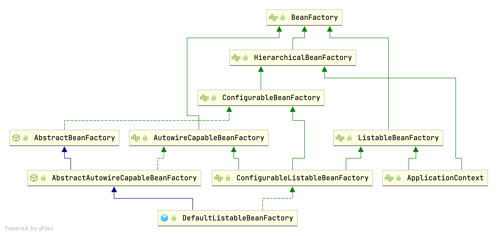
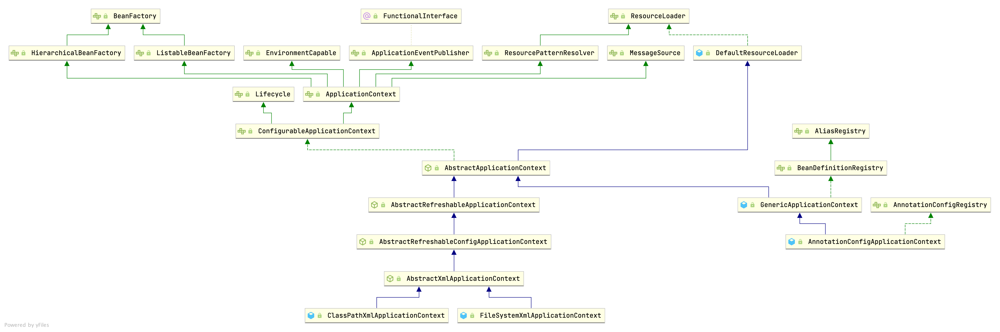
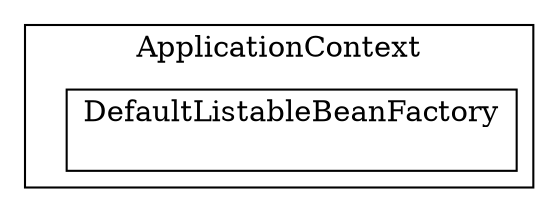

## Introduction

我们将介绍 **IoC**（*Inversion of Control*，控制反转）和 **DI**（*Dependency Injection*，依赖注入）的概念，并了解它们在 Spring 框架中的实现方式。
控制反转是软件工程中的一项原则，它将对象或程序部分的控制权转移给容器或框架。
我们通常在其 **OOP**（*面向对象编程*）的背景下使用它。
与传统编程（我们的自定义代码调用库）相反，IoC 使框架能够控制程序的流程并调用我们的自定义代码。
为了实现这一点，框架使用带有内置附加行为的抽象。
如果我们想添加自己的行为，需要扩展框架的类或插入我们自己的类。

这种架构的优势在于：

- 将任务的执行与其实现解耦
- 更容易在不同实现之间切换
- 程序具有更高的模块化性
- 通过隔离组件或模拟其依赖关系，以及允许组件通过契约进行通信，使程序更易于测试

## Bean Overview

### Bean Definition

### Bean Scope

| Scope       | Description                                                                                                                                                                                                                                                             |
| :---------- | :---------------------------------------------------------------------------------------------------------------------------------------------------------------------------------------------------------------------------------------------------------------------- |
| singleton   | (Default) Scopes a single bean definition to a single object instance for each Spring IoC container.                                                                                                                                                                    |
| prototype   | Scopes a single bean definition to any number of object instances.                                                                                                                                                                                                      |
| request     | Scopes a single bean definition to the lifecycle of a single HTTP request. <br />That is, each HTTP request has its own instance of a bean created off the back of a single bean definition. <br />Only valid in the context of a web-aware Spring`ApplicationContext`. |
| session     | Scopes a single bean definition to the lifecycle of an HTTP`Session`. <br />Only valid in the context of a web-aware Spring `ApplicationContext`.                                                                                                                       |
| application | Scopes a single bean definition to the lifecycle of a`ServletContext`. <br />Only valid in the context of a web-aware Spring `ApplicationContext`.                                                                                                                      |
| websocket   | Scopes a single bean definition to the lifecycle of a`WebSocket`. <br />Only valid in the context of a web-aware Spring `ApplicationContext`.                                                                                                                           |

Spring 的单例 bean 概念与 GoF（Gang of Four）模式书中定义的 singleton 模式不同。
GoF 单例硬编码了对象的范围，使得每个 ClassLoader 只创建一个特定类的唯一实例。
Spring 单例的范围最好描述为每个容器和每个 bean。
单例范围是 Spring 中的默认范围。

非单例的 prototype 范围意味着每次请求该特定 bean 时都会创建一个新的 bean 实例。
也就是说，该 bean 被注入到另一个 bean 中，或者你通过容器的 getBean() 方法调用请求它。
通常，你应该对所有有状态的 bean 使用 prototype 范围，对无状态的 bean 使用 singleton 范围。

与其他范围不同，Spring 不管理 prototype bean 的完整生命周期。
容器实例化、配置并组装 prototype 对象，然后将其交给客户端，之后不再记录该 prototype 实例。
**因此，虽然初始化生命周期回调方法会在所有对象上调用（无论范围如何），但对于 prototype，
配置的销毁生命周期回调不会被调用。
客户端代码必须清理 prototype 范围的���象并释放 prototype bean 持有的昂贵资源。**
要让 Spring 容器释放 prototype 范围 bean 持有的资源，
可以尝试使用自定义的 bean post-processor，它持有需要清理的 bean 的引用。

> [!NOTE]
>
> In some respects, the Spring container's role in regard to a prototype-scoped bean is a replacement for the Java new operator.
> All lifecycle management past that point must be handled by the client.

### Bean name

根据给定的 bean 定义派生默认的 bean 名称。
默认实现只是构建短类名的首字母小写版本：例如 "mypackage.MyJdbcDao" → "myJdbcDao"。
按照 JavaBeans 属性格式将字符串首字母小写，根据 Character.toLowerCase(char) 将第一个字母改为小写，**除非开头的两个字母是大写的连续字母**。

注意，内部类的名称形式为 "outerClassName.InnerClassName"，由于名称中包含点号，如果按名称进行 autowiring 可能会出现问题。

```java
	protected String buildDefaultBeanName(BeanDefinition definition) {
		String beanClassName = definition.getBeanClassName();
		Assert.state(beanClassName != null, "No bean class name set");
		String shortClassName = ClassUtils.getShortName(beanClassName);
		return StringUtils.uncapitalizeAsProperty(shortClassName);
	}
```

### destroy

在关闭应用上下文时要在 bean 实例上调用的方法的可选名称，例如 JDBC DataSource 实现上的 close() 方法，或 Hibernate SessionFactory 对象。
该方法必须没有参数，但可以抛出任何异常。
为了方便用户，容器会尝试推断 @Bean 方法返回的对象上的 destroy 方法。
例如，对于一个返回 Apache Commons DBCP BasicDataSource 的 @Bean 方法，容器会注意到该对象上可用的 close() 方法，并自动将其注册为 destroyMethod。
这种"销毁方法推断"目前仅限于检测名为 'close' 或 'shutdown' 的公共无参方法。
该方法可以在继承层次结构的任何级别声明，并且无论 @Bean 方法的返回类型如何都会被检测到（即，检测在创建时反射性地针对 bean 实例本身进行）。

## Container Overview

`org.springframework.beans` 和 `org.springframework.context` 包是 Spring Framework 的 IoC 容器的基础。
BeanFactory 接口提供了一种能够管理任何类型对象的高级配置机制。
ApplicationContext 是 BeanFactory 的子接口。
它增加了：

- 与 Spring 的 AOP 特性更轻松的集成
- 消息资源处理（用于国际化）
- [事件发布](/docs/CS/Framework/Spring/Event.md)
- 应用层特定的上下文，如用于 Web 应用的 WebApplicationContext

简而言之，BeanFactory 提供了配置框架和基本功能，而 ApplicationContext 则添加了更多企业特定的功能。

<div style="text-align: center;">



</div>

<p style="text-align: center;">
Fig.1. BeanFactory Hierarchy.
</p>

*BeanFactory* 和 *ApplicationContext* 接口代表了 Spring IoC 容器。
BeanFactory 是访问 Spring 容器的根接口，它提供了管理 bean 的基本功能。
另一方面，ApplicationContext 是 BeanFactory 的子接口。
它增加了：

- 与 [Spring 的 AOP](/docs/CS/Framework/Spring/AOP.md) 特性更轻松的集成
- 消息资源处理（用于国际化）
- 事件发布
- 应用层特定的上下文，如用于 Web 应用的 `WebApplicationContext`

简而言之，BeanFactory 提供了配置框架和基本功能，而 ApplicationContext 则添加了更多企业特定的功能。
这就是为什么我们将 ApplicationContext 用作默认的 Spring 容器。

在 Spring 中，构成应用程序骨干并由 Spring IoC 容器管理的对象称为 beans。
**在 Spring 中，bean 是由 Spring 容器实例化、组装和管理的对象。
Bean 及其之间的依赖关系反映在容器使用的配置元数据中。**

> [!Note]
>
> Typically, we define service layer objects, data access objects (DAOs), presentation objects such as Struts `Action` instances, infrastructure objects such as Hibernate `SessionFactories`, JMS `Queues`, and so forth.
> Typically, one does not configure fine-grained domain objects in the container, because it is usually the responsibility of DAOs and business logic to create and load domain objects.

### BeanFactory

该接口由持有多个 bean 定义的对象实现，每个定义由唯一的 String 名称标识。
根据 bean 定义，工厂将返回包含对象的独立实例（Prototype 设计模式），
或单个共享实例（Singleton 设计模式的更优替代方案，其中实例在工厂范围内是单例的）。
返回的实例类型取决于 bean 工厂配置：API 是相同的。
从 Spring 2.0 开始，根据具体的应用上下文还提供了更多范围（例如 Web 环境中的 "request" 和 "session" 范围）。

```java
public interface BeanFactory {

	String FACTORY_BEAN_PREFIX = "&";

	<T> T getBean(String name, Class<T> requiredType) throws BeansException;

	Object getBean(String name, Object... args) throws BeansException;

	<T> T getBean(Class<T> requiredType, Object... args) throws BeansException;

	<T> ObjectProvider<T> getBeanProvider(Class<T> requiredType);

	<T> ObjectProvider<T> getBeanProvider(ResolvableType requiredType);

	boolean containsBean(String name);

	boolean isSingleton(String name) throws NoSuchBeanDefinitionException;

	boolean isPrototype(String name) throws NoSuchBeanDefinitionException;

	boolean isTypeMatch(String name, ResolvableType typeToMatch) throws NoSuchBeanDefinitionException;

	boolean isTypeMatch(String name, Class<?> typeToMatch) throws NoSuchBeanDefinitionException;

	@Nullable
	Class<?> getType(String name, boolean allowFactoryBeanInit) throws NoSuchBeanDefinitionException;

	String[] getAliases(String name);
}
```

注意，通常最好依赖 Dependency Injection（"推送"配置）通过 setter 或构造函数来配置应用对象，而不是使用任何形式的"拉取"配置（如 BeanFactory 查找）。
Spring 的 Dependency Injection 功能是使用此 BeanFactory 接口及其子接口实现的。

Bean 工厂实现应尽可能支持标准的 bean 生命周期接口。
完整的初始化方法及其标准顺序如下：

1. BeanNameAware's setBeanName
2. BeanClassLoaderAware's setBeanClassLoader
3. BeanFactoryAware's setBeanFactory
4. EnvironmentAware's setEnvironment
5. EmbeddedValueResolverAware's setEmbeddedValueResolver
6. ResourceLoaderAware's setResourceLoader (only applicable when running in an application context)
7. ApplicationEventPublisherAware's setApplicationEventPublisher (only applicable when running in an application context)
8. MessageSourceAware's setMessageSource (only applicable when running in an application context)
9. ApplicationContextAware's setApplicationContext (only applicable when running in an application context)
10. ServletContextAware's setServletContext (only applicable when running in a web application context)
11. postProcessBeforeInitialization methods of BeanPostProcessors
12. InitializingBean's afterPropertiesSet
13. a custom init-method definition
14. postProcessAfterInitialization methods of BeanPostProcessors

在关闭 bean 工厂时，应用以下生命周期方法：

1. postProcessBeforeDestruction methods of DestructionAwareBeanPostProcessors
2. DisposableBean's destroy
3. a custom destroy-method definition

### ApplicationContext

Spring 框架提供了 ApplicationContext 接口的几种实现：
用于独立应用的 `ClassPathXmlApplicationContext` 和 `FileSystemXmlApplicationContext`，以及用于 Web 应用的 `WebApplicationContext`。

<div style="text-align: center;">



</div>

<p style="text-align: center;">
Fig.2. ApplicationContext Hierarchy.
</p>

spring-context 会自动将 spring-core, spring-beans, spring-aop, spring-expression 这几个基础 jar 包带进来

### FactoryBean

由 BeanFactory 内部使用的对象实现的接口，这些对象本身是单个对象的工厂。
如果 bean 实现了此接口，则它被用作要暴露的对象的工厂，而不是直接作为要暴露的 bean 实例本身。

> [!NOTE]
>
> A bean that implements this interface cannot be used as a normal bean.

FactoryBean 以 bean 风格定义，但**为 bean 引用暴露的对象（getObject()）始终是它创建的对象**。
FactoryBean 可以支持 singleton 和 prototype，并且可以按需惰性创建对象或在启动时急切创建。
SmartFactoryBean 接口允许暴露更细粒度的行为元数据。
该接口在框架内部广泛使用，例如用于 AOP 的 `org.springframework.aop.framework.ProxyFactoryBean` 或 `org.springframework.jndi.JndiObjectFactoryBean`。
它也可以用于自定义组件；不过，这通常仅用于基础设施代码。

FactoryBean 是一种程序化契约。
实现不应依赖注解驱动的注入或其他反射设施。
getObjectType() 和 getObject() 的调用可能在引导过程的早期到来，甚至在任何后处理器设置之前。
如果需要访问其他 bean，请实现 BeanFactoryAware 并以编程方式获取它们。

**容器仅负责管理 FactoryBean 实例的生命周期，而不负责管理 FactoryBean 创建的对象的生命周期。**
因此，暴露的 bean 对象上的 destroy 方法（例如 java.io.Closeable.close()）将不会自动调用。
相反，FactoryBean 应该实现 DisposableBean 并将任何此类关闭调用委托给底层对象。

最后，FactoryBean 对象参与所属 BeanFactory 的 bean 创建同步。
通常不需要内部同步，除非为了在 FactoryBean 本身内部进行惰性初始化。

```java
public interface FactoryBean<T> {

	String OBJECT_TYPE_ATTRIBUTE = "factoryBeanObjectType";

	@Nullable
	T getObject() throws Exception;

	@Nullable
	Class<?> getObjectType();

	default boolean isSingleton() {
		return true;
	}

}
```

## Dependency Injection

Dependency Injection（依赖注入，DI）是 IoC 的一种特殊形式，对象仅通过构造函数参数、工厂方法参数或在对象实例构造或从工厂方法返回后设置的属性来定义它们的依赖关系（即它们与之协作的其他对象）。
然后 IoC 容器在创建 bean 时注入这些依赖关系。
这个过程从根本上说是 bean 本身通过直接构造类或使用 Service Locator 模式等机制来控制其依赖关系的实例化或定位的逆过程（因此得名 Inversion of Control）。

> [!Note]
>
> We can achieve Inversion of Control through various mechanisms such as: Strategy design pattern, Service Locator pattern, Factory pattern, and Dependency Injection (DI).

Dependency Injection 是我们可以用来实现 IoC 的一种模式，其中被反转的控制是设置对象的依赖关系。
**Spring 中的依赖注入可以通过构造函数、setter 或字段来完成：**

- Constructor-Based Dependency Injection。从 OOP 的角度来看，使用构造函数创建对象实例更自然。
- Parameter injection
- Setter-Based Dependency Injection
- Field-Based Dependency Injection `org.springframework.beans.factory.annotation.Autowired` / `javax.annotation.Resource` / `javax.inject.Inject`

下表总结了我们的讨论。

| Scenario                                                                 | @Resource             | @Inject               | @Autowired            |
| :----------------------------------------------------------------------- | --------------------- | --------------------- | --------------------- |
| Application-wide use of singletons through polymorphism                  | ✗                    | ✔                    | ✔                    |
| Fine-grained application behavior configuration through polymorphism     | ✔                    | ✗                    | ✗                    |
| Dependency injection should be handled solely by the Jakarta EE platform | ✔                    | ✔                    | ✗                    |
| Dependency injection should be handled solely by the Spring Framework    | ✗                    | ✗                    | ✔                    |
| Matching Order                                                           | Name, Type, Qualifier | Type, Qualifier, Name | Type, Qualifier, Name |

Spring 不支持在抽象类中进行构造函数注入。

接下来以常用的 AnnotationConfigApplicationContext 作为切入点

创建 reader 和 scanner, 设置一些 SystemProperties

```java
public class AnnotationConfigApplicationContext extends GenericApplicationContext implements AnnotationConfigRegistry {

    private final AnnotatedBeanDefinitionReader reader;

    private final ClassPathBeanDefinitionScanner scanner;

    public AnnotationConfigApplicationContext(Class<?>... componentClasses) {
        this();
        register(componentClasses);
        refresh();
    }

    public AnnotationConfigApplicationContext() {
        StartupStep createAnnotatedBeanDefReader = getApplicationStartup().start("spring.context.annotated-bean-reader.create");
        this.reader = new AnnotatedBeanDefinitionReader(this);
        createAnnotatedBeanDefReader.end();
        this.scanner = new ClassPathBeanDefinitionScanner(this);
    }
}
```
BeanDefinitionRegistry

```java
	public AnnotatedBeanDefinitionReader(BeanDefinitionRegistry registry) {
		this(registry, getOrCreateEnvironment(registry));
	}
```

创建一个新的 AnnotationConfigApplicationContext，需要通过 [register]() 调用填充，然后手动 [refresh]()。

```java
	public void register(Class<?>... componentClasses) {
		Assert.notEmpty(componentClasses, "At least one component class must be specified");
		StartupStep registerComponentClass = getApplicationStartup().start("spring.context.component-classes.register")
				.tag("classes", () -> Arrays.toString(componentClasses));
		this.reader.register(componentClasses);
		registerComponentClass.end();
	}
```

## register

```java
public class AnnotatedBeanDefinitionReader {

    private final BeanDefinitionRegistry registry;

    public void register(Class<?>... componentClasses) {
        for (Class<?> componentClass : componentClasses) {
            registerBean(componentClass);
        }
    }

    private <T> void doRegisterBean(Class<T> beanClass, @Nullable String name,
                                    @Nullable Class<? extends Annotation>[] qualifiers, @Nullable Supplier<T> supplier,
                                    @Nullable BeanDefinitionCustomizer[] customizers) {

        AnnotatedGenericBeanDefinition abd = new AnnotatedGenericBeanDefinition(beanClass);
        if (this.conditionEvaluator.shouldSkip(abd.getMetadata())) {
            return;
        }

        abd.setInstanceSupplier(supplier);
        ScopeMetadata scopeMetadata = this.scopeMetadataResolver.resolveScopeMetadata(abd);
        abd.setScope(scopeMetadata.getScopeName());
        String beanName = (name != null ? name : this.beanNameGenerator.generateBeanName(abd, this.registry));

        AnnotationConfigUtils.processCommonDefinitionAnnotations(abd);
        if (qualifiers != null) {
            for (Class<? extends Annotation> qualifier : qualifiers) {
                if (Primary.class == qualifier) {
                    abd.setPrimary(true);
                } else if (Lazy.class == qualifier) {
                    abd.setLazyInit(true);
                } else {
                    abd.addQualifier(new AutowireCandidateQualifier(qualifier));
                }
            }
        }
        if (customizers != null) {
            for (BeanDefinitionCustomizer customizer : customizers) {
                customizer.customize(abd);
            }
        }

        BeanDefinitionHolder definitionHolder = new BeanDefinitionHolder(abd, beanName);
        definitionHolder = AnnotationConfigUtils.applyScopedProxyMode(scopeMetadata, definitionHolder, this.registry);
        BeanDefinitionReaderUtils.registerBeanDefinition(definitionHolder, this.registry);
    }
}
```

registerBeanDefinition
```java
	public static void registerBeanDefinition(
			BeanDefinitionHolder definitionHolder, BeanDefinitionRegistry registry)
			throws BeanDefinitionStoreException {

		// Register bean definition under primary name.
		String beanName = definitionHolder.getBeanName();
		registry.registerBeanDefinition(beanName, definitionHolder.getBeanDefinition());

		// Register aliases for bean name, if any.
		String[] aliases = definitionHolder.getAliases();
		if (aliases != null) {
			for (String alias : aliases) {
				registry.registerAlias(beanName, alias);
			}
		}
	}
```

## refresh

ApplicationContext 建立之后，可以通过调用 refresh 方法重建，销毁原先的 ApplicationContext 并重新执行一次初始化操作

```java
public class AbstractApplicationContext {
   public void refresh() throws BeansException, IllegalStateException {
      synchronized (this.startupShutdownMonitor) {
         // Prepare this context for refreshing.
         prepareRefresh();

         // Tell the subclass to refresh the internal bean factory.
         ConfigurableListableBeanFactory beanFactory = obtainFreshBeanFactory();

         // Prepare the bean factory for use in this context.
         prepareBeanFactory(beanFactory);

         try {
            // Allows post-processing of the bean factory in context subclasses.
            postProcessBeanFactory(beanFactory);

            // Invoke factory processors registered as beans in the context.
            invokeBeanFactoryPostProcessors(beanFactory);

            // Register bean processors that intercept bean creation.
            registerBeanPostProcessors(beanFactory);

            // Initialize message source for this context.
            initMessageSource();

            // Initialize event multicaster for this context.
            initApplicationEventMulticaster();

            // Initialize other special beans in specific context subclasses.
            onRefresh();

            // Check for listener beans and register them.
            registerListeners();

            // Instantiate all remaining (non-lazy-init) singletons.
            finishBeanFactoryInitialization(beanFactory);

            // Last step: publish corresponding event.
            finishRefresh();
         } catch (BeansException ex) {

            // Destroy already created singletons to avoid dangling resources.
            destroyBeans();

            // Reset 'active' flag.
            cancelRefresh(ex);

            // Propagate exception to caller.
            throw ex;
         } finally {
            // Reset common introspection caches in Spring's core, since we might not ever need metadata for singleton beans anymore...
            resetCommonCaches();
         }
      }
   }
}
```

### prepareRefresh

准备刷新此上下文，设置其启动日期和活动标志，并执行 **property sources** 的任何初始化。

```java
public abstract class AbstractApplicationContext {
    protected void prepareRefresh() {
        // Switch to active.
        this.startupDate = System.currentTimeMillis();
        this.closed.set(false);
        this.active.set(true);

        // Initialize any placeholder property sources in the context environment.
        initPropertySources();

        // Validate that all properties marked as required are resolvable: see ConfigurablePropertyResolver#setRequiredProperties
        getEnvironment().validateRequiredProperties();

        // Store pre-refresh ApplicationListeners...
        if (this.earlyApplicationListeners == null) {
            this.earlyApplicationListeners = new LinkedHashSet<>(this.applicationListeners);
        } else {
            // Reset local application listeners to pre-refresh state.
            this.applicationListeners.clear();
            this.applicationListeners.addAll(this.earlyApplicationListeners);
        }

        // Allow for the collection of early ApplicationEvents,
        // to be published once the multicaster is available...
        this.earlyApplicationEvents = new LinkedHashSet<>();
    }
}
```

### obtainFreshBeanFactory

通知子类刷新并返回内部的 bean factory。

```java
public abstract class AbstractApplicationContext {
    protected ConfigurableListableBeanFactory obtainFreshBeanFactory() {
        refreshBeanFactory();
        return getBeanFactory();
    }
}
```



<!-- tabs:start -->

##### **GenericApplicationContext**

```java
public class GenericApplicationContext extends AbstractApplicationContext implements BeanDefinitionRegistry {

    private final DefaultListableBeanFactory beanFactory;

    @Override
    public final ConfigurableListableBeanFactory getBeanFactory() {
        return this.beanFactory;
    }
}
```

##### **AbstractRefreshableApplicationContext**

```java
public abstract class AbstractRefreshableApplicationContext extends AbstractApplicationContext {

    @Nullable
    private volatile DefaultListableBeanFactory beanFactory;

    @Override
    protected final void refreshBeanFactory() throws BeansException {
        if (hasBeanFactory()) {
            destroyBeans();
            closeBeanFactory();
        }
        try {
            DefaultListableBeanFactory beanFactory = createBeanFactory();
            beanFactory.setSerializationId(getId());
            customizeBeanFactory(beanFactory);
            loadBeanDefinitions(beanFactory);
            this.beanFactory = beanFactory;
        } catch (IOException ex) {
            throw new ApplicationContextException("");
        }
    }

    protected DefaultListableBeanFactory createBeanFactory() {
        return new DefaultListableBeanFactory(getInternalParentBeanFactory());
    }
}
```

<!-- tabs:end -->

#### customizeBeanFactory

自定义此上下文使用的内部 bean factory。每次 refresh() 尝试时都会调用。
默认实现应用此上下文的 "allowBeanDefinitionOverriding" 和 "allowCircularReferences" 设置（如果已指定）。
可以在子类中重写以自定义 DefaultListableBeanFactory 的任何设置。

#### loadBeanDefinitions

*BeanDefinition* 描述了一个 bean 实例，它具有属性值、构造函数参数值以及由具体实现提供的更多信息。
这只是一个最小的接口：主要目的是允许 `BeanFactoryPostProcessor` 内省和修改属性值及其他 bean 元数据。

```java
public interface BeanDefinition extends AttributeAccessor, BeanMetadataElement {

   String SCOPE_SINGLETON = ConfigurableBeanFactory.SCOPE_SINGLETON;

   String SCOPE_PROTOTYPE = ConfigurableBeanFactory.SCOPE_PROTOTYPE;

   boolean isSingleton();

   boolean isPrototype();

   boolean isAbstract();
   //...
}
```

通过 XmlBeanDefinitionReader 加载 bean 定义。

```java
public abstract class AbstractXmlApplicationContext extends AbstractRefreshableConfigApplicationContext {
   @Override
   protected void loadBeanDefinitions(DefaultListableBeanFactory beanFactory) throws BeansException, IOException {
      XmlBeanDefinitionReader beanDefinitionReader = new XmlBeanDefinitionReader(beanFactory);

      // Configure the bean definition reader with this context's resource loading environment.
      beanDefinitionReader.setEnvironment(this.getEnvironment());
      beanDefinitionReader.setResourceLoader(this);
      beanDefinitionReader.setEntityResolver(new ResourceEntityResolver(this));

      // Allow a subclass to provide custom initialization of the reader, then proceed with actually loading the bean definitions.
      initBeanDefinitionReader(beanDefinitionReader);
      loadBeanDefinitions(beanDefinitionReader);
   }

   protected void loadBeanDefinitions(XmlBeanDefinitionReader reader) throws IOException {
      String[] configLocations = getConfigLocations();
      if (configLocations != null) {
         for (String configLocation : configLocations) {
            reader.loadBeanDefinitions(configLocation);
         }
      }
   }

   protected void loadBeanDefinitions(XmlBeanDefinitionReader reader) throws BeansException, IOException {
      Resource[] configResources = getConfigResources();
      if (configResources != null) {
         reader.loadBeanDefinitions(configResources);
      }
      String[] configLocations = getConfigLocations();
      if (configLocations != null) {
         reader.loadBeanDefinitions(configLocations);
      }
   }
}
```

doLoadBeanDefinitions

```java
public class XmlBeanDefinitionReader extends AbstractBeanDefinitionReader {
   public int loadBeanDefinitions(EncodedResource encodedResource) throws BeanDefinitionStoreException {
      Set<EncodedResource> currentResources = this.resourcesCurrentlyBeingLoaded.get();

      try (InputStream inputStream = encodedResource.getResource().getInputStream()) {
         InputSource inputSource = new InputSource(inputStream);
         if (encodedResource.getEncoding() != null) {
            inputSource.setEncoding(encodedResource.getEncoding());
         }
         return doLoadBeanDefinitions(inputSource, encodedResource.getResource());
      } catch (IOException ex) {
         throw new BeanDefinitionStoreException("");
      } finally {
         currentResources.remove(encodedResource);
         if (currentResources.isEmpty()) {
            this.resourcesCurrentlyBeingLoaded.remove();
         }
      }
   }

   protected int doLoadBeanDefinitions(InputSource inputSource, Resource resource)
           throws BeanDefinitionStoreException {
      Document doc = doLoadDocument(inputSource, resource);
      int count = registerBeanDefinitions(doc, resource);
      return count;
   }
}
```

##### registerBeanDefinitions

```java
public class XmlBeanDefinitionReader extends AbstractBeanDefinitionReader {
   public int registerBeanDefinitions(Document doc, Resource resource) throws BeanDefinitionStoreException {
      BeanDefinitionDocumentReader documentReader = createBeanDefinitionDocumentReader();
      int countBefore = getRegistry().getBeanDefinitionCount();
      documentReader.registerBeanDefinitions(doc, createReaderContext(resource));
      return getRegistry().getBeanDefinitionCount() - countBefore;
   }
}
```

DefaultBeanDefinitionDocumentReader#doRegisterBeanDefinitions -> parseBeanDefinitions -> parseDefaultElement -> processBeanDefinition ->
BeanDefinitionReaderUtils#registerBeanDefinition

```java
public class DefaultBeanDefinitionDocumentReader implements BeanDefinitionDocumentReader {
   protected void processBeanDefinition(Element ele, BeanDefinitionParserDelegate delegate) {
      BeanDefinitionHolder bdHolder = delegate.parseBeanDefinitionElement(ele);
      if (bdHolder != null) {
         bdHolder = delegate.decorateBeanDefinitionIfRequired(ele, bdHolder);
         try {
            // Register the final decorated instance.
            BeanDefinitionReaderUtils.registerBeanDefinition(bdHolder, getReaderContext().getRegistry());
         }
         catch (BeanDefinitionStoreException ex) {
            getReaderContext().error("Failed to register bean definition with name '" + bdHolder.getBeanName() + "'", ele, ex);
         }
         // Send registration event.
         getReaderContext().fireComponentRegistered(new BeanComponentDefinition(bdHolder));
      }
   }
}

public abstract class BeanDefinitionReaderUtils {
   public static void registerBeanDefinition(
           BeanDefinitionHolder definitionHolder, BeanDefinitionRegistry registry)
           throws BeanDefinitionStoreException {

      // Register bean definition under primary name.
      String beanName = definitionHolder.getBeanName();
      registry.registerBeanDefinition(beanName, definitionHolder.getBeanDefinition());

      // Register aliases for bean name, if any.
      String[] aliases = definitionHolder.getAliases();
      if (aliases != null) {
         for (String alias : aliases) {
            registry.registerAlias(beanName, alias);
         }
      }
   }
}
```

DefaultListableBeanFactory implement BeanDefinitionRegistry

```java
public class DefaultListableBeanFactory {

   private final Map<String, BeanDefinition> beanDefinitionMap = new ConcurrentHashMap<>(256);

   private volatile List<String> beanDefinitionNames = new ArrayList<>(256);
   
   @Override
   public void registerBeanDefinition(String beanName, BeanDefinition beanDefinition)
           throws BeanDefinitionStoreException {
      if (beanDefinition instanceof AbstractBeanDefinition) {
         try {
            ((AbstractBeanDefinition) beanDefinition).validate();
         } catch (BeanDefinitionValidationException ex) {
//            throw new BeanDefinitionStoreException(beanDefinition.getResourceDescription(), beanName, "Validation of bean definition failed", ex);
         }
      }

      BeanDefinition existingDefinition = this.beanDefinitionMap.get(beanName);
      if (existingDefinition != null) {
         if (!isAllowBeanDefinitionOverriding()) {
            throw new BeanDefinitionOverrideException(beanName, beanDefinition, existingDefinition);
         }
         this.beanDefinitionMap.put(beanName, beanDefinition);
      } else {
         if (hasBeanCreationStarted()) {
            // Cannot modify startup-time collection elements anymore (for stable iteration)
            synchronized (this.beanDefinitionMap) {
               this.beanDefinitionMap.put(beanName, beanDefinition);
               List<String> updatedDefinitions = new ArrayList<>(this.beanDefinitionNames.size() + 1);
               updatedDefinitions.addAll(this.beanDefinitionNames);
               updatedDefinitions.add(beanName);
               this.beanDefinitionNames = updatedDefinitions;
               removeManualSingletonName(beanName);
            }
         } else {
            // Still in startup registration phase
            this.beanDefinitionMap.put(beanName, beanDefinition);
            this.beanDefinitionNames.add(beanName);
            removeManualSingletonName(beanName);
         }
         this.frozenBeanDefinitionNames = null;
      }

      if (existingDefinition != null || containsSingleton(beanName)) {
         resetBeanDefinition(beanName);
      } else if (isConfigurationFrozen()) {
         clearByTypeCache();
      }
   }
}
```

### prepareBeanFactory

配置工厂的标准上下文特征，例如上下文的 ClassLoader 和后处理器。

```java
public abstract class AbstractApplicationContext {
    protected void prepareBeanFactory(ConfigurableListableBeanFactory beanFactory) {
        // Tell the internal bean factory to use the context's class loader etc.
        beanFactory.setBeanClassLoader(getClassLoader());
        if (!shouldIgnoreSpel) {
            beanFactory.setBeanExpressionResolver(new StandardBeanExpressionResolver(beanFactory.getBeanClassLoader()));
        }
        beanFactory.addPropertyEditorRegistrar(new ResourceEditorRegistrar(this, getEnvironment()));

        // Configure the bean factory with context callbacks.
        beanFactory.addBeanPostProcessor(new ApplicationContextAwareProcessor(this));
        beanFactory.ignoreDependencyInterface(EnvironmentAware.class);
        beanFactory.ignoreDependencyInterface(EmbeddedValueResolverAware.class);
        beanFactory.ignoreDependencyInterface(ResourceLoaderAware.class);
        beanFactory.ignoreDependencyInterface(ApplicationEventPublisherAware.class);
        beanFactory.ignoreDependencyInterface(MessageSourceAware.class);
        beanFactory.ignoreDependencyInterface(ApplicationContextAware.class);
        beanFactory.ignoreDependencyInterface(ApplicationStartupAware.class);

        // BeanFactory interface not registered as resolvable type in a plain factory.
        // MessageSource registered (and found for autowiring) as a bean.
        beanFactory.registerResolvableDependency(BeanFactory.class, beanFactory);
        beanFactory.registerResolvableDependency(ResourceLoader.class, this);
        beanFactory.registerResolvableDependency(ApplicationEventPublisher.class, this);
        beanFactory.registerResolvableDependency(ApplicationContext.class, this);

        // Register early post-processor for detecting inner beans as ApplicationListeners.
        beanFactory.addBeanPostProcessor(new ApplicationListenerDetector(this));

        // Detect a LoadTimeWeaver and prepare for weaving, if found.
        if (!NativeDetector.inNativeImage() && beanFactory.containsBean(LOAD_TIME_WEAVER_BEAN_NAME)) {
            beanFactory.addBeanPostProcessor(new LoadTimeWeaverAwareProcessor(beanFactory));
            // Set a temporary ClassLoader for type matching.
            beanFactory.setTempClassLoader(new ContextTypeMatchClassLoader(beanFactory.getBeanClassLoader()));
        }

        // Register default environment beans.
        if (!beanFactory.containsLocalBean(ENVIRONMENT_BEAN_NAME)) {
            beanFactory.registerSingleton(ENVIRONMENT_BEAN_NAME, getEnvironment());
        }
        if (!beanFactory.containsLocalBean(SYSTEM_PROPERTIES_BEAN_NAME)) {
            beanFactory.registerSingleton(SYSTEM_PROPERTIES_BEAN_NAME, getEnvironment().getSystemProperties());
        }
        if (!beanFactory.containsLocalBean(SYSTEM_ENVIRONMENT_BEAN_NAME)) {
            beanFactory.registerSingleton(SYSTEM_ENVIRONMENT_BEAN_NAME, getEnvironment().getSystemEnvironment());
        }
        if (!beanFactory.containsLocalBean(APPLICATION_STARTUP_BEAN_NAME)) {
            beanFactory.registerSingleton(APPLICATION_STARTUP_BEAN_NAME, getApplicationStartup());
        }
    }
}
```

### BeanFactoryPostProcessor

ConfigurationClassPostProcessor -> BeanDefinitionRegistryPostProcessor -> BeanFactoryPostProcessor

PriorityOrdered -> Ordered

先执行子类方法 后父类

先执行 PriorityOrdered 后 Ordered 最后无序的

```java
public abstract class AbstractApplicationContext {
    protected void invokeBeanFactoryPostProcessors(ConfigurableListableBeanFactory beanFactory) {
        PostProcessorRegistrationDelegate.invokeBeanFactoryPostProcessors(beanFactory, getBeanFactoryPostProcessors());

        // Detect a LoadTimeWeaver and prepare for weaving, if found in the meantime
        // (e.g. through an @Bean method registered by ConfigurationClassPostProcessor)
        if (beanFactory.getTempClassLoader() == null && beanFactory.containsBean(LOAD_TIME_WEAVER_BEAN_NAME)) {
            beanFactory.addBeanPostProcessor(new LoadTimeWeaverAwareProcessor(beanFactory));
            beanFactory.setTempClassLoader(new ContextTypeMatchClassLoader(beanFactory.getBeanClassLoader()));
        }
    }
}
```

实现了 BeanDefinitionRegistryPostProcessor 的类：

- ConfigurationClassPostProcessor
- DubboAutoConfiguration
- [MyBatis MapperScannerConfigurer](/docs/CS/Framework/MyBatis/MyBatis-Spring.md?id=MapperScan)

```java
public abstract class AbstractApplicationContext {
    public static void invokeBeanFactoryPostProcessors(
            ConfigurableListableBeanFactory beanFactory, List<BeanFactoryPostProcessor> beanFactoryPostProcessors) {

        // Invoke BeanDefinitionRegistryPostProcessors first, if any.
        Set<String> processedBeans = new HashSet<>();

        if (beanFactory instanceof BeanDefinitionRegistry) {
            BeanDefinitionRegistry registry = (BeanDefinitionRegistry) beanFactory;
            List<BeanFactoryPostProcessor> regularPostProcessors = new ArrayList<>();
            List<BeanDefinitionRegistryPostProcessor> registryProcessors = new ArrayList<>();

            for (BeanFactoryPostProcessor postProcessor : beanFactoryPostProcessors) {
                if (postProcessor instanceof BeanDefinitionRegistryPostProcessor) {
                    BeanDefinitionRegistryPostProcessor registryProcessor =
                            (BeanDefinitionRegistryPostProcessor) postProcessor;
                    registryProcessor.postProcessBeanDefinitionRegistry(registry);
                    registryProcessors.add(registryProcessor);
                } else {
                    regularPostProcessors.add(postProcessor);
                }
            }

            // Do not initialize FactoryBeans here: We need to leave all regular beans
            // uninitialized to let the bean factory post-processors apply to them!
            // Separate between BeanDefinitionRegistryPostProcessors that implement
            // PriorityOrdered, Ordered, and the rest.
            List<BeanDefinitionRegistryPostProcessor> currentRegistryProcessors = new ArrayList<>();

            // First, invoke the BeanDefinitionRegistryPostProcessors that implement PriorityOrdered.
            String[] postProcessorNames =
                    beanFactory.getBeanNamesForType(BeanDefinitionRegistryPostProcessor.class, true, false);
            for (String ppName : postProcessorNames) {
                if (beanFactory.isTypeMatch(ppName, PriorityOrdered.class)) {
                    currentRegistryProcessors.add(beanFactory.getBean(ppName, BeanDefinitionRegistryPostProcessor.class));
                    processedBeans.add(ppName);
                }
            }
            sortPostProcessors(currentRegistryProcessors, beanFactory);
            registryProcessors.addAll(currentRegistryProcessors);
            invokeBeanDefinitionRegistryPostProcessors(currentRegistryProcessors, registry);
            currentRegistryProcessors.clear();

            // Next, invoke the BeanDefinitionRegistryPostProcessors that implement Ordered.
            postProcessorNames = beanFactory.getBeanNamesForType(BeanDefinitionRegistryPostProcessor.class, true, false);
            for (String ppName : postProcessorNames) {
                if (!processedBeans.contains(ppName) && beanFactory.isTypeMatch(ppName, Ordered.class)) {
                    currentRegistryProcessors.add(beanFactory.getBean(ppName, BeanDefinitionRegistryPostProcessor.class));
                    processedBeans.add(ppName);
                }
            }
            sortPostProcessors(currentRegistryProcessors, beanFactory);
            registryProcessors.addAll(currentRegistryProcessors);
            invokeBeanDefinitionRegistryPostProcessors(currentRegistryProcessors, registry);
            currentRegistryProcessors.clear();

            // Finally, invoke all other BeanDefinitionRegistryPostProcessors until no further ones appear.
            boolean reiterate = true;
            while (reiterate) {
                reiterate = false;
                postProcessorNames = beanFactory.getBeanNamesForType(BeanDefinitionRegistryPostProcessor.class, true, false);
                for (String ppName : postProcessorNames) {
                    if (!processedBeans.contains(ppName)) {
                        currentRegistryProcessors.add(beanFactory.getBean(ppName, BeanDefinitionRegistryPostProcessor.class));
                        processedBeans.add(ppName);
                        reiterate = true;
                    }
                }
                sortPostProcessors(currentRegistryProcessors, beanFactory);
                registryProcessors.addAll(currentRegistryProcessors);
                invokeBeanDefinitionRegistryPostProcessors(currentRegistryProcessors, registry);
                currentRegistryProcessors.clear();
            }

            // Now, invoke the postProcessBeanFactory callback of all processors handled so far.
            invokeBeanFactoryPostProcessors(registryProcessors, beanFactory);
            invokeBeanFactoryPostProcessors(regularPostProcessors, beanFactory);
        } else {
            // Invoke factory processors registered with the context instance.
            invokeBeanFactoryPostProcessors(beanFactoryPostProcessors, beanFactory);
        }

        // Do not initialize FactoryBeans here: We need to leave all regular beans
        // uninitialized to let the bean factory post-processors apply to them!
        String[] postProcessorNames =
                beanFactory.getBeanNamesForType(BeanFactoryPostProcessor.class, true, false);

        // Separate between BeanFactoryPostProcessors that implement PriorityOrdered,
        // Ordered, and the rest.
        List<BeanFactoryPostProcessor> priorityOrderedPostProcessors = new ArrayList<>();
        List<String> orderedPostProcessorNames = new ArrayList<>();
        List<String> nonOrderedPostProcessorNames = new ArrayList<>();
        for (String ppName : postProcessorNames) {
            if (processedBeans.contains(ppName)) {
                // skip - already processed in first phase above
            } else if (beanFactory.isTypeMatch(ppName, PriorityOrdered.class)) {
                priorityOrderedPostProcessors.add(beanFactory.getBean(ppName, BeanFactoryPostProcessor.class));
            } else if (beanFactory.isTypeMatch(ppName, Ordered.class)) {
                orderedPostProcessorNames.add(ppName);
            } else {
                nonOrderedPostProcessorNames.add(ppName);
            }
        }

        // First, invoke the BeanFactoryPostProcessors that implement PriorityOrdered.
        sortPostProcessors(priorityOrderedPostProcessors, beanFactory);
        invokeBeanFactoryPostProcessors(priorityOrderedPostProcessors, beanFactory);

        // Next, invoke the BeanFactoryPostProcessors that implement Ordered.
        List<BeanFactoryPostProcessor> orderedPostProcessors = new ArrayList<>(orderedPostProcessorNames.size());
        for (String postProcessorName : orderedPostProcessorNames) {
            orderedPostProcessors.add(beanFactory.getBean(postProcessorName, BeanFactoryPostProcessor.class));
        }
        sortPostProcessors(orderedPostProcessors, beanFactory);
        invokeBeanFactoryPostProcessors(orderedPostProcessors, beanFactory);

        // Finally, invoke all other BeanFactoryPostProcessors.
        List<BeanFactoryPostProcessor> nonOrderedPostProcessors = new ArrayList<>(nonOrderedPostProcessorNames.size());
        for (String postProcessorName : nonOrderedPostProcessorNames) {
            nonOrderedPostProcessors.add(beanFactory.getBean(postProcessorName, BeanFactoryPostProcessor.class));
        }
        invokeBeanFactoryPostProcessors(nonOrderedPostProcessors, beanFactory);

        // Clear cached merged bean definitions since the post-processors might have
        // modified the original metadata, e.g. replacing placeholders in values...
        beanFactory.clearMetadataCache();
    }
}
```

```java
@FunctionalInterface
public interface BeanFactoryPostProcessor {

	void postProcessBeanFactory(ConfigurableListableBeanFactory beanFactory) throws BeansException;

}
```

### onRefresh

### finishBeanFactoryInitialization

lazy-init false in refresh()->finishBeanFactoryInitialization

```java
public abstract class AbstractApplicationContext {
    protected void finishBeanFactoryInitialization(ConfigurableListableBeanFactory beanFactory) {
        // Initialize conversion service for this context.
        if (beanFactory.containsBean(CONVERSION_SERVICE_BEAN_NAME) &&
                beanFactory.isTypeMatch(CONVERSION_SERVICE_BEAN_NAME, ConversionService.class)) {
            beanFactory.setConversionService(
                    beanFactory.getBean(CONVERSION_SERVICE_BEAN_NAME, ConversionService.class));
        }

        if (!beanFactory.hasEmbeddedValueResolver()) {
            beanFactory.addEmbeddedValueResolver(strVal -> getEnvironment().resolvePlaceholders(strVal));
        }

        // Initialize LoadTimeWeaverAware beans early to allow for registering their transformers early.
        String[] weaverAwareNames = beanFactory.getBeanNamesForType(LoadTimeWeaverAware.class, false, false);
        for (String weaverAwareName : weaverAwareNames) {
            getBean(weaverAwareName);
        }

        // Stop using the temporary ClassLoader for type matching.
        beanFactory.setTempClassLoader(null);

        // Allow for caching all bean definition metadata, not expecting further changes.
        beanFactory.freezeConfiguration();

        // Instantiate all remaining (non-lazy-init) singletons.
        beanFactory.preInstantiateSingletons();
    }
}
```

### finishRefresh

完成此上下文的刷新，调用 LifecycleProcessor 的 `onRefresh()` 方法（启动 Web 应用）并发布 `ContextRefreshedEvent`。

```java
public abstract class AbstractApplicationContext {
    protected void finishRefresh() {
        // Clear context-level resource caches (such as ASM metadata from scanning).
        clearResourceCaches();

        // Initialize lifecycle processor for this context.
        initLifecycleProcessor();

        // Propagate refresh to lifecycle processor first.
        getLifecycleProcessor().onRefresh();

        // Publish the final event.
        publishEvent(new ContextRefreshedEvent(this));
        // ...
    }
}
```
