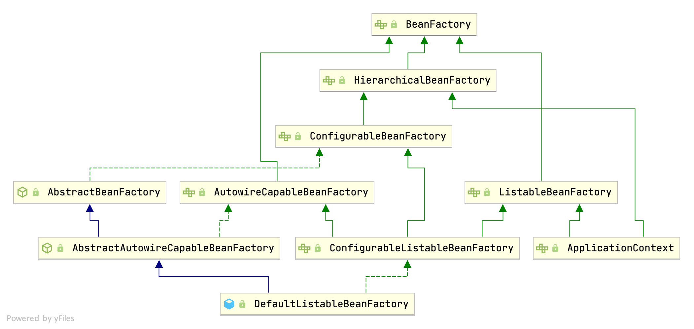
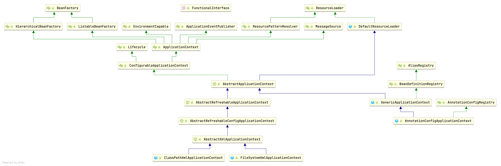
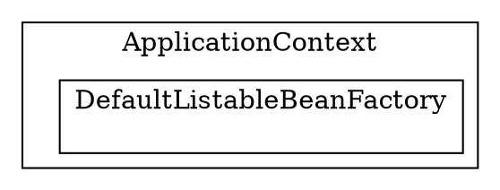

## Introduction

我们将介绍 **IoC**（*Inversion of Control*，控制反转）和 **DI**（*Dependency Injection*，依赖注入）的概念，并了解它们是如何在 Spring 框架中实现的。
控制反转是软件工程中的一项原则，它将对象或程序局部的控制权转移给容器或框架。
我们最常在 **OOP**（*object-oriented programming*，面向对象编程）的语境下使用它。
与传统编程（由我们的自定义代码调用库）不同，IoC 让框架接管程序的流程控制，并反过来调用我们的自定义代码。
为此，框架会使用内置了额外行为的抽象。
如果我们想加入自己的行为，就需要扩展框架的类，或把自己编写的类作为插件接入。

这种架构的优势在于：

- 将任务的执行与其实现解耦
- 使在不同实现之间切换更加容易
- 提升程序的模块化程度
- 通过隔离组件或模拟其依赖来更轻松地对程序进行测试，并允许组件通过契约进行通信


## Bean Overview

### Bean Definition

### Bean Scope


| Scope       | Description                                                                                                                                                                                                                                                             |
| :---------- | :---------------------------------------------------------------------------------------------------------------------------------------------------------------------------------------------------------------------------------------------------------------------- |
| singleton   | (Default) Scopes a single bean definition to a single object instance for each Spring IoC container.                                                                                                                                                                    |
| prototype   | Scopes a single bean definition to any number of object instances.                                                                                                                                                                                                      |
| request     | Scopes a single bean definition to the lifecycle of a single HTTP request. <br />That is, each HTTP request has its own instance of a bean created off the back of a single bean definition. <br />Only valid in the context of a web-aware Spring`ApplicationContext`. |
| session     | Scopes a single bean definition to the lifecycle of an HTTP`Session`. <br />Only valid in the context of a web-aware Spring `ApplicationContext`.                                                                                                                       |
| application | Scopes a single bean definition to the lifecycle of a`ServletContext`. <br />Only valid in the context of a web-aware Spring `ApplicationContext`.                                                                                                                      |
| websocket   | Scopes a single bean definition to the lifecycle of a`WebSocket`. <br />Only valid in the context of a web-aware Spring `ApplicationContext`.                                                                                                                           |


Spring 对 singleton Bean 的概念与 GoF（Gang of Four）设计模式书中定义的单例模式不同。
GoF 的单例将对象的作用域硬编码为：每个 ClassLoader 只创建某一特定类的一个且唯一一个实例。
而 Spring 的单例作用域最好描述为「每个容器、每个 Bean」。
singleton 作用域是 Spring 中的默认作用域。

非单例的 prototype 作用域意味着：每次请求该特定 Bean 时都会创建一个新的 Bean 实例。
也就是说，当该 Bean 被注入到另一个 Bean 中，或者通过容器上的 getBean() 方法调用来请求它时。
作为一般规则，所有有状态 Bean 应使用 prototype 作用域，无状态 Bean 应使用 singleton 作用域。

与其他作用域不同，Spring 并不管理 prototype Bean 的完整生命周期。
容器会实例化、配置并组装一个 prototype 对象，然后将其交给客户端，此后不再持有该 prototype 实例的记录。
**因此，尽管初始化生命周期回调方法会针对所有对象（无论作用域）被调用，但对于 prototype 而言，
配置的销毁生命周期回调不会被调用。
客户端代码必须自行清理 prototype 作用域的对象，并释放这些 prototype Bean 持有的昂贵资源。**
若要让 Spring 容器释放 prototype 作用域 Bean 所持有的资源，
可以尝试使用一个自定义的 Bean 后处理器（bean post-processor），由它持有需要被清理的 Bean 的引用。
> [!NOTE]
>
> 在某些方面，Spring 容器对于 prototype 作用域 Bean 的角色，相当于取代了 Java 的 new 操作符。
> 此后的所有生命周期管理都必须由客户端负责。


### Bean name
从给定的 Bean 定义中派生一个默认的 Bean 名称。
默认实现只是构建短类名的首字母小写版本：例如 "mypackage.MyJdbcDao" → "myJdbcDao"。
按照 JavaBeans 属性格式将字符串的首字母转为小写（依据 Character.toLowerCase(char)），**除非开头连续两个字母均为大写**。

注意，内部类的名称因此会形如 "outerClassName.InnerClassName"，由于名称中包含句点，如果你按名称进行 autowiring，可能会有问题。


```java
	protected String buildDefaultBeanName(BeanDefinition definition) {
		String beanClassName = definition.getBeanClassName();
		Assert.state(beanClassName != null, "No bean class name set");
		String shortClassName = ClassUtils.getShortName(beanClassName);
		return StringUtils.uncapitalizeAsProperty(shortClassName);
	}
```


### destroy

在关闭 ApplicationContext 时，要在 Bean 实例上调用的可选方法名，例如 JDBC DataSource 实现上的 close() 方法，或 Hibernate SessionFactory 对象。该方法必须无参数，但可以抛出任意异常。
为方便用户，容器会尝试针对 @Bean 方法返回的对象推断一个销毁方法。
例如，给定一个返回 Apache Commons DBCP BasicDataSource 的 @Bean 方法，容器会注意到该对象上可用的 close() 方法，并自动将其注册为 destroyMethod。
这种「销毁方法推断」目前仅限于检测名为 '`close`' 或 '`shutdown`' 的 public、无参方法。
该方法可以在继承层级的任意层级声明，并且无论 @Bean 方法的返回类型如何都会被检测到（即检测是在创建时针对 Bean 实例本身通过反射进行的）。

在 7.x 中，销毁方法推断进一步覆盖实现了 `AutoCloseable` 接口的无参方法，不再局限于名为 `close` 或 `shutdown` 的方法。


## Container Overview

`org.springframework.beans` 与 `org.springframework.context` 这两个包是 Spring Framework 的 IoC 容器的基础。
BeanFactory 接口提供了一种高级配置机制，能够管理任意类型的对象。
ApplicationContext 是 BeanFactory 的子接口。
它增加了：

- 与 Spring 的 AOP 特性更轻松的集成
- 消息资源处理（用于国际化）
- [Event publication](/docs/CS/Framework/Spring/Event.md)
- 应用层特定的上下文，例如用于 Web 应用的 WebApplicationContext。

简而言之，BeanFactory 提供配置框架与基础功能，而 ApplicationContext 增加了更多企业级特性。


<div style="text-align: center;">



</div>

<p style="text-align: center;">
Fig.1. BeanFactory Hierarchy.
</p>
*BeanFactory* 与 *ApplicationContext* 这两个接口代表了 Spring 的 IoC 容器。
BeanFactory 是访问 Spring 容器的根接口，它提供了管理 Bean 的基础功能。
另一方面，ApplicationContext 是 BeanFactory 的子接口。
它增加了：

- 与 [Spring 的 AOP](/docs/CS/Framework/Spring/AOP.md) 特性更轻松的集成
- 消息资源处理（用于国际化）
- 事件发布
- 应用层特定的上下文，例如用于 Web 应用的 `WebApplicationContext`。

简而言之，BeanFactory 提供配置框架与基础功能，而 ApplicationContext 增加了更多企业级特性。
这也是我们默认使用 ApplicationContext 作为 Spring 容器的原因。

在 Spring 中，构成应用程序主干、并由 Spring 的 IoC 容器所管理的那些对象被称为 `beans`。
**在 Spring 中，Bean 是由 Spring 容器实例化、组装并管理的对象。
Bean 以及它们之间的依赖关系，都体现在容器所使用的配置元数据之中。**

> [!Note]
>
> 通常，我们会定义服务层对象、数据访问对象（DAOs）、表示层对象（如 Struts 的 `Action` 实例）、基础设施对象（如 Hibernate 的 `SessionFactories`、JMS 的 `Queues`）等等。
> 通常，我们不会在容器中配置细粒度的领域对象，因为创建和加载领域对象通常是 DAOs 与业务逻辑的职责。

### BeanFactory

该接口由持有若干 Bean 定义的对象实现，每个 Bean 定义都由一个 String 名称唯一标识。
根据 Bean 定义的不同，工厂会返回所包含对象的独立实例（Prototype 设计模式），
或返回单一的共享实例（相对于 Singleton 设计模式更优的一种替代方案，此时实例在工厂作用域内是单例的）。
返回哪种类型的实例取决于 Bean 工厂的配置，但 API 是相同的。
自 Spring 2.0 起，根据具体的 ApplicationContext 还可以使用更多作用域（例如 Web 环境下的 "request" 与 "session" 作用域）。

```java
public interface BeanFactory {

	String FACTORY_BEAN_PREFIX = "&";

	<T> T getBean(String name, Class<T> requiredType) throws BeansException;

	Object getBean(String name, Object... args) throws BeansException;

	<T> T getBean(Class<T> requiredType, Object... args) throws BeansException;

	<T> ObjectProvider<T> getBeanProvider(Class<T> requiredType);

	<T> ObjectProvider<T> getBeanProvider(ResolvableType requiredType);

	boolean containsBean(String name);

	boolean isSingleton(String name) throws NoSuchBeanDefinitionException;

	boolean isPrototype(String name) throws NoSuchBeanDefinitionException;

	boolean isTypeMatch(String name, ResolvableType typeToMatch) throws NoSuchBeanDefinitionException;

	boolean isTypeMatch(String name, Class<?> typeToMatch) throws NoSuchBeanDefinitionException;

	@Nullable
	Class<?> getType(String name, boolean allowFactoryBeanInit) throws NoSuchBeanDefinitionException;

	String[] getAliases(String name);
}
```

注意，通常更推荐依赖依赖注入（"push" 配置）通过 setter 或构造器来配置应用对象，而不是使用诸如 BeanFactory 查找这类 "pull" 配置。
Spring 的依赖注入功能正是基于这个 BeanFactory 接口及其子接口实现的。

BeanFactory 的实现应当尽可能支持这些标准的 Bean 生命周期接口。

初始化的完整方法集合及其标准顺序为：

1. `BeanNameAware` 的 `setBeanName`
2. `BeanClassLoaderAware` 的 `setBeanClassLoader`
3. `BeanFactoryAware` 的 `setBeanFactory`
4. `EnvironmentAware` 的 `setEnvironment`
5. `EmbeddedValueResolverAware` 的 `setEmbeddedValueResolver`
6. `ResourceLoaderAware` 的 `setResourceLoader`（仅在应用上下文环境中运行适用）
7. `ApplicationEventPublisherAware` 的 `setApplicationEventPublisher`（仅在应用上下文环境中运行适用）
8. `MessageSourceAware` 的 `setMessageSource`（仅在应用上下文环境中运行适用）
9. `ApplicationContextAware` 的 `setApplicationContext`（仅在应用上下文环境中运行适用）
10. `ServletContextAware` 的 `setServletContext`（仅在 Web 应用上下文环境中运行适用）
11. `BeanPostProcessor` 的 `postProcessBeforeInitialization` 方法
12. `InitializingBean` 的 `afterPropertiesSet`
13. 自定义的 `init-method` 定义
14. `BeanPostProcessor` 的 `postProcessAfterInitialization` 方法

在 BeanFactory 关闭时，以下生命周期方法生效：

1. `DestructionAwareBeanPostProcessor` 的 `postProcessBeforeDestruction` 方法
2. `DisposableBean` 的 `destroy`
3. 自定义的 `destroy-method` 定义


### ApplicationContext

Spring 框架提供了 ApplicationContext 接口的若干实现：
用于独立应用的 `ClassPathXmlApplicationContext` 与 `FileSystemXmlApplicationContext`，以及用于 Web 应用的 `WebApplicationContext`。

<div style="text-align: center;">



</div>

<p style="text-align: center;">
Fig.2. ApplicationContext Hierarchy.
</p>
`spring-context` 会自动将 `spring-core`,  `spring-beans`,  `spring-aop`,  `spring-expression` 这几个基础 jar 包带进来


### FactoryBean

该接口由在 BeanFactory 中使用、且自身又是单个对象工厂的那些对象实现。
如果一个 Bean 实现了该接口，那么它被当作一个用于暴露对象的工厂来使用，而不是直接作为将被暴露出来的 Bean 实例。

> [!NOTE]
>
> 实现了该接口的 Bean 不能被当作普通 Bean 使用。

FactoryBean 以 Bean 风格定义，但**为 Bean 引用所暴露的对象（getObject()）始终是它创建出来的那个对象**。
FactoryBean 可以支持 singleton 和 prototype，并且既可以在启动时急切地创建对象，也可以按需延迟创建。
SmartFactoryBean 接口允许暴露更细粒度的行为元数据。
该接口在框架内部被广泛使用，例如用于 AOP 的 `org.springframework.aop.framework.ProxyFactoryBean` 或 `org.springframework.jndi.JndiObjectFactoryBean`。
它也可以用于自定义组件，但这通常只出现在基础设施代码中。

FactoryBean 是一项编程契约。
其实现不应依赖注解驱动的注入或其他反射机制。getObjectType() 与 getObject() 的调用可能在引导过程的很早阶段就到达，甚至早于任何后处理器的设置。
如果需要访问其他 Bean，应实现 BeanFactoryAware 并编程式地获取它们。

**容器只负责管理 FactoryBean 实例的生命周期，而不负责管理由 FactoryBean 所创建出来的对象的生命周期。**
因此，被暴露的 Bean 对象上的销毁方法（例如 java.io.Closeable.close()）不会被自动调用。
相反，FactoryBean 应当实现 DisposableBean，并将这类 close 调用委托给底层对象。

最后，FactoryBean 对象会参与到所属 BeanFactory 对 Bean 创建的同步中。
通常不需要额外的内部同步，除非是为了 FactoryBean 自身内部的延迟初始化（或类似目的）。

```java
public interface FactoryBean<T> {

	String OBJECT_TYPE_ATTRIBUTE = "factoryBeanObjectType";

	@Nullable
	T getObject() throws Exception;

	@Nullable
	Class<?> getObjectType();

	default boolean isSingleton() {
		return true;
	}
}

```


## Dependency Injection

依赖注入（DI）是 IoC 的一种专门形式，对象仅通过构造器参数、工厂方法的参数，或在对象实例化后或经工厂方法返回后设置到对象实例上的属性来定义其依赖（即它所协作的其他对象）。
随后 IoC 容器在创建 Bean 时注入这些依赖。
这一过程从根本上说是「Bean 自身通过直接构造类或诸如服务定位器（Service Locator）模式等机制来控制其依赖的实例化或定位」的反向操作（因此得名控制反转）。

> [!Note]
>
> 我们可以通过多种机制来实现控制反转，例如：策略设计模式、服务定位器模式、工厂模式，以及依赖注入（DI）。


依赖注入是我们可以用来实现 IoC 的一种模式，其中被反转的控制权是「设置对象的依赖」这件事。
**Spring 中的依赖注入可以通过构造器、setter 或字段完成：**

- 基于构造器的依赖注入。从 OOP 的角度来看，使用构造器创建对象实例更为自然。
- 参数注入
- 基于 setter 的依赖注入
- 基于字段的依赖注入 `org.springframework.beans.factory.annotation.Autowired` / `jakarta.annotation.Resource` / `jakarta.inject.Inject`

在 7.x 中，`@Autowired` 默认 `required=true`；对于可选依赖，推荐改用 `ObjectProvider` 或 `@Nullable`。

下表对我们上面的讨论做了总结。


| Scenario                                                                 | @Resource             | @Inject               | @Autowired            |
| :----------------------------------------------------------------------- | --------------------- | --------------------- | --------------------- |
| Application-wide use of singletons through polymorphism                  | ✗                    | ✔                    | ✔                    |
| Fine-grained application behavior configuration through polymorphism     | ✔                    | ✗                    | ✗                    |
| Dependency injection should be handled solely by the Jakarta EE platform | ✔                    | ✔                    | ✗                    |
| Dependency injection should be handled solely by the Spring Framework    | ✗                    | ✗                    | ✔                    |
| Matching Order                                                           | Name, Type, Qualifier | Type, Qualifier, Name | Type, Qualifier, Name |

Spring 不支持在抽象类中使用构造器注入。


接下来以常用的 AnnotationConfigApplicationContext 作为切入点

创建 reader 和 scanner, 设置一些 SystemProperties

```java
public class AnnotationConfigApplicationContext extends GenericApplicationContext implements AnnotationConfigRegistry {

    private final AnnotatedBeanDefinitionReader reader;

    private final ClassPathBeanDefinitionScanner scanner;

    public AnnotationConfigApplicationContext(Class<?>... componentClasses) {
        this();
        register(componentClasses);
        refresh();
    }

    public AnnotationConfigApplicationContext() {
        StartupStep createAnnotatedBeanDefReader = getApplicationStartup().start("spring.context.annotated-bean-reader.create");
        this.reader = new AnnotatedBeanDefinitionReader(this);
        createAnnotatedBeanDefReader.end();
        this.scanner = new ClassPathBeanDefinitionScanner(this);
    }
}
```
BeanDefinitionRegistry

```java
	public AnnotatedBeanDefinitionReader(BeanDefinitionRegistry registry) {
		this(registry, getOrCreateEnvironment(registry));
	}
```


创建一个新的 AnnotationConfigApplicationContext，需要通过 [register]() 调用来填充配置，之后再手动 [refreshed]()。


```java
	public void register(Class<?>... componentClasses) {
		Assert.notEmpty(componentClasses, "At least one component class must be specified");
		StartupStep registerComponentClass = getApplicationStartup().start("spring.context.component-classes.register")
				.tag("classes", () -> Arrays.toString(componentClasses));
		this.reader.register(componentClasses);
		registerComponentClass.end();
	}
```


## register

```java
public class AnnotatedBeanDefinitionReader {

    private final BeanDefinitionRegistry registry;

    public void register(Class<?>... componentClasses) {
        for (Class<?> componentClass : componentClasses) {
            registerBean(componentClass);
        }
    }

    private <T> void doRegisterBean(Class<T> beanClass, @Nullable String name,
                                    @Nullable Class<? extends Annotation>[] qualifiers, @Nullable Supplier<T> supplier,
                                    @Nullable BeanDefinitionCustomizer[] customizers) {

        AnnotatedGenericBeanDefinition abd = new AnnotatedGenericBeanDefinition(beanClass);
        if (this.conditionEvaluator.shouldSkip(abd.getMetadata())) {
            return;
        }

        abd.setInstanceSupplier(supplier);
        ScopeMetadata scopeMetadata = this.scopeMetadataResolver.resolveScopeMetadata(abd);
        abd.setScope(scopeMetadata.getScopeName());
        String beanName = (name != null ? name : this.beanNameGenerator.generateBeanName(abd, this.registry));

        AnnotationConfigUtils.processCommonDefinitionAnnotations(abd);
        if (qualifiers != null) {
            for (Class<? extends Annotation> qualifier : qualifiers) {
                if (Primary.class == qualifier) {
                    abd.setPrimary(true);
                } else if (Lazy.class == qualifier) {
                    abd.setLazyInit(true);
                } else {
                    abd.addQualifier(new AutowireCandidateQualifier(qualifier));
                }
            }
        }
        if (customizers != null) {
            for (BeanDefinitionCustomizer customizer : customizers) {
                customizer.customize(abd);
            }
        }

        BeanDefinitionHolder definitionHolder = new BeanDefinitionHolder(abd, beanName);
        definitionHolder = AnnotationConfigUtils.applyScopedProxyMode(scopeMetadata, definitionHolder, this.registry);
        BeanDefinitionReaderUtils.registerBeanDefinition(definitionHolder, this.registry);
    }
}
```

registerBeanDefinition
```java
	public static void registerBeanDefinition(
			BeanDefinitionHolder definitionHolder, BeanDefinitionRegistry registry)
			throws BeanDefinitionStoreException {

		// Register bean definition under primary name.
		String beanName = definitionHolder.getBeanName();
		registry.registerBeanDefinition(beanName, definitionHolder.getBeanDefinition());

		// Register aliases for bean name, if any.
		String[] aliases = definitionHolder.getAliases();
		if (aliases != null) {
			for (String alias : aliases) {
				registry.registerAlias(beanName, alias);
			}
		}
	}
```

## refresh

ApplicationContext 建立之后，可以通过调用 refresh 方法重建，销毁原先的 ApplicationContext 并重新执行一次初始化操作

```java
public class AbstractApplicationContext {
   public void refresh() throws BeansException, IllegalStateException {
      synchronized (this.startupShutdownMonitor) {
         // Prepare this context for refreshing.
         prepareRefresh();

         // Tell the subclass to refresh the internal bean factory.
         ConfigurableListableBeanFactory beanFactory = obtainFreshBeanFactory();

         // Prepare the bean factory for use in this context.
         prepareBeanFactory(beanFactory);

         try {
            // Allows post-processing of the bean factory in context subclasses.
            postProcessBeanFactory(beanFactory);

            // Invoke factory processors registered as beans in the context.
            invokeBeanFactoryPostProcessors(beanFactory);

            // Register bean processors that intercept bean creation.
            registerBeanPostProcessors(beanFactory);

            // Initialize message source for this context.
            initMessageSource();

            // Initialize event multicaster for this context.
            initApplicationEventMulticaster();

            // Initialize other special beans in specific context subclasses.
            onRefresh();

            // Check for listener beans and register them.
            registerListeners();

            // Instantiate all remaining (non-lazy-init) singletons.
            finishBeanFactoryInitialization(beanFactory);

            // Last step: publish corresponding event.
            finishRefresh();
         } catch (BeansException ex) {

            // Destroy already created singletons to avoid dangling resources.
            destroyBeans();

            // Reset 'active' flag.
            cancelRefresh(ex);

            // Propagate exception to caller.
            throw ex;
         } finally {
            // Reset common introspection caches in Spring's core, since we might not ever need metadata for singleton beans anymore...
            resetCommonCaches();
         }
      }
   }
}
```

### prepareRefresh

为刷新此上下文做准备：设置其启动时间以及 active 标志，并对 **property sources** 执行必要的初始化。

```java
public abstract class AbstractApplicationContext {
    protected void prepareRefresh() {
        // Switch to active.
        this.startupDate = System.currentTimeMillis();
        this.closed.set(false);
        this.active.set(true);

        // Initialize any placeholder property sources in the context environment.
        initPropertySources();

        // Validate that all properties marked as required are resolvable: see ConfigurablePropertyResolver#setRequiredProperties
        getEnvironment().validateRequiredProperties();

        // Store pre-refresh ApplicationListeners...
        if (this.earlyApplicationListeners == null) {
            this.earlyApplicationListeners = new LinkedHashSet<>(this.applicationListeners);
        } else {
            // Reset local application listeners to pre-refresh state.
            this.applicationListeners.clear();
            this.applicationListeners.addAll(this.earlyApplicationListeners);
        }

        // Allow for the collection of early ApplicationEvents,
        // to be published once the multicaster is available...
        this.earlyApplicationEvents = new LinkedHashSet<>();
    }
}
```

### obtainFreshBeanFactory

通知子类刷新并返回内部的 BeanFactory。

```java
public abstract class AbstractApplicationContext {
    protected ConfigurableListableBeanFactory obtainFreshBeanFactory() {
        refreshBeanFactory();
        return getBeanFactory();
    }
}
```


```dot
digraph g{
    subgraph cluster_Context {
     label="ApplicationContext"
     boj5 [style=invis shape=point]
     subgraph cluster_Factory { 
      label="DefaultListableBeanFactory"
      boj [style=invis shape=point width=0 height=0]
        }
    }
}
```

<!-- tabs:start -->

##### **GenericApplicationContext**

```java
public class GenericApplicationContext extends AbstractApplicationContext implements BeanDefinitionRegistry {

    private final DefaultListableBeanFactory beanFactory;

    @Override
    public final ConfigurableListableBeanFactory getBeanFactory() {
        return this.beanFactory;
    }
}
```

##### **AbstractRefreshableApplicationContext**

```java
public abstract class AbstractRefreshableApplicationContext extends AbstractApplicationContext {

    @Nullable
    private volatile DefaultListableBeanFactory beanFactory;

    @Override
    protected final void refreshBeanFactory() throws BeansException {
        if (hasBeanFactory()) {
            destroyBeans();
            closeBeanFactory();
        }
        try {
            DefaultListableBeanFactory beanFactory = createBeanFactory();
            beanFactory.setSerializationId(getId());
            customizeBeanFactory(beanFactory);
            loadBeanDefinitions(beanFactory);
            this.beanFactory = beanFactory;
        } catch (IOException ex) {
            throw new ApplicationContextException("");
        }
    }

    protected DefaultListableBeanFactory createBeanFactory() {
        return new DefaultListableBeanFactory(getInternalParentBeanFactory());
    }
}
```

<!-- tabs:end -->

#### customizeBeanFactory

定制此上下文所使用的内部 BeanFactory。每次调用 refresh() 时都会执行。
默认实现会应用此上下文指定的 "*allowBeanDefinitionOverriding*" 与 "*allowCircularReferences*" 配置（若已设置）。
子类可重写该方法，以定制 DefaultListableBeanFactory 的任何设置。

#### loadBeanDefinitions

*BeanDefinition* 描述了一个 Bean 实例，它包含属性值、构造器参数值，以及由各具体实现提供的更多信息。
这只是一个最小化的接口：其主要目的是允许 `BeanFactoryPostProcessor` 自省并修改属性值及其他 Bean 元数据。

```java
public interface BeanDefinition extends AttributeAccessor, BeanMetadataElement {

   String SCOPE_SINGLETON = ConfigurableBeanFactory.SCOPE_SINGLETON;

   String SCOPE_PROTOTYPE = ConfigurableBeanFactory.SCOPE_PROTOTYPE;

   boolean isSingleton();

   boolean isPrototype();

   boolean isAbstract();
   //...
}
```

通过 XmlBeanDefinitionReader 加载 BeanDefinition。

```java
public abstract class AbstractXmlApplicationContext extends AbstractRefreshableConfigApplicationContext {
   @Override
   protected void loadBeanDefinitions(DefaultListableBeanFactory beanFactory) throws BeansException, IOException {
      XmlBeanDefinitionReader beanDefinitionReader = new XmlBeanDefinitionReader(beanFactory);

      // Configure the bean definition reader with this context's resource loading environment.
      beanDefinitionReader.setEnvironment(this.getEnvironment());
      beanDefinitionReader.setResourceLoader(this);
      beanDefinitionReader.setEntityResolver(new ResourceEntityResolver(this));

      // Allow a subclass to provide custom initialization of the reader, then proceed with actually loading the bean definitions.
      initBeanDefinitionReader(beanDefinitionReader);
      loadBeanDefinitions(beanDefinitionReader);
   }

   protected void loadBeanDefinitions(XmlBeanDefinitionReader reader) throws IOException {
      String[] configLocations = getConfigLocations();
      if (configLocations != null) {
         for (String configLocation : configLocations) {
            reader.loadBeanDefinitions(configLocation);
         }
      }
   }

   protected void loadBeanDefinitions(XmlBeanDefinitionReader reader) throws BeansException, IOException {
      Resource[] configResources = getConfigResources();
      if (configResources != null) {
         reader.loadBeanDefinitions(configResources);
      }
      String[] configLocations = getConfigLocations();
      if (configLocations != null) {
         reader.loadBeanDefinitions(configLocations);
      }
   }
}
```

doLoadBeanDefinitions

```java
public class XmlBeanDefinitionReader extends AbstractBeanDefinitionReader {
   public int loadBeanDefinitions(EncodedResource encodedResource) throws BeanDefinitionStoreException {
      Set<EncodedResource> currentResources = this.resourcesCurrentlyBeingLoaded.get();

      try (InputStream inputStream = encodedResource.getResource().getInputStream()) {
         InputSource inputSource = new InputSource(inputStream);
         if (encodedResource.getEncoding() != null) {
            inputSource.setEncoding(encodedResource.getEncoding());
         }
         return doLoadBeanDefinitions(inputSource, encodedResource.getResource());
      } catch (IOException ex) {
         throw new BeanDefinitionStoreException("");
      } finally {
         currentResources.remove(encodedResource);
         if (currentResources.isEmpty()) {
            this.resourcesCurrentlyBeingLoaded.remove();
         }
      }
   }

   protected int doLoadBeanDefinitions(InputSource inputSource, Resource resource)
           throws BeanDefinitionStoreException {
      Document doc = doLoadDocument(inputSource, resource);
      int count = registerBeanDefinitions(doc, resource);
      return count;
   }
}
```

##### registerBeanDefinitions

```java
public class XmlBeanDefinitionReader extends AbstractBeanDefinitionReader {
   public int registerBeanDefinitions(Document doc, Resource resource) throws BeanDefinitionStoreException {
      BeanDefinitionDocumentReader documentReader = createBeanDefinitionDocumentReader();
      int countBefore = getRegistry().getBeanDefinitionCount();
      documentReader.registerBeanDefinitions(doc, createReaderContext(resource));
      return getRegistry().getBeanDefinitionCount() - countBefore;
   }
}
```

DefaultBeanDefinitionDocumentReader#doRegisterBeanDefinitions -> parseBeanDefinitions -> parseDefaultElement -> processBeanDefinition ->
BeanDefinitionReaderUtils#registerBeanDefinition

```java
public class DefaultBeanDefinitionDocumentReader implements BeanDefinitionDocumentReader {
   protected void processBeanDefinition(Element ele, BeanDefinitionParserDelegate delegate) {
      BeanDefinitionHolder bdHolder = delegate.parseBeanDefinitionElement(ele);
      if (bdHolder != null) {
         bdHolder = delegate.decorateBeanDefinitionIfRequired(ele, bdHolder);
         try {
            // Register the final decorated instance.
            BeanDefinitionReaderUtils.registerBeanDefinition(bdHolder, getReaderContext().getRegistry());
         }
         catch (BeanDefinitionStoreException ex) {
            getReaderContext().error("Failed to register bean definition with name '" + bdHolder.getBeanName() + "'", ele, ex);
         }
         // Send registration event.
         getReaderContext().fireComponentRegistered(new BeanComponentDefinition(bdHolder));
      }
   }
}

public abstract class BeanDefinitionReaderUtils {
   public static void registerBeanDefinition(
           BeanDefinitionHolder definitionHolder, BeanDefinitionRegistry registry)
           throws BeanDefinitionStoreException {

      // Register bean definition under primary name.
      String beanName = definitionHolder.getBeanName();
      registry.registerBeanDefinition(beanName, definitionHolder.getBeanDefinition());

      // Register aliases for bean name, if any.
      String[] aliases = definitionHolder.getAliases();
      if (aliases != null) {
         for (String alias : aliases) {
            registry.registerAlias(beanName, alias);
         }
      }
   }
}
```

DefaultListableBeanFactory implement BeanDefinitionRegistry

```java
public class DefaultListableBeanFactory {

   private final Map<String, BeanDefinition> beanDefinitionMap = new ConcurrentHashMap<>(256);

   private volatile List<String> beanDefinitionNames = new ArrayList<>(256);
   
   @Override
   public void registerBeanDefinition(String beanName, BeanDefinition beanDefinition)
           throws BeanDefinitionStoreException {
      if (beanDefinition instanceof AbstractBeanDefinition) {
         try {
            ((AbstractBeanDefinition) beanDefinition).validate();
         } catch (BeanDefinitionValidationException ex) {
//            throw new BeanDefinitionStoreException(beanDefinition.getResourceDescription(), beanName, "Validation of bean definition failed", ex);
         }
      }

      BeanDefinition existingDefinition = this.beanDefinitionMap.get(beanName);
      if (existingDefinition != null) {
         if (!isAllowBeanDefinitionOverriding()) {
            throw new BeanDefinitionOverrideException(beanName, beanDefinition, existingDefinition);
         }
         this.beanDefinitionMap.put(beanName, beanDefinition);
      } else {
         if (hasBeanCreationStarted()) {
            // Cannot modify startup-time collection elements anymore (for stable iteration)
            synchronized (this.beanDefinitionMap) {
               this.beanDefinitionMap.put(beanName, beanDefinition);
               List<String> updatedDefinitions = new ArrayList<>(this.beanDefinitionNames.size() + 1);
               updatedDefinitions.addAll(this.beanDefinitionNames);
               updatedDefinitions.add(beanName);
               this.beanDefinitionNames = updatedDefinitions;
               removeManualSingletonName(beanName);
            }
         } else {
            // Still in startup registration phase
            this.beanDefinitionMap.put(beanName, beanDefinition);
            this.beanDefinitionNames.add(beanName);
            removeManualSingletonName(beanName);
         }
         this.frozenBeanDefinitionNames = null;
      }

      if (existingDefinition != null || containsSingleton(beanName)) {
         resetBeanDefinition(beanName);
      } else if (isConfigurationFrozen()) {
         clearByTypeCache();
      }
   }
}
```

### prepareBeanFactory

配置工厂的标准上下文特性，例如上下文的 ClassLoader 与后置处理器（post-processors）。

```java
public abstract class AbstractApplicationContext {
    protected void prepareBeanFactory(ConfigurableListableBeanFactory beanFactory) {
        // Tell the internal bean factory to use the context's class loader etc.
        beanFactory.setBeanClassLoader(getClassLoader());
        if (!shouldIgnoreSpel) {
            beanFactory.setBeanExpressionResolver(new StandardBeanExpressionResolver(beanFactory.getBeanClassLoader()));
        }
        beanFactory.addPropertyEditorRegistrar(new ResourceEditorRegistrar(this, getEnvironment()));

        // Configure the bean factory with context callbacks.
        beanFactory.addBeanPostProcessor(new ApplicationContextAwareProcessor(this));
        beanFactory.ignoreDependencyInterface(EnvironmentAware.class);
        beanFactory.ignoreDependencyInterface(EmbeddedValueResolverAware.class);
        beanFactory.ignoreDependencyInterface(ResourceLoaderAware.class);
        beanFactory.ignoreDependencyInterface(ApplicationEventPublisherAware.class);
        beanFactory.ignoreDependencyInterface(MessageSourceAware.class);
        beanFactory.ignoreDependencyInterface(ApplicationContextAware.class);
        beanFactory.ignoreDependencyInterface(ApplicationStartupAware.class);

        // BeanFactory interface not registered as resolvable type in a plain factory.
        // MessageSource registered (and found for autowiring) as a bean.
        beanFactory.registerResolvableDependency(BeanFactory.class, beanFactory);
        beanFactory.registerResolvableDependency(ResourceLoader.class, this);
        beanFactory.registerResolvableDependency(ApplicationEventPublisher.class, this);
        beanFactory.registerResolvableDependency(ApplicationContext.class, this);

        // Register early post-processor for detecting inner beans as ApplicationListeners.
        beanFactory.addBeanPostProcessor(new ApplicationListenerDetector(this));

        // Detect a LoadTimeWeaver and prepare for weaving, if found.
        if (!NativeDetector.inNativeImage() && beanFactory.containsBean(LOAD_TIME_WEAVER_BEAN_NAME)) {
            beanFactory.addBeanPostProcessor(new LoadTimeWeaverAwareProcessor(beanFactory));
            // Set a temporary ClassLoader for type matching.
            beanFactory.setTempClassLoader(new ContextTypeMatchClassLoader(beanFactory.getBeanClassLoader()));
        }

        // Register default environment beans.
        if (!beanFactory.containsLocalBean(ENVIRONMENT_BEAN_NAME)) {
            beanFactory.registerSingleton(ENVIRONMENT_BEAN_NAME, getEnvironment());
        }
        if (!beanFactory.containsLocalBean(SYSTEM_PROPERTIES_BEAN_NAME)) {
            beanFactory.registerSingleton(SYSTEM_PROPERTIES_BEAN_NAME, getEnvironment().getSystemProperties());
        }
        if (!beanFactory.containsLocalBean(SYSTEM_ENVIRONMENT_BEAN_NAME)) {
            beanFactory.registerSingleton(SYSTEM_ENVIRONMENT_BEAN_NAME, getEnvironment().getSystemEnvironment());
        }
        if (!beanFactory.containsLocalBean(APPLICATION_STARTUP_BEAN_NAME)) {
            beanFactory.registerSingleton(APPLICATION_STARTUP_BEAN_NAME, getApplicationStartup());
        }
    }
}
```

### BeanFactoryPostProcessor


ConfigurationClassPostProcessor -> BeanDefinitionRegistryPostProcessor -> BeanFactoryPostProcessor


PriorityOrdered -> Ordered


先执行子类方法 后父类

先执行PriorityOrdered后Ordered 最后无序的


```java
public abstract class AbstractApplicationContext {
    protected void invokeBeanFactoryPostProcessors(ConfigurableListableBeanFactory beanFactory) {
        PostProcessorRegistrationDelegate.invokeBeanFactoryPostProcessors(beanFactory, getBeanFactoryPostProcessors());

        // Detect a LoadTimeWeaver and prepare for weaving, if found in the meantime
        // (e.g. through an @Bean method registered by ConfigurationClassPostProcessor)
        if (beanFactory.getTempClassLoader() == null && beanFactory.containsBean(LOAD_TIME_WEAVER_BEAN_NAME)) {
            beanFactory.addBeanPostProcessor(new LoadTimeWeaverAwareProcessor(beanFactory));
            beanFactory.setTempClassLoader(new ContextTypeMatchClassLoader(beanFactory.getBeanClassLoader()));
        }
    }
}
```

BeanDefinitionRegistryPostProcessor 的实现类：

- ConfigurationClassPostProcessor
- DubboAutoConfiguration
- [MyBatis MapperScannerConfigurer](/docs/CS/Framework/MyBatis/MyBatis-Spring.md?id=mapperscan)

```java
public abstract class AbstractApplicationContext {
    public static void invokeBeanFactoryPostProcessors(
            ConfigurableListableBeanFactory beanFactory, List<BeanFactoryPostProcessor> beanFactoryPostProcessors) {

        // Invoke BeanDefinitionRegistryPostProcessors first, if any.
        Set<String> processedBeans = new HashSet<>();

        if (beanFactory instanceof BeanDefinitionRegistry) {
            BeanDefinitionRegistry registry = (BeanDefinitionRegistry) beanFactory;
            List<BeanFactoryPostProcessor> regularPostProcessors = new ArrayList<>();
            List<BeanDefinitionRegistryPostProcessor> registryProcessors = new ArrayList<>();

            for (BeanFactoryPostProcessor postProcessor : beanFactoryPostProcessors) {
                if (postProcessor instanceof BeanDefinitionRegistryPostProcessor) {
                    BeanDefinitionRegistryPostProcessor registryProcessor =
                            (BeanDefinitionRegistryPostProcessor) postProcessor;
                    registryProcessor.postProcessBeanDefinitionRegistry(registry);
                    registryProcessors.add(registryProcessor);
                } else {
                    regularPostProcessors.add(postProcessor);
                }
            }

            // Do not initialize FactoryBeans here: We need to leave all regular beans
            // uninitialized to let the bean factory post-processors apply to them!
            // Separate between BeanDefinitionRegistryPostProcessors that implement
            // PriorityOrdered, Ordered, and the rest.
            List<BeanDefinitionRegistryPostProcessor> currentRegistryProcessors = new ArrayList<>();

            // First, invoke the BeanDefinitionRegistryPostProcessors that implement PriorityOrdered.
            String[] postProcessorNames =
                    beanFactory.getBeanNamesForType(BeanDefinitionRegistryPostProcessor.class, true, false);
            for (String ppName : postProcessorNames) {
                if (beanFactory.isTypeMatch(ppName, PriorityOrdered.class)) {
                    currentRegistryProcessors.add(beanFactory.getBean(ppName, BeanDefinitionRegistryPostProcessor.class));
                    processedBeans.add(ppName);
                }
            }
            sortPostProcessors(currentRegistryProcessors, beanFactory);
            registryProcessors.addAll(currentRegistryProcessors);
            invokeBeanDefinitionRegistryPostProcessors(currentRegistryProcessors, registry);
            currentRegistryProcessors.clear();

            // Next, invoke the BeanDefinitionRegistryPostProcessors that implement Ordered.
            postProcessorNames = beanFactory.getBeanNamesForType(BeanDefinitionRegistryPostProcessor.class, true, false);
            for (String ppName : postProcessorNames) {
                if (!processedBeans.contains(ppName) && beanFactory.isTypeMatch(ppName, Ordered.class)) {
                    currentRegistryProcessors.add(beanFactory.getBean(ppName, BeanDefinitionRegistryPostProcessor.class));
                    processedBeans.add(ppName);
                }
            }
            sortPostProcessors(currentRegistryProcessors, beanFactory);
            registryProcessors.addAll(currentRegistryProcessors);
            invokeBeanDefinitionRegistryPostProcessors(currentRegistryProcessors, registry);
            currentRegistryProcessors.clear();

            // Finally, invoke all other BeanDefinitionRegistryPostProcessors until no further ones appear.
            boolean reiterate = true;
            while (reiterate) {
                reiterate = false;
                postProcessorNames = beanFactory.getBeanNamesForType(BeanDefinitionRegistryPostProcessor.class, true, false);
                for (String ppName : postProcessorNames) {
                    if (!processedBeans.contains(ppName)) {
                        currentRegistryProcessors.add(beanFactory.getBean(ppName, BeanDefinitionRegistryPostProcessor.class));
                        processedBeans.add(ppName);
                        reiterate = true;
                    }
                }
                sortPostProcessors(currentRegistryProcessors, beanFactory);
                registryProcessors.addAll(currentRegistryProcessors);
                invokeBeanDefinitionRegistryPostProcessors(currentRegistryProcessors, registry);
                currentRegistryProcessors.clear();
            }

            // Now, invoke the postProcessBeanFactory callback of all processors handled so far.
            invokeBeanFactoryPostProcessors(registryProcessors, beanFactory);
            invokeBeanFactoryPostProcessors(regularPostProcessors, beanFactory);
        } else {
            // Invoke factory processors registered with the context instance.
            invokeBeanFactoryPostProcessors(beanFactoryPostProcessors, beanFactory);
        }

        // Do not initialize FactoryBeans here: We need to leave all regular beans
        // uninitialized to let the bean factory post-processors apply to them!
        String[] postProcessorNames =
                beanFactory.getBeanNamesForType(BeanFactoryPostProcessor.class, true, false);

        // Separate between BeanFactoryPostProcessors that implement PriorityOrdered,
        // Ordered, and the rest.
        List<BeanFactoryPostProcessor> priorityOrderedPostProcessors = new ArrayList<>();
        List<String> orderedPostProcessorNames = new ArrayList<>();
        List<String> nonOrderedPostProcessorNames = new ArrayList<>();
        for (String ppName : postProcessorNames) {
            if (processedBeans.contains(ppName)) {
                // skip - already processed in first phase above
            } else if (beanFactory.isTypeMatch(ppName, PriorityOrdered.class)) {
                priorityOrderedPostProcessors.add(beanFactory.getBean(ppName, BeanFactoryPostProcessor.class));
            } else if (beanFactory.isTypeMatch(ppName, Ordered.class)) {
                orderedPostProcessorNames.add(ppName);
            } else {
                nonOrderedPostProcessorNames.add(ppName);
            }
        }

        // First, invoke the BeanFactoryPostProcessors that implement PriorityOrdered.
        sortPostProcessors(priorityOrderedPostProcessors, beanFactory);
        invokeBeanFactoryPostProcessors(priorityOrderedPostProcessors, beanFactory);

        // Next, invoke the BeanFactoryPostProcessors that implement Ordered.
        List<BeanFactoryPostProcessor> orderedPostProcessors = new ArrayList<>(orderedPostProcessorNames.size());
        for (String postProcessorName : orderedPostProcessorNames) {
            orderedPostProcessors.add(beanFactory.getBean(postProcessorName, BeanFactoryPostProcessor.class));
        }
        sortPostProcessors(orderedPostProcessors, beanFactory);
        invokeBeanFactoryPostProcessors(orderedPostProcessors, beanFactory);

        // Finally, invoke all other BeanFactoryPostProcessors.
        List<BeanFactoryPostProcessor> nonOrderedPostProcessors = new ArrayList<>(nonOrderedPostProcessorNames.size());
        for (String postProcessorName : nonOrderedPostProcessorNames) {
            nonOrderedPostProcessors.add(beanFactory.getBean(postProcessorName, BeanFactoryPostProcessor.class));
        }
        invokeBeanFactoryPostProcessors(nonOrderedPostProcessors, beanFactory);

        // Clear cached merged bean definitions since the post-processors might have
        // modified the original metadata, e.g. replacing placeholders in values...
        beanFactory.clearMetadataCache();
    }
}
```

```java
@FunctionalInterface
public interface BeanFactoryPostProcessor {

	void postProcessBeanFactory(ConfigurableListableBeanFactory beanFactory) throws BeansException;

}
```

### onRefresh

### finishBeanFactoryInitialization

在 refresh()->finishBeanFactoryInitialization 中，lazy-init 为 false

```java
public abstract class AbstractApplicationContext {
    protected void finishBeanFactoryInitialization(ConfigurableListableBeanFactory beanFactory) {
        // Initialize conversion service for this context.
        if (beanFactory.containsBean(CONVERSION_SERVICE_BEAN_NAME) &&
                beanFactory.isTypeMatch(CONVERSION_SERVICE_BEAN_NAME, ConversionService.class)) {
            beanFactory.setConversionService(
                    beanFactory.getBean(CONVERSION_SERVICE_BEAN_NAME, ConversionService.class));
        }

        if (!beanFactory.hasEmbeddedValueResolver()) {
            beanFactory.addEmbeddedValueResolver(strVal -> getEnvironment().resolvePlaceholders(strVal));
        }

        // Initialize LoadTimeWeaverAware beans early to allow for registering their transformers early.
        String[] weaverAwareNames = beanFactory.getBeanNamesForType(LoadTimeWeaverAware.class, false, false);
        for (String weaverAwareName : weaverAwareNames) {
            getBean(weaverAwareName);
        }

        // Stop using the temporary ClassLoader for type matching.
        beanFactory.setTempClassLoader(null);

        // Allow for caching all bean definition metadata, not expecting further changes.
        beanFactory.freezeConfiguration();

        // Instantiate all remaining (non-lazy-init) singletons.
        beanFactory.preInstantiateSingletons();
    }
}
```

### finishRefresh

完成当前上下文的刷新，调用 LifecycleProcessor 的 `onRefresh()` 方法（启动 Web 应用）并发布 `ContextRefreshedEvent`。

```java
public abstract class AbstractApplicationContext {
    protected void finishRefresh() {
        // Clear context-level resource caches (such as ASM metadata from scanning).
        clearResourceCaches();

        // Initialize lifecycle processor for this context.
        initLifecycleProcessor();

        // Propagate refresh to lifecycle processor first.
        getLifecycleProcessor().onRefresh();

        // Publish the final event.
        publishEvent(new ContextRefreshedEvent(this));

        // Participate in LiveBeansView MBean, if active.
        LiveBeansView.registerApplicationContext(this);
    }
}
```

#### publishEvent

将事件多播给所有已注册的监听器，由监听器自行决定是否忽略其不感兴趣的事件。
监听器通常会对传入的事件对象执行相应的 instanceof 检查。

**默认情况下，所有监听器都在调用线程中被调用。**
这虽然带来了恶意监听器阻塞整个应用的风险，但也把额外开销降到最低。
可通过指定一个替代的任务执行器（例如线程池）让监听器在不同的线程中执行。
（Spring 7.x：当设置 `spring.threads.virtual.enabled=true` 时，`SimpleAsyncTaskExecutor` 等执行器可运行于虚拟线程。）

```java
public class SimpleApplicationEventMulticaster extends AbstractApplicationEventMulticaster {
    public void multicastEvent(final ApplicationEvent event, @Nullable ResolvableType eventType) {
        ResolvableType type = (eventType != null ? eventType : resolveDefaultEventType(event));
        Executor executor = getTaskExecutor();
        for (ApplicationListener<?> listener : getApplicationListeners(event, type)) {
            if (executor != null) {
                executor.execute(() -> invokeListener(listener, event));
            } else {
                invokeListener(listener, event);
            }
        }
    }

    private void doInvokeListener(ApplicationListener listener, ApplicationEvent event) {
        try {
            listener.onApplicationEvent(event);
        }
        catch (ClassCastException ex) {
            String msg = ex.getMessage();
            if (msg == null || matchesClassCastMessage(msg, event.getClass())) {
                // Possibly a lambda-defined listener which we could not resolve the generic event type for
                // -> let's suppress the exception and just log a debug message.
                Log logger = LogFactory.getLog(getClass());
                if (logger.isTraceEnabled()) {
                    logger.trace("Non-matching event type for listener: " + listener, ex);
                }
            }
            else {
                throw ex;
            }
        }
    }
}
```

## Close

向 JVM 运行时注册一个名为 SpringContextShutdownHook 的关闭钩子，在 [JVM 关闭](/docs/CS/Java/JDK/JVM/destroy.md?id=shutdown-hooks) 时关闭当前上下文（除非此时上下文已被关闭）。

实际的关闭流程委托给 doClose() 完成。

```java
public abstract class AbstractApplicationContext extends DefaultResourceLoader implements ConfigurableApplicationContext {
    @Override
    public void registerShutdownHook() {
        if (this.shutdownHook == null) {
            // No shutdown hook registered yet.
            this.shutdownHook = new Thread(SHUTDOWN_HOOK_THREAD_NAME) {
                @Override
                public void run() {
                    synchronized (startupShutdownMonitor) {
                        doClose();
                    }
                }
            };
            Runtime.getRuntime().addShutdownHook(this.shutdownHook);
        }
    }
  
    protected void doClose() {
        // Check whether an actual close attempt is necessary...
        if (this.active.get() && this.closed.compareAndSet(false, true)) {
            LiveBeansView.unregisterApplicationContext(this);

            try {
                // Publish shutdown event.
                publishEvent(new ContextClosedEvent(this));
            } catch (Throwable ex) {
            }

            // Stop all Lifecycle beans, to avoid delays during individual destruction.
            if (this.lifecycleProcessor != null) {
                try {
                    this.lifecycleProcessor.onClose();
                } catch (Throwable ex) {}
            }

            // Destroy all cached singletons in the context's BeanFactory.
            destroyBeans();

            // Close the state of this context itself.
            closeBeanFactory();

            // Let subclasses do some final clean-up if they wish...
            onClose();

            // Reset local application listeners to pre-refresh state.
            if (this.earlyApplicationListeners != null) {
                this.applicationListeners.clear();
                this.applicationListeners.addAll(this.earlyApplicationListeners);
            }

            // Switch to inactive.
            this.active.set(false);
        }
    }
}
```

## Bean Lifecycle

Bean 生命周期：

- 创建（create）
- 属性填充（populate）
- 初始化（init）
- 使用（using）
- 销毁（destroy）

> [!TIP]
> Spring 7.x：`@Bean` 的 `destroyMethod` 默认会推断 `close`/`shutdown` 或实现了 `AutoCloseable` 的无参方法作为销毁方法。


## getBean

默认情况下，Spring 框架会在应用启动时急切地（eagerly）初始化所有单例 Bean，并将其放入应用上下文（application context）中。

1. 将别名解析为规范的 beanName
2. [急切地检查单例缓存](/docs/CS/Framework/Spring/IoC.md?id=getsingleton)，允许对当前正在创建的单例进行早期引用（从而解决[循环引用](/docs/CS/Framework/Spring/IoC.md?id=circular-references)）。
   1. [若为非空 Bean 实例则获取该对象](/docs/CS/Framework/Spring/IoC.md?id=getobjectforbeaninstance)
3. 否则检查 isPrototypeCurrentlyInCreation
4. 从 parentBeanFactory 获取 Bean
5. 合并 BeanDefinition
6. 检查 dependOn
7. [创建 Bean](/docs/CS/Framework/Spring/IoC.md?id=createbean)

```java
public abstract class AbstractBeanFactory extends FactoryBeanRegistrySupport implements ConfigurableBeanFactory {

   @Override
   public Object getBean(String name, Object... args) throws BeansException {
      return doGetBean(name, null, args, false);
   }


   protected <T> T doGetBean(
           String name, @Nullable Class<T> requiredType, @Nullable Object[] args, boolean typeCheckOnly)
           throws BeansException {
      // Return the bean name, stripping out the factory dereference prefix if necessary, and resolving aliases to canonical names.
      String beanName = transformedBeanName(name);
      Object bean;

      // Eagerly check singleton cache for manually registered singletons.
      Object sharedInstance = getSingleton(beanName);
      if (sharedInstance != null && args == null) {
         bean = getObjectForBeanInstance(sharedInstance, name, beanName, null);
      } else {
         // Fail if we're already creating this bean instance:
         // We're assumably within a circular reference.
         if (isPrototypeCurrentlyInCreation(beanName)) {
            throw new BeanCurrentlyInCreationException(beanName);
         }

         // Check if bean definition exists in this factory.
         BeanFactory parentBeanFactory = getParentBeanFactory();
         if (parentBeanFactory != null && !containsBeanDefinition(beanName)) {
            // Not found -> check parent.
            String nameToLookup = originalBeanName(name);
            if (parentBeanFactory instanceof AbstractBeanFactory) {
               return ((AbstractBeanFactory) parentBeanFactory).doGetBean(
                       nameToLookup, requiredType, args, typeCheckOnly);
            } else if (args != null) {
               // Delegation to parent with explicit args.
               return (T) parentBeanFactory.getBean(nameToLookup, args);
            } else if (requiredType != null) {
               // No args -> delegate to standard getBean method.
               return parentBeanFactory.getBean(nameToLookup, requiredType);
            } else {
               return (T) parentBeanFactory.getBean(nameToLookup);
            }
         }

         if (!typeCheckOnly) {
            markBeanAsCreated(beanName);
         }

         try {
            RootBeanDefinition mbd = getMergedLocalBeanDefinition(beanName);
            checkMergedBeanDefinition(mbd, beanName, args);

            // Guarantee initialization of beans that the current bean depends on.
            String[] dependsOn = mbd.getDependsOn();
            if (dependsOn != null) {
               for (String dep : dependsOn) {
                  if (isDependent(beanName, dep)) {
                     throw new BeanCreationException(mbd.getResourceDescription(), beanName,
                             "Circular depends-on relationship between '" + beanName + "' and '" + dep + "'");
                  }
                  registerDependentBean(dep, beanName);
                  try {
                     getBean(dep);
                  } catch (NoSuchBeanDefinitionException ex) {
                     throw new BeanCreationException(mbd.getResourceDescription(), beanName,
                             "'" + beanName + "' depends on missing bean '" + dep + "'", ex);
                  }
               }
            }

            // Create bean instance.
            if (mbd.isSingleton()) {
               sharedInstance = getSingleton(beanName, () -> {
                  try {
                     return createBean(beanName, mbd, args);
                  } catch (BeansException ex) {
                     // Explicitly remove instance from singleton cache: It might have been put there
                     // eagerly by the creation process, to allow for circular reference resolution.
                     // Also remove any beans that received a temporary reference to the bean.
                     destroySingleton(beanName);
                     throw ex;
                  }
               });
               bean = getObjectForBeanInstance(sharedInstance, name, beanName, mbd);
            } else if (mbd.isPrototype()) {
               // It's a prototype -> create a new instance.
               Object prototypeInstance = null;
               try {
                  beforePrototypeCreation(beanName);
                  prototypeInstance = createBean(beanName, mbd, args);
               } finally {
                  afterPrototypeCreation(beanName);
               }
               bean = getObjectForBeanInstance(prototypeInstance, name, beanName, mbd);
            } else {
               String scopeName = mbd.getScope();
               if (!StringUtils.hasLength(scopeName)) {
                  throw new IllegalStateException("No scope name defined for bean ´" + beanName + "'");
               }
               Scope scope = this.scopes.get(scopeName);
               if (scope == null) {
                  throw new IllegalStateException("No Scope registered for scope name '" + scopeName + "'");
               }
               try {
                  Object scopedInstance = scope.get(beanName, () -> {
                     beforePrototypeCreation(beanName);
                     try {
                        return createBean(beanName, mbd, args);
                     } finally {
                        afterPrototypeCreation(beanName);
                     }
                  });
                  bean = getObjectForBeanInstance(scopedInstance, name, beanName, mbd);
               } catch (IllegalStateException ex) {
                  throw new BeanCreationException(beanName,
                          "Scope '" + scopeName + "' is not active for the current thread; consider " +
                                  "defining a scoped proxy for this bean if you intend to refer to it from a singleton",
                          ex);
               }
            }
         } catch (BeansException ex) {
            cleanupAfterBeanCreationFailure(beanName);
            throw ex;
         }
      }

      // Check if required type matches the type of the actual bean instance.
      if (requiredType != null && !requiredType.isInstance(bean)) {
         try {
            T convertedBean = getTypeConverter().convertIfNecessary(bean, requiredType);
            if (convertedBean == null) {
               throw new BeanNotOfRequiredTypeException(name, requiredType, bean.getClass());
            }
            return convertedBean;
         } catch (TypeMismatchException ex) {
            throw new BeanNotOfRequiredTypeException(name, requiredType, bean.getClass());
         }
      }
      return (T) bean;
   }
}
```

### getSingleton

返回以给定名称注册的单例对象。
检查已经实例化完成的单例，并且允许对当前正在创建的单例进行早期引用（从而解决循环引用）。

1. 从 singletonObjects 获取
2. 否则，若 singletonObject == null 且当前正在创建（在整个工厂范围内），则从 earlySingletonObjects 获取
3. 否则，若 singletonObject == null 且 allowEarlyReference 为 true，则从 singletonFactories 获取 singletonFactory，并将新的 singletonObject 放入 earlySingletonObjects；若 singletonFactory != null，则将其从 singletonFactories 中移除


> [!TIP]
> 
> ObjectFactory/ObjectProvider 底层实现一致 提供的是延迟依赖查找 在调用 getObject 方法时 目标 Bean 才被依赖查找

```java
public class DefaultSingletonBeanRegistry extends SimpleAliasRegistry implements SingletonBeanRegistry {
   /** Cache of singleton objects: bean name to bean instance. */
   private final Map<String, Object> singletonObjects = new ConcurrentHashMap<>(256);

   /** Cache of singleton factories: bean name to ObjectFactory. */
   private final Map<String, ObjectFactory<?>> singletonFactories = new HashMap<>(16);

   /** Cache of early singleton objects: bean name to bean instance. */
   private final Map<String, Object> earlySingletonObjects = new HashMap<>(16);

   /** Names of beans that are currently in creation. */
   private final Set<String> singletonsCurrentlyInCreation = Collections.newSetFromMap(new ConcurrentHashMap<>(16));
   
   @Nullable
   protected Object getSingleton(String beanName, boolean allowEarlyReference) {
      Object singletonObject = this.singletonObjects.get(beanName);
      if (singletonObject == null && isSingletonCurrentlyInCreation(beanName)) {
         synchronized (this.singletonObjects) {
            singletonObject = this.earlySingletonObjects.get(beanName);
            if (singletonObject == null && allowEarlyReference) {
               ObjectFactory<?> singletonFactory = this.singletonFactories.get(beanName);
               if (singletonFactory != null) {
                  singletonObject = singletonFactory.getObject();
                  this.earlySingletonObjects.put(beanName, singletonObject);
                  this.singletonFactories.remove(beanName);
               }
            }
         }
      }
      return singletonObject;
   }
}
```

#### Circular References

默认禁止循环引用。

```properties
spring.main.allow-circular-references=false
```

> [!TIP]
>
> 自身注入也可能造成循环依赖。

See [doCreateBean](/docs/CS/Framework/Spring/IoC.md?id=docreatebean):

1. isSingleton
2. allowCircularReferences
3. isSingletonCurrentlyInCreation

```java
public class DefaultSingletonBeanRegistry extends SimpleAliasRegistry implements SingletonBeanRegistry {
   protected void addSingletonFactory(String beanName, ObjectFactory<?> singletonFactory) {
      synchronized (this.singletonObjects) {
         if (!this.singletonObjects.containsKey(beanName)) {
            this.singletonFactories.put(beanName, singletonFactory);
            this.earlySingletonObjects.remove(beanName);
            this.registeredSingletons.add(beanName);
         }
      }
   }
}
```

获取对指定 Bean 的早期访问引用，通常用于解决循环引用。

该回调让后置处理器有机会提前暴露一个包装对象——即在目标 Bean 实例完全初始化之前。
暴露出的对象应当与 `postProcessBeforeInitialization` / `postProcessAfterInitialization` 原本会暴露的对象一致。

注意，除非后置处理器在上述 post-process 回调中返回了不同的包装对象，否则本方法返回的对象将被用作 Bean 引用。
换言之：那些 post-process 回调最终要么暴露同一个引用，要么从后续回调中返回原始的 Bean 实例
（如果受影响 Bean 的包装对象已经为本方法的调用而构建，则默认会将其作为最终的 Bean 引用暴露）。

```java
public abstract class AbstractAutowireCapableBeanFactory extends AbstractBeanFactory
		implements AutowireCapableBeanFactory {
    protected Object getEarlyBeanReference(String beanName, RootBeanDefinition mbd, Object bean) {
        Object exposedObject = bean;
        if (!mbd.isSynthetic() && hasInstantiationAwareBeanPostProcessors()) {
            for (BeanPostProcessor bp : getBeanPostProcessors()) {
                if (bp instanceof SmartInstantiationAwareBeanPostProcessor) {
                    SmartInstantiationAwareBeanPostProcessor ibp = (SmartInstantiationAwareBeanPostProcessor) bp;
                    exposedObject = ibp.getEarlyBeanReference(exposedObject, beanName);
                }
            }
        }
        return exposedObject;
    }
}
```

对于 ProxyCreator，如果其持有 earlyProxyReferences，则会在 postInitialization 之后返回代理对象。

```java
public abstract class AbstractAutoProxyCreator extends ProxyProcessorSupport
		implements SmartInstantiationAwareBeanPostProcessor, BeanFactoryAware {
	@Override
	public Object getEarlyBeanReference(Object bean, String beanName) {
		Object cacheKey = getCacheKey(bean.getClass(), beanName);
		this.earlyProxyReferences.put(cacheKey, bean);
		return wrapIfNecessary(bean, beanName, cacheKey);
	}

	@Override
	public Object postProcessAfterInitialization(@Nullable Object bean, String beanName) {
		if (bean != null) {
			Object cacheKey = getCacheKey(bean.getClass(), beanName);
			if (this.earlyProxyReferences.remove(cacheKey) != bean) {
				return wrapIfNecessary(bean, beanName, cacheKey);
			}
		}
		return bean;
	}
	}
```

循环引用场景：

<!-- tabs:start -->

##### **Constructor Circular References**

我们可以在循环依赖注入的构造器参数上标注 @Lazy 注解。

```java
@Service
public class AService {
    private BService bService;

    public AService(BService bService) {
        this.bService = bService;
    }
}

@Service
public class BService {
    private AService aService;

    public BService(AService aService) {
        this.aService = aService;
    }
}
```

##### **Prototype Circular References**

在调用 `getBean()` 时会抛出异常，并因死循环而崩溃。

```java
@Service
@Scope("prototype")
public class AService {
    @Autowired
    private BService bService;
}

@Service
@Scope("prototype")
public class BService {
    @Autowired
    private AService aService;
}
```

##### **Raw Version Circular References**

由 @Async 或 @Repository 相关 BeanPostProcessor 在初始化之后返回代理 Bean，这会导致循环引用时出现差异。

```java
@Service
public class AService {
    @Autowired
    private BService bService;

    @Async
    public void hello() {}

}

@Service
public class BService {
    @Autowired
    private AService aService;
}
```

1. 我们可以在循环依赖注入的字段上标注 @Lazy 注解。
2. 从上面的源码注释可以看出，当 allowRawInjectionDespiteWrapping 为 true 时，
   不会进入那个 else if 分支，也就不会抛出异常，因此可以通过将 allowRawInjectionDespiteWrapping 设置为 true 来解决该错误问题，代码如下。

```java
@Component
public class MyBeanFactoryPostProcessor implements BeanFactoryPostProcessor {
    @Override
    public void postProcessBeanFactory(ConfigurableListableBeanFactory beanFactory) throws BeansException {
        ((DefaultListableBeanFactory) beanFactory).setAllowRawInjectionDespiteWrapping(true);
    }
}
```

虽然这样设置能解决问题，但并不推荐，因为它允许早期注入的对象与最终创建的对象不一致，并可能导致最终生成的对象无法被动态代理。

<!-- tabs:end -->

#### getObjectForBeanInstance

获取给定 Bean 实例对应的对象，对于普通 Bean 即实例本身，对于 FactoryBean 则是其创建出来的对象。

```java
public abstract class AbstractBeanFactory extends FactoryBeanRegistrySupport implements ConfigurableBeanFactory {
   protected Object getObjectForBeanInstance(
           Object beanInstance, String name, String beanName, @Nullable RootBeanDefinition mbd) {

      // Don't let calling code try to dereference the factory if the bean isn't a factory.
      if (BeanFactoryUtils.isFactoryDereference(name)) {
         if (beanInstance instanceof NullBean) {
            return beanInstance;
         }
   
         if (!(beanInstance instanceof FactoryBean)) {
            throw new BeanIsNotAFactoryException(beanName, beanInstance.getClass());
         }
   
         return beanInstance;
      }

      if (!(beanInstance instanceof FactoryBean)) {
         return beanInstance;
      }

      Object object = null;
      if (mbd != null) {
         mbd.isFactoryBean = true;
      } else {
         object = getCachedObjectForFactoryBean(beanName);
      }
  
      if (object == null) {
         // Return bean instance from factory.
         FactoryBean<?> factory = (FactoryBean<?>) beanInstance;
         // Caches object obtained from FactoryBean if it is a singleton.
         if (mbd == null && containsBeanDefinition(beanName)) {
            mbd = getMergedLocalBeanDefinition(beanName);
         }
         boolean synthetic = (mbd != null && mbd.isSynthetic());
         object = getObjectFromFactoryBean(factory, beanName, !synthetic);
      }
      return object;
   }
}
```

##### getObjectFromFactoryBean

从给定的 FactoryBean 中获取一个待暴露的对象。

```java
public abstract class FactoryBeanRegistrySupport extends DefaultSingletonBeanRegistry {
   protected Object getObjectFromFactoryBean(FactoryBean<?> factory, String beanName, boolean shouldPostProcess) {
      if (factory.isSingleton() && containsSingleton(beanName)) {
         synchronized (getSingletonMutex()) {
            Object object = this.factoryBeanObjectCache.get(beanName);
            if (object == null) {
               object = doGetObjectFromFactoryBean(factory, beanName);
               // Only post-process and store if not put there already during getObject() call above
               // (e.g. because of circular reference processing triggered by custom getBean calls)
               Object alreadyThere = this.factoryBeanObjectCache.get(beanName);
               if (alreadyThere != null) {
                  object = alreadyThere;
               } else {
                  if (shouldPostProcess) {
                     if (isSingletonCurrentlyInCreation(beanName)) {
                        // Temporarily return non-post-processed object, not storing it yet..
                        return object;
                     }
                     beforeSingletonCreation(beanName);
                     try {
                        object = postProcessObjectFromFactoryBean(object, beanName);
                     } catch (Throwable ex) {
                        throw new BeanCreationException(beanName,
                                "Post-processing of FactoryBean's singleton object failed", ex);
                     } finally {
                        afterSingletonCreation(beanName);
                     }
                  }
                  if (containsSingleton(beanName)) {
                     this.factoryBeanObjectCache.put(beanName, object);
                  }
               }
            }
            return object;
         }
      } else {
         Object object = doGetObjectFromFactoryBean(factory, beanName);
         if (shouldPostProcess) {
            try {
               object = postProcessObjectFromFactoryBean(object, beanName);
            } catch (Throwable ex) {
               throw new BeanCreationException(beanName, "Post-processing of FactoryBean's object failed", ex);
            }
         }
         return object;
      }
   }
}
```

##### postProcessObjectFromFactoryBean

对从 FactoryBean 获取到的给定对象进行后置处理。
处理后的对象将被暴露出来供 Bean 引用使用。

- 默认实现直接按原样返回给定的对象。
- 子类可以重写此方法，例如用来应用 [后置处理器](/docs/CS/Framework/Spring/IoC.md?id=postbean)。

<!-- tabs:start -->

##### **applyBeanPostProcessors**

```java
public abstract class AbstractAutowireCapableBeanFactory extends AbstractBeanFactory implements AutowireCapableBeanFactory {
   @Override
   protected Object postProcessObjectFromFactoryBean(Object object, String beanName) {
      return applyBeanPostProcessorsAfterInitialization(object, beanName);
   }

   @Override
   public Object applyBeanPostProcessorsAfterInitialization(Object existingBean, String beanName) throws BeansException {

      Object result = existingBean;
      for (BeanPostProcessor processor : getBeanPostProcessors()) {
         Object current = processor.postProcessAfterInitialization(result, beanName);
         if (current == null) {
            return result;
         }
         result = current;
      }
      return result;
   }
}
```

##### **default**

```java
public abstract class FactoryBeanRegistrySupport extends DefaultSingletonBeanRegistry {
   protected Object postProcessObjectFromFactoryBean(Object object, String beanName) throws BeansException {
      return object;
   }
}
```

<!-- tabs:end -->

#### postBean

##### BeanPostProcessor

工厂钩子（factory hook），允许对新建的 Bean 实例进行自定义修改——例如，检查标记接口（marker interfaces）或通过代理[AOP 包裹 Bean](/docs/CS/Framework/Spring/AOP.md?id=createproxy)。

通常，通过标记接口等方式填充 Bean 的后置处理器会实现 postProcessBeforeInitialization，而通过代理包裹 Bean 的后置处理器则通常会实现 postProcessAfterInitialization。

ApplicationContext 能够在其 Bean 定义中自动探测 BeanPostProcessor Bean，并将这些后置处理器应用到随后创建的任何 Bean 上。
普通的 BeanFactory 则允许以编程方式注册后置处理器，并将其应用到通过该 Bean 工厂创建的所有 Bean 上。

在 ApplicationContext 中自动探测到的 BeanPostProcessor Bean，会按照 `org.springframework.core.PriorityOrdered` 与 `org.springframework.core.Ordered` 的语义进行排序。
相反，以编程方式向 BeanFactory 注册的 BeanPostProcessor Bean，会按照注册顺序被应用；
对于这类以编程方式注册的后置处理器，通过实现 PriorityOrdered 或 Ordered 接口所表达的任何排序语义都会被忽略。
此外，`@Order` 注解对于 BeanPostProcessor Bean 是不生效的。

> [!TIP]
> Spring 7.x：对于集合类型的依赖注入（如 `List<Bean>`、`Map<String, Bean>`），`@Order`/`Ordered` 常用于对注入的集合元素进行排序。

```java
public interface BeanPostProcessor {
  
   @Nullable
   default Object postProcessBeforeInitialization(Object bean, String beanName) throws BeansException {
      return bean;
   }
   
   @Nullable
   default Object postProcessAfterInitialization(Object bean, String beanName) throws BeansException {
      return bean;
   }

}
```

### createBean

1. 准备方法重写（prepare method overrides）
2. 若 bean 不为 null，则调用 resolveBeforeInstantiation([AOP](/docs/CS/Framework/Spring/AOP.md?id=create-proxy))
3. doCreateBean

```
// AbstractAutowireCapableBeanFactory
protected Object createBean(String beanName, RootBeanDefinition mbd, @Nullable Object[] args)
			throws BeanCreationException {
		RootBeanDefinition mbdToUse = mbd;

		// Make sure bean class is actually resolved at this point, and
		// clone the bean definition in case of a dynamically resolved Class
		// which cannot be stored in the shared merged bean definition.
		Class<?> resolvedClass = resolveBeanClass(mbd, beanName);
		if (resolvedClass != null && !mbd.hasBeanClass() && mbd.getBeanClassName() != null) {
			mbdToUse = new RootBeanDefinition(mbd);
			mbdToUse.setBeanClass(resolvedClass);
		}

		// Prepare method overrides.
		try {
			mbdToUse.prepareMethodOverrides();
		}
		catch (BeanDefinitionValidationException ex) {
			throw new BeanDefinitionStoreException(mbdToUse.getResourceDescription(),
					beanName, "Validation of method overrides failed", ex);
		}

		try {
			// Give BeanPostProcessors a chance to return a proxy instead of the target bean instance.
			Object bean = resolveBeforeInstantiation(beanName, mbdToUse);
			if (bean != null) {
				return bean;
			}
		}
		catch (Throwable ex) {
			throw new BeanCreationException(mbdToUse.getResourceDescription(), beanName,
					"BeanPostProcessor before instantiation of bean failed", ex);
		}

		try {
			Object beanInstance = doCreateBean(beanName, mbdToUse, args);
			return beanInstance;
		}
		catch (BeanCreationException | ImplicitlyAppearedSingletonException ex) {
			// A previously detected exception with proper bean creation context already,
			// or illegal singleton state to be communicated up to DefaultSingletonBeanRegistry.
			throw ex;
		}
		catch (Throwable ex) {
			throw new BeanCreationException(
					mbdToUse.getResourceDescription(), beanName, "Unexpected exception during bean creation", ex);
		}
	}
```

#### resolveBeforeInstantiation

在实例化之前应用后置处理器（post-processors），判断指定的 Bean 是否存在实例化前的快捷路径（shortcut）。

若 bean != null，则调用 [BeanPostProcessor](/docs/CS/Framework/Spring/IoC.md?id=postbean)。

```
@Nullable
protected Object resolveBeforeInstantiation(String beanName, RootBeanDefinition mbd) {
   Object bean = null;
   if (!Boolean.FALSE.equals(mbd.beforeInstantiationResolved)) {
      // Make sure bean class is actually resolved at this point.
      if (!mbd.isSynthetic() && hasInstantiationAwareBeanPostProcessors()) {
         Class<?> targetType = determineTargetType(beanName, mbd);
         if (targetType != null) {
            bean = applyBeanPostProcessorsBeforeInstantiation(targetType, beanName);
            if (bean != null) {
               bean = applyBeanPostProcessorsAfterInitialization(bean, beanName);
            }
         }
      }
      mbd.beforeInstantiationResolved = (bean != null);
   }
   return bean;
}
```

#### isSingleton

```java
@Override
public boolean isSingleton(String name) throws NoSuchBeanDefinitionException {
   String beanName = transformedBeanName(name);

   Object beanInstance = getSingleton(beanName, false);
   if (beanInstance != null) {
      if (beanInstance instanceof FactoryBean) {
         return (BeanFactoryUtils.isFactoryDereference(name) || ((FactoryBean<?>) beanInstance).isSingleton());
      }
      else {
         return !BeanFactoryUtils.isFactoryDereference(name);
      }
   }

   // No singleton instance found -> check bean definition.
   BeanFactory parentBeanFactory = getParentBeanFactory();
   if (parentBeanFactory != null && !containsBeanDefinition(beanName)) {
      // No bean definition found in this factory -> delegate to parent.
      return parentBeanFactory.isSingleton(originalBeanName(name));
   }

   RootBeanDefinition mbd = getMergedLocalBeanDefinition(beanName);

   // In case of FactoryBean, return singleton status of created object if not a dereference.
   if (mbd.isSingleton()) {
      if (isFactoryBean(beanName, mbd)) {
         if (BeanFactoryUtils.isFactoryDereference(name)) {
            return true;
         }
         FactoryBean<?> factoryBean = (FactoryBean<?>) getBean(FACTORY_BEAN_PREFIX + beanName);
         return factoryBean.isSingleton();
      }
      else {
         return !BeanFactoryUtils.isFactoryDereference(name);
      }
   }
   else {
      return false;
   }
}
```

#### doCreateBean

1. createBeanInstance
2. BeanDefinition 后置处理器（PostProcessors）
3. 提前缓存单例 Bean，以便解析[循环引用](/docs/CS/Framework/Spring/IoC.md?id=circular-references)
4. populateBean
5. initializeBean

```java
public abstract class AbstractAutowireCapableBeanFactory extends AbstractBeanFactory implements AutowireCapableBeanFactory {
   protected Object doCreateBean(String beanName, RootBeanDefinition mbd, @Nullable Object[] args)
           throws BeanCreationException {

      // Instantiate the bean.
      BeanWrapper instanceWrapper = null;
      if (mbd.isSingleton()) {
         instanceWrapper = this.factoryBeanInstanceCache.remove(beanName);
      }
      if (instanceWrapper == null) {
         instanceWrapper = createBeanInstance(beanName, mbd, args);
      }
      Object bean = instanceWrapper.getWrappedInstance();
      Class<?> beanType = instanceWrapper.getWrappedClass();
      if (beanType != NullBean.class) {
         mbd.resolvedTargetType = beanType;
      }

      // Allow post-processors to modify the merged bean definition.
      synchronized (mbd.postProcessingLock) {
         if (!mbd.postProcessed) {
            try {
               applyMergedBeanDefinitionPostProcessors(mbd, beanType, beanName);
            } catch (Throwable ex) {
               // throw
            }
            mbd.postProcessed = true;
         }
      }

      // Eagerly cache singletons to be able to resolve circular references
      // even when triggered by lifecycle interfaces like BeanFactoryAware.
      boolean earlySingletonExposure = (mbd.isSingleton() && this.allowCircularReferences &&
              isSingletonCurrentlyInCreation(beanName));
      if (earlySingletonExposure) {
         addSingletonFactory(beanName, () -> getEarlyBeanReference(beanName, mbd, bean));
      }

      // Initialize the bean instance.
      Object exposedObject = bean;
      try {
         populateBean(beanName, mbd, instanceWrapper);
         exposedObject = initializeBean(beanName, exposedObject, mbd);  // Some PostProcessors like @ASync/@Repository with return Proxy bean
      } catch (Throwable ex) {
         //throw
      }
      // Verify circular reference beans
      if (earlySingletonExposure) {
         Object earlySingletonReference = getSingleton(beanName, false);
         if (earlySingletonReference != null) {
            if (exposedObject == bean) {
               exposedObject = earlySingletonReference;
            } else if (!this.allowRawInjectionDespiteWrapping && hasDependentBean(beanName)) {
               String[] dependentBeans = getDependentBeans(beanName);
               Set<String> actualDependentBeans = new LinkedHashSet<>(dependentBeans.length);
               for (String dependentBean : dependentBeans) {
                  if (!removeSingletonIfCreatedForTypeCheckOnly(dependentBean)) {
                     actualDependentBeans.add(dependentBean);
                  }
               }
               if (!actualDependentBeans.isEmpty()) {
                  // throw
               }
            }
         }
      }

      // Register bean as disposable.
      try {
         registerDisposableBeanIfNecessary(beanName, bean, mbd);
      } catch (BeanDefinitionValidationException ex) {
         // throw
      }

      return exposedObject;
   }
}
```

##### createBeanInstance

1. resolveBeanClass
2. obtainFromSupplier

```java
public abstract class AbstractAutowireCapableBeanFactory extends AbstractBeanFactory implements AutowireCapableBeanFactory {
    protected BeanWrapper createBeanInstance(String beanName, RootBeanDefinition mbd, @Nullable Object[] args) {
        // Make sure bean class is actually resolved at this point.
        Class<?> beanClass = resolveBeanClass(mbd, beanName);

        if (beanClass != null && !Modifier.isPublic(beanClass.getModifiers()) && !mbd.isNonPublicAccessAllowed()) {
            // throw "Bean class isn't public, and non-public access not allowed"
        }

        Supplier<?> instanceSupplier = mbd.getInstanceSupplier();
        if (instanceSupplier != null) {
            return obtainFromSupplier(instanceSupplier, beanName);
        }

        if (mbd.getFactoryMethodName() != null) {
            return instantiateUsingFactoryMethod(beanName, mbd, args);
        }

        // Shortcut when re-creating the same bean...
        boolean resolved = false;
        boolean autowireNecessary = false;
        if (args == null) {
            synchronized (mbd.constructorArgumentLock) {
                if (mbd.resolvedConstructorOrFactoryMethod != null) {
                    resolved = true;
                    autowireNecessary = mbd.constructorArgumentsResolved;
                }
            }
        }
        if (resolved) {
            if (autowireNecessary) {
                return autowireConstructor(beanName, mbd, null, null);
            } else {
                return instantiateBean(beanName, mbd);
            }
        }

        // Candidate constructors for autowiring?
        Constructor<?>[] ctors = determineConstructorsFromBeanPostProcessors(beanClass, beanName);
        if (ctors != null || mbd.getResolvedAutowireMode() == AUTOWIRE_CONSTRUCTOR ||
                mbd.hasConstructorArgumentValues() || !ObjectUtils.isEmpty(args)) {
            return autowireConstructor(beanName, mbd, ctors, args);
        }

        // Preferred constructors for default construction?
        ctors = mbd.getPreferredConstructors();
        if (ctors != null) {
            return autowireConstructor(beanName, mbd, ctors, null);
        }

        // No special handling: simply use no-arg constructor.
        return instantiateBean(beanName, mbd);
    }
}
```

##### instantiateBean

```java
public abstract class AbstractAutowireCapableBeanFactory extends AbstractBeanFactory implements AutowireCapableBeanFactory {
    protected BeanWrapper instantiateBean(String beanName, RootBeanDefinition mbd) {
        try {
            Object beanInstance;
            if (System.getSecurityManager() != null) {
                beanInstance = AccessController.doPrivileged(
                        (PrivilegedAction<Object>) () -> getInstantiationStrategy().instantiate(mbd, beanName, this),
                        getAccessControlContext());
            } else {
                beanInstance = getInstantiationStrategy().instantiate(mbd, beanName, this);
            }
            BeanWrapper bw = new BeanWrapperImpl(beanInstance);
            initBeanWrapper(bw);
            return bw;
        } catch (Throwable ex) {
            throw new BeanCreationException(
                    mbd.getResourceDescription(), beanName, "Instantiation of bean failed", ex);
        }
    }
}
```

普通类实例化（SimpleInstantiationStrategy）

```java
// SimpleInstantiationStrategy
	@Override
	public Object instantiate(RootBeanDefinition bd, @Nullable String beanName, BeanFactory owner) {
		// Don't override the class with CGLIB if no overrides.
		if (!bd.hasMethodOverrides()) {
			Constructor<?> constructorToUse;
			synchronized (bd.constructorArgumentLock) {
				constructorToUse = (Constructor<?>) bd.resolvedConstructorOrFactoryMethod;
				if (constructorToUse == null) {
					final Class<?> clazz = bd.getBeanClass();
					if (clazz.isInterface()) {
						throw new BeanInstantiationException(clazz, "Specified class is an interface");
					}
					try {
						if (System.getSecurityManager() != null) {
							constructorToUse = AccessController.doPrivileged(
									(PrivilegedExceptionAction<Constructor<?>>) clazz::getDeclaredConstructor);
						}
						else {
							constructorToUse = clazz.getDeclaredConstructor();
						}
						bd.resolvedConstructorOrFactoryMethod = constructorToUse;
					}
					catch (Throwable ex) {
						throw new BeanInstantiationException(clazz, "No default constructor found", ex);
					}
				}
			}
			return BeanUtils.instantiateClass(constructorToUse);
		}
		else {
			// Must generate CGLIB subclass. or else throw new UnsupportedOperationException
			return instantiateWithMethodInjection(bd, beanName, owner);
		}
	}
```

Cglib 子类化（CglibSubclassingInstantiationStrategy）

```
// CglibSubclassingInstantiationStrategy
@Override
	protected Object instantiateWithMethodInjection(RootBeanDefinition bd, @Nullable String beanName, BeanFactory owner,
			@Nullable Constructor<?> ctor, Object... args) {

		// Must generate CGLIB subclass...
		return new CglibSubclassCreator(bd, owner).instantiate(ctor, args);
	}
```

```java
public class CglibSubclassCreator {
    public Object instantiate(@Nullable Constructor<?> ctor, Object... args) {
        Class<?> subclass = createEnhancedSubclass(this.beanDefinition);
        Object instance;
        if (ctor == null) {
            instance = BeanUtils.instantiateClass(subclass);
        } else {
            try {
                Constructor<?> enhancedSubclassConstructor = subclass.getConstructor(ctor.getParameterTypes());
                instance = enhancedSubclassConstructor.newInstance(args);
            } catch (Exception ex) {
                throw new BeanInstantiationException(this.beanDefinition.getBeanClass(),
                        "Failed to invoke constructor for CGLIB enhanced subclass [" + subclass.getName() + "]", ex);
            }
        }
        // SPR-10785: set callbacks directly on the instance instead of in the
        // enhanced class (via the Enhancer) in order to avoid memory leaks.
        Factory factory = (Factory) instance;
        factory.setCallbacks(new Callback[]{NoOp.INSTANCE,
                new LookupOverrideMethodInterceptor(this.beanDefinition, this.owner),
                new ReplaceOverrideMethodInterceptor(this.beanDefinition, this.owner)});
        return instance;
    }

    private Class<?> createEnhancedSubclass(RootBeanDefinition beanDefinition) {
        Enhancer enhancer = new Enhancer();
        enhancer.setSuperclass(beanDefinition.getBeanClass());
        enhancer.setNamingPolicy(SpringNamingPolicy.INSTANCE);
        if (this.owner instanceof ConfigurableBeanFactory) {
            ClassLoader cl = ((ConfigurableBeanFactory) this.owner).getBeanClassLoader();
            enhancer.setStrategy(new ClassLoaderAwareGeneratorStrategy(cl));
        }
        enhancer.setCallbackFilter(new MethodOverrideCallbackFilter(beanDefinition));
        enhancer.setCallbackTypes(CALLBACK_TYPES);
        return enhancer.createClass();
    }
}
```

##### registerDisposableBeanIfNecessary

参见 Bean 销毁方法（destroy method）相关逻辑。

DisposableBeanAdapter#hasDestroyMethod

> 补强（Spring 7.x）：`@Bean` 的 `destroyMethod` 默认会推断名为 `close`/`shutdown` 的方法，或任意实现了 `AutoCloseable` 的无参方法，作为容器关闭时的销毁回调。

#### markBeanAsCreated

```java
protected void markBeanAsCreated(String beanName) {
   if (!this.alreadyCreated.contains(beanName)) {
      synchronized (this.mergedBeanDefinitions) {
         if (!this.alreadyCreated.contains(beanName)) {
            // Let the bean definition get re-merged now that we're actually creating
            // the bean... just in case some of its metadata changed in the meantime.
            clearMergedBeanDefinition(beanName);
            this.alreadyCreated.add(beanName);
         }
      }
   }
}

protected void clearMergedBeanDefinition(String beanName) {
  RootBeanDefinition bd = this.mergedBeanDefinitions.get(beanName);
  if (bd != null) {
    bd.stale = true;
  }
}


/** Determines if the definition needs to be re-merged. */
volatile boolean stale;
```

#### getMergedLocalBeanDefinition

```java
protected RootBeanDefinition getMergedLocalBeanDefinition(String beanName) throws BeansException {
   // Quick check on the concurrent map first, with minimal locking.
   RootBeanDefinition mbd = this.mergedBeanDefinitions.get(beanName);
   if (mbd != null && !mbd.stale) {
      return mbd;
   }
   return getMergedBeanDefinition(beanName, getBeanDefinition(beanName));
}

```

```java
public abstract class AbstractBeanFactory {
    protected RootBeanDefinition getMergedBeanDefinition(String beanName, BeanDefinition bd)
            throws BeanDefinitionStoreException {

        return getMergedBeanDefinition(beanName, bd, null);
    }

    protected RootBeanDefinition getMergedBeanDefinition(
            String beanName, BeanDefinition bd, @Nullable BeanDefinition containingBd)
            throws BeanDefinitionStoreException {

        synchronized (this.mergedBeanDefinitions) {
            RootBeanDefinition mbd = null;
            RootBeanDefinition previous = null;

            // Check with full lock now in order to enforce the same merged instance.
            if (containingBd == null) {
                mbd = this.mergedBeanDefinitions.get(beanName);
            }

            if (mbd == null || mbd.stale) {
                previous = mbd;
                if (bd.getParentName() == null) {
                    // Use copy of given root bean definition.
                    if (bd instanceof RootBeanDefinition) {
                        mbd = ((RootBeanDefinition) bd).cloneBeanDefinition();
                    } else {
                        mbd = new RootBeanDefinition(bd);
                    }
                } else {
                    // Child bean definition: needs to be merged with parent.
                    BeanDefinition pbd;
                    try {
                        String parentBeanName = transformedBeanName(bd.getParentName());
                        if (!beanName.equals(parentBeanName)) {
                            pbd = getMergedBeanDefinition(parentBeanName);
                        } else {
                            BeanFactory parent = getParentBeanFactory();
                            if (parent instanceof ConfigurableBeanFactory) {
                                pbd = ((ConfigurableBeanFactory) parent).getMergedBeanDefinition(parentBeanName);
                            } else {
                                throw new NoSuchBeanDefinitionException(parentBeanName,
                                        "Parent name '" + parentBeanName + "' is equal to bean name '" + beanName +
                                                "': cannot be resolved without a ConfigurableBeanFactory parent");
                            }
                        }
                    } catch (NoSuchBeanDefinitionException ex) {
                        throw new BeanDefinitionStoreException(bd.getResourceDescription(), beanName,
                                "Could not resolve parent bean definition '" + bd.getParentName() + "'", ex);
                    }
                    // Deep copy with overridden values.
                    mbd = new RootBeanDefinition(pbd);
                    mbd.overrideFrom(bd);
                }

                // Set default singleton scope, if not configured before.
                if (!StringUtils.hasLength(mbd.getScope())) {
                    mbd.setScope(SCOPE_SINGLETON);
                }

                // A bean contained in a non-singleton bean cannot be a singleton itself.
                // Let's correct this on the fly here, since this might be the result of
                // parent-child merging for the outer bean, in which case the original inner bean
                // definition will not have inherited the merged outer bean's singleton status.
                if (containingBd != null && !containingBd.isSingleton() && mbd.isSingleton()) {
                    mbd.setScope(containingBd.getScope());
                }

                // Cache the merged bean definition for the time being
                // (it might still get re-merged later on in order to pick up metadata changes)
                if (containingBd == null && isCacheBeanMetadata()) {
                    this.mergedBeanDefinitions.put(beanName, mbd);
                }
            }
            if (previous != null) {
                copyRelevantMergedBeanDefinitionCaches(previous, mbd);
            }
            return mbd;
        }
    }
}
```

#### checkMergedBeanDefinition

```java
protected void checkMergedBeanDefinition(RootBeanDefinition mbd, String beanName, @Nullable Object[] args)
      throws BeanDefinitionStoreException {

   if (mbd.isAbstract()) {
      throw new BeanIsAbstractException(beanName);
   }
}
```

#### registerDependentBean

```java
public void registerDependentBean(String beanName, String dependentBeanName) {
   String canonicalName = canonicalName(beanName);

   synchronized (this.dependentBeanMap) {
      Set<String> dependentBeans =
            this.dependentBeanMap.computeIfAbsent(canonicalName, k -> new LinkedHashSet<>(8));
      if (!dependentBeans.add(dependentBeanName)) {
         return;
      }
   }

   synchronized (this.dependenciesForBeanMap) {
      Set<String> dependenciesForBean =
            this.dependenciesForBeanMap.computeIfAbsent(dependentBeanName, k -> new LinkedHashSet<>(8));
      dependenciesForBean.add(canonicalName);
   }
}
```

#### isDependent

```
/** Map between dependent bean names: bean name to Set of dependent bean names. */
private final Map<String, Set<String>> dependentBeanMap = new ConcurrentHashMap<>(64);

```

```java
public class DefaultSingletonBeanRegistry {
    protected boolean isDependent(String beanName, String dependentBeanName) {
        synchronized (this.dependentBeanMap) {
            return isDependent(beanName, dependentBeanName, null);
        }
    }


    private boolean isDependent(String beanName, String dependentBeanName, @Nullable Set<String> alreadySeen) {
        if (alreadySeen != null && alreadySeen.contains(beanName)) {
            return false;
        }
        String canonicalName = canonicalName(beanName);
        Set<String> dependentBeans = this.dependentBeanMap.get(canonicalName);
        if (dependentBeans == null) {
            return false;
        }
        if (dependentBeans.contains(dependentBeanName)) {
            return true;
        }
        for (String transitiveDependency : dependentBeans) {
            if (alreadySeen == null) {
                alreadySeen = new HashSet<>();
            }
            alreadySeen.add(beanName);
            if (isDependent(transitiveDependency, dependentBeanName, alreadySeen)) {
                return true;
            }
        }
        return false;
    }
}
```

#### populateBean

使用 BeanDefinition 中的属性值，为给定 BeanWrapper 内的 Bean 实例填充属性。

- autowireByName
- autowireByType

```java
public abstract class AbstractAutowireCapableBeanFactory extends AbstractBeanFactory implements AutowireCapableBeanFactory {
   @SuppressWarnings("deprecation")  // for postProcessPropertyValues
   protected void populateBean(String beanName, RootBeanDefinition mbd, @Nullable BeanWrapper bw) {
      if (bw == null) {
         if (mbd.hasPropertyValues()) {
            // throw
         } else {
            // Skip property population phase for null instance.
            return;
         }
      }

      // Give any InstantiationAwareBeanPostProcessors the opportunity to modify the
      // state of the bean before properties are set. This can be used, for example,
      // to support styles of field injection.
      if (!mbd.isSynthetic() && hasInstantiationAwareBeanPostProcessors()) {
         for (InstantiationAwareBeanPostProcessor bp : getBeanPostProcessorCache().instantiationAware) {
            if (!bp.postProcessAfterInstantiation(bw.getWrappedInstance(), beanName)) {
               return;
            }
         }
      }

      PropertyValues pvs = (mbd.hasPropertyValues() ? mbd.getPropertyValues() : null);

      int resolvedAutowireMode = mbd.getResolvedAutowireMode();
      if (resolvedAutowireMode == AUTOWIRE_BY_NAME || resolvedAutowireMode == AUTOWIRE_BY_TYPE) {
         MutablePropertyValues newPvs = new MutablePropertyValues(pvs);
         // Add property values based on autowire by name if applicable.
         if (resolvedAutowireMode == AUTOWIRE_BY_NAME) {
            autowireByName(beanName, mbd, bw, newPvs);
         }
         // Add property values based on autowire by type if applicable.
         if (resolvedAutowireMode == AUTOWIRE_BY_TYPE) {
            autowireByType(beanName, mbd, bw, newPvs);
         }
         pvs = newPvs;
      }

      boolean hasInstAwareBpps = hasInstantiationAwareBeanPostProcessors();
      boolean needsDepCheck = (mbd.getDependencyCheck() != AbstractBeanDefinition.DEPENDENCY_CHECK_NONE);

      PropertyDescriptor[] filteredPds = null;
      if (hasInstAwareBpps) {
         if (pvs == null) {
            pvs = mbd.getPropertyValues();
         }
         for (InstantiationAwareBeanPostProcessor bp : getBeanPostProcessorCache().instantiationAware) {
            PropertyValues pvsToUse = bp.postProcessProperties(pvs, bw.getWrappedInstance(), beanName);
            if (pvsToUse == null) {
               if (filteredPds == null) {
                  filteredPds = filterPropertyDescriptorsForDependencyCheck(bw, mbd.allowCaching);
               }
               pvsToUse = bp.postProcessPropertyValues(pvs, filteredPds, bw.getWrappedInstance(), beanName);
               if (pvsToUse == null) {
                  return;
               }
            }
            pvs = pvsToUse;
         }
      }
      if (needsDepCheck) {
         if (filteredPds == null) {
            filteredPds = filterPropertyDescriptorsForDependencyCheck(bw, mbd.allowCaching);
         }
         checkDependencies(beanName, mbd, filteredPds, pvs);
      }

      if (pvs != null) {
         applyPropertyValues(beanName, mbd, bw, pvs);
      }
   }
}
```

##### InstantiationAwareBeanPostProcessor

`BeanPostProcessor` 的子接口，在实例化前增加一个回调，并在实例化之后、显式属性设置或自动装配发生之前增加一个回调。
通常用于抑制特定目标 Bean 的默认实例化，例如配合特殊的 TargetSource（目标对象池、懒加载目标对象等）创建代理，或实现额外的注入策略（如字段注入）。

注意：这是一个特殊用途的接口，主要供框架内部使用。
建议尽可能直接实现普通的 `BeanPostProcessor` 接口，或继承 `InstantiationAwareBeanPostProcessorAdapter`，以避免因该接口未来扩展而受影响。

```java

@Nullable
default PropertyValues postProcessProperties(PropertyValues pvs, Object bean, String beanName)
      throws BeansException {

   return null;
}

@Deprecated
@Nullable
default PropertyValues postProcessPropertyValues(
  PropertyValues pvs, PropertyDescriptor[] pds, Object bean, String beanName) throws BeansException {

  return pvs;
}
```

```java
public abstract class AbstractAutowireCapableBeanFactory extends AbstractBeanFactory implements AutowireCapableBeanFactory {
    protected void applyPropertyValues(String beanName, BeanDefinition mbd, BeanWrapper bw, PropertyValues pvs) {
        if (pvs.isEmpty()) {
            return;
        }

        if (System.getSecurityManager() != null && bw instanceof BeanWrapperImpl) {
            ((BeanWrapperImpl) bw).setSecurityContext(getAccessControlContext());
        }

        MutablePropertyValues mpvs = null;
        List<PropertyValue> original;

        if (pvs instanceof MutablePropertyValues) {
            mpvs = (MutablePropertyValues) pvs;
            if (mpvs.isConverted()) {
                // Shortcut: use the pre-converted values as-is.
                try {
                    bw.setPropertyValues(mpvs);
                    return;
                } catch (BeansException ex) {
                    throw new BeanCreationException(
                            mbd.getResourceDescription(), beanName, "Error setting property values", ex);
                }
            }
            original = mpvs.getPropertyValueList();
        } else {
            original = Arrays.asList(pvs.getPropertyValues());
        }

        TypeConverter converter = getCustomTypeConverter();
        if (converter == null) {
            converter = bw;
        }
        BeanDefinitionValueResolver valueResolver = new BeanDefinitionValueResolver(this, beanName, mbd, converter);

        // Create a deep copy, resolving any references for values.
        List<PropertyValue> deepCopy = new ArrayList<>(original.size());
        boolean resolveNecessary = false;
        for (PropertyValue pv : original) {
            if (pv.isConverted()) {
                deepCopy.add(pv);
            } else {
                String propertyName = pv.getName();
                Object originalValue = pv.getValue();
                if (originalValue == AutowiredPropertyMarker.INSTANCE) {
                    Method writeMethod = bw.getPropertyDescriptor(propertyName).getWriteMethod();
                    if (writeMethod == null) {
                        throw new IllegalArgumentException("Autowire marker for property without write method: " + pv);
                    }
                    originalValue = new DependencyDescriptor(new MethodParameter(writeMethod, 0), true);
                }
                Object resolvedValue = valueResolver.resolveValueIfNecessary(pv, originalValue);
                Object convertedValue = resolvedValue;
                boolean convertible = bw.isWritableProperty(propertyName) &&
                        !PropertyAccessorUtils.isNestedOrIndexedProperty(propertyName);
                if (convertible) {
                    convertedValue = convertForProperty(resolvedValue, propertyName, bw, converter);
                }
                // Possibly store converted value in merged bean definition,
                // in order to avoid re-conversion for every created bean instance.
                if (resolvedValue == originalValue) {
                    if (convertible) {
                        pv.setConvertedValue(convertedValue);
                    }
                    deepCopy.add(pv);
                } else if (convertible && originalValue instanceof TypedStringValue &&
                        !((TypedStringValue) originalValue).isDynamic() &&
                        !(convertedValue instanceof Collection || ObjectUtils.isArray(convertedValue))) {
                    pv.setConvertedValue(convertedValue);
                    deepCopy.add(pv);
                } else {
                    resolveNecessary = true;
                    deepCopy.add(new PropertyValue(pv, convertedValue));
                }
            }
        }
        if (mpvs != null && !resolveNecessary) {
            mpvs.setConverted();
        }

        // Set our (possibly massaged) deep copy.
        try {
            bw.setPropertyValues(new MutablePropertyValues(deepCopy));
        } catch (BeansException ex) {
            throw new BeanCreationException(
                    mbd.getResourceDescription(), beanName, "Error setting property values", ex);
        }
    }
}
```

##### resolveValueIfNecessary

```java
public class BeanDefinitionValueResolver {
    @Nullable
    public Object resolveValueIfNecessary(Object argName, @Nullable Object value) {
        // We must check each value to see whether it requires a runtime reference
        // to another bean to be resolved.
        if (value instanceof RuntimeBeanReference) {
            RuntimeBeanReference ref = (RuntimeBeanReference) value;
            return resolveReference(argName, ref);
        } else if (value instanceof RuntimeBeanNameReference) {
            String refName = ((RuntimeBeanNameReference) value).getBeanName();
            refName = String.valueOf(doEvaluate(refName));
            if (!this.beanFactory.containsBean(refName)) {
                throw new BeanDefinitionStoreException(
                        "Invalid bean name '" + refName + "' in bean reference for " + argName);
            }
            return refName;
        } else if (value instanceof BeanDefinitionHolder) {
            // Resolve BeanDefinitionHolder: contains BeanDefinition with name and aliases.
            BeanDefinitionHolder bdHolder = (BeanDefinitionHolder) value;
            return resolveInnerBean(argName, bdHolder.getBeanName(), bdHolder.getBeanDefinition());
        } else if (value instanceof BeanDefinition) {
            // Resolve plain BeanDefinition, without contained name: use dummy name.
            BeanDefinition bd = (BeanDefinition) value;
            String innerBeanName = "(inner bean)" + BeanFactoryUtils.GENERATED_BEAN_NAME_SEPARATOR +
                    ObjectUtils.getIdentityHexString(bd);
            return resolveInnerBean(argName, innerBeanName, bd);
        } else if (value instanceof DependencyDescriptor) {
            Set<String> autowiredBeanNames = new LinkedHashSet<>(4);
            Object result = this.beanFactory.resolveDependency(
                    (DependencyDescriptor) value, this.beanName, autowiredBeanNames, this.typeConverter);
            for (String autowiredBeanName : autowiredBeanNames) {
                if (this.beanFactory.containsBean(autowiredBeanName)) {
                    this.beanFactory.registerDependentBean(autowiredBeanName, this.beanName);
                }
            }
            return result;
        } else if (value instanceof ManagedArray) {
            // May need to resolve contained runtime references.
            ManagedArray array = (ManagedArray) value;
            Class<?> elementType = array.resolvedElementType;
            if (elementType == null) {
                String elementTypeName = array.getElementTypeName();
                if (StringUtils.hasText(elementTypeName)) {
                    try {
                        elementType = ClassUtils.forName(elementTypeName, this.beanFactory.getBeanClassLoader());
                        array.resolvedElementType = elementType;
                    } catch (Throwable ex) {
                        // Improve the message by showing the context.
                        throw new BeanCreationException(
                                this.beanDefinition.getResourceDescription(), this.beanName,
                                "Error resolving array type for " + argName, ex);
                    }
                } else {
                    elementType = Object.class;
                }
            }
            return resolveManagedArray(argName, (List<?>) value, elementType);
        } else if (value instanceof ManagedList) {
            // May need to resolve contained runtime references.
            return resolveManagedList(argName, (List<?>) value);
        } else if (value instanceof ManagedSet) {
            // May need to resolve contained runtime references.
            return resolveManagedSet(argName, (Set<?>) value);
        } else if (value instanceof ManagedMap) {
            // May need to resolve contained runtime references.
            return resolveManagedMap(argName, (Map<?, ?>) value);
        } else if (value instanceof ManagedProperties) {
            Properties original = (Properties) value;
            Properties copy = new Properties();
            original.forEach((propKey, propValue) -> {
                if (propKey instanceof TypedStringValue) {
                    propKey = evaluate((TypedStringValue) propKey);
                }
                if (propValue instanceof TypedStringValue) {
                    propValue = evaluate((TypedStringValue) propValue);
                }
                if (propKey == null || propValue == null) {
                    throw new BeanCreationException(
                            this.beanDefinition.getResourceDescription(), this.beanName,
                            "Error converting Properties key/value pair for " + argName + ": resolved to null");
                }
                copy.put(propKey, propValue);
            });
            return copy;
        } else if (value instanceof TypedStringValue) {
            // Convert value to target type here.
            TypedStringValue typedStringValue = (TypedStringValue) value;
            Object valueObject = evaluate(typedStringValue);
            try {
                Class<?> resolvedTargetType = resolveTargetType(typedStringValue);
                if (resolvedTargetType != null) {
                    return this.typeConverter.convertIfNecessary(valueObject, resolvedTargetType);
                } else {
                    return valueObject;
                }
            } catch (Throwable ex) {
                // Improve the message by showing the context.
                throw new BeanCreationException(
                        this.beanDefinition.getResourceDescription(), this.beanName,
                        "Error converting typed String value for " + argName, ex);
            }
        } else if (value instanceof NullBean) {
            return null;
        } else {
            return evaluate(value);
        }
    }
}
```

##### setPropertyValues

```java
public abstract class AbstractPropertyAccessor extends TypeConverterSupport implements ConfigurablePropertyAccessor {
    @Override
    public void setPropertyValues(PropertyValues pvs, boolean ignoreUnknown, boolean ignoreInvalid)
            throws BeansException {

        List<PropertyAccessException> propertyAccessExceptions = null;
        List<PropertyValue> propertyValues = (pvs instanceof MutablePropertyValues ?
                ((MutablePropertyValues) pvs).getPropertyValueList() : Arrays.asList(pvs.getPropertyValues()));

        if (ignoreUnknown) {
            this.suppressNotWritablePropertyException = true;
        }
        try {
            for (PropertyValue pv : propertyValues) {
                // setPropertyValue may throw any BeansException, which won't be caught
                // here, if there is a critical failure such as no matching field.
                // We can attempt to deal only with less serious exceptions.
                try {
                    setPropertyValue(pv);
                } catch (NotWritablePropertyException ex) {
                    // 
                }
            }
        } finally {
            if (ignoreUnknown) {
                this.suppressNotWritablePropertyException = false;
            }
        }

        // If we encountered individual exceptions, throw the composite exception.
        if (propertyAccessExceptions != null) {
            PropertyAccessException[] paeArray = propertyAccessExceptions.toArray(new PropertyAccessException[0]);
            throw new PropertyBatchUpdateException(paeArray);
        }
    }
}
```

```java
// AbstractNestablePropertyAccessor
@Override
public void setPropertyValue(String propertyName, @Nullable Object value) throws BeansException {
   AbstractNestablePropertyAccessor nestedPa;
   try {
      nestedPa = getPropertyAccessorForPropertyPath(propertyName);
   }
   catch (NotReadablePropertyException ex) {
      throw new NotWritablePropertyException(getRootClass(), this.nestedPath + propertyName,
            "Nested property in path '" + propertyName + "' does not exist", ex);
   }
   PropertyTokenHolder tokens = getPropertyNameTokens(getFinalPath(nestedPa, propertyName));
   nestedPa.setPropertyValue(tokens, new PropertyValue(propertyName, value));
}

@SuppressWarnings("unchecked")
private void processKeyedProperty(PropertyTokenHolder tokens, PropertyValue pv) {
  Object propValue = getPropertyHoldingValue(tokens);
  PropertyHandler ph = getLocalPropertyHandler(tokens.actualName);
  if (ph == null) {
    throw new InvalidPropertyException(
      getRootClass(), this.nestedPath + tokens.actualName, "No property handler found");
  }
  Assert.state(tokens.keys != null, "No token keys");
  String lastKey = tokens.keys[tokens.keys.length - 1];

  if (propValue.getClass().isArray()) {
    Class<?> requiredType = propValue.getClass().getComponentType();
    int arrayIndex = Integer.parseInt(lastKey);
    Object oldValue = null;
    try {
      if (isExtractOldValueForEditor() && arrayIndex < Array.getLength(propValue)) {
        oldValue = Array.get(propValue, arrayIndex);
      }
      Object convertedValue = convertIfNecessary(tokens.canonicalName, oldValue, pv.getValue(),
                                                 requiredType, ph.nested(tokens.keys.length));
      int length = Array.getLength(propValue);
      if (arrayIndex >= length && arrayIndex < this.autoGrowCollectionLimit) {
        Class<?> componentType = propValue.getClass().getComponentType();
        Object newArray = Array.newInstance(componentType, arrayIndex + 1);
        System.arraycopy(propValue, 0, newArray, 0, length);
        int lastKeyIndex = tokens.canonicalName.lastIndexOf('[');
        String propName = tokens.canonicalName.substring(0, lastKeyIndex);
        setPropertyValue(propName, newArray);
        propValue = getPropertyValue(propName);
      }
      Array.set(propValue, arrayIndex, convertedValue);
    }
    catch (IndexOutOfBoundsException ex) {
      throw new InvalidPropertyException(getRootClass(), this.nestedPath + tokens.canonicalName,
                                         "Invalid array index in property path '" + tokens.canonicalName + "'", ex);
    }
  }

  else if (propValue instanceof List) {
    Class<?> requiredType = ph.getCollectionType(tokens.keys.length);
    List<Object> list = (List<Object>) propValue;
    int index = Integer.parseInt(lastKey);
    Object oldValue = null;
    if (isExtractOldValueForEditor() && index < list.size()) {
      oldValue = list.get(index);
    }
    Object convertedValue = convertIfNecessary(tokens.canonicalName, oldValue, pv.getValue(),
                                               requiredType, ph.nested(tokens.keys.length));
    int size = list.size();
    if (index >= size && index < this.autoGrowCollectionLimit) {
      for (int i = size; i < index; i++) {
        try {
          list.add(null);
        }
        catch (NullPointerException ex) {
          throw new InvalidPropertyException(getRootClass(), this.nestedPath + tokens.canonicalName,
                                             "Cannot set element with index " + index + " in List of size " +
                                             size + ", accessed using property path '" + tokens.canonicalName +
                                             "': List does not support filling up gaps with null elements");
        }
      }
      list.add(convertedValue);
    }
    else {
      try {
        list.set(index, convertedValue);
      }
      catch (IndexOutOfBoundsException ex) {
        throw new InvalidPropertyException(getRootClass(), this.nestedPath + tokens.canonicalName,
                                           "Invalid list index in property path '" + tokens.canonicalName + "'", ex);
      }
    }
  }

  else if (propValue instanceof Map) {
    Class<?> mapKeyType = ph.getMapKeyType(tokens.keys.length);
    Class<?> mapValueType = ph.getMapValueType(tokens.keys.length);
    Map<Object, Object> map = (Map<Object, Object>) propValue;
    // IMPORTANT: Do not pass full property name in here - property editors
    // must not kick in for map keys but rather only for map values.
    TypeDescriptor typeDescriptor = TypeDescriptor.valueOf(mapKeyType);
    Object convertedMapKey = convertIfNecessary(null, null, lastKey, mapKeyType, typeDescriptor);
    Object oldValue = null;
    if (isExtractOldValueForEditor()) {
      oldValue = map.get(convertedMapKey);
    }
    // Pass full property name and old value in here, since we want full
    // conversion ability for map values.
    Object convertedMapValue = convertIfNecessary(tokens.canonicalName, oldValue, pv.getValue(),
                                                  mapValueType, ph.nested(tokens.keys.length));
    map.put(convertedMapKey, convertedMapValue);
  }

  else {
    throw new InvalidPropertyException(getRootClass(), this.nestedPath + tokens.canonicalName,
                                       "Property referenced in indexed property path '" + tokens.canonicalName +
                                       "' is neither an array nor a List nor a Map; returned value was [" + propValue + "]");
  }
}
```

#### initializeBean

初始化给定的 Bean 实例，依次应用工厂回调、初始化方法以及 Bean 后置处理器。

1. invokeAwareMethods
2. applyBeanPostProcessorsBeforeInitialization
3. invokeInitMethods
4. applyBeanPostProcessorsAfterInitialization

```java
public abstract class AbstractAutowireCapableBeanFactory extends AbstractBeanFactory implements AutowireCapableBeanFactory {
   protected Object initializeBean(String beanName, Object bean, @Nullable RootBeanDefinition mbd) {
      if (System.getSecurityManager() != null) {
         AccessController.doPrivileged((PrivilegedAction<Object>) () -> {
            invokeAwareMethods(beanName, bean);
            return null;
         }, getAccessControlContext());
      } else {
         invokeAwareMethods(beanName, bean);
      }

      Object wrappedBean = bean;
      if (mbd == null || !mbd.isSynthetic()) {
         wrappedBean = applyBeanPostProcessorsBeforeInitialization(wrappedBean, beanName);
      }

      try {
         invokeInitMethods(beanName, wrappedBean, mbd);
      } catch (Throwable ex) {
         // throw
      }
      if (mbd == null || !mbd.isSynthetic()) {
         wrappedBean = applyBeanPostProcessorsAfterInitialization(wrappedBean, beanName);
      }

      return wrappedBean;
   }
}
```

##### invokeInitMethods

在 Bean 的所有属性都已设置完毕后，给予 Bean 一个作出响应的机会，同时也让它有机会感知其所属的 BeanFactory（即当前对象）。
具体做法是检查该 Bean 是否实现了 `InitializingBean`，或是否定义了自定义的初始化方法；若是，则调用相应的回调。

```java
public abstract class AbstractAutowireCapableBeanFactory extends AbstractBeanFactory implements AutowireCapableBeanFactory {
    protected void invokeInitMethods(String beanName, Object bean, @Nullable RootBeanDefinition mbd)
            throws Throwable {

        boolean isInitializingBean = (bean instanceof InitializingBean);
        if (isInitializingBean && (mbd == null || !mbd.isExternallyManagedInitMethod("afterPropertiesSet"))) {
            if (System.getSecurityManager() != null) {
                try {
                    AccessController.doPrivileged((PrivilegedExceptionAction<Object>) () -> {
                        ((InitializingBean) bean).afterPropertiesSet();
                        return null;
                    }, getAccessControlContext());
                } catch (PrivilegedActionException pae) {
                    throw pae.getException();
                }
            } else {
                ((InitializingBean) bean).afterPropertiesSet();
            }
        }

        // Reflection
        if (mbd != null && bean.getClass() != NullBean.class) {
            String initMethodName = mbd.getInitMethodName();
            if (StringUtils.hasLength(initMethodName) &&
                    !(isInitializingBean && "afterPropertiesSet".equals(initMethodName)) &&
                    !mbd.isExternallyManagedInitMethod(initMethodName)) {
                invokeCustomInitMethod(beanName, bean, mbd);
            }
        }
    }
}
```

## Message Resolution

`ApplicationContext` 扩展了 `MessageSource` 接口，因此容器本身就是一个国际化（i18n）消息解析器。另有 `HierarchicalMessageSource` 支持按层级向上查找父容器。

### 接口契约

```java
public interface MessageSource {

    // 找不到时返回默认值
    String getMessage(String code, Object[] args, String defaultMessage, Locale locale);

    // 找不到时抛 NoSuchMessageException
    String getMessage(String code, Object[] args, Locale locale) throws NoSuchMessageException;

    // 传入可解析对象（错误码 + 参数 + 默认值）
    String getMessage(MessageSourceResolvable resolvable, Locale locale) throws NoSuchMessageException;
}
```

参数按 `MessageFormat` 规则替换进占位符，例如 `argument.required=The {0} argument is required.`。

### 容器如何找到它

启动时按顺序查找：

1. 容器中名为 `messageSource` 的 Bean；
2. 都没有则找**父容器**中同名的 Bean；
3. 仍没有则实例化一个空的 `DelegatingMessageSource` 兜底（能接收调用，但解析不出任何消息）。

实现类三选一，均实现 `HierarchicalMessageSource`：

| 实现 | 特点 |
| :-- | :-- |
| `ResourceBundleMessageSource` | 基于 JDK `ResourceBundle`，只读 classpath；**不合并同名 basename，只取第一个找到的** |
| `ReloadableResourceBundleMessageSource` | 可读任意 Spring `Resource` 位置（file/URL），支持热重载与缓存，开发期友好 |
| `StaticMessageSource` | 编程式 addMessage，极少使用，多用于测试 |

```java
@Bean
public MessageSource messageSource() {
    ResourceBundleMessageSource source = new ResourceBundleMessageSource();
    source.setBasenames("messages", "errors");
    source.setDefaultEncoding("UTF-8");
    return source;
}
```

需要在自己的 Bean 里拿到它时，实现 `MessageSourceAware` 即可被注入容器内的 `MessageSource`。

### Locale 从哪来

Web 场景下 Locale 由 `LocaleResolver` 决定：

| 策略 | 说明 |
| :-- | :-- |
| `AcceptHeaderLocaleResolver` | 默认，读 `Accept-Language` 请求头，无需会话 |
| `SessionLocaleResolver` | 存在会话中，切换后持续生效 |
| `CookieLocaleResolver` | 存在 Cookie 中 |

配合 `LocaleChangeInterceptor` 可让用户通过请求参数（如 `?lang=zh_CN`）切换语言。

### Spring Boot 的自动配置

Boot 检测到 classpath 根下存在默认资源文件（默认 `messages.properties`）才自动配置一个 `ResourceBundleMessageSource`；**如果只有带语言后缀的文件而没有默认文件，则不会配置 MessageSource**，国际化会静默失效。

```properties
spring.messages.basename=messages,config.i18n.messages
spring.messages.encoding=UTF-8
spring.messages.fallback-to-system-locale=true
spring.messages.cache-duration=3600
spring.messages.common-messages=classpath:my-common-messages.properties
```

常用项：`basename`（默认 `messages`）、`encoding`（UTF-8）、`fallback-to-system-locale`（true，找不到目标语言时回退系统 Locale）、`cache-duration`（不设则永久缓存）、`always-use-message-format`（false）。自定义同名 `messageSource` Bean 即整体接管。

Boot 侧细节见 [Spring Boot](/docs/CS/Framework/Spring_Boot/Spring_Boot.md)。校验消息同样可走这套机制，错误码推导规则见 [校验](/docs/CS/Framework/Spring/Validation.md)；HTTP 错误响应的国际化见 [统一异常处理](/docs/CS/Framework/Spring/Exception.md)。

## BeanFactory vs ApplicationContext

|                       | BeanFactory | ApplicationContext |
| :-------------------: | :---------: | :----------------: |
|       Bean 实例化       |  懒加载，首次 `getBean` 时创建  |     启动时预实例化所有单例     |
|        依赖注入          |     支持      |        支持        |
|         事件          |    不支持    | `ApplicationEventPublisher` |
|    ResourceLoader     |    不支持    |  支持，且可通配加载多个资源  |
|         国际化         |    不支持    |    `MessageSource`   |
|     Environment      |    不支持    |   `EnvironmentCapable` |
| BeanFactoryPostProcessor |   需手动注册   |      自动注册      |
|       注解 / AOP        |   需手动装配   |  `AnnotationConfigApplicationContext` 等自动完成 |

## Usage Example

ObjectProvider：用于获取已定义类型实例的工厂

### Prototype

使用 `@Autowired` 获取 prototype Bean 时，由于 `AutowiredAnnotationBeanPostProcessor` 只会注入一次，因此每次拿到的都是同一个 Bean。

1. 使用 `ApplicationContext.getBean()`
2. 使用 `@Lookup` 注解标注一个 getBean 方法（无论其实际实现是什么），参见 `CglibSubclassingInstantiationStrategy.LookupOverrideMethodInterceptor`
3. 在 `@Scope` 中设置 `proxyMode = ScopedProxyMode.TARGET_CLASS`

> 补强（Spring 7.x）：`@Autowired` 默认 `required=true`；对于可选依赖，推荐使用 `ObjectProvider` 或 `@Nullable`，以避免强制注入失败。

### inject

#### multiple implements

参见 `BeanPostProcessor.postProcessProperties()`

1. 定义 Bean 时使用 `@Primary`
2. 注入 Bean 时使用 `@Qualifier`
3. 内部类 Bean
   1. 使用 `Qualifier` 限定 outerBean.innerClass
   2. 定义 Bean 时显式指定 beanName
   3. 覆写 BeanNameGenerator

#### multiple beans

`DefaultListableBeanFactory.resolveMultipleBeans`

#### @Value

1. 允许注入 Bean
2. 允许注入 properties（可能会被默认 properties 覆盖）

### Lifecycle

1. 实现 `InitializingBean` 接口
2. 配合 `@PostConstruct` 使用初始化方法

Disposable（销毁）

### PropertySource

Spring 3.1 还引入了全新的 `@PropertySource` 注解，作为向 environment 中添加属性源的便捷机制。

```java
@Configuration
@PropertySources({   
    @PropertySource("classpath:foo.properties"),
  	@PropertySource("classpath:persistence-${envTarget:mysql}.properties")
})
public class PropertiesWithJavaConfig {
    //...
}
```

## Links

- [Spring](/docs/CS/Framework/Spring/Spring.md)

## References

1. [Intro to Inversion of Control and Dependency Injection with Spring](https://www.baeldung.com/inversion-control-and-dependency-injection-in-spring#what-is-inversion-of-control)
2. [Inversion of Control Containers and the Dependency Injection pattern](https://martinfowler.com/articles/injection.html)
3. [Standard and Custom Events - Spring](https://docs.spring.io/spring-framework/reference/core/beans/context-introduction.html#context-functionality-events)
