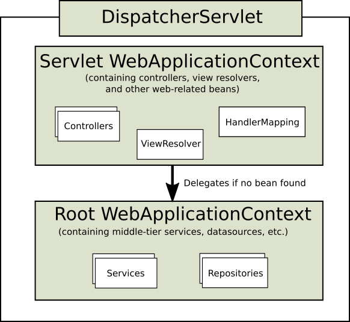
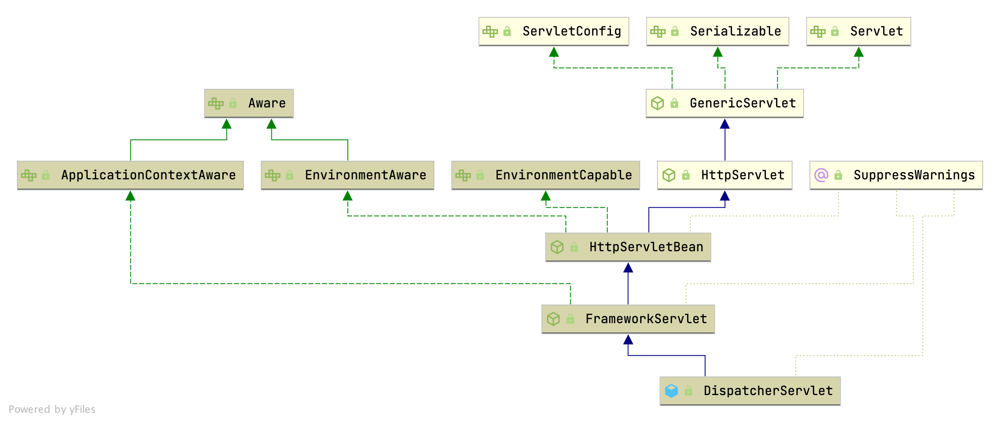
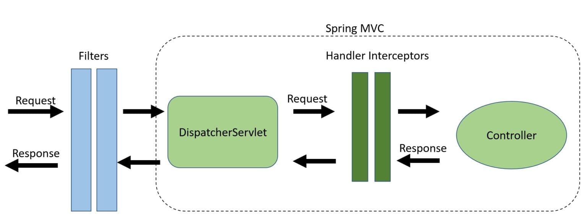

## Introduction

[Spring Web MVC](https://docs.spring.io/spring-framework/docs/current/reference/html/web.html#mvc) 是基于 Servlet API 构建的原始 Web 框架，从一开始就包含在 Spring Framework 中。
其正式名称 "Spring Web MVC" 来自其源模块 (spring-webmvc)，但更常被称为 "Spring MVC"。

与 Spring Web MVC 并行，Spring Framework 5.0 引入了一个响应式栈的 Web 框架，其名称 ["Spring WebFlux"](/docs/CS/Framework/Spring/webflux.md) 也基于其源模块 (spring-webflux)。

### DispatcherServlet

Spring MVC 与许多其他 Web 框架一样，围绕前端控制器模式设计，其中核心的 `Servlet`——`DispatcherServlet`，
提供了请求处理的通用算法，而实际工作由可配置的委托组件执行。
这种模型非常灵活，支持多样化的工作流程。

DispatcherServlet 与任何 Servlet 一样，需要根据 Servlet 规范通过 Java 配置或在 web.xml 中声明和映射。
然后，DispatcherServlet 使用 Spring 配置来发现它所需用于请求映射、视图解析、异常处理等的委托组件。

比如 Spring MVC 中的 DispatcherServlet，就是在 init 方法里创建了自己的 Spring 容器

<!-- tabs:start -->

##### **Java configuration**

以下 Java 配置示例注册并初始化了 DispatcherServlet，它会由 Servlet 容器自动检测（参见 Servlet Config）：

```java
public class MyWebApplicationInitializer implements WebApplicationInitializer {

	@Override
	public void onStartup(ServletContext servletContext) {

		// Load Spring web application configuration
		AnnotationConfigWebApplicationContext context = new AnnotationConfigWebApplicationContext();
		context.register(AppConfig.class);

		// Create and register the DispatcherServlet
		DispatcherServlet servlet = new DispatcherServlet(context);
		ServletRegistration.Dynamic registration = servletContext.addServlet("app", servlet);
		registration.setLoadOnStartup(1);
		registration.addMapping("/app/*");
	}
}
```

##### **web.xml**

以下 web.xml 配置示例注册并初始化了 DispatcherServlet：

```xml
<web-app>

	<listener>
		<listener-class>org.springframework.web.context.ContextLoaderListener</listener-class>
	</listener>

	<context-param>
		<param-name>contextConfigLocation</param-name>
		<param-value>/WEB-INF/app-context.xml</param-value>
	</context-param>

	<servlet>
		<servlet-name>app</servlet-name>
		<servlet-class>org.springframework.web.servlet.DispatcherServlet</servlet-class>
		<init-param>
			<param-name>contextConfigLocation</param-name>
			<param-value></param-value>
		</init-param>
		<load-on-startup>1</load-on-startup>
	</servlet>

	<servlet-mapping>
		<servlet-name>app</servlet-name>
		<url-pattern>/app/*</url-pattern>
	</servlet-mapping>

</web-app>
```

<!-- tabs:end -->

## Context Hierarchy

DispatcherServlet 期望一个 WebApplicationContext（普通 ApplicationContext 的扩展）作为其自身配置。
WebApplicationContext 与 ServletContext 及其关联的 Servlet 相关联。
它还被绑定到 ServletContext，以便应用可以使用 RequestContextUtils 上的静态方法来查找 WebApplicationContext（如果需要访问）。

根 WebApplicationContext 通常包含基础设施 beans，例如数据仓库和业务服务，这些需要在多个 Servlet 实例之间共享。
这些 beans 可以被继承，并在特定于 Servlet 的子 WebApplicationContext 中被覆盖（即重新声明），该子上下文通常包含特定于该 Servlet 的 beans。

下图展示了这种关系：

<div style="text-align: center;">



</div>

<p style="text-align: center;">
Fig.1. Context Hierarchy.
</p>

## Init

### ContextLoaderListener

用于启动和关闭 Spring **根 WebApplicationContext** 的引导监听器。
简单地委托给 ContextLoader 以及 ContextCleanupListener。
从 Spring 3.1 开始，ContextLoaderListener 支持通过 ContextLoaderListener(WebApplicationContext) 构造函数注入根 Web 应用上下文，允许在 Servlet 3.0+ 环境中进行程序化配置。
有关使用示例，请参阅 org.springframework.web.WebApplicationInitializer。

> [!TIP]
>
> Spring Boot 默认只有一个上下文

```java
public class ContextLoaderListener extends ContextLoader implements ServletContextListener {

   // Initialize the root web application context.
   @Override
   public void contextInitialized(ServletContextEvent event) {
      initWebApplicationContext(event.getServletContext());
   }


   // Close the root web application context.
   @Override
   public void contextDestroyed(ServletContextEvent event) {
      closeWebApplicationContext(event.getServletContext());
      ContextCleanupListener.cleanupAttributes(event.getServletContext());
   }
}
```

为给定的 servlet 上下文初始化 Spring 的 Web 应用上下文，使用构造时提供的应用上下文，
或根据 "contextClass" 和 "contextConfigLocation" 上下文参数创建一个新的。

```java
public class ContextLoaderListener extends ContextLoader implements ServletContextListener {
    public WebApplicationContext initWebApplicationContext(ServletContext servletContext) {
        servletContext.log("Initializing Spring root WebApplicationContext");
        try {
            // Store context in local instance variable, to guarantee that it is available on ServletContext shutdown.
            if (this.context == null) {
                this.context = createWebApplicationContext(servletContext);
            }
            if (this.context instanceof ConfigurableWebApplicationContext) {
                ConfigurableWebApplicationContext cwac = (ConfigurableWebApplicationContext) this.context;
                if (!cwac.isActive()) {
                    // The context has not yet been refreshed -> provide services such as setting the parent context, setting the application context id, etc
                    if (cwac.getParent() == null) {
                        // The context instance was injected without an explicit parent ->
                        // determine parent for root web application context, if any.
                        ApplicationContext parent = loadParentContext(servletContext);
                        cwac.setParent(parent);
                    }
                    configureAndRefreshWebApplicationContext(cwac, servletContext);
                }
            }
            servletContext.setAttribute(WebApplicationContext.ROOT_WEB_APPLICATION_CONTEXT_ATTRIBUTE, this.context);

            ClassLoader ccl = Thread.currentThread().getContextClassLoader();
            if (ccl == ContextLoader.class.getClassLoader()) {
                currentContext = this.context;
            } else if (ccl != null) {
                currentContextPerThread.put(ccl, this.context);
            }
            return this.context;
        } catch (RuntimeException | Error ex) {
            servletContext.setAttribute(WebApplicationContext.ROOT_WEB_APPLICATION_CONTEXT_ATTRIBUTE, ex);
            throw ex;
        }
    }
}
```

#### createWebApplicationContext

```
protected WebApplicationContext createWebApplicationContext(ServletContext sc) {
    // Return the WebApplicationContext implementation class to use, either the default XmlWebApplicationContext or a custom context class if specified.
   Class<?> contextClass = determineContextClass(sc);
   if (!ConfigurableWebApplicationContext.class.isAssignableFrom(contextClass)) {
      throw new ApplicationContextException("");
   }
   return (ConfigurableWebApplicationContext) BeanUtils.instantiateClass(contextClass);
}
```

#### configureAndRefreshWebApplicationContext

```java
public class ContextLoaderListener extends ContextLoader implements ServletContextListener {
    protected void configureAndRefreshWebApplicationContext(ConfigurableWebApplicationContext wac, ServletContext sc) {
        wac.setServletContext(sc);
        String configLocationParam = sc.getInitParameter(CONFIG_LOCATION_PARAM);

        // The wac environment's #initPropertySources will be called in any case when the context
        // is refreshed; do it eagerly here to ensure servlet property sources are in place for
        // use in any post-processing or initialization that occurs below prior to #refresh
        ConfigurableEnvironment env = wac.getEnvironment();
        if (env instanceof ConfigurableWebEnvironment) {
            ((ConfigurableWebEnvironment) env).initPropertySources(sc, null);
        }

        customizeContext(sc, wac);
        wac.refresh();
    }
}
```

### ServletContainerInitializer

一个由 Spring 提供的 ServletContainerInitializer，设计用于支持使用 Spring 的 WebApplicationInitializer SPI 进行基于代码的 Servlet 容器配置，
而不是（或可能结合）传统的基于 web.xml 的方式。

此类将被加载和实例化，其 onStartup 方法将由任何符合 Servlet 规范的容器在容器启动时调用，前提是 classpath 中存在 spring-web 模块 JAR。
这通过 JAR Services API ServiceLoader.load(Class) 方法检测 spring-web 模块的 META-INF/services/jakarta.servlet.ServletContainerInitializer 服务提供者配置文件来实现。

```java
public interface ServletContainerInitializer {
    void onStartup(Set<Class<?>> c, ServletContext ctx) throws ServletException;
}
```

#### SpringBootServletInitializer

```java
public abstract class SpringBootServletInitializer implements WebApplicationInitializer {

    @Override
    public void onStartup(ServletContext servletContext) throws ServletException {
        // Logger initialization is deferred in case an ordered
        // LogServletContextInitializer is being used
        this.logger = LogFactory.getLog(getClass());
        WebApplicationContext rootApplicationContext = createRootApplicationContext(servletContext);
        if (rootApplicationContext != null) {
            servletContext.addListener(new SpringBootContextLoaderListener(rootApplicationContext, servletContext));
        } else {
            this.logger.debug("No ContextLoaderListener registered, as createRootApplicationContext() did not "
                    + "return an application context");
        }
    }

    protected WebApplicationContext createRootApplicationContext(ServletContext servletContext) {
        SpringApplicationBuilder builder = createSpringApplicationBuilder();
        builder.main(getClass());
        ApplicationContext parent = getExistingRootWebApplicationContext(servletContext);
        if (parent != null) {
            this.logger.info("Root context already created (using as parent).");
            servletContext.setAttribute(WebApplicationContext.ROOT_WEB_APPLICATION_CONTEXT_ATTRIBUTE, null);
            builder.initializers(new ParentContextApplicationContextInitializer(parent));
        }
        builder.initializers(new ServletContextApplicationContextInitializer(servletContext));
        builder.contextClass(AnnotationConfigServletWebServerApplicationContext.class);
        builder = configure(builder);
        builder.listeners(new WebEnvironmentPropertySourceInitializer(servletContext));
        SpringApplication application = builder.build();
        if (application.getAllSources().isEmpty()
                && MergedAnnotations.from(getClass(), SearchStrategy.TYPE_HIERARCHY).isPresent(Configuration.class)) {
            application.addPrimarySources(Collections.singleton(getClass()));
        }
        Assert.state(!application.getAllSources().isEmpty(),
                "No SpringApplication sources have been defined. Either override the "
                        + "configure method or add an @Configuration annotation");
        // Ensure error pages are registered
        if (this.registerErrorPageFilter) {
            application.addPrimarySources(Collections.singleton(ErrorPageFilterConfiguration.class));
        }
        application.setRegisterShutdownHook(false);
        return run(application);
    }
}
```

应用继承 SpringBootServletInitializer 并启动

```java
public class IngredientServiceServletInitializer extends SpringBootServletInitializer {
  @Override
  protected SpringApplicationBuilder configure(SpringApplicationBuilder builder) {
    return builder.sources(IngredientServiceApplication.class);
  }
}
```

### Init Servlet



HttpServletBean.init -> initServletBean -> initWebApplicationContext -> onRefresh -> DispatcherServlet.initStrategies

#### initWebApplicationContext

```java
public abstract class FrameworkServlet extends HttpServletBean implements ApplicationContextAware {
    protected WebApplicationContext initWebApplicationContext() {
        // get rootContext which created at ContextLoaderListener
        WebApplicationContext rootContext =
                WebApplicationContextUtils.getWebApplicationContext(getServletContext());
        WebApplicationContext wac = null;

        if (this.webApplicationContext != null) {
            // A context instance was injected at construction time -> use it
            wac = this.webApplicationContext;
            if (wac instanceof ConfigurableWebApplicationContext) {
                ConfigurableWebApplicationContext cwac = (ConfigurableWebApplicationContext) wac;
                if (!cwac.isActive()) {
                    // The context has not yet been refreshed -> provide services such as
                    // setting the parent context, setting the application context id, etc
                    if (cwac.getParent() == null) {
                        // The context instance was injected without an explicit parent -> set
                        // the root application context (if any; may be null) as the parent
                        cwac.setParent(rootContext);
                    }
                    configureAndRefreshWebApplicationContext(cwac);
                }
            }
        }
        if (wac == null) {
            // No context instance was injected at construction time -> see if one
            // has been registered in the servlet context. If one exists, it is assumed
            // that the parent context (if any) has already been set and that the
            // user has performed any initialization such as setting the context id
            wac = findWebApplicationContext();
        }
        if (wac == null) {
            // No context instance is defined for this servlet -> create a local one
            wac = createWebApplicationContext(rootContext);
        }

        if (!this.refreshEventReceived) {
            // Either the context is not a ConfigurableApplicationContext with refresh
            // support or the context injected at construction time had already been
            // refreshed -> trigger initial onRefresh manually here.
            synchronized (this.onRefreshMonitor) {
                onRefresh(wac);
            }
        }

        if (this.publishContext) {
            // Publish the context as a servlet context attribute.
            String attrName = getServletContextAttributeName();
            getServletContext().setAttribute(attrName, wac);
        }

        return wac;
    }
}
```

为当前 ApplicationContext 默认加载 beans。
```java
public abstract class AbstractHandlerMethodMapping<T> extends AbstractHandlerMapping implements InitializingBean {
    @Override
    public void afterPropertiesSet() {
        initHandlerMethods();
    }
    protected void initHandlerMethods() {
        for (String beanName : getCandidateBeanNames()) {
            if (!beanName.startsWith(SCOPED_TARGET_NAME_PREFIX)) {
                processCandidateBean(beanName);
            }
        }
        handlerMethodsInitialized(getHandlerMethods());
    }

    protected String[] getCandidateBeanNames() {
        return (this.detectHandlerMethodsInAncestorContexts ?
                BeanFactoryUtils.beanNamesForTypeIncludingAncestors(obtainApplicationContext(), Object.class) :
                obtainApplicationContext().getBeanNamesForType(Object.class));
    }
}
```

#### initStrategies

```java
public class DispatcherServlet extends FrameworkServlet {

    @Override
    protected void onRefresh(ApplicationContext context) {
        initStrategies(context);
    }

    protected void initStrategies(ApplicationContext context) {
        initMultipartResolver(context);
        initLocaleResolver(context);
        initThemeResolver(context);
        initHandlerMappings(context);
        initHandlerAdapters(context);
        initHandlerExceptionResolvers(context);
        initRequestToViewNameTranslator(context);
        initViewResolvers(context);
        initFlashMapManager(context);
    }
}
```

## dispatch

所有 HTTP 请求都调用 `processRequest` -> doService -> doDispatch

```java
public abstract class FrameworkServlet extends HttpServletBean implements ApplicationContextAware {
    @Override
    protected final void doPost(HttpServletRequest request, HttpServletResponse response)
            throws ServletException, IOException {

        processRequest(request, response);
    }
}
```

### doDispatch

处理实际的分发到处理程序。
处理程序将通过按顺序应用 servlet 的 HandlerMappings 来获取。HandlerAdapter 将通过查询 servlet 安装的 HandlerAdapters 来找到第一个支持该处理程序类的适配器。
所有 HTTP 方法都由该方法处理。
由 HandlerAdapters 或处理程序本身决定哪些方法是可接受的。

```java
public class DispatcherServlet extends FrameworkServlet {
    protected void doDispatch(HttpServletRequest request, HttpServletResponse response) throws Exception {
        HttpServletRequest processedRequest = request;
        HandlerExecutionChain mappedHandler = null;
        boolean multipartRequestParsed = false;

        WebAsyncManager asyncManager = WebAsyncUtils.getAsyncManager(request);

        try {
            ModelAndView mv = null;
            Exception dispatchException = null;

            try {
                processedRequest = checkMultipart(request);
                multipartRequestParsed = (processedRequest != request);

                // Determine handler for the current request.
                mappedHandler = getHandler(processedRequest);
                if (mappedHandler == null) {
                    noHandlerFound(processedRequest, response);
                    return;
                }

                // Determine handler adapter for the current request.
                HandlerAdapter ha = getHandlerAdapter(mappedHandler.getHandler());

                // Process last-modified header, if supported by the handler.
                String method = request.getMethod();
                boolean isGet = "GET".equals(method);
                if (isGet || "HEAD".equals(method)) {
                    long lastModified = ha.getLastModified(request, mappedHandler.getHandler());
                    if (new ServletWebRequest(request, response).checkNotModified(lastModified) && isGet) {
                        return;
                    }
                }

                if (!mappedHandler.applyPreHandle(processedRequest, response)) {
                    return;
                }

                // Actually invoke the handler.
                mv = ha.handle(processedRequest, response, mappedHandler.getHandler());

                if (asyncManager.isConcurrentHandlingStarted()) {
                    return;
                }

                applyDefaultViewName(processedRequest, mv);
                mappedHandler.applyPostHandle(processedRequest, response, mv);
            } catch (Exception ex) {
                dispatchException = ex;
            } catch (Throwable err) {
                // As of 4.3, we're processing Errors thrown from handler methods as well,
                // making them available for @ExceptionHandler methods and other scenarios.
                dispatchException = new NestedServletException("Handler dispatch failed", err);
            }
            processDispatchResult(processedRequest, response, mappedHandler, mv, dispatchException);
        } catch (Exception ex) {
            triggerAfterCompletion(processedRequest, response, mappedHandler, ex);
        } catch (Throwable err) {
            triggerAfterCompletion(processedRequest, response, mappedHandler,
                    new NestedServletException("Handler processing failed", err));
        } finally {
            if (asyncManager.isConcurrentHandlingStarted()) {
                // Instead of postHandle and afterCompletion
                if (mappedHandler != null) {
                    mappedHandler.applyAfterConcurrentHandlingStarted(processedRequest, response);
                }
            } else {
                // Clean up any resources used by a multipart request.
                if (multipartRequestParsed) {
                    cleanupMultipart(processedRequest);
                }
            }
        }
    }
}
```

1. RequestMappingHandlerMapping.mapping
2. interceptor preHandler
3. HandlerMethodArgumentResolver resolve params
4. call method in Controller
5. HandlerMethodReturnValueHandler resolve returnValue
6. modelAndView wrap returnValue
7. interceptor postHandler
8. HandlerExceptionResolver handle Exception
9. View
10. interceptor afterCompletion
11. writeWithMessageConverter

## Advice

ContollerAdvice 只能拦截控制器中的异常，换言之，只能拦截 500 之类的异常，但是对于 404 这样不会进入控制器处理的异常不起作用
Springboot 会将所有的异常发送到路径为 server.error.path（application.properties 中可配置，默认为"/error"）的控制器方法中进行处理，

通过重写 AbstractErrorController 自定义异常处理

```java
@Controller
@RequestMapping("/server/error")
public class CustomErrHandleController extends AbstractErrorController
{
}
```

## Chain

HandlerInterceptors 是 Spring MVC 框架的一部分，位于 DispatcherServlet 和我们的 Controllers 之间。

HandlerInterceptor 基本类似于 Servlet Filter，
但与后者不同，它只允许自定义预处理（可以选择禁止处理程序本身的执行）和自定义后处理。

Filter 更强大，例如它们允许交换沿链传递的请求和响应对象。
注意，Filter 在 web.xml 中配置，而 HandlerInterceptor 在应用上下文中配置。

作为基本指导，细粒度的与处理程序相关的预处理任务是 HandlerInterceptor 实现的候选，
特别是提取公共处理程序代码和授权检查。
另一方面，Filter 非常适合处理请求内容和视图内容，例如 multipart 表单和 GZIP 压缩。
这通常体现在需要将 Filter 映射到某些内容类型（例如图片）或所有请求时。

[Spring Security](/docs/CS/Framework/Spring/Security.md) 是使用 Filter 进行身份验证和授权的一个很好的例子。
要配置 Spring Security，我们只需添加一个 Filter——DelegatingFilterProxy。
Spring Security 可以拦截所有传入和传出的流量。
这就是 Spring Security 可以在 Spring MVC 之外使用的原因。



### HandlerInterceptor

- HandlerInterceptor/AsyncHandlerInterceptor

- ResponseBodyAdvice

> [Spring Interceptor vs AOP](https://coderanch.com/t/636483/frameworks/Spring-Interceptor-AOP)
>
> MVC Interceptor is a MVC only concept. They can intercept requests to the controller only.
> [AOP](/docs/CS/Framework/Spring/AOP.md) can be used to intercept calls to any public method in any Spring loaded bean.
>
> AOP is only option to use if you are trying to weave code into your service layer.
> A Controller method can be intercepted by either an Aspect or a HandlerInterceptor.
> The difference is that the AOP advice only has access to the controller being called, and the parameters being passed to the method.
> A HandlerInterceptor always has access to the complete HttpRequest, HttpResponse and the object being called.
> So, if your interceptor is doing something that requires it to always have access to the Request and response, you should use HandlerInterceptor.
> If you want to do something with the parameters to the controller method, you should write an Aspect

```java
public interface HandlerInterceptor {
	default boolean preHandle(HttpServletRequest request, HttpServletResponse response, Object handler)
			throws Exception {
		return true;
	}
	default void postHandle(HttpServletRequest request, HttpServletResponse response, Object handler,
			@Nullable ModelAndView modelAndView) throws Exception {
	}
	default void afterCompletion(HttpServletRequest request, HttpServletResponse response, Object handler,
			@Nullable Exception ex) throws Exception {
	}
}
```

### Filter

1. @WebFilter @ServletComponentScan FilterRegistration
2. @Component + implements Filter

ServletComponentRegisteringPostProcessor

actual FilterRegistrationBean

Filter will be create when web server start

see [FilterChain.doFilter() in Tomcat](/docs/CS/Framework/Tomcat/Connector.md?id=doFilter)

Spring MVC 通过控制器上的注解为 CORS 配置提供了细粒度支持。
但是，当与 [Spring Security](/docs/CS/Framework/Spring/Security.md) 一起使用时，我们建议依赖内置的 CorsFilter，它必须排在 Spring Security 的过滤器链之前。

## Asynchronous Requests

Spring MVC 与 Servlet 3.0 异步请求处理有广泛的集成：

- 控制器方法中的 DeferredResult 和 Callable 返回值提供了对单个异步返回值的基本支持。
- 控制器可以流式传输多个值，包括 SSE 和原始数据。
- 控制器可以使用响应式客户端并返回响应式类型进行响应处理。

Servlet API 最初是为通过 Filter-Servlet 链的单个传递而构建的。
Servlet 3.0 中新增的异步请求处理允许应用退出 Filter-Servlet 链，但保持响应打开以供进一步处理。
Spring MVC 的异步支持就是围绕这种机制构建的。当控制器返回 DeferredResult 时，Filter-Servlet 链退出，Servlet 容器线程被释放。
稍后，当 DeferredResult 被设置时，会进行一个 ASYNC 分发（到相同的 URL），在此期间控制器再次被映射，但不是调用它，而是使用 DeferredResult 值（就像控制器返回了它一样）来恢复处理。

从编程模型的角度来看，Spring MVC 和 Spring WebFlux 都支持控制器方法返回值的异步和响应式类型。
Spring MVC 甚至支持流式传输，包括响应式背压。
然而，**对响应的每次写入仍然是阻塞的（并在单独的线程上执行）**，这与 WebFlux 不同，WebFlux 依赖非阻塞 I/O，不需要为每次写入额外的线程。

另一个根本区别是 **Spring MVC 不支持控制器方法参数中的异步或响应式类型（例如 @RequestBody、@RequestPart 等）**，
也不支持将异步和响应式类型作为模型属性。
Spring WebFlux 完全支持所有这些。

## Extension

1. must declare @PathVariable @RequestParam or @RequestBody
2. Nested Validation need to add `@Valid` at field

Init DispatchServlet when startup

```properties
spring.mvc.servlet.load-on-startup=1
```

Other servlet

```properties
spring.webservices.servlet.load-on-startup=1
```

### Resolver

```java
public interface WebMvcConfigurer {
    default void addArgumentResolvers(List<HandlerMethodArgumentResolver> resolvers) {
    }
}
```

#### Request Header Resolver

receive all headers
```
@RequestHeader() MultiValueMap map
// Perfer below way
@RequestHeader() HttpHeaders map
```

request header in MultiValueMap are case-sensitive

### Converter

```java
public class FormattingConversionService extends GenericConversionService
		implements FormatterRegistry, EmbeddedValueResolverAware {
    @Override
    public void addFormatterForFieldAnnotation(AnnotationFormatterFactory<? extends Annotation> annotationFormatterFactory) {
        Class<? extends Annotation> annotationType = getAnnotationType(annotationFormatterFactory);
        if (this.embeddedValueResolver != null &&
                annotationFormatterFactory instanceof EmbeddedValueResolverAware embeddedValueResolverAware) {
            embeddedValueResolverAware.setEmbeddedValueResolver(this.embeddedValueResolver);
        }
        Set<Class<?>> fieldTypes = annotationFormatterFactory.getFieldTypes();
        for (Class<?> fieldType : fieldTypes) {
            addConverter(new AnnotationPrinterConverter(annotationType, annotationFormatterFactory, fieldType));
            addConverter(new AnnotationParserConverter(annotationType, annotationFormatterFactory, fieldType));
        }
    }
}
```

```
@DateTimeFormat(pattern="yyyy-MM-dd HH:mm:ss") Date date
```

避免在将响应 String 转换为 Object 时出现 response can not cast to String Exception

```java
@EnableWebMvc
@Configuration
public class WebConfiguration implements WebMvcConfigurer {

    @Override
    public void configureMessageConverters(List<HttpMessageConverter<?>> converters) {
        converters.add(0, new MappingJackson2HttpMessageConverter());
    }
}
```

GsonMessageConverter

> [!TIP]
>
> `@JsonIgnore` not work when not using Jackson.

#### MessageConverter

通过从给定的 HttpInputMessage 读取数据，创建预期参数类型的方法参数值。

```java
public class RequestResponseBodyMethodProcessor extends AbstractMessageConverterMethodProcessor {
  
    @Override
    public boolean supportsParameter(MethodParameter parameter) {
        return parameter.hasParameterAnnotation(RequestBody.class);
    }
  
    @Override
    public boolean supportsReturnType(MethodParameter returnType) {
        return (AnnotatedElementUtils.hasAnnotation(returnType.getContainingClass(), ResponseBody.class) ||
                returnType.hasMethodAnnotation(ResponseBody.class));
    }

    @Override
    public Object resolveArgument(MethodParameter parameter, @Nullable ModelAndViewContainer mavContainer,
                                  NativeWebRequest webRequest, @Nullable WebDataBinderFactory binderFactory) throws Exception {

        parameter = parameter.nestedIfOptional();
        Object arg = readWithMessageConverters(webRequest, parameter, parameter.getNestedGenericParameterType());
        String name = Conventions.getVariableNameForParameter(parameter);

        if (binderFactory != null) {
            WebDataBinder binder = binderFactory.createBinder(webRequest, arg, name);
            if (arg != null) {
                validateIfApplicable(binder, parameter);
                if (binder.getBindingResult().hasErrors() && isBindExceptionRequired(binder, parameter)) {
                    throw new MethodArgumentNotValidException(parameter, binder.getBindingResult());
                }
            }
            if (mavContainer != null) {
                mavContainer.addAttribute(BindingResult.MODEL_KEY_PREFIX + name, binder.getBindingResult());
            }
        }

        return adaptArgumentIfNecessary(arg, parameter);
    }
}
```

### Static Resources

默认情况下，Spring Boot 从 classpath 中的以下位置之一提供静态内容：

1. /static
2. /public
3. /resources
4. /META-INF/resources

我们可以使用 `spring.resources.static-locations` 属性自定义静态资源位置。

我们可以通过覆盖 `WebMvcConfigurer` 的 `addResourceHandlers` 方法来指定额外的静态位置。

### Request

log http request

```yaml
logging:
  level:
    org.apache.coyote.http11.Http11InputBuffer: debug
```

test

```yaml
logging:
  level:
    org.springframework.web.servlet.mvc.method.annotation.RequestResponseBodyMethodProcessor: debug
```

validate requestBody

```java
// HandlerMethodArgumentResolverComposite
@Nullable
public Object resolveArgument(MethodParameter parameter, @Nullable ModelAndViewContainer mavContainer,
    NativeWebRequest webRequest, @Nullable WebDataBinderFactory binderFactory) throws Exception {

    HandlerMethodArgumentResolver resolver = getArgumentResolver(parameter);
    if (resolver == null) {
    throw new IllegalArgumentException("Unsupported parameter type [" +
    parameter.getParameterType().getName() + "]. supportsParameter should be called first.");
    }
    return resolver.resolveArgument(parameter, mavContainer, webRequest, binderFactory);
}
        
// RequestResponseBodyMethodProcessor
@Override
public boolean supportsParameter(MethodParameter parameter) {
    return parameter.hasParameterAnnotation(RequestBody.class);
}

@Nullable
public Object resolveArgument(MethodParameter parameter, @Nullable ModelAndViewContainer mavContainer,
NativeWebRequest webRequest, @Nullable WebDataBinderFactory binderFactory) throws Exception {
    parameter = parameter.nestedIfOptional();
    Object arg = readWithMessageConverters(webRequest, parameter, parameter.getNestedGenericParameterType());

    if (binderFactory != null) {
        String name = Conventions.getVariableNameForParameter(parameter);
        ResolvableType type = ResolvableType.forMethodParameter(parameter);
        WebDataBinder binder = binderFactory.createBinder(webRequest, arg, name, type);
        if (arg != null) {
            // Validate the binding target if applicable.
            // The default implementation checks for @jakarta.validation.Valid, Spring's org.springframework.validation.annotation.Validated, 
            // and custom annotations whose name starts with "Valid".
            validateIfApplicable(binder, parameter);
            if (binder.getBindingResult().hasErrors() && isBindExceptionRequired(binder, parameter)) {
                throw new MethodArgumentNotValidException(parameter, binder.getBindingResult());
            }
        }
        if (mavContainer != null) {
            mavContainer.addAttribute(BindingResult.MODEL_KEY_PREFIX + name, binder.getBindingResult());
        }
    }

    return adaptArgumentIfNecessary(arg, parameter);
}
```
nested filed validation must annotate with ` @jakarta.validation.Valid`

### Http2

```properties
server.http2.enabled=true
server.port = 8443
server.ssl.key-store=classpath:my_keystore.jks
server.ssl.key-store-password=secretpassword
```

## Links

- [Spring](/docs/CS/Framework/Spring/Spring.md)

## References

1. [Spring Web MVC](https://docs.spring.io/spring-framework/docs/current/reference/html/web.html#mvc)
2. [Spring MVC 实现原理与源码解析系统 —— 精品合集](https://www.iocoder.cn/Spring-MVC/good-collection/?title)
