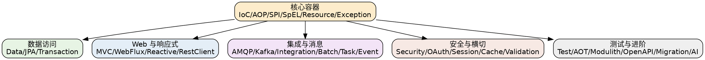

## Introduction

本目录是 **Spring Framework 7.x / Boot 4** 的专题索引。Spring 的主线是 [Spring](/docs/CS/Framework/Spring/Spring.md)（IoC 容器、AOP、事务），并向外延伸到数据访问（Data / JPA）、Web（MVC / WebFlux / RestClient）、消息与集成（AMQP / Kafka / Integration）、安全（Security / OAuth）、以及测试与 AOT 等横切关注点。相关组件见 [Spring Boot](/docs/CS/Framework/Spring_Boot/Spring_Boot.md) 与 [Spring Cloud](/docs/CS/Framework/Spring_Cloud/README.md)。

> [!NOTE]
> 版本基线以 [Spring](/docs/CS/Framework/Spring/Spring.md) 顶部的「版本基线」表为准：Framework 7.x / Boot 4.x / Security 7.x / Data 2025.1.x 等。starter 改名（`web`→`webmvc` 等）、`javax`→`jakarta`、配置根变化等破坏性变更均已在各篇标注。

## 核心容器（Core）

Spring 的地基。围绕 Bean 的生命周期与容器扩展机制展开。

- [IoC](/docs/CS/Framework/Spring/IoC.md)：容器与 Bean 生命周期、`BeanFactory` / `ApplicationContext`、依赖注入与自动装配。
- [AOP](/docs/CS/Framework/Spring/AOP.md)：代理机制（`JDK` 动态代理 vs CGLIB）、切面表达式、拦截器链。
- [SPI](/docs/CS/Framework/Spring/SPI.md)：`Java SPI` 的 Spring 实现（`spring.factories` / `aot.factories`）、扩展点注册。
- [Resource](/docs/CS/Framework/Spring/Resource.md)：资源抽象与加载、`Environment` 抽象。
- [SpEL](/docs/CS/Framework/Spring/SpEL.md)：表达式语言，配置绑定与运行时计算的基础。
- [Exception](/docs/CS/Framework/Spring/Exception.md)：异常体系与错误处理。

## 数据访问

- [Data](/docs/CS/Framework/Spring/Data.md)：`JdbcTemplate` / JdbcClient、事务集成、R2DBC。
- [JPA](/docs/CS/Framework/Spring/JPA.md)：JPA 与 Hibernate 集成、实体映射、懒加载与会话语义。
- [Transaction](/docs/CS/Framework/Spring/Transaction.md)：声明式与编程式事务、传播行为、`@Transactional` 失效场景。
- [Cache](/docs/CS/Framework/Spring/Cache.md)：缓存抽象（`@Cacheable`）、CacheManager、自定义缓存接入。

## Web 与响应式

- [MVC](/docs/CS/Framework/Spring/MVC.md)：Spring MVC 请求处理链路、DispatcherServlet、参数解析。
- [webflux](/docs/CS/Framework/Spring/webflux.md)：WebFlux 响应式 Web 栈，与虚拟线程（`spring.threads.virtual.enabled`）取舍。
- [Reactive](/docs/CS/Framework/Spring/Reactive.md)：Project Reactor 基础与操作符、响应式上下文（用 Reactor `Context` 而非 ThreadLocal）。
- [RestClient](/docs/CS/Framework/Spring/RestClient.md)：同步 HTTP 客户端（`RestTemplate` 的现代替代）。
- [WebSocket](/docs/CS/Framework/Spring/WebSocket.md)：WebSocket 与消息通信。

## 集成与消息

- [AMQP](/docs/CS/Framework/Spring/AMQP.md)：Spring AMQP（RabbitMQ）。
- [Kafka](/docs/CS/Framework/Spring/Kafka.md)：Spring for Apache Kafka，消费语义与 `AckMode`（默认 `BATCH` 是 at-least-once，精准控须 `MANUAL_IMMEDIATE`）。
- [Integration](/docs/CS/Framework/Spring/Integration.md)：Spring Integration 消息编排。
- [Batch](/docs/CS/Framework/Spring/Batch.md)：批处理（Boot 4 默认改内存，谨慎）。
- [Task](/docs/CS/Framework/Spring/Task.md)：异步任务与调度、`@Async`。
- [Event](/docs/CS/Framework/Spring/Event.md)：应用事件（`@TransactionalEventListener` 的 `fallbackExecution` 默认 false 易丢事件）。

## 安全与横切

- [Security](/docs/CS/Framework/Spring/Security.md)：Spring Security 7（过滤器链、方法安全、配置新范式；SAS 已并入 7.0）。
- [OAuth](/docs/CS/Framework/Spring/OAuth.md)：OAuth2 / OIDC 客户端与服务端（`spring.security.oauth2.*`）。
- [Session](/docs/CS/Framework/Spring/Session.md)：会话管理（Redis / JDBC Session）。
- [Validation](/docs/CS/Framework/Spring/Validation.md)：Bean Validation。

## 测试与进阶

- [Test](/docs/CS/Framework/Spring/Test.md)：测试支持（`@MockitoBean` 取代 `@MockBean`；测试依赖拆 `xxx-test` starter）。
- [AOT](/docs/CS/Framework/Spring/AOT.md)：Ahead-of-Time 编译（经 `aot.factories`），配合 GraalVM native。
- [Modulith](/docs/CS/Framework/Spring/Modulith.md)：模块化单体（Modulith 2.0）。
- [OpenAPI](/docs/CS/Framework/Spring/OpenAPI.md)：springdoc-openapi 3.x。
- [Migration](/docs/CS/Framework/Spring/Migration.md)：框架迁移与版本升级注意事项。
- [AI](/docs/CS/Framework/Spring/AI.md)：Spring AI 集成。

## Links

- [Spring Boot](/docs/CS/Framework/Spring_Boot/Spring_Boot.md)
- [Spring Cloud](/docs/CS/Framework/Spring_Cloud/README.md)
- [MyBatis（常用持久层替代）](/docs/CS/Framework/MyBatis/README.md)
- [Hibernate（JPA 实现）](/docs/CS/Framework/Hibernate/Hibernate.md)
- [Framework 总索引](/docs/CS/Framework/README.md)

## References

1. [Spring Framework Reference](https://docs.spring.io/spring-framework/reference/)
2. [Spring Boot Reference](https://docs.spring.io/spring-boot/index.html)
3. [Spring for Apache Kafka](https://docs.spring.io/spring-kafka/reference/)
