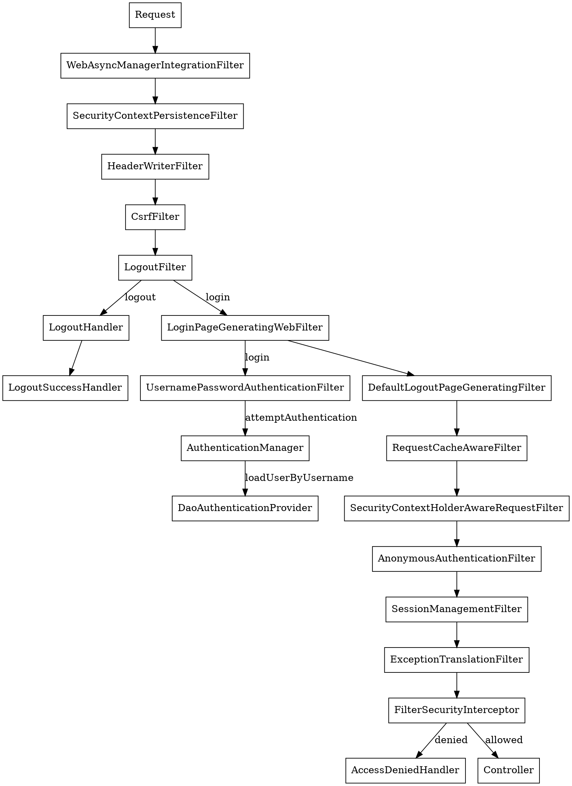

## Introduction

[Spring Security](https://spring.io/projects/spring-security) 是一个功能强大且高度可定制的身份验证和访问控制框架。
它是保护基于 Spring 的应用的事实标准。
Spring Security 是一个专注于为 Java 应用提供身份验证和授权的框架。

## Architecture

Spring Security 的 Servlet 支持基于 Servlet Filters，因此首先了解 Filter 的作用会很有帮助。
客户端向应用发送请求，容器创建一个 FilterChain，其中包含根据请求 URI 路径应处理 HttpServletRequest 的 Filters 和 Servlet。
在 Spring MVC 应用中，Servlet 是 DispatcherServlet 的一个实例。
最多只有一个 Servlet 可以处理单个 HttpServletRequest 和 HttpServletResponse。
然而，可以使用多个 Filter 来：
- 阻止下游 Filters 或 Servlet 被调用。在这种情况下，Filter 通常会写入 HttpServletResponse。
- 修改下游 Filters 和 Servlet 使用的 HttpServletRequest 或 HttpServletResponse

由于 Filter 仅影响下游的 Filters 和 Servlet，每个 Filter 被调用的顺序非常重要。

### DelegatingFilterProxy

Spring 提供了一个名为 DelegatingFilterProxy 的 Filter 实现，它允许在 Servlet 容器的生命周期和 Spring 的 ApplicationContext 之间建立桥梁。
Servlet 容器允许使用自己的标准注册 Filters，但它不知道 Spring 定义的 Beans。
DelegatingFilterProxy 可以通过标准的 Servlet 容器机制注册，但将所有工作委托给一个实现 Filter 的 Spring Bean。

下图展示了 DelegatingFilterProxy 如何融入 Filters 和 FilterChain。


DelegatingFilterProxy 从 ApplicationContext 中查找 *Bean Filter0*，然后调用 *Bean Filter0*。

DelegatingFilterProxy 的另一个好处是它允许**延迟查找 Filter bean 实例**。
这很重要，因为容器需要在容器启动之前注册 Filter 实例。
然而，Spring 通常使用 ContextLoaderListener 来加载 Spring Beans，这要到 Filter 实例需要注册之后才会完成。

### FilterChainProxy

Spring Security 的 Servlet 支持包含在 FilterChainProxy 中。
FilterChainProxy 是 Spring Security 提供的一个特殊 Filter，允许通过 SecurityFilterChain 委托给多个 Filter 实例。
由于 FilterChainProxy 是一个 Bean，它通常被包装在 DelegatingFilterProxy 中。


SecurityFilterChain 被 FilterChainProxy 用于确定应对此请求调用哪些 Spring Security Filters。

> [!TIP]
>
> See [Security Filters](https://docs.spring.io/spring-security/reference/servlet/architecture.html#servlet-security-filters)

FilterChainProxy 相比直接向 Servlet 容器或 DelegatingFilterProxy 注册提供了一些优势。
- 首先，它为 Spring Security 的所有 Servlet 支持提供了一个起点。
- 其次，由于 FilterChainProxy 是 Spring Security 使用的核心，它可以执行那些不被视为可选的任务。
- 此外，它在确定何时调用 SecurityFilterChain 方面提供了更大的灵活性。



## Authentication

Spring Security 身份验证模型的核心是 SecurityContextHolder，它包含 SecurityContext。


### Authentication Filters

#### SecurityContextPersistenceFilter

SecurityContextPersistenceFilter 必须在任何身份验证处理机制之前执行。
身份验证处理机制（例如 BASIC、CAS 处理 filters 等）期望在执行时 SecurityContextHolder（默认使用 [MODE_THREADLOCAL](/docs/CS/Java/JDK/Concurrency/ThreadLocal.md)）包含有效的 SecurityContext。

SecurityContextPersistenceFilter 在请求之前用从配置的 SecurityContextRepository 获取的信息填充 SecurityContextHolder，并在请求完成后将其存回仓库并清除上下文持有者。
默认情况下，它使用 HttpSessionSecurityContextRepository。有关 HttpSession 相关配置选项的信息，请参阅此类。
此 Filter 每个请求只执行一次，以解决 Servlet 容器（特别是 Weblogic）的不兼容问题。

#### AuthenticationProcessingFilter

AuthenticationProcessingFilter

该 Filter 要求你设置 authenticationManager 属性。
AuthenticationManager 是处理实现类创建的认证请求令牌所必需的。
如果请求与 setRequiresAuthenticationRequestMatcher(RequestMatcher) 匹配，此 Filter 将拦截请求并尝试从该请求执行身份验证。
身份验证通过 `attemptAuthentication` 方法执行。

UsernamePasswordAuthenticationFilter

将 `UsernamePasswordAuthenticationToken` 包装到 AuthenticationManager
```java
public class UsernamePasswordAuthenticationFilter extends
        AbstractAuthenticationProcessingFilter {
    public UsernamePasswordAuthenticationFilter() {
        super(new AntPathRequestMatcher("/login", "POST"));
    }

    public Authentication attemptAuthentication(HttpServletRequest request,
                                                HttpServletResponse response) throws AuthenticationException {
        if (postOnly && !request.getMethod().equals("POST")) {
            throw new AuthenticationServiceException(
                    "Authentication method not supported: " + request.getMethod());
        }

        String username = obtainUsername(request);
        String password = obtainPassword(request);

        if (username == null) {
            username = "";
        }

        if (password == null) {
            password = "";
        }

        username = username.trim();

        UsernamePasswordAuthenticationToken authRequest = new UsernamePasswordAuthenticationToken(
                username, password);

        // Allow subclasses to set the "details" property
        setDetails(request, authRequest);

        return this.getAuthenticationManager().authenticate(authRequest);
    }
}
```

#### authenticate

尝试认证传入的 Authentication 对象，如果成功则返回一个完全填充的 Authentication 对象（包括已授予的权限）。
AuthenticationManager 必须遵守以下关于异常的契约：

- 如果账户被禁用且 AuthenticationManager 可以测试此状态，则必须抛出 DisabledException。
- 如果账户被锁定且 AuthenticationManager 可以测试账户锁定，则必须抛出 LockedException。
- 如果提供了错误的凭证，必须抛出 BadCredentialsException。虽然上述异常是可选的，但 AuthenticationManager 必须始终测试凭证。

应按照上述顺序测试异常，并在适用时抛出（即，如果账户被禁用或锁定，认证请求立即被拒绝，不执行凭证测试过程）。
这可以防止对禁用或锁定账户测试凭证。

```java
public class ProviderManager implements AuthenticationManager, MessageSourceAware, InitializingBean {

    public Authentication authenticate(Authentication authentication)
            throws AuthenticationException {
        Class<? extends Authentication> toTest = authentication.getClass();
        AuthenticationException lastException = null;
        AuthenticationException parentException = null;
        Authentication result = null;
        Authentication parentResult = null;
        boolean debug = logger.isDebugEnabled();

        for (AuthenticationProvider provider : getProviders()) {
            if (!provider.supports(toTest)) {
                continue;
            }

            try {
                result = provider.authenticate(authentication);

                if (result != null) {
                    copyDetails(authentication, result);
                    break;
                }
            }
            catch (AccountStatusException | InternalAuthenticationServiceException e) {
                prepareException(e, authentication);
                // SEC-546: Avoid polling additional providers if auth failure is due to
                // invalid account status
                throw e;
            } catch (AuthenticationException e) {
                lastException = e;
            }
        }

        if (result == null && parent != null) {
            // Allow the parent to try.
            try {
                result = parentResult = parent.authenticate(authentication);
            }
            catch (ProviderNotFoundException e) {
                // ignore as we will throw below if no other exception occurred prior to
                // calling parent and the parent
                // may throw ProviderNotFound even though a provider in the child already
                // handled the request
            }
            catch (AuthenticationException e) {
                lastException = parentException = e;
            }
        }

        if (result != null) {
            if (eraseCredentialsAfterAuthentication
                    && (result instanceof CredentialsContainer)) {
                // Authentication is complete. Remove credentials and other secret data
                // from authentication
                ((CredentialsContainer) result).eraseCredentials();
            }

            // If the parent AuthenticationManager was attempted and successful then it will publish an AuthenticationSuccessEvent
            // This check prevents a duplicate AuthenticationSuccessEvent if the parent AuthenticationManager already published it
            if (parentResult == null) {
                eventPublisher.publishAuthenticationSuccess(result);
            }
            return result;
        }

        // Parent was null, or didn't authenticate (or throw an exception).

        if (lastException == null) {
            lastException = new ProviderNotFoundException(messages.getMessage(
                    "ProviderManager.providerNotFound",
                    new Object[] { toTest.getName() },
                    "No AuthenticationProvider found for {0}"));
        }

        // If the parent AuthenticationManager was attempted and failed then it will publish an AbstractAuthenticationFailureEvent
        // This check prevents a duplicate AbstractAuthenticationFailureEvent if the parent AuthenticationManager already published it
        if (parentException == null) {
            prepareException(lastException, authentication);
        }

        throw lastException;
    }
}
```

### Username/Password

UserDetailService

```java
public interface UserDetails extends Serializable {

	Collection<? extends GrantedAuthority> getAuthorities();

	String getPassword();

	String getUsername();

	boolean isAccountNonExpired();

	boolean isAccountNonLocked();

	boolean isCredentialsNonExpired();

	boolean isEnabled();
}
```

PasswordEncoder

## Authorization

Spring Security 提供了拦截器，用于控制对安全对象（例如方法调用或 Web 请求）的访问。
AccessDecisionManager 负责做出是否允许调用的预调用决策。

### AccessDecisionManager

```java
public interface AccessDecisionManager {

	void decide(Authentication authentication, Object object,
			Collection<ConfigAttribute> configAttributes) throws AccessDeniedException,
			InsufficientAuthenticationException;

	boolean supports(ConfigAttribute attribute);

	boolean supports(Class<?> clazz);
}
```

```java
public abstract class AbstractAccessDecisionManager implements AccessDecisionManager, InitializingBean, MessageSourceAware {

    private List<AccessDecisionVoter<?>> decisionVoters;

    protected MessageSourceAccessor messages = SpringSecurityMessageSource.getAccessor();
    
    public boolean supports(ConfigAttribute attribute) {
        for (AccessDecisionVoter voter : this.decisionVoters) {
            if (voter.supports(attribute)) {
                return true;
            }
        }

        return false;
    }
}
```

### SecurityInterceptor

AbstractSecurityInterceptor 将确保安全拦截器的正确启动配置。
它还将实现安全对象调用的正确处理，即：

1. 从 SecurityContextHolder 获取 Authentication 对象。
2. 通过将安全对象请求与 SecurityMetadataSource 进行比对，确定该请求涉及安全调用还是公共调用。
3. 对于安全的调用（有安全对象调用的 ConfigAttributes 列表）：
   1. 如果 Authentication.isAuthenticated() 返回 false，或 alwaysReauthenticate 为 true，则对配置的 AuthenticationManager 进行认证请求。认证后，将 SecurityContextHolder 上的 Authentication 对象替换为返回的值。
   2. 对配置的 AccessDecisionManager 进行授权请求。
   3. 通过配置的 RunAsManager 执行任何 run-as 替换。
   4. 将控制权返回给具体子类，子类将实际继续执行对象。返回 InterceptorStatusToken，以便子类完成对象执行后，其 finally 子句可以确保 AbstractSecurityInterceptor 被重新调用并使用 finallyInvocation(InterceptorStatusToken) 正确清理。
   5. 具体子类将通过 afterInvocation(InterceptorStatusToken, Object) 方法重新调用 AbstractSecurityInterceptor。
   6. 如果 RunAsManager 替换了 Authentication 对象，将 SecurityContextHolder 恢复到调用 AuthenticationManager 后存在的对象。
   7. 如果定义了 AfterInvocationManager，则调用此管理器并允许其替换要返回给调用者的对象。
4. 对于公共调用（没有安全对象调用的 ConfigAttributes）：
   1. 如上所述，具体子类将返回一个 InterceptorStatusToken，该 Token 随后在安全对象执行后重新呈现给 AbstractSecurityInterceptor。当调用其 afterInvocation(InterceptorStatusToken, Object) 时，AbstractSecurityInterceptor 将不再执行进一步操作。
5. 控制权返回到具体子类，以及应返回给调用者的 Object。子类然后将该结果或异常返回给原始调用者。

## OAuth

Spring Security 支持使用两种形式的 OAuth 2.0 Bearer Tokens 来保护端点：
- JWT
- Opaque Tokens

### Authorization Grants

### Resource Server

## Init

```java
public abstract class AbstractSecurityWebApplicationInitializer implements WebApplicationInitializer {
    public final void onStartup(ServletContext servletContext) {
        beforeSpringSecurityFilterChain(servletContext);
        if (this.configurationClasses != null) {
            AnnotationConfigWebApplicationContext rootAppContext = new AnnotationConfigWebApplicationContext();
            rootAppContext.register(this.configurationClasses);
            servletContext.addListener(new ContextLoaderListener(rootAppContext));
        }
        if (enableHttpSessionEventPublisher()) {
            servletContext.addListener("org.springframework.security.web.session.HttpSessionEventPublisher");
        }
        servletContext.setSessionTrackingModes(getSessionTrackingModes());
        insertSpringSecurityFilterChain(servletContext);
        afterSpringSecurityFilterChain(servletContext);
    }
    
    private void insertSpringSecurityFilterChain(ServletContext servletContext) {
        String filterName = DEFAULT_FILTER_NAME;
        DelegatingFilterProxy springSecurityFilterChain = new DelegatingFilterProxy(
                filterName);
        String contextAttribute = getWebApplicationContextAttribute();
        if (contextAttribute != null) {
            springSecurityFilterChain.setContextAttribute(contextAttribute);
        }
        registerFilter(servletContext, true, filterName, springSecurityFilterChain);
    }
}
```

## Links

- [Spring](/docs/CS/Framework/Spring/Spring.md)
- [OAuth](/docs/CS/CN/HTTP/OAuth.md)
