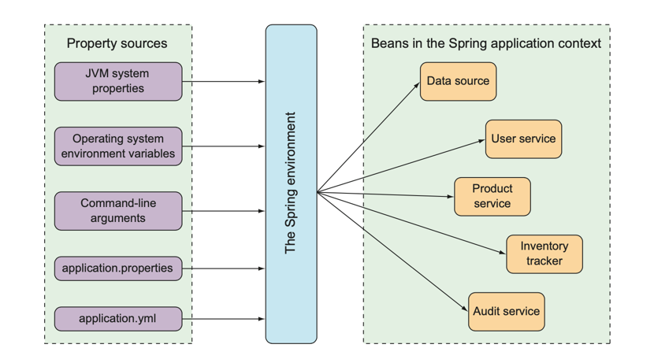

## Introduction

[Spring Boot](https://docs.spring.io/spring-boot/index.html) 使得创建独立、生产级的 Spring 应用变得简单，你可以"直接运行"它们。

- [How to start Spring Boot Application?](/docs/CS/Framework/Spring_Boot/Start.md)
- [Actuator](Actuator.md)

## Architecture

**约定优于配置**

spring-boot
spring-boot-autoconfigure

spring-boot-starters

spring-boot-test

## AutoConfiguration

Spring Boot 的自动配置会根据你添加的 jar 依赖自动配置你的 Spring 应用。

你需要通过在某个 @Configuration 类上添加 @EnableAutoConfiguration 或 @SpringBootApplication 注解来选择启用自动配置。

> You should only ever add one @SpringBootApplication or @EnableAutoConfiguration annotation. We generally recommend that you add one or the other to your primary @Configuration class only. 


自动配置是非侵入性的。
你可以随时定义自己的配置来替换自动配置的特定部分。

如果需要查看当前应用了哪些自动配置及其原因，使用 `--debug` 参数启动应用。


- Cache
- Log - LoggingApplicationListener
- JdbcTemplateAutoConfiguration
- DataSourceAutoConfiguration
- DispatcherServletAutoConfiguration
- WebMvcAutoConfiguration


[How to start Spring Boot Application?](/docs/CS/Framework/Spring_Boot/Start.md)


## Starter

依赖管理是任何复杂项目的关键方面。手动管理依赖并不理想；你在上面花费的时间越多，花在项目其他重要方面的时间就越少。

Starter 是一组方便的依赖描述符，你可以将其包含在应用中。你无需在示例代码中搜索并复制粘贴大量依赖描述符，就能获得所需的所有 Spring 及相关技术。

Starter 包含了许多启动项目所需的依赖，并提供了一致且受支持的托管传递依赖集。

一个完整的库的 Spring Boot starter 可能包含以下组件：

- `autoconfigure` 模块，包含自动配置代码。
- `starter` 模块，提供对 autoconfigure 模块以及库和通常有用的任何额外依赖的依赖。简而言之，添加 starter 应该足以开始使用该库。

> You may combine the auto-configuration code and the dependency management in a single module if you don't need to separate those two concerns.

### Externalized Configuration

Spring 环境抽象是任何可配置属性的一站式场所。
它抽象了属性的来源，使得需要这些属性的 beans 可以从 Spring 自身消费它们。
Spring 环境从多个属性源获取信息，包括：

- JVM 系统属性
- 操作系统环境变量
- 命令行参数
- 应用属性配置文件

然后它将这些属性聚合到一个单一源中，Spring beans 可以从中注入。
图 4 说明了属性如何从属性源流经 Spring 环境抽象到达 Spring beans。

<div style="text-align: center;">



</div>

<p style="text-align: center;">
图 4. Spring 环境从属性源拉取属性并将其提供给应用上下文中的 beans。
</p>

#### Configuration properties


当绑定到 `Map` 属性时，如果 `key` 包含除小写字母数字字符或 `-` 之外的任何字符，你需要使用括号表示法以保留原始值。如果 key 没有被 `[]` 包围，任何非字母数字或 `-` 的字符都会被移除。


```java
@Configuration
public class OrderProps {

    @Bean
    @ConfigurationProperties(prefix = "taco.order.map")
    public BidiMap<String, String> getTacoOrderMap() {
        return new TreeBidiMap<>();
    }
}
```

```java
public class ConfigurationPropertiesBindingPostProcessor
        implements BeanPostProcessor, PriorityOrdered, ApplicationContextAware, InitializingBean {
    @Override
    public Object postProcessBeforeInitialization(Object bean, String beanName) throws BeansException {
        bind(ConfigurationPropertiesBean.get(this.applicationContext, bean, beanName));
        return bean;
    }
}
```

为给定的 bean 详情返回一个 `@ConfigurationPropertiesBean` 实例，如果该 bean 不是 `@ConfigurationProperties` 对象则返回 null。

```java
public final class ConfigurationPropertiesBean {
    public static ConfigurationPropertiesBean get(ApplicationContext applicationContext, Object bean, String beanName) {
        Method factoryMethod = findFactoryMethod(applicationContext, beanName);
        return create(beanName, bean, bean.getClass(), factoryMethod);
    }

    private static ConfigurationPropertiesBean create(String name, Object instance, Class<?> type, Method factory) {
        ConfigurationProperties annotation = findAnnotation(instance, type, factory, ConfigurationProperties.class);
        if (annotation == null) {
            return null;
        }
        Validated validated = findAnnotation(instance, type, factory, Validated.class);
        Annotation[] annotations = (validated != null) ? new Annotation[]{annotation, validated}
                : new Annotation[]{annotation};
        ResolvableType bindType = (factory != null) ? ResolvableType.forMethodReturnType(factory)
                : ResolvableType.forClass(type);
        Bindable<Object> bindTarget = Bindable.of(bindType).withAnnotations(annotations);
        if (instance != null) {
            bindTarget = bindTarget.withExistingValue(instance);
        }
        return new ConfigurationPropertiesBean(name, instance, annotation, bindTarget);
    }
}
```


## Web


如果不希望包含 web：

- 不要添加 starter-web
- 设置 `spring.main.web-application-type=none`
- 在 `SpringApplication.run()` 之前设置 `WebApplicationType.NONE`


请求解析顺序：

- 动态控制器
- 静态资源

## Test

### Junit5

构建 Junit5 需要 JDK15。

#### 

#### Annotations

@DisplayName

##### @Timeout

##### @Isolated

##### @SpringBootTest

> [!TIP]
>
> If you are using JUnit 4, do not forget to also add @RunWith(SpringRunner.class) to your test, otherwise the annotations will be ignored.

@AutoConfigureMockMvc


| Junit5                                      | Junit4                                  |
| ------------------------------------------- | --------------------------------------- |
| @Disabled                                   | @Ignore                                 |
| @ExtendWith                                 | @RunWith                                |
| @Tag                                        | @Category                               |
| @BeforeEach @AfterEach @BeforeAll @AfterAll | @Before @After @BeforeClass @AfterClass |

#### Assertions

static methods

Nest Test

内部测试调用外部测试。

##### Paramterized Test

使用不同参数运行测试。

- @ParamterizedTest
- @ValueSource
- @CsvValueSource
- @MethodSource
- @EnumSource
- @NullSource

### WebMock

默认情况下，@SpringBootTest 不会启动服务器，而是为测试 Web 端点设置一个模拟环境。
使用 Spring MVC，我们可以通过 MockMvc 或 WebTestClient 查询 Web 端点，如下例所示：

```java
import org.junit.jupiter.api.Test;

import org.springframework.beans.factory.annotation.Autowired;
import org.springframework.boot.test.autoconfigure.web.servlet.AutoConfigureMockMvc;
import org.springframework.boot.test.context.SpringBootTest;
import org.springframework.test.web.reactive.server.WebTestClient;
import org.springframework.test.web.servlet.MockMvc;

import static org.springframework.test.web.servlet.request.MockMvcRequestBuilders.get;
import static org.springframework.test.web.servlet.result.MockMvcResultMatchers.content;
import static org.springframework.test.web.servlet.result.MockMvcResultMatchers.status;

@SpringBootTest
@AutoConfigureMockMvc
class MyMockMvcTests {

    @Test
    void testWithMockMvc(@Autowired MockMvc mvc) throws Exception {
        mvc.perform(get("/")).andExpect(status().isOk()).andExpect(content().string("Hello World"));
    }

    // If Spring WebFlux is on the classpath, you can drive MVC tests with a WebTestClient
    @Test
    void testWithWebTestClient(@Autowired WebTestClient webClient) {
        webClient
                .get().uri("/")
                .exchange()
                .expectStatus().isOk()
                .expectBody(String.class).isEqualTo("Hello World");
    }

}
```

> [!TIP]
>
> If you want to focus only on the web layer and not start a complete ApplicationContext, consider using @WebMvcTest instead.

```java
@RunWith(SpringRunner.class)
@WebMvcTest(HelloController.class)
public class HelloTest {

    @Autowired
    private MockMvc mockMvc;

    @Test
    public void testHello() throws Exception {
        mockMvc.perform(MockMvcRequestBuilders.get("/hello"))
                .andExpect(MockMvcResultMatchers.status().isOk())
                .andExpect(MockMvcResultMatchers.content().string(containsString("Hello ")));
    }

}
```

## Actuator

管理

```java
@ControllerAdvice
@ResponseBody
@Slf4j
public class GlobalExceptionHandler {

    @ExceptionHandler(NullPointerException.class) // set handle Exception 
    @ResponseStatus(value = HttpStatus.INTERNAL_SERVER_ERROR) // set Response Http Status
    public JsonResult handleTypeMismatchException(NullPointerException ex) {
        log.error("NullPointer，{}", ex.getMessage());
        return new JsonResult("500", "NullPointer");
    }
}
```

## Starter


## Build Systems

### Dependency Management

Spring Boot 提供了 parent POM 以便更轻松地创建 Spring Boot 应用。
然而，如果我们已经有一个需要继承的父 POM，使用 parent POM 并不总是理想的。

如果不使用 parent POM，我们仍然可以通过添加 scope=import 的 spring-boot-dependencies 工件来受益于依赖管理：
```xml
<dependencyManagement>
     <dependencies>
        <dependency>
            <groupId>org.springframework.boot</groupId>
            <artifactId>spring-boot-dependencies</artifactId>
            <version>3.1.5</version>
            <type>pom</type>
            <scope>import</scope>
        </dependency>
    </dependencies>
</dependencyManagement>
```
另一方面，没有 parent POM，我们也不再受益于插件管理。这意味着我们需要显式添加 spring-boot-maven-plugin：
```xml
<build>
    <plugins>
        <plugin>
            <groupId>org.springframework.boot</groupId>
            <artifactId>spring-boot-maven-plugin</artifactId>
        </plugin>
    </plugins>
</build>
```


### Developer Tools

DevTools 为 Spring 开发者提供了一些方便的**开发时工具**。
其中包括：

- 代码更改时自动重启应用
- 浏览器资源（如模板、JavaScript、样式表等）更改时自动刷新浏览器
- 自动禁用模板缓存
- 内置 H2 控制台（如果使用了 H2 数据库）

更精确地说，当 DevTools 激活时，应用程序会被加载到 Java 虚拟机（JVM）中的两个独立类加载器中
一个类加载器加载你的 Java 代码、属性文件，以及项目 src/main/ 路径下的几乎所有内容。这些都是可能经常更改的项
另一个类加载器则加载依赖库，这些库不太可能经常更改

当检测到更改时，DevTools 仅重新加载包含您项目代码的类加载器并重启 Spring 应用程序上下文，而保持其他类加载器和 JVM 不变
虽然这种方式微妙，但可以在应用程序启动时间上带来小幅减少

这种策略的缺点是对依赖项的更改在自动重启中不可用。这是因为包含依赖库的类加载器不会被自动重新加载
每当你在构建规范中添加、修改或删除依赖项时，都需要对应用程序进行完全重启，以使这些更改生效


### Docker

添加 dockerfile-maven-plugin

```xml
            <plugin>
                <groupId>com.spotify</groupId>
                <artifactId>dockerfile-maven-plugin</artifactId>
                <version>1.3.6</version>
                <executions>
                    <execution>
                        <id>default</id>
                        <goals>
                            <goal>build</goal>
                            
                        </goals>
                    </execution>
                </executions>
                <configuration>
                    <repository>com.naylor/${project.artifactId}</repository>
                    <tag>${project.version}</tag>
                    <buildArgs>
                        <JAR_FILE>${project.build.finalName}.jar</JAR_FILE>
                    </buildArgs>
                </configuration>
            </plugin>

```

添加 Dockerfile

```dockerfile
FROM java:8
EXPOSE 8080
ARG JAR_FILE
ADD target/${JAR_FILE} /app.jar
ENTRYPOINT ["java", "-jar","/app.jar"]

```

mvn package


然后通过 `docker image ls` 检查

## Production-ready Features

Spring Boot 包含许多额外功能，帮助你在将应用部署到生产环境时进行监控和管理。你可以选择通过 HTTP 端点或 JMX 来管理和监控应用。审计、健康检查和指标收集也可以自动应用到你的应用中。

`spring-boot-actuator` 模块提供了 Spring Boot 的所有生产就绪功能。启用这些功能的推荐方式是添加对 spring-boot-starter-actuator Starter 的依赖。

### Observability
可观测性是从外部观察运行中系统内部状态的能力。它由三个支柱组成：日志、指标和链路追踪。

对于指标和链路追踪，Spring Boot 使用 Micrometer Observation。
要创建你自己的观测（这将产生指标和链路追踪），可以注入一个 `ObservationRegistry`。


## Issues


启动报错 SnakeYAML在读取YAML文件时出现的java.nio.charset.MalformedInputException:Input length

确认yaml文件编码 可能是文件编码是UTF-8 然后存在中文字符导致


## Links

- [Spring Framework](/docs/CS/Framework/Spring/Spring.md)
- [Spring Cloud](/docs/CS/Framework/Spring_Cloud/Spring_Cloud.md)
- Splunk
- Solr
