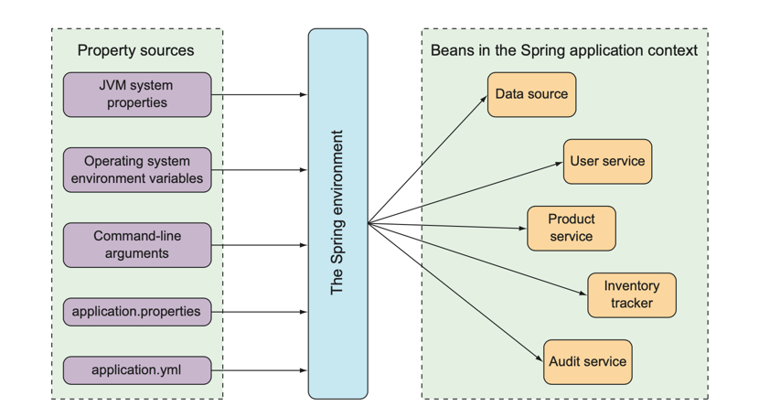

## Introduction

[Spring Boot](https://docs.spring.io/spring-boot/index.html) makes it easy to create stand-alone, production-grade Spring based Applications that you can "just run".

- [How to start Spring Boot Application?](/docs/CS/Framework/Spring_Boot/Start.md)
- [Actuator](/docs/CS/Framework/Spring_Boot/actuator.md)

## Architecture

**Convention Over Configuration**

Boot 3.x 及之前，几乎所有自动配置都装在单一的 `spring-boot-autoconfigure` jar 里，任何应用都会整包加载。Boot 4.0 把这套自动配置拆成 **70 多个模块**（`spring-boot-autoconfigure-jdbc`、`-jpa`、`-web`、`-security`、`-cache`、`-actuator` …），每个 starter 只拉取自己需要的模块：

| 模块 | 职责 |
| :-- | :-- |
| `spring-boot` | 核心：`SpringApplication`、`Environment`、事件与生命周期 |
| `spring-boot-autoconfigure-*` | 按技术拆分的自动配置模块 |
| `spring-boot-starter-*` | 依赖描述符，聚合「自动配置模块 + 第三方库」 |
| `spring-boot-test-*` | 按技术拆分的测试支持 |

好处是包体更小、IDE 补全不再提示无关配置项、GraalVM native image 只处理真正用到的模块。代价是自定义 starter 或手工引入自动配置类的项目需要同步改包名与依赖。

> [!WARNING]
> 由于包名与模块都有重构，官方强烈不建议在同一个 artifact 里同时支持 Boot 3 与 Boot 4。

## AutoConfiguration

Spring Boot auto-configuration attempts to automatically configure your Spring application based on the jar dependencies that you have added. 

You need to opt-in to auto-configuration by adding the @EnableAutoConfiguration or @SpringBootApplication annotations to one of your @Configuration classes.

> You should only ever add one @SpringBootApplication or @EnableAutoConfiguration annotation. We generally recommend that you add one or the other to your primary @Configuration class only. 


Auto-configuration is non-invasive. 
At any point, you can start to define your own configuration to replace specific parts of the auto-configuration. 

If you need to find out what auto-configuration is currently being applied, and why, start your application with the `--debug` switch. 


- Cache
- Log - LoggingApplicationListener
- JdbcTemplateAutoConfiguration
- DataSourceAutoConfiguration
- DispatcherServletAutoConfiguration
- WebMvcAutoConfiguration


自动配置的注册清单（`.imports`）、加载管线、条件注解与自定义 starter 的写法见 [SPI](/docs/CS/Framework/Spring/SPI.md)。
[How to start Spring Boot Application?](/docs/CS/Framework/Spring_Boot/Start.md)


## SpringApplication

`SpringApplication` 提供了一个通过 `main()` 方法启动 Spring 应用的便捷入口，启动流程除了创建并刷新 ApplicationContext，还提供一组运行时扩展点：

- **启动失败处理（FailureAnalyzers）**：启动异常会经 `FailureAnalyzer` 转成可读的错误信息；也可用 `SpringApplication.addListeners()` 注册 `ApplicationFailedListener`。
- **延迟初始化**：`spring.main.lazy-initialization=true` 让 bean 在首次被需要时才创建。可加快启动、降低启动期资源占用，但首次请求变慢，且运行期才暴露 bean 配置问题，需配合 Actuator 预热 JVM。
- **自定义 banner**：`banner.txt` / `banner.gif` 或 `SpringApplication.setBanner()`。
- **Fluent Builder API**：`SpringApplicationBuilder` 支持父子上下文、多 profile 链式启动。
- **Web 环境判定**：依据类路径决定 `SERVLET` / `REACTIVE` / `NONE`，可用 `spring.main.web-application-type` 显式覆盖。
- **应用参数**：实现 `ApplicationRunner` / `CommandLineRunner` 的 bean 会在上下文就绪后执行（前者拿到解析后的 `ApplicationArguments`，后者拿到原始字符串数组），多个 Runner 可用 `@Order` 排序。
- **优雅退出**：bean 实现 `ExitCodeGenerator` 可向 JVM 返回自定义退出码。

### 可用性探针（Liveness / Readiness）

Spring Boot 在 Actuator 中暴露应用可用性状态，供 Kubernetes 探针消费：

- **Liveness State（存活）**：内部状态是否正常、是否需要重启。liveness 失败意味着应用已不可自愈，平台应重建实例。
- **Readiness State（就绪）**：是否能接收流量。readiness 失败时平台暂时不路由请求，但不杀实例。

对应 `/actuator/health/liveness` 与 `/actuator/health/readiness`，可通过 `AvailabilityChangeEvent` 编程式更新状态，或自定义 `AvailabilityState`。

### 应用事件

启动过程会按顺序发布应用事件（`ApplicationStartingEvent` → `ApplicationEnvironmentPreparedEvent` → `ApplicationContextInitializedEvent` → `ApplicationPreparedEvent` → `ApplicationStartedEvent` → `ApplicationReadyEvent` → 失败时 `ApplicationFailedEvent`）。

> 注意事件监听器的注册时机：通过 `SpringApplication.addListeners()` 或 `META-INF/spring.factories` 注册的监听器才能收到上下文创建**之前**的早期事件；用 `@Component`/`@EventListener` 注册的只能收到上下文刷新之后的事件。

## Starter

Dependency management is a critical aspects of any complex project. And doing this manually is less than ideal; the more time you spent on it the less time you have on the other important aspects of the project.

Starters are a set of convenient dependency descriptors that you can include in your application. You get a one-stop-shop for all the Spring and related technology that you need, without having to hunt through sample code and copy paste loads of dependency descriptors. 

The starters contain a lot of the dependencies that you need to get a project up and running quickly and with a consistent, supported set of managed transitive dependencies.

A full Spring Boot starter for a library may contain the following components:

- The `autoconfigure` module that contains the auto-configuration code.
- The `starter` module that provides a dependency to the autoconfigure module as well as the library and any additional dependencies that are typically useful. In a nutshell, adding the starter should be enough to start using that library.

> You may combine the auto-configuration code and the dependency management in a single module if you don’t need to separate those two concerns.

#### Boot 4 的 starter 改名

为与模块名对齐，若干 starter 在 4.0 更名，旧名保留但已弃用：

| 旧名（Boot 3.x） | 新名（Boot 4.0） |
| :-- | :-- |
| `spring-boot-starter-web` | `spring-boot-starter-webmvc` |
| `spring-boot-starter-aop` | `spring-boot-starter-aspectj` |
| `spring-boot-starter-oauth2-client` | `spring-boot-starter-security-oauth2-client` |
| `spring-boot-starter-oauth2-resource-server` | `spring-boot-starter-security-oauth2-resource-server` |
| `spring-boot-starter-oauth2-authorization-server` | `spring-boot-starter-security-oauth2-authorization-server` |
| `spring-boot-starter-web-services` | `spring-boot-starter-webservices` |

此外 `WebClient`、`RestClient` 也从原先的 WebFlux / Web starter 中独立出来，各有 starter。

需要"先跑起来再重构"的迁移场景，可改用 classic starter（`spring-boot-starter-classic`、`spring-boot-starter-test-classic`）：它们聚合全部模块但排除其传递依赖，行为接近 Boot 3。

### Externalized Configuration

The Spring environment abstraction is a one-stop shop for any configurable property.
It abstracts the origins of properties so that beans needing those properties can consume them from Spring itself.
The Spring environment pulls from several property sources, including the following:

- JVM system properties
- Operating system environment variables
- Command-line arguments
- Application property configuration files

It then aggregates those properties into a single source from which Spring beans can be injected.
Figure 4 illustrates how properties from property sources flow through the Spring environment abstraction to Spring beans.

<div style="text-align: center;">



</div>

<p style="text-align: center;">
Fig.4. The Spring environment pulls properties from property sources and makes them available to beans in the application context.
</p>

#### Configuration properties


When binding to `Map` properties, if the `key` contains anything other than lowercase alpha-numeric characters or `-`, you need to use the bracket notation so that the original value is preserved. If the key is not surrounded by `[]`, any characters that are not alpha-numeric or `-` are removed.


```java
@Configuration
public class OrderProps {

    @Bean
    @ConfigurationProperties(prefix = "taco.order.map")
    public BidiMap<String, String> getTacoOrderMap() {
        return new TreeBidiMap<>();
    }
}
```

```java
public class ConfigurationPropertiesBindingPostProcessor
        implements BeanPostProcessor, PriorityOrdered, ApplicationContextAware, InitializingBean {
    @Override
    public Object postProcessBeforeInitialization(Object bean, String beanName) throws BeansException {
        bind(ConfigurationPropertiesBean.get(this.applicationContext, bean, beanName));
        return bean;
    }
}
```

Return a `@ConfigurationPropertiesBean` instance for the given bean details or null if the bean is not a `@ConfigurationProperties` object.

```java
public final class ConfigurationPropertiesBean {
    public static ConfigurationPropertiesBean get(ApplicationContext applicationContext, Object bean, String beanName) {
        Method factoryMethod = findFactoryMethod(applicationContext, beanName);
        return create(beanName, bean, bean.getClass(), factoryMethod);
    }

    private static ConfigurationPropertiesBean create(String name, Object instance, Class<?> type, Method factory) {
        ConfigurationProperties annotation = findAnnotation(instance, type, factory, ConfigurationProperties.class);
        if (annotation == null) {
            return null;
        }
        Validated validated = findAnnotation(instance, type, factory, Validated.class);
        Annotation[] annotations = (validated != null) ? new Annotation[]{annotation, validated}
                : new Annotation[]{annotation};
        ResolvableType bindType = (factory != null) ? ResolvableType.forMethodReturnType(factory)
                : ResolvableType.forClass(type);
        Bindable<Object> bindTarget = Bindable.of(bindType).withAnnotations(annotations);
        if (instance != null) {
            bindTarget = bindTarget.withExistingValue(instance);
        }
        return new ConfigurationPropertiesBean(name, instance, annotation, bindTarget);
    }
}
```

#### 配置加载顺序与优先级

外部配置按从高到低的优先级覆盖（高优先级先命中）：命令行参数 → 系统属性 → 操作系统环境变量 → `application-{profile}.yml`（jar 包外优先于包内）→ `application.yml`。具体可用 `config/import` 或属性 `spring.config.location` / `spring.config.additional-location` 改变搜索位置：

- `spring.config.location`：**替换**默认位置，只从给定位置加载；
- `spring.config.additional-location`：在默认位置之外**追加**搜索位置；
- 支持 optional 前缀和通配符位置，`spring.config.import=optional:file:./etc/` 可在文件缺失时不报错。

单个文件可用 `---` 分隔多文档（multi-document），通过 `spring.config.activate.on-profile` 按 profile 激活。

#### 宽松绑定（Relaxed Binding）

`@ConfigurationProperties` 的属性名匹配是宽松的，同一属性多种写法都能绑定：kebab-case（`my-prefix.remote-timeout`，**推荐**）、camelCase、underscore、环境变量大写。但 `@Value` 占位符不支持宽松绑定，必须写精确 key——这也是优先用类型安全配置而非散落 `@Value` 的原因之一。

还支持：

- **构造函数绑定**：用 `@ConstructorBinding`（Boot 3 起 record 或单一构造器已自动绑定，无需显式标注），属性可不暴露 setter，天然不可变；
- **第三方类配置**：在任意 `@Bean` 方法上加 `@ConfigurationProperties` 给第三方对象绑定；
- **校验**：类上加 `@Validated`，字段用 JSR-303 注解（`@Min`、`@NotBlank` 等），启动时校验失败直接 fail-fast；
- **`@ConfigurationProperties` vs `@Value`**：前者支持松散绑定、SpEL 之外的元数据、校验、复杂类型与 IDE 提示；后者适合零散的单值注入。

#### Profiles

- `spring.profiles.active` 激活 profile；`spring.profiles.group` 可把一组 profile 定义成逻辑组（如 `production: [proddb,prodmq]`）。
- profile 也可通过 `setAdditionalProfiles()` 编程式设置。
- 配置文件按 `application-{profile}.yml` 约定加载，可用 `spring.profiles.include` 引入其他 profile 文件。


## Web


If you don't want to include web:

- don't add starter-web
- set `spring.main.web-application-type=none`
- set  `WebApplicationType.NONE`  before `SpringApplication.run()`


resolve request order:

- dynamic controller
- static resources

## Test

Boot 侧测试（切片测试、模块化 test starter、`@MockitoBean`、`RestTestClient`、Testcontainers）见 [Spring Boot 测试](/docs/CS/Framework/Spring_Boot/Test.md)；TestContext 框架本身见 [Spring Test](/docs/CS/Framework/Spring/Test.md)。

### JUnit

Boot 4 默认使用 **JUnit 6**（Jupiter 编程模型）；Spring Framework 7.0 起 JUnit 4 支持已弃用，`SpringRunner` 一类不再推荐。

#### Annotations

@DisplayName

##### @Timeout

##### @Isolated

##### @SpringBootTest

> [!WARNING]
>
> Boot 4 里 `@SpringBootTest` **不再自动配置** `MockMvc` / `WebClient` / `TestRestTemplate`，需显式加 `@AutoConfigureMockMvc` 等注解；`@MockBean` / `@SpyBean` 已移除，改用 `@MockitoBean` / `@MockitoSpyBean`。详见 [Spring Boot 测试](/docs/CS/Framework/Spring_Boot/Test.md)。

@AutoConfigureMockMvc


| Junit5                                      | Junit4                                  |
| ------------------------------------------- | --------------------------------------- |
| @Disabled                                   | @Ignore                                 |
| @ExtendWith                                 | @RunWith                                |
| @Tag                                        | @Category                               |
| @BeforeEach @AfterEach @BeforeAll @AfterAll | @Before @After @BeforeClass @AfterClass |

#### Assertions

static methods

Nest Test

Inner test invoke Outer test.

##### Paramterized Test

Use different parameters to run test.

- @ParamterizedTest
- @ValueSource
- @CsvValueSource
- @MethodSource
- @EnumSource
- @NullSource

### WebMock

By default, @SpringBootTest does not start the server but instead sets up a mock environment for testing web endpoints.
With Spring MVC, we can query our web endpoints using MockMvc or WebTestClient, as shown in the following example:

```java
import org.junit.jupiter.api.Test;

import org.springframework.beans.factory.annotation.Autowired;
import org.springframework.boot.test.autoconfigure.web.servlet.AutoConfigureMockMvc;
import org.springframework.boot.test.context.SpringBootTest;
import org.springframework.test.web.reactive.server.WebTestClient;
import org.springframework.test.web.servlet.MockMvc;

import static org.springframework.test.web.servlet.request.MockMvcRequestBuilders.get;
import static org.springframework.test.web.servlet.result.MockMvcResultMatchers.content;
import static org.springframework.test.web.servlet.result.MockMvcResultMatchers.status;

@SpringBootTest
@AutoConfigureMockMvc
class MyMockMvcTests {

    @Test
    void testWithMockMvc(@Autowired MockMvc mvc) throws Exception {
        mvc.perform(get("/")).andExpect(status().isOk()).andExpect(content().string("Hello World"));
    }

    // If Spring WebFlux is on the classpath, you can drive MVC tests with a WebTestClient
    @Test
    void testWithWebTestClient(@Autowired WebTestClient webClient) {
        webClient
                .get().uri("/")
                .exchange()
                .expectStatus().isOk()
                .expectBody(String.class).isEqualTo("Hello World");
    }

}
```

> [!TIP]
>
> If you want to focus only on the web layer and not start a complete ApplicationContext, consider using @WebMvcTest instead.

```java
@RunWith(SpringRunner.class)
@WebMvcTest(HelloController.class)
public class HelloTest {

    @Autowired
    private MockMvc mockMvc;

    @Test
    public void testHello() throws Exception {
        mockMvc.perform(MockMvcRequestBuilders.get("/hello"))
                .andExpect(MockMvcResultMatchers.status().isOk())
                .andExpect(MockMvcResultMatchers.content().string(containsString("Hello ")));
    }

}
```

## Actuator

Admin

```java
@ControllerAdvice
@ResponseBody
@Slf4j
public class GlobalExceptionHandler {

    @ExceptionHandler(NullPointerException.class) // set handle Exception 
    @ResponseStatus(value = HttpStatus.INTERNAL_SERVER_ERROR) // set Response Http Status
    public JsonResult handleTypeMismatchException(NullPointerException ex) {
        log.error("NullPointer，{}", ex.getMessage());
        return new JsonResult("500", "NullPointer");
    }
}
```

## Starter


## Build Systems

### Dependency Management

Spring Boot provides the parent POM for an easier creation of Spring Boot applications.
However, using the parent POM may not always be desirable, if we already have a parent to inherit from.

If we don’t make use of the parent POM, we can still benefit from dependency management by adding the spring-boot-dependencies artifact with scope=import:
```xml
<dependencyManagement>
     <dependencies>
        <dependency>
            <groupId>org.springframework.boot</groupId>
            <artifactId>spring-boot-dependencies</artifactId>
            <version>3.1.5</version>
            <type>pom</type>
            <scope>import</scope>
        </dependency>
    </dependencies>
</dependencyManagement>
```
On the other hand, without the parent POM, we no longer benefit from plugin management. This means we need to add the spring-boot-maven-plugin explicitly:
```xml
<build>
    <plugins>
        <plugin>
            <groupId>org.springframework.boot</groupId>
            <artifactId>spring-boot-maven-plugin</artifactId>
        </plugin>
    </plugins>
</build>
```


### Developer Tools

DevTools provides Spring developers with some handy develop-ment-time tools.
Among those are the following:

- Automatic application restart when code changes
- Automatic browser refresh when browser-destined resources (such as templates, JavaScript, stylesheets, and so on) change
- Automatic disabling of template caches
- Built in H2 Console, if the H2 database is in use

更精确地说，当 DevTools 激活时，应用程序会被加载到 Java 虚拟机（JVM）中的两个独立类加载器中
一个类加载器加载你的 Java 代码、属性文件，以及项目 src/main/ 路径下的几乎所有内容。这些都是可能经常更改的项
另一个类加载器则加载依赖库，这些库不太可能经常更改

当检测到更改时，DevTools 仅重新加载包含您项目代码的类加载器并重启 Spring 应用程序上下文，而保持其他类加载器和 JVM 不变
虽然这种方式微妙，但可以在应用程序启动时间上带来小幅减少

这种策略的缺点是对依赖项的更改在自动重启中不可用。这是因为包含依赖库的类加载器不会被自动重新加载
每当你在构建规范中添加、修改或删除依赖项时，都需要对应用程序进行完全重启，以使这些更改生效


### Docker

add dockerfile-maven-plugin

```xml
            <plugin>
                <groupId>com.spotify</groupId>
                <artifactId>dockerfile-maven-plugin</artifactId>
                <version>1.3.6</version>
                <executions>
                    <execution>
                        <id>default</id>
                        <goals>
                            <goal>build</goal>
                            
                        </goals>
                    </execution>
                </executions>
                <configuration>
                    <repository>com.naylor/${project.artifactId}</repository>
                    <tag>${project.version}</tag>
                    <buildArgs>
                        <JAR_FILE>${project.build.finalName}.jar</JAR_FILE>
                    </buildArgs>
                </configuration>
            </plugin>

```

add Dockerfile

```dockerfile
FROM java:8
EXPOSE 8080
ARG JAR_FILE
ADD target/${JAR_FILE} /app.jar
ENTRYPOINT ["java", "-jar","/app.jar"]

```

mvn package


then check by `docker image ls`

## Production-ready Features

Spring Boot includes a number of additional features to help you monitor and manage your application when you push it to production. You can choose to manage and monitor your application by using HTTP endpoints or with JMX. Auditing, health, and metrics gathering can also be automatically applied to your application.

The `spring-boot-actuator` module provides all of Spring Boot’s production-ready features. The recommended way to enable the features is to add a dependency on the spring-boot-starter-actuator “Starter”.

### Observability
Observability is the ability to observe the internal state of a running system from the outside. It consists of the three pillars logging, metrics and traces.

For metrics and traces, Spring Boot uses Micrometer Observation. 
To create your own observations (which will lead to metrics and traces), you can inject an `ObservationRegistry`.


## Issues


启动报错 SnakeYAML 在读取 YAML 文件时出现的 java.nio.charset.MalformedInputException:Input length

确认 yaml 文件编码 可能是文件编码是 UTF-8 然后存在中文字符导致


## Links

- [Spring Framework](/docs/CS/Framework/Spring/Spring.md)
- [Spring Cloud](/docs/CS/Framework/Spring_Cloud/Spring_Cloud.md)
- [cache](/docs/CS/Framework/Spring_Boot/cache.md)
- Splunk
- Solr

## References

- [Spring Boot Reference](https://docs.spring.io/spring-boot/reference/)
- [阿里云 SCA 学习站 - Spring Boot 核心特性](https://sca.aliyun.com/learn/spring-boot/core/)
