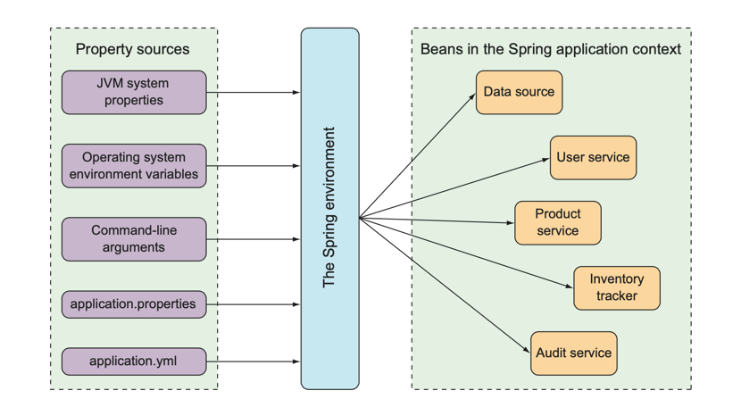

## Introduction

[Spring Boot](https://docs.spring.io/spring-boot/index.html) makes it easy to create stand-alone, production-grade Spring based Applications that you can "just run".

- [How to start Spring Boot Application?](/docs/CS/Java/Spring_Boot/Start.md)
- [Actuator](Actuator.md)

## Architecture

**Convention Over Configuration**

spring-boot
spring-boot-autoconfigure

spring-boot-starters

spring-boot-test

## AutoConfiguration

Spring Boot auto-configuration attempts to automatically configure your Spring application based on the jar dependencies that you have added. 

You need to opt-in to auto-configuration by adding the @EnableAutoConfiguration or @SpringBootApplication annotations to one of your @Configuration classes.

> You should only ever add one @SpringBootApplication or @EnableAutoConfiguration annotation. We generally recommend that you add one or the other to your primary @Configuration class only. 


Auto-configuration is non-invasive. 
At any point, you can start to define your own configuration to replace specific parts of the auto-configuration. 

If you need to find out what auto-configuration is currently being applied, and why, start your application with the `--debug` switch. 


- Cache
- Log - LoggingApplicationListener
- JdbcTemplateAutoConfiguration
- DataSourceAutoConfiguration
- DispatcherServletAutoConfiguration
- WebMvcAutoConfiguration


[How to start Spring Boot Application?](/docs/CS/Java/Spring_Boot/Start.md)


## Starter

Dependency management is a critical aspects of any complex project. And doing this manually is less than ideal; the more time you spent on it the less time you have on the other important aspects of the project.

Starters are a set of convenient dependency descriptors that you can include in your application. You get a one-stop-shop for all the Spring and related technology that you need, without having to hunt through sample code and copy paste loads of dependency descriptors. 

The starters contain a lot of the dependencies that you need to get a project up and running quickly and with a consistent, supported set of managed transitive dependencies.

A full Spring Boot starter for a library may contain the following components:

- The `autoconfigure` module that contains the auto-configuration code.
- The `starter` module that provides a dependency to the autoconfigure module as well as the library and any additional dependencies that are typically useful. In a nutshell, adding the starter should be enough to start using that library.

> You may combine the auto-configuration code and the dependency management in a single module if you don’t need to separate those two concerns.

### Externalized Configuration

The Spring environment abstraction is a one-stop shop for any configurable property.
It abstracts the origins of properties so that beans needing those properties can consume them from Spring itself.
The Spring environment pulls from several property sources, including the following:

- JVM system properties
- Operating system environment variables
- Command-line arguments
- Application property configuration files

It then aggregates those properties into a single source from which Spring beans can be injected.
Figure 4 illustrates how properties from property sources flow through the Spring environment abstraction to Spring beans.

<div style="text-align: center;">



</div>

<p style="text-align: center;">
Fig.4. The Spring environment pulls properties from property sources and makes them available to beans in the application context.
</p>

#### Configuration properties


When binding to `Map` properties, if the `key` contains anything other than lowercase alpha-numeric characters or `-`, you need to use the bracket notation so that the original value is preserved. If the key is not surrounded by `[]`, any characters that are not alpha-numeric or `-` are removed.


```java
@Configuration
public class OrderProps {

    @Bean
    @ConfigurationProperties(prefix = "taco.order.map")
    public BidiMap<String, String> getTacoOrderMap() {
        return new TreeBidiMap<>();
    }
}
```

```java
public class ConfigurationPropertiesBindingPostProcessor
        implements BeanPostProcessor, PriorityOrdered, ApplicationContextAware, InitializingBean {
    @Override
    public Object postProcessBeforeInitialization(Object bean, String beanName) throws BeansException {
        bind(ConfigurationPropertiesBean.get(this.applicationContext, bean, beanName));
        return bean;
    }
}
```

Return a `@ConfigurationPropertiesBean` instance for the given bean details or null if the bean is not a `@ConfigurationProperties` object.

```java
public final class ConfigurationPropertiesBean {
    public static ConfigurationPropertiesBean get(ApplicationContext applicationContext, Object bean, String beanName) {
        Method factoryMethod = findFactoryMethod(applicationContext, beanName);
        return create(beanName, bean, bean.getClass(), factoryMethod);
    }

    private static ConfigurationPropertiesBean create(String name, Object instance, Class<?> type, Method factory) {
        ConfigurationProperties annotation = findAnnotation(instance, type, factory, ConfigurationProperties.class);
        if (annotation == null) {
            return null;
        }
        Validated validated = findAnnotation(instance, type, factory, Validated.class);
        Annotation[] annotations = (validated != null) ? new Annotation[]{annotation, validated}
                : new Annotation[]{annotation};
        ResolvableType bindType = (factory != null) ? ResolvableType.forMethodReturnType(factory)
                : ResolvableType.forClass(type);
        Bindable<Object> bindTarget = Bindable.of(bindType).withAnnotations(annotations);
        if (instance != null) {
            bindTarget = bindTarget.withExistingValue(instance);
        }
        return new ConfigurationPropertiesBean(name, instance, annotation, bindTarget);
    }
}
```


## Web


If you don't want to include web:

- don't add starter-web
- set `spring.main.web-application-type=none`
- set  `WebApplicationType.NONE`  before `SpringApplication.run()`


resolve request order:

- dynamic controller
- static resources

## Test

### Junit5

It's need JDK15 to build Junit5,.

#### 

#### Annotations

@DisplayName

##### @Timeout

##### @Isolated

##### @SpringBootTest

> [!TIP]
>
> If you are using JUnit 4, do not forget to also add @RunWith(SpringRunner.class) to your test, otherwise the annotations will be ignored.

@AutoConfigureMockMvc


| Junit5                                      | Junit4                                  |
| ------------------------------------------- | --------------------------------------- |
| @Disabled                                   | @Ignore                                 |
| @ExtendWith                                 | @RunWith                                |
| @Tag                                        | @Category                               |
| @BeforeEach @AfterEach @BeforeAll @AfterAll | @Before @After @BeforeClass @AfterClass |

#### Assertions

static methods

Nest Test

Inner test invoke Outer test.

##### Paramterized Test

Use different parameters to run test.

- @ParamterizedTest
- @ValueSource
- @CsvValueSource
- @MethodSource
- @EnumSource
- @NullSource

### WebMock

By default, @SpringBootTest does not start the server but instead sets up a mock environment for testing web endpoints.
With Spring MVC, we can query our web endpoints using MockMvc or WebTestClient, as shown in the following example:

```java
import org.junit.jupiter.api.Test;

import org.springframework.beans.factory.annotation.Autowired;
import org.springframework.boot.test.autoconfigure.web.servlet.AutoConfigureMockMvc;
import org.springframework.boot.test.context.SpringBootTest;
import org.springframework.test.web.reactive.server.WebTestClient;
import org.springframework.test.web.servlet.MockMvc;

import static org.springframework.test.web.servlet.request.MockMvcRequestBuilders.get;
import static org.springframework.test.web.servlet.result.MockMvcResultMatchers.content;
import static org.springframework.test.web.servlet.result.MockMvcResultMatchers.status;

@SpringBootTest
@AutoConfigureMockMvc
class MyMockMvcTests {

    @Test
    void testWithMockMvc(@Autowired MockMvc mvc) throws Exception {
        mvc.perform(get("/")).andExpect(status().isOk()).andExpect(content().string("Hello World"));
    }

    // If Spring WebFlux is on the classpath, you can drive MVC tests with a WebTestClient
    @Test
    void testWithWebTestClient(@Autowired WebTestClient webClient) {
        webClient
                .get().uri("/")
                .exchange()
                .expectStatus().isOk()
                .expectBody(String.class).isEqualTo("Hello World");
    }

}
```

> [!TIP]
>
> If you want to focus only on the web layer and not start a complete ApplicationContext, consider using @WebMvcTest instead.

```java
@RunWith(SpringRunner.class)
@WebMvcTest(HelloController.class)
public class HelloTest {

    @Autowired
    private MockMvc mockMvc;

    @Test
    public void testHello() throws Exception {
        mockMvc.perform(MockMvcRequestBuilders.get("/hello"))
                .andExpect(MockMvcResultMatchers.status().isOk())
                .andExpect(MockMvcResultMatchers.content().string(containsString("Hello ")));
    }

}
```

## Actuator

Admin

```java
@ControllerAdvice
@ResponseBody
@Slf4j
public class GlobalExceptionHandler {

    @ExceptionHandler(NullPointerException.class) // set handle Exception 
    @ResponseStatus(value = HttpStatus.INTERNAL_SERVER_ERROR) // set Response Http Status
    public JsonResult handleTypeMismatchException(NullPointerException ex) {
        log.error("NullPointer，{}", ex.getMessage());
        return new JsonResult("500", "NullPointer");
    }
}
```

## Starter


## Build Systems

### Dependency Management

Spring Boot provides the parent POM for an easier creation of Spring Boot applications.
However, using the parent POM may not always be desirable, if we already have a parent to inherit from.

If we don’t make use of the parent POM, we can still benefit from dependency management by adding the spring-boot-dependencies artifact with scope=import:
```xml
<dependencyManagement>
     <dependencies>
        <dependency>
            <groupId>org.springframework.boot</groupId>
            <artifactId>spring-boot-dependencies</artifactId>
            <version>3.1.5</version>
            <type>pom</type>
            <scope>import</scope>
        </dependency>
    </dependencies>
</dependencyManagement>
```
On the other hand, without the parent POM, we no longer benefit from plugin management. This means we need to add the spring-boot-maven-plugin explicitly:
```xml
<build>
    <plugins>
        <plugin>
            <groupId>org.springframework.boot</groupId>
            <artifactId>spring-boot-maven-plugin</artifactId>
        </plugin>
    </plugins>
</build>
```


### Developer Tools

DevTools provides Spring developers with some handy develop-ment-time tools.
Among those are the following:

- Automatic application restart when code changes
- Automatic browser refresh when browser-destined resources (such as templates, JavaScript, stylesheets, and so on) change
- Automatic disabling of template caches
- Built in H2 Console, if the H2 database is in use

More precisely, when DevTools is active, the application is loaded into two separate class loaders in the Java virtual machine (JVM). One class loader is loaded with your Java code, property files, and pretty much anything that’s in the src/main/ path of the project. These are items that are likely to change frequently. The other class loader is loaded with dependency libraries, which aren’t likely to change as often.

When a change is detected, DevTools reloads only the class loader containing your project code and restarts the Spring application context but leaves the other class loader and the JVM intact. Although subtle, this strategy affords a small reduction in the time it takes to start the application.

The downside of this strategy is that changes to dependencies won’t be available in automatic restarts. That’s because the class loader containing dependency libraries isn’t automatically reloaded. Any time you add, change, or remove a dependency in your build specification, you’ll need to do a hard restart of the application for those changes to take effect.


### Docker

add dockerfile-maven-plugin

```xml
            <plugin>
                <groupId>com.spotify</groupId>
                <artifactId>dockerfile-maven-plugin</artifactId>
                <version>1.3.6</version>
                <executions>
                    <execution>
                        <id>default</id>
                        <goals>
                            <goal>build</goal>
                            
                        </goals>
                    </execution>
                </executions>
                <configuration>
                    <repository>com.naylor/${project.artifactId}</repository>
                    <tag>${project.version}</tag>
                    <buildArgs>
                        <JAR_FILE>${project.build.finalName}.jar</JAR_FILE>
                    </buildArgs>
                </configuration>
            </plugin>

```

add Dockerfile

```dockerfile
FROM java:8
EXPOSE 8080
ARG JAR_FILE
ADD target/${JAR_FILE} /app.jar
ENTRYPOINT ["java", "-jar","/app.jar"]

```

mvn package


then check by `docker image ls`

## Production-ready Features

Spring Boot includes a number of additional features to help you monitor and manage your application when you push it to production. You can choose to manage and monitor your application by using HTTP endpoints or with JMX. Auditing, health, and metrics gathering can also be automatically applied to your application.

The `spring-boot-actuator` module provides all of Spring Boot’s production-ready features. The recommended way to enable the features is to add a dependency on the spring-boot-starter-actuator “Starter”.

### Observability
Observability is the ability to observe the internal state of a running system from the outside. It consists of the three pillars logging, metrics and traces.

For metrics and traces, Spring Boot uses Micrometer Observation. 
To create your own observations (which will lead to metrics and traces), you can inject an `ObservationRegistry`.

## Links

- [Spring Framework](/docs/CS/Java/Spring/Spring.md)
- [Spring Cloud](/docs/CS/Java/Spring_Cloud/Spring_Cloud.md)
