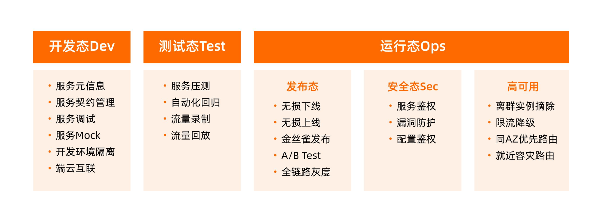

## Introduction

Cloud Native is a style of application development that encourages easy adoption of best practices in the areas of continuous delivery and value-driven development. 
A related discipline is that of building 12-factor Applications, in which development practices are aligned with delivery and operations goals-for instance, by using declarative programming and management and monitoring.
Cloud native refers less to where an application resides and more to how it is built and deployed. 
A cloud native application consists of discrete, reusable components that are known as microservices that are designed to integrate into any cloud environment.

- A cloud native application consists of discrete, reusable components that are known as microservices that are designed to integrate into any cloud environment.
- These microservices act as building blocks and are often packaged in containers.
- Microservices work together as a whole to comprise an application, yet each can be independently scaled, continuously improved, and quickly iterated through automation and orchestration processes.
- The flexibility of each microservice adds to the agility and continuous improvement of cloud-native applications.

> “Cloud-native technology is when engineers and software people utilize cloud computing to build tech that’s faster and more resilient, and they do that to meet customer demand really quickly.” —Priyanka Sharma, Cloud Native Computing Foundation

## Principles for cloud-native architecture

The principle of architecting for the cloud, a.k.a. cloud-native architecture, focuses on how to optimize system architectures for the unique capabilities of the cloud.
Traditional architecture tends to optimize for a fixed, high-cost infrastructure, which requires considerable manual effort to modify.
Traditional architecture therefore focuses on the resilience and performance of a relatively small fixed number of components.
In the cloud however, such a fixed infrastructure makes much less sense because cloud is charged based on usage (so you save money when you can reduce your footprint) and it’s also much easier to automate (so automatically scaling-up and down is much easier).
Therefore, cloud-native architecture focuses on achieving resilience and scale though horizontal scaling, distributed processing, and automating the replacement of failed components.

> The only constant is change

### Principle 1: Design for automation

Automation has always been a best practice for software systems, but cloud makes it easier than ever to automate the infrastructure as well as components that sit above it.
Although the upfront investment is often higher, favouring an automated solution will almost always pay off in the medium term in terms of effort, but also in terms of the resilience and performance of your system.
Automated processes can repair, scale, deploy your system far faster than people can.
As we discuss later on, architecture in the cloud is not a one-shot deal, and automation is no exception—as you find new ways that your system needs to take action, so you will find new things to automate.

### Principle 2: Be smart with state

Storing of 'state', be that user data (e.g., the items in the users shopping cart, or their employee number) or system state (e.g., how many instances of a job are running, what version of code is running in production), is the hardest aspect of architecting a distributed, cloud-native architecture.
You should therefore architect your system to be intentional about when, and how, you store state, and design components to be stateless wherever you can.

### Principle 3: Favor managed services

Cloud is more than just infrastructure. Most cloud providers offer a rich set of managed services, providing all sorts of functionality that relieve you of the headache of managing the backend software or infrastructure.
However, many organizations are cautious about taking advantage of these services because they are concerned about being 'locked in' to a given provider.
This is a valid concern, but managed services can often save the organization hugely in time and operational overhead.

### Principle 4: Practice defense in depth

Traditional architectures place a lot of faith in perimeter security, crudely a hardened network perimeter with 'trusted things' inside and 'untrusted things' outside.
Unfortunately, this approach has always been vulnerable to insider attacks, as well as external threats such as spear phishing.
Moreover, the increasing pressure to provide flexible and mobile working has further undermined the network perimeter.
Cloud-native architectures have their origins in internet-facing services, and so have always needed to deal with external attacks.
Therefore they adopt an approach of defense-in-depth by applying authentication between each component, and by minimizing the trust between those components (even if they are 'internal'). As a result, there is no 'inside' and 'outside'.

### Principle 5: Always be architecting

One of the core characteristics of a cloud-native system is that it’s always evolving, and that's equally true of the architecture.
As a cloud-native architect, you should always seek to refine, simplify and improve the architecture of the system, as the needs of the organization change, the landscape of your IT systems change, and the capabilities of your cloud provider itself change.
While this undoubtedly requires constant investment, the lessons of the past are clear: to evolve, grow, and respond, IT systems need to live and breathe and change.
Dead, ossifying IT systems rapidly bring the organization to a standstill, unable to respond to new threats and opportunities.

## 趋势

企业越来越聚焦在⾃⼰的业务应⽤上，⽽更少的去关注底层的中间件依赖。过去我们从数据库开始，再到消息队
列，缓存，⼏乎所有的云厂商都提供了托管的服务供选择，然⽽随着微服务化进⼀步深⼊，我
们认为微服务的注册中⼼，配置中⼼，微服务⽹关，服务治理中⼼，分布式事务等也逐步由云
厂商提供，通过标准服务的形式，企业上云之后可以灵活的选择，并且没有⼚商的锁定

服务治理技术将逐步的和业务解耦，对业务更加的透明，⽆论是以 sidecar 为⾸的 service mesh，
还是 Java Agent 为主的新兴治理技术，他们解决的核⼼问题，就是让业务摆脱对服务治理能
⼒的依赖，让基础设施的迭代可以脱离业务发展独⽴进⾏
微服务各个语⾔之间通常会
有不同的框架，这些跨语⾔的微服务框架将形成统⼀的服务治理控制⾯，进⼀步降低客户选择
的成本，⼀个基于开源微服务框架实现的微服务系统，将能够不改⼀⾏代码，能够部署到云上，
享受云⼚商提供的 BaaS 服务

企业上云部署形态不再会选择单⼀云厂商，⽆论是从避免⼚商锁定，还是从稳定
性来讲都会考虑跨多个云⼚商提供服务，因此云厂商提供的服务会趋向于标准化，否则企业很
有可能选择开源⾃建来避免⼚商的锁定；同时，企业上云也⾮⼀蹴⽽就，通常⼤量的业务仍部
署在⾃建 IDC 的业务，新兴业务逐步上云。如何针对跨多云，跨⾃建机房和云上等多种部署形
态，对业务进⾏统⼀的管理，也是摆在企业⾯前的难题。未来的云服务，应该是可以提供跨多
个云统⼀纳管，并且⼀致体验的云服务

我们基于应⽤开发、测试、运维的不同阶段，对服务治理的概念做⼀个区分，分为开发态、测
试态和运行态。其中运⾏态⼜分为发布态、安全态和⾼可⽤。

中间件只需要提供⼀个标准的轻量级 SDK，提供简单实现和
接⼝；剩余的⽐较重的逻辑，就可以写在 Java Agent 中，通过 ClassFileTransformer 的⽅式动
态插⼊到 Java 代码中

业务⽅也只需要依赖⼀个中间件 SDK 作为接⼝，由于主要逻辑都在 Java Agent 中，业务⽅就
避免了频繁升级 SDK 的成本，专注于业务研发。以开源的 Java 应⽤为例，业务⽅只需要依赖⼀
个版本的 Apache Dubbo 或者 Spring Cloud 来作为微服务框架，专注于写业务逻辑。在部署
的时候，通过 Java Agent 技术加载 Java Agent，实现服务治理功能

Java 提供了 JAVA_TOOL_OPTIONS 环境变量：在 JVM 启动时，JVM 会读取并应⽤此环境
变量的值，这样我们就可以通过在容器镜像中设置环境变量：JAVA_TOOL_OPTIONS=-javaage
nt:/path/to/agent.jar ，从⽽实现不⽤修改镜像，就可以加载 Java Agent 了

配置 Webhook，然后根据 Pod 或者 Namespace 中的 Labels，来判断是否要挂载 Java
Agent。如果需要挂载，则就对 Pod 的声明⽂件做出如下修改：
 获取并添加环境变量 JAVA_TOOL_OPTIONS，⽤于加载 Java Agent。
 给业务容器添加 Volume，⽤于存储 Java Agent 的⽂件内容。
 给 Pod 添加 Init container，⽤于在业务容器启动前下载 Java Agent。
最终，我们将此功能模块提供为 Helm 包，运维⼈员可以⼀键安装。如果要接⼊服务治理，也
只需要给对应资源添加 label 即可接⼊

阿⾥云内部将各个中间件的 Java Agent 作为插件(plugin)，组装成⼀个统⼀的 Java
Agent，称为 [One Java Agent](https://github.com/alibaba/one-java-agent)

在 Kubernetes 环境中，我们可以借助 webhook 能⼒，来实现⾃动注⼊ JAVA_TOOL_OPTIO
NS ，从⽽达到⾃动开启服务治理的功能

 每个 plugin 可以由启动参数来单独控制是否开启。
 各个 plugin 的启动是并⾏的，将 Java Agent 的启动速度由 O(n+m+...)提升⾄O(n)。
 各个 plugin 的类，都由不同的类加载器加载，最⼤限度隔离了各个 plugin。
 每个 plugin 的状态都可以上报到服务端，可以通过监控来检测各个 plugin 是否有问题

Java Agent 通常只能解决 Java 语⾔构建的微服务，针对⾮ Java 语⾔构建的微服务体系，阿
⾥也借助 Service Mesh 的⽅式，把服务治理能⼒下沉到 sidecar，实现了和业务的解耦。通过
sidecar 的⽅式，不同语⾔的能⼒⽆需重复开发，sidecar 的升级也可以做到透明，对业务⽆感。

stiod 作为控制⾯的统⼀组件，负责对接服务注册发现、路由规则管理、证书管理等能⼒，
Envoy Proxy 作为数据⾯Sidecar 代理业务流量，Istio 和 Envoy Proxy 之间通过 XDS 接⼝完
成服务发现、路由规则等数据的传递，同时 Istio 也提供了 MCP Over XDS 接⼝对接外部注册
中⼼，如 Nacos

## Links

- [Spring Cloud](/docs/CS/Java/Spring_Cloud/Spring_Cloud.md)
- [Container](/docs/CS/Container/Container.md)

## References

1. [What Is Cloud Native and Why Is It Important?](https://builtin.com/articles/what-is-cloud-native)
2. [What is cloud native?](https://www.ibm.com/topics/cloud-native)
3. [5 principles for cloud-native architecture—what it is and how to master it](https://cloud.google.com/blog/products/application-development/5-principles-for-cloud-native-architecture-what-it-is-and-how-to-master-it)
