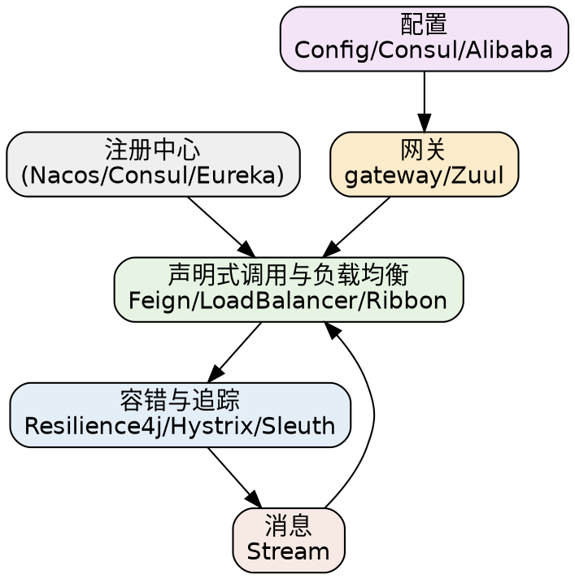

## Introduction

本目录是 **Spring Cloud** 的专题索引。Spring Cloud 把分布式系统常见的「网关 / 声明式调用 / 负载均衡 / 容错 / 配置 / 消息」做成一套组件，配合注册中心（[Nacos](/docs/CS/Framework/nacos/README.md) / [Consul](/docs/CS/Framework/consul/README.md) / Eureka）与分布式事务（[Seata](/docs/CS/Framework/Seata/Seata.md)）组装成微服务栈。

> [!NOTE]
> 版本基线与 [Spring](/docs/CS/Framework/Spring/README.md) 同步：Cloud **2025.1（Oakwood）**。旧版 Zuul / Ribbon / Hystrix / Sleuth 属 Netflix 遗留栈，新栈推荐 Gateway / LoadBalancer / Resilience4j / Micrometer Tracing（见 [Spring_Cloud](/docs/CS/Framework/Spring_Cloud/Spring_Cloud.md)）。

## Gateway

- [gateway](/docs/CS/Framework/Spring_Cloud/gateway.md)：Spring Cloud Gateway（响应式，配置根 `spring.cloud.gateway.server.webflux.routes`）。
- [Zuul](/docs/CS/Framework/Spring_Cloud/Zuul.md)：Netflix 遗留网关，新项目不建议。

## Declarative Invocation and Load Balancing

- [Feign](/docs/CS/Framework/Spring_Cloud/Feign.md)：声明式 HTTP 客户端。
- [LoadBalancer](/docs/CS/Framework/Spring_Cloud/LoadBalancer.md)：客户端负载均衡（替代 Ribbon）。
- [Ribbon](/docs/CS/Framework/Spring_Cloud/Ribbon.md)：Netflix 遗留负载均衡，已被 LoadBalancer 取代。

## Fault Tolerance and Tracing

- [Resilience4j](/docs/CS/Framework/Spring_Cloud/Resilience4j.md)：熔断、限流、重试、舱壁（Spring AOP 下 order 越小越外层）。
- [Hystrix](/docs/CS/Framework/Spring_Cloud/Hystrix.md)：Netflix 遗留熔断器。
- [Sleuth](/docs/CS/Framework/Spring_Cloud/Sleuth.md)：遗留链路追踪（已被 Micrometer Tracing 取代）。

## Configuration

- [Config](/docs/CS/Framework/Spring_Cloud/Config.md)：配置中心（Config Server / Client）。
- [Alibaba](/docs/CS/Framework/Spring_Cloud/Alibaba.md)：Spring Cloud Alibaba（Nacos 集成、Sentinel、Seata）。
- [Consul](/docs/CS/Framework/Spring_Cloud/Consul.md)：与 Consul 集成（服务发现 / 配置）。

## Messages

- [Stream](/docs/CS/Framework/Spring_Cloud/Stream.md)：声明式消息抽象（Binder）。

## Links

- [Spring Cloud（总览与版本基线）](/docs/CS/Framework/Spring_Cloud/Spring_Cloud.md)
- [Nacos（常用注册与配置中心）](/docs/CS/Framework/nacos/README.md)
- [Sentinel（流量治理）](/docs/CS/Framework/Sentinel/Sentinel.md)
- [Seata（分布式事务）](/docs/CS/Framework/Seata/Seata.md)
- [Framework 总索引](/docs/CS/Framework/README.md)

## References

1. [Spring Cloud Reference](https://docs.spring.io/spring-cloud/reference/)
2. [Spring Cloud Alibaba](https://sca.aliyun.com/docs/)
3. [Spring Cloud Gateway](https://docs.spring.io/spring-cloud-gateway/reference/)
