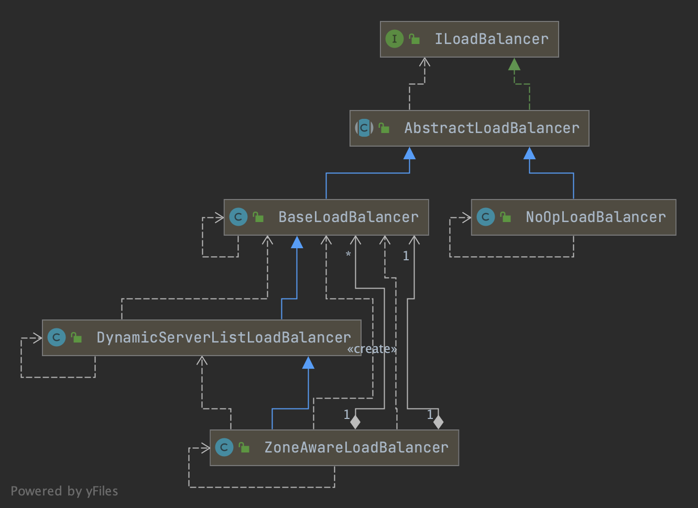
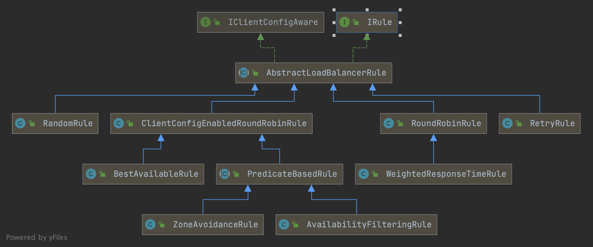

## Introduction

Ribbon is a client-side load balancer that gives you a lot of control over the behavior of HTTP and TCP clients. 
It provides the following features

- Load balancing
- Fault tolerance
- Multiple protocol (HTTP, TCP, UDP) support in an asynchronous and reactive model
- Caching and batching

Feign already uses Ribbon.

> [!WARNING]
> 
> Last Release on Nov 17, 2021

The following table shows the beans that Spring Cloud Netflix provides by default for Ribbon:

| Bean Type | Bean Name | Class Name |
| :--: | :--: | :--: |
| `IClientConfig` | `ribbonClientConfig` | `DefaultClientConfigImpl` |
| `IRule` | `ribbonRule` | `ZoneAvoidanceRule` |
| `IPing` | `ribbonPing` | `DummyPing` |
| `ServerList<Server>` | `ribbonServerList` | `ConfigurationBasedServerList` |
| `ServerListFilter<Server>` | `ribbonServerListFilter` | `ZonePreferenceServerListFilter` |
| `ILoadBalancer` | `ribbonLoadBalancer` | `ZoneAwareLoadBalancer` |
| `ServerListUpdater` | `ribbonServerListUpdater` | `PollingServerListUpdater` |


Each Ribbon named client has a corresponding child application Context that Spring Cloud maintains. This application context is lazily loaded on the first request to the named client. This lazy loading behavior can be changed to instead eagerly load these child application contexts at startup, by specifying the names of the Ribbon clients, as shown in the following example:

```yml
ribbon:
  eager-load:
    enabled: true
    clients: client1, client2, client3
``` 


### AutoConfiguration

Auto-configuration for blocking client-side load balancing.

loadBalancerInterceptor
RestTemplateCustomizer set interceptors to RestTemplate

```java
@Configuration(proxyBeanMethods = false)
@ConditionalOnClass(RestTemplate.class)
@ConditionalOnBean(LoadBalancerClient.class)
@EnableConfigurationProperties(LoadBalancerRetryProperties.class)
public class LoadBalancerAutoConfiguration {

    @LoadBalanced
    @Autowired(required = false)
    private List<RestTemplate> restTemplates = Collections.emptyList();


    @Bean
    public LoadBalancerInterceptor loadBalancerInterceptor(
        LoadBalancerClient loadBalancerClient,
        LoadBalancerRequestFactory requestFactory) {
    return new LoadBalancerInterceptor(loadBalancerClient, requestFactory);
    }
    
    @Bean
    @ConditionalOnMissingBean
    public RestTemplateCustomizer restTemplateCustomizer(
            final LoadBalancerInterceptor loadBalancerInterceptor) {
        return restTemplate -> {
            List<ClientHttpRequestInterceptor> list = new ArrayList<>(
                    restTemplate.getInterceptors());
            list.add(loadBalancerInterceptor);
            restTemplate.setInterceptors(list);
        };
    }    
}
```


### RibbonLoadBalancerClient

1. [ILoadBalancer#chooseServer()](/docs/CS/Framework/Spring_Cloud/Ribbon.md?id=chooseserver)
2. LoadBalancerRequest#apply() -> AsyncLoadBalancerInterceptor#intercept()

```java
// org.springframework.cloud.client.loadbalancer.LoadBalancerClient
public interface LoadBalancerClient extends ServiceInstanceChooser {

    <T> T execute(String serviceId, LoadBalancerRequest<T> request) throws IOException;

    <T> T execute(String serviceId, ServiceInstance serviceInstance,
                  LoadBalancerRequest<T> request) throws IOException;

    URI reconstructURI(ServiceInstance instance, URI original);
}


// RibbonLoadBalancerClient
@Override
public <T> T execute(String serviceId, ServiceInstance serviceInstance,
        LoadBalancerRequest<T> request) throws IOException {
    Server server = null;
    if (serviceInstance instanceof RibbonServer) {
        server = ((RibbonServer) serviceInstance).getServer();
    }
    if (server == null) {
        throw new IllegalStateException("No instances available for " + serviceId);
    }

    RibbonLoadBalancerContext context = this.clientFactory
            .getLoadBalancerContext(serviceId);
    RibbonStatsRecorder statsRecorder = new RibbonStatsRecorder(context, server);

    try {
        T returnVal = request.apply(serviceInstance);
        statsRecorder.recordStats(returnVal);
        return returnVal;
    }
    // catch IOException and rethrow so RestTemplate behaves correctly
    catch (IOException ex) {
        statsRecorder.recordStats(ex);
        throw ex;
    }
    catch (Exception ex) {
        statsRecorder.recordStats(ex);
        ReflectionUtils.rethrowRuntimeException(ex);
    }
    return null;
}

protected Server getServer(ILoadBalancer loadBalancer, Object hint) {
		if (loadBalancer == null) {
			return null;
		}
		// Use 'default' on a null hint, or just pass it on?
		return loadBalancer.chooseServer(hint != null ? hint : "default");
	}
```


### chooseServer

```java
public class ZoneAwareLoadBalancer<T extends Server> extends DynamicServerListLoadBalancer<T> {
    @Override
    public Server chooseServer(Object key) {
        if (!ENABLED.get() || getLoadBalancerStats().getAvailableZones().size() <= 1) {
            return super.chooseServer(key);
        }
        Server server = null;
        try {
            LoadBalancerStats lbStats = getLoadBalancerStats();
            Map<String, ZoneSnapshot> zoneSnapshot = ZoneAvoidanceRule.createSnapshot(lbStats);
            if (triggeringLoad == null) {
                triggeringLoad = DynamicPropertyFactory.getInstance().getDoubleProperty(
                        "ZoneAwareNIWSDiscoveryLoadBalancer." + this.getName() + ".triggeringLoadPerServerThreshold", 0.2d);
            }

            if (triggeringBlackoutPercentage == null) {
                triggeringBlackoutPercentage = DynamicPropertyFactory.getInstance().getDoubleProperty(
                        "ZoneAwareNIWSDiscoveryLoadBalancer." + this.getName() + ".avoidZoneWithBlackoutPercetage", 0.99999d);
            }
            Set<String> availableZones = ZoneAvoidanceRule.getAvailableZones(zoneSnapshot, triggeringLoad.get(), triggeringBlackoutPercentage.get());
            if (availableZones != null && availableZones.size() < zoneSnapshot.keySet().size()) {
                String zone = ZoneAvoidanceRule.randomChooseZone(zoneSnapshot, availableZones);
                if (zone != null) {
                    BaseLoadBalancer zoneLoadBalancer = getLoadBalancer(zone);
                    server = zoneLoadBalancer.chooseServer(key);
                }
            }
        } catch (Exception e) {
            logger.error("Error choosing server using zone aware logic for load balancer={}", name, e);
        }
        if (server != null) {
            return server;
        } else {
            return super.chooseServer(key);
        }
    }
}

public class BaseLoadBalancer extends AbstractLoadBalancer implements PrimeConnectionListener, IClientConfigAware {
    // BaseLoadBalancer
    private final static IRule DEFAULT_RULE = new RoundRobinRule();

    // Get the alive server dedicated to key
    public Server chooseServer(Object key) {
        if (counter == null) {
            counter = createCounter();
        }
        counter.increment();
        if (rule == null) {
            return null;
        } else {
            try {
                return rule.choose(key);
            } catch (Exception e) {
                return null;
            }
        }
    }
}
```


### intercept

AsyncLoadBalancerInterceptor#intercept() wrap request to `ServiceRequestWrapper` then executeAsync by `org.springframework.http.client.AsyncClientHttpRequestExecution`

Use [LoadBalancer](/docs/CS/Framework/Spring_Cloud/Ribbon.md?id=LoadBalancer) to execute.

```java
// org.springframework.cloud.client.loadbalancer.AsyncLoadBalancerInterceptor
public ListenableFuture<ClientHttpResponse> intercept(final HttpRequest request, final byte[] body, final AsyncClientHttpRequestExecution execution) throws IOException {
    URI originalUri = request.getURI();
    String serviceName = originalUri.getHost();
    return (ListenableFuture)this.loadBalancer.execute(serviceName, new LoadBalancerRequest<ListenableFuture<ClientHttpResponse>>() {
        public ListenableFuture<ClientHttpResponse> apply(final ServiceInstance instance) throws Exception {
            HttpRequest serviceRequest = new ServiceRequestWrapper(request, instance, AsyncLoadBalancerInterceptor.this.loadBalancer);
            return execution.executeAsync(serviceRequest, body);
        }
    });
}
```

## LoadBalancer




Default use [ZoneAwareLoadBalancer](/docs/CS/Framework/Spring_Cloud/Ribbon.md?id=chooseServer) which can avoid a zone as a whole when choosing server.
```java
// org.springframework.cloud.netflix.ribbon
@Configuration(proxyBeanMethods = false)
@EnableConfigurationProperties
// Order is important here, last should be the default, first should be optional
// see
// https://github.com/spring-cloud/spring-cloud-netflix/issues/2086#issuecomment-316281653
@Import({ HttpClientConfiguration.class, OkHttpRibbonConfiguration.class,
		RestClientRibbonConfiguration.class, HttpClientRibbonConfiguration.class })
public class RibbonClientConfiguration {

    public static final int DEFAULT_CONNECT_TIMEOUT = 1000;

    public static final int DEFAULT_READ_TIMEOUT = 1000;


    @Bean
    @ConditionalOnMissingBean
    public IClientConfig ribbonClientConfig() {
        DefaultClientConfigImpl config = new DefaultClientConfigImpl();

        config.loadProperties(this.name);

        config.set(CommonClientConfigKey.ConnectTimeout, getProperty(
                CommonClientConfigKey.ConnectTimeout, DEFAULT_CONNECT_TIMEOUT));

        config.set(CommonClientConfigKey.ReadTimeout,
                getProperty(CommonClientConfigKey.ReadTimeout, DEFAULT_READ_TIMEOUT));

        config.set(CommonClientConfigKey.GZipPayload, DEFAULT_GZIP_PAYLOAD);
        return config;
    }
    
    @Bean
    @ConditionalOnMissingBean
    public ILoadBalancer ribbonLoadBalancer(IClientConfig config,
                                            ServerList<Server> serverList, ServerListFilter<Server> serverListFilter,
                                            IRule rule, IPing ping, ServerListUpdater serverListUpdater) {
        if (this.propertiesFactory.isSet(ILoadBalancer.class, name)) {
            return this.propertiesFactory.get(ILoadBalancer.class, config, name);
        }
        return new ZoneAwareLoadBalancer<>(config, rule, ping, serverList,
                serverListFilter, serverListUpdater);
    }
}
```
> [!TIP]
> 
>

feign.client.config.default.readTimeout=3000
feign.client.config.default.connectTimeout=3000


default `RoundRobinRule`

## IRule



## ServerListUpdater

scheduleWithFixedDelay 30s get serversList from Registry Center([Eureka](/docs/CS/Framework/Spring_Cloud/Eureka.md), [Nacos](/docs/CS/Framework/Spring_Cloud/nacos/Nacos.md), etc. ) and check timestamps.

```java
public class PollingServerListUpdater implements ServerListUpdater {
    private final static DynamicIntProperty poolSizeProp = new DynamicIntProperty(CORE_THREAD, 2);
    private static Thread _shutdownThread;
    static ScheduledThreadPoolExecutor _serverListRefreshExecutor = null;

    public PollingServerListUpdater() {
        this(1000, 30 * 1000);
    }
    
    static {
        int coreSize = poolSizeProp.get();
        ThreadFactory factory = (new ThreadFactoryBuilder())
                .setNameFormat("PollingServerListUpdater-%d")
                .setDaemon(true)
                .build();
        _serverListRefreshExecutor = new ScheduledThreadPoolExecutor(coreSize, factory);
        poolSizeProp.addCallback(new Runnable() {
            @Override
            public void run() {
                _serverListRefreshExecutor.setCorePoolSize(poolSizeProp.get());
            }

        });
        _shutdownThread = new Thread(new Runnable() {
            public void run() {
                shutdownExecutorPool();
            }
        });
        Runtime.getRuntime().addShutdownHook(_shutdownThread);
    }
    
    @Override
    public synchronized void start(final UpdateAction updateAction) {
        if (isActive.compareAndSet(false, true)) {
            final Runnable wrapperRunnable = new Runnable() {
                @Override
                public void run() {
                    if (!isActive.get()) {
                        if (scheduledFuture != null) {
                            scheduledFuture.cancel(true);
                        }
                        return;
                    }
                    try {
                        updateAction.doUpdate();
                        lastUpdated = System.currentTimeMillis();
                    } catch (Exception e) {
                        logger.warn("Failed one update cycle", e);
                    }
                }
            };

            scheduledFuture = getRefreshExecutor().scheduleWithFixedDelay(
                    wrapperRunnable,
                    initialDelayMs,
                    refreshIntervalMs,
                    TimeUnit.MILLISECONDS
            );
        }
    }
}
```

### updateServersList

```java
public class DynamicServerListLoadBalancer<T extends Server> extends BaseLoadBalancer {
    protected final ServerListUpdater.UpdateAction updateAction = new ServerListUpdater.UpdateAction() {
        @Override
        public void doUpdate() {
            updateListOfServers();
        }
    };

    @VisibleForTesting
    public void updateListOfServers() {
        List<T> servers = new ArrayList<T>();
        if (serverListImpl != null) {
            servers = serverListImpl.getUpdatedListOfServers();
            if (filter != null) {
                servers = filter.getFilteredListOfServers(servers);
            }
        }
        updateAllServerList(servers);
    }

    protected void updateAllServerList(List<T> ls) {
        // other threads might be doing this - in which case, we pass
        if (serverListUpdateInProgress.compareAndSet(false, true)) {
            try {
                for (T s : ls) {
                    s.setAlive(true); // set so that clients can start using these servers right away instead of having to wait out the ping cycle.
                }
                setServersList(ls);
                super.forceQuickPing();
            } finally {
                serverListUpdateInProgress.set(false);
            }
        }
    }
}
```


## Links

- [Spring Cloud](/docs/CS/Framework/Spring_Cloud/Spring_Cloud.md?id=load-balance)