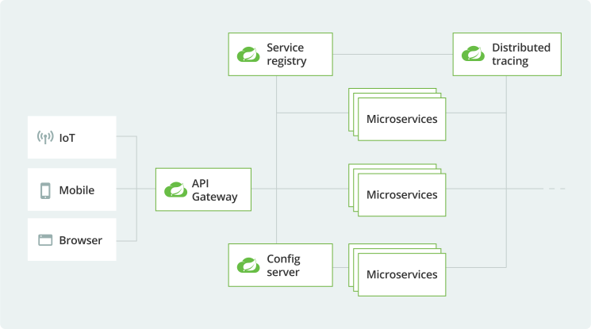

## Introduction

[Spring Cloud](https://docs.spring.io/spring-cloud/docs/current/reference/html/) 为开发者提供了一套工具，用于快速构建[分布式系统](/docs/CS/Distributed/Distributed)中的常见模式
（例如配置管理、服务发现、断路器、智能路由、微代理、控制总线、一次性令牌、全局锁、领导选举、分布式会话、集群状态）。
分布式系统的协调工作会产生大量样板代码，而使用 Spring Cloud，开发者可以快速搭建实现这些模式的服务和应用程序。
它们在任何分布式环境中都能很好地工作，包括开发者的本地电脑、裸金属数据中心以及 Cloud Foundry 等托管平台。

Spring Cloud 专注于为典型用例提供良好的开箱即用体验，并为其他场景提供可扩展机制。

- 分布式/版本化配置
- 服务注册与发现
- 路由
- 服务间调用
- 负载均衡
- 断路器
- 分布式消息
- 短生命周期微服务（任务）
- 消费者驱动和生产者驱动的契约测试

[Cloud Native](/docs/CS/Cloud/Cloud.md) 是一种应用开发风格，鼓励在持续交付和价值驱动开发领域轻松采用最佳实践。
与之相关的学科是构建 `12-factor` 应用程序，其开发实践与交付和运维目标保持一致——例如，使用声明式编程和管理与监控。
Spring Cloud 以多种特定方式促进了这些开发风格。
起点是一组分布式系统中所有组件都需要轻松访问的功能。

其中许多功能由 Spring Boot 提供，Spring Cloud 在此基础上构建。
还有一些功能由 Spring Cloud 以两个库的形式提供：Spring Cloud Context 和 Spring Cloud Commons。
Spring Cloud Context 为 Spring Cloud 应用程序的 ApplicationContext 提供实用工具和特殊服务（bootstrap context、加密、refresh scope 和 environment endpoints）。
Spring Cloud Commons 是一组抽象和公共类，用于不同的 Spring Cloud 实现（如 Spring Cloud Netflix 和 Spring Cloud Consul）。

### Spring Cloud Context

[Spring Boot](/docs/CS/Framework/Spring_Boot/Spring_Boot.md) 对于如何使用 Spring 构建应用程序有自己的观点。
例如，它有通用配置文件的传统位置，以及用于常见管理和监控任务的端点。
Spring Cloud 在此基础上构建，并添加了一些系统中许多组件会使用或偶尔需要的功能。

#### The Bootstrap Application Context

Spring Cloud 应用程序通过创建一个 "bootstrap" context 来运行，该 context 是主应用程序的父 context。
这个 context 负责从外部源加载配置属性，并对本地外部配置文件中的属性进行解密。
两个 context 共享一个 Environment，它是任何 Spring 应用程序外部属性的来源。
默认情况下，bootstrap 属性（不是 bootstrap.properties，而是在 bootstrap 阶段加载的属性）具有高优先级，因此本地配置无法覆盖它们。

bootstrap context 使用与主应用程序 context 不同的约定来定位外部配置。
你可以使用 bootstrap.yml（而不是 application.yml 或 .properties），从而将 bootstrap 和主 context 的外部配置清晰分离。

<div style="text-align: center;">



</div>

<p style="text-align: center;">
Fig.1. Spring Cloud architecture
</p>

## Service discovery

在云环境中，应用程序无法始终知道其他服务的确切位置。
服务注册中心（如 `Netflix Eureka`）或边车解决方案（如 `HashiCorp Consul`）可以提供帮助。
Spring Cloud 为流行的注册中心提供了 `DiscoveryClient` 实现，如 [Eureka](/docs/CS/Framework/Spring_Cloud/Eureka.md)、[Consul](/docs/CS/Framework/Spring_Cloud/Consul.md)、[Zookeeper](/docs/CS/Framework/ZooKeeper/ZooKeeper.md) 以及 [Kubernetes](/docs/CS/Container/k8s/K8s.md) 的内置系统。
还有 [Spring Cloud Load Balancer](https://spring.io/guides/gs/spring-cloud-loadbalancer/) 帮助你仔细地在服务实例之间分配负载。


⾯向失败的设计告诉我们，服务并不能完全相信注册中⼼的通知的地址，当注册中⼼的推送地
址为空时候，服务调⽤肯定会出 no provider 错误，那么我们就忽略此次推送的地址变更

⼼跳续约是注册中⼼感知实例可⽤性的基本途径。但是在特定情况下，⼼跳存续并不能完全等
同于服务可⽤。
因为仍然存在⼼跳正常，但服务不可⽤的情况，例如：
 Request 处理的线程池满
 依赖的 RDS 连接异常或慢 SQL

此时服务并不能完全相信注册中⼼的通知的地址，推送的地址中，可能存在⼀些服务质量低下
的服务提供者，因此客户端需要⾃⼰根据调⽤的结果来判断服务地址的可⽤性与提供服务质量
的好坏，来定向忽略某些地址


### DiscoveryClient

Spring Cloud Commons 提供了 `@EnableDiscoveryClient` 注解。
它会查找 `META-INF/spring.factories` 中 `DiscoveryClient` 和 `ReactiveDiscoveryClient` 接口的实现。
Discovery client 的实现会在 `spring.factories` 中的 `org.springframework.cloud.client.discovery.EnableDiscoveryClient` 键下添加一个配置类。
默认情况下，DiscoveryClient 的实现会将本地 Spring Boot 服务器自动注册到远程发现服务器。
可以通过在 `@EnableDiscoveryClient` 中设置 `autoRegister=false` 来禁用此行为。

> @EnableDiscoveryClient is no longer required. You can put a DiscoveryClient implementation on the classpath to cause the Spring Boot application to register with the service discovery server.

Spring Cloud 提供了一个抽象层 DiscoveryClient，你可以用它来统一地与这些服务注册中心通信。
服务注册中心提供了几种传统的 DNS 无法实现的模式。

- Registry
- HeartBeat
- UpdateTask

表示发现系统中的一个服务实例。

```java
public interface ServiceInstance {
	default String getInstanceId() {
		return null;
	}
	String getServiceId();
	String getHost();
	int getPort();
	boolean isSecure();
	URI getUri();
	Map<String, String> getMetadata();
	default String getScheme() {
		return null;
	}
}
```


publishEvent(new ServletWebServerInitializedEvent

Spring Cloud的AbstractAutoServiceRegistration 的onApplicationEvent 在start 方法里调用子类实现的register函数

### ServiceRegistry

Commons 现在提供了一个 `ServiceRegistry` 接口，提供了 `register(Registration)` 和 `deregister(Registration)` 等方法，让你可以提供自定义的注册服务。

```java
public interface ServiceRegistry<R extends Registration> {
	void register(R registration);
	void deregister(R registration);
	void close();
	void setStatus(R registration, String status);
	<T> T getStatus(R registration);
}

public interface Registration extends ServiceInstance {
}
```

默认情况下，`ServiceRegistry` 实现会自动注册正在运行的服务。
要禁用此行为，可以设置：`@EnableDiscoveryClient(autoRegister=false)` 来永久禁用自动注册。

服务自动注册时会触发两个事件。
第一个事件称为 InstancePreRegisteredEvent，在服务注册之前触发。
第二个事件称为 InstanceRegisteredEvent，在服务注册之后触发。

> These events will not be fired if the spring.cloud.service-registry.auto-registration.enabled property is set to false.

Spring Cloud Commons 提供了一个 /service-registry actuator 端点。该端点依赖于 Spring Application Context 中的 Registration bean。

> You can configure RestTemplate or WebClient to automatically use a load-balancer client.
> Individual applications must create it.
> To use a load-balanced RestTemplate, you need to have a load-balancer implementation in your classpath.
> Add Spring Cloud LoadBalancer starter to your project in order to use it.
> Then, BlockingLoadBalancerClient or ReactiveLoadBalancer is used underneathto create a full physical address.

负载均衡的 RestTemplate 可以配置为重试失败的请求。
默认情况下，此逻辑是禁用的。
对于非响应式版本（使用 RestTemplate），你可以通过将 Spring Retry 添加到应用程序的 classpath 来启用它。
对于响应式版本（使用 WebTestClient），你需要设置 `spring.cloud.loadbalancer.retry.enabled=true`。

### AbstractAutoServiceRegistration

实现ServiceRegistry并在register方法里做注册逻辑

- [Nacos](/docs/CS/Framework/Spring_Cloud/nacos/registry.md?id=Client-Registry)
- [Eureka](/docs/CS/Framework/Spring_Cloud/Eureka.md)

```java
public abstract class AbstractAutoServiceRegistration<R extends Registration>
        implements AutoServiceRegistration, ApplicationContextAware,
        ApplicationListener<WebServerInitializedEvent> {
  
    private final ServiceRegistry<R> serviceRegistry;

    private boolean autoStartup = true;

    private AtomicBoolean running = new AtomicBoolean(false);
  
    @Override
    @SuppressWarnings("deprecation")
    public void onApplicationEvent(WebServerInitializedEvent event) {
        bind(event);
    }

    @Deprecated
    public void bind(WebServerInitializedEvent event) {
        ApplicationContext context = event.getApplicationContext();
        if (context instanceof ConfigurableWebServerApplicationContext) {
            if ("management".equals(((ConfigurableWebServerApplicationContext) context)
                    .getServerNamespace())) {
                return;
            }
        }
        this.port.compareAndSet(0, event.getWebServer().getPort());
        this.start();
    }

    public void start() {
        // only initialize if nonSecurePort is greater than 0 and it isn't already running
        // because of containerPortInitializer below
        if (!this.running.get()) {
            this.context.publishEvent(
                    new InstancePreRegisteredEvent(this, getRegistration()));
            register();
            if (shouldRegisterManagement()) {
                registerManagement();
            }
            this.context.publishEvent(
                    new InstanceRegisteredEvent<>(this, getConfiguration()));
            this.running.compareAndSet(false, true);
        }

    }
}
```

## API gateway

在拥有众多客户端和服务的环境中，在云架构中包含一个 API gateway 通常非常有用。
网关可以负责保护消息安全、路由消息、隐藏服务、限制负载以及许多其他有用的功能。

API Gateway 帮助你解决这些问题以及更多问题。
它是一个强大的架构工具，可用于管理微服务架构中的消息路由、过滤和代理。
许多 API 管理网关可以追溯到 SOA 时代，它们往往作为集中式服务器实现。
但随着微服务的普及，出现了现代化的轻量级、独立且去中心化的微网关应用程序——例如 Spring Cloud Gateway。

[Spring Cloud Gateway](/docs/CS/Framework/Spring_Cloud/gateway.md) 让你能够精确控制 API 层，集成了 Spring Cloud 服务发现和客户端负载均衡解决方案，简化了配置和维护。

Zuul

## Cloud configuration

在云环境中，配置不能简单地嵌入在应用程序内部。
配置必须足够灵活，以应对多个应用程序、环境和服务实例，并且能够在不宕机的情况下进行动态变更。

集中式外部配置管理，基于 git 仓库。
配置资源直接映射到 Spring Environment，但也可以在需要时被非 Spring 应用程序使用。

[Spring Cloud Config](/docs/CS/Framework/Spring_Cloud/Config.md) 为分布式系统中的外部化配置提供了服务端和客户端支持。
通过 Config Server，你可以在一个中心位置管理所有环境中应用程序的外部属性。
客户端和服务端的概念与 Spring Environment 和 PropertySource 抽象完全一致，
因此它们与 Spring 应用程序非常契合，但也可以与任何语言的任何应用程序一起使用。
当应用程序从开发环境部署到测试环境再到生产环境时，你可以管理不同环境之间的配置，并确保应用程序在迁移时拥有运行所需的一切。
服务器存储后端的默认实现使用 git，因此它轻松支持带标签的配置环境版本，
并且可以被广泛的工具用于管理内容。
添加替代实现并通过 Spring 配置将它们插入也非常容易。

配置中心的四个基础诉求：
- 需要支持动态修改配置
- 需要动态变更有多实时
- 变更快了之后如何管控控制变更风险，如灰度、回滚等
- 敏感配置如何做安全配置


Spring Cloud Config Server features:

- HTTP、基于资源的 API 用于外部配置（键值对或等效的 YAML 内容）
- 加密和解密属性值（对称或非对称）
- 可通过 `@EnableConfigServer` 轻松嵌入到 Spring Boot 应用程序中

Config Client features (for Spring applications):

- 绑定到 Config Server 并使用远程属性源初始化 Spring `Environment`
- 加密和解密属性值（对称或非对称）

只要 Spring Boot Actuator 和 Spring Config Client 在 classpath 上，任何 Spring Boot 应用程序都会尝试连接 `[http://localhost:8888](http://localhost:8888)` 上的配置服务器，这是 `spring.cloud.config.uri` 的默认值。


配置中心的主要作用是发布metadata, 单个数据内容通常应小于100k

配置中心的配置变更频率不宜太快, 应尽量小于分钟/次

配置中心对于查询的QPS不会很高 和Redis等产品不是同一个定位 通常是使用长链接监听变更通知

配置中心的配置同步到所有服务是需要一定时间的 是最终一致性

配置同步都是使用覆盖写的 需要服务做好幂等性

### Config Refresh

use [Spring RefreshEventListener](/docs/CS/Framework/Spring/IoC.md?id=EventListener).

## Load Balancer

Spring Cloud 提供了自己的客户端负载均衡抽象和实现。
对于负载均衡机制，新增了 ReactiveLoadBalancer 接口，并提供了基于 Round-Robin 和 Random 的实现。
为了获取可供选择的实例，使用了响应式的 ServiceInstanceListSupplier。
目前，我们支持基于服务发现的 ServiceInstanceListSupplier 实现，它使用 classpath 中可用的 Discovery Client 从服务发现中检索可用实例。

Spring Cloud LoadBalancer 为每个服务 ID 创建一个单独的 Spring 子 context。
默认情况下，这些 context 是延迟初始化的，在第一个针对某个服务 ID 的请求需要负载均衡时才会创建。
你可以选择提前加载这些 context。
为此，需要使用 `spring.cloud-loadbalancer.eager-load.clients` 属性指定要进行提前加载的服务 ID。

Spring Cloud Loadbalancer 是一个通用抽象，可以执行我们以前使用 [Netflix's Ribbon](/docs/CS/Framework/Spring_Cloud/Ribbon.md) 项目所做的工作。

ClientHttpRequestInterceptor


### LoadBalancer Caching

如果 classpath 中没有 Caffeine，将使用随 spring-cloud-starter-loadbalancer 自动提供的 DefaultLoadBalancerCache。

## Circuit Breaker

分布式系统可能不可靠。请求可能遇到超时或完全失败。
断路器可以帮助缓解这些问题，Spring Cloud Circuit Breaker 为你提供了三种流行选项：[Resilience4J](/docs/CS/Framework/Spring_Cloud/Resilience4j.md)、[Sentinel](/docs/CS/Framework/Spring_Cloud/Sentinel/Sentinel.md) 或 [Hystrix](/docs/CS/Framework/Spring_Cloud/Hystrix.md)。

[Spring Retry]()

在 Hystrix 中，对外部系统的调用必须包装在 HystrixCommand 中。

> [!NOTE]
>
> Load Balancer retries timeout must less than circuit breaker timeout.

要在代码中创建断路器，你可以使用 CircuitBreakerFactory API。
当你在 classpath 中包含 Spring Cloud Circuit Breaker starter 时，一个实现此接口的 bean 会自动为你创建。

CircuitBreakerFactory.create API 创建了一个 CircuitBreaker 类的实例。
run 方法接受一个 Supplier 和一个 Function。Supplier 是你将要包装在断路器中的代码。
Function 是断路器触发时运行的回退逻辑。
该函数接收触发回退的 Throwable。
如果你不想提供回退，可以选择将其排除。

> The ReactiveCircuitBreakerFactory.create API will create an instance of a class called ReactiveCircuitBreaker.
> The run method takes with a Mono or Flux and wraps it in a circuit breaker.

```java
public interface CircuitBreaker {
	default <T> T run(Supplier<T> toRun) {
		return run(toRun, throwable -> {
			throw new NoFallbackAvailableException("No fallback available.", throwable);
		});
	};

	<T> T run(Supplier<T> toRun, Function<Throwable, T> fallback);
}
```

你可以通过创建 Customizer 类型的 bean 来配置断路器。
Customizer 接口有一个名为 customize 的单一方法，它接受要定制的对象。

某些 CircuitBreaker 实现（如 Resilience4JCircuitBreaker）在每次调用 CircuitBreaker#run 时都会调用 customize 方法。
这可能效率较低。在这种情况下，你可以使用 CircuitBreaker#once 方法。
当多次调用 customize 没有意义时（例如，在使用 Resilience4j 的事件时），这很有用。

## Tracing

调试分布式应用程序可能非常复杂且耗时。
对于任何给定的故障，你可能需要从多个独立服务中拼凑出追踪信息。
[Spring Cloud Sleuth](/docs/CS/Framework/Spring_Cloud/Sleuth.md) 可以以可预测且可重复的方式对你的应用程序进行检测。
当与 [Zipkin](/docs/CS/Distributed/Tracing/Zipkin.md) 一起使用时，你可以精确定位可能存在的任何延迟问题。

`Spring Cloud Sleuth` 为分布式追踪提供了 Spring Boot 自动配置。

Sleuth 配置了你开始所需的一切。
这包括追踪数据（spans）报告的位置、保留多少追踪数据（sampling）、是否发送远程字段（baggage）以及哪些库被追踪。

具体来说，Spring Cloud Sleuth：

- 将 trace 和 span ID 添加到 Slf4J MDC，这样你可以在日志聚合器中提取给定 trace 或 span 的所有日志。
- 检测 Spring 应用程序的常见入口和出口点（servlet filter、rest template、scheduled actions、message channels、feign client）。
- 如果 `spring-cloud-sleuth-zipkin` 可用，则应用程序将通过 HTTP 生成并报告与 Zipkin 兼容的追踪数据。
  默认情况下，它将这些数据发送到 localhost（端口 9411）上的 Zipkin collector 服务。
  使用 `spring.zipkin.baseUrl` 配置服务的位置。

## RPC

- [Feign](/docs/CS/Framework/Spring_Cloud/Feign.md)

## Testing

在云环境中，拥有可靠、可信赖、稳定的 API 会为你加分——但要达到这个目标可能是一个过程。
基于契约的测试是高绩效团队经常用来保持正轨的一种技术。
它通过形式化 API 的内容并围绕它们构建测试来确保代码保持可控。

Spring Cloud Contract 为基于 REST 和消息的 API 提供了基于契约的测试支持，契约用 Groovy、Java 或 Kotlin 编写。

## Main Projects

**Spring Cloud Netflix**

Spring Cloud Netflix 项目通过自动配置和绑定到 Spring Environment 以及其他 Spring 编程模型习惯用法，为 Spring Boot 应用程序提供 Netflix OSS 集成。

- 提供的模式包括 Service Discovery ([Eureka](/docs/CS/Framework/Spring_Cloud/Eureka.md))。

> Circuit Breaker (Hystrix), Intelligent Routing (Zuul) and Client Side Load Balancing (Ribbon).

**Spring Cloud OpenFeign**

Spring Cloud OpenFeign 通过自动配置和绑定到 Spring Environment 以及其他 Spring 编程模型习惯用法，为 Spring Boot 应用程序提供集成。

Spring Cloud Alibaba (https://sca.aliyun.com/en-us/) 为分布式应用开发提供一站式解决方案。
它包含了开发分布式应用所需的所有组件，让你可以轻松地使用 Spring Cloud 开发应用程序。

- Seata
- RocketMQ

## Links

- [Spring Framework](/docs/CS/Framework/Spring/Spring.md)
- [Spring Boot](/docs/CS/Framework/Spring_Boot/Spring_Boot.md)

## References
1. [Eureka! Why You Shouldn't Use ZooKeeper for Service Discovery](https://medium.com/knerd/eureka-why-you-shouldnt-use-zookeeper-for-service-discovery-4932c5c7e764)
