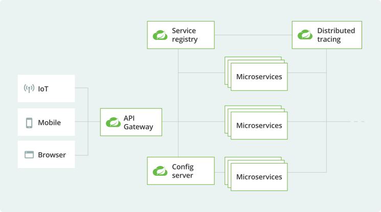

## Introduction

[Spring Cloud](https://docs.spring.io/spring-cloud/docs/current/reference/html/) provides tools for developers to quickly build some of the common patterns in [distributed systems](/docs/CS/Distributed/Distributed.md)
(e.g. configuration management, service discovery, circuit breakers, intelligent routing, micro-proxy, control bus, one-time tokens, global locks, leadership election, distributed sessions, cluster state).
Coordination of distributed systems leads to boiler plate patterns, and using Spring Cloud developers can quickly stand up services and applications that implement those patterns.
They will work well in any distributed environment, including the developer’s own laptop, bare metal data centres, and managed platforms such as Cloud Foundry.

Spring Cloud focuses on providing good out of box experience for typical use cases and extensibility mechanism to cover others.

* Distributed/versioned configuration
* Service registration and discovery
* Routing
* Service-to-service calls
* Load balancing
* Circuit Breakers
* Distributed messaging
* Short lived microservices (tasks)
* Consumer-driven and producer-driven contract testing

[Cloud Native](/docs/CS/Cloud/Cloud.md) is a style of application development that encourages easy adoption of best practices in the areas of continuous delivery and value-driven development.
A related discipline is that of building `12-factor` Applications, in which development practices are aligned with delivery and operations goals—for instance, by using declarative programming and management and monitoring.
Spring Cloud facilitates these styles of development in a number of specific ways.
The starting point is a set of features to which all components in a distributed system need easy access.

Many of those features are covered by Spring Boot, on which Spring Cloud builds.
Some more features are delivered by Spring Cloud as two libraries: Spring Cloud Context and Spring Cloud Commons.
Spring Cloud Context provides utilities and special services for the ApplicationContext of a Spring Cloud application (bootstrap context, encryption, refresh scope, and environment endpoints).
Spring Cloud Commons is a set of abstractions and common classes used in different Spring Cloud implementations (such as Spring Cloud Netflix and Spring Cloud Consul).

### Spring Cloud Context

[Spring Boot](/docs/CS/Framework/Spring_Boot/Spring_Boot.md) has an opinionated view of how to build an application with Spring.
For instance, it has conventional locations for common configuration files and has endpoints for common management and monitoring tasks.
Spring Cloud builds on top of that and adds a few features that many components in a system would use or occasionally need.

#### The Bootstrap Application Context

A Spring Cloud application operates by creating a “bootstrap” context, which is a parent context for the main application.
This context is responsible for loading configuration properties from the external sources and for decrypting properties in the local external configuration files.
The two contexts share an Environment, which is the source of external properties for any Spring application.
By default, bootstrap properties (not bootstrap.properties but properties that are loaded during the bootstrap phase) are added with high precedence, so they cannot be overridden by local configuration.

The bootstrap context uses a different convention for locating external configuration than the main application context.
Instead of application.yml (or .properties), you can use bootstrap.yml, keeping the external configuration for bootstrap and main context nicely separate

<div style="text-align: center;">



</div>

<p style="text-align: center;">
Fig.1. Spring Cloud architecture
</p>

## Service discovery

In the cloud, applications can’t always know the exact location of other services.
A service registry, such as `Netflix Eureka`, or a sidecar solution, such as `HashiCorp Consul`, can help.
Spring Cloud provides `DiscoveryClient` implementations for popular registries such as [Eureka](/docs/CS/Framework/eureka/Eureka.md), [Consul](/docs/CS/Framework/Spring_Cloud/Consul.md), [Zookeeper](/docs/CS/Framework/ZooKeeper/ZooKeeper.md), and even [Kubernetes](/docs/CS/Container/k8s/K8s.md)' built-in system.
There’s also a [Spring Cloud Load Balancer](https://spring.io/guides/gs/spring-cloud-loadbalancer/) to help you distribute the load carefully among your service instances.


⾯向失败的设计告诉我们，服务并不能完全相信注册中⼼的通知的地址，当注册中⼼的推送地
址为空时候，服务调⽤肯定会出 no provider 错误，那么我们就忽略此次推送的地址变更

⼼跳续约是注册中⼼感知实例可⽤性的基本途径。但是在特定情况下，⼼跳存续并不能完全等
同于服务可⽤。
因为仍然存在⼼跳正常，但服务不可⽤的情况，例如：
 Request 处理的线程池满
 依赖的 RDS 连接异常或慢 SQL

此时服务并不能完全相信注册中⼼的通知的地址，推送的地址中，可能存在⼀些服务质量低下
的服务提供者，因此客户端需要⾃⼰根据调⽤的结果来判断服务地址的可⽤性与提供服务质量
的好坏，来定向忽略某些地址


### DiscoveryClient

Spring Cloud Commons provides the `@EnableDiscoveryClient` annotation.
This looks for implementations of the `DiscoveryClient` and `ReactiveDiscoveryClient` interfaces with `META-INF/spring.factories`.
Implementations of the discovery client add a configuration class to `spring.factories` under the `org.springframework.cloud.client.discovery.EnableDiscoveryClient` key.
By default, implementations of DiscoveryClient auto-register the local Spring Boot server with the remote discovery server.
This behavior can be disabled by setting `autoRegister=false` in `@EnableDiscoveryClient`.

> @EnableDiscoveryClient is no longer required. You can put a DiscoveryClient implementation on the classpath to cause the Spring Boot application to register with the service discovery server.

Spring Cloud provides an abstraction, DiscoveryClient, that you can use to talk to these service registries generically.
There are several patterns that a service registry enables that just arent possible with good 'ol DNS.

- Registry
- HeartBeat
- UpdateTask

Represents an instance of a service in a discovery system.

```java
public interface ServiceInstance {
	default String getInstanceId() {
		return null;
	}
	String getServiceId();
	String getHost();
	int getPort();
	boolean isSecure();
	URI getUri();
	Map<String, String> getMetadata();
	default String getScheme() {
		return null;
	}
}
```


publishEvent(new ServletWebServerInitializedEvent

Spring Cloud的AbstractAutoServiceRegistration 的onApplicationEvent 在start 方法里调用子类实现的register函数

### ServiceRegistry

Commons now provides a `ServiceRegistry` interface that provides methods such as `register(Registration)` and `deregister(Registration)`, which let you provide custom registered services.

```java
public interface ServiceRegistry<R extends Registration> {
	void register(R registration);
	void deregister(R registration);
	void close();
	void setStatus(R registration, String status);
	<T> T getStatus(R registration);
}

public interface Registration extends ServiceInstance {
}
```

By default, the `ServiceRegistry` implementation auto-registers the running service.
To disable that behavior, you can set: `@EnableDiscoveryClient(autoRegister=false)` to permanently disable auto-registration.

There are two events that will be fired when a service auto-registers.
The first event, called InstancePreRegisteredEvent, is fired before the service is registered.
The second event, called InstanceRegisteredEvent, is fired after the service is registered.

> These events will not be fired if the spring.cloud.service-registry.auto-registration.enabled property is set to false.

Spring Cloud Commons provides a /service-registry actuator endpoint. This endpoint relies on a Registration bean in the Spring Application Context.

> You can configure RestTemplate or WebClient to automatically use a load-balancer client.
> Individual applications must create it.
> To use a load-balanced RestTemplate, you need to have a load-balancer implementation in your classpath.
> Add Spring Cloud LoadBalancer starter to your project in order to use it.
> Then, BlockingLoadBalancerClient or ReactiveLoadBalancer is used underneathto create a full physical address.

`/service-registry` 端点细节：GET 返回当前 `Registration` 状态；POST 带 `{"status": "..."}` 的 JSON 修改状态，可取值取决于具体实现——Eureka 为 `UP`、`DOWN`、`OUT_OF_SERVICE`、`UNKNOWN`。置为 `OUT_OF_SERVICE` 即优雅下线：实例保留注册但不再接收流量。

Commons 还提供两个与发现相关的通用能力：

- **健康指标**：自动装配 `DiscoveryClientHealthIndicator`，并聚合各实现提供的 `DiscoveryHealthIndicator` 成复合 HealthIndicator。可用 `spring.cloud.discovery.client.health-indicator.enabled=false` 关闭，`...include-description=false` 避免 description 冒泡到聚合状态。
- **多注册中心排序**：`DiscoveryClient` 继承 `Ordered`（默认 0），自定义实现可重写 `getOrder()`；Spring Cloud 自带实现可用属性排序，如 `spring.cloud.consul.discovery.order`、`eureka.client.order`。

A load-balanced RestTemplate can be configured to retry failed requests.
By default, this logic is disabled.
For the non-reactive version (with RestTemplate), you can enable it by adding Spring Retry to your application’s classpath.
For the reactive version (with WebTestClient), you need to set `spring.cloud.loadbalancer.retry.enabled=true.

### AbstractAutoServiceRegistration

实现ServiceRegistry并在register方法里做注册逻辑

- [Nacos](/docs/CS/Framework/nacos/registry.md?id=client-registry)
- [Eureka](/docs/CS/Framework/eureka/Eureka.md)

```java
public abstract class AbstractAutoServiceRegistration<R extends Registration>
        implements AutoServiceRegistration, ApplicationContextAware,
        ApplicationListener<WebServerInitializedEvent> {
  
    private final ServiceRegistry<R> serviceRegistry;

    private boolean autoStartup = true;

    private AtomicBoolean running = new AtomicBoolean(false);
  
    @Override
    @SuppressWarnings("deprecation")
    public void onApplicationEvent(WebServerInitializedEvent event) {
        bind(event);
    }

    @Deprecated
    public void bind(WebServerInitializedEvent event) {
        ApplicationContext context = event.getApplicationContext();
        if (context instanceof ConfigurableWebServerApplicationContext) {
            if ("management".equals(((ConfigurableWebServerApplicationContext) context)
                    .getServerNamespace())) {
                return;
            }
        }
        this.port.compareAndSet(0, event.getWebServer().getPort());
        this.start();
    }

    public void start() {
        // only initialize if nonSecurePort is greater than 0 and it isn't already running
        // because of containerPortInitializer below
        if (!this.running.get()) {
            this.context.publishEvent(
                    new InstancePreRegisteredEvent(this, getRegistration()));
            register();
            if (shouldRegisterManagement()) {
                registerManagement();
            }
            this.context.publishEvent(
                    new InstanceRegisteredEvent<>(this, getConfiguration()));
            this.running.compareAndSet(false, true);
        }

    }
}
```

## API gateway

With so many clients and servers in play, it’s often helpful to include an API gateway in your cloud architecture.
A gateway can take care of securing and routing messages, hiding services, throttling load, and many other useful things.

An API Gateway helps you to solve these problems and more.
It is a powerful architectural tool which you can use to manage message routing, filtering and proxying in your microservice architecture.
Many API Management Gateways can be dated back to SOA and these tend to have been implemented as centralized servers.
But as microservices became more popular, modern lightweight independent and decentralized micro-gateway applications have appeared – such as Spring Cloud Gateway.

[Spring Cloud Gateway](/docs/CS/Framework/Spring_Cloud/gateway.md) gives you precise control of your API layer, integrating Spring Cloud service discovery and client-side load-balancing solutions to simplify configuration and maintenance.

它是 Netflix [Zuul](/docs/CS/Framework/Spring_Cloud/Zuul.md)（阻塞式、pre/route/post 过滤器链）的现代替代品；Zuul 1 集成已在 Spring Cloud 2020.0 移除。

## Cloud configuration

In the cloud, configuration can’t simply be embedded inside the application.
The configuration has to be flexible enough to cope with multiple applications, environments, and service instances, as well as deal with dynamic changes without downtime.


Centralized external configuration management backed by a git repository.
The configuration resources map directly to Spring Environment but could be used by non-Spring applications if desired.

[Spring Cloud Config](/docs/CS/Framework/Spring_Cloud/Config.md) provides server and client-side support for externalized configuration in a distributed system.
With the Config Server you have a central place to manage external properties for applications across all environments.
The concepts on both client and server map identically to the Spring Environment and PropertySource abstractions,
so they fit very well with Spring applications, but can be used with any application running in any language.
As an application moves through the deployment pipeline from dev to test and into production you can manage the configuration between those environments and be certain that applications have everything they need to run when they migrate.
The default implementation of the server storage backend uses git so it easily supports labelled versions of configuration environments,
as well as being accessible to a wide range of tooling for managing the content.
It is easy to add alternative implementations and plug them in with Spring configuration.

配置中心的四个基础诉求：
- 需要支持动态修改配置
- 需要动态变更有多实时
- 变更快了之后如何管控控制变更风险，如灰度、回滚等
- 敏感配置如何做安全配置


Spring Cloud Config Server features:

- HTTP, resource-based API for external configuration (name-value pairs, or equivalent YAML content)
- Encrypt and decrypt property values (symmetric or asymmetric)
- Embeddable easily in a Spring Boot application using `@EnableConfigServer`

Config Client features (for Spring applications):

- Bind to the Config Server and initialize Spring `Environment` with remote property sources
- Encrypt and decrypt property values (symmetric or asymmetric)

As long as Spring Boot Actuator and Spring Config Client are on the classpath any Spring Boot application will try to contact a config server on `[http://localhost:8888](http://localhost:8888)`, the default value of `spring.cloud.config.uri`.


配置中心的主要作用是发布metadata, 单个数据内容通常应小于100k

配置中心的配置变更频率不宜太快, 应尽量小于分钟/次

配置中心对于查询的QPS不会很高 和Redis等产品不是同一个定位 通常是使用长链接监听变更通知

配置中心的配置同步到所有服务是需要一定时间的 是最终一致性

配置同步都是使用覆盖写的 需要服务做好幂等性

### Config Refresh

use [Spring RefreshEventListener](/docs/CS/Framework/Spring/IoC.md).

配置变更的传播依赖 `EnvironmentChangeEvent`：监听到该事件后，应用会做两件标准动作——

1. 重新绑定上下文中所有 `@ConfigurationProperties` bean；
2. 按 `logging.level.*` 中的新值重设日志级别。

Config Client 默认**不轮询**远程配置：横向扩容的实例集群各自轮询既浪费又不一致，推荐由 [Spring Cloud Bus](https://spring.io/projects/spring-cloud-bus)（消息总线）把 `EnvironmentChangeEvent` 一次性广播给所有实例。可用 `/actuator/env` 验证变更是否绑定成功。

`@ConfigurationProperties` 重绑定覆盖不了需要对整个 bean 做原子刷新的场景（如持有连接池的 `DataSource`），这时用 `@RefreshScope`：

- 刷新作用域的 bean 是**惰性代理**，方法调用时才从作用域缓存取真实实例；
- `/actuator/refresh`（或 JMX）调用 `RefreshScope.refreshAll()` 清空缓存，下一次方法调用即按新配置重建实例——旧连接的持有者可以把手头工作做完；
- 对"不可变"的 bean 可在 `spring.cloud.refresh.extra-refreshable` 中显式声明类名。

> 注意：`@RefreshScope` 加在 `@Configuration` 类上不会让其中所有 `@Bean` 自动进入刷新作用域，需要逐个标注。

Bootstrap 相关补充：

- 远程属性默认高优先级、不可被本地覆盖；需配置中心侧设置 `spring.cloud.config.allowOverride=true` 才放开，配合 `overrideNone` / `overrideSystemProperties` 控制本地配置和系统属性的位置。
- 可通过实现 `PropertySourceLocator` 并注册到 `META-INF/spring.factories` 的 `BootstrapConfiguration` 键，插入自定义引导属性源（如从数据库取配置）。
- **Spring Cloud 2020.0 起 Bootstrap 默认禁用**，改为 `spring.config.import` 机制（如 `spring.config.import=configserver:http://...`）引入配置中心，`bootstrap.yml` 需显式引入 `spring-cloud-starter-bootstrap` 才生效。

与刷新相关的 Actuator 端点：`/actuator/env`（更新 Environment 并重绑定）、`/actuator/refresh`（重载引导上下文 + 刷新 RefreshScope bean）、`/actuator/restart`（重启上下文，默认禁用）、`/actuator/pause` 与 `/actuator/resume`（调用 Lifecycle 的 stop/start）。

## Load Balancer

Spring Cloud provides its own client-side load-balancer abstraction and implementation.
For the load-balancing mechanism, ReactiveLoadBalancer interface has been added and a Round-Robin-based and Random implementations have been provided for it.
In order to get instances to select from reactive ServiceInstanceListSupplier is used.
Currently we support a service-discovery-based implementation of ServiceInstanceListSupplier that retrieves available instances from Service Discovery using a Discovery Client available in the classpath.

Spring Cloud LoadBalancer creates a separate Spring child context for each service id.
By default, these contexts are initialised lazily, whenever the first request for a service id is being load-balanced.
You can choose to load those contexts eagerly. 
In order to do that, specify the service ids for which you want to do eager load using the `spring.cloud-loadbalancer.eager-load.clients` property.

Spring Cloud Loadbalancer is a generic abstraction that can do the work that we used to do with [Netflix's Ribbon](/docs/CS/Framework/Spring_Cloud/Ribbon.md) project.

ClientHttpRequestInterceptor


### LoadBalancer Caching

If you do not have Caffeine in the classpath, the DefaultLoadBalancerCache, which comes automatically with spring-cloud-starter-loadbalancer, will be used.

## Circuit Breaker

Distributed systems can be unreliable. Requests might encounter timeouts or fail completely.
A circuit breaker can help mitigate these issues, and Spring Cloud Circuit Breaker gives you the choice of three popular options: [Resilience4J](/docs/CS/Framework/Spring_Cloud/Resilience4j.md), [Sentinel](/docs/CS/Framework/Sentinel/Sentinel.md), or [Hystrix](/docs/CS/Framework/Spring_Cloud/Hystrix.md).

[Spring Retry]()

In Hystrix calls to external systems have to be wrapped in a HystrixCommand.

> [!NOTE]
>
> Load Balancer retries timeout must less than circuit breaker timeout.

To create a circuit breaker in your code, you can use the CircuitBreakerFactory API.
When you include a Spring Cloud Circuit Breaker starter on your classpath, a bean that implements this API is automatically created for you.

The CircuitBreakerFactory.create API creates an instance of a class called CircuitBreaker.
The run method takes a Supplier and a Function. The Supplier is the code that you are going to wrap in a circuit breaker.
The Function is the fallback that is run if the circuit breaker is tripped.
The function is passed the Throwable that caused the fallback to be triggered.
You can optionally exclude the fallback if you do not want to provide one.

> The ReactiveCircuitBreakerFactory.create API will create an instance of a class called ReactiveCircuitBreaker.
> The run method takes with a Mono or Flux and wraps it in a circuit breaker.

```java
public interface CircuitBreaker {
	default <T> T run(Supplier<T> toRun) {
		return run(toRun, throwable -> {
			throw new NoFallbackAvailableException("No fallback available.", throwable);
		});
	};

	<T> T run(Supplier<T> toRun, Function<Throwable, T> fallback);
}
```

You can configure your circuit breakers by creating beans of type Customizer.
The Customizer interface has a single method (called customize) that takes the Object to customize.

Some CircuitBreaker implementations such as Resilience4JCircuitBreaker call customize method every time CircuitBreaker#run is called.
It can be inefficient. In that case, you can use CircuitBreaker#once method.
It is useful where calling customize many times doesn’t make sense, for example, in case of consuming Resilience4j’s events.

## Tracing

Debugging distributed applications can be complex and take a long time.
For any given failure, you might need to piece together traces of information from several independent services.
[Spring Cloud Sleuth](/docs/CS/Framework/Spring_Cloud/Sleuth.md) can instrument your applications in a predictable and repeatable way.
And when used in conjunction with [Zipkin](/docs/CS/Distributed/Tracing/Zipkin.md), you can zero in on any latency problems you might have.

`Spring Cloud Sleuth` provides Spring Boot auto-configuration for distributed tracing.

Sleuth configures everything you need to get started.
This includes where trace data (spans) are reported to, how many traces to keep (sampling), if remote fields (baggage) are sent, and which libraries are traced.

Specifically, Spring Cloud Sleuth

- Adds trace and span ids to the Slf4J MDC, so you can extract all the logs from a given trace or span in a log aggregator.
- Instruments common ingress and egress points from Spring applications (servlet filter, rest template, scheduled actions, message channels, feign client).
- If `spring-cloud-sleuth-zipkin` is available then the app will generate and report Zipkin-compatible traces via HTTP.
  By default it sends them to a Zipkin collector service on localhost (port 9411).
  Configure the location of the service using `spring.zipkin.baseUrl`.

## Messaging

[Spring Cloud Stream](/docs/CS/Framework/Spring_Cloud/Stream.md) provides a unified, binder-based programming model for message-driven microservices: business code stays middleware-neutral while a pluggable Binder adapts Kafka, RabbitMQ, or RocketMQ. As of 3.x it favors the functional model (`Supplier` / `Function` / `Consumer`) over the legacy `@StreamListener`.

## RPC

- [Feign](/docs/CS/Framework/Spring_Cloud/Feign.md)

## Testing

In the cloud, you get extra points for having reliable, trustworthy, stable APIs—but getting there can be a journey.
Contract-based testing is one technique that high-performing teams often use to stay on track.
It helps by formalizing the content of APIs and building tests around them to ensure code remains in check.

Spring Cloud Contract provides contract-based testing support for REST and messaging-based APIs with contracts written in Groovy, Java, or Kotlin.

## Main Projects

**Spring Cloud Netflix**

Spring Cloud Netflix project provides Netflix OSS integrations for Spring Boot apps through autoconfiguration and binding to the Spring Environment and other Spring programming model idioms.

- The patterns provided include Service Discovery ([Eureka](/docs/CS/Framework/eureka/Eureka.md)).

> Circuit Breaker (Hystrix), Intelligent Routing (Zuul) and Client Side Load Balancing (Ribbon).

**Spring Cloud OpenFeign**

Spring Cloud OpenFeign provides integrations for Spring Boot apps through autoconfiguration and binding to the Spring Environment and other Spring programming model idioms.

Spring Cloud Alibaba (https://sca.aliyun.com/en-us/) provides a one-stop solution for distributed application development.
It contains all the components required to develop distributed applications, making it easy for you to develop your applications using Spring Cloud.

- Seata
- RocketMQ

## Links

- [Spring Framework](/docs/CS/Framework/Spring/Spring.md)
- [Spring Boot](/docs/CS/Framework/Spring_Boot/Spring_Boot.md)
- [Spring Cloud Config](/docs/CS/Framework/Spring_Cloud/Config.md)
- [Spring Cloud Gateway](/docs/CS/Framework/Spring_Cloud/gateway.md)
- [Zuul](/docs/CS/Framework/Spring_Cloud/Zuul.md)
- [Ribbon](/docs/CS/Framework/Spring_Cloud/Ribbon.md)
- [LoadBalancer](/docs/CS/Framework/Spring_Cloud/LoadBalancer.md)
- [Hystrix](/docs/CS/Framework/Spring_Cloud/Hystrix.md)
- [Resilience4j](/docs/CS/Framework/Spring_Cloud/Resilience4j.md)
- [OpenFeign](/docs/CS/Framework/Spring_Cloud/Feign.md)
- [Spring Cloud Stream](/docs/CS/Framework/Spring_Cloud/Stream.md)
- [Spring Cloud Sleuth](/docs/CS/Framework/Spring_Cloud/Sleuth.md)

## References
1. [Eureka! Why You Shouldn’t Use ZooKeeper for Service Discovery](https://medium.com/knerd/eureka-why-you-shouldnt-use-zookeeper-for-service-discovery-4932c5c7e764)
2. [阿里云 SCA 学习站 - Spring Cloud Commons 通用抽象](https://sca.aliyun.com/learn/spring-cloud/spring-cloud-commons/)
3. [阿里云 SCA 学习站 - Spring Cloud Context 应用上下文](https://sca.aliyun.com/learn/spring-cloud/spring-cloud-context/)
