## Introduction

Tomcat 内置集群（`catalina-ha` 模块）做的是一件事：**让 distributable 应用的 HttpSession 在多台节点之间保持一致**。它的整体形态可以概括成「Valve 触发 + tribes 传输」的两层结构：

- **上层 catalina-ha**：`org.apache.catalina.ha.*`。`ReplicationValve` 在每个请求结束时收集"这个请求改了哪些 session"，把差异交给 Manager（`DeltaManager` / `BackupManager`）打包成 `ClusterMessage`；
- **下层 tribes**：`org.apache.catalina.tribes.*`。一个与 HTTP 完全无关的 group communication 框架，负责成员发现、消息分帧、分片、加密、可靠送达。

分两层的原因很直接：session 复制的**语义**（delta 怎么记录、故障时怎么转移）和**传输**（TCP 还是组播、要不要分片加密）是两个独立演化的维度。tribes 自己就设计成可独立使用的通用消息总线，`catalina-ha` 只是它的一个消费者。

与 nginx + Redis 这类外置 session 方案的定位差异：内置集群不需要任何外部组件、与应用同生命周期部署，代价是节点间全量/半量广播带来的网络开销和 Java 序列化耦合；外置方案把状态挪到共享存储，Web 层变薄但要额外运维一个 Redis。横向对比见 [compare](/docs/CS/Framework/Tomcat/compare.md)，Tomcat 总览见 [Tomcat](/docs/CS/Framework/Tomcat/Tomcat.md)。

## Two layers: catalina-ha and tribes

两层通过 `org.apache.catalina.tribes.Channel` 接口拼接。`SimpleTcpCluster`（`ha/tcp/SimpleTcpCluster.java`）实现 ha 侧的 `CatalinaCluster` 契约，默认持有一个 `GroupChannel`：

```java
protected Channel channel = new GroupChannel();
// ...
private int channelSendOptions = Channel.SEND_OPTIONS_ASYNCHRONOUS;
```

相对 /tmp/src/tree/tomcat-catalina-ha-11.0.26/org/apache/catalina/ha/tcp/SimpleTcpCluster.java:126、:181。

注意默认发送选项就是 **ASYNC**——这是集群吞吐的关键配置，同步 ACK 模式会把请求线程挂住等对端确认。启动链条在 `startInternal`：

```java
protected void startInternal() throws LifecycleException {
    // ...
    checkDefaults();
    registerClusterValve();
    channel.addMembershipListener(this);
    channel.addChannelListener(this);
    channel.setName(getClusterName() + "-Channel");
    channel.start(channelStartOptions);
    // ...
}
```

相对 /tmp/src/tree/tomcat-catalina-ha-11.0.26/org/apache/catalina/ha/tcp/SimpleTcpCluster.java:588-605。`checkDefaults()` 里若发现 channel 为 null 会兜底 `new GroupChannel()`（:633-635）；`registerClusterValve()`（:601）负责把配置在 `<Cluster>` 内的 ClusterValve（如 `ReplicationValve`）装进所在容器的 Valve 管线——Valve 的挂载层级与调用链见 [Valve](/docs/CS/Framework/Tomcat/Valve.md) 与 [Container](/docs/CS/Framework/Tomcat/Container.md)。`<Cluster>` 到各组件的装配由 `ClusterRuleSet`（ha/ClusterRuleSet.java:25）完成，它就是 server.xml 里 `<Cluster>` 嵌套解析规则的定义。

发送路径：`cluster.send(msg)` → `channel.send(dest, msg, channelSendOptions)`（SimpleTcpCluster.java:739-757）。接收路径：tribes 收到完整消息后回调 `ChannelListener`，`SimpleTcpCluster` 自己实现了该接口（startInternal 里 `channel.addChannelListener(this)`），再把消息分发给注册的 `ClusterListener`（ha/ClusterListener.java:30）——比如 `ClusterSessionListener`（ha/session/ClusterSessionListener.java:31），后者按 context 找到 `ClusterManager` 并调用 `manager.messageDataReceived(msg)`。

`Channel` 的发送选项是理解消息语义的钥匙（相对 /tmp/src/tree/tomcat-tribes-11.0.26/org/apache/catalina/tribes/Channel.java:148-215）：

| 常量 | 值 | 含义 |
| :--- | :--- | :--- |
| `SEND_OPTIONS_BYTE_MESSAGE` | 0x0001 | 消息体是字节而非序列化对象 |
| `SEND_OPTIONS_USE_ACK` | 0x0002 | 等待对端处理完成后的 ACK |
| `SEND_OPTIONS_SYNCHRONIZED_ACK` | 0x0004 | 对端收到即 ACK（不必处理完） |
| `SEND_OPTIONS_ASYNCHRONOUS` | 0x0008 | 进入异步队列立即返回 |
| `SEND_OPTIONS_SECURE` | 0x0010 | 走加密通道 |
| `SEND_OPTIONS_UDP` | 0x0020 | UDP 数据报发送 |
| `SEND_OPTIONS_MULTICAST` | 0x0040 | 组播发送 |
| `SEND_OPTIONS_DEFAULT` | = USE_ACK | 默认值 |

## Object map

```dot
digraph cluster {
    rankdir=LR;
    node [shape=box, fontname="Helvetica"];

    subgraph cluster_ha {
        label="catalina-ha (semantics)";
        ReplicationValve; DeltaManager; DeltaSession; DeltaRequest;
        SimpleTcpCluster; ClusterSessionListener;
    }
    subgraph cluster_tribes {
        label="tribes (transport)";
        GroupChannel; Interceptors; ChannelCoordinator;
        McastService; ReplicationTransmitter; PooledParallelSender; NioReceiver;
    }

    Request -> ReplicationValve [label="invoke (end of request)"];
    ReplicationValve -> DeltaManager [label="requestCompleted(sessionId)"];
    DeltaSession -> DeltaRequest [label="records deltas"];
    DeltaManager -> SimpleTcpCluster [label="SessionMessage"];
    SimpleTcpCluster -> GroupChannel [label="channel.send(msg, options)"];
    GroupChannel -> Interceptors [label="stack in order"];
    Interceptors -> ChannelCoordinator;
    ChannelCoordinator -> McastService [label="membership"];
    ChannelCoordinator -> ReplicationTransmitter;
    ReplicationTransmitter -> PooledParallelSender [label="TCP fan-out"];
    PooledParallelSender -> NioReceiver [label="to peers"];
    NioReceiver -> ClusterSessionListener [label="complete message"];
    ClusterSessionListener -> DeltaManager [label="messageDataReceived"];
    DeltaManager -> DeltaSession [label="apply delta"];
}
```



## Membership

tribes 的成员表决定「消息发给谁」。默认实现是组播心跳：

- `McastService`（tribes/membership/McastService.java:45）是对外门面，实际逻辑在 `McastServiceImpl`（McastServiceImpl.java:48）；
- `start(int level)`（McastServiceImpl.java:257）拉起两个线程：`ReceiverThread`（:606）阻塞监听组播端口、`SenderThread`（:665）按固定频率发送本节点心跳数据报；
- 心跳报文解析出 `MemberImpl`（MemberImpl.java:34，携带 host/port/唯一 uid/domain）加入 `Membership`（Membership.java:31）；发送线程每轮顺带 `checkExpired()`（:390、:481-483），把心跳超时的成员从成员表里剔除；
- 新成员加入/离开都会触发 `MembershipListener`，进而触发上层的 state transfer（见下文 DeltaManager）。

成员在全序意义上排序由 `AbsoluteOrder`（tribes/group/AbsoluteOrder.java:48）完成，这是 BackupManager 选备份节点、协调者选举的共同基础。

云环境里组播常被网络策略直接禁掉，替代品在 `tribes/membership/cloud/`：

| 实现 | 发现方式 | 入口 |
| :--- | :--- | :--- |
| `CloudMembershipService` | 抽象云成员服务，按 provider 分派 | tribes/membership/cloud/CloudMembershipService.java:65 |
| `KubernetesMembershipProvider` | 调 K8s API Server 列出带指定 label 的 pod | tribes/membership/cloud/KubernetesMembershipProvider.java:47 |
| `DNSMembershipProvider` | 解析 DNS SRV 记录得到节点列表 | tribes/membership/cloud/DNSMembershipProvider.java:119 |
| `StaticMembershipService` / `StaticMember` | server.xml 里写死的静态节点列表 | tribes/membership/StaticMembershipService.java:37、StaticMember.java:26 |

公共基座是 `CloudMembershipProvider`（cloud/CloudMembershipProvider.java:43）。另一条路是保留组播成员发现、只对个别节点用静态配置：`StaticMembershipInterceptor`（tribes/group/interceptors/StaticMembershipInterceptor.java:39）。

## Interceptor chain

`GroupChannel`（tribes/group/GroupChannel.java:68）是一条拦截器责任链，链尾固定是 `ChannelCoordinator`（ChannelCoordinator.java:41）——它持有 MembershipService、ChannelSender、ChannelReceiver 三件套（GroupChannel.java:98-103），是拦截器栈与 IO 层的接缝。发送时从链头开始：`getFirstInterceptor().sendMessage(...)`（GroupChannel.java:245）；`addInterceptor`（:167）按声明顺序串联；`start()`（:444）时 `setupDefaultStack()`（:389-392）发现用户没配任何拦截器会自动补一个 `MessageDispatchInterceptor`（配合默认 ASYNC 发送选项）。`optionCheck` 开启时还会校验各拦截器 `optionFlag` 的位冲突（:411-416）。

| Interceptor | 解决的问题 | 入口行号 |
| :--- | :--- | :--- |
| `MessageDispatchInterceptor` | 异步队列：ASYNC 选项下消息先入队、由独立线程池发出，把请求线程与网络解耦 | tribes/group/interceptors/MessageDispatchInterceptor.java:44 |
| `TcpFailureDetector` | 对"心跳过期"的成员先做 TCP 探测再宣判死亡，防误判；消息发给已失联成员时快速失败 | tribes/group/interceptors/TcpFailureDetector.java:57 |
| `TcpPingInterceptor` | 周期性 TCP ping 维持连接活性 | tribes/group/interceptors/TcpPingInterceptor.java:37 |
| `FragmentationInterceptor` | 大于上限的消息分片发送，对端重组成完整消息（配合 `XByteBuffer` 的分帧/拼装，tribes/io/XByteBuffer.java:48） | tribes/group/interceptors/FragmentationInterceptor.java:44 |
| `GzipInterceptor` | 消息体压缩，session 全量传输（state transfer）时收益明显 | tribes/group/interceptors/GzipInterceptor.java:40 |
| `EncryptInterceptor` | 预共享密钥加密，见下文版本注意事项 | tribes/group/interceptors/EncryptInterceptor.java:57 |
| `OrderInterceptor` | 同一会话消息乱序到达时按序号重排 | tribes/group/interceptors/OrderInterceptor.java:51 |
| `TwoPhaseCommitInterceptor` | 两阶段提交语义，减少部分成员失败造成的状态分歧 | tribes/group/interceptors/TwoPhaseCommitInterceptor.java:38 |
| `ThroughputInterceptor` | 统计各节点吞吐，纯观测 | tribes/group/interceptors/ThroughputInterceptor.java:37 |
| `NonBlockingCoordinator` | 无阻塞协调者选举，保证群组级任务（如成员合并）只有一个执行者 | tribes/group/interceptors/NonBlockingCoordinator.java:120 |
| `DomainFilterInterceptor` | 按 domain 过滤消息，隔离多个逻辑集群共用同一组播地址 | tribes/group/interceptors/DomainFilterInterceptor.java:33 |
| `StaticMembershipInterceptor` | 向动态发现的成员表注入静态成员 | tribes/group/interceptors/StaticMembershipInterceptor.java:39 |

拦截器顺序就是 server.xml 里 `<Interceptor>` 的声明顺序（再叠加 optionFlag 排序语义），排查消息问题时先画这条链。

### EncryptInterceptor 的版本兼容

源码事实：默认算法是 **AES/GCM/NoPadding**，密钥经 `encryptionKey`（hex 编码）注入，另带防重放窗口（`replayWindowTime` 默认 10 秒）：

```java
private static final String DEFAULT_ENCRYPTION_ALGORITHM = "AES/GCM/NoPadding";

private String providerName;
private String encryptionAlgorithm = DEFAULT_ENCRYPTION_ALGORITHM;
private byte[] encryptionKeyBytes;
private String encryptionKeyString;
// Milliseconds
private long replayWindowTime = 10_000;
```

相对 /tmp/src/tree/tomcat-tribes-11.0.26/org/apache/catalina/tribes/group/interceptors/EncryptInterceptor.java:65-72。加密算法/密钥长度在不同 Tomcat 小版本间出现过破坏性调整（含默认值与互操作性），具体是哪个版本、影响哪些配置，需按发布说明核对——本库已在 [Version_Migration](/docs/CS/Framework/Tomcat/Version_Migration.md) 中按此口径记录，升级集群时该拦截器两侧必须同步配置。

## Session sharing models

Manager 决定 session 状态如何分布。三种模型对比：

| 维度 | `DeltaManager` | `BackupManager` | `tribes.tipis.ReplicatedMap`（直接使用） |
| :--- | :--- | :--- | :--- |
| 数据分布 | 每个节点存全部 session 的**全量副本** | 主节点持有数据，全序中的下一个节点持有**备份**，其余节点只有主键 | 全量数据复制到**所有**成员 |
| 复制粒度 | 请求级 delta（`DeltaRequest` 动作序列） | entry 级（整个 session 对象在修改后推送 primary+backup） | entry 级 |
| 消息目标 | 广播给所有成员 | 仅 primary 与 backup 两个成员 | 广播 |
| 内存占用 | 节点数 × 总 session 量 | 约为 DeltaManager 的 2/N | 与 DeltaManager 同量级 |
| 故障恢复 | 成员加入时全量 state transfer | backup 自动提升为主 | 各成员本就有全量 |
| 适用规模 | 小规模集群（个位数节点） | 中等规模、内存敏感 | 非 session 数据（如 `ClusterSingleSignOn` 的 SSO 表、`ReplicatedContext`） |

三个类的源码位置：DeltaManager（ha/session/DeltaManager.java:54）、BackupManager（ha/session/BackupManager.java:38）、tipis 三件套 `AbstractReplicatedMap`（tribes/tipis/AbstractReplicatedMap.java:58）/`ReplicatedMap`（tipis/ReplicatedMap.java:57）/`LazyReplicatedMap`（tipis/LazyReplicatedMap.java:68）。

### DeltaManager: delta per request

`DeltaSession`（ha/session/DeltaSession.java:54）在 `StandardSession` 之上把每次属性变更记录进 `DeltaRequest`（ha/session/DeltaRequest.java:39）——一个可序列化的**动作序列**（setAttribute / removeAttribute / …），而不是整个 session 快照。请求期间被触碰的 session 会登记到 ReplicationValve 的 ThreadLocal（`ClusterManagerBase.registerSessionAtReplicationValve`，ha/session/ClusterManagerBase.java:233-241，由 DeltaSession.java:433 调用）。

消息类型由 `SessionMessage` 常量定义（相对 /tmp/src/tree/tomcat-catalina-ha-11.0.26/org/apache/catalina/ha/session/SessionMessage.java:42-86）：`EVT_SESSION_CREATED=1`、`EVT_SESSION_EXPIRED=2`、`EVT_SESSION_ACCESSED=3`、`EVT_GET_ALL_SESSIONS=4`、`EVT_ALL_SESSION_DATA=12`、`EVT_SESSION_DELTA=13`、`EVT_ALL_SESSION_TRANSFERCOMPLETE=14`、`EVT_CHANGE_SESSION_ID=15`。

成员加入时的全量 state transfer：新节点的 DeltaManager 发 `EVT_GET_ALL_SESSIONS`（DeltaManager.java:834），任一持有全量数据的节点回 `EVT_ALL_SESSION_DATA` + `EVT_ALL_SESSION_TRANSFERCOMPLETE`；期间带时间戳丢弃过期的转移消息（:860-868）。

### BackupManager: primary/backup via LazyReplicatedMap

BackupManager 把 session 存进 `LazyReplicatedMap`，发送选项默认是 `SYNCHRONIZED_ACK | USE_ACK`（ha/session/BackupManager.java:60）——map 操作要求确认，因为主备状态迁移依赖它：

```java
LazyReplicatedMap<String,Session> map = new LazyReplicatedMap<>(this, cluster.getChannel(), rpcTimeout,
        getMapName(), getClassLoaders(), terminateOnStartFailure);
map.setChannelSendOptions(mapSendOptions);
```

相对 /tmp/src/tree/tomcat-catalina-ha-11.0.26/org/apache/catalina/ha/session/BackupManager.java:148-150。请求结束时的复制不再打包 delta，而是让 map 自己推送：`requestCompleted` 直接 `map.replicate(sessionId, false)` 后返回 null（BackupManager.java:96-100）。map 底层经 `RpcChannel`（tribes/group/RpcChannel.java:39）做请求/响应式协商，primary 失效时全序中的 backup 提升，其余节点持有的是只有主键的 PROXY 占位。

## Replication timeline

以 DeltaManager 为例，一次请求引发的完整复制链路：

```sequence
Title: DeltaSession replication
Client->ReplicationValve: request
ReplicationValve->Next Valve: invoke(request)
Note over Next Valve: business code mutates session
Note over DeltaSession: changes recorded into DeltaRequest
Next Valve->ReplicationValve: response (finally)
ReplicationValve->DeltaManager: requestCompleted(sessionId)
DeltaManager->DeltaManager: serialize DeltaRequest -> SessionMessage(EVT_SESSION_DELTA)
DeltaManager->SimpleTcpCluster: cluster.send(msg)
SimpleTcpCluster->GroupChannel: channel.send(dest, msg, SEND_OPTIONS_ASYNCHRONOUS)
GroupChannel->Interceptors: dispatch (async queue / fragment / gzip / encrypt / order)
Interceptors->ChannelCoordinator: send
ChannelCoordinator->ReplicationTransmitter: send
ReplicationTransmitter->PooledParallelSender: parallel send to all members
PooledParallelSender->NioReceiver: TCP frames
NioReceiver->XByteBuffer: assemble complete message
NioReceiver->ClusterSessionListener: messageDataReceived
ClusterSessionListener->DeltaManager: messageDataReceived(msg)
Note over DeltaManager: switch on EVT_* (DeltaManager.java:1001-1011)
DeltaManager->DeltaSession: deserialize DeltaRequest and apply
```

触发点的源码锚点——请求收尾（finally 语义）时才决定是否复制：

```java
getNext().invoke(request, response);
if (context != null && cluster != null && context.getManager() instanceof ClusterManager clusterManager) {
    // ...
    if (cluster.hasMembers()) {
        sendReplicationMessage(request, totalstart, isCrossContext, isAsync, clusterManager);
    } else {
        resetReplicationRequest(request, isCrossContext);
```

相对 /tmp/src/tree/tomcat-catalina-ha-11.0.26/org/apache/catalina/ha/tcp/ReplicationValve.java:340-351。`sendReplicationMessage`（:407）遍历本请求触碰过的（含 cross-context 的）session，最终走到：

```java
protected void send(ClusterManager manager, String sessionId) {
    ClusterMessage msg = manager.requestCompleted(sessionId);
    if (msg != null && cluster != null) {
        cluster.send(msg);
        // ...
```

相对 /tmp/src/tree/tomcat-catalina-ha-11.0.26/org/apache/catalina/ha/tcp/ReplicationValve.java:534-537。也就是说 **ReplicationValve 是触发器、DeltaManager 是打包器、cluster.send 是出口**；delta 消息不带确认逐节点应用，接收侧在 `messageDataReceived` 的 `EVT_*` 分支里完成（DeltaManager.java:1001-1011）。

传输层的接收模型：`NioReceiver`（tribes/transport/nio/NioReceiver.java:47，实现 Runnable）是**单线程 Selector 多路复用**的接收循环，解析出完整消息后交给 worker 池中的 `NioReplicationTask`（nio/NioReplicationTask.java:49，任务池见 transport/RxTaskPool.java:26）执行；公共连接配置在 `ReceiverBase`（transport/ReceiverBase.java:47）。发送侧 `ReplicationTransmitter`（transport/ReplicationTransmitter.java:34）是 `ChannelSender` 门面，实际是 `PooledParallelSender`（nio/PooledParallelSender.java:33）维护的发送器池，每个 `ParallelNioSender`（nio/ParallelNioSender.java:49）内含对每个成员的非阻塞 `NioSender`（nio/NioSender.java:47），一次广播在多个 TCP 连接上并行推进。

## Failover and jvmRoute

sticky 负载均衡（mod_jk / mod_proxy / 独立 LB，参见 [Connector](/docs/CS/Framework/Tomcat/Connector.md) 的 backend 集成）靠 cookie 里的 `JSESSIONID.xxx` 后缀（jvmRoute）路由到固定节点。节点宕机后，请求落到新节点，此时：

- `JvmRouteBinderValve`（ha/session/JvmRouteBinderValve.java，实现 ClusterValve）发现请求 session id 的 jvmRoute 后缀与本机不符，把该 session 的 id 改写为本机 jvmRoute，并向集群广播 `EVT_CHANGE_SESSION_ID`；
- 其他节点的 Manager 收到后同步改名（接收侧 `EVT_CHANGE_SESSION_ID` 分支在 DeltaManager.java:1009）。

改写后的 cookie 让 LB 的 sticky 表自然指向新节点。需要说明的是：11.0.26 的 ha/session 目录里**只有 `JvmRouteBinderValve`，没有独立的 `JvmRouteSessionIDBinderListener`**——旧版本中承担集群侧 session id 重绑定的独立监听器已并入 `ClusterSessionListener` 统一分发，功能由 `EVT_CHANGE_SESSION_ID` 消息承载。

## FarmWarDeployer

`FarmWarDeployer`（ha/deploy/FarmWarDeployer.java:57，继承 `ClusterListener` 实现 `ClusterDeployer` 与 `FileChangeListener`）把 war 部署扩散到整个集群：一个节点上投掷 war，其余节点自动下载并部署。核心机制：

- 三个目录：`watchDir`（监视目录，:88）、`deployDir`（安装目录，:76）、`tempDir`（下载中转，:82），`watchEnabled` 默认 false（:94）——不开 watch 就只被动接收别人的部署；
- `WarWatcher`（ha/deploy/WarWatcher.java:33）周期扫描 watchDir，记录每个 war 的修改时间，识别新增/变更/删除；
- 检测到变化后按块读取 war，包装成 `FileMessage`（ha/deploy/FileMessage.java:29）经集群发送；接收侧用 `FileMessageFactory`（ha/deploy/FileMessageFactory.java:41）按 `messageNumber` 重组（:100 的 msgBuffer、:210 的 writeMessage），落盘 tempDir 后安装；
- `processDeployFrequency` 默认 2（:110），即每 2 个引擎后台处理周期扫描一次 watchDir（:532-533）；删除对应 `UndeployMessage`（ha/deploy/UndeployMessage.java:27），集群侧接受 `FileMessage` 或 `UndeployMessage` 两类消息（:321-325）。

与一般应用部署流程的关系见 [Deployment](/docs/CS/Framework/Tomcat/Deployment.md)。

## ClusterSingleSignOn

集群版 SSO 阀 `ClusterSingleSignOn`（ha/authenticator/ClusterSingleSignOn.java:50，继承 `SingleSignOn` 实现 `ClusterValve` 与 `MapOwner`）把单点登录映射表放进 tribes 的 `ReplicatedMap`，使任一节点建立的 SSO 关联在其余节点可见；消息监听由 `ClusterSingleSignOnListener`（ha/authenticator/ClusterSingleSignOnListener.java:29）承担。单节点 SSO 与安全体系（Realm、认证阀链）的机制见 [Security](/docs/CS/Framework/Tomcat/Security.md)。

## Common pitfalls

- **组播被云网络禁用**：公有云 VPC 常不支持 IGMP 组播，`McastService` 心跳发不出去会导致成员表互不可见（表现为各节点都认为自己是唯一成员）。换 `CloudMembershipService`（K8s/DNS provider）或静态成员列表，并考虑 `DomainFilterInterceptor` 隔离共用组播地址的多套集群。
- **EncryptInterceptor 版本兼容**：默认 `AES/GCM/NoPadding`，但算法配置与密钥格式在 11.x 各小版本间有过破坏性变化（需按发布说明核对，另见 Version_Migration）。两侧节点算法/密钥/重放窗口不一致会直接互发失败。
- **DeltaManager 的规模上限**：全量广播 + 每节点全量副本意味着 N 节点时每条 delta 发 N-1 份、内存 N 份，state transfer 还要一次性序列化全部 session——节点数一多，广播风暴和转移超时都会出现。规模上去换 BackupManager，或直接改用外置 session 方案。
- **BackupManager 的 primary 切换窗口**：primary 节点失效到 backup 提升之间，被 PROXY 占位遮住的 session 会短暂 miss；成员表未收敛前写入可能打到旧 primary 判定上，`TcpFailureDetector` 的 TCP 探测能缩短误判但消除不了窗口。
- **ASYNC 发送 + 拦截器链配置不一致**：默认 `channelSendOptions = SEND_OPTIONS_ASYNCHRONOUS` 依赖 `MessageDispatchInterceptor` 在链上（`setupDefaultStack` 只在完全没配拦截器时才自动补）；手动配置拦截器栈时忘了它，ASYNC 会退化为链尾直接发送。
- **FarmWarDeployer 的 watch 陷阱**：`watchEnabled=false` 时只收不发；tempDir 残留、war 正在上传时重启节点，都会留下半成品应用，需要人工清理。

## Links

- [Tomcat](/docs/CS/Framework/Tomcat/Tomcat.md)
- [Valve](/docs/CS/Framework/Tomcat/Valve.md)
- [Connector](/docs/CS/Framework/Tomcat/Connector.md)
- [Security](/docs/CS/Framework/Tomcat/Security.md)
- [Deployment](/docs/CS/Framework/Tomcat/Deployment.md)
- [compare](/docs/CS/Framework/Tomcat/compare.md)

## References

- [Clustering/Session Replication HOW-TO](https://tomcat.apache.org/tomcat-11.0-doc/cluster-howto.html)
- [The Cluster Manager object](https://tomcat.apache.org/tomcat-11.0-doc/config/cluster-manager.html)
- [The Channel object](https://tomcat.apache.org/tomcat-11.0-doc/config/cluster-channel.html)
- [The Cluster Interceptor object](https://tomcat.apache.org/tomcat-11.0-doc/config/cluster-interceptor.html)
- [The Cluster Valve object](https://tomcat.apache.org/tomcat-11.0-doc/config/cluster-valve.html)
- [Apache Tribes - The Tomcat Cluster Communication Framework](https://tomcat.apache.org/tomcat-11.0-doc/tribes/introduction.html)
