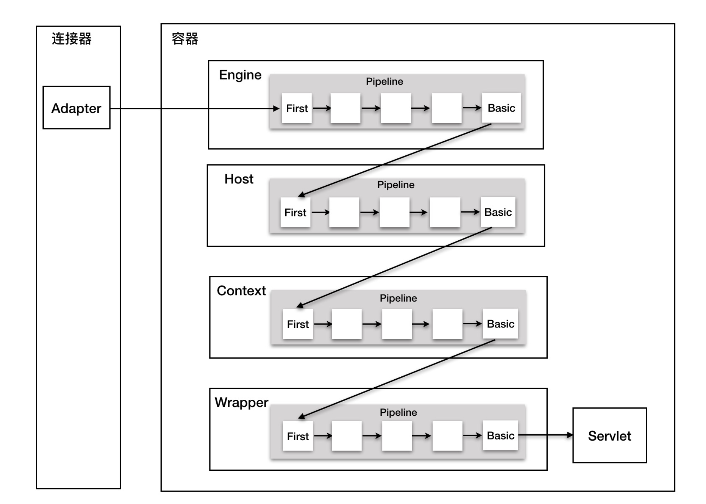

## Introduction

Connector 负责:
- 网络通信
- 协议解析
- Servlet req/resp 与 Tomcat req/resp的转换

三个组件负责以上职能, 分别是 EndPoint、Processor 和 Adapter。
EndPoint 负责提供字节流给 Processor，Processor 负责提供 Tomcat Request 对象给 Adapter，Adapter 负责提供 ServletRequest 对象给容器

本页按 **Tomcat 11.0.26** 重写，源码位置标注相对 `tomcat-coyote-11.0.26` 与 `tomcat-catalina-11.0.26`。相对 9.0/10.1 的实质改动集中在六处，读下面的代码时按这几条对照：

| 变化 | 11.0.26 的现实 | 出处 |
| :-- | :-- | :-- |
| endpoint 继承链 | `NioEndpoint extends AbstractNetworkChannelEndpoint<NioChannel, SocketChannel>`，`AbstractJsseEndpoint` 已消失 | `NioEndpoint.java:73` |
| 连接上限默认值 | `maxConnections = 8 * 1024`（10000 是已删除的 APR connector 的默认值） | `AbstractEndpoint.java:1016` |
| Poller 线程 | 线程名 `-Poller`（不再是 `-ClientPoller`），优先级用独立的 `pollerThreadPriority` | `NioEndpoint.java:541` |
| `SelectorPool` | **整体删除**，`bind()` 不再 open 它 | 全树零命中 |
| key 取消的所有权 | `Poller.cancelledKey()` 已不存在，所有取消路径改为 `socketWrapper.close()` | `NioEndpoint.java:1129` 起 |
| native 后端 | APR connector 移除，只剩 JSSE 与 OpenSSL 两条 TLS 路线 | 见 [TLS](/docs/CS/Framework/Tomcat/TLS.md) |

另外 `SecurityManager` 支持在 11 被彻底移除，旧版 `ApplicationFilterFactory` / `ApplicationFilterChain` 里成段的 `Globals.IS_SECURITY_ENABLED` 与 `AccessController.doPrivileged` 分支都不存在了——这直接改变了 FilterChain 的复用策略，见 [createFilterChain](/docs/CS/Framework/Tomcat/Connector.md?id=createfilterchain)。

## ProtocolHandler

I/O模型很多都与应用层协议解析在一起, 设置ProtocolHandler, 子类实现各种应用层协议与I/O的组合

- org.apache.coyote.http11.Http11NioProtocol
- org.apache.coyote.http11.Http11Nio2Protocol
- org.apache.coyote.ajp.AjpNioProtocol
- org.apache.coyote.ajp.AjpNio2Protocol

`ProtocolHandler` 在 11 是接口，工厂方法是接口上的 `static` 方法（`coyote/ProtocolHandler.java:237`）。默认映射与 9.x 一致：

```java
// Connector.java:91, :101, :106
public Connector() {
    this("HTTP/1.1");
}

public Connector(String protocol) {
    // ...
    p = ProtocolHandler.create(protocol);
}

// ProtocolHandler.java:237-252
static ProtocolHandler create(String protocol)
        throws ClassNotFoundException, InstantiationException, IllegalAccessException, IllegalArgumentException,
        InvocationTargetException, NoSuchMethodException, SecurityException {
    if (protocol == null || "HTTP/1.1".equals(protocol) ||
            org.apache.coyote.http11.Http11NioProtocol.class.getName().equals(protocol)) {
        return new org.apache.coyote.http11.Http11NioProtocol();
    } else if ("AJP/1.3".equals(protocol) ||
            org.apache.coyote.ajp.AjpNioProtocol.class.getName().equals(protocol)) {
        return new org.apache.coyote.ajp.AjpNioProtocol();
    } else {
        // Instantiate protocol handler
        Class<?> clazz = Class.forName(protocol);
        return (ProtocolHandler) clazz.getConstructor().newInstance();
    }
}
```

值得注意的不是这个 `if` 链，而是它**只认两个协议名**：`HTTP/1.1` 与 `AJP/1.3`。HTTP/2 不在这里——它是通过 `<UpgradeProtocol>` 挂在 HTTP/1.1 这个 handler 之上的，不是一个独立的 `protocol` 取值，见 [HTTP2](/docs/CS/Framework/Tomcat/HTTP2.md)。其余情况一律 `Class.forName(protocol)`，所以 `protocol` 属性填的是**实现类全名**，这也是自定义 endpoint 的接入点。

default use HTTP1.1 NioEndpoint

```java
// Http11NioProtocol.java:36-38
public Http11NioProtocol() {
    this(new NioEndpoint());
}
```

无参构造委托给 `this(Endpoint)`，因此内嵌使用时直接传入别的 endpoint 实例就能换 I/O 模型，不必改协议名。

### NioEndPoint

NIO tailored thread pool, providing the following services:

1. Socket acceptor thread, default 1, accept new Channel then turn to Poller
2. Socket poller thread, default 1, use Selector, get Ready Channel from Channel array，wrap a SocketProcessor to Executor
3. Worker threads pool call SocketProcessor.run(), `maxThreads` 默认 200、`minSpareThreads` 默认 10（`AbstractEndpoint.java:1475`、`:1435`）
4. `LimitLatch` 限制 `maxConnections`，默认 **8192**（`AbstractEndpoint.java:1016`）
5. `acceptCount`（backlog）默认 100（`AbstractEndpoint.java:1266`）

Start the NIO endpoint, creating acceptor, poller threads.

```java
// NioEndpoint.java:73
public class NioEndpoint extends AbstractNetworkChannelEndpoint<NioChannel,SocketChannel> {

// NioEndpoint.java:514-549
@Override
public void startInternal() throws Exception {

    if (!running) {
        running = true;
        paused = false;

        if (socketProperties.getProcessorCache() != 0) {
            processorCache =
                    new SynchronizedStack<>(SynchronizedStack.DEFAULT_SIZE, socketProperties.getProcessorCache());
        }
        if (socketProperties.getEventCache() != 0) {
            eventCache = new SynchronizedStack<>(SynchronizedStack.DEFAULT_SIZE, socketProperties.getEventCache());
        }
        int actualBufferPool = socketProperties.getActualBufferPool(isSSLEnabled() ? getSniParseLimit() * 2 : 0);
        if (actualBufferPool != 0) {
            nioChannels = new SynchronizedStack<>(SynchronizedStack.DEFAULT_SIZE, actualBufferPool);
        }

        // Create worker collection
        if (getExecutor() == null) {
            createExecutor();
        }

        initializeConnectionLatch();

        // Start poller thread
        poller = new Poller();
        Thread pollerThread = new Thread(poller, getName() + "-Poller");
        pollerThread.setPriority(pollerThreadPriority);
        pollerThread.setDaemon(true);
        pollerThread.start();

        startAcceptorThread();
    }
}
```

三个和 9.x 不同的点都在这里。

**其一，NIO channel 池的大小不再由 `bufferPool` 直接决定**，而是走 `getActualBufferPool(bufferOverhead)`，且 SSL 开启时额外预留 `sniParseLimit * 2`（默认 `64 * 1024 * 2`，`AbstractEndpoint.java:357`）——因为 SNI 解析要为每个连接缓冲 ClientHello。这个方法的实现里藏着一个容易踩的行为：

```java
// SocketProperties.java
public int getActualBufferPool(int bufferOverhead) {
    if (bufferPool != -2) {
        return bufferPool;
    } else {
        // ...
        if (actualBufferPoolSize == -2) {
            long maxMemory = Runtime.getRuntime().maxMemory();
            if (maxMemory > Integer.MAX_VALUE) {
                actualBufferPoolSize = maxMemory / 32;
            } else {
                return 0;
            }
        }
        int bufSize = appReadBufSize + appWriteBufSize + bufferOverhead;
        // ...
        return (int) (actualBufferPoolSize / bufSize);
    }
}
```

`bufferPool` 的哨兵值 `-2` 表示「按堆自动算」：堆大于 2 GiB 时取 `maxMemory / 32` 再除以单连接缓冲开销；**堆不大于 2 GiB 时直接返回 0，也就是池不启用**。所以小堆容器里看不到 channel 复用不是配置错了，而是默认策略如此。另外 `directBuffer` 与 `directSslBuffer` 默认都是 `false`（`SocketProperties.java:64`、`:69`），网络缓冲默认在堆上。

**其二，Poller 线程名与优先级**。名字是 `getName() + "-Poller"`；优先级用 `pollerThreadPriority` 而非 connector 的 `threadPriority`——调 `threadPriority` 只影响工作线程，不影响 Poller。排障时 jstack 里的线程名因此是 `http-nio-8080-Poller`、`http-nio-8080-Acceptor`、`http-nio-8080-exec-N`，若开了虚拟线程则是 `http-nio-8080-virt-N`（见 [threads](/docs/CS/Framework/Tomcat/threads.md)）。

**其三，`startAcceptorThread()` 上提到了基类**（`AbstractEndpoint.java:2296`），不再各 endpoint 各写一份：

```java
protected void startAcceptorThread() {
    acceptor = new Acceptor<>(this);
    String threadName = getName() + "-Acceptor";
    acceptor.setThreadName(threadName);
    Thread t = new Thread(acceptor, threadName);
    t.setPriority(getAcceptorThreadPriority());
    t.setDaemon(getDaemon());
    t.start();
}
```

##### bind

`bind()` 只剩三步，**旧版第四行 `selectorPool.open(getName())` 随 `SelectorPool` 一起删除了**：

```java
// NioEndpoint.java
public void bind() throws Exception {
    initServerSocket();

    setStopLatch(new CountDownLatch(1));

    // Initialize SSL if needed
    initialiseSsl();
}
```

`initServerSocket()` 的分支持续膨胀成三条，且**判断顺序反过来了**：9.x 先走常规路径，11 先判 `getUseInheritedChannel()`：

```java
protected void initServerSocket() throws Exception {
    if (getUseInheritedChannel()) {
        // Retrieve the channel provided by the OS
        Channel ic = System.inheritedChannel();
        if (ic instanceof ServerSocketChannel) {
            serverSock = (ServerSocketChannel) ic;
        }
        if (serverSock == null) {
            throw new IllegalArgumentException(sm.getString("endpoint.init.bind.inherited"));
        }
    } else if (getUnixDomainSocketPath() != null) {
        // ... 一大段父目录权限与属主校验（注释明写是为避免 TOCTOU）
        SocketAddress sa = UnixDomainSocketAddress.of(getUnixDomainSocketPath());
        serverSock = ServerSocketChannel.open(StandardProtocolFamily.UNIX);
        serverSock.bind(sa, getAcceptCount());
        // ... 按 PosixFilePermissions 设置 socket 文件权限
    } else {
        serverSock = ServerSocketChannel.open();
        socketProperties.setProperties(serverSock.socket());
        InetSocketAddress addr = new InetSocketAddress(getAddress(), getPortWithOffset());
        serverSock.bind(addr, getAcceptCount());
    }
    serverSock.configureBlocking(true); // mimic APR behavior
}
```

中间那条 **Unix Domain Socket** 分支是 10.1/11 新增的实质能力：`ServerSocketChannel.open(StandardProtocolFamily.UNIX)` 配 `UnixDomainSocketAddress`，附带父目录权限、属主与 socket 文件权限的完整校验。这是「Tomcat 与同 Pod 的 nginx 之间走 UDS 而非 TCP」能成立的原因；相应地 `setSocketOptions()` 对 UDS 会跳过 TCP 选项设置。

末行注释 `// mimic APR behavior` 是历史痕迹：APR 后端已经没了，但「监听 socket 必须阻塞」的语义保留下来——accept 阻塞在 Acceptor 线程上，事件驱动交给 Poller。

#### LimitLatch

LimitLatch like [CountDownLatch](/docs/CS/Java/JDK/Concurrency/CountDownLatch.md) extends [AQS](/docs/CS/Java/JDK/Concurrency/AQS.md)

```java
// AbstractEndpoint.java:77, :1016
public abstract class AbstractEndpoint<S, U> {
    private int maxConnections = 8 * 1024;

    public void setMaxConnections(int maxCon) {
        this.maxConnections = maxCon;
        LimitLatch latch = this.connectionLimitLatch;
        if (latch != null) {
            // Update the latch that enforces this
            if (maxCon == -1) {
                releaseConnectionLatch();
            } else {
                latch.setLimit(maxCon);
            }
        } else if (maxCon > 0) {
            initializeConnectionLatch();
        }
    }

    protected LimitLatch initializeConnectionLatch() {
        if (maxConnections == -1) {
            return null;
        }
        if (connectionLimitLatch == null) {
            connectionLimitLatch = new LimitLatch(getMaxConnections());
        }
        return connectionLimitLatch;
    }
}
```

Shared latch that allows the latch to be acquired a limited number of times after which all subsequent requests to acquire the latch will be placed in a FIFO queue until one of the shares is returned.

```java
public class LimitLatch {

    public LimitLatch(long limit) {
        this.limit = limit;
        this.count = new AtomicLong(0);
        this.sync = new Sync();
    }
}
```

Sync extends AQS

countUpOrAwait

```java
// AbstractEndpoint.java:2407
protected void countUpOrAwaitConnection() throws InterruptedException {
    if (maxConnections==-1) {
        return;
    }
    LimitLatch latch = connectionLimitLatch;
    if (latch!=null) {
        latch.countUpOrAwait();
    }
}

public void countUpOrAwait() throws InterruptedException {
    sync.acquireSharedInterruptibly(1);
}


@Override
protected int tryAcquireShared(int ignored) {
    long newCount = count.incrementAndGet();
    if (!released && newCount > limit) {
        // Limit exceeded
        count.decrementAndGet();
        return -1;
    } else {
        return 1;
    }
}
```

一个容易误解的点：`maxConnections` 限制的是**已接受的连接数**，不是并发处理数。超限时 Acceptor 不是拒绝连接，而是**阻塞在 latch 上不再 accept**，于是新连接堆在 backlog（`acceptCount`，默认 100）里，最终由内核拒绝。所以「连接被拒」的现场通常是 `ss` 里 `Recv-Q` 打满，而不是 Tomcat 日志里有异常。开虚拟线程也不改变这一层——`useVirtualThreads`（`AbstractEndpoint.java:1094`）只换工作线程的实现（`createExecutor()` `:1934`）。

##### countDownConnection

```java
protected long countDownConnection() {
        if (maxConnections==-1) {
            return -1;
        }
        LimitLatch latch = connectionLimitLatch;
        if (latch!=null) {
            return latch.countDown();
        } else {
            return -1;
        }
    }


public long countDown() {
    sync.releaseShared(0);
    return getCount();
}

@Override
protected boolean tryReleaseShared(int arg) {
    count.decrementAndGet();
    return true;
}
```

### Acceptor

call in Endpoint

- if we have reached max connections, wait
- Accept the next incoming connection from the server socket
- [setSocketOptions()](/docs/CS/Framework/Tomcat/Connector.md?id=setsocketoptions) will hand the socket off to an appropriate processor if successful

`Acceptor` 在 11 是独立的泛型类 `org.apache.tomcat.util.net.Acceptor<U>`（`Acceptor.java:32`），不再嵌在 endpoint 里。它的暂停循环被重写过，是本页最值得读的改动之一：

```java
// Acceptor.java
@Override
public void run() {

    int errorDelay = 0;
    long pauseStart = 0;

    try {
        // Loop until we receive a shutdown command
        while (!stopCalled) {

            // Loop if endpoint is paused.
            // There are two likely scenarios here.
            // The first scenario is that Tomcat is shutting down. In this
            // case - and particularly for the unit tests - we want to exit
            // this loop as quickly as possible. The second scenario is a
            // genuine pause of the connector. In this case we want to avoid
            // excessive CPU usage.
            // Therefore, we start with a tight loop but if there isn't a
            // rapid transition to stop then sleeps are introduced.
            // < 1ms - tight loop
            // 1ms to 10ms - 1ms sleep
            // > 10ms - 10ms sleep
            while (endpoint.isPaused() && !stopCalled) {
                if (state != AcceptorState.PAUSED) {
                    pauseStart = System.nanoTime();
                    // Entered pause state
                    state = AcceptorState.PAUSED;
                }
                if ((System.nanoTime() - pauseStart) > 1_000_000) {
                    // Paused for more than 1ms
                    try {
                        if ((System.nanoTime() - pauseStart) > 10_000_000) {
                            Thread.sleep(10);
                        } else {
                            Thread.sleep(1);
                        }
                    } catch (InterruptedException e) {
                        // Ignore
                    }
                }
            }

            if (stopCalled) {
                break;
            }
            state = AcceptorState.RUNNING;

            try {
                // if we have reached max connections, wait
                endpoint.countUpOrAwaitConnection();

                // Endpoint might have been paused while waiting for latch
                // If that is the case, don't accept new connections
                if (endpoint.isPaused()) {
                    continue;
                }

                U socket;
                try {
                    // Accept the next incoming connection from the server
                    // socket
                    socket = endpoint.serverSocketAccept();
                } catch (Exception e) {
                    // We didn't get a socket
                    endpoint.countDownConnection();
                    if (endpoint.isRunning()) {
                        // Introduce delay if necessary
                        errorDelay = handleExceptionWithDelay(errorDelay);
                        // re-throw
                        throw e;
                    } else {
                        break;
                    }
                }
                // Successful accept, reset the error delay
                errorDelay = 0;

                // Configure the socket
                if (!stopCalled && !endpoint.isPaused()) {
                    // setSocketOptions() will hand the socket off to
                    // an appropriate processor if successful
                    if (!endpoint.setSocketOptions(socket)) {
                        endpoint.closeSocket(socket);
                    }
                } else {
                    endpoint.destroySocket(socket);
                }
            } catch (Throwable t) {
                ExceptionUtils.handleThrowable(t);
                log.error(sm.getString("endpoint.accept.fail"), t);
            }
        }
    } finally {
        stopLatch.countDown();
    }
    state = AcceptorState.ENDED;
}
```

**为什么暂停要分三档**：9.x 是固定 `Thread.sleep(50)`，代价是停机时最多白等 50ms（单测里尤其明显），收益是暂停期间不烧 CPU。11 的做法是 1ms 以内空转（保证「pause 后立刻 stop」几乎零延迟），1ms~10ms 用 1ms 睡眠，超过 10ms 才用 10ms 睡眠——同时满足「摘流后马上退出」和「长时间挂起不烧 CPU」。

另一处删除：9.x 在 `catch (Throwable t)` 里有一段 APR 专属判断（`t instanceof Error && e.getError() == 233`，为 HP-UX 上的 accept 假错误降级别，bug 50273）。APR 移除后这段连带消失，现在只剩一行 `log.error`。

摘流与停机的完整路径（`pause()`、`resume()`、`closeServerSocketGraceful()`、`awaitConnectionsClose()`、`Acceptor.stopMillis()`）见 [Tomcat 的故障处理一节](/docs/CS/Framework/Tomcat/Tomcat.md?id=fault-handling)。

### setSocketOptions

Process the specified connection.

call [register](/docs/CS/Framework/Tomcat/Connector.md?id=register)

```java
// NioEndpoint.java
@Override
protected boolean setSocketOptions(SocketChannel socket) {
    NioSocketWrapper socketWrapper = null;
    try {
        // Allocate channel and wrapper
        NioChannel channel = null;
        if (nioChannels != null) {
            channel = nioChannels.pop();
        }
        if (channel == null) {
            SocketBufferHandler bufhandler = new SocketBufferHandler(socketProperties.getAppReadBufSize(),
                    socketProperties.getAppWriteBufSize(), socketProperties.getDirectBuffer());
            channel = createChannel(bufhandler);
        }
        NioSocketWrapper newWrapper = new NioSocketWrapper(channel, this);
        channel.reset(socket, newWrapper);
        connections.put(socket, newWrapper);
        socketWrapper = newWrapper;

        // Set socket properties
        // Disable blocking, polling will be used
        socket.configureBlocking(false);
        if (getUnixDomainSocketPath() == null) {
            socketProperties.setProperties(socket.socket());
        }

        socketWrapper.setReadTimeout(getConnectionTimeout());
        socketWrapper.setWriteTimeout(getConnectionTimeout());
        socketWrapper.setKeepAliveLeft(NioEndpoint.this.getMaxKeepAliveRequests());
        poller.register(socketWrapper);
        return true;
    } catch (Throwable t) {
        ExceptionUtils.handleThrowable(t);
        try {
            log.error(sm.getString("endpoint.socketOptionsError"), t);
        } catch (Throwable tt) {
            ExceptionUtils.handleThrowable(tt);
        }
        if (socketWrapper == null) {
            destroySocket(socket);
        }
    }
    // Tell to close the socket if needed
    return false;
}
```

与 9.x 唯一的结构差别：`if (isSSLEnabled()) new SecureNioChannel(...) else new NioChannel(...)` 被抽成可覆写的工厂方法。

```java
// NioEndpoint.java:828-833
@Override
protected NioChannel createChannel(SocketBufferHandler buffer) {
    if (isSSLEnabled()) {
        return new SecureNioChannel(buffer, this);
    }
    return new NioChannel(buffer);
}
```

`@Override` 说明它声明在 `AbstractNetworkChannelEndpoint` 上，是模板方法——**换 TLS 实现不再需要改 endpoint 的构造逻辑**。这与下面的 `createPollerEvent()` 是同一套设计：把「每种 I/O 模型各自决定怎么造对象」的分支收敛成工厂钩子。

`getUnixDomainSocketPath() == null` 才设 TCP 选项，因为 `socketProperties.setProperties()` 对 UNIX channel 无意义。

### register

Registers a newly created socket with the poller.

events is a SynchronizedQueue

```java
// NioEndpoint.java:1052-1056  （Poller 的方法，注意已不是 endpoint 的方法）
public void register(final NioSocketWrapper socketWrapper) {
    socketWrapper.interestOps(SelectionKey.OP_READ);// this is what OP_REGISTER turns into.
    PollerEvent pollerEvent = createPollerEvent(socketWrapper, OP_REGISTER);
    addEvent(pollerEvent);
}

// NioEndpoint.java:952-957
private void addEvent(PollerEvent event) {
    events.offer(event);
    if (wakeupCounter.incrementAndGet() == 0) {
        selector.wakeup();
    }
}
```

两个变化：

1. `register()`、`addEvent()` 与 `events` 队列现在都属于 **`Poller` 内部类**（`NioEndpoint.java:901`、`:904`），不再是 endpoint 字段。endpoint 侧只留 `poller.register(socketWrapper)` 一个调用点。
2. 事件对象的取用从「内联 `eventCache.pop()` + `new PollerEvent(...)` + `reset(...)`」抽成 `createPollerEvent(socketWrapper, interestOps)`（`:959`），归还统一在 `events()` 末尾做。`OP_REGISTER` 常量在 `:93`（`0x100`），它是 JDK `SelectionKey` 兴趣位之外的自定义标记。

`wakeupCounter` 值得单独说明，这是 JDK NIO 老坑的标准解法：`Selector.wakeup()` 会给下一次 `select()` 留下「立即返回」的标记，每次都调就会让 Poller 空转。这里用 `incrementAndGet() == 0` 判断「在我之前有没有人已经请求过唤醒」，只有从 0 变 1 的那次真调 `wakeup()`；`run()` 里则用 `getAndSet(-1) > 0` 把状态切到「已知有活」并改用 `selectNow()`。

### SynchronizedQueue

This is intended as a (mostly) GC-free alternative to [java.util.concurrent.ConcurrentLinkedQueue](/docs/CS/Java/JDK/Collection/Queue.md?id=concurrentlinkedqueue)
when the requirement is to create an unbounded queue with no requirement to shrink the queue.
The aim is to provide the bare minimum of required functionality as quickly as possible with minimum garbage.

⚠️ **包位置变了**：11 里它是 `org.apache.tomcat.util.collections.SynchronizedQueue`（`tomcat-util` 模块，`:26`），不再属于 `org.apache.tomcat.util.net`——和 `SynchronizedStack` 搬到了一起。实现本身没变（环形数组 + `synchronized` 的 `offer`/`poll`/`size`/`clear`，`offer` `:76`、`poll` `:96`、`expand` `:115`）：

```java
public class SynchronizedQueue<T> {

    public static final int DEFAULT_SIZE = 128;

    private Object[] queue;
    private int size;
    private int insert = 0;
    private int remove = 0;

    public SynchronizedQueue() {
        this(DEFAULT_SIZE);
    }

    public SynchronizedQueue(int initialSize) {
        queue = new Object[initialSize];
        size = initialSize;
    }

    public synchronized boolean offer(T t) {
        queue[insert++] = t;

        // Wrap
        if (insert == size) {
            insert = 0;
        }

        if (insert == remove) {
            expand();
        }
        return true;
    }

    public synchronized T poll() {
        if (insert == remove) {
            // empty
            return null;
        }

        @SuppressWarnings("unchecked")
        T result = (T) queue[remove];
        queue[remove] = null;
        remove++;

        // Wrap
        if (remove == size) {
            remove = 0;
        }

        return result;
    }

    private void expand() {
        int newSize = size * 2;
        Object[] newQueue = new Object[newSize];

        System.arraycopy(queue, insert, newQueue, 0, size - insert);
        System.arraycopy(queue, 0, newQueue, size - insert, insert);

        insert = size;
        remove = 0;
        queue = newQueue;
        size = newSize;
    }
}
```

与 `SynchronizedStack` 对照着记最省事，两者是同一套取舍（`synchronized` + 数组，不用 CAS）但语义不同：**队列只增不减、`offer` 恒返回 true、`poll` 空时返回 null**；栈有 `limit`，`push` 满了会返回 false。所以事件队列的峰值会被永久记住，而 processor 缓存可以被限住——后者见 [memory](/docs/CS/Framework/Tomcat/memory.md)。

`expand()` 里那两次 `arraycopy` 是环形缓冲展平的经典写法：先把 `insert` 之后的段搬到新数组开头，再把 `0..insert` 段接在后面，于是新数组里数据连续、`insert = size`（旧容量）、`remove = 0`。

## Poller

call in NioEndpoint

> [!TIP]
>
> 在 Nio2Endpoint 即异步 IO 模式下没有 Poller，Selector 的工作由 Kernel 完成

```java
// NioEndpoint.java:901-921
public class Poller implements Runnable {

    private final Selector selector;
    private final SynchronizedQueue<PollerEvent> events = new SynchronizedQueue<>();

    private volatile boolean close = false;
    // Optimize expiration handling
    private long nextExpiration = 0;

    private final AtomicLong wakeupCounter = new AtomicLong(0);

    private volatile int keyCount = 0;

    public Poller() throws IOException {
        this.selector = Selector.open();
    }
}
```

`selector` 与 `wakeupCounter` 在 11 都加了 `final`——它们从构造起就不变，可变状态收敛到 `close`/`keyCount` 两个 `volatile` 上。

还有一个容易混淆的点：字段 `keyCount` 与方法 `getKeyCount()` **不是一回事**。

```java
// NioEndpoint.java:923-931
public int getKeyCount() {
    return selector.keys().size();
}
```

字段是「本轮 `select()` 返回的就绪数」，方法是「注册在该 selector 上的 key 总数」（≈ 连接数）。JMX 里看到的连接数走的是后者。

### run

The background thread that adds sockets to the Poller,
checks the poller for triggered events and hands the associated socket off to an appropriate [processor](/docs/CS/Framework/Tomcat/Connector.md?id=socketprocessor) as events occur.

```java
// NioEndpoint.java: Poller.run()
@Override
public void run() {
    // Loop until destroy() is called
    while (true) {

        boolean hasEvents = false;

        try {
            if (!close) {
                hasEvents = events();
                if (wakeupCounter.getAndSet(-1) > 0) {
                    // If we are here, means we have other stuff to do
                    // Do a non-blocking select
                    keyCount = selector.selectNow();
                } else {
                    keyCount = selector.select(selectorTimeout);
                }
                wakeupCounter.set(0);
            }
            if (close) {
                events();
                timeout(0, false);
                try {
                    selector.close();
                } catch (IOException ioe) {
                    log.error(sm.getString("endpoint.nio.selectorCloseFail"), ioe);
                }
                break;
            }
            // Either we timed out or we woke up, process events first
            if (keyCount == 0) {
                // Non-shorrt-circuit OR since events() always needs to run here.
                hasEvents = (hasEvents | events());
            }
        } catch (Throwable x) {
            ExceptionUtils.handleThrowable(x);
            log.error(sm.getString("endpoint.nio.selectorLoopError"), x);
            continue;
        }

        Iterator<SelectionKey> iterator =
                keyCount > 0 ? selector.selectedKeys().iterator() : null;
        // Walk through the collection of ready keys and dispatch
        // any active event.
        while (iterator != null && iterator.hasNext()) {
            SelectionKey sk = iterator.next();
            iterator.remove();
            NioSocketWrapper socketWrapper = (NioSocketWrapper) sk.attachment();
            // Attachment may be null if another thread has called
            // cancelledKey()
            if (socketWrapper != null) {
                processKey(sk, socketWrapper);
            }
        }

        // Process timeouts
        timeout(keyCount, hasEvents);
    }

    getStopLatch().countDown();
}
```

循环骨架与 9.x 相同，三处细节值得注意：

- `selectorTimeout` 默认 **1000** ms（`NioEndpoint.java:316`），所以这个线程每秒至少醒一次去跑 `timeout()`——超时清理不靠事件驱动，靠这个兜底轮询。
- `hasEvents = (hasEvents | events())` 用的是**非短路或**，注释原文写着 `Non-shorrt-circuit OR since events() always needs to run here.`（源码里 `shorrt` 是真实拼写错误）。若改成 `||`，`hasEvents` 为 true 时 `events()` 就不会被调用，积压事件不会被消费。
- 注释里「another thread has called `cancelledKey()`」是**过时注释**：该方法在 11 已不存在，现在等价路径是 `NioSocketWrapper.close()`。这类残留注释是本库坚持回源核对的理由之一。

#### events

Processes events in the event queue of the Poller.

```java
// NioEndpoint.java:993-1043
public boolean events() {
    boolean result = false;

    PollerEvent pe;
    for (int i = 0, size = events.size(); i < size && (pe = events.poll()) != null; i++) {
        result = true;
        NioSocketWrapper socketWrapper = pe.getSocketWrapper();
        SocketChannel sc = socketWrapper.getSocket().getIOChannel();
        int interestOps = pe.getInterestOps();
        if (sc == null) {
            if (log.isDebugEnabled()) {
                log.debug(sm.getString("endpoint.nio.nullSocketChannel"));
            }
            socketWrapper.close();
        } else if (interestOps == OP_REGISTER) {
            try {
                sc.register(getSelector(), SelectionKey.OP_READ, socketWrapper);
            } catch (Exception e) {
                log.error(sm.getString("endpoint.nio.registerFail"), e);
            }
        } else {
            final SelectionKey key = sc.keyFor(getSelector());
            if (key == null) {
                // The key was cancelled (e.g. due to socket closure)
                // and removed from the selector while it was being
                // processed. Count down the connections at this point
                // since it won't have been counted down when the socket
                // closed.
                socketWrapper.close();
            } else {
                final NioSocketWrapper attachment = (NioSocketWrapper) key.attachment();
                if (attachment != null) {
                    // We are registering the key to start with, reset the fairness counter.
                    try {
                        int ops = key.interestOps() | interestOps;
                        attachment.interestOps(ops);
                        key.interestOps(ops);
                    } catch (CancelledKeyException ckx) {
                        socketWrapper.close();
                    }
                } else {
                    socketWrapper.close();
                }
            }
        }
        if (running && eventCache != null) {
            pe.reset();
            eventCache.push(pe);
        }
    }

    return result;
}
```

与 9.x 的四处差异，全部指向同一次重构：

1. 三处 `cancelledKey(key, socketWrapper)` 变成 `socketWrapper.close()`——**key 取消的所有权从 Poller 移交给 SocketWrapper**。
2. `nullSocketChannel` 从 `log.warn` 降级为 `log.debug`（且带 `isDebugEnabled` 保护）：这是连接被客户端提前关闭的常态路径，不该刷 WARN。
3. 归还缓存的条件从 `running && !paused && eventCache != null` 变成 `running && eventCache != null`——**`paused` 判断去掉了**。暂停期间事件仍会归还缓存，这在旧版会导致暂停时事件对象改为每次新建。
4. `PollerEvent pe;` 不再赋初值 null，因为循环条件已保证非空。

#### processKey

```java
// NioEndpoint.java:1129-1183
protected void processKey(SelectionKey sk, NioSocketWrapper socketWrapper) {
    try {
        if (close) {
            socketWrapper.close();
        } else if (sk.isValid()) {
            if (sk.isReadable() || sk.isWritable()) {
                if (socketWrapper.getSendfileData() != null) {
                    processSendfile(sk, socketWrapper, false);
                } else {
                    unreg(sk, socketWrapper, sk.readyOps());
                    boolean closeSocket = false;
                    // Read goes before write
                    if (sk.isReadable()) {
                        if (socketWrapper.readOperation != null) {
                            if (!socketWrapper.readOperation.process()) {
                                closeSocket = true;
                            }
                        } else if (socketWrapper.readBlocking) {
                            synchronized (socketWrapper.readLock) {
                                socketWrapper.readBlocking = false;
                                socketWrapper.readLock.notify();
                            }
                        } else if (!processSocket(socketWrapper, SocketEvent.OPEN_READ, true)) {
                            closeSocket = true;
                        }
                    }
                    if (!closeSocket && sk.isWritable()) {
                        if (socketWrapper.writeOperation != null) {
                            if (!socketWrapper.writeOperation.process()) {
                                closeSocket = true;
                            }
                        } else if (socketWrapper.writeBlocking) {
                            synchronized (socketWrapper.writeLock) {
                                socketWrapper.writeBlocking = false;
                                socketWrapper.writeLock.notify();
                            }
                        } else if (!processSocket(socketWrapper, SocketEvent.OPEN_WRITE, true)) {
                            closeSocket = true;
                        }
                    }
                    if (closeSocket) {
                        socketWrapper.close();
                    }
                }
            }
        } else {
            // Invalid key
            socketWrapper.close();
        }
    } catch (CancelledKeyException ckx) {
        socketWrapper.close();
    } catch (Throwable t) {
        ExceptionUtils.handleThrowable(t);
        log.error(sm.getString("endpoint.nio.keyProcessingError"), t);
    }
}
```

这个方法是理解 Tomcat NIO 调度策略的关键，三层优先级很清楚：

1. **`readOperation` / `writeOperation` 非空优先**——这是异步读写（`ReadListener` / `WriteListener`）注册的挂起操作，由 Poller 线程**直接执行**，不进线程池。
2. **`readBlocking` / `writeBlocking` 为真时只做 `notify`**——工作线程正阻塞等在锁上等资源就绪，唤醒它即可。
3. 两者都没有才 `processSocket(..., dispatch=true)`，把 `SocketProcessor` 丢进工作线程池。

`unreg(sk, socketWrapper, sk.readyOps())` 在处理前先取消兴趣位，配合「处理完后由 processor 重新注册兴趣」的模式，避免同一事件被重复投递。`// Read goes before write` 是规范语义：一次迭代里读优先于写，保证请求体先被消费。

所有 `cancelledKey(...)` 已替换为 `socketWrapper.close()`，与 `events()` 的变化一致。

#### processSocket

Process the given SocketWrapper with the given status.
Used to trigger processing as if the Poller (for those endpoints that have one) selected the socket.

```java
// AbstractEndpoint.java:2098-2130
public boolean processSocket(SocketWrapperBase<S> socketWrapper,
                             SocketEvent event, boolean dispatch) {
    try {
        if (socketWrapper == null) {
            return false;
        }
        SocketProcessorBase<S> sc = null;
        if (processorCache != null) {
            sc = processorCache.pop();
        }
        if (sc == null) {
            sc = createSocketProcessor(socketWrapper, event);
        } else {
            sc.reset(socketWrapper, event);
        }
        Executor executor = getExecutor();
        if (dispatch && executor != null) {
            executor.execute(sc);
        } else {
            sc.run();
        }
    } catch (RejectedExecutionException ree) {
        getLog().warn(sm.getString("endpoint.executor.fail", socketWrapper), ree);
        return false;
    } catch (Throwable t) {
        ExceptionUtils.handleThrowable(t);
        // This means we got an OOM or similar creating a thread, or that
        // the pool and its queue are full
        getLog().error(sm.getString("endpoint.process.fail"), t);
        return false;
    }
    return true;
}
```

这一段在 11 与 9.x 基本一致。两个排障要点：`RejectedExecutionException` 只打 **WARN** 并返回 false，调用方 `processKey` 会因此 `closeSocket`——所以「线程池满导致连接被直接关掉」在日志里是一条 warn，而不是 error；而 `sc.run()` 这条非 dispatch 路径是**在 Poller 线程上同步执行**的，任何用 `dispatch=false` 的调用点都要保证不阻塞。

#### SocketProcessor

`SocketProcessor` is the equivalent of the Worker, but will simply use in an external Executor thread pool.

```java
// NioEndpoint.java:2139-2200
protected class SocketProcessor extends SocketProcessorBase<NioChannel> {

    public SocketProcessor(SocketWrapperBase<NioChannel> socketWrapper, SocketEvent event) {
        super(socketWrapper, event);
    }

    @Override
    protected void doRun() {
        /*
         * Do not cache and re-use the value of socketWrapper.getSocket() in this method. If the socket closes the
         * value will be updated to CLOSED_NIO_CHANNEL and the previous value potentially re-used for a new
         * connection. That can result in a stale cached value which in turn can result in unintentionally closing
         * currently active connections.
         */
        Poller poller = NioEndpoint.this.poller;
        if (poller == null) {
            socketWrapper.close();
            return;
        }

        try {
            int handshake;
            try {
                if (socketWrapper.getSocket().isHandshakeComplete()) {
                    // No TLS handshaking required. Let the handler
                    // process this socket / event combination.
                    handshake = 0;
                } else if (event == SocketEvent.STOP || event == SocketEvent.DISCONNECT ||
                        event == SocketEvent.ERROR) {
                    // Unable to complete the TLS handshake. Treat it as
                    // if the handshake failed.
                    handshake = -1;
                } else {
                    handshake = socketWrapper.getSocket().handshake(event == SocketEvent.OPEN_READ,
                            event == SocketEvent.OPEN_WRITE);
                    // ... 握手完成后状态必然是 OPEN_READ
                    event = SocketEvent.OPEN_READ;
                }
            } catch (IOException ioe) {
                handshake = -1;
                if (logHandshake.isDebugEnabled()) {
                    logHandshake.debug(sm.getString("endpoint.err.handshake", socketWrapper.getRemoteAddr(),
                            Integer.toString(socketWrapper.getRemotePort())), ioe);
                }
            } catch (CancelledKeyException ckx) {
                handshake = -1;
            }
```

Process the request from this socket, call `AbstractProtocol.process()` -> [Processor.process()](/docs/CS/Framework/Tomcat/Connector.md?id=processor)

```java
            if (handshake == 0) {
                SocketState state;
                // Process the request from this socket
                state = getHandler().process(socketWrapper,
                        Objects.requireNonNullElse(event, SocketEvent.OPEN_READ));
                if (state == SocketState.CLOSED) {
                    socketWrapper.close();
                }
            } else if (handshake == -1) {
                getHandler().process(socketWrapper, SocketEvent.CONNECT_FAIL);
                socketWrapper.close();
            } else if (handshake == SelectionKey.OP_READ) {
                socketWrapper.registerReadInterest();
            } else if (handshake == SelectionKey.OP_WRITE) {
                socketWrapper.registerWriteInterest();
            }
        } catch (CancelledKeyException cx) {
            socketWrapper.close();
        } catch (VirtualMachineError vme) {
            ExceptionUtils.handleThrowable(vme);
        } catch (Throwable t) {
            log.error(sm.getString("endpoint.processing.fail"), t);
            socketWrapper.close();
        } finally {
            socketWrapper = null;
            event = null;
            // return to cache
            if (running && processorCache != null) {
                processorCache.push(this);
            }
        }
    }
}
```

四处变化：

1. **TLS 握手日志有了专属 logger**：`logHandshake = LogFactory.getLog(NioEndpoint.class.getName() + ".handshake")`（`:87`，另有 `.certificate` 的 `logCertificate` `:86`）。这意味着可以只把握手失败调成 debug 而不动全局级别——排 handshake 问题时单独开这个 logger 即可。
2. `IOException` 与 `CancelledKeyException` 的 catch **拆开了**（9.x 合并成一行），因为前者现在要打印远端地址与端口。
3. `event == null` 的分支被 `Objects.requireNonNullElse(event, SocketEvent.OPEN_READ)` 取代。
4. 所有 `poller.cancelledKey(getSelectionKey(), socketWrapper)` 变成 `socketWrapper.close()`；`finally` 的归还条件同样去掉了 `!paused`。

顶部的注释解释了为什么 `socketWrapper.getSocket()` 不能被缓存复用：socket 关闭后该值会被换成 `CLOSED_NIO_CHANNEL` 常量，而旧值可能被下一个连接复用，缓存会导致误关活跃连接。

## process

### Processor

Adapters for transform request/response

AbstractProcessorLight is a light-weight abstract processor implementation that is intended as a basis for all Processor implementations from the light-weight upgrade processors to the HTTP/AJP processors.

继承关系在 11 保持两段：`AbstractProcessorLight`（只负责状态与 `SocketState` 推进）→ `AbstractProcessor`（加上 request/response、action 分派、异步与升级状态）→ `Http11Processor` / `AjpProcessor`。拆开的动机是升级后的连接（WebSocket、HTTP/2）不需要完整的 request/response 语义，却也要能被 endpoint 以同一个 `Handler.process()` 接口驱动。

`AbstractProcessorLight.process()`
-> [Http11Processor.service()](/docs/CS/Framework/Tomcat/Connector.md?id=http11processor)
-> [CoyoteAdapter.service()](/docs/CS/Framework/Tomcat/Connector.md?id=adapter)
-> [StandardWrapperValve.invoke()](/docs/CS/Framework/Tomcat/Connector.md?id=invoke)

返回值 `SocketState` 定义在 `AbstractEndpoint.Handler` 接口内部（`AbstractEndpoint.java:102`），它是 endpoint 与 processor 之间唯一的协议：`OPEN` 表示连接可继续处理下一个请求、`LONG` 表示长处理（异步或请求体未读完）、`CLOSED` 表示关闭、`UPGRADING` 表示交给升级处理器、`SENDFILE` 表示还有 sendfile 未完。endpoint 侧只按这个枚举决定要不要 `socketWrapper.close()`，不理解 HTTP 语义。

#### Http11Processor

下面这段按 11.0.26 复核过，与源码逐行对应（`coyote/http11/Http11Processor.java:260` 起）。它是整个 connector 里最稳定的一块——keep-alive 循环、升级判定、异步让出、sendfile 收尾的结构多年未变：

```java
public class Http11Processor extends AbstractProcessor {
    @Override
    public SocketState service(SocketWrapperBase<?> socketWrapper)
            throws IOException {
        RequestInfo rp = request.getRequestProcessor();
        rp.setStage(org.apache.coyote.Constants.STAGE_PARSE);

        // Setting up the I/O
        setSocketWrapper(socketWrapper);

        // Flags
        keepAlive = true;
        openSocket = false;
        readComplete = true;
        boolean keptAlive = false;
        SendfileState sendfileState = SendfileState.DONE;

        while (!getErrorState().isError() && keepAlive && !isAsync() && upgradeToken == null &&
                sendfileState == SendfileState.DONE && !protocol.isPaused()) {

            // Parsing the request header
            try {
                if (!inputBuffer.parseRequestLine(keptAlive, protocol.getConnectionTimeout(),
                        protocol.getKeepAliveTimeout())) {
                    if (inputBuffer.getParsingRequestLinePhase() == -1) {
                        return SocketState.UPGRADING;
                    } else if (handleIncompleteRequestLineRead()) {
                        break;
                    }
                }

                // Process the Protocol component of the request line
                // Need to know if this is an HTTP 0.9 request before trying to
                // parse headers.
                prepareRequestProtocol();

                if (protocol.isPaused()) {
                    // 503 - Service unavailable
                    response.setStatus(503);
                    setErrorState(ErrorState.CLOSE_CLEAN, null);
                } else {
                    keptAlive = true;
                    // Set this every time in case limit has been changed via JMX
                    request.getMimeHeaders().setLimit(protocol.getMaxHeaderCount());
                    // Don't parse headers for HTTP/0.9
                    if (!http09 && !inputBuffer.parseHeaders()) {
                        // We've read part of the request, don't recycle it
                        // instead associate it with the socket
                        openSocket = true;
                        readComplete = false;
                        break;
                    }
                    if (!protocol.getDisableUploadTimeout()) {
                        socketWrapper.setReadTimeout(protocol.getConnectionUploadTimeout());
                    }
                }
            } catch (IOException e) {
                setErrorState(ErrorState.CLOSE_CONNECTION_NOW, e);
                break;
            } catch (Throwable t) {
                ExceptionUtils.handleThrowable(t);
                UserDataHelper.Mode logMode = userDataHelper.getNextMode();
                if (logMode != null) {
                    String message = sm.getString("http11processor.header.parse");
                    switch (logMode) {
                        case INFO_THEN_DEBUG:
                            message += sm.getString("http11processor.fallToDebug");
                            //$FALL-THROUGH$
                        case INFO:
                            log.info(message, t);
                            break;
                        case DEBUG:
                            log.debug(message, t);
                    }
                }
                // 400 - Bad Request
                response.setStatus(400);
                setErrorState(ErrorState.CLOSE_CLEAN, t);
            }
```

`while` 条件里的六个判据就是「这个线程还能继续吃下一个请求」的完整定义：没出错、keep-alive 未断、不是异步、没有待升级、sendfile 已排空、connector 未暂停。任何一个不满足就跳出循环去算返回值。

`UserDataHelper` 是解析异常刷屏的限流器：恶意/畸形请求会连续触发 400，第一档打 INFO，之后降到 DEBUG，一段时间后（`fallToDebug`）再回到 INFO。所以「日志里偶尔出现 header parse 异常」是设计行为，不是丢日志。

`request.getMimeHeaders().setLimit(protocol.getMaxHeaderCount())` 那行注释「Set this every time in case limit has been changed via JMX」值得留意：头部数量上限是**每请求重设**的，因为可以通过 JMX 热改，见 [Metrics 与 JMX](/docs/CS/Framework/Tomcat/Tomcat.md?id=metrics)。

Has an upgrade been requested?

```java
            // Has an upgrade been requested?
            if (isConnectionToken(request.getMimeHeaders(), "upgrade")) {
                // Check the protocol
                String requestedProtocol = request.getHeader("Upgrade");

                UpgradeProtocol upgradeProtocol = protocol.getUpgradeProtocol(requestedProtocol);
                if (upgradeProtocol != null) {
                    if (upgradeProtocol.accept(request)) {
                        // Create clone of request for upgraded protocol
                        Request upgradeRequest = null;
                        try {
                            upgradeRequest = cloneRequest(request);
                        } catch (ByteChunk.BufferOverflowException ioe) {
                            response.setStatus(HttpServletResponse.SC_REQUEST_ENTITY_TOO_LARGE);
                            setErrorState(ErrorState.CLOSE_CLEAN, null);
                        } catch (IOException ioe) {
                            response.setStatus(HttpServletResponse.SC_INTERNAL_SERVER_ERROR);
                            setErrorState(ErrorState.CLOSE_CLEAN, ioe);
                        }

                        if (upgradeRequest != null) {
                            // Complete the HTTP/1.1 upgrade process
                            response.setStatus(HttpServletResponse.SC_SWITCHING_PROTOCOLS);
                            response.setHeader("Connection", "Upgrade");
                            response.setHeader("Upgrade", requestedProtocol);
                            action(ActionCode.CLOSE, null);
                            getAdapter().log(request, response, 0);

                            // Continue processing using new protocol
                            InternalHttpUpgradeHandler upgradeHandler =
                                    upgradeProtocol.getInternalUpgradeHandler(socketWrapper, getAdapter(), upgradeRequest);
                            UpgradeToken upgradeToken = new UpgradeToken(upgradeHandler, null, null, requestedProtocol);
                            action(ActionCode.UPGRADE, upgradeToken);
                            return SocketState.UPGRADING;
                        }
                    }
                }
            }
```

这段是 WebSocket 与 HTTP/2 共用的升级入口（`:341` 起）。三个要点：

1. 判据是 `Connection` 头含 `upgrade` token **且** `Upgrade` 头的值能在 `protocol.getUpgradeProtocol(name)` 的注册表里查到——查不到就按普通 HTTP/1.1 请求继续处理，而不是报错。
2. `cloneRequest(request)`（`:510`）必须克隆：升级后的协议要拿到一份独立的 request 副本，因为原 request 马上要被 recycle 回池子。
3. `action(ActionCode.UPGRADE, upgradeToken)` 之后立刻 `return SocketState.UPGRADING`，把这条连接的 processor 换成 `UpgradeProcessorInternal`，见 [WebSocket](/docs/CS/Framework/Tomcat/WebSocket.md)。

```java
            if (getErrorState().isIoAllowed()) {
                // Setting up filters, and parse some request headers
                rp.setStage(org.apache.coyote.Constants.STAGE_PREPARE);
                try {
                    prepareRequest();
                } catch (Throwable t) {
                    ExceptionUtils.handleThrowable(t);
                    // 500 - Internal Server Error
                    response.setStatus(500);
                    setErrorState(ErrorState.CLOSE_CLEAN, t);
                }
            }

            int maxKeepAliveRequests = protocol.getMaxKeepAliveRequests();
            if (maxKeepAliveRequests == 1) {
                keepAlive = false;
            } else if (maxKeepAliveRequests > 0 &&
                    socketWrapper.decrementKeepAlive() <= 0) {
                keepAlive = false;
            }
```

`prepareRequest()`（`:643`）是「解析请求头但**不读请求体**」的地方：Host、Content-Length、Transfer-Encoding、Expect、Cookie、Range 等都在这里落到 `request`/`response` 上。`maxKeepAliveRequests == 1` 被特判成直接关连接，而不是等 `decrementKeepAlive()` 归零——这是为了兼容「一条连接只服务一个请求」的配置语义。

Process the request in the [adapter](/docs/CS/Framework/Tomcat/Connector.md?id=adapter)

```java
            if (getErrorState().isIoAllowed()) {
                try {
                    rp.setStage(org.apache.coyote.Constants.STAGE_SERVICE);
                    getAdapter().service(request, response);
                    // Handle when the response was committed before a serious
                    // error occurred.  Throwing a ServletException should both
                    // set the status to 500 and set the errorException.
                    // If we fail here, then the response is likely already
                    // committed, so we can't try and set headers.
                    if (keepAlive && !getErrorState().isError() && !isAsync() &&
                            statusDropsConnection(response.getStatus())) {
                        setErrorState(ErrorState.CLOSE_CLEAN, null);
                    }
                } catch (InterruptedIOException e) {
                    setErrorState(ErrorState.CLOSE_CONNECTION_NOW, e);
                } catch (HeadersTooLargeException e) {
                    log.error(sm.getString("http11processor.request.process"), e);
                    // The response should not have been committed but check it
                    // anyway to be safe
                    if (response.isCommitted()) {
                        setErrorState(ErrorState.CLOSE_NOW, e);
                    } else {
                        response.reset();
                        response.setStatus(500);
                        setErrorState(ErrorState.CLOSE_CLEAN, e);
                        response.setHeader("Connection", "close"); // TODO: Remove
                    }
                } catch (Throwable t) {
                    ExceptionUtils.handleThrowable(t);
                    log.error(sm.getString("http11processor.request.process"), t);
                    // 500 - Internal Server Error
                    response.setStatus(500);
                    setErrorState(ErrorState.CLOSE_CLEAN, t);
                    getAdapter().log(request, response, 0);
                }
            }

            // Finish the handling of the request
            rp.setStage(org.apache.coyote.Constants.STAGE_ENDINPUT);
            if (!isAsync()) {
                // If this is an async request then the request ends when it has
                // been completed. The AsyncContext is responsible for calling
                // endRequest() in that case.
                endRequest();
            }
            rp.setStage(org.apache.coyote.Constants.STAGE_ENDOUTPUT);

            // If there was an error, make sure the request is counted as
            // and error, and update the statistics counter
            if (getErrorState().isError()) {
                response.setStatus(500);
            }

            if (!isAsync() || getErrorState().isError()) {
                request.updateCounters();
                if (getErrorState().isIoAllowed()) {
                    inputBuffer.nextRequest();
                    outputBuffer.nextRequest();
                }
            }

            if (!protocol.getDisableUploadTimeout()) {
                int connectionTimeout = protocol.getConnectionTimeout();
                if (connectionTimeout > 0) {
                    socketWrapper.setReadTimeout(connectionTimeout);
                } else {
                    socketWrapper.setReadTimeout(0);
                }
            }

            rp.setStage(org.apache.coyote.Constants.STAGE_KEEPALIVE);

            sendfileState = processSendfile(socketWrapper);
        }

        rp.setStage(org.apache.coyote.Constants.STAGE_ENDED);

        if (getErrorState().isError() || (protocol.isPaused() && !isAsync())) {
            return SocketState.CLOSED;
        } else if (isAsync()) {
            return SocketState.LONG;
        } else if (isUpgrade()) {
            return SocketState.UPGRADING;
        } else {
            if (sendfileState == SendfileState.PENDING) {
                return SocketState.SENDFILE;
            } else {
                if (openSocket) {
                    if (readComplete) {
                        return SocketState.OPEN;
                    } else {
                        return SocketState.LONG;
                    }
                } else {
                    return SocketState.CLOSED;
                }
            }
        }
    }
}
```

`STAGE_*` 这一串不只是埋点，它是**判断请求处于哪一阶段的唯一依据**，有三个真实消费方：

```java
// org/apache/coyote/Request.java:1330-1332
public boolean isProcessing() {
    return reqProcessorMX.getStage() == Constants.STAGE_SERVICE;
}
```

`isProcessing()` 用 `STAGE_SERVICE` 表达「正在被容器处理」；`RequestInfo` 本身作为 `type=RequestProcessor` 的 JMX MBean 注册（`AbstractProtocol.java:1566`），所以 stage 是可监控属性，能直接查——这是「线程池看着全忙但吞吐为 0」时该看的指标：全部停在 `STAGE_PARSE`/`STAGE_KEEPALIVE` 说明在等客户端，停在 `STAGE_SERVICE` 说明卡在应用里。第三个消费方是异步链路：`AsyncContextImpl.java:628` 会把 `rp.getStage()` 转成字符串放进错误信息，所以异步超时的日志里那个数字就是 stage。

常量定义在 `coyote/Constants.java`（`STAGE_PARSE = 1`、`STAGE_SERVICE = 3`、`STAGE_KEEPALIVE = 6`，`:53`、`:63`、`:78`），字段与读写在 `RequestInfo.java:76`、`:258`、`:267`。

`upload timeout` 的切换逻辑常被误解：解析完请求头后把读超时改成 `connectionUploadTimeout`（等请求体），请求处理完再改回 `connectionTimeout`（等下一个请求）。所以「客户端发完 header 就慢慢发 body」占用连接的时间由前者控制，而不是 `connectionTimeout`。

返回值的判定顺序也值得记：错误优先于异步，异步优先于升级，`openSocket && !readComplete` 才返回 `LONG`。这解释了为什么半包请求（header 读了一半）不会被 recycle——它带着 request 一起挂在 socket 上，下次可读时继续。顺带一提，`statusDropsConnection()`（`Http11Processor.java:212`）决定哪些响应码直接断开 keep-alive（400 / 408 / 411 / 413 / 414 / 500 / 501 / 503），而错误响应本身的呈现策略（应用 `<error-page>` → Context 错误页 → 默认报告阀）见 [ErrorPage](/docs/CS/Framework/Tomcat/ErrorPage.md)。

### Adapter

get Valve by getPipeline().getFirst(), then Value.invoke()

`Adapter` 接口有两个入口，对应同步与异步两条路：`service()` 处理首次请求，`asyncDispatch()` 处理 `AsyncContext` 的重新派发。后者在 9.x 的笔记里几乎没被提过，而它是异步链路真正容易出错的地方。先看 `service()`（`catalina/connector/CoyoteAdapter.java:305` 起）：

```java
public class CoyoteAdapter implements Adapter {
    @Override
    public void service(org.apache.coyote.Request req, org.apache.coyote.Response res)
            throws Exception {

        Request request = (Request) req.getNote(ADAPTER_NOTES);
        Response response = (Response) res.getNote(ADAPTER_NOTES);

        if (request == null) {
            // Create objects
            request = connector.createRequest(req);
            response = connector.createResponse(res);

            // Link objects
            request.setResponse(response);
            response.setRequest(request);

            // Set as notes
            req.setNote(ADAPTER_NOTES, request);
            res.setNote(ADAPTER_NOTES, response);
        }
        /*
         * Set query string encoding on every request in case the previous request changed it. It cannot be reset in
         * Parameters.recyle() as Parameters does not have access to the Connector to obtain the default.
         */
        req.getParameters().setQueryStringCharset(connector.getURICharset());

        if (connector.getXpoweredBy()) {
            response.addHeader("X-Powered-By", POWERED_BY);
        }

        boolean async = false;
        boolean postParseSuccess = false;

        req.setRequestThread();
```

这一层的核心职责是 **note 机制**：`org.apache.coyote.Request`（协议层）与 `org.apache.catalina.connector.Request`（容器层）是**两个对象**，靠 `req.getNote(ADAPTER_NOTES)` 互相引用，而不是继承或包装字段。好处是协议层完全不需要知道 Catalina 的存在——这也是 AJP/HTTP/2/升级处理器能共用同一套容器代码的原因。

`setRequestThread()` 在 11 取代了旧版的 `req.getRequestProcessor().setWorkerThreadName(THREAD_NAME.get())`：

```java
// org/apache/coyote/Request.java:1163-1175
public void clearRequestThread() {
    threadId = 0;
}

public void setRequestThread() {
    Thread t = Thread.currentThread();
    threadId = t.getId();
    getRequestProcessor().setWorkerThreadName(t.getName());
}
```

变化不只是封装：**新增的是 `threadId`（long）而不是线程名（String）**。线程名继续保留只为排障可读，但「这个请求当前是不是被它的归属线程在处理」这种检查改用 id 比较，避免字符串比较与 ThreadLocal 读取。异步 dispatch 换线程时，这对方法成对出现在进入与退出点。

`X-Powered-By` 在 11 仍然存在（`:330`），值里的规范版本可作版本自证：

```java
// CoyoteAdapter.java:69
private static final String POWERED_BY = "Servlet/6.1 JSP/4.0 " + "(" + ServerInfo.getServerInfo() + " Java/" +
```

Call the [first Valve.invoke()](/docs/CS/Framework/Tomcat/Connector.md?id=pipeline) of Pipeline

```java
        try {
            // Parse and set Catalina and configuration specific
            // request parameters
            postParseSuccess = postParseRequest(req, request, res, response);
            if (postParseSuccess) {
                // check valves if we support async
                request.setAsyncSupported(connector.getService().getContainer().getPipeline().isAsyncSupported());
                // Calling the container
                connector.getService().getContainer().getPipeline().getFirst().invoke(request, response);
            }
            if (request.isAsync()) {
                async = true;
                ReadListener readListener = req.getReadListener();
                if (readListener != null && request.isFinished()) {
                    // Possible the all data may have been read during service()
                    // method so this needs to be checked here
                    ClassLoader oldCL = null;
                    try {
                        oldCL = request.getContext().bind(false, null);
                        if (req.sendAllDataReadEvent()) {
                            req.getReadListener().onAllDataRead();
                        }
                    } finally {
                        request.getContext().unbind(false, oldCL);
                    }
                }

                Throwable throwable =
                        (Throwable) request.getAttribute(RequestDispatcher.ERROR_EXCEPTION);

                // If an async request was started, is not going to end once
                // this container thread finishes and an error occurred, trigger
                // the async error process
                if (!request.isAsyncCompleting() && throwable != null) {
                    request.getAsyncContextInternal().setErrorState(throwable, true);
                }
            } else {
                request.finishRequest();
                response.finishResponse();
            }

        } catch (IOException e) {
            // Ignore
        } finally {
            AtomicBoolean error = new AtomicBoolean(false);
            res.action(ActionCode.IS_ERROR, error);

            if (request.isAsyncCompleting() && error.get()) {
                // Connection will be forcibly closed which will prevent
                // completion happening at the usual point. Need to trigger
                // call to onComplete() here.
                res.action(ActionCode.ASYNC_POST_PROCESS, null);
                async = false;
            }

            // Access log
            if (!async && postParseSuccess) {
                // Log only if processing was invoked.
                // If postParseRequest() failed, it has already logged it.
                Context context = request.getContext();
                Host host = request.getHost();
                // ... context 为 null 时降级到 host / engine 记录
                long time = System.nanoTime() - req.getStartTimeNanos();
                if (context != null) {
                    context.logAccess(request, response, time, false);
                } else if (response.isError()) {
                    if (host != null) {
                        host.logAccess(request, response, time, false);
                    } else {
                        connector.getService().getContainer().logAccess(
                                request, response, time, false);
                    }
                }
            }

            req.getRequestProcessor().setWorkerThreadName(null);
            req.clearRequestThread();

            // Recycle the wrapper request and response
            if (!async) {
                updateWrapperErrorCount(request, response);
                request.recycle();
                response.recycle();
            }
        }
    }
}
```

三个必须记住的行为：

1. **访问日志按容器层级降级**。`context` 为 null（映射失败或连接已被别的线程回收）时落到 host，再落到 engine。所以「某个 app 的 access log 少了几条 404」通常是它们记到了 `localhost_access_log` 之外的那份日志里。
2. **异步请求不 recycle**。`if (!async)` 这个条件是整个对象池语义的关键：异步请求的 request/response 还活着，回收由 `asyncDispatch()` 完成路径负责。
3. `catch (IOException e) { // Ignore }` 是真实的源码——客户端在响应写完前断开属于常态，这里刻意不记日志。真正的断开异常在更内层被包成 `ClientAbortException` 处理，见下面 invoke 的 catch 分支。

`asyncDispatch()`（`:109` 起）与 `service()` 结构对称，差异在于它多了一段「异步错误上报」的处理（`response.isErrorReportRequired()` 时走 `getPipeline().getFirst().invoke()`，`:236`/`:241`），并且它要求 `request != null` 否则直接抛 `IllegalStateException`。

### Pipeline

```java
public interface Valve {
    public Valve getNext();
    public void setNext(Valve valve);
    public void invoke(Request request, Response response)
}

public interface Pipeline extends Contained {
    public void addValve(Valve valve);
    public Valve getBasic();
    public void setBasic(Valve valve);
    public Valve getFirst();
}
```

The container's normal request processing functionality is generally encapsulated in a container-specific Valve, which should always be executed at the end of a pipeline.
  To facilitate this, the setBasic() method is provided to set the Valve instance that will always be executed last. 
  Other Valves will be executed in the order that they were added, before the basic Valve is executed.

每层 pipeline 在 tail 都会调用下层 Container 的 pipeline 第一个 valve. 例如:
```java
final class StandardEngineValve extends ValveBase {
    @Override
    public void invoke(Request request, Response response) throws IOException, ServletException {

        // Select the Host to be used for this Request
        Host host = request.getHost();
        // ...
        // Ask this Host to process this request
        host.getPipeline().getFirst().invoke(request, response);
    }
}
```
编织成多层Pipeline-Valve

<div style="text-align: center;">



</div>

<p style="text-align: center;">
Fig.1. Pipeline-Valve
</p>

最终调用到 StandardWrapperValve。装配顺序、`StandardPipeline` 只能「插到 basic 之前」这条硬约束、以及 30 多个内置 Valve 各自的用途，都在 [Valve](/docs/CS/Framework/Tomcat/Valve.md) 里；容器四件套与 `getPipeline()` 的归属见 [Container](/docs/CS/Framework/Tomcat/Container.md)。

#### invoke

Below StandardWrapperValve does:

1. Create the [filter chain](/docs/CS/Framework/Tomcat/Connector.md?id=createfilterchain) for this request
2. Invoke the servlet we are managing in [doFilter](/docs/CS/Framework/Tomcat/Connector.md?id=dofilter), respecting the rules regarding servlet lifecycle

（旧版这里还写着「以及 SingleThreadModel 支持」——该接口在 11 全源码零命中，已彻底移除。）

```java
final class StandardWrapperValve extends ValveBase {
    public final void invoke(Request request, Response response)
            throws IOException, ServletException {

        boolean unavailable = false;
        Throwable throwable = null;
        // This should be a Request attribute...
        long t1 = System.currentTimeMillis();
        requestCount.incrementAndGet();
        StandardWrapper wrapper = (StandardWrapper) getContainer();
        Servlet servlet = null;
        Context context = (Context) wrapper.getParent();

        // Check for the application being marked unavailable
        if (!context.getState().isAvailable()) {
            response.sendError(HttpServletResponse.SC_SERVICE_UNAVAILABLE,
                    sm.getString("standardContext.isUnavailable"));
            unavailable = true;
        }

        // Check for the servlet being marked unavailable
        if (!unavailable && wrapper.isUnavailable()) {
            // ... Retry-After 与 503 / 404 的三态判定，与下面 allocate 的 catch 分支同构
            unavailable = true;
        }

        // Allocate a servlet instance to process this request
        try {
            if (!unavailable) {
                servlet = wrapper.allocate();          // :114
            }
        } catch (UnavailableException e) {
            // ...
        } catch (ServletException e) {
            // ...
        } catch (Throwable e) {
            ExceptionUtils.handleThrowable(e);
            // ...
            servlet = null;
        }

        MessageBytes requestPathMB = request.getRequestPathMB();
        DispatcherType dispatcherType = DispatcherType.REQUEST;
        if (request.getDispatcherType() == DispatcherType.ASYNC) {
            dispatcherType = DispatcherType.ASYNC;
        }
        request.setAttribute(Globals.DISPATCHER_TYPE_ATTR, dispatcherType);          // :137
        request.setAttribute(Globals.DISPATCHER_REQUEST_PATH_ATTR, requestPathMB);   // :138
        // Create the filter chain for this request
        ApplicationFilterChain filterChain =
                ApplicationFilterFactory.createFilterChain(request, wrapper, servlet); // :140

        // Call the filter chain for this request
        // NOTE: This also calls the servlet's service() method
        Container container = this.container;
        try {
            if ((servlet != null) && (filterChain != null)) {
                // Swallow output if needed
                if (context.getSwallowOutput()) {
                    try {
                        SystemLogHandler.startCapture();          // :150
                        if (request.isAsyncDispatching()) {
                            request.getAsyncContextInternal().doInternalDispatch();
                        } else {
                            filterChain.doFilter(request.getRequest(),
                                    response.getResponse());
                        }
                    } finally {
                        String log = SystemLogHandler.stopCapture();
                        if (log != null && log.length() > 0) {
                            context.getLogger().info(log);
                        }
                    }
                } else {
                    if (request.isAsyncDispatching()) {
                        request.getAsyncContextInternal().doInternalDispatch();
                    } else {
                        filterChain.doFilter(request.getRequest(), response.getResponse());
                    }
                }
            }
        } catch (ClientAbortException | CloseNowException e) {
            if (container.getLogger().isDebugEnabled()) {
                container.getLogger().debug(sm.getString(
                        "standardWrapper.serviceException", wrapper.getName(),
                        context.getName()), e);
            }
            throwable = e;
            exception(request, response, e);
        } catch (IOException e) {
            // ... 记 error 并 exception()
        } catch (UnavailableException e) {
            // ... wrapper.unavailable(e)，刻意不存入 throwable
        } catch (ServletException e) {
            // ... rootCause 非 ClientAbortException 才记 error
        } catch (Throwable e) {
            // ...
        } finally {
            // Release the filter chain (if any) for this request
            if (filterChain != null) {
                filterChain.release();          // :221
            }

            // Deallocate the allocated servlet instance
            try {
                if (servlet != null) {
                    wrapper.deallocate(servlet);
                }
            } catch (Throwable e) { /* ... */ }

            // If this servlet has been marked permanently unloaded
            try {
                if ((servlet != null) && (wrapper.getAvailable() == Long.MAX_VALUE)) {
                    wrapper.unload();
                }
            } catch (Throwable e) { /* ... */ }
            long t2 = System.currentTimeMillis();

            long time = t2 - t1;
            processingTime += time;
            if (time > maxTime) maxTime = time;
            if (time < minTime) minTime = time;
        }
    }
}
```

三处值得单独解释：

**`ClientAbortException | CloseNowException` 只打 debug**。这两类是「客户端提前断开」，生产环境量很大；把它们按 error 记日志是最常见的日志噪音来源。而 `IOException` 仍然记 error——区分点是「能不能归因于客户端行为」。

**`Globals.DISPATCHER_TYPE_ATTR` 是 Filter 匹配的前置条件**。`createFilterChain` 要靠这个 attribute 决定哪些 filter 参与本次派发（`REQUEST`/`FORWARD`/`INCLUDE`/`ASYNC`/`ERROR`），所以它必须在建链之前设好。常量定义在 `org.apache.catalina.Globals:47`、`:53`。

**`filterChain.release()` 在 finally 里**。这是 FilterChain 能被复用（见下一节）的前提：不 release 就等于把链对象泄漏给这个请求。

#### createFilterChain

Construct a FilterChain implementation that will wrap the execution of the specified servlet instance.

```java
// core/ApplicationFilterFactory.java:54 起
public static ApplicationFilterChain createFilterChain(ServletRequest request,
                                                       Wrapper wrapper, Servlet servlet) {

    // If there is no servlet to execute, return null
    if (servlet == null) {
        return null;
    }

    // Create and initialize a filter chain object
    ApplicationFilterChain filterChain;
    if (request instanceof Request req) {
        filterChain = (ApplicationFilterChain) req.getFilterChain();
        if (filterChain == null) {
            filterChain = new ApplicationFilterChain();
            req.setFilterChain(filterChain);
        }
    } else {
        // Request dispatcher in use
        filterChain = new ApplicationFilterChain();
    }

    filterChain.setServlet(servlet);
    filterChain.setServletSupportsAsync(wrapper.isAsyncSupported());

    // Acquire the filter mappings for this Context
    StandardContext context = (StandardContext) wrapper.getParent();
    filterChain.setDispatcherWrapsSameObject(context.getDispatcherWrapsSameObject());
    FilterMap[] filterMaps = context.findFilterMaps();

    // ... 先按 URL 匹配加 filter，再按 servlet-name 匹配加 filter
    return filterChain;
}
```

与 9.x 的三处差异，都是 SecurityManager 移除的连带结果：

1. `if (Globals.IS_SECURITY_ENABLED) { /* 不复用 */ } else { /* 复用 */ }` 这层分支**整体消失**，复用变成无条件行为。旧版「开了 SecurityManager 就不回收 filterChain」的说明现在没有对应代码。
2. `if (request instanceof Request)` 改成了 **`instanceof` 模式匹配**（`request instanceof Request req`），Java 16+ 语法。
3. 新增 `filterChain.setDispatcherWrapsSameObject(context.getDispatcherWrapsSameObject())`——这个开关决定了下一节 `doFilter` 里那段 ThreadLocal 逻辑是否生效。

FilterChain 是每个请求会生成一个（准确说：是**每个请求向 `Request` 上挂的那一个复用**，所以同一连接上的 keep-alive 后续请求会重置它而不是新建）。两个 `for` 循环的次序（URL 匹配优先于 servlet-name 匹配）是 Servlet 规范要求的 filter 顺序语义，实现细节见 [Servlet 规范页](/docs/CS/Java/JDK/Servlet.md)。

#### doFilter

Invoke the next filter in this chain, passing the specified request and response.
If there are no more filters in this chain, invoke the [service()](/docs/CS/Framework/Tomcat/Connector.md) method of the servlet itself.

11 里 `doFilter` 是**一个扁平方法**，`internalDoFilter` 与 `doPrivileged` 包装都不存在了：

```java
// core/ApplicationFilterChain.java:101 起
@Override
public void doFilter(ServletRequest request, ServletResponse response)
        throws IOException, ServletException {
    // Call the next filter if there is one
    if (pos < n) {
        ApplicationFilterConfig filterConfig = filters[pos++];
        try {
            Filter filter = filterConfig.getFilter();

            if (request.isAsyncSupported() && !(filterConfig.getFilterDef().getAsyncSupportedBoolean())) {
                request.setAttribute(Globals.ASYNC_SUPPORTED_ATTR, Boolean.FALSE);
            }
            filter.doFilter(request, response, this);
        } catch (IOException | ServletException | RuntimeException e) {
            throw e;
        } catch (Throwable t) {
            ExceptionUtils.handleThrowable(t);
            throw new ServletException(sm.getString("filterChain.filter"), t);
        }
        return;
    }

    // We fell off the end of the chain -- call the servlet instance
    try {
        if (dispatcherWrapsSameObject) {
            lastServicedRequest.set(request);
            lastServicedResponse.set(response);
        }

        if (request.isAsyncSupported() && !servletSupportsAsync) {
            request.setAttribute(Globals.ASYNC_SUPPORTED_ATTR, Boolean.FALSE);
        }
        // Use potentially wrapped request from this point
        servlet.service(request, response);
    } catch (IOException | ServletException | RuntimeException e) {
        throw e;
    } catch (Throwable t) {
        ExceptionUtils.handleThrowable(t);
        throw new ServletException(sm.getString("filterChain.servlet"), t);
    } finally {
        if (dispatcherWrapsSameObject) {
            lastServicedRequest.set(null);
            lastServicedResponse.set(null);
        }
    }
}
```

责任链的实现方式值得注意：**不是装饰器嵌套，而是数组下标推进**（`filters[pos++]`）。filter 调 `chain.doFilter()` 就是递归进入下一格，返回后自然回溯——这也是为什么 filter 的 finally 顺序天然是后进先出。

`ASYNC_SUPPORTED_ATTR` 的**逐层降级**是规范要求的语义：只要链上任何 filter 或 servlet 没声明 `asyncSupported`，请求上的这个属性就被置为 false，后续若尝试 `startAsync()` 就会拿到 `IllegalStateException`。这是「加了个第三方 filter 之后异步突然报错」的根因，且报错点离原因很远。

`lastServicedRequest` / `lastServicedResponse` 是 `private static final ThreadLocal<>`（`:45`、`:46`），只在 `dispatcherWrapsSameObject` 为真时读写。它们存在的理由很具体：`RequestDispatcher.forward()/include()` 需要判断「传进来的还是不是同一个 request 对象」，而 Servlet 包装链会让对象身份不可靠——`Globals.DISPATCHER_TYPE_ATTR` 那套 attribute 加这两个 ThreadLocal 一起构成判定依据。代价是**静态 ThreadLocal 会跨请求残留**，所以 finally 里必须显式 set(null)。

We fell off the end of the chain -- call the [servlet.service()](/docs/CS/Java/JDK/Servlet.md?id=request-handling) instance

## Native layer

旧版这一节讲的是 APR：使用堆外内存和 C 程序库，再通过 sendfile 减少 copy。**APR native connector 在 Tomcat 11 已被整体移除**，`Http11AprProtocol`、`AprEndpoint` 在 coyote 源码里都查不到，`sendfile` 的 APR 实现也随之消失。

现在的 native 能力只剩两处：

- `catalina/core/AprLifecycleListener` 仍然存在，但作用变了——不再切换 connector 后端，只用于 FIPS 模式与 OpenSSL 相关配置。
- TLS 侧多了一条 **OpenSSL provider** 路线（`util/net/openssl/`），通过 connector 的 `sslImplementationName` 选择，与默认 JSSE 实现并列。能力差异（ALPN、FIPS、TLS 1.3、OCSP、会话缓存）见 [TLS](/docs/CS/Framework/Tomcat/TLS.md)。

`sendfile` 本身还在（`SendfileState`、`processSendfile()`、`SocketState.SENDFILE`），但走的是 JDK 的 `FileChannel.transferTo`。这也带来一个 HTTP/2 相关的坑：`useSendfile` 在 h2 下需要异步 IO 支持才生效，见 [HTTP2](/docs/CS/Framework/Tomcat/HTTP2.md)。

## Links

- [Tomcat](/docs/CS/Framework/Tomcat/Tomcat.md)
- [Container](/docs/CS/Framework/Tomcat/Container.md)
- [Valve](/docs/CS/Framework/Tomcat/Valve.md)
- [threads](/docs/CS/Framework/Tomcat/threads.md)
- [memory](/docs/CS/Framework/Tomcat/memory.md)
- [Version_Migration](/docs/CS/Framework/Tomcat/Version_Migration.md)

## References

1. [Tomcat 11.0 HTTP Connector Configuration](https://tomcat.apache.org/tomcat-11.0-doc/config/http.html)
2. [Tomcat 11.0 API: NioEndpoint](https://tomcat.apache.org/tomcat-11.0-doc/api/org/apache/tomcat/util/net/NioEndpoint.html)
3. [Tomcat 中的 NIO 源码分析](https://www.javadoop.com/post/tomcat-nio)


