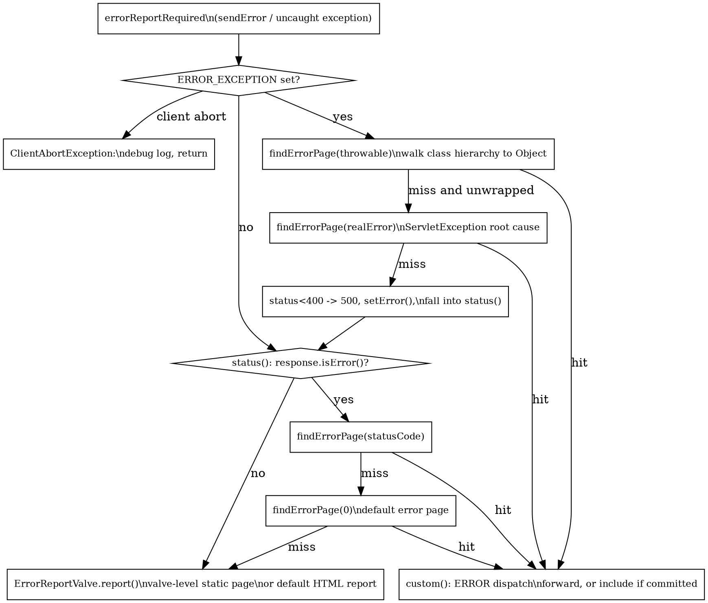

# ErrorPage

## Introduction

Tomcat 容器层的错误处理是一条**三层兜底链**：应用在 `web.xml` / `@WebServlet` 里声明的 `<error-page>` 先被匹配；匹配不到时落入 ErrorReportValve 自带的 valve 级静态错误页；再匹配不到，才由 ErrorReportValve 输出默认 HTML 报告。整个流程由 `StandardHostValve`（Host 的 basic 阀，见 [Valve](/docs/CS/Framework/Tomcat/Valve.md)）发起，`ErrorReportValve`（Host 默认配置的报告阀）收尾。理解这条链的关键在于分清**两类错误入口**：`response.sendError()` 只产生状态码（`isError()==true`），未捕获异常则设置 `ERROR_EXCEPTION` 属性——两者走不同的查找路径，最终都汇聚到 error dispatch 或默认报告。

一个常见误解是"错误页配置挂在 Host 上"。11.0.26 里 `StandardHost` 只持有报告阀的类名（`errorReportValveClass`，默认 `org.apache.catalina.valves.ErrorReportValve`，相对 /tmp/src/tree/tomcat-catalina-11.0.26/org/apache/catalina/core/StandardHost.java:146），**应用错误页集合实际在 Context 侧**，由 `ErrorPageSupport` 两个并发 Map 承载（相对 /tmp/src/tree/tomcat-catalina-11.0.26/org/apache/catalina/util/ErrorPageSupport.java:39-42）；Host 级只负责挑选用哪个报告阀类渲染兜底页面。

## Error Page Model and Storage

错误页模型是 `org.apache.tomcat.util.descriptor.web.ErrorPage`（该类属 tomcat-util 模块，源码镜像中不含此文件；以下字段从两处用法核实）：`errorCode`（状态码）、`exceptionType`（异常全限定名）、`location`（页面路径）。`ErrorPageSupport.add()` 按 `exceptionType` 是否为 null 决定放进哪张表（相对 /tmp/src/tree/tomcat-catalina-11.0.26/org/apache/catalina/util/ErrorPageSupport.java:50-57）：

```java
public void add(ErrorPage errorPage) {
    String exceptionType = errorPage.getExceptionType();
    if (exceptionType == null) {
        statusPages.put(Integer.valueOf(errorPage.getErrorCode()), errorPage);
    } else {
        exceptionPages.put(exceptionType, errorPage);
    }
}
```

`location` 有两种语义，容易混淆：

- **Context 级**（应用 `<error-page>`）：`location` 是**应用内路径**，通过 `ServletContext.getRequestDispatcher(location)` 做 ERROR dispatch（相对 /tmp/src/tree/tomcat-catalina-11.0.26/org/apache/catalina/core/StandardHostValve.java:348-349），可以是 JSP / Servlet。
- **Valve 级**（ErrorReportValve 的 `errorCode.500=/path/x.html` 属性）：`location` 是**文件系统路径**，相对 `catalina.base` 解析后直接读文件流出（相对 /tmp/src/tree/tomcat-catalina-11.0.26/org/apache/catalina/valves/ErrorReportValve.java:370-374），不经过任何 dispatch。

ErrorReportValve 的 valve 级页面通过 `setProperty()` 配置，属性名前缀 `errorCode.` / `exceptionType.`（相对 /tmp/src/tree/tomcat-catalina-11.0.26/org/apache/catalina/valves/ErrorReportValve.java:442-464），存在它自己的 `errorPageSupport` 实例里（同文件 :57）。

## Lookup and Matching Algorithm

`StandardHostValve.invoke` 在 Context pipeline 返回后检查 `response.isErrorReportRequired()`：有 `ERROR_EXCEPTION` 属性走 `throwable()`，否则走 `status()`（相对 /tmp/src/tree/tomcat-catalina-11.0.26/org/apache/catalina/core/StandardHostValve.java:142-154）。

状态码路径 `status()`：前提是 `response.isError()` 为 true（即确实调用过 `sendError()`，同文件 :196-198），然后**按状态码精确匹配 → 状态码 0 的默认页**两级查找（:200-204）：

```java
ErrorPage errorPage = context.findErrorPage(statusCode);
if (errorPage == null) {
    // Look for a default error page
    errorPage = context.findErrorPage(0);
}
```

异常路径 `throwable()` 的查找顺序（同文件 :231-288）：

1. 先解包 `ServletException` 取 root cause（:239-244）；
2. `ClientAbortException`（客户端提前断开）只记 debug 日志直接返回（:247-253）；
3. `context.findErrorPage(throwable)` → 未命中且发生过解包时再 `findErrorPage(realError)`（:255-258）；
4. 都未命中：状态码低于 400 则强制改成 500，`response.setError()` 后**回落到 `status()`**，让状态码级错误页仍有机会接管（:274-287）。

异常类型的匹配**沿继承链向上爬，直到 `Object` 为止**（不含 Object 本身），这是 `ErrorPageSupport.find(Throwable)` 的实现（相对 /tmp/src/tree/tomcat-catalina-11.0.26/org/apache/catalina/util/ErrorPageSupport.java:107-125）：

```java
Class<?> clazz = exception.getClass();
String name = clazz.getName();
while (!Object.class.equals(clazz)) {
    ErrorPage errorPage = exceptionPages.get(name);
    if (errorPage != null) {
        return errorPage;
    }
    clazz = clazz.getSuperclass();
    // ...
}
```

命中后由 `custom()` 执行 ERROR dispatch：响应未提交则 `resetBuffer` 后 `forward`；已提交则退化为 `include` + flush + `CLOSE_NOW`（相对 /tmp/src/tree/tomcat-catalina-11.0.26/org/apache/catalina/core/StandardHostValve.java:357-383）。全部落空后，响应带着错误状态回到 `ErrorReportValve`（报告阀的链入位置见 [Container](/docs/CS/Framework/Tomcat/Container.md)）。



## ERROR Request Attributes

ERROR dispatch 的目标页面靠 `jakarta.servlet.error.*` request attributes 取错误上下文，全部在 `setRequestErrorAttributes()` 一处设置（相对 /tmp/src/tree/tomcat-catalina-11.0.26/org/apache/catalina/core/StandardHostValve.java:291-327）：

| Attribute | 设置逻辑 |
| :--- | :--- |
| `error.status_code` | 状态码路径传实际状态码；**异常路径固定传 500**（:263），即使响应真实状态码不同 |
| `error.exception_type` | 异常路径传 `realError.getClass()`；状态码路径不设置 |
| `error.message` | **总是设置**，null 一律替换为空串（bug 69444 的修复，:304-310），避免下游读到陈旧值 |
| `error.exception` | 异常路径传 `realError`；状态码路径不设置 |
| `error.request_uri` / `error.method` / `error.query_string` | 当前请求的 URI / 方法 / 查询串 |
| `error.servlet_name` | 出错的 Wrapper 名字 |
| `DISPATCHER_TYPE_ATTR` | 固定为 `DispatcherType.ERROR`，过滤器的 dispatcher 配置按此匹配 |

## ErrorReportValve Output Policy

报告阀在 `getNext().invoke()` 返回后介入（相对 /tmp/src/tree/tomcat-catalina-11.0.26/org/apache/catalina/valves/ErrorReportValve.java:83-142）：响应已提交时不再写错误页，只 flush 并 `CLOSE_NOW`；存在 `ERROR_EXCEPTION` 但响应未标错时补 `reset()` + `sendError(500)`；随后调 `report()`。`report()` 的触发门槛（:181-189）：

```java
if (statusCode < 400 || response.getContentWritten() > 0 || !response.setErrorReported()) {
    return;
}
```

即**只有状态码 ≥ 400、且还没写过任何 body、且错误尚未被报告**三者同时成立才输出。输出前先在 valve 级 `errorPageSupport` 里找静态错误页（异常类型 → 状态码 → 0 的顺序，:156-169），找到则流式发送文件（:199-207）。

默认 HTML 报告由两个开关控制，默认都是 true（:53-55，`server.xml` 的 `<Valve>` 或 `errorReportValveClass` 处配置）：

- `showReport=false`：只输出标题 `<h1>`（状态码 + reason phrase），**隐藏 message、description、异常堆栈与 root cause 链**（报告体集中在 :260-312）。
- `showServerInfo=false`：隐藏结尾的 `<h3>Apache Tomcat/11.0.26</h3>`（:313-315）。**默认报告会暴露精确版本号**——这是生产环境最常被审计点名的信息泄露项，公网实例建议两个都关。

堆栈输出并非完整栈：`getPartialServletStackTrace()` 截断到 `ApplicationFilterChain.doFilter`，并**剔除所有 `org.apache.catalina.core.` 的帧**，只留应用层栈帧（:349-367）；root cause 沿 cause 链最多追 10 层（:290-302）。所有动态内容经 `Escape.htmlElementContent()` 转义后输出（:287）。

## JsonErrorReportValve

存在，与 ErrorReportValve 同包。`JsonErrorReportValve extends ErrorReportValve`，**只覆写 `report()`**，触发条件与父类完全相同（`statusCode < 400 || contentWritten > 0 || !setErrorReported()` 直接返回，相对 /tmp/src/tree/tomcat-catalina-11.0.26/org/apache/catalina/valves/JsonErrorReportValve.java:52-54），改输出 `application/json`，字段为 `status` / `type` / `message` / `reason` / `description`，异常时附 `throwable` 数组（cause 链、同样 10 层上限，:64-144）。它同样尊重 `showReport`：关闭时只输出 `{"status": 404}` 这种最小 JSON（:145-147）。启用方式是替换 Host 的报告阀：`<Host errorReportValveClass="org.apache.catalina.valves.JsonErrorReportValve">`（见 `StandardHost.setErrorReportValveClass`，相对 /tmp/src/tree/tomcat-catalina-11.0.26/org/apache/catalina/core/StandardHost.java:503-507）。

## ProxyErrorReportValve

同为 ErrorReportValve 子类，用途是**把错误报告交给另一个 URL 处理**，而不是自己渲染（相对 /tmp/src/tree/tomcat-catalina-11.0.26/org/apache/catalina/valves/ProxyErrorReportValve.java:132-248）：

- `useRedirect=true`：对客户端 302 重定向到目标 URL；
- 否则（默认）：服务端用 `HttpURLConnection` 请求目标 URL，把响应体原样拷回当前响应（:228-237），客户端无感知。

目标 URL 来自 valve 级 errorPage 匹配或 properties 资源文件（按状态码查 key，找不到回落 key `0`，:106-122），并自动追加 `requestUri` / `statusCode` / `statusReason` 查询参数；`showReport` 开启时再追加 `statusDescription` / `message` / `throwable`（:199-212）。**找不到 URL 时回落 `super.report()` 输出默认 HTML**（:161-164）。典型场景是前端有统一错误中心、或要求错误页面与主站同域时，由这个阀代理拉取。

## Keep-Alive and Error Status Codes

错误响应不一定保持连接。HTTP/1.1 处理层有一个白名单（相对 /tmp/src/tree/tomcat-coyote-11.0.26/org/apache/coyote/http11/Http11Processor.java:212-217）：

```java
private static boolean statusDropsConnection(int status) {
    return status == 400 /* SC_BAD_REQUEST */ || status == 408 /* SC_REQUEST_TIMEOUT */ ||
            status == 411 /* SC_LENGTH_REQUIRED */ || status == 413 /* SC_REQUEST_ENTITY_TOO_LARGE */ ||
            status == 414 /* SC_REQUEST_URI_TOO_LONG */ || status == 500 /* SC_INTERNAL_SERVER_ERROR */ ||
            status == 503 /* SC_SERVICE_UNAVAILABLE */ || status == 501 /* SC_NOT_IMPLEMENTED */;
}
```

命中即 `keepAlive = false` 并补发 `Connection: close` 头（同文件 :1013-1020）。注意两个点：**500 会断连而 502/504 不会**；这个判断在 coyote 层（HTTP parser 处），与容器层无关。此外 `custom()` 在响应已提交时也会主动 `CLOSE_NOW`（相对 /tmp/src/tree/tomcat-catalina-11.0.26/org/apache/catalina/core/StandardHostValve.java:372-373）。连接复用与该开关的上下文见 [Connector](/docs/CS/Framework/Tomcat/Connector.md)。

## Exceptions and Logging

未捕获异常进入 `throwable()` 时有两类特殊处理：

- `ClientAbortException`（客户端提前断开连接导致写失败）：只打 debug 日志即返回，不上抛、不产错误页（相对 /tmp/src/tree/tomcat-catalina-11.0.26/org/apache/catalina/core/StandardHostValve.java:247-253）——客户端都没了，写错误页没有意义，生产日志也常被它刷屏，排查时需开 Host 的 debug 级别。
- `custom()` 内 dispatch 失败：记录 error 日志并返回 false，让流程回落到默认报告（同文件 :388-393）。

`status()` 中 `finishResponse()` 的 `ClientAbortException` 同样被吞掉（:213-214）。这些连接级异常与读超时、写入缓冲的关系在 [Connector](/docs/CS/Framework/Tomcat/Connector.md) 有对应展开。

## Common Pitfalls

- **location 的两套语义**：应用 `<error-page>` 的 location 必须是应用内路径（走 `getRequestDispatcher`），写 `/error.jsp` 可以、写 `https://...` 不行；valve 级 `errorCode.*` 的 location 是文件系统路径，相对 `catalina.base`。混用会导致 dispatch 返回 null（日志 `customStatusFailed`）或文件找不到（warn `errorPageNotFound`）。
- **报告阀必须挂在 Host 或 Engine**：类注释明确 "should be attached at the Host level"（相对 /tmp/src/tree/tomcat-catalina-11.0.26/org/apache/catalina/valves/ErrorReportValve.java:47）。挂在 Context 位置虽然能跑，但会破坏与 `StandardHostValve` 的先后顺序假设。Host 内的阀序列见 [Valve](/docs/CS/Framework/Tomcat/Valve.md)。
- **async 请求不在此处兜底**：`request.isAsync() && !request.isAsyncCompleting()` 时报告阀直接返回（相对 /tmp/src/tree/tomcat-catalina-11.0.26/org/apache/catalina/valves/ErrorReportValve.java:118-120），异步错误的报告责任移交给 async 超时/complete 路径，否则会把还在跑的请求误判为终态。
- **ERROR dispatch 里的二次错误**：错误页自身抛异常时，`invoke` 的 catch 保留原始错误优先上报（相对 /tmp/src/tree/tomcat-catalina-11.0.26/org/apache/catalina/core/StandardHostValve.java:120-125）。
- **404 与 403 的来源不同**：匹配不到 Context 时由 `StandardHostValve` 直接 `sendError(404)`（:82-87）；403 通常来自 authenticator / Realm 的鉴权拒绝，走容器安全链，错误页若按状态码配置仍能接管，但 `ERROR_*` attributes 里没有异常信息。鉴权与 Realm 见 [Security](/docs/CS/Framework/Tomcat/Security.md)。
- **Spring Boot 等嵌入式场景**会用 `ErrorPageRegistrar` 注册自己的 `ErrorPage` 并关掉容器默认报告，容器这套 `<error-page>` 机制被整体替换——原理仍基于 Servlet 规范的 error dispatch，见 [Servlet](/docs/CS/Java/JDK/Servlet.md)。

## Links

- [Tomcat](/docs/CS/Framework/Tomcat/Tomcat.md)
- [Valve](/docs/CS/Framework/Tomcat/Valve.md)
- [Container](/docs/CS/Framework/Tomcat/Container.md)
- [Connector](/docs/CS/Framework/Tomcat/Connector.md)
- [Security](/docs/CS/Framework/Tomcat/Security.md)
- [Servlet](/docs/CS/Java/JDK/Servlet.md)

## References

- [Apache Tomcat 11 Configuration Reference - Valve](https://tomcat.apache.org/tomcat-11.0-doc/config/valve.html)
- [Apache Tomcat 11 Configuration Reference - Host](https://tomcat.apache.org/tomcat-11.0-doc/config/host.html)
- [Jakarta Servlet Specification](https://jakarta.ee/specifications/servlet/)
