# Jasper

## Introduction

JSP 的本质是把「代码生成」推迟到运行期：页面第一次被访问时，Jasper 才把 `.jsp` 文本翻译成一个继承 `HttpJspBase` 的 Servlet 类，编译成 `.class`，再实例化并走标准 Servlet 生命周期。所以 Jasper 与其说是一组「标签库」，不如说是一个**寄宿在容器里的运行期编译器**——它的输入是文本模板，输出是字节码，中间跑了一条完整的 parse → validate → generate → compile → load 流水线。JSP 与 Servlet 的关系见 [Servlet](/docs/CS/Java/JDK/Servlet.md)。

Tomcat 11.0.x 的 Jasper 对应 Jakarta EE 11 代的 JSP 规范 Jakarta Pages 4.0（`javax → jakarta` 的迁移在 10.0 就已完成，见 [Version_Migration](/docs/CS/Framework/Tomcat/Version_Migration.md)）。它与容器的耦合只有两条细缝：

- 容器在全局 `conf/web.xml` 里注册名为 `jsp` 的 Servlet（`org.apache.jasper.servlet.JspServlet`），映射 `*.jsp` / `*.jspx`，并允许 webapp 用自己的同名 Servlet 覆盖（`相对 /tmp/src/tree/ tomcat-catalina-11.0.26/org/apache/catalina/core/StandardContext.java:2816-2837`）；
- 容器在部署期完成 TLD 扫描并把结果交给 Jasper 缓存（见 [Deployment](/docs/CS/Framework/Tomcat/Deployment.md)）。

除此之外的一切——解析、校验、生成、编译、类加载、过期检查——都发生在 `org.apache.jasper` 包内部。本文基于 `tomcat-jasper-11.0.26` 源码镜像梳理这条链路，包结构为：顶层（`JspCompilationContext`、`EmbeddedServletOptions`、`JspC` 等 7 个类）、`compiler`（48 个类，编译主战场）、`runtime`（17 个，`HttpJspBase`/`PageContextImpl` 等）、`servlet`（7 个，入口与类加载）、`el`（9 个）、`tagplugins`（JSTL 插件）与 `optimizations`（2 个可选优化实现）。

## Request path from URL to _jspService

一个 `GET /hello.jsp` 请求在 Jasper 内部的对象链如下（容器侧管线见 [Container](/docs/CS/Framework/Tomcat/Container.md)）：

```dot
digraph JasperRequestFlow {
  rankdir = LR;
  node [shape = box];

  req [label = "GET /hello.jsp"];
  sw  [label = "StandardWrapper jsp\nJspServlet"];
  js  [label = "JspServlet.service\nresolve jspUri + jsp_precompile"];
  rc  [label = "JspRuntimeContext\njsps map"];
  w   [label = "JspServletWrapper.service\ncompile, load, service"];
  c   [label = "Compiler.compile\ngenerateJava + generateClass"];
  s   [label = "hello_jsp instance\nHttpJspBase._jspService"];

  req -> sw -> js;
  js -> rc [label = "getWrapper"];
  rc -> w;
  w -> c [label = "development or mustCompile"];
  w -> s [label = "servlet.service"];
}
```



`JspServlet.service()` 先拼出 jspUri（优先 `jspFile` init-param，其次 include 属性，最后 `getServletPath() + getPathInfo()`），再查 `jsp_precompile` 查询参数，最后按 jspUri 从 `JspRuntimeContext` 拿或建 wrapper（`相对 /tmp/src/tree/ tomcat-jasper-11.0.26/org/apache/jasper/servlet/JspServlet.java:247-344`）：

```java
private void serviceJspFile(HttpServletRequest request, HttpServletResponse response, String jspUri,
        boolean precompile) throws ServletException, IOException {

    JspServletWrapper wrapper = rctxt.getWrapper(jspUri);
    if (wrapper == null) {
        synchronized (this) {
            wrapper = rctxt.getWrapper(jspUri);
            if (wrapper == null) {
                // Check if the requested JSP page exists, to avoid
                // creating unnecessary directories and files.
                if (null == context.getResource(jspUri)) {
                    handleMissingResource(request, response, jspUri);
                    return;
                }
                wrapper = new JspServletWrapper(config, options, jspUri, rctxt);
                rctxt.addWrapper(jspUri, wrapper);
            }
        }
    }

    try {
        wrapper.service(request, response, precompile);
    } catch (FileNotFoundException fnfe) {
        handleMissingResource(request, response, jspUri);
    }
}
```

文件不存在走 `handleMissingResource`，用 `sendError(SC_NOT_FOUND)` 返回 404（`JspServlet.java:347-366`）。`?jsp_precompile=true` 只触发编译、不执行页面，参数名可由 `jspPrecompilationQueryParameter` 覆盖，默认字面量 `jsp_precompile`（`JspServlet.java:199-240`；`org/apache/jasper/EmbeddedServletOptions.java:212`）。

## JspServlet and JspServletWrapper

双层结构各管一摊：`JspServlet` 是**每个 webapp 一份**的注册 Servlet，持有 `Options` 与 `JspRuntimeContext`；`JspServletWrapper` 是**每个 JSP 一份**的状态机，持有该页面的编译上下文、生成的 Servlet 实例、reload 标志与失败缓存。

`init()` 读 `engineOptionsClass` 换自定义 Options（失败回退 `EmbeddedServletOptions`），然后建 `JspRuntimeContext`；若配置了 `jspFile` init-param 则在启动期就预编译该页面（`JspServlet.java:75-126`）：

```java
public void init(ServletConfig config) throws ServletException {
    // ...
    String engineOptionsName = config.getInitParameter("engineOptionsClass");
    if (engineOptionsName != null) {
        // ... 反射实例化自定义 Options，失败回退
        options = new EmbeddedServletOptions(config, context);
    } else {
        // Use the default Options implementation
        options = new EmbeddedServletOptions(config, context);
    }
    rctxt = new JspRuntimeContext(context, options);
    // jspFile init-param 存在时启动期编译（jsp.error.precompilation）
    // ...
}
```

`JspServletWrapper.service()` 是整个运行期的节拍器，代码注释里就写明了四步（`相对 /tmp/src/tree/ tomcat-jasper-11.0.26/org/apache/jasper/servlet/JspServletWrapper.java:411-533`）：

```java
public void service(HttpServletRequest request, HttpServletResponse response, boolean precompile)
        throws ServletException, IOException, FileNotFoundException {
    // ...
    /*
     * (1) Compile
     */
    if (options.getDevelopment() || mustCompile) {
        synchronized (this) {
            if (options.getDevelopment() || mustCompile) {
                // The following sets reload to true, if necessary
                ctxt.compile();
                mustCompile = false;
            }
        }
    } else {
        if (compileException != null) {
            // Throw cached compilation exception
            throw compileException;
        }
    }

    /*
     * (2) (Re)load servlet class file
     */
    servlet = getServlet();

    // If a page is to be precompiled only, return.
    if (precompile) {
        return;
    }
    // ...
    /*
     * (3) Handle limitation of number of loaded Jsps
     */
    // ... maxLoadedJsps / jspIdleTimeout 触发的 LRU 记账
    /*
     * (4) Service request
     */
    servlet.service(request, response);
    // ... UnavailableException → Retry-After + 503
}
```

为什么要 wrapper 这一层？因为第 1、2 步是**有状态的**：`mustCompile` 决定是否跳过请求线程上的编译检查，`compileException` 把失败结果缓存下来（非 development 模式下每次请求重抛，`JspServletWrapper.java:85,446-449`），`reload` 是一个 volatile 双检锁标志，`available` 支撑 `UnavailableException` 的 Retry-After 语义（`JspServletWrapper.java:72-93`）。真正实例化 Servlet 的 `getServlet()` 走双检锁，用容器的 `InstanceManager` 按生成的全限定名 + `JspLoader` 创建实例并 `init()`，reload 时计数 `jspReloadCount`（`JspServletWrapper.java:176-216`）：

```java
public Servlet getServlet() throws ServletException {
    /* DCL on 'reload' requires that 'reload' be volatile ... */
    if (getReloadInternal() || theServlet == null) {
        synchronized (this) {
            // Synchronizing on jsw enables simultaneous loading
            // of different pages, but not the same page.
            if (getReloadInternal() || theServlet == null) {
                // This is to maintain the original protocol.
                destroy();

                final Servlet servlet;
                try {
                    InstanceManager instanceManager = InstanceManagerFactory.getInstanceManager(config);
                    servlet = (Servlet) instanceManager.newInstance(ctxt.getFQCN(), ctxt.getJspLoader());
                } catch (Exception e) {
                    // ...
                    throw new JasperException(t);
                }

                servlet.init(config);

                if (theServlet != null) {
                    ctxt.getRuntimeContext().incrementJspReloadCount();
                }

                theServlet = servlet;
                reload = false;
                // Volatile 'reload' forces in order write of 'theServlet' and new servlet object
            }
        }
    }
    return theServlet;
}
```

`getReloadInternal()` 返回 `reload && !ctxt.getRuntimeContext().isCompileCheckInProgress()`，避免后台编译检查与请求 reload 竞争（BZ 62603，`JspServletWrapper.java:167-182`）。

## The compilation pipeline

`ctxt.compile()` 拿到的是 `JspCompilationContext` 创建的 `Compiler`（`JspCompilationContext.java:237-262`），主流程在 `Compiler.compile(boolean, boolean)`（`相对 /tmp/src/tree/ tomcat-jasper-11.0.26/org/apache/jasper/compiler/Compiler.java:394-439`）：

```java
public void compile(boolean compileClass, boolean jspcMode)
        throws FileNotFoundException, JasperException, Exception {
    if (errDispatcher == null) {
        this.errDispatcher = new ErrorDispatcher(jspcMode);
    }

    try {
        final Long jspLastModified = ctxt.getLastModified(ctxt.getJspFile());
        Map<String,SmapStratum> smaps = generateJava();
        File javaFile = new File(ctxt.getServletJavaFileName());
        if (!javaFile.setLastModified(jspLastModified.longValue())) {
            throw new JasperException(Localizer.getMessage("jsp.error.setLastModified", javaFile));
        }
        if (compileClass) {
            generateClass(smaps);
            // Fix for bugzilla 41606
            // Set JspServletWrapper.servletClassLastModifiedTime after successful compile
            // ... .class 的 lastModified 对齐 JSP 源文件，供 isOutDated 比较
        }
    } finally {
        // ... tfp / errDispatcher / pageInfo / pageNodes 置 null 便于 GC，关闭 writer
    }
}
```

注意两个细节：生成的 `.java` 与 `.class` 的 `lastModified` 被刻意**对齐到 JSP 源文件的时间戳**，这是后面 `isOutDated()` 用 `!=` 比较的基础；`compile(jspcMode=true)` 是 `JspC` 预编译复用同一条管线的入口。javadoc 同时说明「被本页引用的 tag file 也会顺带编译」（`Compiler.java:369-371`）。

### Parse

`ParserController` 是入口分流器：探测编码（`EncodingDetector`）、识别 XML 语法（`jsp:root` / doctype），经典语法交给 `Parser`，XML 语法交给 `JspDocumentParser`，产出 `Node.Nodes` 树。这一层同时处理 `include` 指令展开与自定义动作的原始收集。

### Validate

`Validator` 对照 JSP 规范与 TLD 校验属性、校验 EL，标签校验器（`TagLibraryInfoImpl` / `JasperTagInfo`）在此时拉起。TLD 的查找走 `TldCache`：uri → `TldResourcePath`、`TldResourcePath` → 解析好的 `TaglibXml` 两张缓存表（`相对 /tmp/src/tree/ tomcat-jasper-11.0.26/org/apache/jasper/compiler/TldCache.java:56-61,121-133`），而扫描本身发生在部署期、由容器记录 `tldScanTime`（`tomcat-catalina-11.0.26/org/apache/catalina/core/StandardContext.java:600`）。

### Generate

`Generator` 把 Node 树写出为 `.java`（`ServletWriter`），期间 `ELFunctionMapper`、`ScriptingVariabler`、`TextOptimizer` 各自处理 EL 函数、脚本变量声明与文本折叠；SMAP 信息（JSR-45 行号映射）以 `SmapStratum` 形式收集并在 `generateJava()` 返回（`Compiler.java:143`），`SmapUtil` 负责落到 class 文件。

### Compile

`createCompiler()` 的选择逻辑是：显式配了 `compilerClassName` 就反射实例化；否则没配外部 `compiler` 命令时**默认 `JDTCompiler`**（Eclipse JDT 批编译器，进程内），失败再试 `AntCompiler`；配了外部 javac 命令则反过来先试 `AntCompiler`（`相对 /tmp/src/tree/ tomcat-jasper-11.0.26/org/apache/jasper/JspCompilationContext.java:237-262`）：

```java
public Compiler createCompiler() {
    // ...
    if (options.getCompilerClassName() != null) {
        jspCompiler = createCompiler(options.getCompilerClassName());
    } else {
        if (options.getCompiler() == null) {
            jspCompiler = createCompiler("org.apache.jasper.compiler.JDTCompiler");
            if (jspCompiler == null) {
                jspCompiler = createCompiler("org.apache.jasper.compiler.AntCompiler");
            }
        } else {
            jspCompiler = createCompiler("org.apache.jasper.compiler.AntCompiler");
            if (jspCompiler == null) {
                jspCompiler = createCompiler("org.apache.jasper.compiler.JDTCompiler");
            }
        }
    }
    // ...
}
```

`JDTCompiler` 直接驱动 `org.eclipse.jdt.internal.compiler.Compiler`（`compiler/JDTCompiler.java:41-46`），`AntCompiler` 包一层 Ant 的 `Javac` task（`compiler/AntCompiler.java:31-46`）。编译失败时错误经 `ErrorDispatcher` / `JavacErrorDetail` 聚合成 `JasperException` 上抛；development 模式下 wrapper 会用 `handleJspException` 把 class 行号经 SMAP 映射回 JSP 源码行（`JspServletWrapper.java:465-474`）。`.java` 留档由 `keepGenerated` 控制，默认 `true`（`EmbeddedServletOptions.java:59`），排查编译错误时可以直接到 work 目录对照。

### Load

加载用的 `JasperLoader` 是 `URLClassLoader` 子类，只对 `org.apache.jsp`（准确说是 `packageName + '.'` 前缀）走 child-first，其余一律先问 parent（`相对 /tmp/src/tree/ tomcat-jasper-11.0.26/org/apache/jasper/servlet/JasperLoader.java:77-101`，另见 [ClassLoader](/docs/CS/Framework/Tomcat/ClassLoader.md)）：

```java
public synchronized Class<?> loadClass(final String name, boolean resolve) throws ClassNotFoundException {
    Class<?> clazz;

    // (0) Check our previously loaded class cache
    clazz = findLoadedClass(name);
    if (clazz != null) {
        // ...
        return clazz;
    }

    if (!name.startsWith(packageName + '.')) {
        // Class is not in org.apache.jsp, therefore, have our
        // parent load it
        clazz = getParent().loadClass(name);
        // ...
        return clazz;
    }

    return findClass(name);
}
```

生成的 Servlet 类继承 `HttpJspBase`，后者把 `service()` 定成 final 并转调抽象方法 `_jspService()`（`相对 /tmp/src/tree/ tomcat-jasper-11.0.26/org/apache/jasper/runtime/HttpJspBase.java:35,65-67,91`）——这就是容器最终调用的方法。

## Output directory and class name mangling

产物目录由 `scratchdir` 决定，未配置时取 `ServletContext.TEMPDIR`，在标准 Tomcat 部署下即 `work/<engine>/<host>/<context>/`（`EmbeddedServletOptions.java:693-705`）。默认包名 `org.apache.jsp`（`EmbeddedServletOptions.java:214`），tag file 是 `org.apache.jsp.tag`（`:216`）；JSP 所在子目录变成包名后缀（`JspCompilationContext.java:559-565`），类文件名 = `outputDir + className + .java/.class`（`JspCompilationContext.java:592,639,651`）。最终布局形如 `work/Catalina/localhost/app/org/apache/jsp/WEB_002dINF/login_jsp.java`。

类名转义规则在 `JspUtil.makeJavaIdentifier`：`.` 直接变 `_`，下划线本身、连字符等非法字符转成 `_` + 4 位小写十六进制（`相对 /tmp/src/tree/ tomcat-jasper-11.0.26/org/apache/jasper/compiler/JspUtil.java:862-898`）：

```java
private static String makeJavaIdentifier(String identifier, boolean periodToUnderscore) {
    StringBuilder modifiedIdentifier = new StringBuilder(identifier.length());
    if (!Character.isJavaIdentifierStart(identifier.charAt(0))) {
        modifiedIdentifier.append('_');
    }
    for (int i = 0; i < identifier.length(); i++) {
        char ch = identifier.charAt(i);
        if (Character.isJavaIdentifierPart(ch) && (ch != '_' || !periodToUnderscore)) {
            modifiedIdentifier.append(ch);
        } else if (ch == '.' && periodToUnderscore) {
            modifiedIdentifier.append('_');
        } else {
            modifiedIdentifier.append(mangleChar(ch));
        }
    }
    if (isJavaKeyword(modifiedIdentifier.toString())) {
        modifiedIdentifier.append('_');
    }
    return modifiedIdentifier.toString();
}

public static String mangleChar(char ch) {
    char[] result = new char[5];
    result[0] = '_';
    result[1] = Character.forDigit((ch >> 12) & 0xf, 16);
    // ... 8 位、4 位、0 位
    return new String(result);
}
```

入口在 `getServletClassName()`：取 jspUri 最后一段（**含 `.jsp` 扩展名**）交给上面的方法（`JspCompilationContext.java:391-408`）。对照实例：

| JSP 文件 | 生成的类 |
| :--- | :--- |
| `/hello.jsp` | `org.apache.jsp.hello_jsp` |
| `/a_b.jsp` | `org.apache.jsp.a_005fb_jsp` |
| `/WEB-INF/login.jsp` | `org.apache.jsp.WEB_002dINF.login_jsp` |

也就是说 `hello.jsp` 生成的是 `hello_jsp`；`_005f` 形态只会出现在**文件名本身含下划线**的页面（下划线被转义为 `_005f`），以及目录名含 `-`、`.` 等字符时（`-` 转义为 `_002d`）。

## Background checks and development mode

Jasper 11 里没有自建后台线程：`JspServlet` 实现了 `PeriodicEventListener`，由容器按 `backgroundProcessorDelay` 周期回调，转手调用 `checkUnload()` 与 `checkCompile()`（`相对 /tmp/src/tree/ tomcat-jasper-11.0.26/org/apache/jasper/servlet/JspServlet.java:48,311-314`）。所以「后台编译检查」的开关实际是两层：容器是否在跑 background processor，以及 Jasper 侧 `checkInterval` 是否大于 0（`checkCompile` 里按 `checkInterval * 1000` 节流，默认 0 即关闭，`org/apache/jasper/compiler/JspRuntimeContext.java:303-314`）：

```java
public void checkCompile() {

    if (lastCompileCheck < 0) {
        // Checking was disabled
        return;
    }
    long now = System.currentTimeMillis();
    if (now > (lastCompileCheck + (options.getCheckInterval() * 1000L))) {
        lastCompileCheck = now;
    } else {
        return;
    }
    // ...
    compileCheckInProgress = true;

    Object[] wrappers = jsps.values().toArray();
    for (Object wrapper : wrappers) {
        JspServletWrapper jsw = (JspServletWrapper) wrapper;
        JspCompilationContext ctxt = jsw.getJspEngineContext();
        // Sync on JspServletWrapper when calling ctxt.compile()
        synchronized (jsw) {
            try {
                ctxt.compile();
                if (jsw.getReload()) {
                    wrappersToReload.add(jsw);
                }
            } catch (FileNotFoundException ex) {
                ctxt.incrementRemoved();
            } catch (Throwable t) {
                // ...
                jsw.getServletContext().log(Localizer.getMessage("jsp.error.backgroundCompilationFailed"), t);
            }
        }
    }
    // ... compileCheckInProgress = false 后统一触发 reload
}
```

两种模式的分工：

- **development 模式（默认开）**：过期检查在请求线程上做。wrapper 第 1 步 `options.getDevelopment() || mustCompile` 满足即 `ctxt.compile()`，而 `Compiler.isOutDated()` 内部又用 `modificationTestInterval`（默认 4 秒）节流文件系统探测：先比 `.class` 与 JSP 的 `lastModified`，再遍历 `jsw.getDependants()`（include 依赖、jar 内 TLD 的 `uri:` 键经 `TldCache` 反查）逐个比时间戳（`相对 /tmp/src/tree/ tomcat-jasper-11.0.26/org/apache/jasper/compiler/Compiler.java:447-584`）。
- **production 模式（`development=false`）**：请求线程不再检查，靠 `checkInterval` 驱动的 `checkCompile()` 提前把过期页面编好；失败结果缓存在 `compileException` 里，是否失败后自动重试由 `recompileOnFail` 控制（默认 `false`，`EmbeddedServletOptions.java:162`）。

wrapper 的回收同样走周期回调：`maxLoadedJsps`（默认 -1 关闭）按 LRU 队列卸载最旧 wrapper，`jspIdleTimeout`（默认 -1）卸载空闲超时的页面，`unloadJspServletWrapper()` 做 removeWrapper + destroy 并累计 `jspUnloadCount`（`JspRuntimeContext.java:459-465,471-502`；`JspServletWrapper.java:109-111`）。

## Tagplugins and optimizations

这是 Jasper 少有的两个公开扩展点。

**tagplugins**：把 JSTL 标签在生成阶段直接展开为原生 Java 代码，而不是生成标签处理器调用链。`TagPluginManager` 的启用方式是**扫 classpath**：收集所有 `META-INF/org.apache.jasper/tagPlugins.xml`（jasper.jar 自带一份 JSTL 映射），再叠加 webapp 的 `/WEB-INF/tagPlugins.xml`——并没有 web.xml init-param 这条路（`相对 /tmp/src/tree/ tomcat-jasper-11.0.26/org/apache/jasper/compiler/TagPluginManager.java:39-40,93-100`）：

```java
private static final String META_INF_JASPER_TAG_PLUGINS_XML = "META-INF/org.apache.jasper/tagPlugins.xml";
private static final String TAG_PLUGINS_XML = "/WEB-INF/tagPlugins.xml";
// ...
Enumeration<URL> urls = ctxt.getClassLoader().getResources(META_INF_JASPER_TAG_PLUGINS_XML);
while (urls.hasMoreElements()) {
    URL url = urls.nextElement();
    parser.parse(url);
}

URL url = ctxt.getResource(TAG_PLUGINS_XML);
if (url != null) {
    // ...
}
```

映射关系是「tag handler class 名 → 插件实例」（`TagPluginManager.java:110-117,131`），`apply()` 对解析出的 `Node.Nodes` 树做 visitor 替换（`:62-70`）。插件实现集中在 `tagplugins/jstl/core/`（`If`、`ForEach`、`Choose`/`When`/`Otherwise`、`Out`、`Set`、`Import` 等 14 个）加一个工具类 `Util`，接口 `TagPlugin` / `TagPluginContext` 在 `compiler/tagplugin/`。

**optimizations**：`optimizations/` 只有两个类，都是替换默认解释器实现的可选优化——`StringInterpreterEnum` 继承 `StringInterpreterFactory.DefaultStringInterpreter`，把「字符串 → 枚举」的 setter 赋值直接编成 `Enum.valueOf` 字面量、绕过 PropertyEditor 探测；`ELInterpreterTagSetters` 则对「纯字面量字符串 → 基本类型/BigDecimal/Enum setter」的标签属性跳过前三个 `ELResolver`（**非规范行为**，javadoc 明说）。选择机制相同：`ServletContext` attribute 或 init-param 指定实现类，否则用默认实现（`相对 /tmp/src/tree/ tomcat-jasper-11.0.26/org/apache/jasper/compiler/StringInterpreterFactory.java:29,36,72,94`；`compiler/ELInterpreterFactory.java:31,38,73,95`）。注意这两个工厂都在 `compiler/` 包，不在 `runtime/` 或 `servlet/`。

## Precompilation with JspC

`JspC` 一身二任：`public class JspC extends Task implements Options`——既是 `main()` 入口也是 Ant Task（`相对 /tmp/src/tree/ tomcat-jasper-11.0.26/org/apache/jasper/JspC.java:90,368`）。它复用同一条编译管线（`Compiler.compile` 的 `jspcMode=true` 分支），常用参数：`-webapp`/`-uriroot` 指定应用根，`-p` 指定包名，`-outputdir` 指定输出，`-webxml` / `-webfragxml` 生成可合并的 Servlet 注册片段（`INC_WEBXML` / `FRG_WEBXML` / `ALL_WEBXML` 三档，`JspC.java:139-143,429-441`），`-addwebxmlmappings` 让片段自带 servlet-mapping（`:143`），`-compile` 触发 javac（`:933`）。

预编译的完整闭环是：JspC 产出 `_jsp.java` / `.class` + `web.xml` 片段 → 片段把每个 JSP 注册为普通 Servlet（映射 `*.jsp`）→ 运行期请求不再经过 `JspServlet`，运行期编译被完全跳过，`work` 目录只剩日志。这是 production 环境规避「首次访问慢」与「运行期 javac 依赖」的正规路线；另一条轻量路径是不预注册、只靠 `?jsp_precompile` 在部署后主动焐热（`JspServlet.java:199-240`）。

## Configuration options

常用 init-param 及其默认值（字段声明行号即默认值出处，均在 `org/apache/jasper/EmbeddedServletOptions.java`）：

| init-param | 默认值 | 作用 | 出处 |
| :--- | :--- | :--- | :--- |
| `development` | `true` | 请求线程上做过期检查与编译 | `:49` |
| `trimSpaces` | `TrimSpacesOption.FALSE` | 模板文本空白处理（true / false / extended） | `:64`，解析 `:532` |
| `enablePooling` | `true` | 标签处理器池化（`TagHandlerPool`） | `:69`，解析 `:544` |
| `genStringAsCharArray` | `false` | 字符串常量以 char[] 生成 | `:100` |
| `modificationTestInterval` | `4` | dev 模式下两次过期探测的最小间隔（秒） | `:157` |
| `checkInterval` | `0` | 后台编译检查间隔（秒），0 关闭 | `:85` |
| `javaEncoding` | `UTF-8` | 生成的 `.java` 源码编码 | `:152` |
| `maxLoadedJsps` | `-1` | wrapper 数量上限（LRU 卸载），-1 关闭 | `:178` |

另有几个承重默认：`keepGenerated=true`（`:59`，`.java` 留档）、`compilerSourceVM` / `compilerTargetVM` 均为 `17`（`:122,127`）、`compilerClassName` 默认 null 即运行时选 `JDTCompiler`（`:132`；`JspCompilationContext.java:244-248`）、`jspIdleTimeout` 默认 -1（`:183`）。

## Common pitfalls

- **WEB-INF/lib 里塞 jsp-api / jasper**。生成的类对 `org.apache.jsp.*` 走 child-first，其余类沿 parent 链解析（`JasperLoader.java:90-100`），但 parent 链上的 webapp loader 是 child-first 的——应用里一旦放了一份 `jakarta.servlet.jsp-api` 或 jasper 内部类，运行期就会解析到两套实现，典型症状是 `ClassCastException` / `AbstractMethodError`。JSP API 与 Jasper 必须只来自容器。
- **`work` 目录权限**。`EmbeddedServletOptions` 构造期硬校验 scratchdir：必须存在、可读、可写、是目录，否则直接 `IllegalStateException`（jsp.error.bad.scratch.dir，`相对 /tmp/src/tree/ tomcat-jasper-11.0.26/org/apache/jasper/EmbeddedServletOptions.java:703-705`）。最常见触发方式是先用 root 启动过一次、再换普通用户运行——产物属主已经不是应用用户。
- **TLD 扫描开销**。扫描发生在部署期且默认覆盖全量 jar（容器记录 `tldScanTime`，`tomcat-catalina-11.0.26/org/apache/catalina/core/StandardContext.java:600`），大应用常配 `conf/catalina.properties` 的 `tomcat.util.scan.StandardJarScanFilter.jarsToSkip` 跳过无关 jar。`TldCache` 只是把扫描结果缓存成 uri → TLD 路径与解析产物，扫描本身省不掉。
- **production 模式下的失败缓存**。`development=false` 时编译失败被缓存在 `compileException`，之后每个请求直接重抛（`JspServletWrapper.java:446-449`）；不开 `recompileOnFail` 或 `checkInterval`，修好的 JSP 不会自动重编。开发期看到的 HTTP 500 带 SMAP 映射回的 JSP 行号，正是 dev 模式 `handleJspException` 的产物（`JspServletWrapper.java:465-474`）。
- **reload 与 unload 的边界**。页级 reload 靠 `volatile reload` + `isOutDated()` 时间戳比较；被 `maxLoadedJsps` / `jspIdleTimeout` 卸载的 wrapper 会被 `removeWrapper` 移除，下次访问按新 wrapper 重建（`JspRuntimeContext.java:459-465`）——容器级 context reload 则是另一回事，整个 `JspServlet` 重新 init、`JspRuntimeContext` 全量重建。

## Links

- [Tomcat](/docs/CS/Framework/Tomcat/Tomcat.md)
- [Connector](/docs/CS/Framework/Tomcat/Connector.md)
- [Container](/docs/CS/Framework/Tomcat/Container.md)
- [Deployment](/docs/CS/Framework/Tomcat/Deployment.md)
- [ClassLoader](/docs/CS/Framework/Tomcat/ClassLoader.md)
- [Servlet](/docs/CS/Java/JDK/Servlet.md)

## References

- [Jasper 2 JSP Engine How To - Apache Tomcat 11](https://tomcat.apache.org/tomcat-11.0-doc/jasper-howto.html)
- [Apache Tomcat 11 API - org.apache.jasper](https://tomcat.apache.org/tomcat-11.0-doc/api/org/apache/jasper/package-summary.html)
- [Jakarta Pages 4.0 Specification](https://jakarta.ee/specifications/pages/4.0/)
- [Eclipse JDT](https://eclipse.dev/jdt/)
