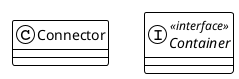
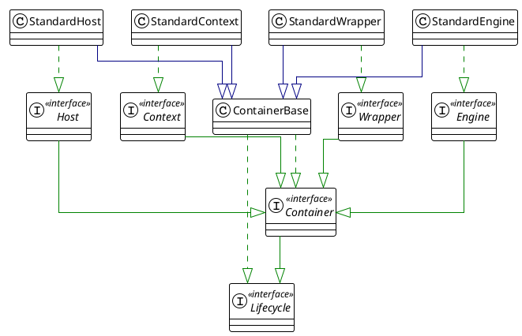
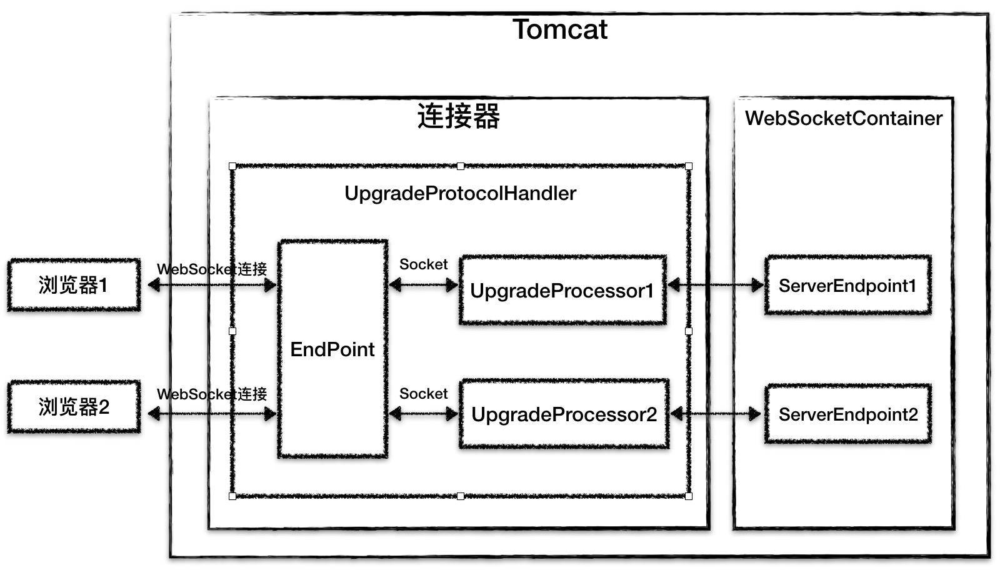
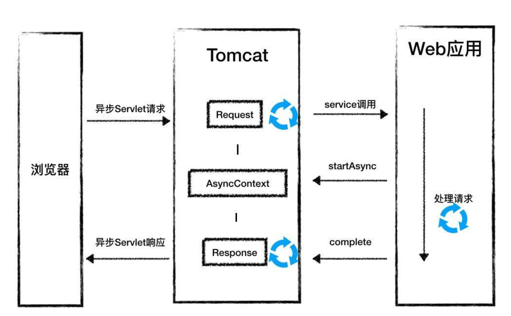

## Introduction

[Apache Tomcat® 软件](https://tomcat.apache.org/) 是 Jakarta [Servlet](/docs/CS/Java/JDK/Servlet.md)、Jakarta Server Pages、Jakarta Expression Language、Jakarta WebSocket、Jakarta Annotations 和 Jakarta Authentication 规范的开源实现。这些规范是 Jakarta EE 平台的一部分。

不同版本的 Apache Tomcat 适用于不同版本的规范。
规范与相应 [Apache Tomcat 版本](https://tomcat.apache.org/whichversion.html) 之间的映射关系请参考相关文档。

### Debug Tomcat

```shell
git clone git@github.com:apache/tomcat.git

git switch -c origin/10.1.x

# edit build.properties
base.path={project.absolute.path}/tomcat-build-libs

# Tomcat需要使用ant编译
ant ide-intellij
```

在 conf/tomcat-users.xml 中修改密码。

## Architecture

Catalina 是一个非常复杂的软件，设计优雅且实现精巧。
同时它也是模块化的。<br>
Catalina 由两个主要模块组成：[connector](/docs/CS/Framework/Tomcat/Connector.md) 和 [container](/docs/CS/Framework/Tomcat/Tomcat.md?id=Container)。

<div style="text-align: center;">



</div>

<p style="text-align: center;">
Fig.1. Tomcat architecture
</p>

详细类图如下：

<div style="text-align: center;">



</div>

<p style="text-align: center;">

```plantuml
@startuml

!theme plain
top to bottom direction
skinparam linetype ortho

class AbstractEndpoint<S, U>
class AbstractProtocol<S>
interface Adapter << interface >>
class ApplicationFilterChain
class Catalina
class Connector
interface Container << interface >>
interface Context << interface >>
class CoyoteAdapter
interface Engine << interface >>
interface Executor << interface >>
interface Host << interface >>
interface Lifecycle << interface >>
class Mapper
class MapperListener
interface Pipeline << interface >>
interface Processor << interface >>
interface ProtocolHandler << interface >>
interface Server << interface >>
interface Service << interface >>
interface Servlet << interface >>
class StandardPipeline
class StandardWrapper
interface Valve << interface >>
interface Wrapper << interface >>

AbstractProtocol       "1" *-[#595959,plain]-> "endpoint\n1" AbstractEndpoint   
AbstractProtocol       "1" *-[#595959,plain]-> "adapter\n1" Adapter            
AbstractProtocol       "1" *-[#595959,plain]-> "waitingProcessors\n*" Processor          
AbstractProtocol        -[#008200,dashed]-^  ProtocolHandler    
ApplicationFilterChain "1" *-[#595959,plain]-> "servlet\n1" Servlet            
Catalina               "1" *-[#595959,plain]-> "server\n1" Server             
Connector              "1" *-[#595959,plain]-> "adapter\n1" Adapter            
Connector               -[#595959,dashed]->  CoyoteAdapter          : "«create»"
Connector               -[#008200,dashed]-^  Lifecycle          
Connector              "1" *-[#595959,plain]-> "protocolHandler\n1" ProtocolHandler    
Connector              "1" *-[#595959,plain]-> "service\n1" Service            
Container               -[#008200,plain]-^  Lifecycle          
Context                 -[#008200,plain]-^  Container          
CoyoteAdapter           -[#008200,dashed]-^  Adapter            
CoyoteAdapter          "1" *-[#595959,plain]-> "connector\n1" Connector          
Engine                  -[#008200,plain]-^  Container          
Executor                -[#008200,plain]-^  Lifecycle          
Host                    -[#008200,plain]-^  Container          
Mapper                  -[#595959,dashed]->  Context                : "«create»"
Mapper                 "1" *-[#595959,plain]-> "contextObjectToContextVersionMap\n*" Context            
MapperListener          -[#008200,dashed]-^  Lifecycle          
MapperListener         "1" *-[#595959,plain]-> "mapper\n1" Mapper             
MapperListener         "1" *-[#595959,plain]-> "service\n1" Service            
Server                  -[#008200,plain]-^  Lifecycle          
Service                 -[#008200,plain]-^  Lifecycle          
StandardPipeline       "1" *-[#595959,plain]-> "container\n1" Container          
StandardPipeline        -[#008200,dashed]-^  Lifecycle          
StandardPipeline        -[#008200,dashed]-^  Pipeline           
StandardPipeline        -[#595959,dashed]->  Valve                  : "«create»"
StandardPipeline       "1" *-[#595959,plain]-> "basic\n1" Valve              
StandardWrapper         -[#008200,dashed]-^  Container          
StandardWrapper         -[#008200,dashed]-^  Lifecycle          
StandardWrapper        "1" *-[#595959,plain]-> "instance\n1" Servlet            
StandardWrapper         -[#008200,dashed]-^  Wrapper            
Wrapper                 -[#008200,plain]-^  Container          
@enduml

```

Fig.2. Tomcat 
</p>

请求处理流程图：

<div style="text-align: center;">



</div>

<p style="text-align: center;">

```dot
strict digraph  {
  rankdir=LR;
  autosize=false;
  size="15.0, 5";
  node [shape=box];

  User;

  Acceptor -> Poller
  Poller -> Executor
  Processor;
  Executor -> Processor 
  
  StanardEngineValve -> Host_Valve;
  Host_Valve -> StandardHostValve;
  StandardHostValve -> Context_Valve;
  Context_Valve -> StandardContextValve;
  StandardContextValve -> Wrapper_Valve_1;
  Wrapper_Valve_1 -> StandardWrapperValve;
  
   SocketWrapper -> Acceptor;
   SocketWrapper -> User;
  
    subgraph cluster_Server {
        label="Server"
 
  
    subgraph cluster_Service {
        label="Serice"
    
        Mapper;
        Mapper2[style=invis];
    
            {rank="same"; Mapper2;Mapper;}
        subgraph cluster_Connector {
            label="Connector"

            Executor [label=<Executor<BR/> <FONT POINT-SIZE="12">Thread Pool</FONT>>] ;

            subgraph cluster_ProtocolHandler {
                label="ProtocolHandler"
  
                    subgraph cluster_Endpoint {
                        label="Endpoint"
                        forcelabels= true
  
                        SocketWrapper;
                        Poller;
                        Acceptor;
                        
        
                        {rank="same"; SocketWrapper;Acceptor;Poller;}
                        LimitLatch;
                    }
                Processor;
  
                }
            Adapter;
            Processor -> Adapter;
            Adapter -> Mapper;
         
            {rank="same"; Executor;Processor;}
        }

        subgraph cluster_Engine {
            label="Engine"
        
              subgraph cluster_Engine_Pipeline {
                label="Pipeline"
                Engine_Valve [label="Valve"];
                
                StanardEngineValve[label="Stanard\nEngineValve"]
              }  
             Adapter -> Engine_Valve;
             Engine_Valve -> StanardEngineValve;
             subgraph cluster_Host {
                label="Host"
                subgraph cluster_Host_Pipeline {
                  label="Pipeline"
                  Host_Valve [label="Valve"];
                  
                  StandardHostValve[label="Standard\nHostValve"]
                }
                subgraph cluster_Context {
                    label="Context"
                    autosize=false;
                    size="10.0, 18.3";
                    subgraph cluster_Engine_Pipeline {
                      label="Pipeline"
                      Context_Valve [label="Valve"];
                      StandardContextValve[label="Standard\nContextValve"]
                    }  
                    subgraph cluster_Wrapper_1 {
                        label="Wrapper"
                    
                        subgraph cluster_Host_Pipeline {
                          label="Pipeline"
                          Wrapper_Valve_1 [label="Valve"];
                          StandardWrapperValve[label="Standard\nWrapperValve"]
                        }
                        StandardWrapperValve;
                        Servlet_1[label="Servlet"];
            
                        StandardWrapperValve -> Servlet_1 [headlabel="FilterChain"];
                    }
                
                }
  
            }
        }
    }
}
  User -> SocketWrapper;

}

```

Fig.3. Tomcat请求处理流程
</p>

- [start](/docs/CS/Framework/Tomcat/Start.md)
- [ClassLoader](/docs/CS/Framework/Tomcat/ClassLoader.md)

### Container

容器必须实现 `org.apache.catalina.Container`。

关于 Catalina 中的容器，首先需要注意的一点是，有四种处于不同概念层次的容器类型：

- **Engine**：代表整个 Catalina servlet 引擎。
- **Host**：代表一个包含多个 context 的虚拟主机。
- **Context**：代表一个 Web 应用。一个 context 包含一个或多个 wrapper。
- **Wrapper**：代表一个单独的 servlet。

以上每个概念层次都由 org.apache.catalina 包中的一个接口表示。这些接口是 Engine、Host、Context 和 Wrapper，它们都扩展了 Container 接口。
这四个容器的标准实现分别是 StandardEngine、StandardHost、StandardContext 和 StandardWrapper，它们都属于 org.apache.catalina.core 包。



注意：所有实现类都派生自抽象类 ContainerBase。

一个容器可以有零个或多个较低层次的子容器。
例如，一个 context 通常有一个或多个 wrapper，一个 host 可以有零个或多个 context。
然而，wrapper 作为层次结构中最底层的容器，不能包含子容器。
要向容器添加子容器，可以使用 Container 接口的 addChild 方法，其签名如下：

```java
public interface Container extends Lifecycle {
    void addChild(Container child);

    void removeChild(Container child);

    Container findChild(String name);

    Container[] findChildren();
}
```

一个容器还可以包含多个支持组件，如 Loader、Logger、Manager、Realm 和 Resources。
这里值得注意的一点是，Container 接口提供了 get 和 set 方法用于将自身与这些组件关联。
这些方法包括 getLoader 和 setLoader、getLogger 和 setLogger、getManager 和 setManager、getRealm 和 setRealm、getResources 和 setResources。
更有趣的是，Container 接口的设计使得在部署时，Tomcat 管理员可以通过编辑配置文件（server.xml）来确定容器执行的操作。
这是通过在容器中引入 pipeline 和一组 valve 来实现的。

#### Engine

Engine 是一个 Container，代表整个 Catalina servlet 引擎。它在以下场景中非常有用：

- 希望使用能够看到整个引擎处理的每个请求的 Interceptor。
- 希望在独立 HTTP connector 下运行 Catalina，但仍支持多个虚拟主机。

一般来说，当将 Catalina 部署到 Web 服务器（如 Apache）时，不需要使用 Engine，因为 Connector 将利用 Web 服务器的设施来确定哪个 Context（甚至可能是哪个 Wrapper）应该处理此请求。
附加到 Engine 的子容器通常是 Host（代表虚拟主机）或 Context（代表单个 servlet context）的实现，具体取决于 Engine 的实现。
如果使用 Engine，它始终是 Catalina 层次结构中的顶级 Container。因此，其实现的 setParent() 方法应抛出 IllegalArgumentException。

#### Context

Context 是一个 Container，代表 Catalina servlet 引擎中的 servlet context，因此也代表单个 Web 应用。
它在几乎所有的 Catalina 部署中都非常有用（即使连接到 Web 服务器（如 Apache）的 Connector 使用 Web 服务器的设施来识别适当的 Wrapper 来处理此请求）。
它还提供了一种便捷的机制来使用能够看到此特定 Web 应用处理的每个请求的 Interceptor。
**附加到 Context 的父 Container 通常是 Host，但也可以是其他实现，如果不需要也可以省略。**
附加到 Context 的子容器通常是 Wrapper（代表单个 servlet 定义）的实现。

#### Wrapper

Wrapper 是一个 Container，代表 Web 应用部署描述符中的单个 servlet 定义。
它提供了一种便捷的机制来使用能够看到此定义所代表的 servlet 的每个请求的 Interceptor。
Wrapper 的实现负责管理其底层 servlet 类的 servlet 生命周期，包括在适当的时间调用 init() 和 destroy()。
附加到 Wrapper 的父 Container 通常是 Context 的实现，代表此 servlet 执行的 servlet context（及 Web 应用）。
由于 wrapper 是最低级别的容器，不得向其添加子容器。
Wrapper 实现不允许有子 Container，因此 addChild() 方法应抛出 IllegalArgumentException。

### Server and Service

Server 元素代表整个 Catalina servlet 容器。
其属性代表整个 servlet 容器的特征。
一个 Server 可以包含一个或多个 Service，以及顶级的命名资源集。
通常，此接口的实现也会实现 Lifecycle，这样当调用 start() 和 stop() 方法时，所有定义的 Service 也会被启动或停止。
在此期间，实现必须在 port 属性指定的端口号上打开一个 server socket。当接受连接时，读取第一行并与指定的 shutdown 命令进行比较。
如果命令匹配，则启动服务器关闭。

- `JreMemoryLeakPreventionListener`：为 Java 运行时环境中可能导致内存泄漏或文件锁定的已知问题提供解决方法。
  当 JRE 代码使用上下文类加载器加载单例时会发生内存泄漏，因为如果此时 Web 应用类加载器恰好是上下文类加载器，就会导致内存泄漏。
  解决方法是：在 Tomcat 的公共类加载器是上下文类加载器时初始化这些单例。
  文件锁定通常发生在未先禁用 Jar URL 连接缓存的情况下访问 JAR 内的资源时。解决方法是默认禁用此缓存。
- `ThreadLocalLeakPreventionListener`：一个 LifecycleListener，在 Context 停止时触发现 Executor 池中的线程更新，以避免与 thread-local 相关的内存泄漏。
  注意：活跃线程将在执行完任务返回池后逐一更新，请参见 ThreadPoolExecutor.afterExecute()。

Service 组件封装了一个容器和一个或多个 connector。

`org.apache.catalina.core.StandardService` 类是 Service 的标准实现。
StandardService 类的 initialize 方法初始化所有添加到 service 中的 connector。
StandardService 实现了 Service 以及 `org.apache.catalina.Lifecycle` 接口。
其 start 方法启动容器和所有 connector。

一个 StandardService 实例包含两种类型的组件：一个容器和一个或多个 connector。
能够拥有多个 connector 使得 Tomcat 可以支持多种协议。
一个 connector 用于处理 HTTP 请求，另一个用于处理 HTTPS 请求。

Service 接口的标准实现。关联的 Container 通常是 Engine 的实例，但这不是必需的。

```java
public class StandardService extends LifecycleMBeanBase implements Service {

    protected Connector connectors[] = new Connector[0];

    private Engine engine = null;
}
```

### Pipeline

Pipeline 包含容器将要调用的任务。
Valve 代表一个特定的任务。
容器的 pipeline 中有一个 basic valve，但你可以添加任意数量的 valve。
valve 的数量定义为附加 valve 的数量，即不包括 basic valve。
有趣的是，可以通过编辑 Tomcat 的配置文件（server.xml）动态添加 valve。

如果你理解 servlet filter，就不难想象 pipeline 及其 valve 的工作原理。
Pipeline 就像一个 filter chain，每个 valve 就像一个 filter。与 filter 一样，valve 可以操作传递给它的 request 和 response 对象。
valve 完成处理后，它会调用 pipeline 中的下一个 valve。basic valve 总是最后一个被调用。

一个容器可以拥有一个 pipeline。
当容器的 invoke 方法被调用时，容器将处理交给它的 pipeline，pipeline 调用其中的第一个 valve，然后该 valve 调用下一个，依此类推，直到 pipeline 中没有更多 valve。

容器不会硬编码在 connector 调用其 invoke 方法时应该执行的操作。
相反，容器调用其 pipeline 的 invoke 方法。

```java
public interface Valve {
    void invoke(Request request, Response response) throws IOException, ServletException;
}
```

Valve 是一个与特定 Container 关联的请求处理组件。
一系列 Valve 通常相互关联成一个 Pipeline。
Valve 的详细约定包含在下面的 invoke() 方法描述中。
历史说明：之所以选择 "Valve" 这个名称，是因为在现实世界的管道中，valve 用于控制和/或修改流经管道的流量。

```java
public class CoyoteAdapter implements Adapter {
    @Override
    public boolean asyncDispatch(org.apache.coyote.Request req, org.apache.coyote.Response res, SocketEvent status) throws Exception {
        // ...
        connector.getService().getContainer().getPipeline().getFirst().invoke(request, response);
        // ...
    }
}
```

## Session

在 Java 中，是 Web 应用程序在调用 HttpServletRequest 的 getSession 方法时，由 Web 容器（比如 Tomcat）创建的。

服务端生成 session id 通过 set-cookie 放在响应 header 中。

Tomcat 的 Session 管理器提供了多种持久化方案来存储 Session，通常会采用高性能的存储方式，比如 Redis，并且通过集群部署的方式，防止单点故障，从而提升高可用。同时，Session 有过期时间，因此 Tomcat 会开启后台线程定期的轮询，如果 Session 过期了就将 Session 失效。

## Log

## DefaultServlet

大多数 Web 应用的默认资源服务 servlet，用于提供静态资源如 HTML 页面和图片。

此 servlet 通常映射到 /，例如：

```xml
<servlet-mapping>
    <servlet-name>default</servlet-name>
    <url-pattern>/</url-pattern>
</servlet-mapping>
```

输入输出缓冲区。

```java
protected void serveResource(HttpServletRequest request,
                               HttpServletResponse response,
                               boolean content,
                               String inputEncoding)
          throws IOException, ServletException {
      // omitted 
      // Check if the conditions specified in the optional If headers are
      // satisfied.
      if (resource.isFile()) {
        // Checking If headers
        included = (request.getAttribute(
                RequestDispatcher.INCLUDE_CONTEXT_PATH) != null);
        if (!included && !isError && !checkIfHeaders(request, response, resource)) {
          return;
        }
      }
}
```

checkIfHeaders

- Etag：If-None-Match
- Last-Modified：If-Modified-Since

```java
public class DefaultServlet {
  protected boolean checkIfHeaders(HttpServletRequest request,
                                   HttpServletResponse response,
                                   WebResource resource)
          throws IOException {

    return checkIfMatch(request, response, resource)
            && checkIfModifiedSince(request, response, resource)
            && checkIfNoneMatch(request, response, resource)
            && checkIfUnmodifiedSince(request, response, resource);

  }

  protected boolean checkIfNoneMatch(HttpServletRequest request, HttpServletResponse response, WebResource resource)
          throws IOException {

    String headerValue = request.getHeader("If-None-Match");
    if (headerValue != null) {

      boolean conditionSatisfied;

      String resourceETag = generateETag(resource);
      if (!headerValue.equals("*")) {
        if (resourceETag == null) {
          conditionSatisfied = false;
        } else {
          // RFC 7232 requires weak comparison for If-None-Match headers
          Boolean matched = EntityTag.compareEntityTag(new StringReader(headerValue), true, resourceETag);
          if (matched == null) {
            if (debug > 10) {
              log("DefaultServlet.checkIfNoneMatch:  Invalid header value [" + headerValue + "]");
            }
            response.sendError(HttpServletResponse.SC_BAD_REQUEST);
            return false;
          }
          conditionSatisfied = matched.booleanValue();
        }
      } else {
        conditionSatisfied = true;
      }

      if (conditionSatisfied) {
        // For GET and HEAD, we should respond with
        // 304 Not Modified.
        // For every other method, 412 Precondition Failed is sent
        // back.
        if ("GET".equals(request.getMethod()) || "HEAD".equals(request.getMethod())) {
          response.setStatus(HttpServletResponse.SC_NOT_MODIFIED);
          response.setHeader("ETag", resourceETag);
        } else {
          response.sendError(HttpServletResponse.SC_PRECONDITION_FAILED);
        }
        return false;
      }
    }
    return true;
  }
}
```

CacheResource

如果 `cachingAllowed` 标志为 true，则将使用静态资源缓存。
如果未指定，该标志的默认值为 true。
此值可以在 Web 应用程序运行时更改（例如通过 JMX）。
当缓存被禁用时，缓存中的所有资源都将被清除。

静态资源缓存的最大大小（以 KB 为单位）。
如果未指定 `cacheMaxSize`，默认值为 10240（10 MB）。
此值可以在 Web 应用程序运行时更改（例如通过 JMX）。
如果缓存使用的内存超过新限制，缓存将尝试随时间减少大小以满足新限制。
如有必要，cacheObjectMaxSize 将被减小，以确保其不超过 cacheMaxSize/20。

缓存条目重新验证之间的时间间隔（以毫秒为单位）。
如果未指定 `cacheTtl`，默认值为 5000（5 秒）。
此值可以在 Web 应用程序运行时更改（例如通过 JMX）。
当资源被缓存时，它将继承缓存时的 TTL，并保持该 TTL 直到资源从缓存中被逐出，无论此后对该属性进行任何更改。

```java
public class StandardRoot extends LifecycleMBeanBase implements WebResourceRoot {
  protected WebResource getResource(String path, boolean validate,
                                    boolean useClassLoaderResources) {
    if (validate) {
      path = validate(path);
    }

    if (isCachingAllowed()) {
      return cache.getResource(path, useClassLoaderResources);
    } else {
      return getResourceInternal(path, useClassLoaderResources);
    }
  }
}
```

## WebSocket

跟 Servlet 不同的地方在于，Tomcat 会给每一个 WebSocket 连接创建一个 Endpoint 实例。

Tomcat 的 WebSocket 加载是通过 ServletContainerInitializer 机制完成。

UpgradeProcessor

当 WebSocket 的握手请求到来时，HttpProtocolHandler 首先接收到这个请求，在处理这个 HTTP 请求时，Tomcat 通过一个特殊的 Filter 判断该 HTTP 请求是否是一个 WebSocket Upgrade 请求（即包含 Upgrade:websocket 的 HTTP 头信息），如果是，则在 HTTP 响应里添加 WebSocket 相关的响应头信息，并进行协议升级。

用 UpgradeProtocolHandler 替换当前的 HttpProtocolHandler，相应的，把当前 Socket 的 Processor 替换成 UpgradeProcessor，同时 Tomcat 会创建 WebSocket Session 实例和 Endpoint 实例，并跟当前的 WebSocket 连接一一对应起来。
这个 WebSocket 连接不会立即关闭，并且在请求处理中，不再使用原有的 HttpProcessor，而是用专门的 UpgradeProcessor，UpgradeProcessor 最终会调用相应的 Endpoint 实例来处理请求。



Tomcat 对 WebSocket 请求的处理没有经过 Servlet 容器，而是通过 UpgradeProcessor 组件直接把请求发到 ServerEndpoint 实例，并且 Tomcat 的 WebSocket 实现不需要关注具体 I/O 模型的细节，从而实现了与具体 I/O 方式的解耦。

## 对象池

Tomcat 连接器中 SocketWrapper 和 SocketProcessor。

SynchronizedStack 内部维护了一个对象数组，并且用数组来实现栈的接口：push 和 pop 方法，这两个方法分别用来归还对象和获取对象。

SynchronizedStack 用数组而不是链表来维护对象，可以减少结点维护的内存开销，并且它本身只支持扩容不支持缩容，也就是说数组对象在使用过程中不会被重新赋值，也就不会被 GC。
这样设计的目的是用最低的内存和 GC 的代价来实现无界容器，同时 Tomcat 的最大同时请求数是有限制的，因此不需要担心对象的数量会无限膨胀。

## Adavance

### background

热加载：后台线程监听类文件变化，不会清空 session，常用于开发环境。

热部署：同上，会清空 session，适合生产环境。

用于在固定延迟后调用此容器及其子容器的 backgroundProcess 方法的私有 runnable 类。

在顶层容器，也就是 Engine 容器中启动一个后台线程，那么这个线程不但会执行 Engine 容器的周期性任务，它还会执行所有子容器的周期性任务。

```java
protected class ContainerBackgroundProcessor implements Runnable {

    @Override
    public void run() {
        processChildren(ContainerBase.this);
    }

    protected void processChildren(Container container) {
        ClassLoader originalClassLoader = null;

        try {
            if (container instanceof Context) {
                Loader loader = ((Context) container).getLoader();
                // Loader will be null for FailedContext instances
                if (loader == null) {
                    return;
                }

                // Ensure background processing for Contexts and Wrappers is performed under the web app's class loader
                originalClassLoader = ((Context) container).bind(false, null);
            }
            container.backgroundProcess();
            Container[] children = container.findChildren();
            for (int i = 0; i < children.length; i++) {
                if (children[i].getBackgroundProcessorDelay() <= 0) {
                    processChildren(children[i]);
                }
            }
        } catch (Throwable t) {
            ExceptionUtils.handleThrowable(t);
            log.error(sm.getString("containerBase.backgroundProcess.error"), t);
        } finally {
            if (container instanceof Context) {
                ((Context) container).unbind(false, originalClassLoader);
            }
        }
    }
}
```

#### backgroundProcess

```java
public class StandardContext extends ContainerBase implements Context, NotificationEmitter {
    @Override
    public void backgroundProcess() {
        Loader loader = getLoader();
        if (loader != null) {
            loader.backgroundProcess();
        }
        // ...
    }
}
```

执行周期性任务，例如重新加载等。此方法将在该容器的类加载上下文中调用。意外的 throwable 将被捕获并记录。

```java
public class WebappLoader extends LifecycleMBeanBase implements Loader {
    @Override
    public void backgroundProcess() {
        Context context = getContext();
        if (context != null) {
            if (context.getReloadable() && modified()) {
                ClassLoader originalTccl = Thread.currentThread().getContextClassLoader();
                try {
                    Thread.currentThread().setContextClassLoader(WebappLoader.class.getClassLoader());
                    context.reload();
                } finally {
                    Thread.currentThread().setContextClassLoader(originalTccl);
                }
            }
        }
    }
}
```

#### reload

在 context 层级实现热加载，通过创建新的类加载器来实现重新加载。

如果支持重新加载，则重新加载此 Web 应用。
**此方法设计用于处理因类加载器底层仓库中的类更改以及 web.xml 文件的更改而需要的重新加载。**
它不处理 context.xml 文件的任何更改。
如果 context.xml 已更改，应停止此 Context 并创建（并启动）一个新的 Context 实例。
注意，CoyoteAdapter#postParseRequest() 中有额外代码用于处理将请求映射到已暂停的 Context。

```java
public class StandardContext extends ContainerBase implements Context, NotificationEmitter {
  @Override
    public synchronized void reload() {

    // Validate our current component state

    // Stop accepting requests temporarily.
    setPaused(true);

    stop();

    start();

    setPaused(false);
  }
}
```

#### 热部署

热部署过程中 Context 容器被销毁了，执行行为在 Host。

HostConfig 做的事情都是比较"宏观"的，它不会去检查具体类文件或者资源文件是否有变化，而是检查 Web 应用目录级别的变化。

```java
public class HostConfig implements LifecycleListener {
  protected void check() {

        if (host.getAutoDeploy()) {
            // Check for resources modification to trigger redeployment
            DeployedApplication[] apps = deployed.values().toArray(new DeployedApplication[0]);
            for (DeployedApplication app : apps) {
                if (tryAddServiced(app.name)) {
                    try {
                        checkResources(app, false);
                    } finally {
                        removeServiced(app.name);
                    }
                }
            }

            // Check for old versions of applications that can now be undeployed
            if (host.getUndeployOldVersions()) {
                checkUndeploy();
            }

            // Hotdeploy applications
            deployApps();
        }
    }
}
```

热部署只是监听粗粒度的事件即可，不需要重写 backgroundProcessor 做定时任务。

### ASync

Tomcat 中，负责 flush 响应数据的是 CoyoteAdaptor，它还会销毁 Request 对象和 Response 对象。
连接器是调用 CoyoteAdapter 的 service 方法来处理请求的，而 CoyoteAdapter 会调用容器的 service 方法，当容器的 service 方法返回时，CoyoteAdapter 判断当前的请求是不是异步 Servlet 请求，如果是，就不会销毁 Request 和 Response 对象，也不会把响应信息发到浏览器。

```
this.request.getCoyoteRequest().action(ActionCode.ASYNC_START, this);
```

使用 ConcurrentHashMap 缓存 SocketWrapper 和 Processor 的映射。



### Metrics

JMX

```shell
#setenv.sh
export JAVA_OPTS="${JAVA_OPTS} -Dcom.sun.management.jmxremote"
export JAVA_OPTS="${JAVA_OPTS} -Dcom.sun.management.jmxremote.port=9001"
export JAVA_OPTS="${JAVA_OPTS} -Djava.rmi.server.hostname=x.x.x.x"
export JAVA_OPTS="${JAVA_OPTS} -Dcom.sun.management.jmxremote.ssl=false"
export JAVA_OPTS="${JAVA_OPTS} -Dcom.sun.management.jmxremote.authenticate=false"
```

## Tuning

### 启动速度

清理不必要的 Web 应用，删除掉 webapps 文件夹下不需要的工程，一般是 host-manager、example、doc 等这些默认的工程。

Tomcat 在启动的时候会解析所有的 XML 配置文件，但 XML 解析的代价可不小，因此我们要尽量保持配置文件的简洁，需要解析的东西越少，速度自然就会越快。

删除所有不需要的 JAR 文件。JVM 的类加载器在加载类时，需要查找每一个 JAR 文件，去找到所需要的类。如果删除了不需要的 JAR 文件，查找的速度就会快一些。这里请注意：Web 应用中的 lib 目录下不应该出现 Servlet API 或者 Tomcat 自身的 JAR，这些 JAR 由 Tomcat 负责提供。如果你是使用 Maven 来构建你的应用，对 Servlet API 的依赖应该指定为 `<scope>provided</scope>`。

及时清理日志，删除 logs 文件夹下不需要的日志文件。同样还有 work 文件夹下的 catalina 文件夹，它其实是 Tomcat 把 JSP 转换为 Class 文件的工作目录。有时候我们也许会遇到修改了代码，重启了 Tomcat，但是仍没效果，这时候便可以删除掉这个文件夹，Tomcat 下次启动的时候会重新生成。

Tomcat 为了支持 JSP，在应用启动的时候会扫描 JAR 包里面的 TLD 文件，加载里面定义的标签库。

如果你的项目没有使用 JSP 作为 Web 页面模板，而是使用 Velocity 之类的模板引擎，你完全可以把 TLD 扫描禁止掉。方法是，找到 Tomcat 的 conf/目录下的 context.xml 文件，在这个文件里 Context 标签下，加上 JarScanner 和 JarScanFilter 子标签，像下面这样。

```xml
<Context>
  <JarScanner>
    <JarScanFilter defaultTldScan="false"/>
  </JarScanner>
</Context>
```

如果你的项目使用了 JSP 作为 Web 页面模块，意味着 TLD 扫描无法避免，但是我们可以通过配置来告诉 Tomcat，只扫描那些包含 TLD 文件的 JAR 包。方法是，找到 Tomcat 的 conf/目录下的 catalina.properties 文件，在这个文件里的 jarsToSkip 配置项中，加上你的 JAR 包。

```properties
tomcat.util.scan.StandardJarScanFilter.jarsToSkip=xxx.jar
```

关闭 WebSocket 支持。

关闭 JSP 支持。

因此如果你没有使用 Servlet 注解这个功能，可以告诉 Tomcat 不要去扫描 Servlet 注解。

配置 Web-Fragment 扫描。

Tomcat 7 以上的版本依赖 Java 的 SecureRandom 类来生成随机数，比如 Session ID。而 JVM 默认使用阻塞式熵源（/dev/random），在某些情况下就会导致 Tomcat 启动变慢。当阻塞时间较长时，你会看到这样一条警告日志：
解决方案是通过设置，让 JVM 使用非阻塞式的熵源。
`-Djava.security.egd=file:/dev/./urandom`

去除 AJP。

并行启动多个 Web 应用 Host。

JVM tuning。

### 故障处理

## Links

## References

1. [JSR 356, Java API for WebSocket](https://www.oracle.com/technical-resources/articles/java/jsr356.html)
