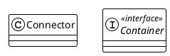
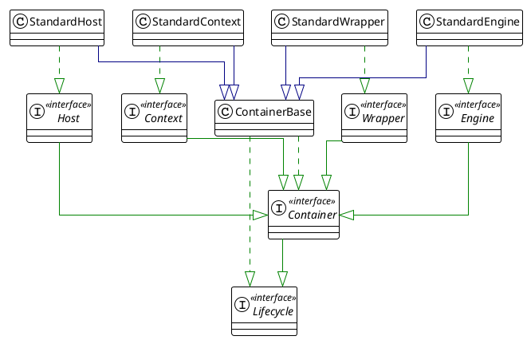
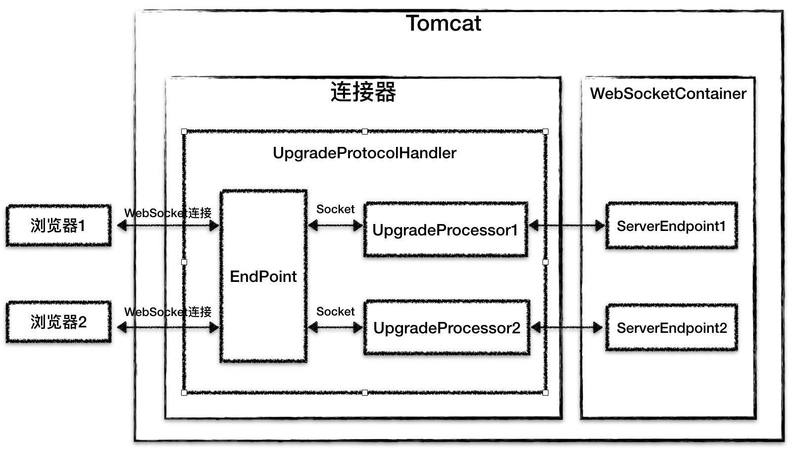
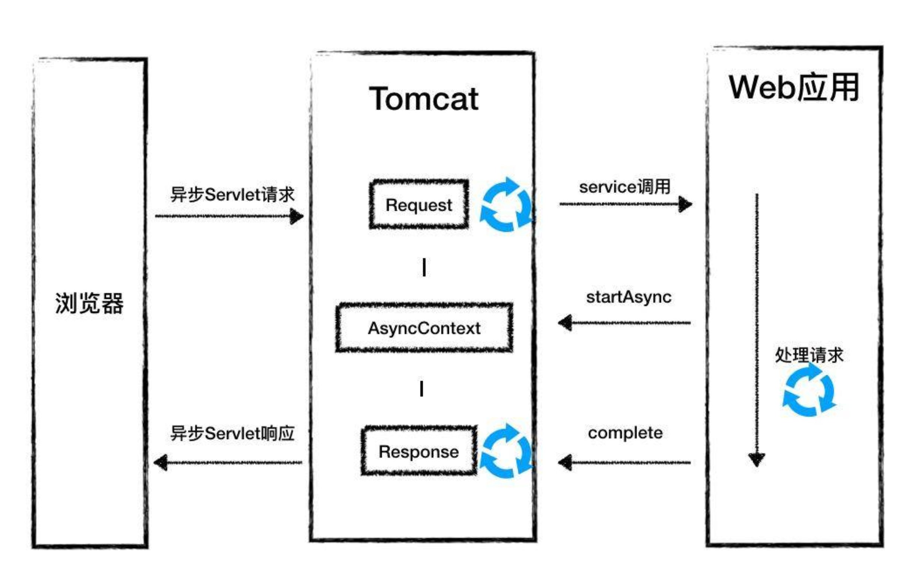

## Introduction

[The Apache Tomcat® software](https://tomcat.apache.org/) is an open source implementation of the Jakarta [Servlet](/docs/CS/Java/JDK/Servlet.md), Jakarta Server Pages, Jakarta Expression Language, Jakarta WebSocket, Jakarta Annotations and Jakarta Authentication specifications. These specifications are part of the Jakarta EE platform.

Different versions of Apache Tomcat are available for different versions of the specifications.
The mapping between the specifications and the respective [Apache Tomcat Versions](https://tomcat.apache.org/whichversion.html).

读下面所有小节之前先校准版本坐标：本页与 [Connector](/docs/CS/Framework/Tomcat/Connector.md)、[threads](/docs/CS/Framework/Tomcat/threads.md) 等篇按 9.0/10.1 时代的源码摘写，机制叙述成立但类名与默认值已在 11 变化（`AbstractJsseEndpoint`、`-ClientPoller`、APR 后端、`maxParameterCount` 等）。哪些结论过期、哪些符号已消失，统一记在 [Version_Migration](/docs/CS/Framework/Tomcat/Version_Migration.md)，该篇同时充当子树的勘误表。


### Debug Tomcat

```shell
git clone git@github.com:apache/tomcat.git

git switch -c origin/10.1.x

# edit build.properties
base.path={project.absolute.path}/tomcat-build-libs

# Tomcat需要使用ant编译
ant ide-intellij
```

change password in conf/tomcat-users.xml

## Architecture


Catalina is a very sophisticated piece of software, which was elegantly designed and developed.
It is also modular too.<br>
Catalina is consisting of two main modules: the [connector](/docs/CS/Framework/Tomcat/Connector.md) and the [container](/docs/CS/Framework/Tomcat/Tomcat.md?id=container).

Connector 与 Container 描述的是「请求怎么流动」。在这棵树起来之后，还有第三个方向的问题：应用是怎么被塞进这棵树的 —— war 落盘、展开、描述符合并、Context 启动这条链，以及绕开 `server.xml` 的内嵌编程入口，见 [Deployment](/docs/CS/Framework/Tomcat/Deployment.md)。


<div style="text-align: center;">


```plantuml
@startuml

!theme plain
top to bottom direction
skinparam linetype ortho

class Connector
interface Container << interface >>

@enduml
```

</div>

<p style="text-align: center;">
Fig.1. Tomcat architecture
</p>

详细类图如下:

<div style="text-align: center;">


```plantuml
@startuml

!theme plain
top to bottom direction
skinparam linetype ortho

class AbstractEndpoint<S, U>
class AbstractProtocol<S>
interface Adapter << interface >>
class ApplicationFilterChain
class Catalina
class Connector
interface Container << interface >>
interface Context << interface >>
class CoyoteAdapter
interface Engine << interface >>
interface Executor << interface >>
interface Host << interface >>
interface Lifecycle << interface >>
class Mapper
class MapperListener
interface Pipeline << interface >>
interface Processor << interface >>
interface ProtocolHandler << interface >>
interface Server << interface >>
interface Service << interface >>
interface Servlet << interface >>
class StandardPipeline
class StandardWrapper
interface Valve << interface >>
interface Wrapper << interface >>

AbstractProtocol       "1" *-[#595959,plain]-> "endpoint\n1" AbstractEndpoint   
AbstractProtocol       "1" *-[#595959,plain]-> "adapter\n1" Adapter            
AbstractProtocol       "1" *-[#595959,plain]-> "waitingProcessors\n*" Processor          
AbstractProtocol        -[#008200,dashed]-^  ProtocolHandler    
ApplicationFilterChain "1" *-[#595959,plain]-> "servlet\n1" Servlet            
Catalina               "1" *-[#595959,plain]-> "server\n1" Server             
Connector              "1" *-[#595959,plain]-> "adapter\n1" Adapter            
Connector               -[#595959,dashed]->  CoyoteAdapter          : "«create»"
Connector               -[#008200,dashed]-^  Lifecycle          
Connector              "1" *-[#595959,plain]-> "protocolHandler\n1" ProtocolHandler    
Connector              "1" *-[#595959,plain]-> "service\n1" Service            
Container               -[#008200,plain]-^  Lifecycle          
Context                 -[#008200,plain]-^  Container          
CoyoteAdapter           -[#008200,dashed]-^  Adapter            
CoyoteAdapter          "1" *-[#595959,plain]-> "connector\n1" Connector          
Engine                  -[#008200,plain]-^  Container          
Executor                -[#008200,plain]-^  Lifecycle          
Host                    -[#008200,plain]-^  Container          
Mapper                  -[#595959,dashed]->  Context                : "«create»"
Mapper                 "1" *-[#595959,plain]-> "contextObjectToContextVersionMap\n*" Context            
MapperListener          -[#008200,dashed]-^  Lifecycle          
MapperListener         "1" *-[#595959,plain]-> "mapper\n1" Mapper             
MapperListener         "1" *-[#595959,plain]-> "service\n1" Service            
Server                  -[#008200,plain]-^  Lifecycle          
Service                 -[#008200,plain]-^  Lifecycle          
StandardPipeline       "1" *-[#595959,plain]-> "container\n1" Container          
StandardPipeline        -[#008200,dashed]-^  Lifecycle          
StandardPipeline        -[#008200,dashed]-^  Pipeline           
StandardPipeline        -[#595959,dashed]->  Valve                  : "«create»"
StandardPipeline       "1" *-[#595959,plain]-> "basic\n1" Valve              
StandardWrapper         -[#008200,dashed]-^  Container          
StandardWrapper         -[#008200,dashed]-^  Lifecycle          
StandardWrapper        "1" *-[#595959,plain]-> "instance\n1" Servlet            
StandardWrapper         -[#008200,dashed]-^  Wrapper            
Wrapper                 -[#008200,plain]-^  Container          
@enduml

```


</div>

<p style="text-align: center;">
Fig.2. Tomcat 
</p>

请求处理流程图:

<div style="text-align: center;">



```dot
strict digraph  {
  rankdir=LR;
  autosize=false;
  size="15.0, 5";
  node [shape=box];

  User;

  Acceptor -> Poller
  Poller -> Executor
  Processor;
  Executor -> Processor 
  
  StanardEngineValve -> Host_Valve;
  Host_Valve -> StandardHostValve;
  StandardHostValve -> Context_Valve;
  Context_Valve -> StandardContextValve;
  StandardContextValve -> Wrapper_Valve_1;
  Wrapper_Valve_1 -> StandardWrapperValve;
  
   SocketWrapper -> Acceptor;
   SocketWrapper -> User;
  
    subgraph cluster_Server {
        label="Server"
 
  
    subgraph cluster_Service {
        label="Serice"
    
        Mapper;
        Mapper2[style=invis];
    
            {rank="same"; Mapper2;Mapper;}
        subgraph cluster_Connector {
            label="Connector"

            Executor [label=<Executor<BR/> <FONT POINT-SIZE="12">Thread Pool</FONT>>] ;

            subgraph cluster_ProtocolHandler {
                label="ProtocolHandler"
  
                    subgraph cluster_Endpoint {
                        label="Endpoint"
                        forcelabels= true
  
                        SocketWrapper;
                        Poller;
                        Acceptor;
                        
        
                        {rank="same"; SocketWrapper;Acceptor;Poller;}
                        LimitLatch;
                    }
                Processor;
  
                }
            Adapter;
            Processor -> Adapter;
            Adapter -> Mapper;
         
            {rank="same"; Executor;Processor;}
        }

        subgraph cluster_Engine {
            label="Engine"
        
              subgraph cluster_Engine_Pipeline {
                label="Pipeline"
                Engine_Valve [label="Valve"];
                
                StanardEngineValve[label="Stanard\nEngineValve"]
              }  
             Adapter -> Engine_Valve;
             Engine_Valve -> StanardEngineValve;
             subgraph cluster_Host {
                label="Host"
                subgraph cluster_Host_Pipeline {
                  label="Pipeline"
                  Host_Valve [label="Valve"];
                  
                  StandardHostValve[label="Standard\nHostValve"]
                }
                subgraph cluster_Context {
                    label="Context"
                    autosize=false;
                    size="10.0, 18.3";
                    subgraph cluster_Engine_Pipeline {
                      label="Pipeline"
                      Context_Valve [label="Valve"];
                      StandardContextValve[label="Standard\nContextValve"]
                    }  
                    subgraph cluster_Wrapper_1 {
                        label="Wrapper"
                    
                        subgraph cluster_Host_Pipeline {
                          label="Pipeline"
                          Wrapper_Valve_1 [label="Valve"];
                          StandardWrapperValve[label="Standard\nWrapperValve"]
                        }
                        StandardWrapperValve;
                        Servlet_1[label="Servlet"];
            
                        StandardWrapperValve -> Servlet_1 [headlabel="FilterChain"];
                    }
                
                }
  
            }
        }
    }
}
  User -> SocketWrapper;

}

```


</div>

<p style="text-align: center;">
Fig.3. Tomcat请求处理流程
</p>


- [start](/docs/CS/Framework/Tomcat/Start.md)
- [ClassLoader](/docs/CS/Framework/Tomcat/ClassLoader.md)

### Container

A container must implement `org.apache.catalina.Container`.

The first thing to note about containers in Catalina is that there are four types of containers at different conceptual levels:

- **Engine**. Represents the entire Catalina servlet engine.
- **Host**. Represents a virtual host with a number of contexts.
- **Context**. Represents a web application. A context contains one or more wrappers.
- **Wrapper**. Represents an individual servlet.

Each conceptual level above is represented by an interface in the org.apache.catalina package.
These interfaces are Engine, Host, Context, and Wrapper. All the four extends the Container interface.
Standard implementations of the four containers are StandardEngine, StandardHost, StandardContext, and StandardWrapper, respectively, all of which are part of the org.apache.catalina.core package.


```plantuml
@startuml

!theme plain
top to bottom direction
skinparam linetype ortho

interface Container << interface >>
class ContainerBase
interface Context << interface >>
interface Engine << interface >>
interface Host << interface >>
interface Lifecycle << interface >>
class StandardContext
class StandardEngine
class StandardHost
class StandardWrapper
interface Wrapper << interface >>

Container        -[#008200,plain]-^  Lifecycle   
ContainerBase    -[#008200,dashed]-^  Container   
ContainerBase    -[#008200,dashed]-^  Lifecycle   
Context          -[#008200,plain]-^  Container   
Engine           -[#008200,plain]-^  Container   
Host             -[#008200,plain]-^  Container   
StandardContext  -[#000082,plain]-^  ContainerBase   
StandardContext  -[#008200,dashed]-^  Context   
StandardEngine   -[#000082,plain]-^  ContainerBase   
StandardEngine   -[#008200,dashed]-^  Engine  
StandardHost     -[#000082,plain]-^  ContainerBase   
StandardHost     -[#008200,dashed]-^  Host  
StandardWrapper  -[#000082,plain]-^  ContainerBase   
StandardWrapper  -[#008200,dashed]-^  Wrapper   
Wrapper          -[#008200,plain]-^  Container   
@enduml

```

Note All implementation classes derive from the abstract class ContainerBase.

A container can have zero or more child containers of the lower level.
For instance, a context normally has one or more wrappers and a host can have zero or more contexts.
However, a wrapper, being the lowest in the 'hierarchy', cannot contain a child container.
To add a child container to a container, you use the Container interface's addChild method whose signature is as follows.

```java
public interface Container extends Lifecycle {
    void addChild(Container child);

    void removeChild(Container child);

    Container findChild(String name);

    Container[] findChildren();
}
```

A container can also contain a number of support components such as Loader, Logger, Manager, Realm, and Resources.
One thing worth noting here is that the Container interface provides the get and set methods for associating itself with those components.
These methods include getLoader and setLoader, getLogger and setLogger, getManager and
setManager, getRealm and setRealm, and getResources and setResources.
More interestingly, the Container interface has been designed in such a way that at the time of deployment a Tomcat administrator can determine what a container performs by editing the configuration file (server.xml).
This is achieved by introducing a pipeline and a set of valves in a container.

#### Engine

An Engine is a Container that represents the entire Catalina servlet engine. It is useful in the following types of scenarios:

- You wish to use Interceptors that see every single request processed by the entire engine.
- You wish to run Catalina in with a standalone HTTP connector, but still want support for multiple virtual hosts.

In general, you would not use an Engine when deploying Catalina connected to a web server (such as Apache), because the Connector will have utilized the web server's facilities to determine which Context (or perhaps even which Wrapper) should be utilized to process this request.
The child containers attached to an Engine are generally implementations of Host (representing a virtual host) or Context (representing individual an individual servlet context), depending upon the Engine implementation.
If used, an Engine is always the top level Container in a Catalina hierarchy. Therefore, the implementation's setParent() method should throw IllegalArgumentException.

#### Context

A Context is a Container that represents a servlet context, and therefore an individual web application, in the Catalina servlet engine.
It is therefore useful in almost every deployment of Catalina (even if a Connector attached to a web server (such as Apache) uses the web server's facilities to identify the appropriate Wrapper to handle this request.
It also provides a convenient mechanism to use Interceptors that see every request processed by this particular web application.
**The parent Container attached to a Context is generally a Host, but may be some other implementation, or may be omitted if it is not necessary.**
The child containers attached to a Context are generally implementations of Wrapper (representing individual servlet definitions).

#### Wrapper

A Wrapper is a Container that represents an individual servlet definition from the deployment descriptor of the web application.
It provides a convenient mechanism to use Interceptors that see every single request to the servlet represented by this definition.
Implementations of Wrapper are responsible for managing the servlet life cycle for their underlying servlet class, including calling init() and destroy() at appropriate times.
The parent Container attached to a Wrapper will generally be an implementation of Context, representing the servlet context (and therefore the web application) within which this servlet executes.
Since a wrapper is the lowest level of container, you must not add a child to it.
Child Containers are not allowed on Wrapper implementations, so the addChild() method should throw an IllegalArgumentException.

### Server and Service

A Server element represents the entire Catalina servlet container.
Its attributes represent the characteristics of the servlet container as a whole.
A Server may contain one or more Services, and the top level set of naming resources.
Normally, an implementation of this interface will also implement Lifecycle, such that when the start() and stop() methods are called, all of the defined Services are also started or stopped.
In between, the implementation must open a server socket on the port number specified by the port property. When a connection is accepted, the first line is read and compared with the specified shutdown command.
If the command matches, shutdown of the server is initiated.

- `JreMemoryLeakPreventionListener` Provide a workaround for known places where the Java Runtime environment can cause a memory leak or lock files.
  Memory leaks occur when JRE code uses the context class loader to load a singleton as this will cause a memory leak if a web application class loader happens to be the context class loader at the time. 
  The work-around is to initialise these singletons when Tomcat's common class loader is the context class loader.
  Locked files usually occur when a resource inside a JAR is accessed without first disabling Jar URL connection caching. The workaround is to disable this caching by default.
- `ThreadLocalLeakPreventionListener` A LifecycleListener that triggers the renewal of threads in Executor pools when a Context is being stopped to avoid thread-local related memory leaks.
  Note : active threads will be renewed one by one when they come back to the pool after executing their task, see ThreadPoolExecutor.afterExecute().

A service component encapsulates a container and one or many connectors.

The `org.apache.catalina.core.StandardService` class is the standard implementation of Service.
The StandardService class's initialize method initializes all the connectors added to the service.
StandardService implements Service as well as the `org.apache.catalina.Lifecycle` interface.
Its start method starts the container and all the connectors.

A StandardService instance contains two types of components: a container and one or more connectors.
Being able to have multiple connectors enable Tomcat to service multiple protocols.
One connector can be used to service HTTP requests, and another for servicing HTTPS requests.

Standard implementation of the Service interface. The associated Container is generally an instance of Engine, but this is not required.

```java
public class StandardService extends LifecycleMBeanBase implements Service {

    protected Connector connectors[] = new Connector[0];

    private Engine engine = null;
}
```

### Pipeline

A pipeline contains tasks that the container will invoke.
A valve represents a specific task.
There is one basic valve in a container's pipeline, but you can add as many valves as you want.
The number of valves is defined to be the number of additional valves, i.e. not including the basic valve.
Interestingly, valves can be added dynamically by editing Tomcat's configuration file (server.xml).

If you understand servlet filters, it is not hard to imagine how a pipeline and its valve work.
A pipeline is like a filter chain and each valve is a filter. Like a filter, a valve can manipulate the request and response objects passed to it.
After a valve finishes processing, it calls the next valve in the pipeline. The basic valve is always called the last.

A container can have one pipeline.
When a container's invoke method is called, the container passes processing to its pipeline and the pipeline invokes the first valve in it, which will then invoke the next valve, and so on, until there is no more valve in the pipeline.

A container does not hard code what it is supposed to do when its invoke method is called by the connector.
Instead, the container calls its pipeline's invoke method.

```java
public interface Valve {
    void invoke(Request request, Response response) throws IOException, ServletException;
}
```

A Valve is a request processing component associated with a particular Container.
A series of Valves are generally associated with each other into a Pipeline.
The detailed contract for a Valve is included in the description of the invoke() method below.
HISTORICAL NOTE: The "Valve" name was assigned to this concept because a valve is what you use in a real world pipeline to control and/or modify flows through it.

```java
public class CoyoteAdapter implements Adapter {
    @Override
    public boolean asyncDispatch(org.apache.coyote.Request req, org.apache.coyote.Response res, SocketEvent status) throws Exception {
        // ...
        connector.getService().getContainer().getPipeline().getFirst().invoke(request, response);
        // ...
    }
}
```

 

## Session
在 Java 中，是 Web 应用程序在调用
HttpServletRequest 的 getSession 方法时，由 Web 容器（比如 Tomcat）创建的


服务端生成session id 通过set-cookie放在响应header中

Tomcat 的 Session 管理器提供了多种持久化方案来存储 Session，通常会采用高性能的存
储方式，比如 Redis，并且通过集群部署的方式，防止单点故障，从而提升高可用。同时，
Session 有过期时间，因此 Tomcat 会开启后台线程定期的轮询，如果 Session 过期了就
将 Session 失效。容器内置的跨节点复制（不走 Redis，靠 tribes 组播与 TCP 复制
delta）见 [Cluster](/docs/CS/Framework/Tomcat/Cluster.md)。

## Log

Tomcat 自带一套日志实现 JULI（`org.apache.juli`），它不是「又一个 log4j」，而是**为「一个 JVM 里跑多个 webapp，每个 webapp 要自己的日志配置」这个问题设计的 JULI 补丁**。三个部分各有各的存在理由：

**门面层** `juli/logging/`：`Log` 接口 + `LogFactory`。工厂默认直接落到 JDK 日志上：

```java
// juli/logging/LogFactory.java:112-118
public Log getInstance(String name) throws LogConfigurationException {
    if (discoveredLogConstructor == null) {
        return DirectJDKLog.getInstance(name);
    }

    try {
        return discoveredLogConstructor.newInstance(name);
```

`discoveredLogConstructor` 是反射发现的结果——注释里那句「only those 2 methods need to change to use a different direct logger」说明了设计意图：换后端只需替换 `Log` 实现，Tomcat 内部代码永远只依赖 `Log`/`LogFactory`。这也是为什么 Tomcat 能把日志桥到 logback/log4j2 而不改一行容器代码。

**管理器层** `juli/ClassLoaderLogManager.java`：

```java
// org/apache/juli/ClassLoaderLogManager.java:44
public class ClassLoaderLogManager extends LogManager {
```

关键在类注释里那句「Map containing the classloader information, **keyed per classloader**. A weak hashmap is used to ensure no class loader is kept alive by this map」（`:84` 附近）。也就是说 `Logger`/`Handler` 的配置是**按类加载器分桶**的：`readConfiguration(getClassLoader())`（`:302`）会去找该 webapp 自己的 `META-INF/context.xml` 关联的 logging 配置。用弱引用是必须的——否则日志配置会把已经 undeploy 的 classloader 永久钉住，变成一类典型的内存泄漏。

**落盘层** `juli/FileHandler.java`（`:80` `extends Handler`）与 `juli/AsyncFileHandler.java`（`:41` `extends FileHandler`，内部 `LoggerExecutorService extends ThreadPoolExecutor`，`:193`）。异步版本存在的原因很实际：JDK 自带的 `FileHandler` 在写盘时持有锁，高并发下日志会成为吞吐瓶颈。格式化器提供 `OneLineFormatter`（把多行堆栈压成一行，方便日志采集）、`JsonFormatter`、`VerbatimFormatter`、`JdkLoggerFormatter`，另有 `DateFormatCache` 缓存日期格式化结果——日期格式化在老 JDK 上是相当贵的一次 `synchronized` 调用。

一个和容器行为耦合的细节：`StandardContext` 的 `swallowOutput` 属性控制是否捕获应用在 `System.out`/`err` 上的裸打印并转进容器日志，配合的是 coyote 侧的 `SystemLogHandler`。生产环境一般保持开启，否则应用的 `printStackTrace()` 会散落到 `catalina.out` 而脱离日志格式。

## DefaultServlet

The default resource-serving servlet for most web applications, used to serve static resources such as HTML pages and images.

This servlet is intended to be mapped to /e.g.:

```xml
<servlet-mapping>
    <servlet-name>default</servlet-name>
    <url-pattern>/</url-pattern>
</servlet-mapping>
```

input output buffer

```java
protected void serveResource(HttpServletRequest request,
                               HttpServletResponse response,
                               boolean content,
                               String inputEncoding)
          throws IOException, ServletException {
      // omitted 
      // Check if the conditions specified in the optional If headers are
      // satisfied.
      if (resource.isFile()) {
        // Checking If headers
        included = (request.getAttribute(
                RequestDispatcher.INCLUDE_CONTEXT_PATH) != null);
        if (!included && !isError && !checkIfHeaders(request, response, resource)) {
          return;
        }
      }
}
```

checkIfHeaders

- Etag : If-None-Match
- Last-Modified : If-Modified-Since

```java
public class DefaultServlet {
  protected boolean checkIfHeaders(HttpServletRequest request,
                                   HttpServletResponse response,
                                   WebResource resource)
          throws IOException {

    return checkIfMatch(request, response, resource)
            && checkIfModifiedSince(request, response, resource)
            && checkIfNoneMatch(request, response, resource)
            && checkIfUnmodifiedSince(request, response, resource);

  }

  protected boolean checkIfNoneMatch(HttpServletRequest request, HttpServletResponse response, WebResource resource)
          throws IOException {

    String headerValue = request.getHeader("If-None-Match");
    if (headerValue != null) {

      boolean conditionSatisfied;

      String resourceETag = generateETag(resource);
      if (!headerValue.equals("*")) {
        if (resourceETag == null) {
          conditionSatisfied = false;
        } else {
          // RFC 7232 requires weak comparison for If-None-Match headers
          Boolean matched = EntityTag.compareEntityTag(new StringReader(headerValue), true, resourceETag);
          if (matched == null) {
            if (debug > 10) {
              log("DefaultServlet.checkIfNoneMatch:  Invalid header value [" + headerValue + "]");
            }
            response.sendError(HttpServletResponse.SC_BAD_REQUEST);
            return false;
          }
          conditionSatisfied = matched.booleanValue();
        }
      } else {
        conditionSatisfied = true;
      }

      if (conditionSatisfied) {
        // For GET and HEAD, we should respond with
        // 304 Not Modified.
        // For every other method, 412 Precondition Failed is sent
        // back.
        if ("GET".equals(request.getMethod()) || "HEAD".equals(request.getMethod())) {
          response.setStatus(HttpServletResponse.SC_NOT_MODIFIED);
          response.setHeader("ETag", resourceETag);
        } else {
          response.sendError(HttpServletResponse.SC_PRECONDITION_FAILED);
        }
        return false;
      }
    }
    return true;
  }
}
```

CacheResource

If the `cachingAllowed` flag is true, the cache for static resources will be used.
If not specified, the default value of the flag is true.
This value may be changed while the web application is running (e.g. via JMX).
When the cache is disabled any resources currently in the cache are cleared from the cache.

The maximum size of the static resource cache in kilobytes.
If `cacheMaxSize` not specified, the default value is 10240(10 megabytes).
This value may be changed while the web application is running (e.g. via JMX).
If the cache is using more memory than the new limit the cache will attempt to reduce in size over time to meet the new limit.
If necessary, cacheObjectMaxSize will be reduced to ensure that it is no larger than cacheMaxSize/20.

The amount of time in milliseconds between the revalidation of cache entries.
If `cacheTtl` not specified, the default value is 5000 (5 seconds).
This value may be changed while the web application is running(e.g. via JMX).
When a resource is cached it will inherit the TTL in force at the time it was cached and retain that TTL until the resource is evicted from the cache regardless of any subsequent changes that may be made to this attribute.

```java
public class StandardRoot extends LifecycleMBeanBase implements WebResourceRoot {
  protected WebResource getResource(String path, boolean validate,
                                    boolean useClassLoaderResources) {
    if (validate) {
      path = validate(path);
    }

    if (isCachingAllowed()) {
      return cache.getResource(path, useClassLoaderResources);
    } else {
      return getResourceInternal(path, useClassLoaderResources);
    }
  }
}
```

## WebSocket


跟 Servlet 不同的地方在于，Tomcat 会给每一个 WebSocket 连接创建一个 Endpoint实例。


Tomcat 的 WebSocket 加载是通过 ServletContainerInitializer 机制完成

UpgradeProcessor

当 WebSocket 的握手请求到来时，处理它的仍然是普通的 HTTP 协议实现（`AbstractProtocol` 的子类，走 `Http11Processor` 那条链）。Tomcat 在判断出 `Upgrade: websocket` 头后，回 `101 Switching Protocols` 并加上 WebSocket 响应头，然后完成协议升级。

升级的具体动作是把这条连接的 processor 换成 `org.apache.coyote.http11.upgrade` 包下的类：`UpgradeProcessorBase` 是公共基类，`UpgradeProcessorInternal` 由容器内的 `HttpUpgradeHandler` 驱动（WebSocket 走这条），`UpgradeProcessorExternal` 留给外部代码直接读写。与此同时 Tomcat 创建 WebSocket Session 实例与 Endpoint 实例，与这条连接一一对应。连接不会立即关闭，后续帧不再经过原来的 `Http11Processor`，而是由升级后的 processor 直接交给对应的 Endpoint。

> [!WARNING]
>
> 本节旧版写的 `HttpProtocolHandler` 与 `UpgradeProtocolHandler` **在 11.0.26 源码里都不存在**（catalina / coyote / websocket 三个模块全树零命中）。真实的抽象是接口 `org.apache.coyote.UpgradeProtocol`（HTTP/2 就是它的一个实现，见 [HTTP2](/docs/CS/Framework/Tomcat/HTTP2.md)）与 `AbstractProtocol` 这一对，协议查找走 `getUpgradeProtocol(name)` 查表，不存在「替换 ProtocolHandler」这种动作。





Tomcat 对 WebSocket 请求的处理没有经过
Servlet 容器，而是通过 UpgradeProcessor 组件直接把请
求发到 ServerEndpoint 实例，并且 Tomcat 的
WebSocket 实现不需要关注具体 I/O 模型的细节，从而实
现了与具体 I/O 方式的解耦


## Buffer pool

Tomcat连接器中 SocketWrapper 和 SocketProcessor

SynchronizedStack内部维护了一个对象数组，并且用数组来实现栈的接口：push 和 pop 方法，这两个方法分别用来归还对象和获取对象

SynchronizedStack 用数组而不是链表来维护对象，可以减少结点维护的内存开销，并且它本身只支持扩容不支持缩容，也就是说数组对象在使用过程中不会被重新赋值，也就不会被 GC。
这样设计的目的是用最低的内存和 GC 的代价来实现无界容器，同时Tomcat 的最大同时请求数是有限制的，因此不需要担心对象的数量会无限膨胀

## Adavance

### background

热加载 后台线程监听类文件变化 不会清空session 常用于开发环境

热部署 同上 会清空session 适合生产环境


Private runnable class to invoke the backgroundProcess method of this container and its children after a fixed delay.

在顶层容器，也就是Engine 容器中启动一个后台线程，那么这个线程不但会执行 Engine 容器的周期性任务，它还会执行所有子容器的周期性任务

```java
protected class ContainerBackgroundProcessor implements Runnable {

    @Override
    public void run() {
        processChildren(ContainerBase.this);
    }

    protected void processChildren(Container container) {
        ClassLoader originalClassLoader = null;

        try {
            if (container instanceof Context) {
                Loader loader = ((Context) container).getLoader();
                // Loader will be null for FailedContext instances
                if (loader == null) {
                    return;
                }

                // Ensure background processing for Contexts and Wrappers is performed under the web app's class loader
                originalClassLoader = ((Context) container).bind(false, null);
            }
            container.backgroundProcess();
            Container[] children = container.findChildren();
            for (int i = 0; i < children.length; i++) {
                if (children[i].getBackgroundProcessorDelay() <= 0) {
                    processChildren(children[i]);
                }
            }
        } catch (Throwable t) {
            ExceptionUtils.handleThrowable(t);
            log.error(sm.getString("containerBase.backgroundProcess.error"), t);
        } finally {
            if (container instanceof Context) {
                ((Context) container).unbind(false, originalClassLoader);
            }
        }
    }
}
```

#### backgroundProcess


```java
public class StandardContext extends ContainerBase implements Context, NotificationEmitter {
    @Override
    public void backgroundProcess() {
        Loader loader = getLoader();
        if (loader != null) {
            loader.backgroundProcess();
        }
        // ...
    }
}
```

Execute a periodic task, such as reloading, etc. This method will be invoked inside the classloading context of this container. 
Unexpected throwables will be caught and logged.

```java
public class WebappLoader extends LifecycleMBeanBase implements Loader {
    @Override
    public void backgroundProcess() {
        Context context = getContext();
        if (context != null) {
            if (context.getReloadable() && modified()) {
                ClassLoader originalTccl = Thread.currentThread().getContextClassLoader();
                try {
                    Thread.currentThread().setContextClassLoader(WebappLoader.class.getClassLoader());
                    context.reload();
                } finally {
                    Thread.currentThread().setContextClassLoader(originalTccl);
                }
            }
        }
    }
}
```

#### reload

在context层级实现热加载 通过创建新的类加载器来实现重新加载

Reload this web application, if reloading is supported.
**This method is designed to deal with reloads required by changes to classes in the underlying repositories of our class loader and changes to the web.xml file.**
It does not handle changes to any context.xml file.
If the context.xml has changed, you should stop this Context and create (and start) a new Context instance instead.
Note that there is additional code in CoyoteAdapter#postParseRequest() to handle mapping requests to paused Contexts.

```java
public class StandardContext extends ContainerBase implements Context, NotificationEmitter {
  @Override
    public synchronized void reload() {

    // Validate our current component state

    // Stop accepting requests temporarily.
    setPaused(true);

    stop();

    start();

    setPaused(false);
  }
}
```

#### Hot Deployment

热部署过程中 Context 容器被销毁了，执行行为在 Host 

HostConfig 做的事情都是比较“宏观”的，它不会去检查具体类文件或者资源文件是否有变化，而是检查 Web应用目录级别的变化。

```java
public class HostConfig implements LifecycleListener {
  protected void check() {

        if (host.getAutoDeploy()) {
            // Check for resources modification to trigger redeployment
            DeployedApplication[] apps = deployed.values().toArray(new DeployedApplication[0]);
            for (DeployedApplication app : apps) {
                if (tryAddServiced(app.name)) {
                    try {
                        checkResources(app, false);
                    } finally {
                        removeServiced(app.name);
                    }
                }
            }

            // Check for old versions of applications that can now be undeployed
            if (host.getUndeployOldVersions()) {
                checkUndeploy();
            }

            // Hotdeploy applications
            deployApps();
        }
    }
}
```

热部署只是监听粗粒度的事件即可 不需要重写backgroundProcessor做定时任务


### ASync


Tomcat 中，负责 flush 响应数据的是 CoyoteAdaptor，它还会销毁 Request 对象和
Response 对象
连接器是调用 CoyoteAdapter 的 service 方法来处理请求的，而
CoyoteAdapter 会调用容器的 service 方法，当容器的 service 方法返回时，
CoyoteAdapter 判断当前的请求是不是异步 Servlet 请求，如果是，就不会销毁 Request
和 Response 对象，也不会把响应信息发到浏览器

```
this.request.getCoyoteRequest().action(ActionCode.ASYNC_START, this);
```


使用ConcurrentHashMap缓存ScoketWrapper和Processor的映射




### Metrics


JMX

```shell
#setenv.sh
export JAVA_OPTS="${JAVA_OPTS} -Dcom.sun.management.jmxremote"
export JAVA_OPTS="${JAVA_OPTS} -Dcom.sun.management.jmxremote.port=9001"
export JAVA_OPTS="${JAVA_OPTS} -Djava.rmi.server.hostname=x.x.x.x"
export JAVA_OPTS="${JAVA_OPTS} -Dcom.sun.management.jmxremote.ssl=false"
export JAVA_OPTS="${JAVA_OPTS} -Dcom.sun.management.jmxremote.authenticate=false"
```


## Tuning

### Startup Speed

清理不必要的 Web 应用 删除掉 webapps 文件夹下不需要的工程，一般是 host-manager、
example、doc 等这些默认的工程

 Tomcat 在启动的时候会解析所有的 XML 配置文件，但 XML 解析的代价可不小，
因此我们要尽量保持配置文件的简洁，需要解析的东西越少，速度自然就会越快

删除所有不需要的 JAR 文件。JVM 的类加载器在加载类时，需要查找每一个
JAR 文件，去找到所需要的类。如果删除了不需要的 JAR 文件，查找的速度就会快一些。这
里请注意：Web 应用中的 lib 目录下不应该出现 Servlet API 或者 Tomcat 自身的 JAR，
这些 JAR 由 Tomcat 负责提供。如果你是使用 Maven 来构建你的应用，对 Servlet API 的
依赖应该指定为`<scope>provided</scope>`

及时清理日志，删除 logs 文件夹下不需要的日志文件。同样还有 work 文件夹下的 catalina
文件夹，它其实是 Tomcat 把 JSP 转换为 Class 文件的工作目录。有时候我们也许会遇到修
改了代码，重启了 Tomcat，但是仍没效果，这时候便可以删除掉这个文件夹，Tomcat 下
次启动的时候会重新生成


Tomcat 为了支持 JSP，在应用启动的时候会扫描 JAR 包里面的 TLD 文件，加载里面定义的
标签库


如果你的项目没有使用 JSP 作为 Web 页面模板，而是使用 Velocity 之类的模板引擎，你
完全可以把 TLD 扫描禁止掉。方法是，找到 Tomcat 的conf/目录下的context.xml文
件，在这个文件里 Context 标签下，加上JarScanner和JarScanFilter子标签，像下面这
样。
```xml
<Context>
  <JarScanner>
    <JarScanFilter defaultTldScan="false"/>
  </JarScanner>
</Context>
```


如果你的项目使用了 JSP 作为 Web 页面模块，意味着 TLD 扫描无法避免，但是我们可以
通过配置来告诉 Tomcat，只扫描那些包含 TLD 文件的 JAR 包。方法是，找到 Tomcat
的conf/目录下的catalina.properties文件，在这个文件里的 jarsToSkip 配置项
中，加上你的 JAR 包

```properties
tomcat.util.scan.StandardJarScanFilter.jarsToSkip=xxx.jar
```

关闭 WebSocket 支持

关闭 JSP 支持

因此如果你没有使用 Servlet 注解这个功能，可以告诉 Tomcat 不要去扫描
Servlet 注解

配置 Web-Fragment 扫描


Tomcat 7 以上的版本依赖 Java 的 SecureRandom 类来生成随
机数，比如 Session ID。而 JVM 默认使用阻塞式熵源（/dev/random）， 在某些情况下
就会导致 Tomcat 启动变慢。当阻塞时间较长时， 你会看到这样一条警告日志：
解决方案是通过设置，让 JVM
使用非阻塞式的熵源。
`-Djava.security.egd=file:/dev/./urandom`


去除AJP


并行启动多个 Web 应用 Host


JVM tuning


### Fault Handling

排障时先分清症状属于哪一层，因为三层的观测手段完全不同：

**连接层**（收不进新连接、连接数打满）。看 `LimitLatch` 与 `maxConnections`（11 里默认 **8192**，`AbstractEndpoint.java:1016`）——注意旧资料里的 10000 是已删除的 APR connector 的默认值。`Acceptor` 线程卡在 accept 之外通常是 `accept-count`（backlog）耗尽，用 `ss -ltnp` 看 `Recv-Q` 即可确认，不必进 JVM。

**线程层**（请求排队、响应变慢但连接正常）。看 `maxThreads` 与 `TaskQueue` 的互动：`getSubmittedCount()` 大于 `getPoolSize()` 才允许建新线程，所以「线程数没到 maxThreads 却在排队」是正常表现而不是故障。jstack 里线程名可作快速判据：`Catalina-exec-N` 是常规工作线程，`Catalina-virt-N` 说明 `useVirtualThreads` 生效了（此时池相关参数全部失效，见 [threads](/docs/CS/Framework/Tomcat/threads.md)）。怀疑有请求卡死时挂 `StuckThreadDetectionValve`（见 [Valve](/docs/CS/Framework/Tomcat/Valve.md)），它会在阈值超时后打印堆栈而不是等你手动 dump。

**容器层**（个别应用异常、500 与 404 混淆）。`Context` 的状态机是关键：启动失败会停在 `FAILED` 而不会拖垮整个 Engine，所以「Tomcat 起来了但某个 app 全 404」通常是 `StandardContext.startInternal` 中途失败，去 `localhost.<date>.log` 找第一条异常，而不是看 `catalina.out`。

**摘流与停机**。优雅停机由 `StandardService` 的 `gracefulStopAwaitMillis` 驱动（`:112`，**默认 0，即不等待**），它调用 `AbstractEndpoint.awaitConnectionsClose(waitMillis)`（`:2475`）等在途请求收尾，之后 `Connector.pause()`（`:1229`）停接新连接。默认值为 0 意味着**开箱 Tomcat 的「优雅停机」实际上不等**——滚动发布时出现请求被截断，先检查这个属性而不是怀疑负载均衡。执行器侧还有 `executorTerminationTimeoutMillis`（`AbstractEndpoint.java:968`，默认 5000）。

## How to read this subtree

本页讲的是「请求怎么在对象树里流动」。这棵树本身如何被装配起来、以及几个子系统各自的机制，分散在下面这些篇里，它们按因果顺序排列而不是按重要性：

`Connector` 与 `Container` 是同一棵树的两半，但只有 Connector 有源码级专篇（[Connector](/docs/CS/Framework/Tomcat/Connector.md)），容器侧此前一直是缺口——四件套的父子关系、子容器生命周期如何递归、名字到容器的两套解析、后台处理线程的调度拓扑，都在 [Container](/docs/CS/Framework/Tomcat/Container.md)。紧接着的问题是「请求进了 Context 之后依次经过谁」，那是 [Valve](/docs/CS/Framework/Tomcat/Valve.md) 的范围：Pipeline 的装配语义（只能插到 basic 之前、无前插 API）与 30 多个内置 Valve 各自解决什么。

认证与授权是另一条独立的链，它不由 Valve 驱动而是由 `Authenticator` 与 `Realm` 协作完成，且必须理解 JASPIC 前置与 SSO 的放置位置才能配对，见 [Security](/docs/CS/Framework/Tomcat/Security.md)。它下面一层是传输：11 里 APR native 后端已经整体移除、TLS 只剩 JSSE 与 OpenSSL 两条实现路线，多证书与 SNI 的配置模型因此完全变了，见 [TLS](/docs/CS/Framework/Tomcat/TLS.md)。同一层再往上，HTTP/2 在 Tomcat 里不是连接器而是可插拔的 `UpgradeProtocol` 实现，双层并发上限与 push 的移除都在 [HTTP2](/docs/CS/Framework/Tomcat/HTTP2.md)。

应用是怎么被塞进这棵树的（war 探测、描述符合并顺序、内嵌编程入口）见 [Deployment](/docs/CS/Framework/Tomcat/Deployment.md)；进程起来又停不干净的问题见上面的「故障处理」节。

请求路径之外还有三条支线：JSP 从 URL 到 `_jspService` 的运行期编译链（parse / validate / generate / compile / load，以及 `work/` 目录的成因）见 [Jasper](/docs/CS/Framework/Tomcat/Jasper.md)；错误页的三层兜底（应用 `<error-page>` → Context 错误页集合 → [ErrorReportValve](/docs/CS/Framework/Tomcat/ErrorPage.md) 的默认报告）与 `showServerInfo` 这类信息泄露面见 ErrorPage；跨节点的 Session 复制（DeltaManager / BackupManager / ReplicatedMap 三种模型与 tribes 拦截器栈）见 [Cluster](/docs/CS/Framework/Tomcat/Cluster.md)。

最后一条必读：本目录里 [Connector](/docs/CS/Framework/Tomcat/Connector.md)、[memory](/docs/CS/Framework/Tomcat/memory.md) 等篇的源码摘写自 9.0/10.1 时代，机制成立而类名与默认值已变。哪些结论过期、哪些符号已消失，统一记在 [Version_Migration](/docs/CS/Framework/Tomcat/Version_Migration.md)，那一篇同时充当本子树的勘误表。与 Jetty、Undertow 的维度对照见 [compare](/docs/CS/Framework/Tomcat/compare.md)。

## Links

- [Container](/docs/CS/Framework/Tomcat/Container.md)
- [Valve](/docs/CS/Framework/Tomcat/Valve.md)
- [Security](/docs/CS/Framework/Tomcat/Security.md)
- [TLS](/docs/CS/Framework/Tomcat/TLS.md)
- [HTTP2](/docs/CS/Framework/Tomcat/HTTP2.md)
- [三容器横向对照](/docs/CS/Framework/Tomcat/compare.md)

## References

1. [JSR 356, Java API for WebSocket](https://www.oracle.com/technical-resources/articles/java/jsr356.html)
