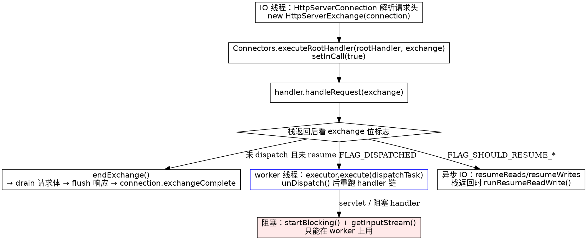

## Introduction

在 Undertow 里没有「request 对象」和「response 对象」这两个东西，只有一个 `HttpServerExchange`。类注释把这句话说得很直白（`HSE:89-91`）：

```java
/**
 * An HTTP server request/response exchange.  An instance of this class is constructed as soon as the request headers are
 * fully parsed.
 */
```

这不是命名偏好，而是异步 IO 的必然结果。一次 HTTP 交换有两个方向的流，而且两个方向的完成时机互相独立：请求体可能还没读完，响应就已经写完了；反过来，`endExchange()` 必须等到「请求已排空」**且**「响应已终止」才允许回收连接。如果拆成 request / response 两个对象，这条「双向会合」的规则就得靠两个对象互指、两个 volatile 字段互相同步，任何一次读-判-写都不是原子的。Undertow 的做法是把它压进**一个 int 位域 + 一次 CAS**，于是 exchange 必须是 per-request 的 `final` 类：

```java
public final class HttpServerExchange extends AbstractAttachable {      // HSE:96
```

本篇讲三件事：**这个对象里到底装了什么**、**state 位域如何充当状态机**、**dispatch 为什么是「两段式提交」**。第三条是 Undertow 与 Tomcat / Jetty 分歧最大的地方，也是所有「在 IO 线程上阻塞」事故的根因。

> [!NOTE]
> 源码路径缩写（根目录 `/tmp/src/tree/`，core 为 `undertow-core-2.4.4.Final`，servlet 为 `undertow-servlet-2.3.26.Final`）：
> - `HSE` = `undertow-core-2.4.4.Final/io/undertow/server/HttpServerExchange.java`
> - `CONN` = `undertow-core-2.4.4.Final/io/undertow/server/Connectors.java`
> - `OPT` = `undertow-core-2.4.4.Final/io/undertow/UndertowOptions.java`

## Object structure and final semantics

`HSE:132-224` 一段就是对象的全部「身份」，可以按是否随时间变化切成两半。

不可变部分（构造后不再改）：

```java
    private final ServerConnection connection;        // HSE:132
    private final HeaderMap requestHeaders;
    private final HeaderMap responseHeaders;
```

构造函数有三种（`HSE:346-359`），唯一必填的是 `connection`；`maxEntitySize` 和两个 `HeaderMap` 可以由连接层从 `UndertowOptions` 带入。因为 `connection` 是 final，exchange 与 IO 线程的绑定关系也是间接固定的：

```java
    public boolean isInIoThread() {                   // HSE:809-811
        return getIoThread() == Thread.currentThread();
    }
```

`getIoThread()` 不自己算，直接委托 `connection.getIoThread()`（XNIO 的 `ConvertingChannel` 语义，见 [XNIO 笔记](/docs/CS/Framework/Undertow/XNIO.md)）。**这意味着「exchange 属于哪个线程」不是 exchange 的状态，而是连接的属性**——同一连接上的后续 pipeline 请求会复用连接，但每个请求是全新的 exchange，`requestId` 也不同：

```java
    private static final AtomicLong REQUEST_ID_GENERATOR = new AtomicLong(0);   // HSE:343-344
    private final String requestId = Long.toString(REQUEST_ID_GENERATOR.incrementAndGet());
```

可变但**不属于状态机**的部分：`queryParameters` / `pathParameters`（两个 `Map<String, Deque<String>>`，`HSE:140-141`，一个参数多值所以值是 Deque）、`requestMethod`、`requestURI` / `requestPath` / `relativePath` / `resolvedPath` 四个路径视图（`HSE:180-204`，路径匹配器逐级消费，见 [Handler 链](/docs/CS/Framework/Undertow/HandlerChain.md)）、两条 conduit 包装链 `requestWrappers` / `responseWrappers`（`HSE:216-220`，注释明确说 GET 请求不分配）、`dispatchTask` / `dispatchExecutor`（`HSE:247-258`）。

## state bitfield and CAS progression

整个生命周期状态就是一个字段（`HSE:166-167`）：

```java
    private volatile int state = 200;
    private static final AtomicIntegerFieldUpdater<HttpServerExchange> stateUpdater = AtomicIntegerFieldUpdater.newUpdater(HttpServerExchange.class, "state");
```

初值 200 即「默认成功」，与 `setStatusCode` 的 javadoc「If not specified, the code will be a 200」对齐。低 10 位是响应码，高位是标志（`HSE:267` 起，原文照录，注释删掉）：

```java
    private static final int MASK_RESPONSE_CODE = intBitMask(0, 9);            // HSE:267

    private static final int FLAG_RESPONSE_SENT = 1 << 10;                     // HSE:272
    private static final int FLAG_RESPONSE_TERMINATED = 1 << 11;               // HSE:277
    private static final int FLAG_REQUEST_TERMINATED = 1 << 12;                // HSE:283
    private static final int FLAG_PERSISTENT = 1 << 14;                        // HSE:289
    private static final int FLAG_DISPATCHED = 1 << 15;                        // HSE:298
    private static final int FLAG_URI_CONTAINS_HOST = 1 << 16;                 // HSE:303
    private static final int FLAG_IN_CALL = 1 << 17;                           // HSE:317
    private static final int FLAG_SHOULD_RESUME_READS = 1 << 18;               // HSE:321
    private static final int FLAG_SHOULD_RESUME_WRITES = 1 << 19;              // HSE:326
    private static final int FLAG_REQUEST_RESET = 1 << 20;                     // HSE:331
```

读写都走同一对自旋 CAS（`HSE:2639-2652`，文件最后两个方法）：

```java
    private void setFlags(int flags) {
        int old;
        do {
            old = state;
        } while (!stateUpdater.compareAndSet(this, old, old | flags));
    }

    private void clearFlags(int flags) {
        int old;
        do {
            old = state;
        } while (!stateUpdater.compareAndSet(this, old, old & ~flags));
    }
```

四个设计后果值得单独讲：

1. **为什么不是一个枚举加几个 boolean**。`boolean isDispatched() { return anyAreSet(state, FLAG_DISPATCHED); }`（`HSE:852`）这样的读是无锁的，但「改一个字段」如果落在对象上就要么加 `synchronized`（IO 线程与 worker 争锁），要么每个字段各自 volatile（无法原子推进「同时置 DISPATCHED 并存 task」这类组合状态）。一个 int 让**任意多个标志位的变更共享一次 CAS**，且 exchange 上没有任何锁。
2. **响应码的范围校验就是掩码宽度**。`getStatusCode()` 是 `state & MASK_RESPONSE_CODE`（`HSE:1550-1552`），而 `setStatusCode` 第一件事是 `if (statusCode < 0 || statusCode > 999) throw new IllegalArgumentException("Invalid response code");`（`HSE:1562-1564`），随后用 `clearFlags(MASK_RESPONSE_CODE); setFlags(statusCode & MASK_RESPONSE_CODE);`（`HSE:1573-1574`）改写低 10 位。10 位能装 0~1023，校验卡在 999——两者同源，改掩码必须同步改校验。
3. **零对象头开销**。每个 exchange 只多 4 字节就表达了 10 个布尔维度；高并发下这是「每请求对象」能否成立的前提。
4. **`1 << 13` 是个空洞**。`FLAG_REQUEST_TERMINATED`（bit 12）与 `FLAG_PERSISTENT`（bit 14）之间没有定义，说明位域是历史累积的产物：删掉过某个标志，但**没有回收位号**。这提醒后来者不要按「枚举序号」理解这些常量，位号是稳定的 ABI，注释才是语义来源。

> [!WARNING]
> 位号一旦发布就不会挪。加新标志只能往高位找空位，**绝不能**把 `FLAG_PERSISTENT` 从 `1 << 14` 挪到 `1 << 13` 去「补洞」——`state` 会被 conduit、codec、handler 三方并发读写，位号变更等于静默改协议。

## Request and response model

`HeaderMap` 是 Undertow 自己的多值头容器（不是 `Map<String,String>`），配合 `Headers` 常量池里的 `HttpString` 避免大小写与分配开销。参数与请求体是两套完全不同的入口，这一点容易和 Servlet 层的 `getParameter()` 混淆：

- `getQueryParameters()` / `getPathParameters()` → 上面的 `Map<String, Deque<String>>`，前者来自 URL 解析，后者由路径匹配器写入。
- 请求体：非阻塞走 `getRequestChannel()` / `getResponseChannel()`（两个 `StreamSourceChannel` / `StreamSinkChannel`），阻塞走 `getInputStream()` / `getOutputStream()`，而后者**要求先 `startBlocking()`**。

`getRequestChannel()`（`HSE:1354-1374`）的三个返回分支值得读一遍，它是「一次交换只能有一个 body 消费者」这条规则的物理体现：

```java
    public StreamSourceChannel getRequestChannel() {
        if (requestChannel != null) {
            if(anyAreSet(state, FLAG_REQUEST_RESET)) {
                clearFlags(FLAG_REQUEST_RESET);
                return requestChannel;
            }
            return null;
        }
        if (anyAreSet(state, FLAG_REQUEST_TERMINATED)) {
            requestChannel = new ReadDispatchChannel(new ConduitStreamSourceChannel(Configurable.EMPTY, new EmptyStreamSourceConduit(getIoThread())));
        }
        // ... 套用 requestWrappers 后
        return requestChannel = new ReadDispatchChannel(sourceChannel);
    }
```

拿过就返回 `null`（防重入），除非有人显式 `resetRequestChannel()` 置 `FLAG_REQUEST_RESET`（`HSE:1377-1379`）；请求已终止则给你一个空的 `ReadDispatchChannel` 而不是 null，好让下游代码不必特判。包装链 `ConduitWrapper<StreamSourceConduit>` / `ConduitWrapper<StreamSinkConduit>` 在取 channel 时被一次性消费并置空 `requestWrappers = null`（`HSE:1368`）——**装饰只在第一次获取时生效**，这是 gzip、chunked、转换编码等所有中间层能「透明插入」的原因。

### attachments vs AttachmentList naming trap

`HttpServerExchange` 继承的是 `AbstractAttachable`（`util/AbstractAttachable.java:33`，实现 XNIO 的 `Attachable`），`putAttachment` / `getAttachment` / `removeAttachment` 与 `AttachmentKey` 全部来自这个基类。同目录下的 `util/AttachmentList.java:32` 是**另一个东西**：

```java
public final class AttachmentList<T> implements List<T>, RandomAccess {
```

它是一个「元素本身带 `putAttachment` 的 List」工具类，和 exchange 的挂载能力毫无关系。网上把 `exchange` 写成 `extends AttachmentList` 的说法是错的。exchange 自己反过来用 `AttachmentKey` 存低频数据，例如 reason phrase（`HSE:110`，注释解释「因为很少用所以做成 attachment 而非字段」）、缓冲请求体 `BUFFERED_REQUEST_DATA`（`HSE:115`，包级）、`REQUEST_ATTRIBUTES` / `REMOTE_USER` / `SECURE_REQUEST`（`HSE:120-130`）。**「能塞进 attachment 就不要加字段」是这个类的字段数控制手段**，代价是 attachment 会活到 exchange 被回收为止——见最后的坑一节。

## Three paths for the executing thread

一个 handler 拿到 exchange 后只有三种合法姿势：

| 路线 | API | 提交时机 | 跑在哪个线程 |
| :--- | :--- | :--- | :--- |
| 直跑 | 什么都不调，同步写完响应 | `executeRootHandler` 返回时 `endExchange()` | 当前线程（IO 线程或已切换的 worker） |
| 切换 | `dispatch(...)` 三 overload | **当前调用栈返回时** | `dispatchExecutor`，为 null 则 XNIO worker |
| 原地阻塞 | `startBlocking()` + `getInputStream()` | 不提交，占住当前线程 | 当前线程（因此必须先 dispatch 到 worker） |



三条路共用同一个「栈返回时统一裁决」的收口，收口逻辑就在 `executeRootHandler` 里。

## Two-phase commit of dispatch

先看第一段。`HSE:902-920` 原文：

```java
    public HttpServerExchange dispatch(final Executor executor, final Runnable runnable) {
        if (isInCall()) {
            if (executor != null) {
                this.dispatchExecutor = executor;
            }
            setFlags(FLAG_DISPATCHED);
            if(anyAreSet(state, FLAG_SHOULD_RESUME_READS | FLAG_SHOULD_RESUME_WRITES)) {
                throw UndertowMessages.MESSAGES.resumedAndDispatched();
            }
            this.dispatchTask = runnable;
        } else {
            if (executor == null) {
                getConnection().getWorker().execute(runnable);
            } else {
                executor.execute(runnable);
            }
        }
        return this;
    }
```

**在 handler 栈内调用 `dispatch` 时，线程并没有切换**：只是记下 executor、置 `FLAG_DISPATCHED`、存下 task。若已经 `resumeReads/Writes` 又想 dispatch，直接抛 `resumedAndDispatched()`——两种「栈返回后要做的事」互斥。若**不在栈内**（异步回调里、别的线程上），退化成立刻 `execute`，因为已经没有栈可等了。`dispatch(Runnable)` 就是 `dispatch(null, runnable)`（`HSE:886-889`）；无参 `dispatch()` 已 `@Deprecated`（`HSE:869-873`），javadoc 建议「不想换线程就用 `SameThreadExecutor.INSTANCE`」。`dispatch(HttpHandler)` 与 `dispatch(Executor, HttpHandler)`（`HSE:922-940`）把 task 包成 `Connectors.executeRootHandler(handler, this)`，并且**先查 `connection.isOpen()`** 再执行——连接已断就直接丢弃整段处理，这是 HttpHandler 版相对 Runnable 版唯一多出的保护。

第二段在 `CONN:319-351`：

```java
    public static void executeRootHandler(final HttpHandler handler, final HttpServerExchange exchange) {
        try {
            exchange.setInCall(true);
            handler.handleRequest(exchange);
            exchange.setInCall(false);
            boolean resumed = exchange.isResumed();
            if (exchange.isDispatched()) {
                if (resumed) {
                    UndertowLogger.REQUEST_LOGGER.resumedAndDispatched();
                    exchange.setStatusCode(500);
                    exchange.endExchange();
                    return;
                }
                final Runnable dispatchTask = exchange.getDispatchTask();
                Executor executor = exchange.getDispatchExecutor();
                exchange.setDispatchExecutor(null);
                exchange.unDispatch();
                if (dispatchTask != null) {
                    executor = executor == null ? exchange.getConnection().getWorker() : executor;
                    try {
                        executor.execute(dispatchTask);
                    } catch (RejectedExecutionException e) {
                        UndertowLogger.REQUEST_LOGGER.debug("Failed to dispatch to worker", e);
                        exchange.setStatusCode(StatusCodes.SERVICE_UNAVAILABLE);
                        exchange.endExchange();
                    }
                }
            } else if (!resumed) {
                exchange.endExchange();
            } else {
                exchange.runResumeReadWrite();
            }
        } catch (Throwable t) {
            // ... 见「完成路径」一节
```

要点逐个拆：

- **`isInCall()` 判据**：`FLAG_IN_CALL` 由 `setInCall()` 在 `handler.handleRequest` 前后开关（`HSE:972-983`）。它的 javadoc（`HSE:305-317`）说明「绝大多数时候为 true，只有在 `executeRootHandler` 之外做异步操作时为 false」。这就是 `dispatch` 能区分「记下来」和「立刻提交」的依据。
- **顺序**：先 `setInCall(false)` 再裁决。若 handler 链同步跑完，此刻 `isDispatched()` 为 false → `endExchange()`，**全程没有线程切换**。这就是 Undertow 最省的语义：**同线程跑完就不切换，要切就等栈返回**。
- **`unDispatch()` 先清标志再提交**（`HSE:856-860` 清 `FLAG_DISPATCHED` 并置空 task）。所以 worker 上重跑的 handler 链看到的是「干净的、没有 dispatch 意图的」exchange，允许再次 dispatch；但 `dispatchExecutor` 只在 `setDispatchExecutor(null)` 时被清，javadoc 特别提醒（`HSE:253-257`）「一旦某个请求 dispatch 过一次，之后所有 dispatch 都用同一个 executor」。
- **`RejectedExecutionException` → 503**：worker 队列满不会挂掉连接，而是回 503。这是位域设计买来的好处之一——收口点只有一处。
- **`resumed && dispatched` 的兜底 500**：栈内已经用异常拦一次，异步竞态下仍可能同时成立，于是这里再判一次并直接 `endExchange()`。

`isResumed()` / `runResumeReadWrite()`（`HSE:2035-2053`）是第三条腿：`resumeReads()` / `resumeWrites()` 只置 `FLAG_SHOULD_RESUME_*` 标志（与 dispatch 完全对称的两段式），栈返回时统一 `requestChannel.runResume()` / `responseChannel.runResume()`。异步读写的线程切换因此**不由 handler 显式发起，而由收口点集中发起**，handler 只表达意图。

## Completion path and endExchange

两个终止方法是一枚硬币的两面，且都幂等（`HSE:1417-1427` 与 `HSE:1713-1726`）：

```java
    void terminateRequest() {
        if (allAreSet(state, FLAG_REQUEST_TERMINATED)) {
            return;                                        // idempotent
        }
        if (requestChannel != null) {
            requestChannel.suspendReads();
            requestChannel.requestDone();
        }
        setFlags(FLAG_REQUEST_TERMINATED);
        if (anyAreSet(state, FLAG_RESPONSE_TERMINATED)) {
            invokeExchangeCompleteListeners();
        }
    }
```

`terminateResponse()` 结构完全镜像。**「谁最后完成，谁负责触发完成回调」**——这就是一次无锁的会合（rendezvous）：两个方向各自置位并检查对方，只有一方会看到「两个都齐」。对外的入口是 `Connectors.terminateRequest(exchange)` / `terminateResponse(exchange)`（`CONN:144-150`），由 codec 与各种 conduit 调用，而不是让 handler 直接碰。

`invokeExchangeCompleteListeners()`（`HSE:1428-1438`）的逆序与防重入值得注意：

```java
    private void invokeExchangeCompleteListeners() {
        if (exchangeCompletionListenersCount > 0) {
            int i = exchangeCompletionListenersCount - 1;
            ExchangeCompletionListener next = exchangeCompleteListeners[i];
            exchangeCompletionListenersCount = -1;
            next.exchangeEvent(this, new ExchangeCompleteNextListener(exchangeCompleteListeners, this, i));
        } else if (exchangeCompletionListenersCount == 0) {
            exchangeCompletionListenersCount = -1;
            connection.exchangeComplete(this);
        }
    }
```

计数立刻置 `-1`，第二次进来谁都不调；链式推进交给 `ExchangeCompleteNextListener.proceed()`（`HSE:2055-2075`），它从 `i` 递减到 -1 才轮到 `connection.exchangeComplete`——**后注册的 `ExchangeCompletionListener` 先执行**，与 filter 的「后进先出收尾」一致。`isComplete()` 就是两个 TERMINATED 都齐（`HSE:1388-1390`）。

`endExchange()`（`HSE:1753` 起）是 handler 主动结束交换的唯一入口，顺序如下：

1. 双 TERMINATED 已齐 → 幂等返回，但**仍要 `IoUtils.safeClose(blockingHttpExchange)`**（`HSE:1758-1762`），否则阻塞流泄漏。
2. 逆序跑 `DefaultResponseListener`（`HSE:1765-1779`）：`i = defaultResponseListeners.length - 1; while (i >= 0) { ... if (listener.handleDefaultResponse(this)) return this; }`，并且取完就把槽位置 null。任一 listener 返回 true 即代表「兜底响应已接管」，本次 `endExchange` 提前结束。这是错误页、异常转响应的挂载点，异常对象由 `CONN:352` 的 `exchange.putAttachment(DefaultResponseListener.EXCEPTION, t)` 提供。
3. `connection.terminateRequestChannel(this)`：让 codec 把请求侧当作读完（`HSE:1781-1783`）。
4. 关闭 `blockingHttpExchange`，异常时连连接一起关（`HSE:1785-1797`）。
5. 请求体还没终止就**排空**（`HSE:1801-1855`）：`Channels.drain(requestChannel, Long.MAX_VALUE)`；一次读不到数据就挂 `ChannelListeners.drainListener(...)` 并 `resumeReads()` 然后 `return this`——**排空可能反手把控制权交给 IO 线程**，所以 javadoc 明说「This can result in handoff to an XNIO worker, so after this method is called the exchange should not be modified by the caller」。417（Expectation Failed）且一个字节都没排到，才允许直接不读。
6. 最后 `closeAndFlushResponse()`（`HSE:1861`、实现 `HSE:1867+`）：连接已不开就补两个 terminate；响应通道可用时给没 body 的响应补 `Content-Length: 0`（CONNECT、带 `Content-Length` 的 HEAD 除外）；`shutdownWrites()` + `flush()`，刷不完就挂 flushing listener。

阻塞适配层与状态机正交：`startBlocking()`（`HSE:1652-1656`）装上 core 自带的 `DefaultBlockingHttpExchange`，`startBlocking(BlockingHttpExchange)`（`HSE:1672-1676`）允许上层**替换流的实现**并返回旧值（所以它可以被多层包装反复调用）。`getInputStream()` 在 `blockingHttpExchange == null` 时抛 `startBlockingHasNotBeenCalled()`（`HSE:1687-1692`）。Servlet 侧的替换实现是 `undertow-servlet-2.3.26.Final/io/undertow/servlet/core/ServletBlockingHttpExchange.java`，它把 `HttpServletRequest` 的生命周期与 `InputStream`/`Reader` 语义缝到 exchange 上（见 [Servlet 集成](/docs/CS/Framework/Undertow/Servlet.md)）。

## Request body reading and limits

两个方向的 channel 都是 `Detachable*Channel` 的子类：`ReadDispatchChannel`（`HSE:2311`，内部 `resumeReads()` 在 `HSE:2327`）与 `WriteDispatchChannel`（`HSE:2141`）。它们的价值就是把「异步就绪回调」和「阻塞式 `awaitReadable`」包在同一层：线程在 channel 上等待时，把 `FLAG_SHOULD_RESUME_*` 那套意图接管过来，从而允许同一份 conduit 代码既能在 IO 线程跑，也能在 worker 上阻塞跑。

限制项三个，`OPT` 里的默认值：

| 项 | 默认 | 出处 |
| :--- | :--- | :--- |
| `maxEntitySize`（0 = 不限） | 2 MiB | `HSE:245` 字段 + `OPT:63` `DEFAULT_MAX_ENTITY_SIZE = 2097152` |
| multipart 的 entity 上限 | 2 MiB | `OPT:68` `DEFAULT_MULTIPART_MAX_ENTITY_SIZE = 2097152` |
| 阻塞读超时 | 600 s | `OPT:38` `DEFAULT_READ_TIMEOUT = 600000` |

超限的行为是**强制关闭请求通道**（`HSE:228-245` 的 javadoc 明确写了 "If this entity size is exceeded the request channel will be forcibly closed"），抛出 `RequestTooBigException`，由 `CONN:354-359` 精确映射为 413（其余 `Throwable` 才是 500），且只在 `!isResponseStarted()` 时才敢改状态码。`maxEntitySize` 只能在拿到请求流**之前**改，改晚了无效。注意 `OPT:53-58` 的注释说 multipart 的上限「Generally this will be larger」，但两个默认值同为 2097152——上传大文件必须显式调 `MULTIPART_MAX_ENTITY_SIZE`。

读超时不是靠 Netty 那种 idle handler 实现的，而是 `UndertowInputStream` 在构造时算出一个最终值（`io/UndertowInputStream.java:70-87`）：

```java
            readTimeout = this.channel.getOption(READ_TIMEOUT);
            final Integer idleTimeout = this.channel.getOption(IDLE_TIMEOUT);
            if (readTimeout == null || readTimeout <= 0)
                readTimeout = idleTimeout;
            else if (idleTimeout != null && idleTimeout > 0 && idleTimeout < readTimeout) {
                readTimeout = idleTimeout;
            }
        // ...
        this.readTimeout = readTimeout == null || readTimeout <= 0? DEFAULT_READ_TIMEOUT : readTimeout;
```

两个细节：**`READ_TIMEOUT` 与 `IDLE_TIMEOUT` 取更小的那个**；两者都没配就用 600 s 兜底。也就是说默认配置下一根被慢客户端吊住的阻塞连接可以吃掉一个 worker 线程 10 分钟。

表单解析在 `server/handlers/form/`：`FormData`（`Map<String, FormDataValue>` 的结果模型）、`FormDataParser`（接口）、`FormEncodedDataDefinition` 与 `MultiPartParserDefinition`（两种编码的实现）、`FormParserFactory`（按 content-type 选 parser）、`EagerFormParsingHandler`（进链即解析，把 body 消费掉换取参数）。`MultiPartParserDefinition` 内部用临时文件落盘大条目，是 `maxEntitySize` 之外的第二道闸。

## upgradeChannel and protocol upgrade

`HSE:994-1007`：

```java
    public HttpServerExchange upgradeChannel(final HttpUpgradeListener listener) {
        if (!connection.isUpgradeSupported()) {
            throw UndertowMessages.MESSAGES.upgradeNotSupported();
        }
        if(!getRequestHeaders().contains(Headers.UPGRADE)) {
            throw UndertowMessages.MESSAGES.notAnUpgradeRequest();
        }
        UndertowLogger.REQUEST_LOGGER.debugf("Upgrading request %s", this);
        connection.setUpgradeListener(listener);
        setStatusCode(StatusCodes.SWITCHING_PROTOCOLS);
        getResponseHeaders().put(Headers.CONNECTION, Headers.UPGRADE_STRING);
        return this;
    }
```

带 `productName` 的重载（`HSE:1017-1029`）额外写 `Upgrade: <productName>` 响应头。它**不直接终止 exchange**，只是置 101 并挂 listener，等 `endExchange()` 走完双终止后，原始 `StreamConduit` 交给 `HttpUpgradeListener`，之后这条连接不再是 HTTP——`HttpServerConnection.getChannel()` 可拿到裸通道。类注释说得很清楚：这是「Force the codec to treat the request as fully read」级别的操作用于 downgrade 与自定义 transfer coding。WebSocket 握手就是这个 API 的主要消费者（`websockets/WebSocketProtocolHandshakeHandler` 调 `exchange.upgradeChannel(listener)`），HTTP/2 的 CONNECT 走另一个入口 `acceptConnectRequest(...)`（`HSE:1035`）。判断是否升级响应直接读状态码：`isUpgrade()` = `getStatusCode() == 101`（`HSE:817-819`）。

## Four names that do not exist

2.4.4 里 grep 全树（core + servlet）确认**都不存在**，网上教程出现即属张冠李戴：

| 误传 | 实际情况 |
| :--- | :--- |
| `exchange.complete()` | `HttpServerExchange` 里没有 `complete()` 方法（`grep -n "public .*complete("` 零命中）。正确写法：非阻塞收尾 `exchange.endExchange()`；只终止某一侧用 `Connectors.terminateRequest/terminateResponse(exchange)`；handler 链继续往下走是 `next.handleRequest(exchange)` |
| `CompleteState` 枚举 | 全树零命中。完成状态是 `FLAG_REQUEST_TERMINATED \| FLAG_RESPONSE_TERMINATED` 两位（`HSE:1388`），配合 `isRequestComplete()` / `isResponseComplete()` 两个谓词 |
| `dispatchStart()` / `DispatchUtils` | 全树零命中（`grep -rn "dispatchStart\|class DispatchUtils"` 无结果）。可用的是 `dispatch(...)` / `unDispatch()` / `setDispatchExecutor()` / `isDispatched()`，以及 `io/undertow/util/SameThreadExecutor.java` |
| `ReadTimeoutHandler` | 这是 Netty 的类名（[Netty](/docs/CS/Framework/Netty/Netty.md) 笔记里那套 pipeline）。Undertow 只有 `server/handlers/BlockingReadTimeoutHandler.java`，语义是「阻塞模式下限制读耗时」，不是通用 idle 检测 |

另外两个易混点：`InputStreamSource` / `ParsedFormData` 是 **Vert.x** 的名字，Undertow 对应的是 `StreamSourceChannel` 与 `FormData`；exchange 的父类是 `AbstractAttachable`，不是 `AttachmentList`（`util/AttachmentList.java:32` 是独立的 `List<T>` 工具类）。

## Abstraction differences from Tomcat and Jetty

| 维度 | Undertow | Tomcat | Jetty |
| :--- | :--- | :--- | :--- |
| 每请求对象 | 一个 `final HttpServerExchange`，双向流内嵌 | `Request` / `Response` + `CoyoteAdapter` 适配层 + 面向应用的 `RequestFacade`，**对象池回收复用** | `Request` 继承 `ServletAPIRequest`，可回收但受 jetty 配置约束 |
| 状态表达 | 单 volatile int 位域 + CAS | 分散在 `Request` 字段（`asyncStateCode` 等）与 `AbstractProcessor` 状态机 | `HttpChannelState` 独立对象，管 START/COMPLETE/ASYNC |
| 「转阻塞」的方式 | `dispatch` 标志位，**栈返回时统一切换** | `AsyncContext` / `startAsync` 的 ThreadLocal 换请求 | `HttpChannel` 的 `Content.Source` + `Request` 事件方法返回 `Runnable` |
| 谁决定下一个线程 | `executeRootHandler` 的收口点 | Container 线程池 + `AsyncContext.dispatch` | **事件方法自己的返回值**（返回 `Runnable` 即换线程，返回 null 即留在本线程） |
| 完成会合 | 双 TERMINATED 位幂等会合，最后置位者触发回调 | `Request.recycle()` 前由 processor 统一收尾 | `HttpChannelState.complete()` |
| 装饰机制 | `ConduitWrapper` 双向链，首次取 channel 时一次性消费 | `Filter` + Valve 两层 | `Request`/`Response` listener + `Content.Source/Sink` 包装 |

Jetty 的「返回 `Runnable` 决定线程」是把决策权交给每个事件方法，代价是所有 handler 都得写 `return nextRunnable`；Undertow 反过来把决策**集中到一处**，handler 只需设意图，因此 `dispatch` 可以嵌套在任何深度、甚至多个 handler 各自 dispatch 一次。Tomcat 则是第三种：以 `ThreadLocal` 的 `Request.current` 支撑「同一线程继续跑完 JSP/Filter 链」，异步靠 `AsyncContext` 显式换轨。相关深挖见 [Tomcat Connector](/docs/CS/Framework/Tomcat/Connector.md) 与 [Tomcat 容器](/docs/CS/Framework/Tomcat/Container.md)。

## Pitfalls

1. **在 IO 线程上阻塞**。handler 里直接 `getInputStream()` 或跑 JDBC，等于把一个 IO 线程变成 worker，而 IO 线程数通常是 CPU 核数级。规矩写在 javadoc 里（`HSE:879-881`）：**先 `isInIoThread()` 再决定是否 `dispatch`**。反过来说，已经不在 IO 线程上时 dispatch 只是多一次排队，`SameThreadExecutor.INSTANCE` 是显式避免切换的写法。
2. **把 dispatch 当 submit 用**。`HSE:902-920` 的 in-call 分支意味着「`dispatch(r)` 之后你手上这段代码还在 IO 线程上继续跑」。若在 dispatch 后面继续读 exchange（改 header、写 body），worker 上重跑的链会看到两份写入交错。约定：**dispatch 之后立即 `return`**，不要在 dispatch 后继续操作 exchange，直到下一段代码在 worker 上重新进入。
3. **`dispatch` 与 `resumeReads` 同时用**。栈内抛 `resumedAndDispatched()`，异步竞态下 500。要么异步驱动（resume），要么换线程（dispatch），一条交换一次只能选一个。
4. **`endExchange()` 之后继续碰 exchange**。`HSE:1745-1751` 的注释直说「after this method is called the exchange should not be modified by the caller」，因为排空请求体可能已经把执行权交给了别的线程。
5. **不消费请求体**。既没读也没关就返回，`endExchange` 会替你 `Channels.drain`，但那是**在 IO 线程上把对端可能还在发的数据吸干净**；大 body + 不关心的接口 = IO 线程被 drain 拖住。真要丢弃就直接关连接，或按需提前 `Connectors.terminateRequest(exchange)`。
6. **attachments 泄漏**。`AttachmentKey` 存的对象活到 exchange 结束；exchange 又一直被 `connection` 引用链上的 conduit / listener 持有直到双终止。往 attachment 塞大缓冲（尤其 `BUFFERED_REQUEST_DATA` 那类 `PooledByteBuffer[]`）而不注册 `ExchangeCompletionListener` 归还，池就被吃空——core 自己的做法正是 `Connectors.BufferedRequestDataCleanupListener`（`CONN:127-142`）在交换完成时逐个 `close()`。
7. **`setStatusCode` 之后想改回来**。`isResponseStarted()`（`FLAG_RESPONSE_SENT`，`HSE:1343-1345`）为真时抛 `responseAlreadyStarted()`。响应头已上路，改码只会让客户端看到自相矛盾的报文。
8. **误以为响应码默认 200 就不用设**。是的，不用设；但反过来说，**忘了 `setStatusCode(404)` 的 handler 会返回 200 空 body**——初值 200 就写死在 `HSE:166`。
9. **`FLAG_PERSISTENT` 手工置位**。keep-alive 判定由 codec 依据 `Connection` 头、HTTP 版本、异常状况决定；handler 层动 `setPersistent()` 只会在错误页之后复用一条本该关闭的连接。

## Links

- [Undertow 高性能非阻塞服务器](/docs/CS/Framework/Undertow/Undertow.md)
- [XNIO 与 NIO 抽象层](/docs/CS/Framework/Undertow/XNIO.md)
- [HandlerChain：HttpHandler 链与路径匹配](/docs/CS/Framework/Undertow/HandlerChain.md)
- [Servlet 集成层](/docs/CS/Framework/Undertow/Servlet.md)
- [Tomcat Connector 与协议处理](/docs/CS/Framework/Tomcat/Connector.md)
- [Jetty 请求流转](/docs/CS/Framework/Jetty/RequestFlow.md)

## References

- [Undertow 官网](https://undertow.io/)
- [undertow-io/undertow 源码仓库](https://github.com/undertow-io/undertow)
