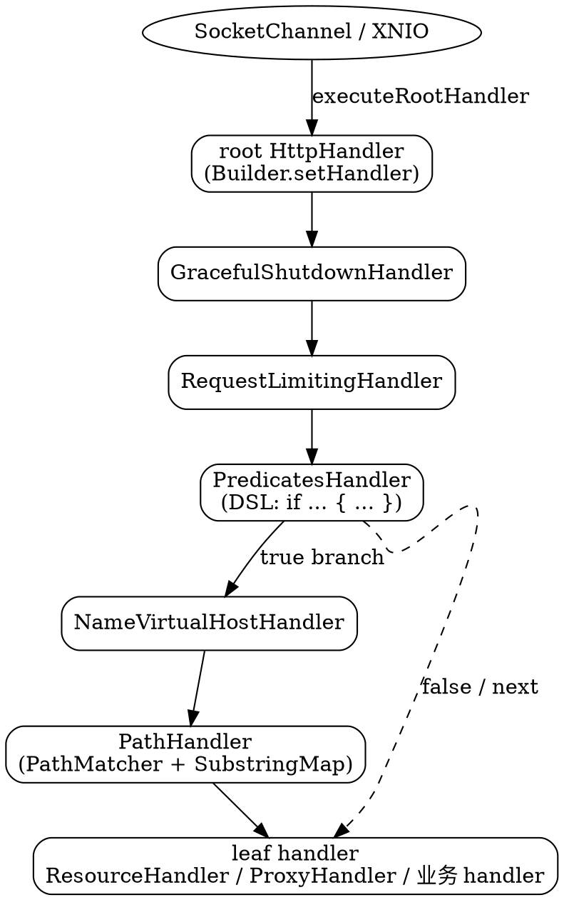

## Introduction

Undertow 的「框架」薄到只有一句话：一个 `HttpHandler` 接口，加一个贯穿始终的 `HttpServerExchange`。没有 pipeline 对象，没有 filter chain 基类，没有生命周期回调。所谓「框架能力」全部由两件事拼出来：**handler 组合**（谁调用谁）与 **predicate 判定**（在什么条件下调用）。理解了这两条，Undertow 的全部扩展点（路由、虚拟主机、限流、改写、访问日志、代理）就都是同一套积木的不同摆法。

本篇按源码顺序展开：先把接口之辨说清楚（网上教程里高频出现的 `NextHandler` 在本项目里根本不存在），再看链是怎么组装和变形的，然后是三套路径匹配算法与它们各自的性能来源，接着是 Undertow 特色的 Predicate 引擎（含 rewrite 依赖的 RESTART 重入机制），最后是内置 handler 分类、超时到底装在哪里，以及与 Jetty / Tomcat 的三方对照。

本篇基于 **undertow-core 2.4.4.Final** 源码，结论标注 `相对 /tmp/src/tree/undertow-core-2.4.4.Final/ 路径:行号`。请求如何从 conduit 进入根 handler、dispatch 语义与线程模型见 [Exchange 与请求生命周期](/docs/CS/Framework/Undertow/Exchange.md)。

## HttpHandler is the only handler interface

```java
    /**
     * Handle the request.
     *
     * @param exchange the HTTP request/response exchange
     *
     */
    void handleRequest(HttpServerExchange exchange) throws Exception;
```

`io/undertow/server/HttpHandler.java:29-35`。一个方法，`throws Exception`，没有返回值，也没有 `Chain` / `FilterChain` 之类的参数。

### Correction Handler and NextHandler do not exist

在 2.4.4.Final 全镜像里检索 `NextHandler`：**零命中**。同样，`io.undertow.server` 包下也不存在名为 `Handler` 的接口（Netty 的 `ChannelHandler`、Spring WebFlux 的 `HandlerFunction` 都叫别的名字，见 [Netty](/docs/CS/Framework/Netty/Netty.md) 与 [WebFlux](/docs/CS/Framework/Spring/webflux.md)）。

因此以下这些「教程写法」在 Undertow 里都是错的：

| 教程常见写法 | 实际情况 |
| :-- | :-- |
| `class MyHandler implements NextHandler { handle(exchange, next) }` | 无此接口，签名根本不接受 `next` 参数 |
| `implements Handler` | 接口名是 `HttpHandler` |
| 覆写 `handle(exchange, chain)` | 方法名是 `handleRequest(exchange)`，只有一个参数 |
| 继承某个 `HandlerWrapper` 抽象基类拿到 `next` | `HandlerWrapper` 是**函数式风格的包装接口**，不是 handler 基类 |

链式推进的真实形态是：**每个 handler 自己持有一个 `HttpHandler next` 字段，并在合适的时机显式调用它**。这个 `next` 是构造期注入的普通字段，不是运行时传入的参数。以 `PredicatesHandler` 为例：

```java
    private volatile Holder[] handlers = new Holder[0];
    private volatile HttpHandler next;
    private final boolean outerHandler;
```

`io/undertow/predicate/PredicatesHandler.java:54-56`。`PathHandler` 甚至没有 `next`——匹配到谁就直接调用谁，匹配不到就 404，这是「链」在 Undertow 里的另一种形态：**分支即终点**。

## Chain assembly and transformation

### HandlerWrapper replaces the chained base class

```java
/**
 * Interface that can be used to wrap the handler chains, adding additional handlers.
 *
 * @author Stuart Douglas
 */
public interface HandlerWrapper {

    HttpHandler wrap(HttpHandler handler);

}
```

`io/undertow/server/HandlerWrapper.java:21-30`。签名读作 `HttpHandler -> HttpHandler`，即一个 handler 装饰器函数。这就是 Undertow 变形整条链的唯一原语：不是「插入到某个位置」，而是「把已有的子链包一层再交出去」。

好处很直接：包装顺序完全由代码结构决定，可静态推演；`HandlerWrapper` 可以与 `Predicate` 组合成 `PredicatedHandler`（`io/undertow/server/handlers/builder/PredicatedHandler.java`），从而让「条件」与「变形」在 DSL 里同构表达。代价是运行期无法重排——想换顺序只能重建整条链。

组装入口是 builder：`Undertow.Builder.setHandler(HttpHandler)`（`io/undertow/Undertow.java:555`）接收的永远是**已经包完的最终对象**，`Undertow` 本身不参与链式推进；请求真正被交给根 handler 是在 `Connectors.executeRootHandler`（`io/undertow/server/Connectors.java:319-351`）里，那一段属于连接与生命周期范畴，见 [Exchange 与请求生命周期](/docs/CS/Framework/Undertow/Exchange.md)。

一个典型的包装序（顺序自外向内，越靠外的越先执行）：



`Handlers` 工具类（`io/undertow/Handlers.java`）提供工厂方法把这些 wrapper 说清楚，行号为该版本源码位置：

| 工厂方法 | 行号 | 产物 |
| :-- | :-- | :-- |
| `path()` / `path(defaultHandler)` | `:89` / `:80` | `PathHandler` |
| `pathTemplate()` / `pathTemplate(rewriteQueryParams)` | `:97` / `:123` | `PathTemplateHandler` |
| `routing()` / `routing(rewriteQueryParams)` | `:114` / `:106` | `RoutingHandler` |
| `virtualHost(...)` 四个重载 | `:133-171` | `NameVirtualHostHandler` |
| `websocket(callback[, next])` | `:177` / `:186` | `WebSocketProtocolHandshakeHandler` |
| `serverSentEvents(...)` | `:197` / `:207` | `ServerSentEventHandler` |
| `resource(resourceManager)` | `:215` | `ResourceHandler`（默认关目录列表） |
| `redirect(location)` | `:225` | `RedirectHandler` |
| `trace(next)` | `:239` | `HttpTraceHandler`（注释明确警告 TRACE 可能泄露信息） |
| `date(next)` | `:252` | `DateHandler`，**已 `@Deprecated`**：注释说 Date 头已由 connector 直接处理 |
| `predicate(p, true, false)` | `:267` | `PredicateHandler`（单条件二分支） |
| `predicateContext(next)` | `:275` | `PredicateContextHandler` |
| `predicates(list, next)` | `:279` | `PredicatesHandler`（多条件） |
| `rewrite(condition, target, classLoader, next)` | `:410` | predicate + rewrite 的组合快捷方式 |
| `gracefulShutdown(next)` | `:434` | `GracefulShutdownHandler` |
| `exceptionHandler(next)` | `:538` | `ExceptionHandler`，链内异常兜底 |

`date(next)` 被废弃这件事本身是一条有用的信息：**凡是与「传输」相关的东西（日期头、超时、内容长度）都不该由 handler 负责**，下文「超时装在哪里」会看到同一设计取向。

## Three path matching mechanisms

### PathHandler shares one table for exact and prefix

`PathHandler` 内部只有一个 `PathMatcher<HttpHandler>` 和一个可选 LRU 缓存，注册 `/` 就是 default handler：

```java
public class PathHandler implements HttpHandler {

    private final PathMatcher<HttpHandler> pathMatcher = new PathMatcher<>();

    private final LRUCache<String, PathMatcher.PathMatch<HttpHandler>> cache;

    public PathHandler(final HttpHandler defaultHandler) {
        this(0);
        pathMatcher.addPrefixPath("/", defaultHandler);
    }
```

`io/undertow/server/handlers/PathHandler.java:40-49`（缓存大小由 `PathHandler(int cacheSize)` 决定，`:60-66`；`cacheSize <= 0` 时 `cache` 为 `null`，热路径上不多一次哈希查表）。

匹配后它做的是**改写 exchange 再直调**，而不是「继续下一环」：

```java
        PathMatcher.PathMatch<HttpHandler> match = null;
        boolean hit = false;
        if(cache != null) {
            match = cache.get(exchange.getRelativePath());
            hit = true;
        }
        if(match == null) {
            match = pathMatcher.match(exchange.getRelativePath());
        }
        if (match.getValue() == null) {
            ResponseCodeHandler.HANDLE_404.handleRequest(exchange);
            return;
        }
        ...
        exchange.setRelativePath(match.getRemaining());
```

`io/undertow/server/handlers/PathHandler.java:78-96`（中间省略 resolvedPath 累加，见下节）。命中缓存后回写一次是维持 LRU 的最近使用顺序，而不是「再算一遍」。

注意它匹配的是 **`relativePath`** 而非 `requestPath`——这条决定了嵌套路由的正确性。

### PathMatcher two-step algorithm

```java
    public PathMatch<T> match(String path){
        if (!exactPathMatches.isEmpty()) {
            T match = getExactPath(path);
            if (match != null) {
                UndertowLogger.REQUEST_LOGGER.debugf("Matched exact path %s", path);
                return new PathMatch<>(path, "", match);
            }
        }

        int length = path.length();
        final int[] lengths = this.lengths;
        for (int i = 0; i < lengths.length; ++i) {
            int pathLength = lengths[i];
            if (pathLength == length) {
                SubstringMap.SubstringMatch<T> next = paths.get(path, length);
                ...
            } else if (pathLength < length) {
                char c = path.charAt(pathLength);
                if (c == '/') {
                    SubstringMap.SubstringMatch<T> next = paths.get(path, pathLength);
                    ...
                }
            }
        }
        UndertowLogger.REQUEST_LOGGER.debugf("Matched default handler path %s", path);
        return new PathMatch<>("", path, defaultHandler);
    }
```

`io/undertow/util/PathMatcher.java:75-108`。结构是三个字段：`exactPathMatches`（`CopyOnWriteMap`）、`paths`（`SubstringMap`）、`lengths`（所有已注册前缀的长度数组，`:45-52`）。

三步读懂：

1. **精确匹配优先**：`addExactPath` 注册的键走独立 map，一次 `equals` 级别查找就返回，`remaining` 为空串（`:141-147`）。这意味着 `/foo` 精确注册会抢在 `/foo` 前缀规则之前命中。
2. **按长度枚举候选前缀**：不遍历已注册路径，而是遍历**长度数组**。对每个比请求短的长度 `L`，先做一件极便宜的事——`path.charAt(L) == '/'`。这一步是**段边界校验**：注册 `/foo` **不会**匹配 `/foobar`，只匹配 `/foo` 与 `/foo/...`。这解释了为什么 Undertow 敢把前缀匹配做成 O(候选长度数) 而不牺牲正确性。
3. **命中即切分**：`paths.get(path, pathLength)` 返回 `SubstringMatch`，直接产出 `(matched = 前缀, remaining = 剩余)`；一个都没中就落到 `defaultHandler`（`remaining` 是整个 path）。

`/` 的注册被特殊处理：`addPrefixPath` 里如果规范化后等于 `/`，**赋给 `defaultHandler` 并直接返回**（`io/undertow/util/PathMatcher.java:129-132`），不进前缀树。所以 default 没有段边界检查，任何未命中路径都会落到它身上。

### Why SubstringMap avoids substring

朴素写法要为每个候选前缀分配一个 `path.substring(0, L)` 再来查 map。`SubstringMap` 消掉了这次分配：

```java
    private boolean doEquals(String s1, String s2, int length) {
        if(s1.length() != length || s2.length() < length) {
            return false;
        }
        for(int i = 0; i < length; ++i) {
            if(s1.charAt(i) != s2.charAt(i)) {
                return false;
            }
        }
        return true;
    }
```

`io/undertow/util/SubstringMap.java:86-96`。它是**开放寻址 + 线性探测**的定长数组（`table[pos]` 存键、`table[pos+1]` 存值，步长 2，`:42-79`），哈希与比较都只取请求串的前 `length` 个字符（`hash(key, length)`、`doEquals`）。类注释同时给出适用边界：**写路径是 copy-on-write，不建议用于频繁变化的数据**（`:32-33`）——这正好对应 handler 链「启动期组装、运行期只读」的使用方式，也是 `PathMatcher` 敢用 `CopyOnWriteMap` 存精确表的原因。

### PathTemplateHandler template semantics

`io/undertow/server/handlers/PathTemplateHandler.java` + `io/undertow/util/PathTemplateMatcher.java`。模板由 `util/PathTemplate.java` 解析 `{var}` 占位，匹配结果 `PathTemplateMatch` 携带参数 map。

匹配器换了另一套索引：**按模板 stem 分组 + 最长 stem 优先**：

```java
public class PathTemplateMatcher<T> {

    /**
     * Map of path template stem to the path templates that share the same base.
     */
    private Map<String, Set<PathTemplateHolder>> pathTemplateMap = new CopyOnWriteMap<>();

    /**
     * lengths of all registered paths
     */
    private volatile int[] lengths = {};
```

`io/undertow/util/PathTemplateMatcher.java:40-50`。`match()` 同样先按长度数组取候选（`:59-79`），但拿到的是**同 stem 的模板集合**，再逐个 `val.template.matches(path, params)`，不匹配就 `params.clear()` 重试下一个（`handleStemMatch`，`:83-92`）。类注释里作者自己承认这还可以换成 trie（`:36`），当前实现「大多数情况下够用」。

两个值得记住的细节：

- **注册期即查重**：同一 stem 下出现等价模板会抛 `matcherAlreadyContainsTemplate`（`:104-113`）。歧义在启动时暴露，不留到运行期。
- **它是 `{var}` 语义，不是 Servlet 的 `*.jsp` / `/api/*` 语义**。想要 Servlet 风格的后缀映射，用 `PathHandler` 的 `path-suffix` 谓词或 `PathSuffixPredicate`，不要指望模板表达式。
- `Handlers.pathTemplate(rewriteQueryParams)`（`io/undertow/Handlers.java:123`）的布尔参数控制匹配时是否顺带重写查询串——模板化路由与 query 参数耦合的开关在这里。

### RoutingHandler and NameVirtualHostHandler

`RoutingHandler`（`io/undertow/server/RoutingHandler.java`，注意它在 `server/` 而不是 `server/handlers/` 下）是**方法 + 模板**的组合：`get/post/put/delete/patch/head/options/trace/connect(pathTemplate, handler)`，本质是内嵌一个 `PathTemplateHandler` 并按 HTTP method 分桶，因此它是 REST 风格路由的默认选择。

`NameVirtualHostHandler`（`io/undertow/server/handlers/NameVirtualHostHandler.java`）按 `Host` 头选择**子树根**，而不是匹配路径；每个虚拟主机挂自己的根 handler，因此「主机 × 路径」是两层的正交组合。相关目录：`VirtualHostHandler`（单个主机的行内处理）与 `HostRowHandler`。域名与端口的关系、`Host` 头解析见 [HTTP 协议解析](/docs/CS/Framework/Undertow/HttpProtocol.md)。

## Fields rewritten on the exchange after matching

`PathHandler.handleRequest` 在调用子 handler 前改写 `relativePath` 与 `resolvedPath`（`io/undertow/server/handlers/PathHandler.java:96-103`）：

```java
        exchange.setRelativePath(match.getRemaining());
        if(exchange.getResolvedPath().isEmpty()) {
            //first path handler, we can just use the matched part
            exchange.setResolvedPath(match.getMatched());
        } else {
            //already something in the resolved path
            exchange.setResolvedPath(exchange.getResolvedPath() + match.getMatched());
        }
```

三个字段构成一套坐标系：

| 字段 | 含义 | 谁改它 |
| :-- | :-- | :-- |
| `requestPath` | 请求行里原始路径，解析后不再变 | 协议解析层 |
| `resolvedPath` | 已被若干层 handler 消费掉的前缀，**累加** | `PathHandler` 等路由 handler |
| `relativePath` | 还交给下游继续匹配的部分 | 同上，每次匹配后设为 `remaining` |

`resolvedPath` 的累加逻辑（空则直接赋值，非空则字符串拼接）说明**多层 `PathHandler` 嵌套是被显式支持的**：每层只消费自己那一段，下游永远看得到「总共消费了多少」。

这套坐标与 Servlet 规范的映射关系是对齐的：`resolvedPath` 对应 `contextPath + servletPath` 的已定部分，`relativePath` 对应 `pathInfo`。Undertow 之所以能在同一进程里同时跑原生 handler 链和 Servlet 容器，正是因为它在路由阶段就把这两个量维护好了，`ServletPathUtils` 之类只需要搬运不需要推断。详见 [Servlet 集成](/docs/CS/Framework/Undertow/Servlet.md) 与 [Servlet 规范](/docs/CS/Java/JDK/Servlet.md)。

## Predicate engine

Predicate 是 Undertow 区别于其他 servlet 容器的核心设计：**把「路由判断」从 handler 里剥出来，变成可组合、可序列化成一串文本的布尔表达式**。

```java
public interface Predicate {
    ...
    AttachmentKey<Map<String, Object>> PREDICATE_CONTEXT = AttachmentKey.create(Map.class);

    boolean resolve(HttpServerExchange value);
```

`io/undertow/predicate/Predicate.java:34`、`:45`、`:47`。`PREDICATE_CONTEXT` 是关键设计：谓词求值时把捕获到的变量（如 `regex` 的分组、`path-template` 的参数）放进这个 map，挂在 exchange 上，供后续 handler 与表达式引用。因此谓词**不是纯函数**——它求值有副作用（写上下文），这一点决定了下文的扫描必须是可重入的。

组合子实现在 `io/undertow/predicate/Predicates.java`：`and` / `or` / `not` / `truePredicate` / `falsePredicate` / `pathPrefix` / `pathMatch` / `pathSuffix` / `pathTemplate` / `method` / `regex` / `contains` / `equals` / `exists` / `secure` / `authenticationRequired` / `idempotent` / `requestLargerThan` / `requestSmallerThan` / `maxContentSize` / `minContentSize`，与 `predicate/` 目录下的类一一对应（共 27 个源文件，含 `PredicateBuilder`、`PredicateParser`、`PredicatesHandler`）。

### PredicatesHandler re-entrant two-pass scan

为什么需要重扫？因为 handler 执行过程中可能改写路径（rewrite），一旦路径变了，前面已经判定为 false 的谓词可能就变成 true。`PredicatesHandler` 用三个 attachment 键表达这个状态机：

```java
    /**
     * static done marker. If this is attached to the exchange it will drop out immediately.
     */
    public static final AttachmentKey<Boolean> DONE = AttachmentKey.create(Boolean.class);
    public static final AttachmentKey<Boolean> RESTART = AttachmentKey.create(Boolean.class);
    ...
    //non-static, so multiple handlers can co-exist
    private final AttachmentKey<Integer> CURRENT_POSITION = AttachmentKey.create(Integer.class);
```

`io/undertow/predicate/PredicatesHandler.java:43-59`。`DONE` / `RESTART` 是静态键（全局语义），`CURRENT_POSITION` 故意**非静态**，好让多个 `PredicatesHandler` 实例互不干扰——这是嵌套谓词链能工作的前提。

主循环（节选自 `:76-143`，均为原样摘录）：

```java
        final int length = handlers.length;
        Integer current = exchange.getAttachment(CURRENT_POSITION);
        do {
            int pos;
            if (current == null) {
                if (outerHandler) {
                    exchange.removeAttachment(RESTART);
                    exchange.removeAttachment(DONE);
                    if (exchange.getAttachment(Predicate.PREDICATE_CONTEXT) == null) {
                        exchange.putAttachment(Predicate.PREDICATE_CONTEXT, new TreeMap<String, Object>());
                    }
                }
                pos = 0;
            } else {
                //if it has been marked as done
                if (exchange.getAttachment(DONE) != null) {
                    exchange.removeAttachment(CURRENT_POSITION);
                    next.handleRequest(exchange);
                    return;
                }
                pos = current;
            }
```

进入时清 `RESTART` / `DONE` 并懒初始化谓词上下文；**被重入时**（`CURRENT_POSITION` 已存在）第一件事是检查 `DONE`。命中分支的处理更能说明推进语义：

```java
                    exchange.putAttachment(CURRENT_POSITION, pos + 1);
                    handler.handler.handleRequest(exchange);
                    if(shouldRestart(exchange, current)) {
                        break;
                    } else {
                        return;
                    }
```

`:112-121`。子 handler **同步返回后**，如果不是重入轮次就 `return`——整条链的控制权已经交给子 handler 的下游了，本层不再扫后面的谓词。`else` 分支（`:122-135`）完全同构。只有 `break` 出 for、再由 `do-while` 条件决定是否重扫：

```java
        } while (shouldRestart(exchange, current));
        next.handleRequest(exchange);
    }

    private boolean shouldRestart(HttpServerExchange exchange, Integer current) {
        return exchange.getAttachment(RESTART) != null && outerHandler && current == null;
    }
```

`:140-147`。三个条件缺一不可：**有 `RESTART` 标记**、**自己是 outer handler**、**本轮是第一遍**（`current == null`）。重扫次数被硬上限拦住：`RestartHandlerBuilder` 里 `MAX_RESTARTS = Integer.getInteger("io.undertow.max_restarts", 1000)`，超限抛 `maxRestartsExceeded`（`:245-254`、`:279-288`）。这是 rewrite 环路（A 改写→B 改写回 A）唯一可靠的兜底。

注册侧是 copy-on-write 数组，读路径无锁：

```java
    public PredicatesHandler addPredicatedHandler(final Predicate predicate, final HandlerWrapper handlerWrapper, final HandlerWrapper elseBranch) {
        Holder[] old = handlers;
        Holder[] handlers = new Holder[old.length + 1];
        System.arraycopy(old, 0, handlers, 0, old.length);
        HttpHandler elseHandler = elseBranch != null ? elseBranch.wrap(this) : null;
        handlers[old.length] = new Holder(predicate, handlerWrapper.wrap(this), elseHandler);
        this.handlers = handlers;
        return this;
    }
```

`:156-164`。注意 `wrap(this)`：每个谓词分支的 handler 链在组装时就把**自己所在的 `PredicatesHandler` 当作 next 的回环点**包进去——这正是「子链跑完能回来继续扫」的实现方式。类注释也解释了为什么要用一张扁平数组而不是层层嵌套 `Holder`：**链太多会把栈撑爆**（`:36-37`）。

`done()` 与 `restart()` 两个 DSL handler 直接体现了状态机：`done` 只写 `DONE` 标记然后继续下游（`:224-242`），`restart` 只写 `RESTART` 并计数（`:271-288`）。

### DSL parsing and ServiceLoader hooks

`io/undertow/predicate/PredicateParser.java:50-55` 只剩一句委托：

```java
    public static final Predicate parse(String string, final ClassLoader classLoader) {
        return PredicatedHandlersParser.parsePredicate(string, classLoader);
    }
```

真正的实现是 `io/undertow/server/handlers/builder/PredicatedHandlersParser.java`：手写词法 + 递归下降，同目录还有 `HandlerParser.java`、`HandlerBuilder.java`、`PredicatedHandler.java`。`PredicateParser` 的类注释里保留了语法说明（单参数谓词可省略参数名、字符串可用双/单引号、`\"` 转义、数组用 `{a, b}` 逗号分隔），以及作者一句未完成的犹豫：`TODO: should we use antlr (or whatever) here? I don't really want an extra dependency just for this...`（`:40-46`）。

谓词与处理器函数表**不是硬编码的 if-else**，而是 `ServiceLoader` 加载 `PredicateBuilder` / `PredicatesHandler` 侧的 `HandlerBuilder` 实现。也就是说：新增一个 DSL 关键字 = 实现一个 `name() / parameters() / requiredParameters() / defaultParameter() / build(Map)` 五件套并注册到 `META-INF/services`，不碰解析器一行代码。全库有近百个这样的内部类，例如 `RequestLimitingHandler.java:100`、`BlockingHandler.java:77`、`AccessLogHandler.java:174`、`ProxyHandlerBuilder.java:22`、`RewriteHandlerBuilder.java:40`、`ResponseCodeHandlerBuilder.java:35`。DSL 里的关键字取自各自 `name()`，本文示例中 `done` / `restart` 已从源码核实，`path-prefix` / `path-suffix` / `regex` / `method` 为官方文档常用名，写生产配置前请以对应 `name()` 为准。

一段真实形状的 DSL（`if` / `else` / `->` 串联 / `!` `&&` 是解析器支持的语法骨架）：

```
if path-prefix('/api') {
    rewrite(pattern='^/api/(.*)', substitution='/$1') -> restart()
} else if regex('(?i).*/\.jsp$') {
    response-code(status-code=403) -> done()
}
```

`restart()` 与 rewrite 同框不是偶然：**没有 RESTART 语义，基于路径的改写就必须在每个 handler 里手工重放路由**，这正是传统 filter chain 难以表达 rewrite 的根因。

## Built-in handler taxonomy

以下为 `io/undertow/server/handlers/` 的实际清单（`ls` 权威来源），按职责归类；括号内是 `server/handlers/` 下的文件名，子目录单列。

| 类别 | 代表 handler | 说明 |
| :-- | :-- | :-- |
| 路由与分发 | `PathHandler`、`PathTemplateHandler`、`CanonicalPathHandler`、`NameVirtualHostHandler`、`HostHeaderHandler`、`PathSeparatorHandler`、`PredicateContextHandler`、`PredicateHandler` | `RoutingHandler` 在 `io/undertow/server/` 下 |
| 线程与执行模式 | `BlockingHandler`、`BlockingReadTimeoutHandler`、`BlockingWriteTimeoutHandler`、`RequestBufferingHandler`、`StuckThreadDetectionHandler` | `BlockingHandler`（`:37-59`）：`startBlocking()` 后若仍在 `isInIoThread()` 则 dispatch 到 worker |
| 生命周期与保护 | `GracefulShutdownHandler`、`RequestLimitingHandler`、`ResponseRateLimitingHandler`、`ActiveRequestTrackerHandler`、`ExceptionHolder`/`ExceptionHandler`、`ResponseCodeHandler` | `RequestLimitingHandler`（`:37-67`）配 `RequestLimit.java`（约 202 行）的信号量 + 等待队列 |
| 访问控制 | `AccessControlListHandler`、`IPAddressAccessControlHandler`、`AllowedMethodsHandler`、`DisallowedMethodsHandler`、`OriginHandler`、`SecureCookieHandler`、`SameSiteCookieHandler`、`SSLHeaderHandler` | IP 段规则与主机名反解（`PeerNameResolvingHandler`、`LocalNameResolvingHandler`）配套 |
| 头部与属性改写 | `SetHeaderHandler`、`SetAttributeHandler`、`SetErrorHandler`、`AttachmentHandler`、`RedirectHandler`、`DateHandler`、`DisableCacheHandler`、`URLDecodingHandler`、`ForwardedHandler`、`ProxyPeerAddressHandler`、`JvmRouteHandler`（`server/`） | `ForwardedHandler` 是把反向代理头还原成 exchange 字段的关键 |
| 协议与连接 | `ConnectHandler`、`ChannelUpgradeHandler`、`HttpUpgradeHandshake`、`HttpContinueAcceptingHandler`、`HttpContinueReadHandler`、`HttpTraceHandler`、`ByteRangeHandler`、`TLSRecordSizeLimitHandler` | `ConnectHandler`（`:54`）负责 CONNECT 隧道，只装在需要它的端点上 |
| 内容与编码 | `handlers/encoding/`（`EncodingHandler`、`ContentEncodingHandler`、`RequestEncodingHandler`）、`handlers/form/`（含 `EagerFormParsingHandler`）、`handlers/cache/`、`handlers/resource/`、`handlers/sse/` | 静态资源与目录列表在 `resource/ResourceHandler` |
| 观测与诊断 | `MetricsHandler`、`RequestDumpingHandler`、`DumpHandler`、`handlers/accesslog/AccessLogHandler`、`JDBCLogHandler`、`StoredResponseHandler` | `accesslog` 的 pattern 依赖 `io/undertow/attribute/` 下的 40 个 attribute provider |
| 推送 | `ConfiguredPushHandler`、`LearningPushHandler` | HTTP/2 server push |
| 反向代理族 | `handlers/proxy/`：`ProxyHandler`、`ProxyConnectionPool`、`LoadBalancingProxyClient`、`RouteIteratorFactory`、`HostTable`、`ConnectionPoolManager`、`mod_cluster/` | **独立主题**，本篇只列名；连接池与路由策略值得单独一篇 |

## Where timeouts and guards are installed

**Undertow 没有 `ReadTimeoutHandler`**。`ReadTimeoutHandler` 是 Netty 的类名（见 [Netty](/docs/CS/Framework/Netty/Netty.md)），照抄到 Undertow 配置里只会找不到类。超时在 Undertow 属于 **conduit 层**，在监听器构造连接时就接进 conduit 链：

```java
        //set read and write timeouts
        try {
            Integer readTimeout = channel.getOption(Options.READ_TIMEOUT);
            Integer idle = undertowOptions.get(UndertowOptions.IDLE_TIMEOUT);
            if (idle != null) {
                IdleTimeoutConduit conduit = new IdleTimeoutConduit(channel);
                channel.getSourceChannel().setConduit(conduit);
                channel.getSinkChannel().setConduit(conduit);
            }
            if (readTimeout != null && readTimeout > 0) {
                channel.getSourceChannel().setConduit(new ReadTimeoutStreamSourceConduit(channel.getSourceChannel().getConduit(), channel, this));
            }
            Integer writeTimeout = channel.getOption(Options.WRITE_TIMEOUT);
            if (writeTimeout != null && writeTimeout > 0) {
                channel.getSinkChannel().setConduit(new WriteTimeoutStreamSinkConduit(channel.getSinkChannel().getConduit(), channel, this));
            }
```

`io/undertow/server/protocol/http/HttpOpenListener.java:109-125`。三个要点：读超时挂 source conduit、写超时挂 sink conduit、`IDLE_TIMEOUT` 用一个 `IdleTimeoutConduit` **同时**挂两端；`Options.READ_TIMEOUT` 是**每连接**（channel 选项），`UndertowOptions.IDLE_TIMEOUT` 是**每服务器**（undertow options），这两者的作用域差别是配置超时时最容易搞混的地方。conduit 链本身见 [XNIO 与 NIO 基础](/docs/CS/Framework/Undertow/XNIO.md)。

还有一类超时不在这条路径上：**请求解析阶段**的超时由 `io/undertow/server/protocol/ParseTimeoutUpdater.java:38` 周期性巡检完成，它消费 `REQUEST_PARSE_TIMEOUT` 与 `NO_REQUEST_TIMEOUT` 两个选项（在 `io/undertow/server/protocol/http/HttpReadListener.java:101-108` 读取）。之所以需要独立机制，是因为慢速 header 攻击发生在还没有 exchange、也就还没有 handler 可跑的窗口里——**任何「把防护写进 handler」的方案都无法覆盖解析期**。

至于资源保护，handler 层给的是 `RequestLimitingHandler`（并发上限 + 排队）与 `ResponseRateLimitingHandler`（限速）。它们与 conduit 层超时是互补关系：一个管「同时有多少请求」，一个管「单个连接卡多久」。

## Three-way comparison with Jetty and Tomcat

| 维度 | Undertow | Jetty | Tomcat |
| :-- | :-- | :-- | :-- |
| 处理单元 | `HttpHandler.handleRequest(exchange)`，单方法 | `Handler.handle(...)` + `Callback` 推进异步 | `Valve.invoke(request, response)` |
| 链的载体 | **不存在链对象**；各 handler 自持 `next` 字段 | `Handler` 树 + wrapper 链（`HandlerWrapper` 风格的 `Handler.Wrapper`） | `Pipeline` 持有固定 `Valve` 列表，容器内建顺序 |
| 顺序可否重排 | 运行期不可（重建）；组装期自由 | 组装期自由，运行期固定 | **基本固定**，`Valve` 只能增删特定位置 |
| 路由能力 | 内建 `PathHandler` / `PathTemplateHandler` / `RoutingHandler` 三套 | 交给 `ContextHandler` 等 handler 自身 | 由 `Mapper` 在 Valve 之前完成，走 `Host`/`Context`/`Wrapper` 层级 |
| 条件逻辑 | 一等公民：`Predicate` + DSL + ServiceLoader 扩展 | 需自己写 handler 判断 | `Valve` 内 `if`，或依赖 filter |
| 跨请求状态 | 链结构共享只读；per-request 状态全在 exchange 的 attachment 上 | 同属 handler 共享，异步状态走 `Callback` | `Valve` 单实例共享，per-request 状态在 `Request`/`Recycler` |
| 超时与防护位置 | conduit 链 + `ParseTimeoutUpdater`（不在 handler 层） | handler / `HttpConfiguration` idle timeout | 由 `AbstractEndpoint` 与 connection timeout 负责 |
| 异常传播 | 抛到 `Connectors.executeRootHandler` 统一转 500；链内想要恢复用 `Handlers.exceptionHandler()` | 由 `HttpChannel` 集中处理 | `ErrorPage` / `StandardHostValve` 收尾 |

对照细节另见 [Jetty 请求处理流](/docs/CS/Framework/Jetty/RequestFlow.md) 与 [Tomcat Valve 与 Pipeline](/docs/CS/Framework/Tomcat/Valve.md)。一句话总结取向差异：**Tomcat 把顺序制度化，Jetty 把顺序树化，Undertow 把顺序函数化**（`HttpHandler -> HttpHandler`），代价是 Undertow 几乎没有「框架保证」，收益是任何组合都能用十行代码表达。

## Pitfalls

1. **handler 抛异常 = 这条链到此为止**。`handleRequest` 声明 `throws Exception`，异常沿调用栈回到 `Connectors.executeRootHandler`（`io/undertow/server/Connectors.java:319-351`）统一转成 500 并结束 exchange，**不会「跳到下一个 handler」**。想在链内做恢复或按状态码分派，必须显式用 `Handlers.exceptionHandler(next)`（`io/undertow/Handlers.java:538`）包一层，指望它自动发生是 Netty/Spring 的直觉，不适用于此。
2. **既不调 `next` 也不 `endExchange()`**：`PathHandler` 匹配失败时靠 `ResponseCodeHandler.HANDLE_404` 收尾（`PathHandler.java:90`）；自定义 handler 里忘记调用下游、又忘记结束 exchange，请求会挂到超时并可能因连接被回收而报「未消费请求体导致连接关闭」。exchange 侧的判定见 [Exchange 与请求生命周期](/docs/CS/Framework/Undertow/Exchange.md)。
3. **`PathHandler` 与 `PathTemplateHandler` 混用产生歧义**。两层都改写 `relativePath`：先进 `PathHandler` 会把前缀吃掉，`PathTemplateHandler` 看到的已是相对路径，模板里再写绝对路径就永远不中；反过来，模板匹配的参数**不会**回写 `PREDICATE_CONTEXT`。规则很简单：**一条路径只让一套机制解释它**，需要混层时下游模板一律以「上游 remaining」为基准书写。
4. **`relativePath` 不是 `requestPath`**。做日志、鉴权、签名校验时取错字段，会在嵌套路由下拿到被裁剪过的路径；rewrite 之后更是如此。
5. **前缀注册不等于字符串前缀**。`/foo` 不匹配 `/foobar`（段边界校验 `PathMatcher.java:94-96`），但 `/` 作为 default handler **没有**段边界概念（`:129-132`），一切未命中都会掉进去。
6. **注册期写路径很重**。`SubstringMap.put` 与 `exactPathMatches` 都是 copy-on-write（`SubstringMap.java:32-33`、`PathMatcher.java:47`）。把 `PathHandler` 当成每请求 `addPrefixPath` 的动态路由表用，会在高并发下把 CPU 烧在数组复制上；要动态路由请用 `RoutingHandler` 并明确重建频率，或者把变化部分交给 predicate DSL。
7. **谓词求值有副作用**。`regex` / `path-template` 会写 `PREDICATE_CONTEXT`，同一个谓词被求值两遍（例如先用于路由再用于日志格式）时上下文可能被覆盖；同时 `restart()` 次数受 `io.undertow.max_restarts`（默认 1000）限制，rewrite 环路最终以 `maxRestartsExceeded` 抛出而不是静默死循环。

## Links

- [Undertow 总纲](/docs/CS/Framework/Undertow/Undertow.md)
- [XNIO 与 NIO 基础](/docs/CS/Framework/Undertow/XNIO.md)
- [Exchange 与请求生命周期](/docs/CS/Framework/Undertow/Exchange.md)
- [HTTP 协议解析](/docs/CS/Framework/Undertow/HttpProtocol.md)
- [Servlet 集成](/docs/CS/Framework/Undertow/Servlet.md)
- [Jetty 请求处理流](/docs/CS/Framework/Jetty/RequestFlow.md)

## References

- [Undertow 官网](https://undertow.io/)
- [Undertow 官方文档 2.3](https://undertow.io/undertow-docs/undertow-docs-2.3.0/)
- [undertow-io/undertow 源码仓库](https://github.com/undertow-io/undertow)
