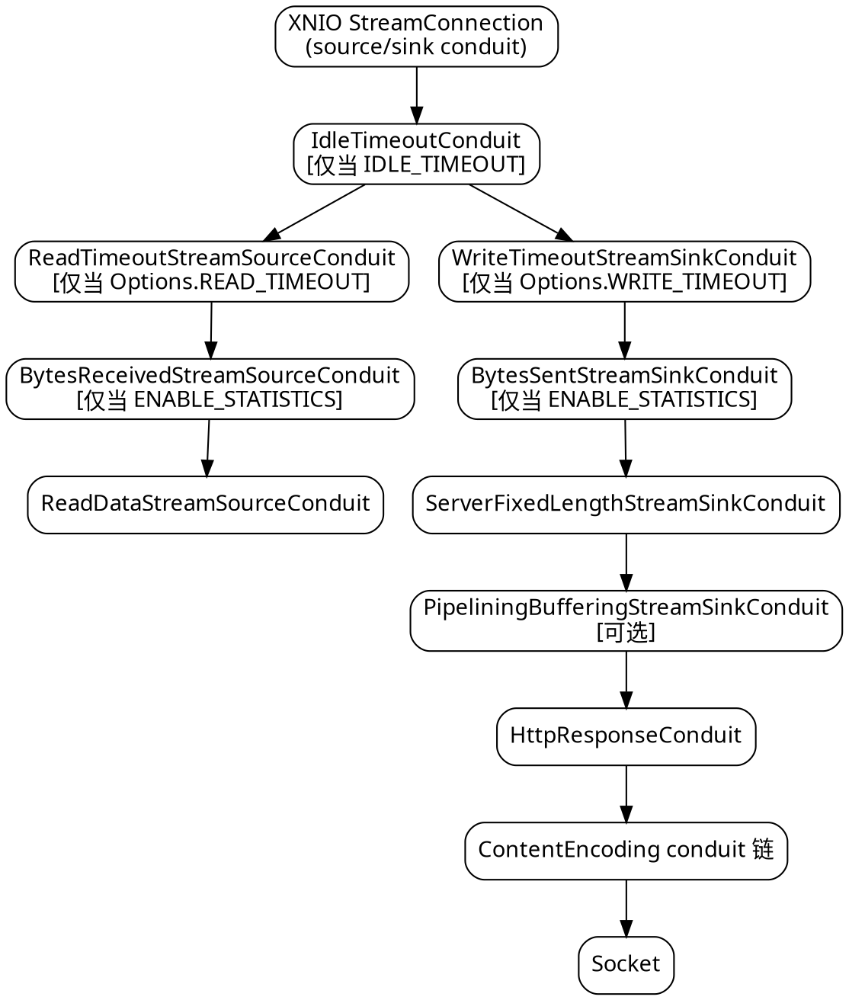

# HTTP 协议层

## Introduction

Tomcat 的连接层是 `Poller` + `Processor`（一个 socket 对应一个 processor 状态机，NioEndpoint 管 selector），Jetty 的是 `ManagedSelector` + `HttpConnection`（连接对象自己持有解析上下文与 fill/flush），Undertow 走的是第三条路：

1. **一条连接 = 一个 `HttpServerConnection`**，它本身几乎不含协议逻辑，只负责**把 conduit 链装配好**；
2. **协议语义落在 conduit 包装层**（`HttpResponseConduit`、`ReadDataStreamSourceConduit`、超时 conduit、统计 conduit），可插拔、可组合，这是 XNIO 的扩展点而不是 Netty 的 `ChannelPipeline`；
3. **读的驱动落在一个 `HttpReadListener`** 上，用 CAS 状态位保证「同一连接同一时刻只有一个线程在解析」，解析完成后立刻把 IO 线程交出去。

因此 Undertow 的 HTTP 层可以一句话概括：**conduit 链 + 一个手写解析器 + 一个 read listener**。理解这一层，才能理解为什么它的 keep-alive/pipelining/limit/timeout 全部体现为「链上多一个 conduit」或「option 多一个键」，而不是像 Tomcat 那样散落在 Endpoint/Processor/Adapter 三处。

本文以 Undertow 2.4.4.Final 源码为准，结论后标注 `相对 /tmp/src/tree/ 路径:行号`（省略前缀 `undertow-core-2.4.4.Final/io/undertow/`）。

## Connection object and conduit assembly order

`HttpServerConnection extends AbstractServerConnection`（`server/protocol/http/HttpServerConnection.java:59`），`final` 类。**构造函数就是装配脚本**（`:71-85`）：

```java
this.responseConduit = new HttpResponseConduit(channel.getSinkChannel().getConduit(), bufferPool, this);

fixedLengthStreamSinkConduit = new ServerFixedLengthStreamSinkConduit(responseConduit, false, false);
readDataStreamSourceConduit = new ReadDataStreamSourceConduit(channel.getSourceChannel().getConduit(), this);
```

`server/protocol/http/HttpServerConnection.java:76-79`

写侧的 `fixedLengthStreamSinkConduit` 常驻链中用于「exchange 切换时按固定长度收口」，`exchangeComplete` 时先 `clearExchange()` 再转交 read listener（`:242`）；读侧的 `ReadDataStreamSourceConduit` 则负责在 entity body 读完后自动 `terminateRequest`。

完整链序（自 socket 向外）：



三段接入点各司其职：

| 环节 | 位置 | 说明 |
| :--- | :--- | :--- |
| 超时 conduit | `server/protocol/http/HttpOpenListener.java:112-125` | 在 `connection` 创建**之前**直接 `setConduit` 包上去，所以是每连接一次 |
| 统计 conduit | `HttpOpenListener.java:133-136` | 仅当 `ENABLE_STATISTICS`，`BytesSent`/`BytesReceived` 各一个 |
| 编码/长度 conduit | `HttpTransferEncoding.createSinkConduit`（`server/protocol/http/HttpTransferEncoding.java:204`）+ `HttpServerConnection.getSinkConduit`（`:218-225`） | exchange 级，每次响应重新计算 |

注意 `setPipelineBuffer`（`HttpServerConnection.java:289-291`）会**重建** `responseConduit`，把 `HttpResponseConduit` 挂到 buffering conduit 之下——这解释了为什么开 pipelining 缓冲时链序会变。

## RequestParser from generator to hand-written state machine

> [!WARNING]
>
> 旧资料（含多数中文教程与博客）普遍写「Undertow 的请求解析器由 `undertow-parser-generator` 注解处理器在编译期生成，类名 `io.undertow.protocols.http.HttpRequestParser`，文件头有 `// GENERATED` 标记」。**在 2.4.4.Final 中这三点全部不成立**，本篇已逐个抽查：
>
> - `io/undertow/protocols/http/` 目录**不存在**（`protocols/` 下只有 `ajp`、`alpn`、`http2`、`ssl`）；
> - 全树 `grep -rl "class HttpRequestParser"` **零命中**；
> - `server/protocol/http/`、`protocols/http2/` 下 `grep GENERATED` **零命中**，`RequestParser.java` 头部只有 Apache License 与 `@author Richard Opalka`（`:95-97`）。

现状是：服务器端解析器是一个**手写的 package-private 状态机** `final class RequestParser`（`server/protocol/http/RequestParser.java:97`），由 `HttpReadListener` 持有（`server/protocol/http/HttpReadListener.java:72`、`:95`），实例化入口 `RequestParser.instance(OptionMap)`（`:114`）。它只有 6 个 final 字段（`maxParameters`、`maxHeaders`、`slashDecodingFlag`、`decode`、`charset`、`allowUnescapedCharactersInUrl`，`:98-103`），**无状态、可跨连接共享**，真正的逐字节游标全在 `RequestState` 里（`server/protocol/http/RequestState.java`，含 `state`/`substate`/`targetType`/`count`，`reset()` 在 `:79-80` 把 `substate`、`targetType` 归零）。

### Method order inside handle

`handle()`（`RequestParser.java:118-127`）把一行请求拆成 5 个阶段方法，语义是「每个方法只在处于自己状态时才消费字节，否则立刻 return」——这让同一个 buffer 可以被反复喂入而无需回退：

```java
void handle(final ByteBuffer buffer, final RequestState state, final HttpServerExchange builder) throws BadRequestException {
    parseMethod(buffer, state, builder);
    while (buffer.hasRemaining() && state.state < VERSION) {
        parseRequestTarget(buffer, state, builder);
    }
    parseVersion(buffer, state, builder);
    while (buffer.hasRemaining() && !state.isComplete()) {
        parseFieldName(buffer, state, builder);
        parseFieldValue(buffer, state, builder);
    }
}
```

`server/protocol/http/RequestParser.java:118-127`

对应方法位置：`parseMethod` `:130`、`parseRequestTarget` `:155`、`parseVersion` `:198`、`parseFieldName` `:235`、`parseFieldValue` `:268`。方法名长度硬上限在 `util/ParserUtils.java:47`：`private static final int MAXIMUM_REQUEST_METHOD_LENGTH = 1 << 5;`，即 32 字节，超出直接判定非法。

### Four request targets

`parseRequestTarget` 在首个字节上一次性判定形式（`:158-176`），这是 RFC 9112 §2.7 的四形式实现：

| 形式 | 判据 | 子解析序 |
| :--- | :--- | :--- |
| origin-form | 首字节 `/`（`:161`） | `parsePath` |
| asterisk-form | 首字节 `*` 且方法为 `PRI`/`OPTIONS`（`:164`） | `parsePath` |
| authority-form | 方法 `CONNECT`（`:166`） | `parseHost` → `parsePort` → `parsePath` |
| absolute-form | 首字节是字母（`:168`） | `parseScheme` → `parseHost` → `parsePort` → `parsePath` |

判定后 `buffer.position(buffer.position() - 1)` 回退一字节交给子解析（`:175`）；四种都不匹配则 `throw new BadRequestException()`（`:174`）。

### Exceptions on exceeding limits

计数器在 `RequestState.count` 上累加，两个硬闸：

```java
if (++state.count > maxParameters) {
    if (isQueryParam) throw UndertowMessages.MESSAGES.tooManyQueryParameters(maxParameters);
    else throw UndertowMessages.MESSAGES.tooManyPathParameters(maxParameters);
}
```

`RequestParser.java:753-755`；头数上限 `:780-781`（`tooManyHeaders`，包成 `BadRequestException`）。cookie 数不在解析器里，而在 `util/Cookies.java:263`、`:268` 读取 `MAX_COOKIES`。

## HttpReadListener read loop

### requestState three-state CAS

`requestState` 是 `volatile int`（`HttpReadListener.java:86`）配 `AtomicIntegerFieldUpdater`（`:87`），语义只有三个值：

| 值 | 含义 |
| :--- | :--- |
| `0` | 正在解析（本线程持有连接） |
| `1` | 已交回 IO 线程、等待下一个请求 |
| `2` | 有线程请求 `resumeReads`，正在移交 |

`handleEvent` 入口是一个自旋闸门：只要 `requestState != 0` 就尝试 `CAS(1→2)`，成功则 `channel.suspendReads()` 后把状态恢复为 `1` 并 return（`:124-133`）；解析完成后 `requestStateUpdater.set(this, 1)`（`:224`）。这是「IO 线程绝不执行 handler」不变式的执行点，与 `HandlerChain` 的调度策略配合。

### Parse loop and header size gate

```java
if(httpServerExchange == null) {
    httpServerExchange = new HttpServerExchange(connection, maxEntitySize);
}
parser.handle(buffer, state, httpServerExchange);
...
int total = read + (begin - buffer.remaining());
read = total;
if (read > maxRequestSize) {
    UndertowLogger.REQUEST_LOGGER.requestHeaderWasTooLarge(connection.getPeerAddress(), maxRequestSize);
    sendBadRequestAndClose(connection.getChannel(), null);
    return;
}
} while (!state.isComplete());
```

`server/protocol/http/HttpReadListener.java:193-215`

两个细节值得记住：

- **exchange 在解析开始前就被创建**（`:194`），所以「400 太大」发生在已有 exchange 对象之后，但它不会进 handler 链；
- 超限响应是**一个硬编码常量串**，不经过 `HttpResponseConduit`：`private static final String BAD_REQUEST = "HTTP/1.1 400 Bad Request\r\nContent-Length: 0\r\nConnection: close\r\n\r\n";`（`:68`），由 `new StringWriteChannelListener(BAD_REQUEST)`（`:294`）直写 socket。因此这类 400 **不会计入 access log，也不受 `MAX_ENTITY_SIZE` 之类配置影响**。

`maxRequestSize` 在构造时取 `MAX_HEADER_SIZE`（`:97`），且是**跨多次 socket read 累加**的，所以慢速 drip 攻击同样会被切断。

### Protocol whitelist and prior-knowledge h2

解析完成后先判协议：`if(protocol != Protocols.HTTP_1_1 && protocol != Protocols.HTTP_1_0 && protocol != Protocols.HTTP_0_9)` 则关闭连接（`:235-241`），开关是 `ALLOW_UNKNOWN_PROTOCOLS`（默认 `false`，`UndertowOptions.java:302`、`:316`）。

HTTP/2 prior-knowledge 走同一入口：方法为 `PRI` 时匹配 `PRI_EXPECTED = {'S','M','\r','\n','\r','\n'}`（`:64-65`、`:466-467`），若 `ENABLE_HTTP2` 为真则移交 h2c，否则 400 关闭（`:272-280`）。最后 `HostHeaderHandler.WRAPPER` 被包在根链外面（`:263`），这是「Host 头缺失/重复」的兜底点，注意它**只对 HTTP/1.1 起效**。

`REQUIRE_HOST_HTTP11` 在 2.4.4 里已被废弃：构造时若检测到该键，只打 `configurationNotSupported` 日志（`:109-110`），不再改变行为。

## keep-alive and pipelining

### Decision

```java
private static boolean persistentConnection(HttpServerExchange exchange, String connectionHeader) {
    if (exchange.isHttp11()) {
        return !(connectionHeader != null && Headers.CLOSE.equalToString(connectionHeader));
    } else if (exchange.isHttp10()) {
        if (connectionHeader != null) {
            if (Headers.KEEP_ALIVE.equalToString(connectionHeader)) {
                return true;
            }
        }
    }
    return false;
}
```

`server/protocol/http/HttpTransferEncoding.java:153-165`

即 HTTP/1.1 **默认可持久**，只有显式 `Connection: close` 才断；HTTP/1.0 **默认不持久**，必须显式 `Connection: keep-alive`。这与 Tomcat 在 `Http11Processor` 里按 `req/setKeepAlive` 处理是同一套规则，但 Undertow 把它写成了一个纯函数，测试与推演都更容易。

### Response headers and the 417 exception

`createSinkConduit`（`:204`）在算完编码与长度后决定响应头：

```java
if(exchange.getStatusCode() == StatusCodes.EXPECTATION_FAILED) {
    //417 responses are never persistent, as we have no idea if there is a response body
    exchange.setPersistent(false);
}
if (!exchange.isPersistent()) {
    responseHeaders.put(Headers.CONNECTION, Headers.CLOSE.toString());
} else if (exchange.isPersistent() && connection != null) {
    if (HttpString.tryFromString(connection).equals(Headers.CLOSE)) {
        exchange.setPersistent(false);
    }
} else if (exchange.getConnection().getUndertowOptions().get(UndertowOptions.ALWAYS_SET_KEEP_ALIVE, UndertowOptions.DEFAULT_ALWAYS_SET_KEEP_ALIVE)) {
    responseHeaders.put(Headers.CONNECTION, Headers.KEEP_ALIVE.toString());
}
```

`HttpTransferEncoding.java:222-239`

三条结论：**417 永不持久**（因为无法预知 wire 上是否还有请求体）；handler 显式写了 `Connection` 时以 handler 为准；`ALWAYS_SET_KEEP_ALIVE` 默认 `true`（`UndertowOptions.java:190`、option `:198`），所以 1.1 响应上也会看到多余的 `Connection: keep-alive`——按 RFC 9112 它是可省的，关掉可减少一点字节，但对旧代理兼容性更好留着。另有一处易被忽略：未处理的 `CONNECT` 会被强制 `setPersistent(false)` 并写 `Connection: close`（`HttpServerConnection.java:219-222`）。

### pipelining and ungetRequestBytes

一次 socket read 常常同时吃到「当前请求 + 下一个请求」。解析器停在 `state.isComplete()` 后，剩余字节留在 buffer 里，`HttpReadListener` 用 `connection.setExtraBytes(pooled)` 把整块存回连接（`:204-206`），下次读取时优先消费它（`:186-191`）。

反方向的操作是**回推**：当解析器已经吃掉下一请求的字节但需要提前交还控制权时，用 `ungetRequestBytes(PooledByteBuffer)`（`HttpServerConnection.java:159-186`）把数据塞回 `extraBytes`。它的合并逻辑分两支：若新回推的缓冲有足够空位就 `compact()` + `put()` + `flip()` 复用（`:166-172`）；否则退化为一次性 `byte[]` 拼接并换成 `ImmediatePooledByteBuffer`（`:174-184`），源码里那行 `//TODO: this is horrible, but should not happen often` 是对这条慢路径的自嘲——**回推顺序错乱或频繁回推意味着 buffer 尺寸配小了**。

请求完成后是否继续读下一个，取决于 `exchangeComplete`（`HttpServerConnection.java:242-251`）：有 `pipelineBuffer` 时交给它，否则直接回到 read listener。`BUFFER_PIPELINED_DATA`（`UndertowOptions.java:73`，默认 `false`，但在 `Undertow.java:178` 对 HTTP listener 被显式设为 `true`）决定是否启用 `PipeliningBufferingStreamSinkConduit` 来缓冲后续响应。

## Response writing HttpResponseConduit

`final class HttpResponseConduit extends AbstractStreamSinkConduit<StreamSinkConduit>`（`server/protocol/http/HttpResponseConduit.java:55`）。它不做业务，只做一件事：**把 exchange 的状态行与响应头逐字符写进池化 buffer**，靠一个 int 状态机推进：

| 常量 | 值 | 含义 |
| :--- | :--- | :--- |
| `STATE_BODY` | `0` | 正常透传 body |
| `STATE_START` | `1` | 尚未写任何头（初值，`:60`） |
| `STATE_HDR_NAME` | `2` | 按 `charIndex` 遍历 header 名 |
| `STATE_HDR_D` / `STATE_HDR_DS` | `3` / `4` | `:` 与 `: ` 分隔符 |
| `STATE_HDR_VAL` | `5` | 写值 |
| `STATE_HDR_EOL_CR` | `6` | 头行 CR |

`HttpResponseConduit.java:74-79`

状态机的意义在于**可部分写**：`write()` 返回短写时不丢进度，下次从同一 state 继续。写头用的 `pooledBuffer` 字段在 `:67`（另有 `pooledFileTransferBuffer` 用于 sendfile），`reset(exchange)` 在 `:104` 由 `createSinkConduit` 每次响应调用以复位 `state`。这套设计的收益是零中间字符串拼接，代价是**排障时看不到完整的响应头文本**，只能靠 `HttpResponseConduit` 的 trace。

## Limits and timeouts overview

> [!NOTE]
>
> 下表逐个给出**出处**。所有值都是「option 未设置时的兜底默认」，即 `options.get(OPTION, DEFAULT)` 的第二个实参。

| 限制 | 默认值 | 出处 | 超限行为 |
| :--- | :--- | :--- | :--- |
| 头块总字节 | `1048576` | `UndertowOptions.java:42`、`DEFAULT_MAX_HEADER_SIZE` `:46` | 常量串 400 + 关闭（`HttpReadListener.java:210-213`） |
| 头部条数 | `200` | `DEFAULT_MAX_HEADERS` `:112`、`MAX_HEADERS` `:119` | `BadRequestException(tooManyHeaders)`（`RequestParser.java:780-781`） |
| 参数个数（query + path） | `1000` | `MAX_PARAMETERS` `:104`、`DEFAULT_MAX_PARAMETERS` `:109` | `tooManyQueryParameters` / `tooManyPathParameters`（`RequestParser.java:753-755`），对外为 `ParameterLimitException` |
| cookie 条数 | `200` | `DEFAULT_MAX_COOKIES` `:122`、`MAX_COOKIES` `:129` | 解析期抛（`util/Cookies.java:263-268`） |
| entity body | `2097152` | `MAX_ENTITY_SIZE` `:51`、`DEFAULT_MAX_ENTITY_SIZE` `:63` | `RequestTooBigException`（`server/RequestTooBigException.java`）；multipart 另有 `MULTIPART_MAX_ENTITY_SIZE` 同值 `:68` |
| 方法名长度 | `32`（`1 << 5`，硬编码不可配） | `util/ParserUtils.java:47` | 判定非法请求 |
| 未知协议 | 拒绝 | `DEFAULT_ALLOW_UNKNOWN_PROTOCOLS = false` `:302` | 400 + 关闭 |
| queued read buffer | `16` | `DEFAULT_MAX_QUEUED_READ_BUFFERS` `:392` | framed 协议暂停读 |

超时面分成**三层，互不重叠**，这是 Undertow 最容易配错的地方：

| 层 | 触发条件 | 实现 | 出处 |
| :--- | :--- | :--- | :--- |
| conduit 级读写/空闲 | 单次 `read()`/`write()` 或连接空闲 | `IdleTimeoutConduit`、`ReadTimeoutStreamSourceConduit`、`WriteTimeoutStreamSinkConduit` | `HttpOpenListener.java:112-125` |
| 解析期超时 | **请求头迟迟不收全** | `ParseTimeoutUpdater`（`implements Runnable, ServerConnection.CloseListener, Closeable`），两个计时器 `requestParseTimeout` / `requestIdleTimeout`，并额外加 `FUZZ_FACTOR = 50ms` 保证底层 conduit 已先超时 | `server/protocol/ParseTimeoutUpdater.java:38-50` |
| 无请求空闲 | 连接建立后**没有任何请求** | 同上的 `requestIdleTimeout`，消费 `NO_REQUEST_TIMEOUT` | `HttpReadListener.java:101-107` |

装配代码很能说明设计意图：

```java
int requestParseTimeout = connection.getUndertowOptions().get(UndertowOptions.REQUEST_PARSE_TIMEOUT, -1);
int requestIdleTimeout = connection.getUndertowOptions().get(UndertowOptions.NO_REQUEST_TIMEOUT, -1);
if(requestIdleTimeout < 0 && requestParseTimeout < 0) {
    this.parseTimeoutUpdater = null;
} else {
    this.parseTimeoutUpdater = new ParseTimeoutUpdater(connection, requestParseTimeout, requestIdleTimeout);
    connection.addCloseListener(parseTimeoutUpdater);
}
```

`server/protocol/http/HttpReadListener.java:102-107`

即 **`REQUEST_PARSE_TIMEOUT` 与 `NO_REQUEST_TIMEOUT` 的 option 默认值都是「关闭」（`-1`）**，但 Builder 在 `Undertow.java:148` 无条件 `.set(UndertowOptions.NO_REQUEST_TIMEOUT, 60 * 1000)`，所以实际部署下「空闲连接 60 秒断开」是默认生效的；`REQUEST_PARSE_TIMEOUT`（option `:89`）则需要显式设置才会启用 slowloris 防护。裸用 `HttpOpenListener` 而不走 Builder 的连接会得到「永不因无请求而关闭」的行为——这是最常见的隐性差异。

## HTTP/2

三层分工：`server/protocol/http2/`（服务器侧连接与流适配）+ `protocols/http2/`（协议通道本身，与服务器无关，可被客户端复用）+ `protocols/alpn/`（协议协商）。

### Negotiation and weights

HTTPS 且 `ENABLE_HTTP2`（`UndertowOptions.java:274`，默认 `false` `:267`）时，Builder 把 `HttpOpenListener` 降级为 fallback 塞进 `AlpnOpenListener`：

```java
AlpnOpenListener alpn = new AlpnOpenListener(buffers, undertowOptions, httpOpenListener);
Http2OpenListener http2Listener = new Http2OpenListener(buffers, undertowOptions);
http2Listener.setRootHandler(rootHandler);
alpn.addProtocol(Http2OpenListener.HTTP2, http2Listener, 10);
alpn.addProtocol(Http2OpenListener.HTTP2_14, http2Listener, 7);
```

`Undertow.java:207-211`

`HTTP2` 常量即字符串 `"h2"`（`server/protocol/http2/Http2OpenListener.java:62`）。权重语义：`addProtocol(String, DelegateOpenListener, int)`（`server/protocol/http/AlpnOpenListener.java:224`），比较器 `return -Integer.compare(this.weight, o.weight)` 表示**按 weight 降序择优**（`:220`）；构造时传入的 `httpOpenListener` 以 weight `0` 注册为 `fallbackProtocol`（`:125`）。所以优先级是 `h2(10) > h2-14(7) > http/1.1(0)`。

h2c（明文升级）不经过 ALPN：Builder 直接把根 handler 包一层 `Http2UpgradeHandler`（`Undertow.java:184-186`），该 handler 识别 `Upgrade: h2c` + `Connection: Upgrade` 并在 `101` 之后 `exchange.upgradeChannel(...)` 接管裸连接（`server/protocol/http2/Http2UpgradeHandler.java:57`、`:155-161`）。

### Connection object and two-layer flow control

`Http2ServerConnection extends ServerConnection`（`server/protocol/http2/Http2ServerConnection.java:89`）——注意它**不继承** `AbstractServerConnection`，因为 HTTP/2 的「连接」与「流」是两级对象，每条流才有自己的 exchange。请求侧回调集中在 `Http2ReceiveListener implements ChannelListener<Http2Channel>`（`server/protocol/http2/Http2ReceiveListener.java:74`），它自己读 `MAX_PARAMETERS`（`:98`），**不复用 HTTP/1 的 `RequestParser`**（HPACK 已给出结构化的 name/value）。

连接级窗口在 `protocols/http2/Http2Channel.java`：

```java
private volatile int initialSendWindowSize = UndertowOptions.DEFAULT_HTTP2_SETTINGS_INITIAL_WINDOW_SIZE;
private volatile long sendWindowSize = initialSendWindowSize;
```

`Http2Channel.java:225-235`

`DEFAULT_HTTP2_SETTINGS_INITIAL_WINDOW_SIZE = 65535`（`UndertowOptions.java:344`）正是 RFC 7540 §6.9.2 的初始值。`WINDOW_UPDATE` 帧在帧分发处就地消化、不上抛：`case FRAME_TYPE_WINDOW_UPDATE` → `handleWindowUpdate(frameParser.streamId, parser.getDeltaWindowSize())`（`:602-605`）。`handleWindowUpdate`（`:835-859`）把 `streamId == 0` 当作连接窗口、非 0 当作流窗口，两者都先拒绝 `delta == 0`——连接级回 `GOAWAY(ERROR_PROTOCOL_ERROR)`，流级回 `RST_STREAM(ERROR_PROTOCOL_ERROR)`；累加后若超 `Integer.MAX_VALUE` 回 `GOAWAY(ERROR_FLOW_CONTROL_ERROR)`。读侧对应 `Http2WindowUpdateStreamSinkChannel`。

`Http2Channel` 的头大小限制是**少数几个走 system property 的配置**：`HTTP2_MAX_HEADER_SIZE_PROPERTY = "io.undertow.http2-max-header-size"`（`:78`），注释明确说明该属性「将被替换为 Undertow option」——目前仍不是 option，容器化部署要记得 `-D`。

### HPACK and frame parsers

`protocols/http2/` 下共 13 个 `*Parser`，模式是**每种帧类型一个 parser**：`Http2HeadersParser`、`Http2DataFrameParser`、`Http2SettingsParser`、`Http2PingParser`、`Http2PriorityParser`、`Http2RstStreamParser`、`Http2WindowUpdateParser`、`Http2GoAwayParser`、`Http2PushPromiseParser`、`Http2HeaderBlockParser`、`Http2FrameHeaderParser`、`Http2PushBackParser`、`Http2DiscardParser`。帧头（9 字节）单独用 `Http2FrameHeaderParser` 解，之后按类型把 frame body 交给对应 parser（`Http2Channel.java:458`、`:504`、`:547`、`:563` 的 `frameParser.parser` 强转就是这套分发）。

HPACK 三件套：`HpackEncoder`、`HpackDecoder`、`HPackHuffman`，静态表在 `Hpack.java`。索引寻址可直接看出动态表的存在：`if (index <= Hpack.STATIC_TABLE_LENGTH) return Hpack.STATIC_TABLE[index].name;` 否则 `index > STATIC_TABLE_LENGTH + filledTableSlots` 判非法，再 `getRealIndex(index - STATIC_TABLE_LENGTH)` 落到动态表（`HpackDecoder.java:282-288`）。相关默认值：`HTTP2_SETTINGS_HEADER_TABLE_SIZE` 默认 `4096`（`UndertowOptions.java:321-322`）、`HTTP2_SETTINGS_MAX_CONCURRENT_STREAMS` 默认 `-1` 即不限（`:332-334`）、`HTTP2_PADDING_SIZE` 默认 `0`（`:362`）。`HTTP2_SETTINGS_MAX_HEADER_LIST_SIZE` 已标 `@Deprecated(forRemoval = true)`，理由是「实际上是 `MAX_HEADER_SIZE` 的重复」（`:352-357`）。

## AJP and ListenerType

`ListenerType` 只有三个值：`HTTP`、`HTTPS`、`AJP`（`Undertow.java:308-312`）——**没有独立的 HTTP/2 监听器类型**，h2 只能作为 HTTPS 的 ALPN 结果或 HTTP 的 upgrade 结果存在，这一点和 Tomcat 可以单开一个 `Http21`/`h2` ProtocolHandler 不同。

AJP 子树 `server/protocol/ajp/` 共 8 个类：`AjpOpenListener`、`AjpServerConnection extends AbstractServerConnection`（`AjpServerConnection.java:44`）、`AjpReadListener`、`AjpRequestParseState`、`AjpRequestParser`、`AjpServerRequestConduit`、`AjpServerResponseConduit`、`SecurityActions`。可见 AJP 走的是**与 HTTP 完全对称的形态**（OpenListener + Connection + ReadListener + 独立 parser + 两个方向的 conduit），只是不需要 keep-alive/pipelining 判定，因为 AJP 报文本身按「一请求一响应」成对。Builder 侧 AJP 分支不注入 `Http2UpgradeHandler`、也不带 `BUFFER_PIPELINED_DATA`（`Undertow.java:160-177`）。生产上 AJP 主要用于兼容既有 Apache httpd `mod_jk`/`mod_cluster` 链路；若可自由选择，HTTPS + ALPN 的直连或 h2c 都是更简单的拓扑。

## Statistics surface

`ConnectorStatisticsImpl implements ConnectorStatistics`（`server/ConnectorStatisticsImpl.java:29`）用一组 `AtomicLongFieldUpdater` 更新 `volatile long` 字段，避免锁也避免 `LongAdder` 的对象开销（`:31-40`）：`requestCount`、`bytesSent`、`bytesReceived`、`errorCount`、`processingTime`、`maxProcessingTime`、`activeConnections`、`maxActiveConnections`、`activeRequests`、`maxActiveRequests`。

整套统计由 `ENABLE_STATISTICS` 控制，**默认 `false`**（`UndertowOptions.java:279`、option `:289`；`ENABLE_CONNECTOR_STATISTICS` 在 `:297` 就是同一个对象的别名）。开启后效果有三：连接上多挂两个字节统计 conduit（`HttpOpenListener.java:133-136`）、`incrementConnectionCount()`（`:149`）并在 close listener 里对称 `decrementConnectionCount()`（`HttpServerConnection.java:82-84`）、每个 exchange 走 `connectorStatistics.setup(...)` 记录活跃请求（`HttpReadListener.java:245`）。注意 `UndertowOptions.java:509` 的注释提示：部分耗时统计只有在 `ENABLE_STATISTICS` 打开时才有值。

## Correction list

| 常见说法 | 2.4.4.Final 实况 | 证据 |
| :--- | :--- | :--- |
| 解析器是 `io.undertow.protocols.http.HttpRequestParser`，注解处理器生成 | 包不存在、类不存在；改为手写 `server/protocol/http/RequestParser`（package-private `final class`） | 目录清单 + `grep -r "class HttpRequestParser"` 零命中 |
| 存在 `ConnectionCounter` 类做连接计数 | 全树**无此类**；连接计数是 `ConnectorStatisticsImpl` 的 `activeConnections` 字段 | `grep -r ConnectionCounter` 零命中 |
| 用 `org.xnio.Options.MAX_PARAMETERS` 限制参数数 | XNIO 3.8 的 `Options` 已无该键；Undertow 内部全部读 `UndertowOptions.MAX_PARAMETERS`，**照旧教程写会编译不过** | `grep -rn "Options.MAX_PARAMETERS"` 命中的 5 处**全为** `UndertowOptions.`（`RequestParser.java:106`、`Connectors.java:381`、`:405`、`Http2ServerConnection.java:442`、`Http2ReceiveListener.java:98`） |
| ALPN 有 `JettyAlpnProvider` | `protocols/alpn/` 只有 `ModularJdkAlpnProvider` 与 `OpenSSLAlpnProvider`（外加 `ALPNProvider`/`ALPNManager`/`ALPNEngineManager`/`DefaultAlpnEngineManager`），Jetty 提供方已移除 | 目录清单 |
| `MAX_CONCURRENT_REQUESTS_PER_CONNECTION` 限制单连接并发请求 | **定义但未见消费方**：全树仅在 `UndertowOptions.java:387` 出现一次，核心源码零引用，设了不生效 | `grep -rn MAX_CONCURRENT_REQUESTS_PER_CONNECTION` |
| `HTTP2_HUFFMAN_CACHE_SIZE` 可调 Huffman LRU 缓存 | 同样**定义但未见消费方**，只在 `UndertowOptions.java:373` 出现 | `grep -rn HTTP2_HUFFMAN_CACHE_SIZE` |
| `REQUIRE_HOST_HTTP11` 可强制 Host 头 | 传入只产生 `configurationNotSupported` 日志，行为不变 | `HttpReadListener.java:109-110` |
| h2 头大小可用 option 配 | 仍走 system property `io.undertow.http2-max-header-size` | `Http2Channel.java:75-78` |

## Three-way comparison

| 维度 | Undertow 2.4.4 | Tomcat | Jetty |
| :--- | :--- | :--- | :--- |
| 连接对象 | `HttpServerConnection`，装配 conduit，几乎无协议逻辑 | `AbstractProcessor`/`SocketWrapperBase`，协议状态集中在 processor | `HttpConnection` 持有 `Request`/`Response` 与解析元数据 |
| 读驱动 | `HttpReadListener` + `requestState` 三态 CAS | `Poller` 事件 + `Processor` 状态机 | `ManagedSelector` + fill interest ops |
| 解析器 | 手写 `RequestParser` 状态机，游标在 `RequestState`，跨连接共享 | Http11InputBuffer + 内部 `ApplicationHttpRequest` | `HttpParser` 枚举状态机 |
| 扩展点 | `Conduit` 包装链（XNIO） | `Valve` + `Filter`（协议层不可插字节码） | `RequestHandler` + `ContentSource/Sink` |
| keep-alive 判定 | 纯函数 `persistentConnection()` + `ALWAYS_SET_KEEP_ALIVE` 补头 | `AbstractProcessor#keepAlive()` 与 `ConnectionHandler` | `HttpConfiguration#getPersistentConnectionsEnabled` 等 |
| pipelining | `ungetRequestBytes` 回推 + 可选 `PipeliningBufferingStreamSinkConduit` | 靠 input buffer 的 pos/limit，不缓冲响应 | `HttpInput` 保留未消费内容 |
| 头/参数上限 | `MAX_HEADER_SIZE` 1 MiB、`MAX_HEADERS` 200、`MAX_PARAMETERS` 1000、`MAX_COOKIES` 200 | `maxHttpHeaderSize`（默认 8 KiB）、`maxParameterCount` 1000、`maxHeaderCount` | `requestHeaderSize` 等 `HttpConfiguration` 项 |
| 解析超时 | `ParseTimeoutUpdater`（默认仅 `NO_REQUEST_TIMEOUT` 60s 生效） | `connectionTimeout` / `keepAliveTimeout` | `idleTimeout` |
| HTTP/2 协商 | ALPN 权重 `h2 10`/`h2-14 7`/`http/1.1 0`；h2c 靠 `Http2UpgradeHandler` | `UpgradeProtocol` + ALPN，或 `h2c` 独立 handler | ALPN + `ServerUpgradeRequest` |
| HTTP/2 头限制 | system property `io.undertow.http2-max-header-size` | `maxHeaderCount`/`maxHttpHeaderSize` | `HttpConfiguration` + `Request` |

## Pitfalls

1. **改了 `REQUEST_PARSE_TIMEOUT` 却没效果**：检查是否真的通过 `setServerOption` 传入（它是 server option 而非 socket option），以及是否被 Builder 默认的 `NO_REQUEST_TIMEOUT=60000` 掩盖——两者独立，前者管「正在解析」，后者管「根本没请求」。
2. **误以为 `MAX_HEADER_SIZE` 能限制 body**：它只作用于请求头累加字节（`HttpReadListener.java:97`）；body 由 `MAX_ENTITY_SIZE` 管，超限抛 `RequestTooBigException` 而不是 400。
3. **`Connection: close` 被覆盖**：handler 里直接 `put(CONNECTION, "close")` 会被判定不持久，但如果之后又 `exchange.setPersistent(true)`，`createSinkConduit` 分支顺序（`:228-239`）仍以响应头里的 `close` 为准。
4. **417 之后连接被断**：`ExpectationFailed` 场景无法判断是否还有 body，Undertow 选择保守关连接（`:222-225`），别指望 100-continue 后续请求还在同一连接上。
5. **统计数字常年为 0**：`ENABLE_STATISTICS` 默认关；并且部分指标只有开了统计才会挂上 conduit，链路上没有 `BytesSent`/`BytesReceived` 时 `bytesSent` 永远不动。
6. **h2 压测时头大小限制调不动**：`-Dio.undertow.http2-max-header-size` 必须在 JVM 启动参数里，容器内的 `application.yaml` 不起作用。
7. **`MAX_CONCURRENT_REQUESTS_PER_CONNECTION` 设了没反应**：见纠偏清单，2.4.4 核心源码未消费该 option；要限并发请走 `MAX_CONCURRENT_STREAMS`（h2）或应用层限流。
8. **AJP 与 HTTP 混用同一 `Undertow` 实例时行为不一致**：AJP 分支不套 `Http2UpgradeHandler`、也不设 `BUFFER_PIPELINED_DATA`（`Undertow.java:160` vs `:178`），依赖 upgrade 的功能在 AJP 上没有对应实现。
9. **凭旧文写解析器代码**：任何引用 `io.undertow.protocols.http.HttpRequestParser` 或 `org.xnio.Options.MAX_PARAMETERS` 的示例在 2.4.4 上都编译不过。

## Links

- [Undertow](/docs/CS/Framework/Undertow/Undertow.md)
- [XNIO](/docs/CS/Framework/Undertow/XNIO.md)
- [HandlerChain](/docs/CS/Framework/Undertow/HandlerChain.md)
- [Exchange](/docs/CS/Framework/Undertow/Exchange.md)
- [Servlet](/docs/CS/Framework/Undertow/Servlet.md)

## References

- [RFC 9112: HTTP/1.1](https://datatracker.ietf.org/doc/html/rfc9112)
- [RFC 7540: HTTP/2](https://datatracker.ietf.org/doc/html/rfc7540)
- [RFC 7541: HPACK - HTTP/2 Header Compression](https://datatracker.ietf.org/doc/html/rfc7541)
- [Undertow](https://undertow.io/)
