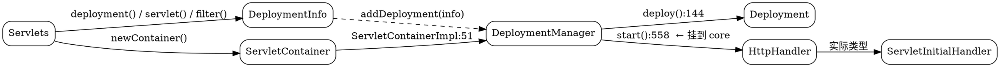

# Undertow Servlet

## Introduction

Undertow 的 Servlet 支持不是"内核里长出来的 Servlet 容器"，而是**架在 core 之上的一个 handler 部署器**：`undertow-servlet` 模块把一个 Servlet 应用编译成一棵普通 `HttpHandler` 树，交给 core 的 NIO 服务去跑。整个模块对 core 唯一的"逆向依赖"只有一个接口 —— `io.undertow.server.HttpHandler`，而它对外的出口也只有一个类：**`ServletInitialHandler` 同时实现 `HttpHandler` 与 `ServletDispatcher`**（`undertow-servlet-2.3.26.Final/io/undertow/servlet/handlers/ServletInitialHandler.java:80`）。看懂这个类，就看懂了 Undertow 的 Servlet 层。

三方对照，一句话各表：Tomcat 的 Catalina 把 Servlet 规范做成了一套容器/生命周期对象树（`Engine → Host → Context → Wrapper`，见 [Tomcat 容器模型](/docs/CS/Framework/Tomcat/Container.md)），Servlet 语义与容器实现是同义词；Jetty 把 Jakarta EE 层做成按版本号切换的独立模块（`ee10 / ee9 / ee8`），规范实现与内核之间有明确的多版本边界（见 [Jetty EE 层](/docs/CS/Framework/Jetty/EeLayer.md)）；Undertow 则是**单层薄封装**，规范语义全部收敛到 `spec/` 包里的 `HttpServletRequestImpl` / `HttpServletResponseImpl` 等 facade，容器语义仍是 core 的 `HttpServerExchange`。Servlet 规范本身的能力面见 [Servlet](/docs/CS/Java/JDK/Servlet.md)。

## Module version skew

> [!WARNING]
>
> 本库以 **`undertow-servlet` 2.3.26.Final + `undertow-core` 2.4.4.Final** 为准。两条版本线**不同步**：Maven Central 上 `io.undertow:undertow-servlet` 从未发布过 2.4.x；更早的 `undertow-servlet-jakarta` 线停在 2.2.20.Final。

实际影响有三个：

1. core 2.4.x 新增/改动的 handler、session、security 类可能被 servlet 2.3.26 引用，但**反过来不成立** —— 在 core 里看到的能力（例如 `server/handlers/` 下的新 handler）不能假定 servlet 部署链会自动带上。
2. 会话与安全**接口在 core、实现在两侧都有**（见下文两节），跨模块找符号时要先确认你在读哪个 jar。
3. 网上大量教程基于 1.x 的 `undertow-servlet-jakarta` 之前版本，API 与类名差异极大；本篇所有行号只对上述两个版本有效。

## Deployment object model

四个对象撑起全部嵌入用法，关系是**包含而非继承**：

- `Servlets`：静态工厂（`io/undertow/servlet/Servlets.java:44`），`newContainer():71`、`deployment():80`、`servlet():90`、`filter():123`、`securityConstraint():171`、`loginConfig():182`。
- `DeploymentInfo`：一个部署的**全部声明**（`api/DeploymentInfo.java`），`setDeploymentName():247`、`setContextPath():265`、`setClassLoader():278`、`addServlet(...):351`。它是纯数据对象，本身不会启动任何东西。
- `ServletContainer`：部署注册表（`api/ServletContainer.java:28`），关键方法是 **`addDeployment(DeploymentInfo):36`**，实现在 `core/ServletContainerImpl.java`（`addDeployment` 处 `new DeploymentManagerImpl(...)`，`:51`）。
- `DeploymentManager`：单个部署的控制器（`api/DeploymentManager.java`），只有 `deploy():39`、`start():46`（**返回 `HttpHandler`**）、`stop():48`。



正确嵌入代码（2.x；**不要写 `DeploymentManager.create()`**，见「纠偏」）：

```java
DeploymentInfo info = Servlets.deployment()
        .setClassLoader(App.class.getClassLoader())
        .setContextPath("/")
        .setDeploymentName("root");
info.addServlet(Servlets.servlet("hello", HelloServlet.class).addMapping("/hello"));

ServletContainer container = Servlets.newContainer();
DeploymentManager manager = container.addDeployment(info);
manager.deploy();                       // 构建 Deployment 与 handler 树
HttpHandler root = manager.start();     // 触发 ServletContextListener，返回根 handler

Undertow server = Undertow.builder()
        .addHttpListener(8080, "localhost")
        .setHandler(root)
        .build();
server.start();
```

## What deploy and start each do

`DeploymentManagerImpl.deploy()`（`core/DeploymentManagerImpl.java:144`）第一件事是 `originalDeployment.clone()` —— 之后所有装配读的都是这份克隆，改动 `DeploymentInfo` 不会影响已 deploy 的部署。接着按顺序做：建 `DeploymentImpl` 与 session manager → 反射出 `ManagedServlet` / `ManagedFilter` / `ManagedListener` → 初始化 error pages 与 MIME 映射（`:218-219`）→ 把 mapping 编译成路径表 → **组装 handler 树**（`:223-249`，见「三层 HandlerWrapper」）→ `deployment.setInitialHandler(...)`。

`start()`（`:558`）才真正进入 Servlet 语义：`deployment.getSessionManager().start()`，然后按规范顺序跑 `ServletContextListener.contextInitialized`、filter `init`、eager servlet `init`，最后把 `deployment.getInitialHandler()` 作为返回值交给调用方。也就是说 **`deploy()` 决定"长什么样"，`start()` 决定"活没活"**；`start()` 的返回值为 `null` 意味着部署失败，把它直接塞进 `Undertow.builder()` 是常见的 NPE 来源。

## Graft point ServletInitialHandler

`handleRequest`（`handlers/ServletInitialHandler.java:138-180`）是整个模块最值得读的一段：

```java
final ServletPathMatch info = paths.getServletHandlerByPath(path);
if (info.getType() == ServletPathMatch.Type.REWRITE) {
    // this can only happen if the path ends with a /
    // otherwise there would be a redirect instead
    exchange.setRelativePath(info.getRewriteLocation());
    exchange.setRequestPath(exchange.getResolvedPath() + info.getRewriteLocation());
}
...
exchange.putAttachment(ServletRequestContext.ATTACHMENT_KEY, servletRequestContext);
exchange.startBlocking(new ServletBlockingHttpExchange(exchange));
...
if (exchange.isInIoThread() || executor != null) {
    //either the exchange has not been dispatched yet, or we need to use a special executor
    exchange.dispatch(executor, dispatchHandler);
} else {
    dispatchRequest(exchange, servletRequestContext, info.getServletChain(), DispatcherType.REQUEST);
}
```

三个要点：

1. **`ServletRequestContext` 是 attachment，不是字段**。request/response/匹配结果/`DispatcherType` 全打包成一个对象挂在 `exchange` 上（`:164`），链条上任何一个 handler 都能 `exchange.getAttachment(...)` 取回。这让 Servlet 层的 handler 保持无状态、可被 core 任意组合。
2. **阻塞语义靠 `ServletBlockingHttpExchange` 装饰**（`:166`）。`InputStream`/`getWriter()` 之所以能阻塞，是因为 core 的 `startBlocking` 被 servlet 侧接管，机制见 [Exchange](/docs/CS/Framework/Undertow/Exchange.md)。
3. **Servlet 请求默认不在 IO 线程上跑**：`:175-176` 只要还在 IO 线程、或者该 chain 配了专属 `Executor`，就 `exchange.dispatch(executor, dispatchHandler)` 切到 worker。这是 Undertow 与 core 纯 handler 编程模型的最大差别 —— 你手写 `HttpHandler` 时可以一路在 IO 线程跑完（除非主动 dispatch），而一旦套上 Servlet 层，每个请求至少多一次线程切换。`dispatchHandler` 定义在 `:97-106`，回到 worker 后再调 `dispatchRequest`。

实例化位置在 `core/SecurityActions.java:108-113`（`createServletInitialHandler`，带 `AccessController.doPrivileged` 分支），由 `deploy()` 在 `:243` 放入链尾。此外 `dispatchToPath():182` 与 `dispatchToServlet():189` 就是 `ServletDispatcher` 接口的两个入口，forward/include 靠它们重新落到链条中段。

## URL matching

规范里的三类匹配（exact、`/*` 前缀、`*.ext` 扩展名）在 Undertow 分成两层：

- **构建期**：`handlers/ServletPathMatches.java:62`（`类声明`）在 `:247-415` 扫描 `DeploymentInfo`，把 mapping 归成 `pathMatches` / `extensionMatches` / `defaultServlet` 三堆。规则很直白：`*.xxx` 进扩展名集合（`:298-300`），`/*` 且没有前缀的是 default servlet（`:282-286`），其余进前缀/精确集合；同一个路径被两个 servlet 声明会直接抛 `twoServletsWithSameMapping`（`:290`）。若没人映射 default servlet，框架自己补一个 `/*` → `DefaultServlet`（`:314-317`）。结果通过 `ServletPathMatchesData.Builder` 落成三张表：`addExactMatch():110`、`addPrefixMatch():114`、`addExtensionMatch():126`、`addNameMatch()`（named dispatcher 用）。
- **运行期**：facade 的 `getServletHandlerByPath()`（`handlers/ServletPathMatches.java:124`）带"配置变了就重建表"的守卫；真正的查找在 `handlers/ServletPathMatchesData.java:60-83`，顺序是 `exactPathMatches.get(path)` → `SubstringMap` 最长前缀命中 → 命中前缀内部再按**最后一个 `.`** 之后的扩展名查 `extensionMatches`，查不到退回该前缀的 `defaultHandler`。前缀匹配用的是 `SubstringMap`（core 的最长前缀结构），所以是 O(path) 而不是遍历。

`ServletPathMatch.Type` 只有 `REDIRECT`（`:103`）与 `REWRITE`（`:108`）两个非平凡值：目录访问（`/dir` 而映射是 `/dir/`）出 REDIRECT，welcome-file 重写为具体文件出 REWRITE；`RedirectDirHandler` 负责前者，REWRITE 的落回上面 `ServletInitialHandler:146-151`。⚠️ **core 里没有 `PathTemplateParser` 这个类**（有 `PathTemplateHandler` / `template/PathTemplate`，是另一套东西），别把两者混为一谈。forward / include 的实现在 **servlet** 模块的 `util/DispatchUtils.java`（不在 core）。

## Filter chain

每个"匹配结果"就是一个 `ServletChain`（`handlers/ServletChain.java:37`）：`handler` + `managedServlet` + 该 chain 生效的 `Executor`（`:69` 从 `ServletInfo` 取）+ `Map<DispatcherType, List<ManagedFilter>> filters`（`:45`）。构造器 `:51-68` 给 `originalHandler` 外面包了一层 lazy-init 守卫（第一次进入时 `forceInit(dispatcherType)`，双检锁），用来支撑 `<load-on-startup>` 缺省时的延迟初始化。

filter 环不在 `ServletChain` 里，而是**构建期就焊进 handler 树**：`new FilterHandler(filtersByDispatcher, allowNonStandardWrappers, targetServlet)`（`handlers/ServletPathMatches.java:407`、`:453`、`:465`）。运行期 `FilterHandler`（`handlers/FilterHandler.java:42`）从 attachment 取 `ServletRequestContext`，**先按 `DispatcherType` 选列表**（`:73`、`:79`），列表为空就直接 `next.handleRequest`，否则 new 一个内部 `FilterChainImpl`（`:83`）以 `location` 游标推进。顺带在这里结算 `asyncSupported`：任一 filter 在该 dispatcher 下不支持异步，就把整个上下文标成不支持（`:74-77`）。

与 Tomcat 的关键差异：Tomcat 每个请求现场组装一条 `ApplicationFilterChain`（从 `FilterMaps` 匹配出来，对象在请求内流动）；Undertow 在 `deploy()` 时为**每个 (pattern × DispatcherType) 组合**各生成一条不可变链，请求只带一个 `DispatcherType` 枚举。代价是部署期对象更多，收益是运行期零匹配计算、链上无锁、且 filter 顺序问题在启动时就暴露。Tomcat 侧的流水线对照见 [Valve 与流水线](/docs/CS/Framework/Tomcat/Valve.md)。

## Session

三层拆开看，跨两个模块：

| 层次 | 位置 | 说明 |
| :-- | :-- | :-- |
| 接口 | core `io/undertow/server/session/SessionManager` | 与 servlet 无关，纯 core 概念 |
| 实现 | core `server/session/InMemorySessionManager.java:53` | 同时实现 `SessionManagerStatistics` |
| 工厂 | servlet `api/SessionManagerFactory.java` → `core/InMemorySessionManagerFactory` | 部署时由 `DeploymentInfo` 选定 |
| 持久化 SPI | servlet `api/SessionPersistenceManager.java` + `util/InMemorySessionPersistence` | 只在开发模式被挂载 |
| facade | servlet `spec/HttpSessionImpl.java` | 只是 `HttpSession` 的壳，不含存储逻辑 |

装配点在 `core/DeploymentManagerImpl.java:233`：`handleDevelopmentModePersistentSessions(...)` 只有在你配了 `DeploymentInfo.setSessionPersistenceManager(...)`（`api/DeploymentInfo.java:951`）时才插入 `SessionRestoringHandler`（`handlers/SessionRestoringHandler.java:48`）。它 `start()` 时切 TCCL 后 `loadSessionAttributes(deploymentName, classLoader)`（`:69-85`），`stop()` 时遍历 `sessionManager.getTransientSessions()` 逐个序列化落盘（`:87-91`）。类注释自己写着 **"This handler should not be used in production environments."**（`:44`）—— 生产环境的会话外置（Redis / JDBC）应当实现 core 的 `SessionManager` 而不是这个 SPI。

同节还有一个常被忽略的 handler：`CrawlerSessionManagerHandler`，在 `:239-241` 按 `CrawlerSessionManagerConfig` 可选插入，作用是把搜索引擎爬虫折叠到极少数 session 上，避免爬虫把内存会话表撑爆。它挂在很外层（`ServletInitialHandler` 之内、outer wrappers 之外），所以爬虫判定发生在业务代码之前。

cookie 行为（`HttpSession` 的 `JSESSIONID`）是两侧拼起来的：servlet 侧 `api/ServletSessionConfig` 承载规范配置、`spec/SessionCookieConfigImpl` 对应 `ServletContext.getSessionCookieConfig()`、`api/SessionConfigWrapper` 允许在部署时改写；core 侧 `server/session/CookieAttributes`、`SessionCookieConfig`、`PathParameterSessionConfig`（URL 重写 `;jsessionid=`）、`SslSessionConfig` 与 `SecureRandomSessionIdGenerator` 提供实际行为。想做 `SameSite` / `Partitioned` 之类的现代 cookie 属性，改 servlet 层的配置通常不够，得往 core 的 `SessionConfig` 上追。

## Security

Undertow 的安全是**core 提供认证原语、servlet 负责规范语义的再包装**。

core 侧（`undertow-core-2.4.4.Final/io/undertow/security/impl/`）是一族 `AuthenticationMechanism`：`BasicAuthenticationMechanism`、`DigestAuthenticationMechanism`（配 `SimpleNonceManager`）、`FormAuthenticationMechanism`、`ClientCertAuthenticationMechanism`、`ExternalAuthenticationMechanism`、`GenericHeaderAuthenticationMechanism`、`GSSAPIAuthenticationMechanism`（SPNEGO，`:65` 类声明，`private static final String name = "SPNEGO";` 在 `:99`），加上 `SingleSignOn` + `InMemorySingleSignOnManager` 做跨请求凭据缓存，判定结果落到 `SecurityContextImpl`。

servlet 侧（`io/undertow/servlet/handlers/security/`）把它们套成 Servlet 规范要的形状：`ServletAuthenticationCallHandler` 发起认证、`ServletAuthenticationConstraintHandler` 与 `ServletConfidentialityConstraintHandler` 处理 `<transport-guarantee>`、`ServletSecurityConstraintHandler` + `SecurityPathMatches` / `SecurityPathMatch` 做 `<security-constraint>` 的 URL-pattern 匹配、`ServletSecurityRoleHandler` 落 `role-name` 判定、`ServletFormAuthenticationMechanism` 与 `ServletSingleSignOnAuthenticationMechanism` 分别桥接 FORM 登录与 SSO；`MarkSecureHandler` 与 `SSLInformationAssociationHandler` 支撑 `isSecure()` 与 `getScheme()`。装配函数 `setupSecurityHandlers`（`core/DeploymentManagerImpl.java:316`）的注释很重要：**"the handler that actually performs the access check happens later in the chain, it is not setup here"** —— 认证与授权被有意拆成两段，因此链条里还有 `PredicateHandler(DispatcherTypePredicate.REQUEST, ...)`（`:228`、`:232`）保证**安全只在 REQUEST 上生效，forward / include 不重复鉴权**。约束的数据模型是 `api/SecurityConstraint.java` + `ServletSecurityInfo` / `HttpMethodSecurityInfo` / `TransportGuaranteeType`。

一个真实源码事实：`handlers/security/` 里同时存在 `ServletSingleSignOnAuthenticationMechanism.java` 和拼错的 `ServletSingleSignOnAuthenticationMechainism.java`（`Mechain`）。后者**不是残留垃圾**，而是刻意的兼容壳 —— 类注释 `:24` 写着 `This class name has a type, kept for backwards compatibility reasons`，`:28` 标 `@Deprecated`，`:29` 直接 `extends` 正确拼写的类且只转发构造器。全库再无引用。看到它不要以为是版本错乱。

## Async

入口是 `spec/AsyncContextImpl.java`（`request.startAsync()` 返回它）。值得抄进笔记的是 `complete()`（`:236-254`）：**`synchronized` + 幂等**，第二次调用只打一条 trace 就返回；先摘掉超时 `timeoutKey`，再按 `dispatched` 分流到 `completeInternal(false)` 或 `onAsyncComplete()`；最后如果存在 `previousAsyncContext`（嵌套 startAsync）就级联 complete。

异步与前面 `exchange.dispatch(executor, dispatchHandler)` 是同一条机制的两端：`startAsync` 期间 exchange 不会被回收、也不写响应，`AsyncContext.dispatch(...)` 走 `ServletDispatcher` 把请求重新投回 worker 线程；这也解释了为什么 Undertow 的 Servlet 异步不需要 core 里的额外 handler —— 它复用的就是 dispatch 能力。超时靠 core 的 `IoTimeout` 机制挂 `timeoutKey`，因此**超时线程是 IO 线程**，监听器里做重活要自己再切线程。

> [!NOTE]
>
> 2.x **已无 `io/undertow/servlet/core/managed/` 包**：`ManagedExecutorFactory`、`ManagedThreadFactory` 都随 Java EE 时代的 `CommonManagedExecutorFactory` 退场，异步执行器统一由 `DeploymentInfo` / `ServletInfo.setExecutor(...)` 提供普通 `Executor`。

## Three layers of HandlerWrapper

`DeploymentInfo` 提供三种包装器列表，字段在 `api/DeploymentInfo.java:151`（initial）、`:157`（outer）、`:163`（inner），添加方法分别在 `:807` / `:783` / `:798`（对应 getter `:811` / `:787` / `:802`）。三者的差别不是风格，而是**在链条里的位置决定了它在哪个线程、哪个 dispatch 阶段跑**。`core/DeploymentManagerImpl.java:223-249` 原样摘录装配过程：

```java
HttpHandler wrappedHandlers = ServletDispatchingHandler.INSTANCE;
wrappedHandlers = wrapHandlers(wrappedHandlers, deploymentInfo.getInnerHandlerChainWrappers());
wrappedHandlers = new RedirectDirHandler(wrappedHandlers, deployment.getServletPaths());
if(!deploymentInfo.isSecurityDisabled()) {
    HttpHandler securityHandler = setupSecurityHandlers(wrappedHandlers);
    wrappedHandlers = new PredicateHandler(DispatcherTypePredicate.REQUEST, securityHandler, wrappedHandlers);
}
HttpHandler outerHandlers = wrapHandlers(wrappedHandlers, deploymentInfo.getOuterHandlerChainWrappers());
outerHandlers = new SendErrorPageHandler(outerHandlers);
wrappedHandlers = new PredicateHandler(DispatcherTypePredicate.REQUEST, outerHandlers, wrappedHandlers);
wrappedHandlers = handleDevelopmentModePersistentSessions(...);
...
final ServletInitialHandler servletInitialHandler = SecurityActions.createServletInitialHandler(...);
HttpHandler initialHandler = wrapHandlers(servletInitialHandler, deployment.getDeploymentInfo().getInitialHandlerChainWrappers());
initialHandler = new HttpContinueReadHandler(initialHandler);
if(deploymentInfo.getUrlEncoding() != null) {
    initialHandler = Handlers.urlDecodingHandler(deploymentInfo.getUrlEncoding(), initialHandler);
}
```

于是由外到内是：URL 解码 → `HttpContinueReadHandler` → **initial wrappers** → `ServletInitialHandler`（在这里 dispatch 到 worker）→ crawler → metrics → 会话恢复 → **REQUEST 才走的 outer wrappers + `SendErrorPageHandler`** → **inner wrappers** → `ServletDispatchingHandler` → 匹配到的 `ServletChain`（filter 环 → servlet）。三条推论：

1. **initial wrapper 跑在 IO 线程上**（它包在 `ServletInitialHandler` 外面），所以只能做非阻塞、极短的事；要做重活放 inner / outer。
2. **outer wrapper 只覆盖 `DispatcherType.REQUEST`**，forward / include 会绕过它 —— 想给所有 dispatch 都插桩只能用 inner。
3. `ServletDispatchingHandler.INSTANCE`（`handlers/ServletDispatchingHandler.java:31`、`:34-36`）是链条的哑终端，它只做一件事：`exchange` 上取 `ServletPathMatch` 然后 `info.getHandler().handleRequest(exchange)`。这就是 forward/include 能"重新落到链条中段"的原因 —— `DispatchUtils` 改了上下文里的 `ServletPathMatch`，同一个位置就能拿到新的 chain。

Spring Boot 侧不做任何 Undertow 内部改造：它的 factory 只是构造一个 `DeploymentInfo`、把 `mgr.start()` 返回的 `HttpHandler` 当成根 handler 交给 `Undertow.builder()`（镜像里没有任何 Spring 代码，这句话是对 Boot 行为的说明，不是源码事实）。Boot 的 servlet 容器抽象见 [Spring Boot](/docs/CS/Framework/Spring_Boot/Spring_Boot.md)；响应式栈不用 Servlet 层，见 [WebFlux](/docs/CS/Framework/Spring/webflux.md)。

## Instantiation and lifecycle

`deploy()` 造出来的不是 handler，而是三类 **Managed 包装**：`core/ManagedServlet.java`（`:53` 类声明 `implements Lifecycle`）、`core/ManagedFilter.java` / `ManagedFilters.java`、`core/ManagedListener.java`，注册表分别是 `ManagedServlets` 与 `api/ServletInfo` / `FilterInfo` / `ListenerInfo` / `FilterMappingInfo`。它们承担三件规范要求的脏活：

1. **实例化策略**。`api/InstanceFactory` + `api/InstanceHandle` 是唯一出口，默认实现是 `util/ConstructorInstanceFactory`（每次 `load-on-startup` 用 `ImmediateInstanceFactory`，普通 servlet 每请求 new）与 `util/ImmediateInstanceHandle`。`ManagedServlet` 内部还有一个 `DefaultInstanceStrategy`（`core/ManagedServlet.java:271`）按 `load-on-startup` / singleThreadModel 语义分流；`api/ClassIntrospecter`（默认 `util/DefaultClassIntrospector`）负责反射注解与 `@WebServlet` 之类的元数据抽取，可被 `DeploymentInfo` 换掉。
2. **生命周期回调顺序**。`core/Lifecycle.java` 是 `start()/stop()` 的统一接口，`api/LifecycleInterceptor` 允许你把每次 init/destroy 包起来（做指标或埋点），监听器分发在 `core/ApplicationListeners.java`（它同时是 `ServletContextAttributeListener` / `HttpSessionListener` 等的扇出点，配合 `core/SessionListenerBridge`）。`ServletContainerInitializer` 的声明走 `api/ServletContainerInitializerInfo`，是 `web.xml` 之外注入 filter/servlet 的正规通道。
3. **TCCL 与线程装配**。servlet 代码假定 context classloader 是应用自己的，于是链条上每一步都过 `api/ThreadSetupHandler` / `ThreadSetupAction`：`core/ContextClassLoaderSetupAction` 负责切 classloader，`core/ServletRequestContextThreadSetupAction` 负责同时把 `ServletRequestContext` 放进 thread-local 语义的位置，`api/Deployment.createThreadSetupAction(...)` 是取得它们的入口（`ServletInitialHandler` 的 `firstRequestHandler` 与 `DeploymentManagerImpl.start()` 都走这条路）。⚠️ 这套东西**不是** `ManagedThreadFactory`，别和已删除的 `core/managed/` 混。

## DefaultServlet and static resources

`handlers/DefaultServlet.java` 是 `/*` 兜底的实现，配置项在 `api/DefaultServletConfig`（`DeploymentInfo.setDefaultServletConfig(...)`），它本质是 core 的 `resource/handlers/ResourceHandler` 的一层 servlet 化包装 —— 意味着 range 请求、目录列表、ETC 缓存行为都以 core 的语义为准。三个高频细节：

- **MIME 映射两张表**：`api/MimeMapping` 是你 `web.xml` / `addMimeTypeMapping` 的入口，字符集缺省表在 `core/DefaultCharsetMapping` + 同包资源文件 `core/charset.mapping`（编译进 jar 的纯文本表）。找不到扩展名不会 500，只会缺 `charset`。
- **welcome files**：`DeploymentInfo` 上的 welcome-file 列表与 `RedirectDirHandler` / `ServletPathMatchesData` 的 `requireWelcomeFileMatch` 标记共同决定 `/dir` 是 302、200 还是 `index.html` 重写（`MappingMatch.DEFAULT` + `isRequireWelcomeFileMapping()` 路径）。这也是 `ServletPathMatch.Type.REWRITE` 唯一的常见来源。
- **错误页**：`api/ErrorPage` 在 `deploy()` 时由 `initializeErrorPages`（`core/DeploymentManagerImpl.java:218`）灌进 `core/ErrorPages`，最终响应由 `handlers/SendErrorPageHandler`（`:231`）与 `spec/HttpServletResponseImpl.sendError` 协同完成。异常兜底见 `api/ExceptionHandler`（默认 `LoggingExceptionHandler`），堆栈是否吐给客户端由 `api/ServletStackTraces`（`NONE` / `FIRST_CAUSE` / `ALL`，`ALL` 会在 `deploy()` 开头打一条警告日志，`:147-148`）。

## Statistics and observability

只剩一条路：`DeploymentInfo.setMetricsCollector(...)`（`api/DeploymentInfo.java:1130`），接口是 `api/MetricsCollector.java`，装配点在 `core/DeploymentManagerImpl.java:235-238` —— 非空就套一层 `core/MetricsChainHandler`，因此统计的粒度是"每个 chain 的请求数 / 运行时间 / 状态码"，位置在会话恢复之内、outer wrapper 之外。

## Corrections

| 流传写法 | 2.x 事实 | 证据 |
| :-- | :-- | :-- |
| `DeploymentManager mgr = DeploymentManager.create()` | **没有这个静态工厂**。走 `ServletContainer.addDeployment(info)` | `api/ServletContainer.java:36` → `core/ServletContainerImpl.java:51` |
| `io.undertow.server.handler.extensions.PathTemplateParser` | 无此类；路径模板能力是 core 的 `PathTemplateHandler` / `template/PathTemplate`，与 Servlet 映射无关 | core `server/handlers/` 目录清单 |
| `AuthenticationAPIRepository` | 无此类；安全侧的可插拔点是 `security/api/AuthenticationMechanism` 一族 + `IdentityManager` | core `security/impl/` 目录清单 |
| `io.undertow.servlet.core.managed.ManagedExecutorFactory` | 2.x 已删该包；用 `DeploymentInfo` / `ServletInfo.setExecutor(Executor)` | servlet `core/` 目录清单 |
| `DeploymentInfo.setStatisticsEnabled(true)` | **不存在**，全模块 grep `statisticsEnabled` 为空；只有 `setMetricsCollector` | `api/DeploymentInfo.java:1130` |
| "Undertow 的 Servlet 在 IO 线程上跑" | 默认 `exchange.dispatch(executor, ...)` 切 worker | `handlers/ServletInitialHandler.java:175-176` |

## Pitfalls

- **忘了 `start()` 的返回值**：`deploy()` 之后 handler 树还没活（listener 未跑、session manager 未 start），把 `getInitialHandler()` 之类的旧写法搬过来会得到"503 或直接 NPE"。必须用 `start()` 返回的 `HttpHandler`。
- **在 initial wrapper 里做阻塞 IO**：它在 `ServletInitialHandler` 之前，仍在 IO 线程上；一处阻塞会拖垮该 worker 上所有连接的读写。诊断方法是看堆栈里线程名是否 ` I/O worker`。
- **filter 顺序莫名变化**：Undertow 的顺序在 `deploy()` 就固化成 `Map<DispatcherType, List<ManagedFilter>>`，运行时 `ServletContext.addFilter` 之后**已生成的 chain 不会自动重排**；需要改 mapping 就重建部署，或确认你的 `ServletPathMatches` 是否触发了重建守卫（`:124`）。
- **安全对 forward 不生效被当成漏洞**：这是规范行为，`:228`/`:232` 的 `DispatcherTypePredicate.REQUEST` 明确限定；靠 forward 暴露受保护资源不是绕过，资源本身映射到 forward 目标时才是风险。
- **指望 `SessionPersistenceManager` 做会话共享**：它是开发模式重启续命的（`SessionRestoringHandler.java:44` 注释），生产要换 core 的 `SessionManager` 实现。
- **按 core 的类名去 servlet jar 里找符号**：版本线不同步（core 2.4.4 / servlet 2.3.26），找不到先确认是哪个 artifact，而不是断定"API 已删"。
- **以为 `setHandler(root)` 之外还需要 core 侧的 `PathHandler`**：`ServletInitialHandler` 用的是 `exchange.getRelativePath()`（`handlers/ServletInitialHandler.java:139`），也就是**已经吃掉 `deployment.getContextPath()` 之后**的路径；再套一层 `PathHandler` 会把前缀剥两次，表现为"所有映射都 404"。多应用共用一个 listener 时要用 core 的 `Handlers.path()` 在 `addDeployment` 之前分流，或者干脆每个应用一个 context path 交给 `ServletPathMatches`。
- **忽略非法路径段的短路**：`handleRequest` 第一行就 `Paths.isForbidden(path)`（`:141-144`，`handlers/Paths.java`）直接 404，不写任何响应体。含编码后的 `..`、NUL 等的路径在这里就死了，因此在 filter 里看不到这类请求，日志排查时容易误判成"没进应用"。
- **静态资源也想要非阻塞读**：`DefaultServlet` 走的是 core 的资源 handler + 阻塞 exchange，同样会被 `:176` 派发到 worker。要真正把静态资源留在 IO 线程，应该在 Servlet 层**外面**用 core 的 `ResourceHandler` 拼 `PredicateHandler`，而不是调 servlet 的参数。
- **`PushBuilder` 与 `Upgrade` 语义依赖 core 能力协商**：`spec/PushBuilderImpl` 只在 HTTP/2 连接上有意义，`spec/ServletConnectionImpl` / `spec/WebConnectionImpl` 是 Servlet 4/6 的连接抽象壳，`core/ServletUpgradeListener` + `spec/UpgradeServletInputStream` / `UpgradeServletOutputStream` 才让 `HttpServletRequest.upgrade()` 可用；HTTP/2 细节见 core 侧笔记，别在 servlet 层找实现。
- **拿不到全局容器实例**：`Servlets.newContainer()` 每次返回新的 `ServletContainerImpl`，而 `ServletContainer.Factory.newInstance()`（`api/ServletContainer.java` 内部类 `Factory`）行为相同；模块里那个 `private static volatile ServletContainer container`（`Servlets.java:46`）只是历史便捷字段，别依赖它做单例。

## Links

- [Undertow](/docs/CS/Framework/Undertow/Undertow.md)
- [XNIO](/docs/CS/Framework/Undertow/XNIO.md)
- [HTTP 协议解析](/docs/CS/Framework/Undertow/HttpProtocol.md)
- [Handler Chain](/docs/CS/Framework/Undertow/HandlerChain.md)
- [Tomcat 部署](/docs/CS/Framework/Tomcat/Deployment.md)
- [Tomcat 安全](/docs/CS/Framework/Tomcat/Security.md)

## References

- [Jakarta Servlet 6.0](https://jakarta.ee/specifications/servlet/6.0/)
- [Undertow](https://undertow.io/)
- [undertow-servlet 版本清单](https://repo1.maven.org/maven2/io/undertow/undertow-servlet/)
