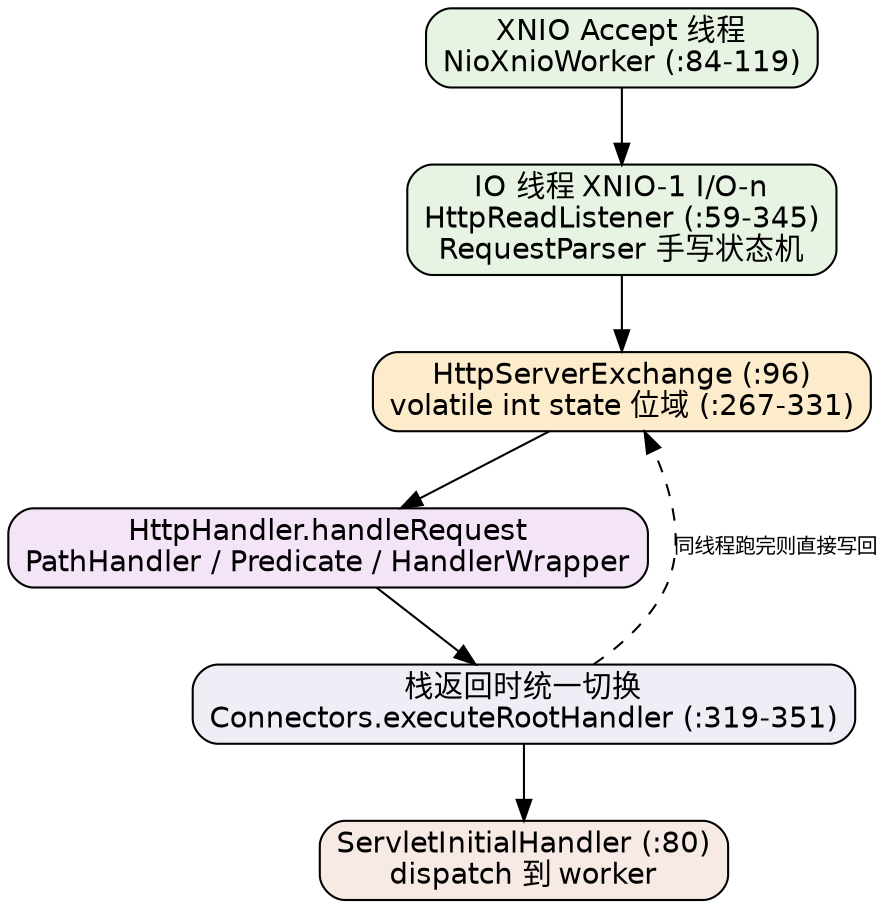

## Introduction

Undertow 是 JBoss / Red Hat 出的非阻塞 Web 服务器。它在 Java Web 容器里的位置很特殊：**Tomcat 和 Jetty 是「先有 Servlet 容器，再往外长出 HTTP 服务器」，Undertow 是「先有一个通用的 exchange-over-conduit 服务器，再把 Servlet 支持作为一个部署器叠上去」**。这个次序差异解释了它后面所有的设计取舍——线程模型里没有工作线程池排队、handler 只有一个方法签名、请求上下文是一个 final 对象、Servlet 层能整块换掉。

版本基线（2026-10 核实，写这一页时全部实测，不要按旧文章的记忆读）：

| 事实 | 结论 | 依据 |
| :-- | :-- | :-- |
| `io.undertow:undertow-core` 最新 | **2.4.4.Final** | Maven Central `<release>` |
| `undertow-servlet` / `undertow-websockets-jsr` 最新 | **2.3.26.Final** | 同上；两者**从未发布过 2.4.x** |
| 是否存在 3.x 版本线 | **不存在** | `undertow-core` 的 maven-metadata 里没有任何 3.x 条目 |
| core 字节码基线 | **Java 17**（class major 61） | `Undertow.class` 头 8 字节实测 |
| 命名空间 | `jakarta.*`（servlet 模块 91 个文件 import jakarta，`javax.servlet` 零命中） | undertow-servlet 2.3.26 源码 |
| 网络层 | **XNIO 3.8.16.Final**（`xnio-api` + `xnio-nio`） | 依赖与 `Undertow.start()` 调用 |

**模块版本脱节是常态而不是异常**：core 已经走到 2.4.4，而 servlet 与 websockets-jsr 停在 2.3.26。混用时要意识到某个新 API 可能只在较新 core 里有，而 servlet 模块看不到它。另外旧文档里的 `undertow-servlet-jakarta` 平行构件线停在 2.2.20.Final，jakarta 命名空间在 2.3 之后已经是唯一版本，不需要再挑 classifier。

本库其他两家的对应位置：Tomcat 见 [Tomcat](/docs/CS/Framework/Tomcat/Tomcat.md)（11.0.26），Jetty 见 [Jetty](/docs/CS/Framework/Jetty/Jetty.md)（12.1.14）。三者怎么选写在 [三容器横向对照](/docs/CS/Framework/Tomcat/compare.md)。

## Anatomy of a request

把一次 HTTP 请求在 Undertow 里的旅程画出来，五篇专篇各自占据一段：

最上面一层不属于 Undertow。Undertow 不自己写 NIO：`Undertow.start()` 里 `xnio.createWorker(...)`、`worker.createStreamConnectionServer(...)` 拿到一个 `AcceptingChannel<StreamConnection>`（`Undertow.java:121-134`、`:174`、`:196`），连线程都归 XNIO 建。想理解「为什么它的 IO 线程数默认是 `max(cpus, 2)`、worker 是它的 8 倍」（公式在 `Undertow.java:447-449`，而**不在** XNIO 里），以及 conduit 链是什么，读 [XNIO](/docs/CS/Framework/Undertow/XNIO.md)。

往上一层是 HTTP 语义。值得单独强调的是**解析器的来历**：早期 Undertow 用 `undertow-parser-generator` 注解处理器生成解析代码，而 2.4.4 发布源码里的服务器端解析器是手写的 `io.undertow.server.protocol.http.RequestParser`（`:97`，`final class`），`protocols/http/HttpRequestParser` 这个类**已经不存在**。凡是照着「Undertow 用注解处理器生成 HTTP 解析器」写的材料，现在都要打折看。协议层、各类 limit 默认值（`MAX_HEADERS` 200、`MAX_PARAMETERS` 1000、`MAX_ENTITY_SIZE` 2 MiB）与超时如何落在 conduit 上，见 [HttpProtocol](/docs/CS/Framework/Undertow/HttpProtocol.md)。

第三层是本库三家里最独特的设计：**一次请求不是 request + response 两个对象，而是一个 `HttpServerExchange`**，而且它是 `final` 的、直接内嵌这条连接的双向 conduit 包装点。它的状态用一个 `volatile int` 的位域表达（`HttpServerExchange.java:267-331`，低 10 位是响应码，高位是 `FLAG_DISPATCHED`/`FLAG_PERSISTENT`/`FLAG_REQUEST_TERMINATED` 等），靠 `AtomicIntegerFieldUpdater` 做 CAS。配套的**两段式 dispatch** 是 Undertow 性能特征的来源：`dispatch()` 只置标志位存任务（`:902-920`），真正的线程切换推迟到 handler 栈返回时由 `Connectors.executeRootHandler`（`Connectors.java:319-351`）决定——同线程能跑完就根本不切。这一层单独值一篇：[Exchange](/docs/CS/Framework/Undertow/Exchange.md)。

第四层是路由。Undertow 的全部扩展点收敛成一个单方法接口 `HttpHandler { void handleRequest(HttpServerExchange) throws Exception; }`（`HttpHandler.java:35`），没有基类、没有 `NextHandler`（**这个接口在 2.4.4 源码里并不存在**，但大量教程仍在这样写），链的推进靠每个 handler 自持 `HttpHandler next` 字段，链的变形靠 `HandlerWrapper.wrap`（`:26-28`）。加上路径匹配的三套机制与 predicate DSL，构成 [HandlerChain](/docs/CS/Framework/Undertow/HandlerChain.md)。

最上面才是 Servlet。Servlet 支持不内嵌在核心里，而是一个把 `HttpHandler` 交出来的部署器：`Servlets` → `DeploymentInfo` → `ServletContainer.addDeployment()` → `DeploymentManager.deploy()/start()`，`start()` 的返回值就是一个 `HttpHandler`（`DeploymentManagerImpl.java:558`）。核心与 Servlet 的接缝在 `ServletInitialHandler implements HttpHandler, ServletDispatcher`（`ServletInitialHandler.java:80`）——注意它的 `handleRequest` 里做的是 `exchange.dispatch(executor, dispatchHandler)`（`:176`），也就是**Servlet 请求默认不在 IO 线程上跑**，这和裸用 Undertow core 的行为正好相反，是很多人对 Undertow 性能印象的转折点。细节见 [Servlet](/docs/CS/Framework/Undertow/Servlet.md)。

## Structural divergence from the other two

三家都在解决同一个问题（少量线程服务大量连接 + 可插拔的处理链），但把「可切换线程的时机」放在不同位置：Tomcat 把它交给 processor 状态机与异步 servlet（见 [Connector](/docs/CS/Framework/Tomcat/Connector.md)），Jetty 让每个事件方法返回一个 `Runnable` 由调用方决定在哪跑（见 [Jetty RequestFlow](/docs/CS/Framework/Jetty/RequestFlow.md)），Undertow 把决定权收拢到**栈返回时的一个集中点**。三种解法的取舍与代价放在一起看才清楚，见 [三容器横向对照](/docs/CS/Framework/Tomcat/compare.md)。

另一个分岔是依赖方向。Tomcat 的 Catalina 与 Coyote 互相咬合，Jetty 12 的核心干脆不许依赖 `jakarta.servlet`（`module-info` 层面强制），而 Undertow 的核心连 Servlet 概念都没有——它的 `io.undertow` 包里没有一个 Servlet 类型，这正是「可以只把 Undertow 当作一个轻量 HTTP 库用」的原因，也是它成为 WildFly 内层 HTTP 监听器的原因。

## Current status and selection

Undertow 在框架生态里的位置这些年变化明显：Spring Boot 一侧已经不再把它作为受支持的内嵌容器选项（本库 [Spring WebFlux](/docs/CS/Framework/Spring/webflux.md) 记录了这一变更及其口径），因此「Boot 项目换 Undertow 省内存」这类旧建议需要重新验证。它仍然活跃的地方是 WildFly / Quarkus 系与需要「把 HTTP 服务器当库用」的场景。是否选它的判断维度（内存占用、启动速度、非阻塞程度、规范完整度、生态维护）在对照页里逐项列了出处。

一个提醒：这一页和全部子页的事实都来自本地源码镜像（Maven Central 的 `-sources.jar`），凡是镜像里没有源码的模块（`undertow-karaf`、`jastow`/JSP、examples）一律没有写实现细节；引用这些模块前需要另外核实。

## Links

- [XNIO](/docs/CS/Framework/Undertow/XNIO.md)
- [HandlerChain](/docs/CS/Framework/Undertow/HandlerChain.md)
- [Exchange](/docs/CS/Framework/Undertow/Exchange.md)
- [HttpProtocol](/docs/CS/Framework/Undertow/HttpProtocol.md)
- [Servlet](/docs/CS/Framework/Undertow/Servlet.md)
- [三容器横向对照](/docs/CS/Framework/Tomcat/compare.md)

## References

- [Undertow 官方站点](https://undertow.io/)
- [Undertow 于 GitHub](https://github.com/undertow-io/undertow)
- [XNIO 项目](https://github.com/xnio/xnio)
- [Maven Central: io.undertow:undertow-core](https://central.sonatype.com/artifact/io.undertow/undertow-core)
