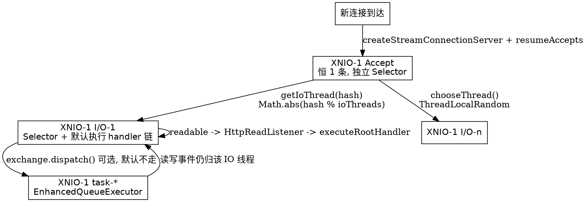

# XNIO

## Introduction

Undertow 的定位是**HTTP 语义库**，不是 NIO 框架。它自己只负责协议解析、handler 链、Servlet 容器；socket 的绑定、accept、读写就绪、连接生命周期、线程与线程池**全部外包给 XNIO**。`Undertow.start()` 里看不到 `ServerSocketChannel`、`Selector`、`SelectionKey`，只看到 `xnio.createWorker(...)` 与 `worker.createStreamConnectionServer(...)`（`undertow-core-2.4.4.Final/io/undertow/Undertow.java:125`、`:174`、`:196`）。

这决定了 Undertow 与同一梯队容器的根本差异：

- **Netty 版容器**（或 Vert.x、gRPC-Java）把 Netty 的 `EventLoop` 当运行时主干，业务代码直接和 `ChannelPipeline`/`ByteBuf` 打交道，网络层语义与业务语义耦合在 pipeline 上。
- **Tomcat NioEndpoint / Jetty** 各自实现一套 acceptor + selector + 线程池的装配，网络层是容器私有财产。
- **Undertow** 把网络层抽成一个可与业务分离的独立库（XNIO），扩展点是 `Conduit` 包装链而不是 pipeline；因此同一份 Undertow 可以跑在 `xnio-nio`（阻塞 selector）或 `xnio-aio`（`AioSocketChannel`）之上，只要换一个 provider。

理解 Undertow 的性能特征、线程风险与配置面，必须先理解 XNIO 的三件事：**worker/IO 线程模型**、**`OptionMap` 配置面**、**conduit 链**。本文全部以 Undertow 2.4.4.Final + XNIO 3.8.16.Final + jboss-threads 3.7.0.Final 源码为准，结论后标注 `相对 /tmp/src/tree/ 路径:行号`。

## What XNIO is

### The three core types

| 抽象 | 位置 | 作用 |
| :--- | :--- | :--- |
| `Xnio` | `xnio-api-3.8.16.Final/org/xnio/Xnio.java` | provider 门面，按 classloader 发现具体实现（`XNIO-NIO` / `XNIO-AIO`），负责 `createWorker`、`createXnioSsl` |
| `XnioWorker` | `org/xnio/XnioWorker.java` | 一个 IO 线程组 + 一个任务线程池 + 若干 `AcceptingChannel` 的容器，是「进程内网络运行时」的句柄 |
| `IoThread` / `XnioIoThread` | `org/xnio/IoThread.java`、`org/xnio/XnioIoThread.java` | 每条 IO 线程都是 `XnioExecutor`，`execute(Runnable)` 会投递到该线程自己的 selector 循环 |
| `StreamConnection` | `org/xnio/StreamConnection.java` | 一条双向字节流连接，暴露 `getSourceChannel()` / `getSinkChannel()` / `getIoThread()` |
| `Conduit` | `org/xnio/ConduitStreamSourceChannel.java` 等 | 流的**可插拔包装层**，`StreamSourceConduit` / `StreamSinkConduit` 两个方向各一条链 |
| `AcceptingChannel` | `org/xnio/AcceptingChannel.java` | 服务端监听句柄，`resumeAccepts()` 才开始收连接 |
| `Option` / `Options` / `OptionMap` | `org/xnio/Option.java`、`org/xnio/Options.java` | 类型安全的配置键 + 不可变配置包，取代散落的 setter |

Undertow 里 `Option` 体系直接可见：Builder 维护三份 `OptionMap`，`setServerOption` / `setSocketOption` / `setWorkerOption` 分别写入（`io/undertow/Undertow.java:560-573`）。

### Relation to JDK NIO

`xnio-nio` 就是 JDK NIO 的一层封装。`NioXnioWorker.createTcpConnectionServer()` 里是原汁原味的 JDK 调用（`xnio-nio-3.8.16.Final/org/xnio/nio/NioXnioWorker.java:169-198`）：

```java
final ServerSocketChannel channel = ServerSocketChannel.open();
if (optionMap.contains(Options.RECEIVE_BUFFER)) channel.socket().setReceiveBufferSize(optionMap.get(Options.RECEIVE_BUFFER, -1));
channel.socket().setReuseAddress(optionMap.get(Options.REUSE_ADDRESSES, true));
channel.configureBlocking(false);
if (optionMap.contains(Options.BACKLOG)) {
    channel.socket().bind(bindAddress, optionMap.get(Options.BACKLOG, 128));
} else {
    channel.socket().bind(bindAddress);
}
```

差别在**谁持有 selector、谁跑 read-loop**。XNIO 给每条 IO 线程配一个独占 `Selector`（`NioXnioWorker.java:96-107`），accept 用**另一条阻塞式 selector 线程**（`:109-115`）；JDK 层面 `SelectionKey` 的注册/注销、`selectedKeys` 的清理、`wakeup` 的合并都由 XNIO 的 `WorkerThread` 处理，Undertow 只看到 `channel.getIoThread().execute(...)` 与 conduit 的 `read()`/`write()` 返回 `0`。

⚠️ 一个值得注意的实现细节：v3.8 里**旧的 `NioTcpServer`（accept 过滤 / balancing 那套）路径是死代码**（`NioXnioWorker.java:182` 是 `if (false)`），实际走 `QueuedNioTcpServer2`（`:188`）。这个事实后面会推翻 Undertow 设置的两个默认 option。

## What Undertow delegates to XNIO

`Undertow.start()` 的完整骨架（`io/undertow/Undertow.java:119-256`）：

```java
xnio = Xnio.getInstance(Undertow.class.getClassLoader());
if (internalWorker) {
    worker = xnio.createWorker(OptionMap.builder()
            .set(Options.WORKER_IO_THREADS, ioThreads)
            ...
            .addAll(workerOptions)
            .getMap());
}
```

然后为每个 listener 造一个 open listener，并把它适配成 accept 监听器：

```java
ChannelListener<AcceptingChannel<StreamConnection>> acceptListener = ChannelListeners.openListenerAdapter(finalListener);
AcceptingChannel<? extends StreamConnection> server = worker.createStreamConnectionServer(new InetSocketAddress(Inet4Address.getByName(listener.host), listener.port), acceptListener, socketOptionsWithOverrides);
server.resumeAccepts();
```

（`Undertow.java:195-197`，AJP 分支 `:173-175` 同构。）HTTPS 则换成 XNIO SSL 门面 `UndertowXnioSsl.createSslConnectionServer(worker, ...)`（`:217-239`），TLS 握手由自家 `protocols/ssl/SslConduit` 完成——注意 **`UndertowXnioSsl` 是 Undertow 实现的 `XnioSsl` 子类，不是 xnio-nio 自带的**，这是 Undertow 唯一「反向扩展」XNIO 的地方。

连接建立之后，`HttpOpenListener.handleEvent(StreamConnection)` 才被回调（`io/undertow/server/protocol/http/HttpOpenListener.java:104`），此时连接已经绑定在某条 IO 线程上。

## Three-layer thread model

| 层 | 谁创建 | 线程名 | 数量 | 干什么 | 证据 |
| :--- | :--- | :--- | :--- | :--- | :--- |
| Accept | `NioXnioWorker` 构造器 | `XNIO-1 Accept` | **恒为 1**（额外一条 `WorkerThread`，索引 `threadCount`） | 只对 server channel 做 `accept()`，把新连接塞给 IO 线程 | `org/xnio/nio/NioXnioWorker.java:115`、`:132-139` |
| IO | `NioXnioWorker` 构造器 | `XNIO-1 I/O-n` | `ioThreads`（Undertow 默认 `max(cpus,2)`） | 每线程一个 `Selector`；读写事件循环 + **默认直接跑 handler 链** | `NioXnioWorker.java:90-108`、`io/undertow/server/protocol/http/HttpReadListener.java:263` |
| Worker 任务 | `XnioWorker` 构造器里的 task pool | 由 `WorkerThreadFactory` 命名 | `workerThreads`（Undertow 默认 `ioThreads*8`） | `exchange.dispatch()` 的续体、异步 servlet 的阻塞点 | `org/xnio/XnioWorker.java:141-158`、`io/undertow/server/Connectors.java:337` |

一个连接从 accept 到 handler 落地的线程归属：



IO 线程的选择器两条路径值得记住（`NioXnioWorker.java:145-159`）：

```java
protected WorkerThread chooseThread() {
    return getIoThread(ThreadLocalRandom.current().nextInt());
}

public WorkerThread getIoThread(final int hashCode) {
    ...
    return workerThreads[Math.abs(hashCode % length)];
}
```

**同一条连接终生绑定一条 IO 线程**，这是 conduit 链、buffer、`HttpServerConnection` 状态无需加锁的前提；反过来说，一条慢连接会独占它所在 IO 线程的时间片。

## Where the thread-count formula lives

关键结论：**`ioThreads` 与 `workerThreads` 的计算公式在 Undertow，不在 XNIO**。XNIO 的 `Builder` 只消费 option，本身没有「按 CPU 推线程数」的概念。

Undertow 侧（`io/undertow/Undertow.java:447-449`，`Builder` 私有构造）：

```java
ioThreads = Math.max(Runtime.getRuntime().availableProcessors(), 2);
workerThreads = ioThreads * 8;
```

XNIO 侧只是把数字搬进池子（`org/xnio/XnioWorker.java:1057-1062`）：

```java
setCoreWorkerPoolSize(optionMap.get(Options.WORKER_TASK_CORE_THREADS, coreWorkerPoolSize));
setMaxWorkerPoolSize(optionMap.get(Options.WORKER_TASK_MAX_THREADS, maxWorkerThreads));
...
if (optionMap.contains(Options.WORKER_IO_THREADS)) {
    setWorkerIoThreads(optionMap.get(Options.WORKER_IO_THREADS, 1));
```

（`coreWorkerPoolSize` / `maxWorkerPoolSize` 的裸默认是 **4 / 16**，见 `XnioWorker.java:1033-1034`。）

后果与副作用：

1. **8 核机器默认 8 条 IO 线程 + 64 条 worker 线程**；`ioThreads * 8` 是写死的倍率，`setIoThreads()` 不会联动改 `workerThreads`（两者是 Builder 上两个独立字段，`:540-548`），所以只调 IO 数会留下一个不匹配的任务池。
2. `Undertow` 把 `workerThreads` **同时**填给 core 和 max（`:129-130`），配合 `EnhancedQueueExecutor` 得到一个「固定 64 线程 + 无界队列」的池——`XnioWorker.Builder` 里 4/16 那套弹性语义在 Undertow 场景下不生效。
3. 线程数下限 `max(cpus, 2)`：单核机器仍有 2 条 IO 线程，保证 accept 后不会只有一条 selector 线程孤军。
4. 同一构造器还按 `maxMemory` 决定 buffer 尺寸（`< 64MB` 用 512B 非直接、`< 128MB` 用 1K、否则 `16K - 20`，`:450-465`），这个 `- 20` 是给协议头留位（注释引用 UNDERTOW-1209）。

## Three OptionMap and override rules

`Builder` 的三个 map（`Undertow.java:443-445`）作用域完全不同：

| map | 何时生效 | 典型键 | 消费者 |
| :--- | :--- | :--- | :--- |
| `workerOptions` | `xnio.createWorker()` | `Options.WORKER_*`、`Options.CONNECTION_*_WATER`、`TCP_NODELAY`、`CORK` | `XnioWorker` / `NioXnioWorker` |
| `socketOptions` | `createStreamConnectionServer()` | `BACKLOG`、`REUSE_ADDRESSES`、`READ_TIMEOUT`、`WRITE_TIMEOUT`、`BALANCING_*` | server channel 与每条 accepted 连接 |
| `serverOptions` | 造 open listener 时 | `UndertowOptions.NO_REQUEST_TIMEOUT`、`ENABLE_HTTP2`、`ENABLE_CONNECTOR_STATISTICS`、`MAX_HEADERS` | Undertow 自己的协议层 |

`start()` 写死的默认值（这就是「什么都不配时 Undertow 长什么样」）：

- worker 侧（`:127-132`）：`CONNECTION_HIGH_WATER = CONNECTION_LOW_WATER = 1000000`、`TCP_NODELAY`、`CORK`。两个水位写成同一个百万值，等价于**关闭 XNIO 的自动挂起 accept**（正常语义是高水位停 accept、低水位恢复）。
- socket 侧（`:137-143`）：`WORKER_IO_THREADS = worker.getIoThreadCount()`（把真实 IO 数回灌给 accept 端）、`BACKLOG = 1000`、`BALANCING_TOKENS = 1`、`BALANCING_CONNECTIONS = 2`、外加 `TCP_NODELAY`、`REUSE_ADDRESSES`。
- server 侧（`:148`）：`NO_REQUEST_TIMEOUT = 60 * 1000`。

**覆盖顺序是「硬编码 → addAll(用户的) → addAll(listener 的)」**，后者赢：

```java
.addAll(workerOptions)          // :133 用户覆盖硬编码
.addAll(this.socketOptions)     // :144
OptionMap.builder().addAll(socketOptions).addAll(listener.overrideSocketOptions)  // :162
```

所以 `setWorkerOption(Options.WORKER_IO_THREADS, n)` 能覆盖 `:126`，`setSocketOption(Options.BACKLOG, n)` 能覆盖 `:143`；而 `serverOptions` 与 `socketOptions` 彼此独立——把 `NO_REQUEST_TIMEOUT` 用 `setSocketOption` 塞进去是**静默无效**的（HTTP 层从 `serverOptions` 读，socket 层从 `socketOptions` 读）。

## EnhancedQueueExecutor and fallback path

task pool 的真身在 jboss-threads 的 `EnhancedQueueExecutor`（`org/xnio/XnioWorker.java:149-158`）：

```java
taskPool = new EnhancedQueueExecutorTaskPool(new EnhancedQueueExecutor.Builder()
    .setCorePoolSize(builder.getCoreWorkerPoolSize())
    .setMaximumPoolSize(builder.getMaxWorkerPoolSize())
    .setKeepAliveTime(builder.getWorkerKeepAlive(), TimeUnit.MILLISECONDS)
    .setThreadFactory(new WorkerThreadFactory(...))
    .setTerminationTask(terminationTask)
    .setRegisterMBean(true)
    .setMBeanName(workerName)
    .build()
);
```

`EnhancedQueueExecutor` 的价值是**每线程一个 handoff 槽 + 任务队列分片**，避免 `ThreadPoolExecutor` 在高频小任务上的全局队列锁竞争——这正好对上 XNIO「dispatch 续体是小任务」的用法。

两条退化 / 注入路径：

1. `EnhancedQueueExecutor.DISABLE_HINT` 为真时改用 `DefaultThreadPoolExecutor`，此时池大小取 `max(core, max)` 且 core = max，队列换成 `LinkedBlockingDeque`（`XnioWorker.java:139-147`）——MBean 注册与 handoff 优化一并消失。
2. `Builder.setExecutorService(external)` 时走 `ExternalTaskPool`，按 `EnhancedQueueExecutor` / `ThreadPoolExecutor` / 其他 `ExecutorService` 三档包装（`XnioWorker.java:129-138`）。

⚠️ 两个易错事实：

- **jboss-threads 3.7.0 里没有 `FixedSizeThreadPool`、也没有 `BoundedQueueThreadPoolFactory`**——那是 2.x 的旧类名，照旧文章引用会找不到类（`org/jboss/threads/` 目录下只有 `EnhancedQueueExecutor`、`EnhancedViewExecutor`、`ViewExecutor`、`ManagedThreadPoolExecutor` 等）。
- **Undertow 自身对 `org.jboss.threads` 的 import 为零**（`grep -rn "import org.jboss.threads" io/undertow/` 无命中）：Undertow 不直接建任何线程池，线程池是 XNIO 的内部实现细节。想换池，只能换 `XnioWorker`，不能配置 Undertow。

## Conduit chain as the extension point

XNIO 的每个 channel 持有一个可替换的 `Conduit`：读方向 `StreamSourceConduit`，写方向 `StreamSinkConduit`。`setConduit(new XxxConduit(old, ...))` 就是**把新环插到链头**，`read()/write()` 逐层透传。Undertow 几乎所有连接级横切关注点都是 conduit，而不是 handler：

| 关注点 | conduit 类 | 挂载位置 |
| :--- | :--- | :--- |
| TLS 握手与记录层 | `protocols/ssl/SslConduit` | `protocols/ssl/UndertowSslConnection.java` |
| 空闲超时（双向） | `conduits/IdleTimeoutConduit` | `HttpOpenListener.java:114-116`（source 与 sink 共用同一实例） |
| 读超时 | `conduits/ReadTimeoutStreamSourceConduit` | `HttpOpenListener.java:119`，读 `Options.READ_TIMEOUT`（`:111`） |
| 写超时 | `conduits/WriteTimeoutStreamSinkConduit` | `HttpOpenListener.java:123` |
| 连接器统计 | `conduits/BytesSentStreamSinkConduit` / `BytesReceivedStreamSourceConduit` | `HttpOpenListener.java:133-134`，受 `UndertowOptions.ENABLE_CONNECTOR_STATISTICS` 门控（`:95`） |
| 分块 / 定长帧 | `ChunkedStreamSinkConduit`、`ChunkedStreamSourceConduit`、`FixedLengthStreamSourceConduit` | `server/protocol/http/HttpTransferEncoding.java` |
| gzip / deflate | `GzipStreamSinkConduit`、`DeflatingStreamSinkConduit` | `server/handlers/encoding/GzipEncodingProvider.java`、`DeflateEncodingProvider.java` |
| 出站限速 | `RateLimitingStreamSinkConduit` | `server/handlers/ResponseRateLimitingHandler.java` |
| 响应缓冲重放 | `StoredResponseStreamSinkConduit` | `server/handlers/StoredResponseHandler.java` |
| 字节区间 | `RangeStreamSinkConduit` | `server/handlers/ByteRangeHandler.java` |

挂载时机值得注意：**超时与统计类 conduit 在连接建立时挂一次**（`HttpOpenListener.handleEvent`，`HttpOpenListener.java:109-135`），而**帧与编码类 conduit 每个请求重挂一次**（传输编码在 `HttpTransferEncoding`、编码在 `EncodingHandler` 里），因为 HTTP keep-alive 上每请求的 `Content-Length` / `Transfer-Encoding` 都可能变。这就是 conduit 链比 handler 链难 debug 的原因——链上环的生命周期不一致。

## Why requests run on the IO thread by default

`HttpReadListener` 解析完请求头后**不投递、不换线程**（`io/undertow/server/protocol/http/HttpReadListener.java:263`）：

```java
Connectors.executeRootHandler(HostHeaderHandler.WRAPPER.wrap(connection.getRootHandler()), httpServerExchange);
```

而 `executeRootHandler` 就是当前线程直接调用（`io/undertow/server/Connectors.java:319-323`）：

```java
public static void executeRootHandler(final HttpHandler handler, final HttpServerExchange exchange) {
    try {
        exchange.setInCall(true);
        handler.handleRequest(exchange);
```

配合 `HttpServerExchange.getIoThread()` 直接返回 `connection.getIoThread()`（`io/undertow/server/HttpServerExchange.java:1967-1968`）、`isInIoThread()` 就是 `getIoThread() == Thread.currentThread()`（`:809-810`），结论是：**默认路径下，业务 handler 与 selector 事件循环是同一条线程**。

为什么这样设计：一次请求省掉两次线程切换与一次队列入队（对短响应是小而高频的收益），而且连接状态、buffer、conduit 链都无锁。风险源同样明确：**handler 里一次 JDBC 阻塞、一次 `Thread.sleep`、一次同步 HTTP 调用，就把这条 IO 线程上所有其他连接一起冻住**；IO 线程只有 `max(cpus,2)` 条，所以 8 核机器上 8 个慢请求就能让整机吞吐塌方。这就是为什么 `ioThreads` 与 `workerThreads` 的比例（1:8）在压测里如此敏感。

逃生口是 `dispatch()`（`HttpServerExchange.java:870`、`:886`、`:902`、`:922`、`:927`），未传 `Executor` 时落到 worker 任务池（`:914`）：

```java
getConnection().getWorker().execute(runnable);
```

`Connectors.executeRootHandler` 收尾时统一兑现 dispatch 请求（`Connectors.java:325-345`）：`dispatchTask` 提交给 `exchange.getDispatchExecutor()`，为空则用 `exchange.getConnection().getWorker()`；池满抛 `RejectedExecutionException` 时直接回 **503**：

```java
executor.execute(dispatchTask);
} catch (RejectedExecutionException e) {
    UndertowLogger.REQUEST_LOGGER.debug("Failed to dispatch to worker", e);
    exchange.setStatusCode(StatusCodes.SERVICE_UNAVAILABLE);
```

注意 dispatch 之后**读写事件仍归原 IO 线程**，所以 worker 线程里对 `exchange` 做 IO 必须经 `ReadDispatchChannel` / `WriteDispatchChannel` 转接（`HttpServerExchange.java:1364` 构造了 `EmptyStreamSourceConduit(getIoThread())`），且事件续跑会回投 IO 线程（`HttpReadListener.java:350` `channel.getIoThread().execute(this)`）。dispatch 的语义与坑单独见 [HttpServerExchange](/docs/CS/Framework/Undertow/Exchange.md)。

## Injecting an external worker

`Builder.setWorker(XnioWorker)`（`Undertow.java:587`，javadoc 见 `:575-586`）配合构造器里的 `this.internalWorker = builder.worker == null`（`:106`）实现「共享 worker」语义：

- `internalWorker == false` 时 `start()` 跳过 `createWorker`（`:124`），多个 Undertow 实例共用同一批 IO / worker 线程——这是 XNIO 相比 Netty「一个 `EventLoopGroup` 一个 BossGroup」写法在**多监听器 / 多子应用**下的省线程手段。
- `stop()` 只在 `internalWorker && worker != null` 时关池（`:270-287`），并且尊重 `UndertowOptions.SHUTDOWN_TIMEOUT`：无超时 `awaitTermination()`，有超时则超时后 `shutdownNow()`。外部 worker 的生命周期明确由调用方持有。
- 失败路径同样受此保护：`start()` 抛异常时只在 `internalWorker` 时 `shutdownNow()`（`:251-253`）。
- 注入 worker 的代价：`workerOptions` 里的 `WORKER_IO_THREADS`、`WORKER_TASK_*` 全部失效（因为不建 worker），但 `socketOptions` 与 `serverOptions` 仍然生效——`ioThreads` / `workerThreads` 字段被忽略，`Undertow.java:138` 的 `WORKER_IO_THREADS` 会从**实际 worker** 反查（`worker.getIoThreadCount()`）。

另有一个同族的卸载点：`setSslEngineDelegatedTaskExecutor(Executor)`（`:592-595`，用于 `UndertowXnioSsl` 构造 `:219`、`:226-230`）。TLS 的 `runDelegatedTasks` 是 CPU 密集的，默认在 IO 线程跑；把它交给独立池是 HTTPS 场景下最直接的 IO 线程减负手段。

## Thread model comparison with Netty Jetty Tomcat

| 维度 | Undertow + XNIO | Netty | Jetty | Tomcat NIO |
| :--- | :--- | :--- | :--- | :--- |
| accept 线程 | `XNIO-1 Accept`，恒 1（`NioXnioWorker.java:115`） | Boss `EventLoop`（一组，仍属 event loop 线程） | `Accepter`（每 connector 一条） | `Acceptor` 一条线程 |
| IO/事件线程数来源 | Undertow 公式 `max(cpus,2)`（`Undertow.java:448`）→ `Options.WORKER_IO_THREADS` | 用户给 `EventLoopGroup` 线程数，默认 `2*cpus` | `SelectorManager` 默认 `max(cpus,2)` | `Poller` 默认 2 条，与 cpus 无关 |
| IO 线程与连接关系 | hash 取模绑定，一连接一 IO 线程（`NioXnioWorker.java:149-159`） | 同：一 Channel 一 EventLoop | 同 | 不同：连接由 Poller 轮询，处理可换线程 |
| 业务线程池 | `EnhancedQueueExecutor`，`ioThreads*8`（`Undertow.java:449`、`XnioWorker.java:149`） | 用户自建业务池，默认不用 | `QueuedThreadPool` | 默认 **不启用**：`SocketProcessor` 直接在 Poller 线程跑，除非 `executor` 配了线程池 |
| 默认 handler 执行线程 | **IO 线程**（`Connectors.java:319-322`） | user handler 在 EventLoop | 在 IO 线程，需要时 submit 到 QTP | 在 Poller 线程（`maxThreads` 只约束异步/长请求） |
| 换网络实现 | 换 XNIO provider（nio / aio） | 不可能（换传输要改代码） | 基本不可能 | 换 `protocol` 属性 |

跨库细节见 [Netty](/docs/CS/Framework/Netty/Netty.md)、[Jetty 线程模型](/docs/CS/Framework/Jetty/Threading.md)、[Tomcat 线程模型](/docs/CS/Framework/Tomcat/threads.md)。一句话总结：**四家都遵守「IO 线程绝不阻塞」，区别只在于谁负责把业务搬离 IO 线程**——Netty 靠约定与 pipeline 末端的 `EventExecutorGroup`，Jetty 靠 QTP，Tomcat 靠协议层 `executor`，Undertow 靠 `exchange.dispatch()` 且默认不搬。

## Pitfalls

1. **`workerThreads` 不是并发上限**。它是 dispatch 任务池的大小；不打 `dispatch()` 的请求根本不占它。压测时把 `setWorkerThreads(500)` 当成「支持 500 并发」是错的——吞吐真正受限于 `ioThreads` 数量与每条 IO 线程上的 handler 平均耗时。反过来，大量阻塞 handler 都用 `dispatch()` 逃生时，64 条 worker 会成新的瓶颈，且池满直接 503（`Connectors.java:340-343`）。
2. **`setIoThreads()` 不会联动 `workerThreads`**（两者独立字段，`Undertow.java:540-548`）。把 IO 从 8 调到 32 时，worker 仍是 64，比例从 1:8 变成 1:2。
3. **`BALANCING_TOKENS` / `BALANCING_CONNECTIONS` 是无效配置**。Undertow 在 `Undertow.java:141-142` 写了 `1` 与 `2`，但全库唯一读取者是 `xnio-nio-3.8.16.Final/org/xnio/NioTcpServer.java:134-135`：

   ```java
   tokens = optionMap.get(Options.BALANCING_TOKENS, -1);
   connections = optionMap.get(Options.BALANCING_CONNECTIONS, 16);
   ```

   而 `NioTcpServer` 在 v3.8 已不被构造——`NioXnioWorker.createTcpConnectionServer()` 的对应分支是 `if (false)`（`NioXnioWorker.java:182-187`），实际走 `QueuedNioTcpServer2`（`:188`），后者全文不引用这两个 option。所以「token 轮转 accept 过滤器」这套说法对 Undertow + XNIO 3.8 已不成立：连接分派只剩 `getIoThread(hash)` / `chooseThread()` 的随机与取模。
4. **`CONNECTION_HIGH_WATER = CONNECTION_LOW_WATER = 1000000` 等价于关闭过载保护**。想恢复「连接数高时停 accept」的行为，必须用 `setWorkerOption` 显式改这两个值；只调 `BACKLOG` 不管用。
5. **`OptionMap` 塞错桶是静默失败**（见前文覆盖规则）。`Options.READ_TIMEOUT` 要 `setSocketOption`，`UndertowOptions.MAX_HEADERS` 要 `setServerOption`——前者的证据是 `HttpOpenListener.java:111` 从 `channel.getOption(...)` 读，后者是 open listener 从 `serverOptions` 合成的 `undertowOptions` 读（`Undertow.java:179`）。
6. **keep-alive 长连接会长期占用 IO 线程的事件循环槽位**，一连接一 IO 线程的绑定不会因为空闲解除；空闲超时靠 `IdleTimeoutConduit`（`HttpOpenListener.java:114`）或 `NO_REQUEST_TIMEOUT`（`:148`）主动断，不要指望 IO 线程数会自动「回收」。
7. **共享 worker 时别用 `Undertow.stop()` 去关线程池**（关不掉，见 `:270`）；也不要指望外部 worker 能享受 `setWorkerOption`。

## Links

- [Undertow](/docs/CS/Framework/Undertow/Undertow.md)
- [Undertow handler 链](/docs/CS/Framework/Undertow/HandlerChain.md)
- [HttpServerExchange](/docs/CS/Framework/Undertow/Exchange.md)
- [Undertow HTTP 协议层](/docs/CS/Framework/Undertow/HttpProtocol.md)
- [Netty](/docs/CS/Framework/Netty/Netty.md)
- [Jetty 线程模型](/docs/CS/Framework/Jetty/Threading.md)

## References

- [XNIO 源码仓库](https://github.com/xnio/xnio)
- [Undertow 源码仓库](https://github.com/undertow-io/undertow)
- [java.nio.channels.Selector](https://docs.oracle.com/en/java/javase/17/docs/api/java.base/java/nio/channels/Selector.html)
