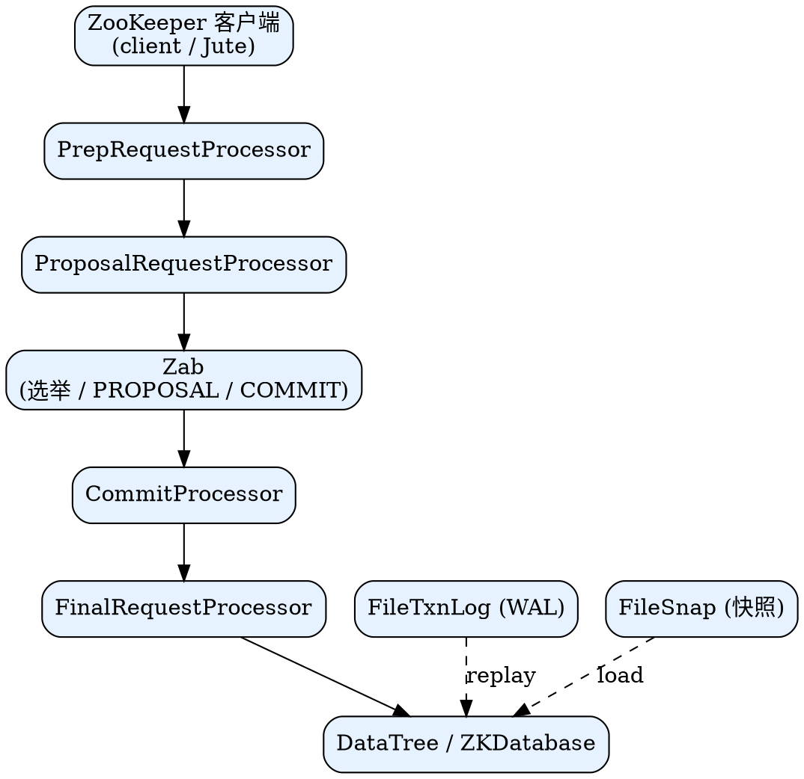

## Introduction

本目录是 ZooKeeper 的系统性笔记集合，按"对外 API → 服务端请求处理 → Zab 共识 → 存储/内存"的纵向分层组织。建议阅读路线：先读 [ZooKeeper](/docs/CS/Framework/ZooKeeper/ZooKeeper.md) 建立整体心智模型（数据模型、znode、watch、session、ACL），再按需下钻共识 [Zab](/docs/CS/Framework/ZooKeeper/Zab.md)、[请求处理器链](/docs/CS/Framework/ZooKeeper/pipeline.md) 与 [存储层](/docs/CS/Framework/ZooKeeper/storage.md)，最后看生产运维（[cluster](/docs/CS/Framework/ZooKeeper/cluster.md) / [monitoring](/docs/CS/Framework/ZooKeeper/monitoring.md) / [troubleshooting](/docs/CS/Framework/ZooKeeper/troubleshooting.md) / [security](/docs/CS/Framework/ZooKeeper/security.md)）与上层协调原语（[Recipes](/docs/CS/Framework/ZooKeeper/Recipes.md) / [Curator](/docs/CS/Framework/ZooKeeper/Curator.md)）。

> [!NOTE]
> 版本基线：当前主线 **3.9.6**（2026-09），维护线 3.9.x / 3.8.x；3.7 已于 2024-02 EOL；3.10.0 / 4.0.0 规划中。横向对比见 [etcd 横向对照](/docs/CS/Framework/etcd/compare.md)。

## Layered Architecture Diagram

实线为一次写请求的主链路：客户端 → 预处理 → 提案（经 Zab 广播）→ 提交 → 应用内存树；虚线为启动恢复时快照/日志回填内存。

## Layered Navigation

**总览与数据模型** —— 一切的起点。[ZooKeeper](/docs/CS/Framework/ZooKeeper/ZooKeeper.md) 讲清 znode 树、createNode、watch 一次性语义、session、ACL、Zab 总览、动态重配置，以及与 Chubby / etcd 的对照；[start](/docs/CS/Framework/ZooKeeper/start.md) 覆盖部署与启动；序列化线格式见 [Jute](/docs/CS/Framework/ZooKeeper/Jute.md)。

**共识与日志复制** —— [Zab](/docs/CS/Framework/ZooKeeper/Zab.md) 深入原子广播：Leader 选举（phase 0/1/2）、事务提案/提交、恢复与同步、quorum 数学，是理解"为何只有 Leader 能写"的钥匙。

**存储与内存** —— [storage](/docs/CS/Framework/ZooKeeper/storage.md) 拆解 FileTxnLog / FileSnap / FileTxnSnapLog 与 ZKDatabase / DataTree / DataNode，解释 zxid、快照触发（shouldSnapshot）与启动恢复（快照 + 日志 replay）。

**请求处理链** —— [pipeline](/docs/CS/Framework/ZooKeeper/pipeline.md) 梳理 Leader / Follower / Observer 各自的 RequestProcessor 链，澄清"读本地、写经 Leader"以及 `sync()` 如何实现线性读。

**客户端与协议** —— [client](/docs/CS/Framework/ZooKeeper/client.md) 覆盖连接串/chroot、会话生命周期、watch 一次性语义与持久化 watch、异常分类与重试策略、ACL 设置与最佳实践。

**协调原语** —— [Recipes](/docs/CS/Framework/ZooKeeper/Recipes.md) 记录锁 / 选主 / 屏障等分布式配方，[Curator](/docs/CS/Framework/ZooKeeper/Curator.md) 是 Netflix 出品的高层客户端（重试、缓存、配方实现），生产首选。

**安全** —— [security](/docs/CS/Framework/ZooKeeper/security.md) 梳理节点级 ACL（scheme:id:permission）、digest / ip / sasl / x509 / super 五种身份来源、SASL（Kerberos）、3.9 起补齐的 TLS 与 superDigest 应急。

**生产运维** —— [cluster](/docs/CS/Framework/ZooKeeper/cluster.md) 讲 ensemble 规模、quorum、Observer 跨 DC 只读扩展、动态重配置、滚动升级与备份；[monitoring](/docs/CS/Framework/ZooKeeper/monitoring.md) 列四字命令、mntr 指标、JMX、Prometheus 与告警；[troubleshooting](/docs/CS/Framework/ZooKeeper/troubleshooting.md) 是磁盘爆满、只读模式、leader 切换、watch 泄漏、会话过期的 on-call 速查。

**横向对照** —— 与 etcd / Nacos / Consul 的差异由 [etcd 横向对照](/docs/CS/Framework/etcd/compare.md) 枢纽统一承载（同层对比笔记经枢纽连接，不互相直链）。

## Links

- [Chubby](/docs/CS/Distributed/Chubby.md)
- [etcd 横向对照](/docs/CS/Framework/etcd/compare.md)
- [Nacos](/docs/CS/Framework/nacos/Nacos.md)
- [Consul](/docs/CS/Framework/consul/Consul.md)
- [Curator](/docs/CS/Framework/ZooKeeper/Curator.md)
- [Recipes](/docs/CS/Framework/ZooKeeper/Recipes.md)
- [BooKeeper](/docs/CS/Framework/BooKeeper/BooKeeper.md)

## References

1. [ZooKeeper: Wait-free coordination for Internet-scale systems](https://www.usenix.org/legacy/event/atc10/tech/full_papers/Hunt.pdf)
2. [Apache ZooKeeper Documentation](https://zookeeper.apache.org/doc/current/)
3. [ZooKeeper 3.9.0 Release Notes](https://zookeeper.apache.org/doc/r3.9.0/releaseNotes.html)
