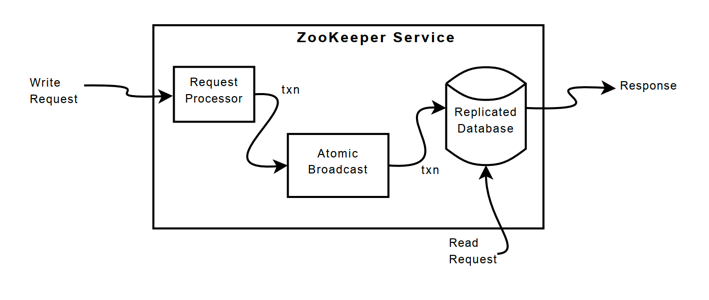
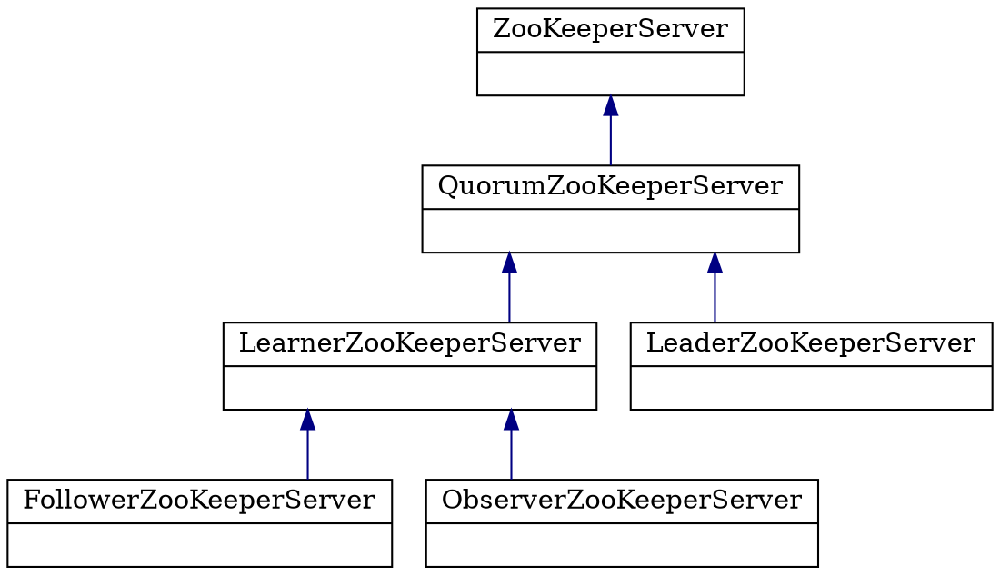
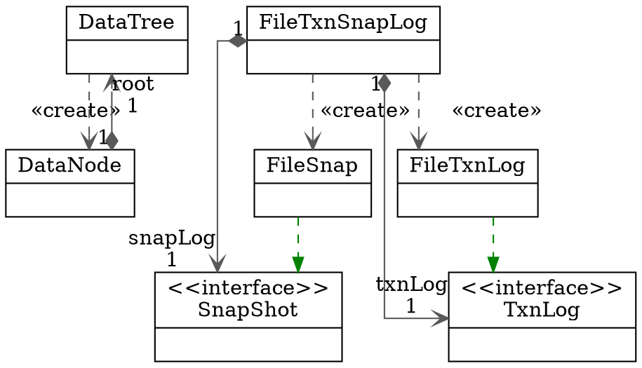

## Introduction

ZooKeeper is a centralized service for maintaining configuration information, naming, providing distributed synchronization, and providing group services.

All of these kinds of services are used in some form or another by distributed applications.
Each time they are implemented there is a lot of work that goes into fixing the bugs and race conditions that are inevitable.
Because of the difficulty of implementing these kinds of services, applications initially usually skimp on them, which make them brittle in the presence of change and difficult to manage.
Even when done correctly, different implementations of these services lead to management complexity when the applications are deployed.


ZooKeeper 是一个基于 Google Chubby 论文实现的一款解决分布式数据一致性问题的开源实现，方便了依赖 ZooKeeper 的应用实现 数据发布/订阅、负载均衡、服务注册与发现、分布式协调、事件通知、集群管理、Leader 选举、 分布式锁和队列 等功能

ZooKeeper aims at distilling the essence of these different services into a very simple interface to a centralized coordination service.
The service itself is distributed and highly reliable.
Consensus, group management, and presence protocols will be implemented by the service so that the applications do not need to implement them on their own.
Application specific uses of these will consist of a mixture of specific components of Zoo Keeper and application specific conventions.

**ZooKeeper provides a per client guarantee of FIFO execution of requests and linearizability for all requests that change the ZooKeeper state.**
To guarantee that update operations satisfy linearizability, Zookeeper implements a leader-based atomic broadcast protocol, called [Zab](/docs/CS/Framework/ZooKeeper/Zab.md).

In ZooKeeper, servers process read operations locally, and we do not use Zab to totally order them.

Caching data on the client side is an important technique to increase the performance of reads.
For example, it is useful for a process to cache the identifier of the current leader instead of probing ZooKeeper every time it needs to know the leader.
ZooKeeper uses a watch mechanism to enable clients to cache data without managing the client cache directly.
With this mechanism, a client can watch for an update to a given data object, and receive a notification upon an update.
Chubby manages the client cache directly.

ZooKeeper provides to its clients the abstraction of a set of data nodes (znodes), organized according to a hierarchical name space.

ZooKeeper also has the following two liveness and durability guarantees: if a majority of ZooKeeper servers are active and communicating the service will be available;
and if the ZooKeeper service responds successfully to a change request, that change persists across any number of failures as long as a quorum of servers is eventually able to recover.

> [!TIP]
>
> [Build and run Zookeeper](/docs/CS/Framework/ZooKeeper/start.md)

### Consistency Guarantees
ZooKeeper is a high performance, scalable service. Both reads and write operations are designed to be fast, though reads are faster than writes. The reason for this is that in the case of reads, ZooKeeper can serve older data, which in turn is due to ZooKeeper's consistency guarantees:

Sequential Consistency
Updates from a client will be applied in the order that they were sent.

Atomicity
Updates either succeed or fail -- there are no partial results.

Single System Image
A client will see the same view of the service regardless of the server that it connects to.

Reliability
Once an update has been applied, it will persist from that time forward until a client overwrites the update. This guarantee has two corollaries:

If a client gets a successful return code, the update will have been applied. On some failures (communication errors, timeouts, etc) the client will not know if the update has applied or not. We take steps to minimize the failures, but the guarantee is only present with successful return codes. (This is called the monotonicity condition in Paxos.)

Any updates that are seen by the client, through a read request or successful update, will never be rolled back when recovering from server failures.

Timeliness
The clients view of the system is guaranteed to be up-to-date within a certain time bound (on the order of tens of seconds). Either system changes will be seen by a client within this bound, or the client will detect a service outage.


## Architecture


Server端主要组件有

1. ZookeeperServerMain：这个类是ZK单机启动的启动入口，QuorumPeerMain是集群ZK的启动入口，等以后分析到集群的时候再来讲解当然，启动入口使用QuorumPeerMain也是可以的，只要把入参形式传成单机的即可而对于其作用也很简单，启动ZK的各类Thread处理线程以及生成ZK的文件日志；
2. ZookeeperServer：单机的实例类型，这个类的对象实例就是ZK的server实例如果是集群模式实例类型将会是其实现子类，包括Leade、Follower和Observer这些角色，都是其实现子类；如果把ZK服务比喻成人，那么这个类的实例就是具体的某个人，其重要的组件便是人的一些重要的器官，互相协调完成某种动作和功能；
3. RequestProcessor：看名字便可以得知，这个组件的作用便是用来处理Request请求的在ZK实例中，会有多个RequestProcessor实例链，每个实例都会对Request对象进行某种操作；
4. FileTxnSnapLog：用来管理TxnLog和SnapShot对象和其对应的File对象，TxnLog实现类的作用便是提供操作Txn日志文件的api方法，SnapShot实现类的作用便是保存、序列化和反序列化快照的功能；
5. ZKMBeanInfo：ZK的主要类信息接口，用来方便对接JMX代理服务，进而实现对JVM中的这些类进行监控，主要用于监控管理；
6. SessionTracker：ZK服务端用来追踪session的组件，单机和集群leader使用的是同一个，而Follower使用的是简单的Shell来跟踪转发给leader的；
7. Record：在ZK中是信息承载的角色，诸如各种的Request、Response和DataNode这些都是属于该接口的实现类，这个接口提供了序列化和反序列化接口标准；
8. ZKDatabase：维护内存中ZK关于session、datatree和提交日志的内存数据库，在从硬盘上读取日志和快照时将会被创建这个组件主要由DataTree、DataNode、WatchManager和Watcher等几个部分组成，这几个部分主要负责存储记录ZK的节点数据以及节点数据的监听功能，而Watcher接口则是Server端和Client端共用的监听接口；
9. NIO的ServerCnxn等：这次只分析通过NIO进行连接的ZK服务端，Netty的暂不分析ServerCnxn是Client端连接到Server端的实际实例类型，而其对象将是从ServerCnxnFactory工厂对象中产生的


## Data Model

ZooKeeper has a hierarchal name space, much like a distributed file system.
The only difference is that each node in the namespace can have data associated with it as well as children.
It is like having a file system that allows a file to also be a directory.
Paths to nodes are always expressed as canonical, absolute, slash-separated paths; there are no relative reference.

<div style="text-align: center;">


</div>

<p style="text-align: center;">
Fig.1. ZooKeeper's Hierarchical Namespace.
</p>


Zookeeper的这种层次模型称作DataTree DataTree的每个节点叫作ZNode

```java

public class ZKDatabase {

    private static final Logger LOG = LoggerFactory.getLogger(ZKDatabase.class);

    /**
     * make sure on a clear you take care of
     * all these members.
     */
    protected DataTree dataTree;
    protected ConcurrentHashMap<Long, Integer> sessionsWithTimeouts;
    protected FileTxnSnapLog snapLog;
    protected long minCommittedLog, maxCommittedLog;
}
```


```java
public class DataTree {
    /**
     * This map provides a fast lookup to the data nodes. The tree is the
     * source of truth and is where all the locking occurs
     */
    private final NodeHashMap nodes;

    private IWatchManager dataWatches;

    private IWatchManager childWatches;
}


public class NodeHashMapImpl implements NodeHashMap {

    private final ConcurrentHashMap<String, DataNode> nodes;
    private final boolean digestEnabled;
    private final DigestCalculator digestCalculator;

    private final AdHash hash;
}
```

### ZNodes

Unlike files in file systems, znodes are not designed for general data storage.
Instead, znodes map to abstractions of the client application, typically corresponding to meta-data used for coordination purposes.

Although znodes have not been designed for general data storage, ZooKeeper does allow clients to store some information that can be used for meta-data or configuration in a distributed computation.
For example, in a leader-based application, it is useful for an application server that is just starting to learn which other server is currently the leader.
To accomplish this goal, we can have the current leader write this information in a known location in the znode space.

Znodes also have associated meta-data with time stamps and version counters, which allow clients to track changes to znodes and execute conditional updates based on the version of the znode.

Unlike standard file systems, each node in a ZooKeeper namespace can have data associated with it as well as children.
It is like having a file-system that allows a file to also be a directory.
(ZooKeeper was designed to store coordination data: status information, configuration, location information, etc., so the data stored at each node is usually small, in the byte to kilobyte range.)
We use the term znode to make it clear that we are talking about ZooKeeper data nodes.

Znodes maintain a stat structure that includes version numbers for data changes, ACL changes, and timestamps, to allow cache validations and coordinated updates.
Each time a znode's data changes, the version number increases.
For instance, whenever a client retrieves data it also receives the version of the data.

The data stored at each znode in a namespace is read and written atomically. Reads get all the data bytes associated with a znode and a write replaces all the data.
Each node has an Access Control List (ACL) that restricts who can do what.

Ephemeral Nodes


ZooKeeper also has the notion of ephemeral nodes. These znodes exists as long as the session that created the znode is active. When the session ends the znode is deleted.

Container node

TTL time to live


Node中维护了一个数据结构，用于记录ZNode中数据更改的**版本号**以及**ACL**（Access Control List）的变更

有了这些数据的**版本号**以及其更新的**Timestamp**，Zookeeper就可以验证客户端请求的缓存是否合法，并协调更新。

而且，当Zookeeper的客户端执行**更新**或者删除操作时，都必须要带上要修改的对应数据的版本号。如果Zookeeper检测到对应的版本号不存在，则不会执行这次更新。如果合法，在ZNode中数据更新之后，其对应的版本号也会**一起更新**。

> 这套版本号的逻辑，其实很多框架都在用，例如RocketMQ中，Broker向NameServer注册的时候，也会带上这样一个版本号，叫`DateVersion`。


ZooKeeper 的每个 ZNode 上都会存储数据，对应于每个 ZNode，ZooKeeper 都会为其维护一个叫做 Stat 的数据结构，Stat 中记录了这个 ZNode 的三个数据版本，分别是 version（当前 ZNode 数据内容的版本），cversion（当前 ZNode 子节点的版本）和 aversion（当前 ZNode 的 ACL 变更版本）。这里的版本起到了控制 ZooKeeper 操作原子性的作用

如果想要让写入数据的操作支持 CAS，则可以借助 Versionable#withVersion 方法，在 setData() 的同时指定当前数据的 verison。如果写入成功，则说明在当前数据写入的过程中，没有其他用户对该 ZNode 节点的内容进行过修改；否则，会抛出一个 KeeperException.BadVersionException，以此可以判断本次 CAS 写入是失败的。而这样做的好处就是，可以避免 “并发局部更新 ZNode 节点内容” 时，发生相互覆盖的问题


### Ephemeral Nodes
临时节点有个特性，就是如果注册这个节点的机器失去连接(通常是宕机)，那么这个节点会被zookeeper删除。选主过程就是利用这个特性，在服务器启动的时候，去zookeeper特定的一个目录下注册一个临时节点(这个节点作为master，谁注册了这个节点谁就是master)，注册的时候，如果发现该节点已经存在，则说明已经有别的服务器注册了(也就是有别的服务器已经抢主成功)，那么当前服务器只能放弃抢主，作为从机存在。同时，抢主失败的当前服务器需要订阅该临时节点的删除事件，以便该节点删除时(也就是注册该节点的服务器宕机了或者网络断了之类的)进行再次抢主操作。选主的过程，其实就是简单的争抢在Zookeeper注册临时节点的操作，谁注册了约定的临时节点，谁就是master。所有服务器同时会在servers节点下注册一个临时节点（保存自己的基本信息），以便于应用程序读取当前可用的服务器列表
curator的LeaderSelector


如果当前是**临时顺序节点**，那么`ephemeralOwner`则存储了创建该节点的Owner的SessionID，有了SessionID，自然就能和对应的客户端匹配上，当Session失效之后，才能将该客户端创建的所有临时节点**全部删除**。

### Watches

Clients can set watches on znodes.
Changes to that znode trigger the watch and then clear the watch. 
When a watch triggers, ZooKeeper sends the client a notification.

> **New in 3.6.0:** Clients can also set permanent, recursive watches on a znode that are not removed when triggered and that trigger for changes on the registered znode as well as any children znodes recursively.

ZooKeeper also has the notion of ephemeral nodes.
These znodes exists as long as the session that created the znode is active.
When the session ends the znode is deleted. Because of this behavior ephemeral znodes are not allowed to have children.


最核心或者说关键的代码就是创建一个列表来存放观察者
而在 ZooKeeper 中则是在客户端和服务器端分别实现两个存放观察者列表，即：ZKWatchManager 和 WatchManager


在DataTree中有两个IWatchManager类型的对象，一个是dataWatches，一个是childWatches， 其中:

- dataWatches是保存节点层面的watcher对象，
- childWatches是保存子节点层面的watcher对象

使用这两个监听器可以分别为节点路径添加监听器在合适的场景下来触发监听，当然也可以移除已添加路径的监听器

```java
public class DataTree {

    private IWatchManager dataWatches;

    private IWatchManager childWatches;
    
    DataTree(DigestCalculator digestCalculator) {
        // ...
        try {
            dataWatches = WatchManagerFactory.createWatchManager();
            childWatches = WatchManagerFactory.createWatchManager();
        } catch (Exception e) {
            LOG.error("Unexpected exception when creating WatchManager, exiting abnormally", e);
        }
    }
}
```


在DataTree类型的构造器中初始化监听管理器对象是通过WatchManagerFactory工厂类型提供的工厂方法创建的

```java
public static IWatchManager createWatchManager() throws IOException {
    String watchManagerName = System.getProperty(ZOOKEEPER_WATCH_MANAGER_NAME);
    if (watchManagerName == null) {
        watchManagerName = WatchManager.class.getName();
    }
    try {
        IWatchManager watchManager = (IWatchManager) Class.forName(watchManagerName).getConstructor().newInstance();
        LOG.info("Using {} as watch manager", watchManagerName);
        return watchManager;
    } catch (Exception e) {
        IOException ioe = new IOException("Couldn't instantiate " + watchManagerName, e);
        throw ioe;
    }
}
```

**WatchManager类型** 主要实现了IWatchManager接口针对监听管理器做具体的实现

WatchManager重写了IWatchManager接口针对监听管理的通用方法比如添加监听器，移除监听器，触发监听器等等

其中添加和移除监听器操作分别会将监听器在watchTable，watch2Paths，watcherModeManager 对象中放入或者移除，而触发监听器方法则会执行通知操作

```java
public class WatchManager implements IWatchManager {

    private final Map<String, Set<Watcher>> watchTable = new HashMap<>();

    private final Map<Watcher, Map<String, WatchStats>> watch2Paths = new HashMap<>();

    private int recursiveWatchQty = 0;
}
```
#### EventType

EventType是一个枚举类型用来列举Zookeeper可能发生的事件， 可以看到监听事件的触发主要发生在节点状态的变更与节点数据的变更时触发

```java
@InterfaceAudience.Public
enum EventType {
    None(-1),
    NodeCreated(1),
    NodeDeleted(2),
    NodeDataChanged(3),
    NodeChildrenChanged(4),
    DataWatchRemoved(5),
    ChildWatchRemoved(6),
    PersistentWatchRemoved (7);

    private final int intValue;     // Integer representation of value
    // for sending over wire
}
```


在创建一个zookeeper客户端对象实例时，我们通过new Watcher()向构造方法中传入一个默认的Watcher，这个Watcher将作为整个zookeeper会话期间默认Watcher，会一直被保存在客户端ZKWatchManager的defaultWatcher中
```Java
public class WatcherDemo implements Watcher {
    static ZooKeeper zooKeeper;

    static {
        try {
            zooKeeper = new ZooKeeper("192.168.3.39:2181", 4000, new WatcherDemo());
        } catch (IOException e) {
            e.printStackTrace();
        }
    }

    @Override
    public void process(WatchedEvent event) {
        System.out.println("eventType:" + event.getType());
        if (event.getType() == Event.EventType.NodeDataChanged) {
            try {
                zooKeeper.exists(event.getPath(), true);
            } catch (KeeperException e) {
                e.printStackTrace();
            } catch (InterruptedException e) {
                e.printStackTrace();
            }
        }
    }

    public static void main(String[] args) throws IOException, KeeperException, InterruptedException {
        String path = "/watcher";
        if (zooKeeper.exists(path, false) == null) {
            zooKeeper.create("/watcher", "0".getBytes(), ZooDefs.Ids.OPEN_ACL_UNSAFE, CreateMode.PERSISTENT);
        }
        Thread.sleep(1000);
        System.out.println("————");
        //true表示使用zookeeper实例中配置的watcher
        Stat stat = zooKeeper.exists(path, true);
        System.in.read();
    }
}
```
在创建一个zookeeper客户端对象实例时，我们通过new Watcher()向构造方法中传入一个默认的Watcher，这个Watcher将作为整个zookeeper会话期间默认Watcher，会一直被保存在客户端ZKWatchManager的defaultWatcher中


```java
public ZooKeeper(
        String connectString,
        int sessionTimeout,
        Watcher watcher,
        long sessionId,
        byte[] sessionPasswd,
        boolean canBeReadOnly,
        HostProvider hostProvider,
        ZKClientConfig clientConfig) throws IOException {
  LOG.info(
          "Initiating client connection, connectString={} "
                  + "sessionTimeout={} watcher={} sessionId=0x{} sessionPasswd={}",
          connectString,
          sessionTimeout,
          watcher,
          Long.toHexString(sessionId),
          (sessionPasswd == null ? "<null>" : "<hidden>"));

  this.clientConfig = clientConfig != null ? clientConfig : new ZKClientConfig();
  ConnectStringParser connectStringParser = new ConnectStringParser(connectString);
  this.hostProvider = hostProvider;

  cnxn = new ClientCnxn(
          connectStringParser.getChrootPath(),
          hostProvider,
          sessionTimeout,
          this.clientConfig,
          watcher,
          getClientCnxnSocket(),
          sessionId,
          sessionPasswd,
          canBeReadOnly);
  cnxn.seenRwServerBefore = true; // since user has provided sessionId
  cnxn.start();
}
```


ClientCnxn是zookeeper客户端和zookeeper服务器端进行通信和事件通知处理的主要类，它内部包含：
1. SendThread：负责客户端和服务器端的数据通信，也包括事件信息的传输。
2. EventThread：主要在客户端回调注册的Watcher进行通知处理。


```java
public ClientCnxn(
    String chrootPath,
    HostProvider hostProvider,
    int sessionTimeout,
    ZKClientConfig clientConfig,
    Watcher defaultWatcher,
    ClientCnxnSocket clientCnxnSocket,
    long sessionId,
    byte[] sessionPasswd,
    boolean canBeReadOnly
) throws IOException {
    this.chrootPath = chrootPath;
    this.hostProvider = hostProvider;
    this.sessionTimeout = sessionTimeout;
    this.clientConfig = clientConfig;
    this.sessionId = sessionId;
    this.sessionPasswd = sessionPasswd;
    this.readOnly = canBeReadOnly;

    this.watchManager = new ZKWatchManager(
        clientConfig.getBoolean(ZKClientConfig.DISABLE_AUTO_WATCH_RESET),
        defaultWatcher);

    this.connectTimeout = sessionTimeout / hostProvider.size();
    this.readTimeout = sessionTimeout * 2 / 3;

    this.sendThread = new SendThread(clientCnxnSocket);
    this.eventThread = new EventThread();
    initRequestTimeout();
}

```


#### triggerWatch

通知所有订阅者

```java
@Override
public WatcherOrBitSet triggerWatch(String path, EventType type, long zxid, List<ACL> acl, WatcherOrBitSet supress) {
    WatchedEvent e = new WatchedEvent(type, KeeperState.SyncConnected, path, zxid);
    Set<Watcher> watchers = new HashSet<>();
    synchronized (this) {
        PathParentIterator pathParentIterator = getPathParentIterator(path);
        for (String localPath : pathParentIterator.asIterable()) {
            Set<Watcher> thisWatchers = watchTable.get(localPath);
            if (thisWatchers == null || thisWatchers.isEmpty()) {
                continue;
            }
            Iterator<Watcher> iterator = thisWatchers.iterator();
            while (iterator.hasNext()) {
                Watcher watcher = iterator.next();
                Map<String, WatchStats> paths = watch2Paths.getOrDefault(watcher, Collections.emptyMap());
                WatchStats stats = paths.get(localPath);
                if (stats == null) {
                    LOG.warn("inconsistent watch table for watcher {}, {} not in path list", watcher, localPath);
                    continue;
                }
                if (!pathParentIterator.atParentPath()) {
                    watchers.add(watcher);
                    WatchStats newStats = stats.removeMode(WatcherMode.STANDARD);
                    if (newStats == WatchStats.NONE) {
                        iterator.remove();
                        paths.remove(localPath);
                    } else if (newStats != stats) {
                        paths.put(localPath, newStats);
                    }
                } else if (stats.hasMode(WatcherMode.PERSISTENT_RECURSIVE)) {
                    watchers.add(watcher);
                }
            }
            if (thisWatchers.isEmpty()) {
                watchTable.remove(localPath);
            }
        }
    }
    if (watchers.isEmpty()) {
        if (LOG.isTraceEnabled()) {
            ZooTrace.logTraceMessage(LOG, ZooTrace.EVENT_DELIVERY_TRACE_MASK, "No watchers for " + path);
        }
        return null;
    }

    for (Watcher w : watchers) {
        if (supress != null && supress.contains(w)) {
            continue;
        }
        if (w instanceof ServerWatcher) {
            ((ServerWatcher) w).process(e, acl);
        } else {
            w.process(e);
        }
    }

    switch (type) {
        case NodeCreated:
            ServerMetrics.getMetrics().NODE_CREATED_WATCHER.add(watchers.size());
            break;

        case NodeDeleted:
            ServerMetrics.getMetrics().NODE_DELETED_WATCHER.add(watchers.size());
            break;

        case NodeDataChanged:
            ServerMetrics.getMetrics().NODE_CHANGED_WATCHER.add(watchers.size());
            break;

        case NodeChildrenChanged:
            ServerMetrics.getMetrics().NODE_CHILDREN_WATCHER.add(watchers.size());
            break;
        default:
            // Other types not logged.
            break;
    }

    return new WatcherOrBitSet(watchers);
}
```

```java
class ZKWatchManager implements ClientWatchManager {

    private final Map<String, Set<Watcher>> dataWatches = new HashMap<>();
    private final Map<String, Set<Watcher>> existWatches = new HashMap<>();
    private final Map<String, Set<Watcher>> childWatches = new HashMap<>();
    private final Map<String, Set<Watcher>> persistentWatches = new HashMap<>();
    private final Map<String, Set<Watcher>> persistentRecursiveWatches = new HashMap<>();
    private final boolean disableAutoWatchReset;

    private volatile Watcher defaultWatcher;

    ZKWatchManager(boolean disableAutoWatchReset, Watcher defaultWatcher) {
        this.disableAutoWatchReset = disableAutoWatchReset;
        this.defaultWatcher = defaultWatcher;
    }
}
```
### session

Session 指客户端会话。在 ZooKeeper 中，一个客户端会话是指 客户端和服务器之间的一个 TCP 长连接。
客户端启动的时候，会与服务端建立一个 TCP 连接，客户端会话的生命周期，则是从第一次连接建立开始算起。通过这个连接，客户端能够通过心跳检测与服务器保持有效的会话，并向 ZooKeeper 服务器发送请求并接收响应，以及接收来自服务端的 Watch 事件通知

Session 的 sessionTimeout 参数，用来控制一个客户端会话的超时时间。
当服务器压力太大 或者是网络故障等各种原因导致客户端连接断开时，Client 会自动从 ZooKeeper 地址列表中逐一尝试重连（重试策略可使用 Curator 来实现）。只要在 sessionTimeout 规定的时间内能够重新连接上集群中任意一台服务器，那么之前创建的会话仍然有效。如果，在 sessionTimeout 时间外重连了，就会因为 Session 已经被清除了，而被告知 SESSION_EXPIRED，此时需要程序去恢复临时数据；还有一种 Session 重建后的在新节点上的数据，被之前节点上因网络延迟晚来的写请求所覆盖的情况，在 ZOOKEEPER-417 中被提出，并在该 JIRA 中新加入的 SessionMovedException，使得 用同一个 sessionld/sessionPasswd 重建 Session 的客户端能感知到，但是这个问题到 ZOOKEEPER-2219 仍然没有得到很好的解决


processConnectRequest调用了reopenSession

```java
public class ZooKeeperServer implements SessionExpirer, ServerStats.Provider {
    public void reopenSession(ServerCnxn cnxn, long sessionId, byte[] passwd, int sessionTimeout) throws IOException {
        if (checkPasswd(sessionId, passwd)) {
            revalidateSession(cnxn, sessionId, sessionTimeout);
        } else {
            finishSessionInit(cnxn, false);
        }
    }
}
```

```java
protected void revalidateSession(ServerCnxn cnxn, long sessionId, int sessionTimeout) throws IOException {
  boolean rc = sessionTracker.touchSession(sessionId, sessionTimeout);
  finishSessionInit(cnxn, rc);
}
```
SessionTrackerImpl
```java
public class SessionTrackerImpl extends ZooKeeperCriticalThread implements SessionTracker {

    protected final ConcurrentHashMap<Long, SessionImpl> sessionsById = new ConcurrentHashMap<>();

    private final ExpiryQueue<SessionImpl> sessionExpiryQueue;

    protected final ConcurrentMap<Long, Integer> sessionsWithTimeout;
    private final AtomicLong nextSessionId = new AtomicLong();
}
```


```java
public class SessionTrackerImpl extends ZooKeeperCriticalThread implements SessionTracker {
    public synchronized boolean touchSession(long sessionId, int timeout) {
        SessionImpl s = sessionsById.get(sessionId);

        if (s == null) {
            logTraceTouchInvalidSession(sessionId, timeout);
            return false;
        }

        if (s.isClosing()) {
            logTraceTouchClosingSession(sessionId, timeout);
            return false;
        }

        updateSessionExpiry(s, timeout);
        return true;
    }
}
```


### ZooKeeper guarantees

ZooKeeper has two basic ordering guarantees:

- **Linearizable writes:** all requests that update the state of ZooKeeper are serializable and respect precedence;
- **FIFO client order:** all requests from a given client are executed in the order that they were sent by the client.

ecause only update requests are Alinearizable, ZooKeeper processes read requests locally at each replica.
This allows the service to scale linearly as servers are added to the system.

ZooKeeper is very fast and very simple. Since its goal, though, is to be a basis for the construction of more complicated services, such as synchronization, it provides a set of guarantees. These are:

* Sequential Consistency - Updates from a client will be applied in the order that they were sent.
* Atomicity - Updates either succeed or fail. No partial results.
* Single System Image - A client will see the same view of the service regardless of the server that it connects to. i.e., a client will never see an older view of the system even if the client fails over to a different server with the same session.
* Reliability - Once an update has been applied, it will persist from that time forward until a client overwrites the update.
* Timeliness - The clients view of the system is guaranteed to be up-to-date within a certain time bound.


### Guarantees

ZooKeeper is very fast and very simple. Since its goal, though, is to be a basis for the construction of more complicated services, such as synchronization, it provides a set of guarantees. These are:

- Sequential Consistency - Updates from a client will be applied in the order that they were sent.
- Atomicity - Updates either succeed or fail. No partial results.
- Single System Image - A client will see the same view of the service regardless of the server that it connects to. i.e., a client will never see an older view of the system even if the client fails over to a different server with the same session.
- Reliability - Once an update has been applied, it will persist from that time forward until a client overwrites the update.
- Timeliness - The clients view of the system is guaranteed to be up-to-date within a certain time bound.

**The consistency guarantees of ZooKeeper lie between sequential consistency and linearizability.
Write operations in ZooKeeper are linearizable.**
In other words, each write will appear to take effect atomically at some point between when the client issues the request and receives the corresponding response.
Read operations in ZooKeeper are not linearizable since they can return potentially stale data.
This is because a read in ZooKeeper is not a quorum operation and a server will respond immediately to a client that is performing a read.
ZooKeeper does this because it prioritizes performance over consistency for the read use case.

### Simple API

One of the design goals of ZooKeeper is providing a very simple programming interface.
As a result, it supports only these operations:

- *create* : creates a node at a location in the tree
- *delete* : deletes a node
- *exists* : tests if a node exists at a location
- *get data* : reads the data from a node
- *set data* : writes data to a node
- *get children* : retrieves a list of children of a node
- *sync* : waits for data to be propagated


### ACL

ACL（Access Control List）用于控制ZNode的相关权限，其权限控制和Linux中的类似。Linux中权限**种类**分为了三种，分别是**读**、**写**、**执行**，分别对应的字母是r、w、x。其权限粒度也分为三种，分别是**拥有者权限**、**群组权限**、**其他组权限**

粒度是对权限所作用的对象的分类，把上面三种粒度换个说法描述就是**对用户（Owner）、用户所属的组（Group)、其他组（Other）**的权限划分，这应该算是一种权限控制的标准了，典型的三段式。

Zookeeper中虽然也是三段式，但是两者对粒度的划分存在区别。Zookeeper中的三段式为**Scheme、ID、Permissions**，含义分别为权限机制、允许访问的用户和具体的权限。

## Implementation



session

## Atomic Broadcast

At the heart of ZooKeeper is an atomic messaging system that keeps all of the servers in sync.

**All requests that update ZooKeeper state are forwarded to the leader.**
The leader executes the request and broadcasts the change to the ZooKeeper state through [Zab](/docs/CS/Framework/ZooKeeper/Zab.md), an atomic broadcast protocol.
The server that receives the client request responds to the client when it delivers the corresponding state change.
Zab uses by default simple majority quorums to decide on a proposal, so Zab and thus ZooKeeper can only work if a majority of servers are correct (i.e., with $2f + 1$ server we can tolerate $f$ failures).

Read requests are handled locally at each server.
Each read request is processed and tagged with a zxid that corresponds to the last transaction seen by the server.
This zxid defines the partial order of the read requests with respect to the write requests.
By processing reads locally, we obtain excellent read performance because it is just an in-memory operation on the local server, and there is no disk activity or agreement protocol to run.
This design choice is key to achieving our goal of excellent performance with read-dominant workloads.

One drawback of using fast reads is not guaranteeing precedence order for read operations.
That is, a read operation may return a stale value, even though a more recent update to the same znode has been committed.
Not all of our applications require precedence order, but for applications that do require it, we have implemented sync.
This primitive executes asynchronously and is ordered by the leader after all pending writes to its local replica.
To guarantee that a given read operation returns the latest updated value, a client calls sync followed by the read operation.

The FIFO order guarantee of client operations together with the global guarantee of sync enables the result of the read operation to reflect any changes that happened before the sync was issued.
In our implementation, we do not need to atomically broadcast sync as we use a leader-based algorithm, and we simply place the sync operation at the end of the queue of requests between the leader and the server executing the call to sync.
In order for this to work, the follower must be sure that the leader is still the leader.
If there are pending transactions that commit, then the server does not suspect the leader.
If the pending queue is empty, the leader needs to issue a null transaction to commit and orders the sync after that transaction.
This has the nice property that when the leader is under load, no extra broadcast traffic is generated.
In our implementation, timeouts are set such that leaders realize they are not leaders before followers abandon them, so we do not issue the null transaction.

ZooKeeper servers process requests from clients in FIFO order.
Responses include the zxid that the response is relative to.
Even heartbeat messages during intervals of no activity include the last zxid seen by the server that the client is connected to.
If the client connects to a new server, that new server ensures that its view of the ZooKeeper data is at least as recent as the view of the client by checking the last zxid of the client against its last zxid.
If the client has a more recent view than the server, the server does not reestablish the session with the client until the server has caught up.
The client is guaranteed to be able to find another server that has a recent view of the
system since the client only sees changes that have been
replicated to a majority of the ZooKeeper servers. This
behavior is important to guarantee durability.

To detect client session failures, ZooKeeper uses timeouts.
The leader determines that there has been a failure if no other server receives anything from a client session within the session timeout.
If the client sends requests frequently enough, then there is no need to send any other message.
Otherwise, the client sends heartbeat messages during periods of low activity.
If the client cannot communicate with a server to send a request or heartbeat, it connects to a different ZooKeeper server to re-establish its session.
To prevent the session from timing out, the ZooKeeper client library sends a heartbeat after the session has been idle for s=3 ms and switch to a new server if it has not heard from a server for 2s=3 ms, where s is the session timeout in milliseconds.

### Guarantees, Properties, and Definitions

The specific guarantees provided by the messaging system used by ZooKeeper are the following:

- Reliable delivery
  If a message, m, is delivered by one server, it will be eventually delivered by all servers.
- Total order
  If a message is delivered before message b by one server, a will be delivered before b by all servers. If a and b are delivered messages, either a will be delivered before b or b will be delivered before a.
- Causal order
  If a message b is sent after a message a has been delivered by the sender of b, a must be ordered before b. If a sender sends c after sending b, c must be ordered after b.

Our protocol assumes that we can construct point-to-point FIFO channels between the servers.
While similar services usually assume message delivery that can lose or reorder messages, our assumption of FIFO channels is very practical given that we use TCP for communication.
Specifically we rely on the following property of TCP:

- Ordered delivery
  Data is delivered in the same order it is sent and a message m is delivered only after all messages sent before m have been delivered. (The corollary to this is that if message m is lost all messages after m will be lost.)
- No message after close
  Once a FIFO channel is closed, no messages will be received from it.

FLP proved that consensus cannot be achieved in asynchronous distributed systems if failures are possible.
To ensure we achieve consensus in the presence of failures we use timeouts. However, we rely on times for liveness not for correctness.
So, if timeouts stop working (clocks malfunction for example) the messaging system may hang, but it will not violate its guarantees.

When describing the ZooKeeper messaging protocol we will talk of packets, proposals, and messages:

- *Packet*a sequence of bytes sent through a FIFO channel
- *Proposal*a unit of agreement. Proposals are agreed upon by exchanging packets with a quorum of ZooKeeper servers.
  Most proposals contain messages, however the NEW_LEADER proposal is an example of a proposal that does not correspond to a message.
- *Message*a sequence of bytes to be atomically broadcast to all ZooKeeper servers. A message put into a proposal and agreed upon before it is delivered.

As stated above, ZooKeeper guarantees a total order of messages, and it also guarantees a total order of proposals.
ZooKeeper exposes the total ordering using a ZooKeeper transaction id (zxid). All proposals will be stamped with a zxid when it is proposed and exactly reflects the total ordering.
Proposals are sent to all ZooKeeper servers and committed when a quorum of them acknowledge the proposal. If a proposal contains a message, the message will be delivered when the proposal is committed.
Acknowledgement means the server has recorded the proposal to persistent storage.
Our quorums have the requirement that any pair of quorum must have at least one server in common.
We ensure this by requiring that all quorums have size (n/2+1) where n is the number of servers that make up a ZooKeeper service.

The zxid has two parts: the epoch and a counter. In our implementation the zxid is a 64-bit number.
We use the high order 32-bits for the epoch and the low order 32-bits for the counter.
Because it has two parts represent the zxid both as a number and as a pair of integers, (epoch, count). The epoch number represents a change in leadership.
Each time a new leader comes into power it will have its own epoch number.
We have a simple algorithm to assign a unique zxid to a proposal: the leader simply increments the zxid to obtain a unique zxid for each proposal.
Leadership activation will ensure that only one leader uses a given epoch, so our simple algorithm guarantees that every proposal will have a unique id.

## Messaging

ZooKeeper messaging consists of two phases:

- *Leader activation*
  In this phase a leader establishes the correct state of the system and gets ready to start making proposals.
- *Active messaging*
  In this phase a leader accepts messages to propose and coordinates message delivery.

All proposals have a unique zxid, so unlike other protocols, we never have to worry about two different values being proposed for the same zxid;
followers (a leader is also a follower) see and record proposals in order; proposals are committed in order; there is only one active leader at a time since followers only follow a single leader at a time;
a new leader has seen all committed proposals from the previous epoch since it has seen the highest zxid from a quorum of servers;
any uncommitted proposals from a previous epoch seen by a new leader will be committed by that leader before it becomes active.

Isn't this just Multi-Paxos? No, Multi-Paxos requires some way of assuring that there is only a single coordinator.
We do not count on such assurances. Instead we use the leader activation to recover from leadership change or old leaders believing they are still active.

Isn't this just Paxos?
Your active messaging phase looks just like phase 2 of Paxos? Actually, to us active messaging looks just like 2 phase commit without the need to handle aborts.
Active messaging is different from both in the sense that it has cross proposal ordering requirements. If we do not maintain strict FIFO ordering of all packets, it all falls apart.
Also, our leader activation phase is different from both of them. In particular, our use of epochs allows us to skip blocks of uncommitted proposals and to not worry about duplicate proposals for a given zxid.

#### Leader Activation

Leader activation includes leader election.
We currently have two leader election algorithms in ZooKeeper: LeaderElection and FastLeaderElection (AuthFastLeaderElection is a variant of FastLeaderElection that uses UDP and allows servers to perform a simple form of authentication to avoid IP spoofing).
ZooKeeper messaging doesn't care about the exact method of electing a leader has long as the following holds:

- The leader has seen the highest zxid of all the followers.
- A quorum of servers have committed to following the leader.

Of these two requirements only the first, the highest zxid amoung the followers needs to hold for correct operation.
The second requirement, a quorum of followers, just needs to hold with high probability.
We are going to recheck the second requirement, so if a failure happens during or after the leader election and quorum is lost, we will recover by abandoning leader activation and running another election.

After leader election a single server will be designated as a leader and start waiting for followers to connect.
The rest of the servers will try to connect to the leader.
The leader will sync up with followers by sending any proposals they are missing, or if a follower is missing too many proposals, it will send a full snapshot of the state to the follower.

There is a corner case in which a follower that has proposals, U, not seen by a leader arrives.
Proposals are seen in order, so the proposals of U will have a zxids higher than zxids seen by the leader.
The follower must have arrived after the leader election, otherwise the follower would have been elected leader given that it has seen a higher zxid.
Since committed proposals must be seen by a quorum of servers, and a quorum of servers that elected the leader did not see U, the proposals of you have not been committed, so they can be discarded.
When the follower connects to the leader, the leader will tell the follower to discard U.

A new leader establishes a zxid to start using for new proposals by getting the epoch, e, of the highest zxid it has seen and setting the next zxid to use to be (e+1, 0), after the leader syncs with a follower, it will propose a NEW_LEADER proposal.
Once the NEW_LEADER proposal has been committed, the leader will activate and start receiving and issuing proposals.

It all sounds complicated but here are the basic rules of operation during leader activation:

- A follower will ACK the NEW_LEADER proposal after it has synced with the leader.
- A follower will only ACK a NEW_LEADER proposal with a given zxid from a single server.
- A new leader will COMMIT the NEW_LEADER proposal when a quorum of followers have ACKed it.
- A follower will commit any state it received from the leader when the NEW_LEADER proposal is COMMIT.
- A new leader will not accept new proposals until the NEW_LEADER proposal has been COMMITED.

If leader election terminates erroneously, we don't have a problem since the NEW_LEADER proposal will not be committed since the leader will not have quorum. When this happens, the leader and any remaining followers will timeout and go back to leader election.

#### Active Messaging

Leader Activation does all the heavy lifting. Once the leader is coronated he can start blasting out proposals.
As long as he remains the leader no other leader can emerge since no other leader will be able to get a quorum of followers.
If a new leader does emerge, it means that the leader has lost quorum, and the new leader will clean up any mess left over during her leadership activation.

ZooKeeper messaging operates similar to a classic two-phase commit.

All communication channels are FIFO, so everything is done in order.
Specifically the following operating constraints are observed:

- The leader sends proposals to all followers using the same order.
  Moreover, this order follows the order in which requests have been received.
  Because we use FIFO channels this means that followers also receive proposals in order.
- Followers process messages in the order they are received.
  This means that messages will be ACKed in order and the leader will receive ACKs from followers in order, due to the FIFO channels.
  It also means that if message $m$ has been written to non-volatile storage, all messages that were proposed before $m$ have been written to non-volatile storage.
- The leader will issue a COMMIT to all followers as soon as a quorum of followers have ACKed a message.
  Since messages are ACKed in order, COMMITs will be sent by the leader as received by the followers in order.
- COMMITs are processed in order. Followers deliver a proposals message when that proposal is committed.

### Quorums

Atomic broadcast and leader election use the notion of quorum to guarantee a consistent view of the system.
By default, ZooKeeper uses majority quorums, which means that every voting that happens in one of these protocols requires a majority to vote on. One example is acknowledging a leader proposal:
the leader can only commit once it receives an acknowledgement from a quorum of servers.

If we extract the properties that we really need from our use of majorities, we have that we only need to guarantee that groups of processes used to validate an operation by voting (e.g., acknowledging a leader proposal) pairwise intersect in at least one server.
Using majorities guarantees such a property. However, there are other ways of constructing quorums different from majorities.
For example, we can assign weights to the votes of servers, and say that the votes of some servers are more important.
To obtain a quorum, we get enough votes so that the sum of weights of all votes is larger than half of the total sum of all weights.

A different construction that uses weights and is useful in wide-area deployments (co-locations) is a hierarchical one.
With this construction, we split the servers into disjoint groups and assign weights to processes.
To form a quorum, we have to get a hold of enough servers from a majority of groups G, such that for each group g in G, the sum of votes from g is larger than half of the sum of weights in g.
Interestingly, this construction enables smaller quorums. If we have, for example, 9 servers, we split them into 3 groups, and assign a weight of 1 to each server, then we are able to form quorums of size 4.
Note that two subsets of processes composed each of a majority of servers from each of a majority of groups necessarily have a non-empty intersection.
It is reasonable to expect that a majority of co-locations will have a majority of servers available with high probability.

With ZooKeeper, we provide a user with the ability of configuring servers to use majority quorums, weights, or a hierarchy of groups.

### Protocol

In versions 3.5+, a ZooKeeper server can use Netty instead of NIO (default option) by setting the environment variable `zookeeper.serverCnxnFactory` to `org.apache.zookeeper.server.NettyServerCnxnFactory` ; for the client, set `zookeeper.clientCnxnSocket` to `org.apache.zookeeper.ClientCnxnSocketNetty` .


```java

    @Override
    void connect(InetSocketAddress addr) throws IOException {
        firstConnect = new CountDownLatch(1);

        Bootstrap bootstrap = new Bootstrap().group(eventLoopGroup)
                                             .channel(NettyUtils.nioOrEpollSocketChannel())
                                             .option(ChannelOption.SO_LINGER, -1)
                                             .option(ChannelOption.TCP_NODELAY, true)
                                             .handler(new ZKClientPipelineFactory(addr.getHostString(), addr.getPort()));
        bootstrap = configureBootstrapAllocator(bootstrap);
        bootstrap.validate();

        connectLock.lock();
        try {
            connectFuture = bootstrap.connect(addr);
            connectFuture.addListener(new ChannelFutureListener() {
                @Override
                public void operationComplete(ChannelFuture channelFuture) throws Exception {
                    // this lock guarantees that channel won't be assigned after cleanup().
                    boolean connected = false;
                    connectLock.lock();
                    try {
                        if (!channelFuture.isSuccess()) {
                            LOG.warn("future isn't success.", channelFuture.cause());
                            return;
                        } else if (connectFuture == null) {
                            LOG.info("connect attempt cancelled");
                            // If the connect attempt was cancelled but succeeded
                            // anyway, make sure to close the channel, otherwise
                            // we may leak a file descriptor.
                            channelFuture.channel().close();
                            return;
                        }
                        // setup channel, variables, connection, etc.
                        channel = channelFuture.channel();

                        disconnected.set(false);
                        initialized = false;
                        lenBuffer.clear();
                        incomingBuffer = lenBuffer;

                        sendThread.primeConnection();
                        updateNow();
                        updateLastSendAndHeard();

                        if (sendThread.tunnelAuthInProgress()) {
                            waitSasl.drainPermits();
                            needSasl.set(true);
                            sendPrimePacket();
                        } else {
                            needSasl.set(false);
                        }
                        connected = true;
                    } finally {
                        connectFuture = null;
                        connectLock.unlock();
                        if (connected) {
                            LOG.info("channel is connected: {}", channelFuture.channel());
                        }
                        // need to wake on connect success or failure to avoid
                        // timing out ClientCnxn.SendThread which may be
                        // blocked waiting for first connect in doTransport().
                        wakeupCnxn();
                        firstConnect.countDown();
                    }
                }
            });
        } finally {
            connectLock.unlock();
        }
    }

```

## Recipes

- Configuration Management
- Rendezvous
- Group Membership
- Simple Locks
- Read/Write Locks

The replicated database is an **in-memory** database containing the entire data tree.
Each znode in the tree stores a maximum of 1MB of data by default, but this maximum value is a configuration parameter that can be changed in specific cases.
For recoverability, we efficiently log updates to disk, and we force writes to be on the disk media before they are applied to the in-memory database.
In fact, as Chubby, we keep a replay log (a write-ahead log, in our case) of committed operations and generate periodic snapshots of the in-memory database.

Every ZooKeeper server services clients. Clients connect to exactly one server to submit its requests.
As we noted earlier, read requests are serviced from the local replica of each server database.
Requests that change the state of the service, write requests, are processed by an agreement protocol.

As part of the agreement protocol write requests are forwarded to a single server, called the leader1.
The rest of the ZooKeeper servers, called followers, receive message proposals consisting of state changes from the leader and agree upon state changes.

Since the messaging layer is atomic, we guarantee that the local replicas never diverge, although at any point in time some servers may have applied more transactions than others.
Unlike the requests sent from clients, the transactions are *idempotent*.
When the leader receives a write request, it calculates what the state of the system will be when the write is applied and transforms it into a transaction that captures this new state.
The future state must be calculated because there may be outstanding transactions that have not yet been applied to the database.
For example, if a client does a conditional setData and the version number in the request matches the future version number of the znode being updated, the service generates a setDataTXN that contains the new data, the new version number, and updated time stamps.
If an error occurs, such as mismatched version numbers or the znode to be updated does not exist, an errorTXN is generated instead.

During normal operation Zab does deliver all messages in order and exactly once, but since Zab does not
persistently record the id of every message delivered,
Zab may redeliver a message during recovery. Because
we use idempotent transactions, multiple delivery is acceptable as long as they are delivered in order. In fact,
ZooKeeper requires Zab to redeliver at least all messages
that were delivered after the start of the last snapshot.

### Barriers

Barriers are implemented in ZooKeeper by designating a barrier node. The barrier is in place if the barrier node exists. Here's the pseudo code:

1. Client calls the ZooKeeper API's **exists()** function on the barrier node, with *watch* set to true.
2. If **exists()** returns false, the barrier is gone and the client proceeds
3. Else, if **exists()** returns true, the clients wait for a watch event from ZooKeeper for the barrier node.
4. When the watch event is triggered, the client reissues the **exists( )** call, again waiting until the barrier node is removed.

#### Double Barriers

Double barriers enable clients to synchronize the beginning and the end of a computation.
When enough processes have joined the barrier, processes start their computation and leave the barrier once they have finished.

### Queues

To implement a distributed queue in ZooKeeper, first designate a znode to hold the queue, the queue node.
The distributed clients put something into the queue by calling create() with a pathname ending in "queue-", with the *sequence* and *ephemeral* flags in the create() call set to true.
Because the *sequence* flag is set, the new pathname will have the form  *path-to-queue-node* /queue-X, where X is a monotonic increasing number.
A client that wants to be removed from the queue calls ZooKeeper's **getChildren( )** function, with *watch* set to true on the queue node, and begins processing nodes with the lowest number.
The client does not need to issue another **getChildren( )** until it exhausts the list obtained from the first **getChildren( )** call.
If there are no children in the queue node, the reader waits for a watch notification to check the queue again.

#### Priority Queues

To implement a priority queue, you need only make two simple changes to the generic queue recipe.

- First, to add to a queue, the pathname ends with "queue-YY" where YY is the priority of the element with lower numbers representing higher priority (just like UNIX).
- Second, when removing from the queue, a client uses an up-to-date children list meaning that the client will invalidate previously obtained children lists if a watch notification triggers for the queue node.

### Locks

Fully distributed locks that are globally synchronous, meaning at any snapshot in time no two clients think they hold the same lock.
These can be implemented using ZooKeeper. As with priority queues, first define a lock node.

Here are a few things to notice:

- The removal of a node will only cause one client to wake up since each node is watched by exactly one client. In this way, you avoid the *herd effect*.
- There is no polling or timeouts.
- Because of the way you implement locking, it is easy to see the amount of lock contention, break locks, debug locking problems, etc.

```java
public interface LockListener {
    void lockAcquired();

    void lockReleased();
}
```

Attempts to acquire the exclusive write lock returning whether or not it was acquired. Note that the exclusive lock may be acquired some time later after this method has been invoked due to the current lock owner going away.

```
public class WriteLock extends ProtocolSupport {
    public synchronized boolean lock() throws KeeperException, InterruptedException {
        if (isClosed()) {
            return false;
        }
        ensurePathExists(dir);

        return (Boolean) retryOperation(zop);
    }
}
```

the command that is run and retried for actually obtaining the lock.

delay =

```
attemptCount * 0.5s
```

```
RETRY_COUNT = 10
```

```
 @SuppressFBWarnings(
            value = "NP_NULL_PARAM_DEREF_NONVIRTUAL",
            justification = "findPrefixInChildren will assign a value to this.id")
        public boolean execute() throws KeeperException, InterruptedException {
            do {
                if (id == null) {
                    long sessionId = zookeeper.getSessionId();
                    String prefix = "x-" + sessionId + "-";
                    // lets try look up the current ID if we failed
                    // in the middle of creating the znode
                    findPrefixInChildren(prefix, zookeeper, dir);
                    idName = new ZNodeName(id);
                }
                List<String> names = zookeeper.getChildren(dir, false);
                if (names.isEmpty()) {
                    LOG.warn("No children in: {} when we've just created one! Lets recreate it...", dir);
                    // lets force the recreation of the id
                    id = null;
                } else {
                    // lets sort them explicitly (though they do seem to come back in order ususally :)
                    SortedSet<ZNodeName> sortedNames = new TreeSet<>();
                    for (String name : names) {
                        sortedNames.add(new ZNodeName(dir + "/" + name));
                    }
                    ownerId = sortedNames.first().getName();
                    SortedSet<ZNodeName> lessThanMe = sortedNames.headSet(idName);
                    if (!lessThanMe.isEmpty()) {
                        ZNodeName lastChildName = lessThanMe.last();
                        lastChildId = lastChildName.getName();
                        LOG.debug("Watching less than me node: {}", lastChildId);
                        Stat stat = zookeeper.exists(lastChildId, new LockWatcher());
                        if (stat != null) {
                            return Boolean.FALSE;
                        } else {
                            LOG.warn("Could not find the stats for less than me: {}", lastChildName.getName());
                        }
                    } else {
                        if (isOwner()) {
                            LockListener lockListener = getLockListener();
                            if (lockListener != null) {
                                lockListener.lockAcquired();
                            }
                            return Boolean.TRUE;
                        }
                    }
                }
            }
            while (id == null);
            return Boolean.FALSE;
        }
```

### Two-phased Commit

A two-phase commit protocol is an algorithm that lets all clients in a distributed system agree either to commit a transaction or abort.

In ZooKeeper, you can implement a two-phased commit by having a coordinator create a transaction node, say "/app/Tx", and one child node per participating site, say "/app/Tx/s_i".
When coordinator creates the child node, it leaves the content undefined. Once each site involved in the transaction receives the transaction from the coordinator, the site reads each child node and sets a watch.
Each site then processes the query and votes "commit" or "abort" by writing to its respective node.
Once the write completes, the other sites are notified, and as soon as all sites have all votes, they can decide either "abort" or "commit". Note that a node can decide "abort" earlier if some site votes for "abort".

An interesting aspect of this implementation is that the only role of the coordinator is to decide upon the group of sites, to create the ZooKeeper nodes, and to propagate the transaction to the corresponding sites.
In fact, even propagating the transaction can be done through ZooKeeper by writing it in the transaction node.

There are two important drawbacks of the approach described above. One is the message complexity, which is O(n²). The second is the impossibility of detecting failures of sites through ephemeral nodes.
To detect the failure of a site using ephemeral nodes, it is necessary that the site create the node.

To solve the first problem, you can have only the coordinator notified of changes to the transaction nodes, and then notify the sites once coordinator reaches a decision.
Note that this approach is scalable, but it's is slower too, as it requires all communication to go through the coordinator.

To address the second problem, you can have the coordinator propagate the transaction to the sites, and have each site creating its own ephemeral node.

### Leader Election

A simple way of doing leader election with ZooKeeper is to use the *SEQUENCE|EPHEMERAL* flags when creating znodes that represent "proposals" of clients.
The idea is to have a znode, say "/election", such that each znode creates a child znode "/election/n_" with both flags SEQUENCE|EPHEMERAL.
With the sequence flag, ZooKeeper automatically appends a sequence number that is greater that any one previously appended to a child of "/election".
The process that created the znode with the smallest appended sequence number is the leader.

To avoid the herd effect, it is sufficient to watch for the next znode down on the sequence of znodes.
If a client receives a notification that the znode it is watching is gone, then it becomes the new leader in the case that there is no smaller znode.
Note that this avoids the herd effect by not having all clients watching the same znode.

Once configured, invoking start() will cause the client to connect to ZooKeeper and create a leader offer.

```java
 public synchronized void start() {
        state = State.START;
        dispatchEvent(EventType.START);

        LOG.info("Starting leader election support");

        if (zooKeeper == null) {
            throw new IllegalStateException(
                "No instance of zookeeper provided. Hint: use setZooKeeper()");
        }

        if (hostName == null) {
            throw new IllegalStateException(
                "No hostname provided. Hint: use setHostName()");
        }

        try {
            makeOffer();
            determineElectionStatus();
        } catch (KeeperException | InterruptedException e) {
            becomeFailed(e);
        }
    }
```

```java
private void makeOffer() throws KeeperException, InterruptedException {
        state = State.OFFER;
        dispatchEvent(EventType.OFFER_START);

        LeaderOffer newLeaderOffer = new LeaderOffer();
        byte[] hostnameBytes;
        synchronized (this) {
            newLeaderOffer.setHostName(hostName);
            hostnameBytes = hostName.getBytes();
            newLeaderOffer.setNodePath(zooKeeper.create(rootNodeName + "/" + "n_",
                                                        hostnameBytes, ZooDefs.Ids.OPEN_ACL_UNSAFE,
                                                        CreateMode.EPHEMERAL_SEQUENTIAL));
            leaderOffer = newLeaderOffer;
        }
        LOG.debug("Created leader offer {}", leaderOffer);

        dispatchEvent(EventType.OFFER_COMPLETE);
    }
```

```java
    private void determineElectionStatus() throws KeeperException, InterruptedException {

        state = State.DETERMINE;
        dispatchEvent(EventType.DETERMINE_START);

        LeaderOffer currentLeaderOffer = getLeaderOffer();

        String[] components = currentLeaderOffer.getNodePath().split("/");

        currentLeaderOffer.setId(Integer.valueOf(components[components.length - 1].substring("n_".length())));

        List<LeaderOffer> leaderOffers = toLeaderOffers(zooKeeper.getChildren(rootNodeName, false));

        /*
         * For each leader offer, find out where we fit in. If we're first, we
         * become the leader. If we're not elected the leader, attempt to stat the
         * offer just less than us. If they exist, watch for their failure, but if
         * they don't, become the leader.
         */
        for (int i = 0; i < leaderOffers.size(); i++) {
            LeaderOffer leaderOffer = leaderOffers.get(i);

            if (leaderOffer.getId().equals(currentLeaderOffer.getId())) {
                LOG.debug("There are {} leader offers. I am {} in line.", leaderOffers.size(), i);

                dispatchEvent(EventType.DETERMINE_COMPLETE);

                if (i == 0) {
                    becomeLeader();
                } else {
                    becomeReady(leaderOffers.get(i - 1));
                }

                /* Once we've figured out where we are, we're done. */
                break;
            }
        }
    }
```

## ZooKeeperMain


创建Zookeeper对象处理command
```java
public class ZooKeeperMain {
    protected ZooKeeper zk;
  
    void run() throws IOException, InterruptedException {
        if (cl.getCommand() == null) {
            System.out.println("Welcome to ZooKeeper!");

            boolean jlinemissing = false;
            // only use jline if it's in the classpath
            try {
                Class<?> consoleC = Class.forName("jline.console.ConsoleReader");
                Class<?> completorC = Class.forName("org.apache.zookeeper.JLineZNodeCompleter");

                System.out.println("JLine support is enabled");

                Object console = consoleC.getConstructor().newInstance();

                Object completor = completorC.getConstructor(ZooKeeper.class).newInstance(zk);
                Method addCompletor = consoleC.getMethod("addCompleter", Class.forName("jline.console.completer.Completer"));
                addCompletor.invoke(console, completor);

                String line;
                Method readLine = consoleC.getMethod("readLine", String.class);
                while ((line = (String) readLine.invoke(console, getPrompt())) != null) {
                    executeLine(line);
                }
            } catch (ClassNotFoundException
                     | NoSuchMethodException
                     | InvocationTargetException
                     | IllegalAccessException
                     | InstantiationException e
            ) {
                LOG.debug("Unable to start jline", e);
                jlinemissing = true;
            }

            if (jlinemissing) {
                System.out.println("JLine support is disabled");
                BufferedReader br = new BufferedReader(new InputStreamReader(System.in));

                String line;
                while ((line = br.readLine()) != null) {
                    executeLine(line);
                }
            }
        } else {
            // Command line args non-null.  Run what was passed.
            processCmd(cl);
        }
        ServiceUtils.requestSystemExit(exitCode);
    }
}
```


processZKCmd

#### submitRequest

This class manages the socket i/o for the client. ClientCnxn maintains a list of available servers to connect to and "transparently" switches servers it is connected to as needed.

提交请求到队列 等待唤醒
```java
public class ClientCnxn {
    public ReplyHeader submitRequest(
            RequestHeader h,
            Record request,
            Record response,
            WatchRegistration watchRegistration,
            WatchDeregistration watchDeregistration) throws InterruptedException {
        ReplyHeader r = new ReplyHeader();
        Packet packet = queuePacket(
                h,
                r,
                request,
                response,
                null,
                null,
                null,
                null,
                watchRegistration,
                watchDeregistration);
        synchronized (packet) {
            if (requestTimeout > 0) {
                // Wait for request completion with timeout
                waitForPacketFinish(r, packet);
            } else {
                // Wait for request completion infinitely
                while (!packet.finished) {
                    packet.wait();
                }
            }
        }
        if (r.getErr() == Code.REQUESTTIMEOUT.intValue()) {
            sendThread.cleanAndNotifyState();
        }
        return r;
    }
}
```
唤醒机制根据底层网络IO框架实现不同


wakeupCnxn

## process



```java
public class ZooKeeperServer implements SessionExpirer, ServerStats.Provider {
    protected void setupRequestProcessors() {
        RequestProcessor finalProcessor = new FinalRequestProcessor(this);
        RequestProcessor syncProcessor = new SyncRequestProcessor(this, finalProcessor);
        ((SyncRequestProcessor) syncProcessor).start();
        firstProcessor = new PrepRequestProcessor(this, syncProcessor);
        ((PrepRequestProcessor) firstProcessor).start();
    }
}
```


```java
public class LeaderZooKeeperServer extends QuorumZooKeeperServer {
    @Override
    protected void setupRequestProcessors() {
        RequestProcessor finalProcessor = new FinalRequestProcessor(this);
        RequestProcessor toBeAppliedProcessor = new Leader.ToBeAppliedRequestProcessor(finalProcessor, getLeader());
        commitProcessor = new CommitProcessor(toBeAppliedProcessor, Long.toString(getServerId()), false, getZooKeeperServerListener());
        commitProcessor.start();
        ProposalRequestProcessor proposalProcessor = new ProposalRequestProcessor(this, commitProcessor);
        proposalProcessor.initialize();
        prepRequestProcessor = new PrepRequestProcessor(this, proposalProcessor);
        prepRequestProcessor.start();
        firstProcessor = new LeaderRequestProcessor(this, prepRequestProcessor);

        setupContainerManager();
    }
}
```

```java
public class FollowerZooKeeperServer extends LearnerZooKeeperServer {
    @Override
    protected void setupRequestProcessors() {
        RequestProcessor finalProcessor = new FinalRequestProcessor(this);
        commitProcessor = new CommitProcessor(finalProcessor, Long.toString(getServerId()), true, getZooKeeperServerListener());
        commitProcessor.start();
        firstProcessor = new FollowerRequestProcessor(this, commitProcessor);
        ((FollowerRequestProcessor) firstProcessor).start();
        syncProcessor = new SyncRequestProcessor(this, new SendAckRequestProcessor(getFollower()));
        syncProcessor.start();
    }
}
```

```java
public class ObserverZooKeeperServer extends LearnerZooKeeperServer {
    @Override
    protected void setupRequestProcessors() {
        // We might consider changing the processor behaviour of
        // Observers to, for example, remove the disk sync requirements.
        // Currently, they behave almost exactly the same as followers.
        RequestProcessor finalProcessor = new FinalRequestProcessor(this);
        commitProcessor = new CommitProcessor(finalProcessor, Long.toString(getServerId()), true, getZooKeeperServerListener());
        commitProcessor.start();
        firstProcessor = new ObserverRequestProcessor(this, commitProcessor);
        ((ObserverRequestProcessor) firstProcessor).start();

        /*
         * Observer should write to disk, so that the it won't request
         * too old txn from the leader which may lead to getting an entire
         * snapshot.
         *
         * However, this may degrade performance as it has to write to disk
         * and do periodic snapshot which may double the memory requirements
         */
        if (syncRequestProcessorEnabled) {
            syncProcessor = new SyncRequestProcessor(this, null);
            syncProcessor.start();
        }
    }
}
```

## Server


zoo.cfg加载为Properties对象 设置到QuorumPeerConfig中 提供给QuorumPeer使用


```java
ublic class FollowerRequestProcessor extends ZooKeeperCriticalThread implements RequestProcessor {
    
  RequestProcessor nextProcessor;
}
```


This Request processor actually applies any transaction associated with a request and services any queries. It is always at the end of a RequestProcessor chain (hence the name), so it does not have a nextProcessor member.
This RequestProcessor counts on ZooKeeperServer to populate the outstandingRequests member of ZooKeeperServer.
```java
public class FinalRequestProcessor implements RequestProcessor {
    
}
```

> https://blog.csdn.net/waltonhuang/article/details/106104511
> 
> https://blog.csdn.net/waltonhuang/article/details/106097257
> 
> https://blog.csdn.net/waltonhuang/article/details/106071393

## Observer

As we add more voting members, the write performance drops. This is due to the fact that a write operation requires the agreement of (in general) at least half the nodes in an ensemble and therefore the cost of a vote can increase significantly as more voters are added.

We have introduced a new type of ZooKeeper node called an Observer which helps address this problem and further improves ZooKeeper's scalability. Observers are non-voting members of an ensemble which only hear the results of votes, not the agreement protocol that leads up to them. Other than this simple distinction, Observers function exactly the same as Followers - clients may connect to them and send read and write requests to them. Observers forward these requests to the Leader like Followers do, but they then simply wait to hear the result of the vote. Because of this, we can increase the number of Observers as much as we like without harming the performance of votes.

Observers have other advantages. Because they do not vote, they are not a critical part of the ZooKeeper ensemble. Therefore they can fail, or be disconnected from the cluster, without harming the availability of the ZooKeeper service. The benefit to the user is that Observers may connect over less reliable network links than Followers. In fact, Observers may be used to talk to a ZooKeeper server from another data center. Clients of the Observer will see fast reads, as all reads are served locally, and writes result in minimal network traffic as the number of messages required in the absence of the vote protocol is smaller.


## DataTree

```java
public class DataTree {
    /**
     * This map provides a fast lookup to the data nodes. The tree is the
     * source of truth and is where all the locking occurs
     */
    private final NodeHashMap nodes;
}
```

a simple wrapper to ConcurrentHashMap that recalculates a digest after each mutation.

```java
  public class NodeHashMapImpl implements NodeHashMap {

    private final ConcurrentHashMap<String, DataNode> nodes;
    private final boolean digestEnabled;
    private final DigestCalculator digestCalculator;
}
```


This class contains the data for a node in the data tree.

A data node contains a reference to its parent, a byte array as its data, an array of ACLs, a stat object, and a set of its children's paths.

```java
@SuppressFBWarnings({"EI_EXPOSE_REP", "EI_EXPOSE_REP2"})
public class DataNode implements Record {

    /** the data for this datanode */
    byte[] data;

    /**
     * the acl map long for this datanode. the datatree has the map
     */
    Long acl;

    /**
     * the stat for this node that is persisted to disk.
     */
    public StatPersisted stat;

    /**
     * the list of children for this node. note that the list of children string
     * does not contain the parent path -- just the last part of the path. This
     * should be synchronized on except deserializing (for speed up issues).
     */
    private Set<String> children = null;
}
```

### Ephemeral

DataTree里维护了ephemerals的Map

```java
public class DataTree {
    /**
     * This hashtable lists the paths of the ephemeral nodes of a session.
     */
    private final Map<Long, HashSet<String>> ephemerals = new ConcurrentHashMap<Long, HashSet<String>>();
}
```
createNode

```java
public void createNode(final String path, byte[] data, List<ACL> acl, long ephemeralOwner, int parentCVersion, long zxid, long time, Stat outputStat) throws KeeperException.NoNodeException, KeeperException.NodeExistsException {
    int lastSlash = path.lastIndexOf('/');
    String parentName = path.substring(0, lastSlash);
    String childName = path.substring(lastSlash + 1);
    StatPersisted stat = createStat(zxid, time, ephemeralOwner);
    DataNode parent = nodes.get(parentName);
    if (parent == null) {
        throw new KeeperException.NoNodeException();
    }
    synchronized (parent) {
        // Add the ACL to ACL cache first, to avoid the ACL not being
        // created race condition during fuzzy snapshot sync.
        //
        // This is the simplest fix, which may add ACL reference count
        // again if it's already counted in in the ACL map of fuzzy
        // snapshot, which might also happen for deleteNode txn, but
        // at least it won't cause the ACL not exist issue.
        //
        // Later we can audit and delete all non-referenced ACLs from
        // ACL map when loading the snapshot/txns from disk, like what
        // we did for the global sessions.
        Long longval = aclCache.convertAcls(acl);

        Set<String> children = parent.getChildren();
        if (children.contains(childName)) {
            throw new KeeperException.NodeExistsException();
        }

        nodes.preChange(parentName, parent);
        if (parentCVersion == -1) {
            parentCVersion = parent.stat.getCversion();
            parentCVersion++;
        }
        // There is possibility that we'll replay txns for a node which
        // was created and then deleted in the fuzzy range, and it's not
        // exist in the snapshot, so replay the creation might revert the
        // cversion and pzxid, need to check and only update when it's
        // larger.
        if (parentCVersion > parent.stat.getCversion()) {
            parent.stat.setCversion(parentCVersion);
            parent.stat.setPzxid(zxid);
        }
        DataNode child = new DataNode(data, longval, stat);
        parent.addChild(childName);
        nodes.postChange(parentName, parent);
        nodeDataSize.addAndGet(getNodeSize(path, child.data));
        nodes.put(path, child);
        EphemeralType ephemeralType = EphemeralType.get(ephemeralOwner);
        if (ephemeralType == EphemeralType.CONTAINER) {
            containers.add(path);
        } else if (ephemeralType == EphemeralType.TTL) {
            ttls.add(path);
        } else if (ephemeralOwner != 0) {
            HashSet<String> list = ephemerals.get(ephemeralOwner);
            if (list == null) {
                list = new HashSet<String>();
                ephemerals.put(ephemeralOwner, list);
            }
            synchronized (list) {
                list.add(path);
            }
        }
        if (outputStat != null) {
            child.copyStat(outputStat);
        }
    }
    // now check if its one of the zookeeper node child
    if (parentName.startsWith(quotaZookeeper)) {
        // now check if its the limit node
        if (Quotas.limitNode.equals(childName)) {
            // this is the limit node
            // get the parent and add it to the trie
            pTrie.addPath(Quotas.trimQuotaPath(parentName));
        }
        if (Quotas.statNode.equals(childName)) {
            updateQuotaForPath(Quotas.trimQuotaPath(parentName));
        }
    }

    String lastPrefix = getMaxPrefixWithQuota(path);
    long bytes = data == null ? 0 : data.length;
    // also check to update the quotas for this node
    if (lastPrefix != null) {    // ok we have some match and need to update
        updateQuotaStat(lastPrefix, bytes, 1);
    }
    updateWriteStat(path, bytes);
    dataWatches.triggerWatch(path, Event.EventType.NodeCreated);
    childWatches.triggerWatch(parentName.equals("") ? "/" : parentName, Event.EventType.NodeChildrenChanged);
}
```


delete Node

```java
public void deleteNode(String path, long zxid) throws KeeperException.NoNodeException {
    int lastSlash = path.lastIndexOf('/');
    String parentName = path.substring(0, lastSlash);
    String childName = path.substring(lastSlash + 1);

    // The child might already be deleted during taking fuzzy snapshot,
    // but we still need to update the pzxid here before throw exception
    // for no such child
    DataNode parent = nodes.get(parentName);
    if (parent == null) {
        throw new KeeperException.NoNodeException();
    }
    synchronized (parent) {
        nodes.preChange(parentName, parent);
        parent.removeChild(childName);
        // Only update pzxid when the zxid is larger than the current pzxid,
        // otherwise we might override some higher pzxid set by a create
        // Txn, which could cause the cversion and pzxid inconsistent
        if (zxid > parent.stat.getPzxid()) {
            parent.stat.setPzxid(zxid);
        }
        nodes.postChange(parentName, parent);
    }

    DataNode node = nodes.get(path);
    if (node == null) {
        throw new KeeperException.NoNodeException();
    }
    nodes.remove(path);
    synchronized (node) {
        aclCache.removeUsage(node.acl);
        nodeDataSize.addAndGet(-getNodeSize(path, node.data));
    }

    // Synchronized to sync the containers and ttls change, probably
    // only need to sync on containers and ttls, will update it in a
    // separate patch.
    synchronized (parent) {
        long eowner = node.stat.getEphemeralOwner();
        EphemeralType ephemeralType = EphemeralType.get(eowner);
        if (ephemeralType == EphemeralType.CONTAINER) {
            containers.remove(path);
        } else if (ephemeralType == EphemeralType.TTL) {
            ttls.remove(path);
        } else if (eowner != 0) {
            Set<String> nodes = ephemerals.get(eowner);
            if (nodes != null) {
                synchronized (nodes) {
                    nodes.remove(path);
                }
            }
        }
    }

    if (parentName.startsWith(procZookeeper) && Quotas.limitNode.equals(childName)) {
        // delete the node in the trie.
        // we need to update the trie as well
        pTrie.deletePath(Quotas.trimQuotaPath(parentName));
    }

    // also check to update the quotas for this node
    String lastPrefix = getMaxPrefixWithQuota(path);
    if (lastPrefix != null) {
        // ok we have some match and need to update
        long bytes = 0;
        synchronized (node) {
            bytes = (node.data == null ? 0 : -(node.data.length));
        }
        updateQuotaStat(lastPrefix, bytes, -1);
    }

    updateWriteStat(path, 0L);

    if (LOG.isTraceEnabled()) {
        ZooTrace.logTraceMessage(
            LOG,
            ZooTrace.EVENT_DELIVERY_TRACE_MASK,
            "dataWatches.triggerWatch " + path);
        ZooTrace.logTraceMessage(
            LOG,
            ZooTrace.EVENT_DELIVERY_TRACE_MASK,
            "childWatches.triggerWatch " + parentName);
    }

    WatcherOrBitSet processed = dataWatches.triggerWatch(path, EventType.NodeDeleted);
    childWatches.triggerWatch(path, EventType.NodeDeleted, processed);
    childWatches.triggerWatch("".equals(parentName) ? "/" : parentName, EventType.NodeChildrenChanged);
}
```
#### expire

ExpiryQueue tracks elements in time sorted fixed duration buckets.
It's used by SessionTrackerImpl to expire sessions and NIOServerCnxnFactory to expire connections.

```java
public class ExpiryQueue<E> {

    private final ConcurrentHashMap<E, Long> elemMap = new ConcurrentHashMap<E, Long>();
    /**
     * The maximum number of buckets is equal to max timeout/expirationInterval,
     * so the expirationInterval should not be too small compared to the
     * max timeout that this expiry queue needs to maintain.
     */
    private final ConcurrentHashMap<Long, Set<E>> expiryMap = new ConcurrentHashMap<Long, Set<E>>();
}
```


This is a full featured SessionTracker. It tracks session in grouped by tick interval.
 It always rounds up the tick interval to provide a sort of grace period.
Sessions are thus expired in batches made up of sessions that expire in a given interval.


```java
public class SessionTrackerImpl extends ZooKeeperCriticalThread implements SessionTracker {

    protected final ConcurrentHashMap<Long, SessionImpl> sessionsById = new ConcurrentHashMap<Long, SessionImpl>();

    private final ExpiryQueue<SessionImpl> sessionExpiryQueue;

  	@Override
    public void run() {
        try {
            while (running) {
                long waitTime = sessionExpiryQueue.getWaitTime();
                if (waitTime > 0) {
                    Thread.sleep(waitTime);
                    continue;
                }

                for (SessionImpl s : sessionExpiryQueue.poll()) {
                    ServerMetrics.getMetrics().STALE_SESSIONS_EXPIRED.add(1);
                    setSessionClosing(s.sessionId);
                    expirer.expire(s);
                }
            }
        } catch (InterruptedException e) {
            handleException(this.getName(), e);
        }
        LOG.info("SessionTrackerImpl exited loop!");
    }
}
```


更新session过期时间

```java
public class ExpiryQueue<E> {
public Long update(E elem, int timeout) {
    Long prevExpiryTime = elemMap.get(elem);
    long now = Time.currentElapsedTime();
    Long newExpiryTime = roundToNextInterval(now + timeout);

    if (newExpiryTime.equals(prevExpiryTime)) {
        // No change, so nothing to update
        return null;
    }

    // First add the elem to the new expiry time bucket in expiryMap.
    Set<E> set = expiryMap.get(newExpiryTime);
    if (set == null) {
        // Construct a ConcurrentHashSet using a ConcurrentHashMap
        set = Collections.newSetFromMap(new ConcurrentHashMap<E, Boolean>());
        // Put the new set in the map, but only if another thread
        // hasn't beaten us to it
        Set<E> existingSet = expiryMap.putIfAbsent(newExpiryTime, set);
        if (existingSet != null) {
            set = existingSet;
        }
    }
    set.add(elem);

    // Map the elem to the new expiry time. If a different previous
    // mapping was present, clean up the previous expiry bucket.
    prevExpiryTime = elemMap.put(elem, newExpiryTime);
    if (prevExpiryTime != null && !newExpiryTime.equals(prevExpiryTime)) {
        Set<E> prevSet = expiryMap.get(prevExpiryTime);
        if (prevSet != null) {
            prevSet.remove(elem);
        }
    }
    return newExpiryTime;
}
}
```


## Watcher

在DataTree中有两个IWatchManager类型的对象，一个是dataWatches，一个是childWatches， 其中:
- dataWatches是保存节点层面的watcher对象，
- childWatches是保存子节点层面的watcher对象，
使用这两个监听器可以分别为节点路径添加监听器在合适的场景下来触发监听，当然也可以移除已添加路径的监听器

主要的监听方法是添加，移除，触发监听器，和查询信息等方法


dataWatches和childWatches分别是如何创建呢我们可以看下在DataTree类型的构造器中初始化监听管理器对象是通过WatchManagerFactory工厂类型提供的工厂方法创建的


## Storage

epoch

64bits  zxid = epoch + counter

Files:

log.x or snapshot

`zkSnapShotToolkit.sh`

epoch(only quorum)

- currentEpoch


### jute

InputArchive with `java.io.DataInput`




This code is originally from HDFS, see the similarly named files there in case of bug fixing, history, etc...


## Logging

Zookeeper uses slf4j as an abstraction layer for logging.

## Dynamic Reconfiguration

Prior to the 3.5.0 release, the membership and all other configuration parameters of Zookeeper were static - loaded during boot and immutable at runtime.
Operators resorted to ''rolling restarts'' - a manually intensive and error-prone method of changing the configuration that has caused data loss and inconsistency in production.

**Note:** Starting with 3.5.3, the dynamic reconfiguration feature is disabled by default, and has to be explicitly turned on via [reconfigEnabled](https://zookeeper.apache.org/doc/r3.8.0/zookeeperAdmin.html#sc_advancedConfiguration) configuration option.

## Monitoring

### JMX

## compare with Chubby

|          | Chubby  | Zookeeper |
| -------- | ------- | --------- |
| Lock     | has api |           |
| protocol | Paxos   | Zab       |


## Issues

如果由于过大的 TPS 或者不适当的清理策略会导致集群中数据文件，日志文件的堆积，最终导致磁盘爆满，Server 宕机
导致磁盘中 snapshot 和 transaction log 文件非常多
最终导致磁盘被写满，节点服务不可用

ZooKeeper 官方是支持定时清理数据文件的能力的，通过 autopurge.snapRetainCount  和 autopurge.purgeInterval 指定清理的间隔和清理时需要保留的数据文件的个数，这里需要注意的是，ZooKeeper 中开启此能力需要将 autopurge.purgeInterval 设置为一个大于 0 的值，此值代表清理任务运行的间隔（单位是小时）。一般情况下，配置这两个参数开启定时清理能力之后能够很大程度减轻磁盘的容量压力。但是定时清理任务的最小间隔是 1 小时，这在一些特殊场景下无法避免磁盘爆满的问题

当在两次磁盘的清理间隔中，有大量的数据变更请求时，会产生大量的 transaction log 文件和 snapshot 文件，由于没有达到清理的事件间隔，数据累计最终在下一次磁盘清理之前把磁盘写满


ZooKeeperServer.takeSnapshot），发现在以下情况下会触发新的快照文件的生成

- 节点启动，加载完数据文件之后
- 集群中产生新 leader
- SyncRequestProcessor 中达到一定条件（shouldSnapshot 方法指定）

```java
    private boolean shouldSnapshot() {
        int logCount = zks.getZKDatabase().getTxnCount();
        long logSize = zks.getZKDatabase().getTxnSize();
        return (logCount > (snapCount / 2 + randRoll))
               || (snapSizeInBytes > 0 && logSize > (snapSizeInBytes / 2 + randSize));
    }
```
其中 logCount 的值是当前事务日志文件的大小以及事务日志的数量，snapCount，snapSizeInBytes 是通过 Java SystemProperty 配置的值，randRoll 是一个随机数（0 < randRoll < snapCount / 2）,randSize 也是一个随机数（0 < randSize < snapSizeInBytes / 2），因此这个判断条件的逻辑可以总结为下：

当当前事务日志文件中的事务数量大于运行时产生的和 snapCount 相关的一个随机值（snapCount/2 < value < snapCount）或者当前的事务日志文件的大小大于一个运行是产生的和 snapSizeInBytes 相关的随机值（snapSizeInBytes/2 < value < snapSizeInBytes）就会进行一次 snapshot 的文件写入

通过以上分析可知，可以通过 4 个参数对 ZooKeeper 的数据文件生成和清理进行配置。

- autopurge.snapRetainCount : (No Java system property) New in 3.4.0
- autopurge.purgeInterval : (No Java system property) New in 3.4.0
- snapCount : (Java system property: zookeeper.snapCount)
- snapSizeLimitInKb : (Java system property: zookeeper.snapSizeLimitInKb)

前两个配置项指定 ZooKeeper 的定时清理策略，后两个参数配置ZooKeeper生成快照文件的频率。

根据前面分析，可以指通过将 snapCount 和 snapSizeLimitInKb 调整大可以减小 snapshot 的生成频率，但是如果设置的过大，会导致在节点重启时，加载数据缓慢，延长服务的恢复时间，增大业务风险。

autopurge.purgeInterval 最小只能指定为 1，这将清理间隔硬限制到 1 小时，针对高频写入情景无法降低风险。


## Tuning

优化策略
部署
日志目录
- 快照目录 dataDir 和 事务日志目录 dataLogDir 分离
- 写事务日志的目录，需要保证目录空间足够大，并挂载到单独的磁盘上（为了保证数据的一致性，ZooKeeper 在返回客户端事务请求响应之前，必须要将此次请求对应的事务日志刷入到磁盘中 [forceSync 参数控制，default：yes]，所以事务日志的写入速度，直接决定了 ZooKeeper 的吞吐率）

自动日志清理
autopurge.purgeInterval
指定清理频率，单位为小时（default：0 表示不开启自动清理）
autopurge.snapRetainCount
和上面 purgeInterval 参数配合使用，指定需要保留的文件数目（default：3


## Links

- [Chubby](/docs/CS/Distributed/Chubby.md)

## References

1. [ZooKeeper: Wait-free coordination for Internet-scale systems](https://www.usenix.org/legacy/event/atc10/tech/full_papers/Hunt.pdf)
2. [How to do distributed locking](https://martin.kleppmann.com/2016/02/08/how-to-do-distributed-locking.html)
3. [Distributed Locks are Dead; Long Live Distributed Locks!](https://hazelcast.com/blog/long-live-distributed-locks/)
4. [ZooKeeper Programmer&#39;s Guide](https://zookeeper.apache.org/doc/current/zookeeperProgrammers.html)
5. [Dynamic Reconfiguration of Primary/Backup Clusters](https://www.usenix.org/system/files/conference/atc12/atc12-final74.pdf)
6. [深入了解Zookeeper核心原理](https://segmentfault.com/a/1190000040297172)
7. [ZooKeeper 原理与优化](https://yuzhouwan.com/posts/31915/#ZooKeeper-%E6%98%AF%E4%BB%80%E4%B9%88%EF%BC%9F)


