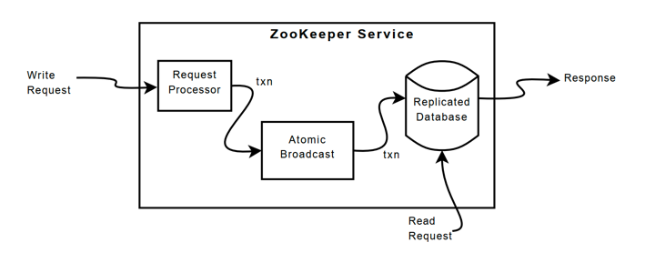
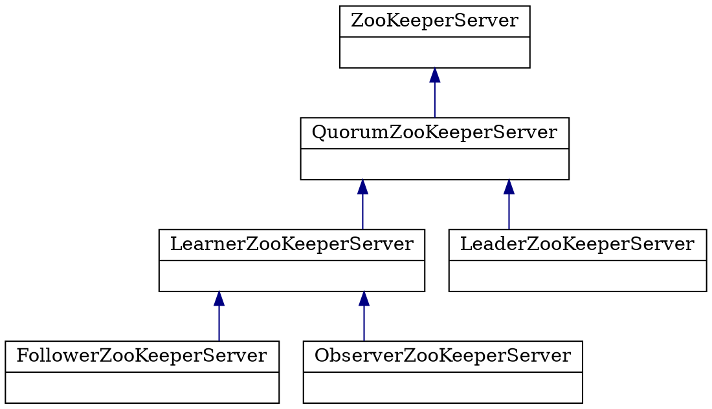
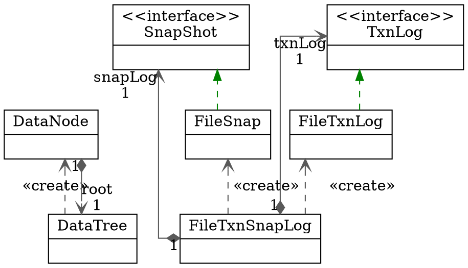

## Introduction

ZooKeeper 是一个集中式服务，用于维护配置信息、命名、提供分布式同步以及提供组服务。

所有这些服务都以某种形式被分布式应用所使用。
每次实现这些服务都需要大量工作来修复不可避免的 bug 和竞态条件。
由于实现此类服务的难度，应用程序最初通常会简化它们，这使得它们在变化发生时变得脆弱且难以管理。
即使正确实现，这些服务的不同实现方式也会在应用程序部署时导致管理复杂性。

ZooKeeper 是一个基于 Google Chubby 论文实现的一款解决分布式数据一致性问题的开源实现，方便了依赖 ZooKeeper 的应用实现数据发布/订阅、负载均衡、服务注册与发现、分布式协调、事件通知、集群管理、Leader 选举、分布式锁和队列等功能

ZooKeeper 旨在将这些不同服务的本质提炼到一个非常简单的集中式协调服务接口中。
该服务本身是分布式且高度可靠的。
共识、组管理和存在性协议将由该服务实现，因此应用程序无需自行实现。
这些服务的特定应用场景将由 ZooKeeper 的具体组件与应用特定的约定混合组成。

**ZooKeeper 为每个客户端提供了请求的 FIFO 执行保证，以及对所有更改 ZooKeeper 状态的请求提供线性一致性保证。**
为了保证更新操作满足线性一致性，ZooKeeper 实现了一个基于 leader 的原子广播协议，称为 [Zab](/docs/CS/Framework/ZooKeeper/Zab.md)。

在 ZooKeeper 中，服务器在本地处理读操作，我们不使用 Zab 来对它们进行全序排列。

在客户端缓存数据是提高读取性能的重要技术。
例如，进程缓存当前 leader 的标识符很有用，而不必每次需要知道 leader 时都查询 ZooKeeper。
ZooKeeper 使用 watch 机制使客户端能够缓存数据，而无需直接管理客户端缓存。
通过这种机制，客户端可以监视给定数据对象的更新，并在更新时收到通知。
Chubby 则直接管理客户端缓存。

ZooKeeper 向客户端提供了一组数据节点（znode）的抽象，这些节点按层次命名空间组织。

ZooKeeper 还具有以下两个活性和持久性保证：如果大多数 ZooKeeper 服务器处于活动状态并能够通信，则服务可用；
如果 ZooKeeper 服务成功响应更改请求，则该更改会在任意数量的故障后保持持久，只要最终能够恢复法定数量的服务器。

> [!TIP]
>
> [Build and run Zookeeper](/docs/CS/Framework/ZooKeeper/start.md)

### Consistency Guarantees

ZooKeeper 是一个高性能、可扩展的服务。
读写操作都设计为快速执行，但读取比写入更快。
原因是对于读取操作，ZooKeeper 可以提供旧数据，这源于 ZooKeeper 的一致性保证：

- **Sequential Consistency（顺序一致性）**
  来自客户端的更新将按照它们发送的顺序被应用。
- **Atomicity（原子性）**
  更新要么成功要么失败——没有部分结果。
- **Single System Image（单系统映像）**
  无论客户端连接到哪台服务器，它都会看到相同的服务视图。
- **Reliability（可靠性）**
  一旦更新被应用，它将从那时起持续存在，直到客户端覆盖该更新。这个保证有两个推论：

如果客户端获得成功返回码，则更新已被应用。
在某些故障情况下（通信错误、超时等），客户端将不知道更新是否已应用。
我们采取措施尽量减少故障，但保证仅在成功返回码时才成立。
（这在 [Paxos](/docs/CS/Distributed/Consensus/Paxos.md) 中称为单调性条件。）

客户端通过读取请求或成功更新看到的任何更改，在从服务器故障恢复时永远不会回滚。

**Timeliness（及时性）**
客户端的系统视图保证在特定时间范围内（大约几十秒）是最新的。系统变更要么在此时间范围内被客户端看到，要么客户端会检测到服务中断。


## Build

### Docker

docker-compose.yml

```yaml
version: '2'
services:
    zoo1:
        image: zookeeper
        restart: always
        container_name: zoo1
        ports:
            - "2181:2181"
        environment:
            ZOO_MY_ID: 1
            ZOO_SERVERS: server.1=zoo1:2888:3888;2181 server.2=zoo2:2888:3888;2181 server.3=zoo3:2888:3888;2181

    zoo2:
        image: zookeeper
        restart: always
        container_name: zoo2
        ports:
            - "2182:2181"
        environment:
            ZOO_MY_ID: 2
            ZOO_SERVERS: server.1=zoo1:2888:3888;2181 server.2=zoo2:2888:3888;2181 server.3=zoo3:2888:3888;2181

    zoo3:
        image: zookeeper
        restart: always
        container_name: zoo3
        ports:
            - "2183:2181"
        environment:
            ZOO_MY_ID: 3
            ZOO_SERVERS: server.1=zoo1:2888:3888;2181 server.2=zoo2:2888:3888;2181 server.3=zoo3:2888:3888;2181
```


## Architecture


Server端主要组件有

1. ZookeeperServerMain：这个类是ZK单机启动的启动入口，QuorumPeerMain是集群ZK的启动入口，等以后分析到集群的时候再来讲解当然，启动入口使用QuorumPeerMain也是可以的，只要把入参形式传成单机的即可而对于其作用也很简单，启动ZK的各类Thread处理线程以及生成ZK的文件日志；
2. ZookeeperServer：单机的实例类型，这个类的对象实例就是ZK的server实例如果是集群模式实例类型将会是其实现子类，包括Leade、Follower和Observer这些角色，都是其实现子类；如果把ZK服务比喻成人，那么这个类的实例就是具体的某个人，其重要的组件便是人的一些重要的器官，互相协调完成某种动作和功能；
3. RequestProcessor：看名字便可以得知，这个组件的作用便是用来处理Request请求的在ZK实例中，会有多个RequestProcessor实例链，每个实例都会对Request对象进行某种操作；
4. FileTxnSnapLog：用来管理TxnLog和SnapShot对象和其对应的File对象，TxnLog实现类的作用便是提供操作Txn日志文件的api方法，SnapShot实现类的作用便是保存、序列化和反序列化快照的功能；
5. ZKMBeanInfo：ZK的主要类信息接口，用来方便对接JMX代理服务，进而实现对JVM中的这些类进行监控，主要用于监控管理；
6. SessionTracker：ZK服务端用来追踪session的组件，单机和集群leader使用的是同一个，而Follower使用的是简单的Shell来跟踪转发给leader的；
7. Record：在ZK中是信息承载的角色，诸如各种的Request、Response和DataNode这些都是属于该接口的实现类，这个接口提供了序列化和反序列化接口标准；
8. ZKDatabase：维护内存中ZK关于session、datatree和提交日志的内存数据库，在从硬盘上读取日志和快照时将会被创建这个组件主要由DataTree、DataNode、WatchManager和Watcher等几个部分组成，这几个部分主要负责存储记录ZK的节点数据以及节点数据的监听功能，而Watcher接口则是Server端和Client端共用的监听接口；
9. NIO的ServerCnxn等：这次只分析通过NIO进行连接的ZK服务端，Netty的暂不分析ServerCnxn是Client端连接到Server端的实际实例类型，而其对象将是从ServerCnxnFactory工厂对象中产生的


## Data Model

ZooKeeper 具有层次化的命名空间，与分布式文件系统非常相似。
唯一的区别是命名空间中的每个节点既可以关联数据，也可以拥有子节点。
这就像有一个文件系统，允许文件同时也是目录。
节点的路径始终表示为规范、绝对、斜杠分隔的路径；没有相对引用。

<div style="text-align: center;">


</div>

<p style="text-align: center;">
Fig.1. ZooKeeper's Hierarchical Namespace.
</p>


Zookeeper的这种层次模型称作DataTree 

```java

public class ZKDatabase {

    private static final Logger LOG = LoggerFactory.getLogger(ZKDatabase.class);

    /**
     * make sure on a clear you take care of
     * all these members.
     */
    protected DataTree dataTree;
    protected ConcurrentHashMap<Long, Integer> sessionsWithTimeouts;
    protected FileTxnSnapLog snapLog;
    protected long minCommittedLog, maxCommittedLog;
}
```

DataTree的每个节点叫作ZNode
```java
public class DataTree {
    private final NodeHashMap nodes;

    private IWatchManager dataWatches;

    private IWatchManager childWatches;
}
```

### ZNodes

与文件系统中的文件不同，znode 并非为通用数据存储而设计。
相反，znode 映射到客户端应用的抽象，通常对应于用于协调目的的元数据。

虽然 znode 并非为通用数据存储而设计，但 ZooKeeper 确实允许客户端存储一些可用于分布式计算中元数据或配置的信息。
例如，在基于 leader 的应用中，刚启动的应用服务器了解当前哪个服务器是 leader 非常有用。
为了实现这一目标，我们可以让当前 leader 在 znode 空间中的已知位置写入此信息。

Znode 还关联了带有时间戳和版本计数器的元数据，这使得客户端能够跟踪 znode 的变更，并根据 znode 的版本执行条件更新。

与标准文件系统不同，ZooKeeper 命名空间中的每个节点既可以关联数据，也可以拥有子节点。
这就像有一个文件系统，允许文件同时也是目录。
（ZooKeeper 被设计用于存储协调数据：状态信息、配置、位置信息等，因此每个节点存储的数据通常很小，在字节到千字节范围内。）
我们使用术语 znode 来明确表示我们在讨论 ZooKeeper 数据节点。

Znode 维护一个 stat 结构，包含数据变更的版本号、ACL 变更和时间戳，以支持缓存验证和协调更新。
每次 znode 的数据发生变化时，版本号都会增加。
例如，每当客户端检索数据时，它也会收到该数据的版本。

命名空间中每个 znode 存储的数据是原子性读写。读取将获取与 znode 关联的所有数据字节，写入则替换所有数据。
每个节点都有一个访问控制列表（ACL），用于限制谁可以做什么。

Ephemeral Nodes


ZooKeeper also has the notion of ephemeral nodes. These znodes exists as long as the session that created the znode is active. When the session ends the znode is deleted.

Container node

TTL time to live


Node中维护了一个数据结构，用于记录ZNode中数据更改的**版本号**以及**ACL**（Access Control List）的变更

有了这些数据的**版本号**以及其更新的**Timestamp**，Zookeeper就可以验证客户端请求的缓存是否合法，并协调更新。

而且，当Zookeeper的客户端执行**更新**或者删除操作时，都必须要带上要修改的对应数据的版本号。如果Zookeeper检测到对应的版本号不存在，则不会执行这次更新。如果合法，在ZNode中数据更新之后，其对应的版本号也会**一起更新**。

> 这套版本号的逻辑，其实很多框架都在用，例如RocketMQ中，Broker向NameServer注册的时候，也会带上这样一个版本号，叫`DateVersion`。


ZooKeeper 的每个 ZNode 上都会存储数据，对应于每个 ZNode，ZooKeeper 都会为其维护一个叫做 Stat 的数据结构，Stat 中记录了这个 ZNode 的三个数据版本，分别是 version（当前 ZNode 数据内容的版本），cversion（当前 ZNode 子节点的版本）和 aversion（当前 ZNode 的 ACL 变更版本）。这里的版本起到了控制 ZooKeeper 操作原子性的作用

如果想要让写入数据的操作支持 CAS，则可以借助 Versionable#withVersion 方法，在 setData() 的同时指定当前数据的 verison。如果写入成功，则说明在当前数据写入的过程中，没有其他用户对该 ZNode 节点的内容进行过修改；否则，会抛出一个 KeeperException.BadVersionException，以此可以判断本次 CAS 写入是失败的。而这样做的好处就是，可以避免 “并发局部更新 ZNode 节点内容” 时，发生相互覆盖的问题


```java
public class DataTree {
    private final NodeHashMap nodes;
}
```

DataTree 的所有path都被保存在一个哈希表中，path到DataNode的映射关系是一一对应，因此我们可以通过path在 $O(1)$ 时间复杂度内找到对应的DataNode，这样就能够保证数据的快速查询

```java
  public class NodeHashMapImpl implements NodeHashMap {

    private final ConcurrentHashMap<String, DataNode> nodes;
    private final boolean digestEnabled;
    private final DigestCalculator digestCalculator;
}
```


该类包含数据树中一个节点的数据。

一个数据节点包含对其父节点的引用、作为数据的字节数组、ACL 数组、stat 对象以及其子节点路径的集合。


ZNode 由五部分组成：path、data、stat、acl、children，其中path是以/开始的全路径，剩余的四部分都存储在一个独立的DataNode数据结构中：data是 ZNode 的数据，stat是 ZNode 的元数据如版本号、数据长度等，acl是 ZNode 的权限控制，children是 ZNode 的子节点集合，同时DataNode也包含了一些辅助方法，比如getChildren、getData、setData等，用于操作 ZNode 的数据


```java
@SuppressFBWarnings({"EI_EXPOSE_REP", "EI_EXPOSE_REP2"})
public class DataNode implements Record {
    byte[] data;
    Long acl;
    public StatPersisted stat;
    private Set<String> children = null;
}
```


#### Ephemeral

DataTree里维护了ephemerals的Map 依赖于session

```java
public class DataTree {
    /**
     * This hashtable lists the paths of the ephemeral nodes of a session.
     */
    private final Map<Long, HashSet<String>> ephemerals = new ConcurrentHashMap<Long, HashSet<String>>();
}
```

临时节点有个特性，就是如果注册这个节点的机器失去连接(通常是宕机)，那么这个节点会被zookeeper删除。选主过程就是利用这个特性，在服务器启动的时候，去zookeeper特定的一个目录下注册一个临时节点(这个节点作为master，谁注册了这个节点谁就是master)，注册的时候，如果发现该节点已经存在，则说明已经有别的服务器注册了(也就是有别的服务器已经抢主成功)，那么当前服务器只能放弃抢主，作为从机存在。同时，抢主失败的当前服务器需要订阅该临时节点的删除事件，以便该节点删除时(也就是注册该节点的服务器宕机了或者网络断了之类的)进行再次抢主操作。选主的过程，其实就是简单的争抢在Zookeeper注册临时节点的操作，谁注册了约定的临时节点，谁就是master。所有服务器同时会在servers节点下注册一个临时节点（保存自己的基本信息），以便于应用程序读取当前可用的服务器列表
curator的LeaderSelector


如果当前是**临时顺序节点**，那么`ephemeralOwner`则存储了创建该节点的Owner的SessionID，有了SessionID，自然就能和对应的客户端匹配上，当Session失效之后，才能将该客户端创建的所有临时节点**全部删除**。


```java
public class DataTree {
    public Set<String> getEphemerals(long sessionId) {
        HashSet<String> ret = ephemerals.get(sessionId);
        if (ret == null) {
            return new HashSet<>();
        }
        synchronized (ret) {
            return (HashSet<String>) ret.clone();
        }
    }
}
```


### createNode

```java
public void createNode(final String path, byte[] data, List<ACL> acl, long ephemeralOwner, int parentCVersion, long zxid, long time, Stat outputStat) throws KeeperException.NoNodeException, KeeperException.NodeExistsException {
    int lastSlash = path.lastIndexOf('/');
    String parentName = path.substring(0, lastSlash);
    String childName = path.substring(lastSlash + 1);
    StatPersisted stat = createStat(zxid, time, ephemeralOwner);
    DataNode parent = nodes.get(parentName);
    if (parent == null) {
        throw new KeeperException.NoNodeException();
    }
    synchronized (parent) {
        // Add the ACL to ACL cache first, to avoid the ACL not being
        // created race condition during fuzzy snapshot sync.
        //
        // This is the simplest fix, which may add ACL reference count
        // again if it's already counted in in the ACL map of fuzzy
        // snapshot, which might also happen for deleteNode txn, but
        // at least it won't cause the ACL not exist issue.
        //
        // Later we can audit and delete all non-referenced ACLs from
        // ACL map when loading the snapshot/txns from disk, like what
        // we did for the global sessions.
        Long longval = aclCache.convertAcls(acl);

        Set<String> children = parent.getChildren();
        if (children.contains(childName)) {
            throw new KeeperException.NodeExistsException();
        }

        nodes.preChange(parentName, parent);
        if (parentCVersion == -1) {
            parentCVersion = parent.stat.getCversion();
            parentCVersion++;
        }
        // There is possibility that we'll replay txns for a node which
        // was created and then deleted in the fuzzy range, and it's not
        // exist in the snapshot, so replay the creation might revert the
        // cversion and pzxid, need to check and only update when it's
        // larger.
        if (parentCVersion > parent.stat.getCversion()) {
            parent.stat.setCversion(parentCVersion);
            parent.stat.setPzxid(zxid);
        }
        DataNode child = new DataNode(data, longval, stat);
        parent.addChild(childName);
        nodes.postChange(parentName, parent);
        nodeDataSize.addAndGet(getNodeSize(path, child.data));
        nodes.put(path, child);
        EphemeralType ephemeralType = EphemeralType.get(ephemeralOwner);
        if (ephemeralType == EphemeralType.CONTAINER) {
            containers.add(path);
        } else if (ephemeralType == EphemeralType.TTL) {
            ttls.add(path);
        } else if (ephemeralOwner != 0) {
            HashSet<String> list = ephemerals.get(ephemeralOwner);
            if (list == null) {
                list = new HashSet<String>();
                ephemerals.put(ephemeralOwner, list);
            }
            synchronized (list) {
                list.add(path);
            }
        }
        if (outputStat != null) {
            child.copyStat(outputStat);
        }
    }
    // now check if its one of the zookeeper node child
    if (parentName.startsWith(quotaZookeeper)) {
        // now check if its the limit node
        if (Quotas.limitNode.equals(childName)) {
            // this is the limit node
            // get the parent and add it to the trie
            pTrie.addPath(Quotas.trimQuotaPath(parentName));
        }
        if (Quotas.statNode.equals(childName)) {
            updateQuotaForPath(Quotas.trimQuotaPath(parentName));
        }
    }

    String lastPrefix = getMaxPrefixWithQuota(path);
    long bytes = data == null ? 0 : data.length;
    // also check to update the quotas for this node
    if (lastPrefix != null) {    // ok we have some match and need to update
        updateQuotaStat(lastPrefix, bytes, 1);
    }
    updateWriteStat(path, bytes);
    dataWatches.triggerWatch(path, Event.EventType.NodeCreated);
    childWatches.triggerWatch(parentName.equals("") ? "/" : parentName, Event.EventType.NodeChildrenChanged);
}
```


delete Node

```java
public void deleteNode(String path, long zxid) throws KeeperException.NoNodeException {
    int lastSlash = path.lastIndexOf('/');
    String parentName = path.substring(0, lastSlash);
    String childName = path.substring(lastSlash + 1);

    // The child might already be deleted during taking fuzzy snapshot,
    // but we still need to update the pzxid here before throw exception
    // for no such child
    DataNode parent = nodes.get(parentName);
    if (parent == null) {
        throw new KeeperException.NoNodeException();
    }
    synchronized (parent) {
        nodes.preChange(parentName, parent);
        parent.removeChild(childName);
        // Only update pzxid when the zxid is larger than the current pzxid,
        // otherwise we might override some higher pzxid set by a create
        // Txn, which could cause the cversion and pzxid inconsistent
        if (zxid > parent.stat.getPzxid()) {
            parent.stat.setPzxid(zxid);
        }
        nodes.postChange(parentName, parent);
    }

    DataNode node = nodes.get(path);
    if (node == null) {
        throw new KeeperException.NoNodeException();
    }
    nodes.remove(path);
    synchronized (node) {
        aclCache.removeUsage(node.acl);
        nodeDataSize.addAndGet(-getNodeSize(path, node.data));
    }

    // Synchronized to sync the containers and ttls change, probably
    // only need to sync on containers and ttls, will update it in a
    // separate patch.
    synchronized (parent) {
        long eowner = node.stat.getEphemeralOwner();
        EphemeralType ephemeralType = EphemeralType.get(eowner);
        if (ephemeralType == EphemeralType.CONTAINER) {
            containers.remove(path);
        } else if (ephemeralType == EphemeralType.TTL) {
            ttls.remove(path);
        } else if (eowner != 0) {
            Set<String> nodes = ephemerals.get(eowner);
            if (nodes != null) {
                synchronized (nodes) {
                    nodes.remove(path);
                }
            }
        }
    }

    if (parentName.startsWith(procZookeeper) && Quotas.limitNode.equals(childName)) {
        // delete the node in the trie.
        // we need to update the trie as well
        pTrie.deletePath(Quotas.trimQuotaPath(parentName));
    }

    // also check to update the quotas for this node
    String lastPrefix = getMaxPrefixWithQuota(path);
    if (lastPrefix != null) {
        // ok we have some match and need to update
        long bytes = 0;
        synchronized (node) {
            bytes = (node.data == null ? 0 : -(node.data.length));
        }
        updateQuotaStat(lastPrefix, bytes, -1);
    }

    updateWriteStat(path, 0L);

    if (LOG.isTraceEnabled()) {
        ZooTrace.logTraceMessage(
            LOG,
            ZooTrace.EVENT_DELIVERY_TRACE_MASK,
            "dataWatches.triggerWatch " + path);
        ZooTrace.logTraceMessage(
            LOG,
            ZooTrace.EVENT_DELIVERY_TRACE_MASK,
            "childWatches.triggerWatch " + parentName);
    }

    WatcherOrBitSet processed = dataWatches.triggerWatch(path, EventType.NodeDeleted);
    childWatches.triggerWatch(path, EventType.NodeDeleted, processed);
    childWatches.triggerWatch("".equals(parentName) ? "/" : parentName, EventType.NodeChildrenChanged);
}
```
#### expire

ExpiryQueue 在按时间排序的固定时长桶中跟踪元素。
它被 SessionTrackerImpl 用于会话过期，以及被 NIOServerCnxnFactory 用于连接过期。

```java
public class ExpiryQueue<E> {

    private final ConcurrentHashMap<E, Long> elemMap = new ConcurrentHashMap<E, Long>();
    /**
     * The maximum number of buckets is equal to max timeout/expirationInterval,
     * so the expirationInterval should not be too small compared to the
     * max timeout that this expiry queue needs to maintain.
     */
    private final ConcurrentHashMap<Long, Set<E>> expiryMap = new ConcurrentHashMap<Long, Set<E>>();
}
```


这是一个功能完整的 SessionTracker。它按照 tick 间隔将会话分组跟踪。
它总是向上取整 tick 间隔，以提供一种宽限期。
因此，会话以在给定时间间隔内过期的会话为批次进行过期处理。


```java
public class SessionTrackerImpl extends ZooKeeperCriticalThread implements SessionTracker {

    protected final ConcurrentHashMap<Long, SessionImpl> sessionsById = new ConcurrentHashMap<Long, SessionImpl>();

    private final ExpiryQueue<SessionImpl> sessionExpiryQueue;

  	@Override
    public void run() {
        try {
            while (running) {
                long waitTime = sessionExpiryQueue.getWaitTime();
                if (waitTime > 0) {
                    Thread.sleep(waitTime);
                    continue;
                }

                for (SessionImpl s : sessionExpiryQueue.poll()) {
                    ServerMetrics.getMetrics().STALE_SESSIONS_EXPIRED.add(1);
                    setSessionClosing(s.sessionId);
                    expirer.expire(s);
                }
            }
        } catch (InterruptedException e) {
            handleException(this.getName(), e);
        }
        LOG.info("SessionTrackerImpl exited loop!");
    }
}
```


更新session过期时间

```java
public class ExpiryQueue<E> {
public Long update(E elem, int timeout) {
    Long prevExpiryTime = elemMap.get(elem);
    long now = Time.currentElapsedTime();
    Long newExpiryTime = roundToNextInterval(now + timeout);

    if (newExpiryTime.equals(prevExpiryTime)) {
        // No change, so nothing to update
        return null;
    }

    // First add the elem to the new expiry time bucket in expiryMap.
    Set<E> set = expiryMap.get(newExpiryTime);
    if (set == null) {
        // Construct a ConcurrentHashSet using a ConcurrentHashMap
        set = Collections.newSetFromMap(new ConcurrentHashMap<E, Boolean>());
        // Put the new set in the map, but only if another thread
        // hasn't beaten us to it
        Set<E> existingSet = expiryMap.putIfAbsent(newExpiryTime, set);
        if (existingSet != null) {
            set = existingSet;
        }
    }
    set.add(elem);

    // Map the elem to the new expiry time. If a different previous
    // mapping was present, clean up the previous expiry bucket.
    prevExpiryTime = elemMap.put(elem, newExpiryTime);
    if (prevExpiryTime != null && !newExpiryTime.equals(prevExpiryTime)) {
        Set<E> prevSet = expiryMap.get(prevExpiryTime);
        if (prevSet != null) {
            prevSet.remove(elem);
        }
    }
    return newExpiryTime;
}
}
```


### Watches

客户端可以在 znode 上设置 watch。
对该 znode 的变更会触发 watch，然后清除该 watch。
当 watch 触发时，ZooKeeper 会向客户端发送通知。

> **New in 3.6.0:** Clients can also set permanent, recursive watches on a znode that are not removed when triggered and that trigger for changes on the registered znode as well as any children znodes recursively.

ZooKeeper 还有临时节点的概念。
这些 znode 在创建它们的会话处于活动状态时存在。
当会话结束时，znode 被删除。由于这种行为，临时节点不允许拥有子节点。

最核心或者说关键的代码就是创建一个列表来存放观察者
而在 ZooKeeper 中则是在客户端和服务器端分别实现两个存放观察者列表，即：ZKWatchManager 和 WatchManager

客户端发送一个 Watch 监控事件的会话请求时，ZooKeeper 客户端主要做了两个工作：

- 标记该会话是一个带有 Watch 事件的请求
- 将 Watch 事件存储到 ZKWatchManager


以 getData 接口为例。当发送一个带有 Watch 事件的请求时，客户端首先会把该会话标记为带有 Watch 监控的事件请求，之后通过 DataWatchRegistration 类来保存 watcher 事件和节点的对应关系

之后客户端向服务器发送请求时，是将请求封装成一个 Packet 对象，并添加到一个等待发送队列 outgoingQueue 中

最后，ZooKeeper 客户端就会向服务器端发送这个请求，完成请求发送后。调用负责处理服务器响应的 SendThread 线程类中的  readResponse 方法接收服务端的回调，并在最后执行 finishPacket（）方法将 Watch 注册到  ZKWatchManager 


Zookeeper 服务端处理 Watch 事件基本有 2 个过程：

- 解析收到的请求是否带有 Watch 注册事件
- 将对应的 Watch 事件存储到 WatchManager


当 ZooKeeper 服务器接收到一个客户端请求后，首先会对请求进行解析，判断该请求是否包含 Watch 事件。这在 ZooKeeper  底层是通过 FinalRequestProcessor 类中的 processRequest 函数实现的。当  getDataRequest.getWatch() 值为 True 时，表明该请求需要进行 Watch 监控注册。并通过  zks.getZKDatabase().getData 函数将 Watch 事件注册到服务端的 WatchManager 中


在DataTree中有两个IWatchManager类型的对象，一个是dataWatches，一个是childWatches， 其中:

- dataWatches是保存节点层面的watcher对象，
- childWatches是保存子节点层面的watcher对象

使用这两个监听器可以分别为节点路径添加监听器在合适的场景下来触发监听，当然也可以移除已添加路径的监听器


```java
public class DataTree {

    private IWatchManager dataWatches;

    private IWatchManager childWatches;
    
    DataTree(DigestCalculator digestCalculator) {
        // ...
        try {
            dataWatches = WatchManagerFactory.createWatchManager();
            childWatches = WatchManagerFactory.createWatchManager();
        } catch (Exception e) {
            LOG.error("Unexpected exception when creating WatchManager, exiting abnormally", e);
        }
    }
}
```


主要的监听方法是添加，移除，触发监听器，和查询信息等方法


```java

public interface IWatchManager {
    boolean addWatch(String path, Watcher watcher);

    default boolean addWatch(String path, Watcher watcher, WatcherMode watcherMode) {
        if (watcherMode == WatcherMode.DEFAULT_WATCHER_MODE) {
            return addWatch(path, watcher);
        }
        throw new UnsupportedOperationException();  // custom implementations must defeat this
    }

    boolean containsWatcher(String path, Watcher watcher);

    default boolean containsWatcher(String path, Watcher watcher, @Nullable WatcherMode watcherMode) {
        if (watcherMode == null || watcherMode == WatcherMode.DEFAULT_WATCHER_MODE) {
            return containsWatcher(path, watcher);
        }
        throw new UnsupportedOperationException("persistent watch");
    }

    boolean removeWatcher(String path, Watcher watcher);

    default boolean removeWatcher(String path, Watcher watcher, WatcherMode watcherMode) {
        if (watcherMode == null || watcherMode == WatcherMode.DEFAULT_WATCHER_MODE) {
            return removeWatcher(path, watcher);
        }
        throw new UnsupportedOperationException("persistent watch");
    }

    void removeWatcher(Watcher watcher);

    WatcherOrBitSet triggerWatch(String path, EventType type, long zxid, List<ACL> acl);

    WatcherOrBitSet triggerWatch(String path, EventType type, long zxid, List<ACL> acl, WatcherOrBitSet suppress);

    int size();

    void shutdown();

    WatchesSummary getWatchesSummary();

    WatchesReport getWatches();

    WatchesPathReport getWatchesByPath();

    void dumpWatches(PrintWriter pwriter, boolean byPath);
}
```


在DataTree类型的构造器中初始化监听管理器对象是通过WatchManagerFactory工厂类型提供的工厂方法创建的

```java
public static IWatchManager createWatchManager() throws IOException {
    String watchManagerName = System.getProperty(ZOOKEEPER_WATCH_MANAGER_NAME);
    if (watchManagerName == null) {
        watchManagerName = WatchManager.class.getName();
    }
    try {
        IWatchManager watchManager = (IWatchManager) Class.forName(watchManagerName).getConstructor().newInstance();
        return watchManager;
    } catch (Exception e) {
        IOException ioe = new IOException("Couldn't instantiate " + watchManagerName, e);
        throw ioe;
    }
}
```

**WatchManager类型** 主要实现了IWatchManager接口针对监听管理器做具体的实现

WatchManager重写了IWatchManager接口针对监听管理的通用方法比如添加监听器，移除监听器，触发监听器等等

其中添加和移除监听器操作分别会将监听器在watchTable，watch2Paths，watcherModeManager 对象中放入或者移除，而触发监听器方法则会执行通知操作

```java
public class WatchManager implements IWatchManager {

    private final Map<String, Set<Watcher>> watchTable = new HashMap<>();

    private final Map<Watcher, Map<String, WatchStats>> watch2Paths = new HashMap<>();

    private int recursiveWatchQty = 0;
}
```

Watcher 机制的实现是通过在 ZNode 上注册 Watcher，当 ZNode 发生变化时，通过watchTable找到所有注册在这个 ZNode 上的 Watcher，然后通知这些 Watcher。Zookeeper Server 会将 Watcher 事件通知发送给客户端，从而实现 Watch 事件通知机制


#### EventType

EventType是一个枚举类型用来列举Zookeeper可能发生的事件， 可以看到监听事件的触发主要发生在节点状态的变更与节点数据的变更时触发

```java
@InterfaceAudience.Public
enum EventType {
    None(-1),
    NodeCreated(1),
    NodeDeleted(2),
    NodeDataChanged(3),
    NodeChildrenChanged(4),
    DataWatchRemoved(5),
    ChildWatchRemoved(6),
    PersistentWatchRemoved (7);

    private final int intValue;     // Integer representation of value
    // for sending over wire
}
```


在创建一个zookeeper客户端对象实例时，我们通过new Watcher()向构造方法中传入一个默认的Watcher，这个Watcher将作为整个zookeeper会话期间默认Watcher，会一直被保存在客户端ZKWatchManager的defaultWatcher中
```Java
public class WatcherDemo implements Watcher {
    static ZooKeeper zooKeeper;

    static {
        try {
            zooKeeper = new ZooKeeper("192.168.3.39:2181", 4000, new WatcherDemo());
        } catch (IOException e) {
            e.printStackTrace();
        }
    }

    @Override
    public void process(WatchedEvent event) {
        System.out.println("eventType:" + event.getType());
        if (event.getType() == Event.EventType.NodeDataChanged) {
            try {
                zooKeeper.exists(event.getPath(), true);
            } catch (KeeperException e) {
                e.printStackTrace();
            } catch (InterruptedException e) {
                e.printStackTrace();
            }
        }
    }

    public static void main(String[] args) throws IOException, KeeperException, InterruptedException {
        String path = "/watcher";
        if (zooKeeper.exists(path, false) == null) {
            zooKeeper.create("/watcher", "0".getBytes(), ZooDefs.Ids.OPEN_ACL_UNSAFE, CreateMode.PERSISTENT);
        }
        Thread.sleep(1000);
        System.out.println("————");
        //true表示使用zookeeper实例中配置的watcher
        Stat stat = zooKeeper.exists(path, true);
        System.in.read();
    }
}
```
在创建一个zookeeper客户端对象实例时，我们通过new Watcher()向构造方法中传入一个默认的Watcher，这个Watcher将作为整个zookeeper会话期间默认Watcher，会一直被保存在客户端ZKWatchManager的defaultWatcher中


```java
public ZooKeeper(
        String connectString,
        int sessionTimeout,
        Watcher watcher,
        long sessionId,
        byte[] sessionPasswd,
        boolean canBeReadOnly,
        HostProvider hostProvider,
        ZKClientConfig clientConfig) throws IOException {
  LOG.info(
          "Initiating client connection, connectString={} "
                  + "sessionTimeout={} watcher={} sessionId=0x{} sessionPasswd={}",
          connectString,
          sessionTimeout,
          watcher,
          Long.toHexString(sessionId),
          (sessionPasswd == null ? "<null>" : "<hidden>"));

  this.clientConfig = clientConfig != null ? clientConfig : new ZKClientConfig();
  ConnectStringParser connectStringParser = new ConnectStringParser(connectString);
  this.hostProvider = hostProvider;

  cnxn = new ClientCnxn(
          connectStringParser.getChrootPath(),
          hostProvider,
          sessionTimeout,
          this.clientConfig,
          watcher,
          getClientCnxnSocket(),
          sessionId,
          sessionPasswd,
          canBeReadOnly);
  cnxn.seenRwServerBefore = true; // since user has provided sessionId
  cnxn.start();
}
```


ClientCnxn是zookeeper客户端和zookeeper服务器端进行通信和事件通知处理的主要类，它内部包含：
1. SendThread：负责客户端和服务器端的数据通信，也包括事件信息的传输。
2. EventThread：主要在客户端回调注册的Watcher进行通知处理。


```java
public ClientCnxn(
    String chrootPath,
    HostProvider hostProvider,
    int sessionTimeout,
    ZKClientConfig clientConfig,
    Watcher defaultWatcher,
    ClientCnxnSocket clientCnxnSocket,
    long sessionId,
    byte[] sessionPasswd,
    boolean canBeReadOnly
) throws IOException {
    this.chrootPath = chrootPath;
    this.hostProvider = hostProvider;
    this.sessionTimeout = sessionTimeout;
    this.clientConfig = clientConfig;
    this.sessionId = sessionId;
    this.sessionPasswd = sessionPasswd;
    this.readOnly = canBeReadOnly;

    this.watchManager = new ZKWatchManager(
        clientConfig.getBoolean(ZKClientConfig.DISABLE_AUTO_WATCH_RESET),
        defaultWatcher);

    this.connectTimeout = sessionTimeout / hostProvider.size();
    this.readTimeout = sessionTimeout * 2 / 3;

    this.sendThread = new SendThread(clientCnxnSocket);
    this.eventThread = new EventThread();
    initRequestTimeout();
}

```


#### triggerWatch
Watcher 机制是一次性的，当 ZNode 发生变化时，Zookeeper Server 会调用WatchManager.triggerWatch方法触发数据变更事件，同时将这些 Watcher 从watchTable中删除，这意味着每个 Watcher 只能接收到一次通知，如果我们想要继续监听 ZNode 的变化，那么我们需要重新注册 Watcher


Watcher 与客户端的 Session 绑定，当 Session 超时或关闭时，所有的 Watcher 都会失效，客户端需要重新注册 Watcher，在重新建立连接前，任何 ZNode 的变化都不会通知客户端。那么我们在接收到通知后，或出现网络故障，都需要重新注册 Watcher，如果我们在重新注册 Watcher 之前，ZNode 发生了变化，那么我们就会错过这次变化，从而导致客户端观测到的数据变化过程少于真实的数据变化过程，因此 Zookeeper 的 Watcher 机制只能保证最终一致性，而不能保证线性一致性

```java
@Override
public WatcherOrBitSet triggerWatch(String path, EventType type, long zxid, List<ACL> acl, WatcherOrBitSet supress) {
    WatchedEvent e = new WatchedEvent(type, KeeperState.SyncConnected, path, zxid);
    Set<Watcher> watchers = new HashSet<>();
    synchronized (this) {
        PathParentIterator pathParentIterator = getPathParentIterator(path);
        for (String localPath : pathParentIterator.asIterable()) {
            Set<Watcher> thisWatchers = watchTable.get(localPath);
            if (thisWatchers == null || thisWatchers.isEmpty()) {
                continue;
            }
            Iterator<Watcher> iterator = thisWatchers.iterator();
            while (iterator.hasNext()) {
                Watcher watcher = iterator.next();
                Map<String, WatchStats> paths = watch2Paths.getOrDefault(watcher, Collections.emptyMap());
                WatchStats stats = paths.get(localPath);
                if (stats == null) {
                    LOG.warn("inconsistent watch table for watcher {}, {} not in path list", watcher, localPath);
                    continue;
                }
                if (!pathParentIterator.atParentPath()) {
                    watchers.add(watcher);
                    WatchStats newStats = stats.removeMode(WatcherMode.STANDARD);
                    if (newStats == WatchStats.NONE) {
                        iterator.remove();
                        paths.remove(localPath);
                    } else if (newStats != stats) {
                        paths.put(localPath, newStats);
                    }
                } else if (stats.hasMode(WatcherMode.PERSISTENT_RECURSIVE)) {
                    watchers.add(watcher);
                }
            }
            if (thisWatchers.isEmpty()) {
                watchTable.remove(localPath);
            }
        }
    }
    if (watchers.isEmpty()) {
        if (LOG.isTraceEnabled()) {
            ZooTrace.logTraceMessage(LOG, ZooTrace.EVENT_DELIVERY_TRACE_MASK, "No watchers for " + path);
        }
        return null;
    }

    for (Watcher w : watchers) {
        if (supress != null && supress.contains(w)) {
            continue;
        }
        if (w instanceof ServerWatcher) {
            ((ServerWatcher) w).process(e, acl);
        } else {
            w.process(e);
        }
    }

    switch (type) {
        case NodeCreated:
            ServerMetrics.getMetrics().NODE_CREATED_WATCHER.add(watchers.size());
            break;

        case NodeDeleted:
            ServerMetrics.getMetrics().NODE_DELETED_WATCHER.add(watchers.size());
            break;

        case NodeDataChanged:
            ServerMetrics.getMetrics().NODE_CHANGED_WATCHER.add(watchers.size());
            break;

        case NodeChildrenChanged:
            ServerMetrics.getMetrics().NODE_CHILDREN_WATCHER.add(watchers.size());
            break;
        default:
            // Other types not logged.
            break;
    }

    return new WatcherOrBitSet(watchers);
}
```


客户端

```java
class ZKWatchManager implements ClientWatchManager {

    private final Map<String, Set<Watcher>> dataWatches = new HashMap<>();
    private final Map<String, Set<Watcher>> existWatches = new HashMap<>();
    private final Map<String, Set<Watcher>> childWatches = new HashMap<>();
    private final Map<String, Set<Watcher>> persistentWatches = new HashMap<>();
    private final Map<String, Set<Watcher>> persistentRecursiveWatches = new HashMap<>();
    private final boolean disableAutoWatchReset;

    private volatile Watcher defaultWatcher;

    ZKWatchManager(boolean disableAutoWatchReset, Watcher defaultWatcher) {
        this.disableAutoWatchReset = disableAutoWatchReset;
        this.defaultWatcher = defaultWatcher;
    }
}
```


客户端使用 SendThread.readResponse() 方法来统一处理服务端的相应。首先反序列化服务器发送请求头信息  replyHdr.deserialize(bbia, “header”)，并判断相属性字段 xid 的值为  -1，表示该请求响应为通知类型。在处理通知类型时，首先将己收到的字节流反序列化转换成 WatcherEvent 对象。接着判断客户端是否配置了  chrootPath 属性，如果为 True 说明客户端配置了 chrootPath 属性。需要对接收到的节点路径进行 chrootPath  处理。最后调用 eventThread.queueEvent( ）方法将接收到的事件交给 EventThread 线程进行处理


从 ZKWatchManager 中查询注册过的客户端 Watch 信息。客户端在查询到对应的 Watch 信息后，会将其从 ZKWatchManager 的管理中删除

获取到对应的 Watcher 信息后，将查询到的 Watcher 存储到 waitingEvents 队列中，调用 EventThread 类中的 run 方法会循环取出在 waitingEvents 队列中等待的 Watcher 事件进行处理

最后调用 processEvent(event) 方法来最终执行实现了 Watcher 接口的 process（）方法


### session

Session 指客户端会话。在 ZooKeeper 中，一个客户端会话是指 客户端和服务器之间的一个 TCP 长连接。
客户端启动的时候，会与服务端建立一个 TCP 连接，客户端会话的生命周期，则是从第一次连接建立开始算起。通过这个连接，客户端能够通过心跳检测与服务器保持有效的会话，并向 ZooKeeper 服务器发送请求并接收响应，以及接收来自服务端的 Watch 事件通知

Session 的 sessionTimeout 参数，用来控制一个客户端会话的超时时间。
当服务器压力太大 或者是网络故障等各种原因导致客户端连接断开时，Client 会自动从 ZooKeeper 地址列表中逐一尝试重连（重试策略可使用 Curator 来实现）。只要在 sessionTimeout 规定的时间内能够重新连接上集群中任意一台服务器，那么之前创建的会话仍然有效。如果，在 sessionTimeout 时间外重连了，就会因为 Session 已经被清除了，而被告知 SESSION_EXPIRED，此时需要程序去恢复临时数据；还有一种 Session 重建后的在新节点上的数据，被之前节点上因网络延迟晚来的写请求所覆盖的情况，在 ZOOKEEPER-417 中被提出，并在该 JIRA 中新加入的 SessionMovedException，使得 用同一个 sessionld/sessionPasswd 重建 Session 的客户端能感知到，但是这个问题到 ZOOKEEPER-2219 仍然没有得到很好的解决


ZooKeeperServer持有一个SessionTracker
```java
public class ZooKeeperServer implements SessionExpirer, ServerStats.Provider {
  protected SessionTracker sessionTracker;
}
```
SessionTrackerImpl中sessionsById使用ConcurrentHashMap存储session
```java
public class SessionTrackerImpl extends ZooKeeperCriticalThread implements SessionTracker {

    protected final ConcurrentHashMap<Long, SessionImpl> sessionsById = new ConcurrentHashMap<>();

    private final ExpiryQueue<SessionImpl> sessionExpiryQueue;

    protected final ConcurrentMap<Long, Integer> sessionsWithTimeout;
    private final AtomicLong nextSessionId = new AtomicLong();
}
```


processConnectRequest调用了reopenSession

```java
public class ZooKeeperServer implements SessionExpirer, ServerStats.Provider {
    long createSession(ServerCnxn cnxn, byte[] passwd, int timeout) {
        if (passwd == null) {
            // Possible since it's just deserialized from a packet on the wire.
            passwd = new byte[0];
        }
        long sessionId = sessionTracker.createSession(timeout);
        Random r = new Random(sessionId ^ superSecret);
        r.nextBytes(passwd);
        CreateSessionTxn txn = new CreateSessionTxn(timeout);
        cnxn.setSessionId(sessionId);
        Request si = new Request(cnxn, sessionId, 0, OpCode.createSession, RequestRecord.fromRecord(txn), null);
        submitRequest(si);
        return sessionId;
    }
}
```


```java
public class ZooKeeperServer implements SessionExpirer, ServerStats.Provider {
    public void reopenSession(ServerCnxn cnxn, long sessionId, byte[] passwd, int sessionTimeout) throws IOException {
        if (checkPasswd(sessionId, passwd)) {
            revalidateSession(cnxn, sessionId, sessionTimeout);
        } else {
            finishSessionInit(cnxn, false);
        }
    }
}
```

```java
protected void revalidateSession(ServerCnxn cnxn, long sessionId, int sessionTimeout) throws IOException {
  boolean rc = sessionTracker.touchSession(sessionId, sessionTimeout);
  finishSessionInit(cnxn, rc);
}
```


```java
public class SessionTrackerImpl extends ZooKeeperCriticalThread implements SessionTracker {
    public synchronized boolean touchSession(long sessionId, int timeout) {
        SessionImpl s = sessionsById.get(sessionId);

        if (s == null) {
            logTraceTouchInvalidSession(sessionId, timeout);
            return false;
        }

        if (s.isClosing()) {
            logTraceTouchClosingSession(sessionId, timeout);
            return false;
        }

        updateSessionExpiry(s, timeout);
        return true;
    }
}
```


#### session expire


```java
public class SessionTrackerImpl extends ZooKeeperCriticalThread implements SessionTracker {
 @Override
    public void run() {
        try {
            while (running) {
                long waitTime = sessionExpiryQueue.getWaitTime();
                if (waitTime > 0) {
                    Thread.sleep(waitTime);
                    continue;
                }

                for (SessionImpl s : sessionExpiryQueue.poll()) {
                    ServerMetrics.getMetrics().STALE_SESSIONS_EXPIRED.add(1);
                    setSessionClosing(s.sessionId);
                    expirer.expire(s);
                }
            }
        } catch (InterruptedException e) {
            handleException(this.getName(), e);
        }
        LOG.info("SessionTrackerImpl exited loop!");
    }
}
```


### ZooKeeper guarantees

ZooKeeper has two basic ordering guarantees:

- **Linearizable writes:** all requests that update the state of ZooKeeper are serializable and respect precedence;
- **FIFO client order:** all requests from a given client are executed in the order that they were sent by the client.

ecause only update requests are Alinearizable, ZooKeeper processes read requests locally at each replica.
This allows the service to scale linearly as servers are added to the system.

ZooKeeper is very fast and very simple. Since its goal, though, is to be a basis for the construction of more complicated services, such as synchronization, it provides a set of guarantees. These are:

* Sequential Consistency - Updates from a client will be applied in the order that they were sent.
* Atomicity - Updates either succeed or fail. No partial results.
* Single System Image - A client will see the same view of the service regardless of the server that it connects to. i.e., a client will never see an older view of the system even if the client fails over to a different server with the same session.
* Reliability - Once an update has been applied, it will persist from that time forward until a client overwrites the update.
* Timeliness - The clients view of the system is guaranteed to be up-to-date within a certain time bound.


### Guarantees

ZooKeeper is very fast and very simple. Since its goal, though, is to be a basis for the construction of more complicated services, such as synchronization, it provides a set of guarantees. These are:

- Sequential Consistency - Updates from a client will be applied in the order that they were sent.
- Atomicity - Updates either succeed or fail. No partial results.
- Single System Image - A client will see the same view of the service regardless of the server that it connects to. i.e., a client will never see an older view of the system even if the client fails over to a different server with the same session.
- Reliability - Once an update has been applied, it will persist from that time forward until a client overwrites the update.
- Timeliness - The clients view of the system is guaranteed to be up-to-date within a certain time bound.

**The consistency guarantees of ZooKeeper lie between sequential consistency and linearizability.
Write operations in ZooKeeper are linearizable.**
In other words, each write will appear to take effect atomically at some point between when the client issues the request and receives the corresponding response.
Read operations in ZooKeeper are not linearizable since they can return potentially stale data.
This is because a read in ZooKeeper is not a quorum operation and a server will respond immediately to a client that is performing a read.
ZooKeeper does this because it prioritizes performance over consistency for the read use case.

### Simple API

One of the design goals of ZooKeeper is providing a very simple programming interface.
As a result, it supports only these operations:

- *create* : creates a node at a location in the tree
- *delete* : deletes a node
- *exists* : tests if a node exists at a location
- *get data* : reads the data from a node
- *set data* : writes data to a node
- *get children* : retrieves a list of children of a node
- *sync* : waits for data to be propagated


### ACL

ACL（Access Control List）用于控制ZNode的相关权限，其权限控制和Linux中的类似。Linux中权限**种类**分为了三种，分别是**读**、**写**、**执行**，分别对应的字母是r、w、x。其权限粒度也分为三种，分别是**拥有者权限**、**群组权限**、**其他组权限**

粒度是对权限所作用的对象的分类，把上面三种粒度换个说法描述就是**对用户（Owner）、用户所属的组（Group)、其他组（Other）**的权限划分，这应该算是一种权限控制的标准了，典型的三段式。

Zookeeper中虽然也是三段式，但是两者对粒度的划分存在区别。Zookeeper中的三段式为**Scheme、ID、Permissions**，含义分别为权限机制、允许访问的用户和具体的权限。

以节点授权 addAuth 接口为例，首先客户端通过 ClientCnxn 类中的 addAuthInfo 方法向服务端发送 ACL  权限信息变更请求，该方法首先将 scheme 和 auth 封装成 AuthPacket 类，并通过 RequestHeader  方法表示该请求是权限操作请求，最后将这些数据统一封装到 packet 中，并添加到 outgoingQueue 队列中发送给服务端


当节点授权请求发送到服务端后，在服务器的处理中首先调用 readRequest（）方法作为服务器处理的入口，其内部只是调用 processPacket 方法

而在 processPacket 方法的内部，首先反序列化客户端的请求信息并封装到 AuthPacket 对象中。之后通过  getServerProvider 方法根据不同的 scheme 判断具体的实现类，这里我们使用 Digest 模式为例，因此该实现类是  DigestAuthenticationProvider 。之后调用其 handleAuthentication() 方法进行权限验证。如果返  KeeperException.Code.OK 则表示该请求已经通过了权限验证，如果返回的状态是其他或者抛出异常则表示权限验证失败

权限认证的最终实现函数是 handleAuthentication 函数，这个函数主要的工作就是解析客户端传递的权限验证类型，并通过 addAuthInfo 函数将权限信息添加到 authInfo 集合属性中


在处理一次权限请求时，先通过 PrepRequestProcessor 中的 checkAcl  函数检查对应的请求权限，如果该节点没有任何权限设置则直接返回，如果该节点有权限设置则循环遍历节点信息进行检查，如果具有相应的权限则直接返回表明权限认证成功，否则最后抛出 NoAuthException 异常中断操作表明权限认证失败


## Implementation



session

## Atomic Broadcast

ZooKeeper 的核心是一个原子消息系统，它使所有服务器保持同步。

**所有更新 ZooKeeper 状态的请求都被转发给 leader。**
Leader 执行请求并通过 [Zab](/docs/CS/Framework/ZooKeeper/Zab.md)（一种原子广播协议）广播对 ZooKeeper 状态的变更。
接收客户端请求的服务器在传递相应的状态变更时响应客户端。
Zab 默认使用简单多数派 quorum 来决定提案，因此 Zab 以及 ZooKeeper 只有在大多数服务器正常工作时才能正常工作（即使用 $2f + 1$ 台服务器可以容忍 $f$ 个故障）。

读取请求在每台服务器本地处理。
每个读取请求都被处理并标记一个 zxid，该 zxid 对应于服务器看到的最后一个事务。
该 zxid 定义了读取请求相对于写入请求的偏序关系。
通过在本地处理读取，我们获得了优异的读取性能，因为这只是本地服务器上的内存操作，无需磁盘活动或共识协议。
这一设计选择是在读密集型工作负载下实现卓越性能的关键。

使用快速读取的一个缺点是无法保证读取操作的优先顺序。
也就是说，即使同一 znode 的较新更新已提交，读取操作也可能返回过时的值。
并非所有应用都需要优先顺序，但对于确实需要它的应用，我们实现了 sync。
该原语异步执行，并由 leader 在其本地副本的所有待处理写入之后进行排序。
为了保证给定的读取操作返回最新的更新值，客户端先调用 sync，然后执行读取操作。

客户端操作的 FIFO 顺序保证以及 sync 的全局保证，使得读取操作的结果能够反映在 sync 发出之前发生的任何变更。
在我们的实现中，我们不需要原子广播 sync，因为我们使用基于 leader 的算法，只需将 sync 操作放在 leader 与执行 sync 调用的服务器之间的请求队列末尾。
为了使这正常工作，follower 必须确认 leader 仍然是 leader。
如果有待提交的事务，则服务器不会怀疑 leader。
如果待处理队列为空，leader 需要发出一个空事务来提交，并将 sync 排在该事务之后。
这有一个很好的特性：当 leader 负载较高时，不会产生额外的广播流量。
在我们的实现中，超时设置使得 leader 在 follower 放弃它们之前意识到自己不再是 leader，因此我们不会发出空事务。

ZooKeeper 服务器以 FIFO 顺序处理来自客户端的请求。
响应中包含与之相关的 zxid。
即使是在无活动期间的心跳消息也包含客户端连接到的服务器所看到的最后一个 zxid。
如果客户端连接到新服务器，该新服务器会通过将客户端的最后一个 zxid 与其自己的最后一个 zxid 进行比较，确保其 ZooKeeper 数据视图至少与客户端一样新。
如果客户端的视图比服务器更新，则服务器在追赶上来之前不会与客户端重新建立会话。
客户端保证能够找到具有最新系统视图的另一台服务器，因为客户端只看到已复制到大多数 ZooKeeper 服务器的变更。
这种行为对于保证持久性很重要。

为了检测客户端会话故障，ZooKeeper 使用超时。
如果在会话超时时间内没有其他服务器从客户端会话接收到任何消息，则 leader 确定发生了故障。
如果客户端足够频繁地发送请求，则无需发送任何其他消息。
否则，客户端在低活动期间发送心跳消息。
如果客户端无法与服务器通信以发送请求或心跳，它会连接到不同的 ZooKeeper 服务器以重新建立其会话。
为了防止会话超时，ZooKeeper 客户端库在会话空闲 s/3 ms 后发送心跳，并在 s/3 ms 内未收到服务器响应时切换到新服务器，其中 s 是以毫秒为单位的会话超时时间。

### Guarantees, Properties, and Definitions

ZooKeeper 消息系统提供的具体保证如下：

- **Reliable delivery（可靠投递）**
  如果一条消息 m 被一台服务器投递，那么它最终会被所有服务器投递。
- **Total order（全序）**
  如果一条消息 a 被一台服务器在消息 b 之前投递，那么在所有服务器上 a 都将在 b 之前投递。如果 a 和 b 是已投递的消息，那么要么 a 在 b 之前投递，要么 b 在 a 之前投递。
- **Causal order（因果序）**
  如果消息 b 是在消息 a 被 b 的发送者投递之后发送的，那么 a 必须在 b 之前排序。如果发送者在发送 b 之后发送 c，则 c 必须在 b 之后排序。

我们的协议假设可以在服务器之间构建点对点的 FIFO 通道。
虽然类似的服务通常假设消息投递可能丢失或重新排序消息，但我们的 FIFO 通道假设非常实用，因为我们使用 TCP 进行通信。
具体来说，我们依赖 TCP 的以下特性：

- **Ordered delivery（有序投递）**
  数据按发送顺序投递，消息 m 只有在 m 之前发送的所有消息都已投递后才被投递。（其推论是，如果消息 m 丢失，则 m 之后的所有消息都将丢失。）
- **No message after close（关闭后无消息）**
  一旦 FIFO 通道关闭，将不会从中接收任何消息。

FLP 证明了在异步分布式系统中，如果可能发生故障，则无法达成共识。
为了确保在存在故障的情况下达成共识，我们使用超时。然而，我们依赖时间是为了活性而非正确性。
因此，如果超时停止工作（例如时钟故障），消息系统可能会挂起，但不会违反其保证。

在描述 ZooKeeper 消息协议时，我们将讨论数据包、提案和消息：

- ***Packet***：通过 FIFO 通道发送的字节序列
- ***Proposal***：协议单位。提案通过与 ZooKeeper 服务器的 quorum 交换数据包来达成一致。
  大多数提案包含消息，但 NEW_LEADER 提案是一个不对应消息的提案示例。
- ***Message***：要原子广播到所有 ZooKeeper 服务器的字节序列。消息被放入提案中，并在投递前达成一致。

如上所述，ZooKeeper 保证消息的全序，同时也保证提案的全序。
ZooKeeper 使用 ZooKeeper 事务 ID（zxid）来暴露全序。所有提案在提出时都会被标记一个 zxid，该 zxid 精确反映全序。
提案被发送到所有 ZooKeeper 服务器，并在 quorum 确认该提案时提交。如果提案包含消息，则该消息将在提案提交时被投递。
确认意味着服务器已将提案记录到持久化存储。
我们的 quorum 要求任意两个 quorum 必须至少有一个共同服务器。
我们通过要求所有 quorum 的大小为 (n/2+1) 来确保这一点，其中 n 是组成 ZooKeeper 服务的服务器数量。

zxid 由两部分组成：epoch 和 counter（计数器）。在我们的实现中，zxid 是一个 64 位数字。
我们使用高 32 位作为 epoch，低 32 位作为 counter。
因为它有两个部分，zxid 既可以表示为数字，也可以表示为整数对 (epoch, count)。Epoch 号代表领导权的变更。
每次新 leader 上任时，它都有自己的 epoch 号。
我们有一个简单的算法为提案分配唯一的 zxid：leader 只需递增 zxid 即可为每个提案获得唯一的 zxid。
Leader 激活将确保只有一个 leader 使用给定的 epoch，因此我们简单的算法保证了每个提案都有唯一的 ID。

## Messaging

ZooKeeper 消息传递由两个阶段组成：

- ***Leader activation***（Leader 激活）
  在此阶段，leader 建立系统的正确状态并准备开始提出提案。
- ***Active messaging***（活跃消息传递）
  在此阶段，leader 接受要提出的消息并协调消息投递。

所有提案都有唯一的 zxid，因此与其他协议不同，我们无需担心为同一个 zxid 提出两个不同的值；
Follower（leader 也是 follower）按顺序查看和记录提案；提案按顺序提交；在任何时候只有一个活跃的 leader，因为 follower 一次只跟随一个 leader；
新 leader 已经看到了前一个 epoch 的所有已提交提案，因为它从 quorum 服务器看到了最高的 zxid；
新 leader 看到的任何来自前一个 epoch 的未提交提案，都将由该 leader 在其激活之前提交。

这不是就是 Multi-Paxos 吗？不，Multi-Paxos 需要某种方式来确保只有一个协调者。
我们不依赖这种保证。相反，我们使用 leader 激活来从领导权变更或旧 leader 认为自己仍活跃的状态中恢复。

这不就是 Paxos 吗？
你的活跃消息传递阶段看起来就像 Paxos 的阶段 2？实际上，对我们来说，活跃消息传递看起来就像不需要处理中止的二阶段提交。
活跃消息传递与这两者都不同，因为它具有跨提案的排序要求。如果我们不维护所有数据包的严格 FIFO 排序，整个系统就会崩溃。
此外，我们的 leader 激活阶段也与它们不同。特别是，我们使用 epoch 来跳过未提交的提案块，并且无需担心给定 zxid 的重复提案。

#### Leader Activation

Leader 激活包括 leader 选举。
我们目前在 ZooKeeper 中有两种 leader 选举算法：LeaderElection 和 FastLeaderElection（AuthFastLeaderElection 是 FastLeaderElection 的变体，使用 UDP 并允许服务器执行简单形式的认证以避免 IP 欺骗）。
ZooKeeper 消息传递不关心选举 leader 的具体方法，只要满足以下条件：

- Leader 已经看到了所有 follower 中最高的 zxid。
- 一个 quorum 的服务器已承诺跟随该 leader。

Of these two requirements only the first, the highest zxid amoung the followers needs to hold for correct operation.
第二个要求（一个 follower 的 quorum）只需要以高概率成立即可。
我们将重新检查第二个要求，因此如果在 leader 选举期间或之后发生故障且 quorum 丢失，我们将通过放弃 leader 激活并运行另一次选举来恢复。

在 leader 选举之后，一台服务器将被指定为 leader，并开始等待 follower 连接。
其余服务器将尝试连接到 leader。
Leader 将通过发送 follower 缺失的提案来与 follower 同步，如果 follower 缺失过多提案，它将向 follower 发送状态的完整快照。

有一种边界情况：一个拥有 leader 未看到的提案 U 的 follower 到达。
提案是按顺序查看的，因此 U 的提案将具有比 leader 看到的 zxid 更高的 zxid。
该 follower 一定是在 leader 选举之后到达的，否则鉴于它看到了更高的 zxid，它应该已被选为 leader。
由于已提交的提案必须被 quorum 服务器看到，而选举 leader 的 quorum 服务器没有看到 U，因此 U 的提案尚未提交，可以丢弃。
当 follower 连接到 leader 时，leader 将告诉该 follower 丢弃 U。

新 leader 通过获取其看到的最高的 zxid 的 epoch e，并将要使用的下一个 zxid 设置为 (e+1, 0)，来建立用于新提案的 zxid。在 leader 与 follower 同步后，它将提出一个 NEW_LEADER 提案。
一旦 NEW_LEADER 提案被提交，leader 将激活并开始接收和发出提案。

听起来很复杂，但以下是 leader 激活期间的基本操作规则：

- Follower 在与 leader 同步后将 ACK NEW_LEADER 提案。
- Follower 只会对来自单个服务器的具有给定 zxid 的 NEW_LEADER 提案进行 ACK。
- 当足够数量的 follower 已经 ACK 时，新 leader 将 COMMIT NEW_LEADER 提案。
- 当 NEW_LEADER 提案被 COMMIT 时，follower 将提交从 leader 接收的任何状态。
- 新 leader 在 NEW_LEADER 提案被 COMMIT 之前不会接受新提案。

如果 leader 选举错误终止，我们不会有问题，因为 leader 没有 quorum，NEW_LEADER 提案将不会被提交。发生这种情况时，leader 和任何剩余的 follower 将超时并返回到 leader 选举。

#### Active Messaging

Leader 激活完成了所有繁重的工作。一旦 leader 加冕，它就可以开始发出提案。
只要它仍然是 leader，就不会出现其他 leader，因为没有其他 leader 能够获得 follower 的 quorum。
如果确实出现了新 leader，则意味着原 leader 已失去 quorum，新 leader 将清理其 leader 激活期间遗留的任何问题。

ZooKeeper 消息传递的操作类似于经典的二阶段提交。

所有通信通道都是 FIFO 的，因此一切按顺序完成。
具体来说，遵守以下操作约束：

- Leader 使用相同的顺序向所有 follower 发送提案。
  此外，该顺序遵循请求被接收的顺序。
  因为我们使用 FIFO 通道，这意味着 follower 也按顺序接收提案。
- Follower 按接收顺序处理消息。
  这意味着消息将按顺序被 ACK，并且由于 FIFO 通道，leader 将按顺序接收来自 follower 的 ACK。
  这也意味着如果消息 $m$ 已写入非易失性存储，则在 $m$ 之前提出的所有消息都已写入非易失性存储。
- 一旦足够数量的 follower 已经 ACK 了一条消息，leader 将向所有 follower 发出 COMMIT。
  由于消息是按顺序 ACK 的，leader 将按 follower 接收的顺序发送 COMMIT。
- COMMIT 按顺序处理。当提案被提交时，follower 投递该提案的消息。

### Quorums

原子广播和 leader 选举使用 quorum 的概念来保证系统的一致性视图。
默认情况下，ZooKeeper 使用多数派 quorum，这意味着这些协议中发生的每一次投票都需要多数通过。一个例子是确认 leader 提案：
leader 只有在收到 quorum 服务器的确认后才能提交。

如果我们从多数派的使用中提取我们真正需要的属性，我们只需要保证用于通过投票验证操作（例如确认 leader 提案）的进程组成对相交至少一台服务器。
使用多数派可以保证这样的属性。然而，还有其他不同于多数派的构建 quorum 的方法。
例如，我们可以为服务器的投票分配权重，并认为某些服务器的投票更重要。
要获得 quorum，我们需要获得足够的投票，使得所有投票的权重总和大于所有权重总和的一半。

另一种使用权重的构建方式在广域网部署（共存）中很有用，是一种层次化的方式。
使用这种构建方式，我们将服务器划分为不相交的组，并为进程分配权重。
要形成 quorum，我们必须从大多数组 G 中获得足够的服务器，使得对于 G 中的每个组 g，来自 g 的投票总和大于 g 中权重总和的一半。
有趣的是，这种构建方式可以实现更小的 quorum。例如，如果有 9 台服务器，将它们分成 3 组，并为每台服务器分配权重 1，那么我们可以组成大小为 4 的 quorum。
注意，每个由大多数组中的大多数服务器组成的两个进程子集必然有非空的交集。
可以合理预期，大多数共存组中的大多数服务器以高概率可用。

通过 ZooKeeper，我们为用户提供了配置服务器使用多数派 quorum、权重或层次化组的能力。

### Protocol

在 3.5+ 版本中，ZooKeeper 服务器可以通过设置环境变量 `zookeeper.serverCnxnFactory` 为 `org.apache.zookeeper.server.NettyServerCnxnFactory` 来使用 Netty 替代 NIO（默认选项）；对于客户端，将 `zookeeper.clientCnxnSocket` 设置为 `org.apache.zookeeper.ClientCnxnSocketNetty`。


```java

    @Override
    void connect(InetSocketAddress addr) throws IOException {
        firstConnect = new CountDownLatch(1);

        Bootstrap bootstrap = new Bootstrap().group(eventLoopGroup)
                                             .channel(NettyUtils.nioOrEpollSocketChannel())
                                             .option(ChannelOption.SO_LINGER, -1)
                                             .option(ChannelOption.TCP_NODELAY, true)
                                             .handler(new ZKClientPipelineFactory(addr.getHostString(), addr.getPort()));
        bootstrap = configureBootstrapAllocator(bootstrap);
        bootstrap.validate();

        connectLock.lock();
        try {
            connectFuture = bootstrap.connect(addr);
            connectFuture.addListener(new ChannelFutureListener() {
                @Override
                public void operationComplete(ChannelFuture channelFuture) throws Exception {
                    // this lock guarantees that channel won't be assigned after cleanup().
                    boolean connected = false;
                    connectLock.lock();
                    try {
                        if (!channelFuture.isSuccess()) {
                            LOG.warn("future isn't success.", channelFuture.cause());
                            return;
                        } else if (connectFuture == null) {
                            LOG.info("connect attempt cancelled");
                            // If the connect attempt was cancelled but succeeded
                            // anyway, make sure to close the channel, otherwise
                            // we may leak a file descriptor.
                            channelFuture.channel().close();
                            return;
                        }
                        // setup channel, variables, connection, etc.
                        channel = channelFuture.channel();

                        disconnected.set(false);
                        initialized = false;
                        lenBuffer.clear();
                        incomingBuffer = lenBuffer;

                        sendThread.primeConnection();
                        updateNow();
                        updateLastSendAndHeard();

                        if (sendThread.tunnelAuthInProgress()) {
                            waitSasl.drainPermits();
                            needSasl.set(true);
                            sendPrimePacket();
                        } else {
                            needSasl.set(false);
                        }
                        connected = true;
                    } finally {
                        connectFuture = null;
                        connectLock.unlock();
                        if (connected) {
                            LOG.info("channel is connected: {}", channelFuture.channel());
                        }
                        // need to wake on connect success or failure to avoid
                        // timing out ClientCnxn.SendThread which may be
                        // blocked waiting for first connect in doTransport().
                        wakeupCnxn();
                        firstConnect.countDown();
                    }
                }
            });
        } finally {
            connectLock.unlock();
        }
    }

```

## ZooKeeperMain


创建Zookeeper对象处理command
```java
public class ZooKeeperMain {
    protected ZooKeeper zk;
  
    void run() throws IOException, InterruptedException {
        if (cl.getCommand() == null) {
            System.out.println("Welcome to ZooKeeper!");

            boolean jlinemissing = false;
            // only use jline if it's in the classpath
            try {
                Class<?> consoleC = Class.forName("jline.console.ConsoleReader");
                Class<?> completorC = Class.forName("org.apache.zookeeper.JLineZNodeCompleter");

                System.out.println("JLine support is enabled");

                Object console = consoleC.getConstructor().newInstance();

                Object completor = completorC.getConstructor(ZooKeeper.class).newInstance(zk);
                Method addCompletor = consoleC.getMethod("addCompleter", Class.forName("jline.console.completer.Completer"));
                addCompletor.invoke(console, completor);

                String line;
                Method readLine = consoleC.getMethod("readLine", String.class);
                while ((line = (String) readLine.invoke(console, getPrompt())) != null) {
                    executeLine(line);
                }
            } catch (ClassNotFoundException
                     | NoSuchMethodException
                     | InvocationTargetException
                     | IllegalAccessException
                     | InstantiationException e
            ) {
                LOG.debug("Unable to start jline", e);
                jlinemissing = true;
            }

            if (jlinemissing) {
                System.out.println("JLine support is disabled");
                BufferedReader br = new BufferedReader(new InputStreamReader(System.in));

                String line;
                while ((line = br.readLine()) != null) {
                    executeLine(line);
                }
            }
        } else {
            // Command line args non-null.  Run what was passed.
            processCmd(cl);
        }
        ServiceUtils.requestSystemExit(exitCode);
    }
}
```


processZKCmd

#### submitRequest

This class manages the socket i/o for the client. ClientCnxn maintains a list of available servers to connect to and "transparently" switches servers it is connected to as needed.

提交请求到队列 等待唤醒
```java
public class ClientCnxn {
    public ReplyHeader submitRequest(
            RequestHeader h,
            Record request,
            Record response,
            WatchRegistration watchRegistration,
            WatchDeregistration watchDeregistration) throws InterruptedException {
        ReplyHeader r = new ReplyHeader();
        Packet packet = queuePacket(
                h,
                r,
                request,
                response,
                null,
                null,
                null,
                null,
                watchRegistration,
                watchDeregistration);
        synchronized (packet) {
            if (requestTimeout > 0) {
                // Wait for request completion with timeout
                waitForPacketFinish(r, packet);
            } else {
                // Wait for request completion infinitely
                while (!packet.finished) {
                    packet.wait();
                }
            }
        }
        if (r.getErr() == Code.REQUESTTIMEOUT.intValue()) {
            sendThread.cleanAndNotifyState();
        }
        return r;
    }
}
```
唤醒机制根据底层网络IO框架实现不同


wakeupCnxn

## process


```dot
digraph "QuorumZooKeeperServer" {
rankdir = "BT"
splines  = ortho;
fontname = "Inconsolata";

node [colorscheme = ylgnbu4];
edge [colorscheme = dark28, dir = both];

FollowerZooKeeperServer [shape = record, label = "{ FollowerZooKeeperServer |  }"];
LeaderZooKeeperServer   [shape = record, label = "{ LeaderZooKeeperServer |  }"];
LearnerZooKeeperServer  [shape = record, label = "{ LearnerZooKeeperServer |  }"];
ObserverZooKeeperServer [shape = record, label = "{ ObserverZooKeeperServer |  }"];
QuorumZooKeeperServer   [shape = record, label = "{ QuorumZooKeeperServer |  }"];
ZooKeeperServer         [shape = record, label = "{ ZooKeeperServer |  }"];

FollowerZooKeeperServer -> LearnerZooKeeperServer  [color = "#000082", style = solid , arrowtail = none    , arrowhead = normal  , taillabel = "", label = "", headlabel = ""];
LeaderZooKeeperServer   -> QuorumZooKeeperServer   [color = "#000082", style = solid , arrowtail = none    , arrowhead = normal  , taillabel = "", label = "", headlabel = ""];
LearnerZooKeeperServer  -> QuorumZooKeeperServer   [color = "#000082", style = solid , arrowtail = none    , arrowhead = normal  , taillabel = "", label = "", headlabel = ""];
ObserverZooKeeperServer -> LearnerZooKeeperServer  [color = "#000082", style = solid , arrowtail = none    , arrowhead = normal  , taillabel = "", label = "", headlabel = ""];
QuorumZooKeeperServer   -> ZooKeeperServer         [color = "#000082", style = solid , arrowtail = none    , arrowhead = normal  , taillabel = "", label = "", headlabel = ""];

}
```

```java
public class ZooKeeperServer implements SessionExpirer, ServerStats.Provider {
    protected void setupRequestProcessors() {
        RequestProcessor finalProcessor = new FinalRequestProcessor(this);
        RequestProcessor syncProcessor = new SyncRequestProcessor(this, finalProcessor);
        ((SyncRequestProcessor) syncProcessor).start();
        firstProcessor = new PrepRequestProcessor(this, syncProcessor);
        ((PrepRequestProcessor) firstProcessor).start();
    }
}
```


```java
public class LeaderZooKeeperServer extends QuorumZooKeeperServer {
    @Override
    protected void setupRequestProcessors() {
        RequestProcessor finalProcessor = new FinalRequestProcessor(this);
        RequestProcessor toBeAppliedProcessor = new Leader.ToBeAppliedRequestProcessor(finalProcessor, getLeader());
        commitProcessor = new CommitProcessor(toBeAppliedProcessor, Long.toString(getServerId()), false, getZooKeeperServerListener());
        commitProcessor.start();
        ProposalRequestProcessor proposalProcessor = new ProposalRequestProcessor(this, commitProcessor);
        proposalProcessor.initialize();
        prepRequestProcessor = new PrepRequestProcessor(this, proposalProcessor);
        prepRequestProcessor.start();
        firstProcessor = new LeaderRequestProcessor(this, prepRequestProcessor);

        setupContainerManager();
    }
}
```

```java
public class FollowerZooKeeperServer extends LearnerZooKeeperServer {
    @Override
    protected void setupRequestProcessors() {
        RequestProcessor finalProcessor = new FinalRequestProcessor(this);
        commitProcessor = new CommitProcessor(finalProcessor, Long.toString(getServerId()), true, getZooKeeperServerListener());
        commitProcessor.start();
        firstProcessor = new FollowerRequestProcessor(this, commitProcessor);
        ((FollowerRequestProcessor) firstProcessor).start();
        syncProcessor = new SyncRequestProcessor(this, new SendAckRequestProcessor(getFollower()));
        syncProcessor.start();
    }
}
```

```java
public class ObserverZooKeeperServer extends LearnerZooKeeperServer {
    @Override
    protected void setupRequestProcessors() {
        // We might consider changing the processor behaviour of
        // Observers to, for example, remove the disk sync requirements.
        // Currently, they behave almost exactly the same as followers.
        RequestProcessor finalProcessor = new FinalRequestProcessor(this);
        commitProcessor = new CommitProcessor(finalProcessor, Long.toString(getServerId()), true, getZooKeeperServerListener());
        commitProcessor.start();
        firstProcessor = new ObserverRequestProcessor(this, commitProcessor);
        ((ObserverRequestProcessor) firstProcessor).start();

        /*
         * Observer should write to disk, so that the it won't request
         * too old txn from the leader which may lead to getting an entire
         * snapshot.
         *
         * However, this may degrade performance as it has to write to disk
         * and do periodic snapshot which may double the memory requirements
         */
        if (syncRequestProcessorEnabled) {
            syncProcessor = new SyncRequestProcessor(this, null);
            syncProcessor.start();
        }
    }
}
```

## Server


zoo.cfg加载为Properties对象 设置到QuorumPeerConfig中 提供给QuorumPeer使用


```java
ublic class FollowerRequestProcessor extends ZooKeeperCriticalThread implements RequestProcessor {
    
  RequestProcessor nextProcessor;
}
```


This Request processor actually applies any transaction associated with a request and services any queries. It is always at the end of a RequestProcessor chain (hence the name), so it does not have a nextProcessor member.
This RequestProcessor counts on ZooKeeperServer to populate the outstandingRequests member of ZooKeeperServer.
```java
public class FinalRequestProcessor implements RequestProcessor {
    
}
```

> https://blog.csdn.net/waltonhuang/article/details/106104511
> 
> https://blog.csdn.net/waltonhuang/article/details/106097257
> 
> https://blog.csdn.net/waltonhuang/article/details/106071393


在 ZooKeeper 中并没有采用和 Java 一样的序列化方式，而是采用了一个 Jute 的序列解决方案作为 ZooKeeper  框架自身的序列化方式，说到 Jute 框架，它最早作为 Hadoop 中的序列化组件。之后 Jute 从 Hadoop  中独立出来，成为一个独立的序列化解决方案。ZooKeeper 从最开始就采用 Jute 作为其序列化解决方案，直到其最新的版本依然没有更改


虽然 ZooKeeper 一直将 Jute 框架作为序列化解决方案，但这并不意味着 Jute 相对其他框架性能更好，反倒是 Apache  Avro、Thrift 等框架在性能上优于前者。之所以 ZooKeeper 一直采用 Jute 作为序列化解决方案，主要是新老版本的兼容等问题


## Observer

随着投票成员的增加，写入性能会下降。这是因为写入操作通常需要 ensemble 中至少一半节点的同意，因此随着投票者的增加，投票的成本会显著增加。

我们引入了一种名为 Observer 的新型 ZooKeeper 节点，它有助于解决这个问题并进一步提高 ZooKeeper 的可扩展性。Observer 是 ensemble 中的非投票成员，它们只听取投票的结果，而不是达成投票的共识协议。除了这一简单区别外，Observer 的功能与 Follower 完全相同——客户端可以连接到它们并向其发送读写请求。Observer 像 Follower 一样将这些请求转发给 Leader，然后只需等待投票结果。因此，我们可以随意增加 Observer 的数量，而不会影响投票性能。

Observer 还有其他优势。由于它们不参与投票，因此不是 ZooKeeper ensemble 的关键部分。因此，它们可以发生故障或与集群断开连接，而不会影响 ZooKeeper 服务的可用性。对用户的好处是，Observer 可以通过比 Follower 更不可靠的网络链路进行连接。实际上，Observer 可用于从另一个数据中心与 ZooKeeper 服务器通信。Observer 的客户端将看到快速读取（因为所有读取都在本地提供服务），而写入产生的网络流量最小，因为不需要投票协议，所需消息数量更少。


## Storage

epoch

64bits  zxid = epoch + counter

Files:

log.x or snapshot

`zkSnapShotToolkit.sh`

epoch(only quorum)

- currentEpoch


### jute

InputArchive with `java.io.DataInput`


```dot
digraph "TxnLog" {
rankdir = "BT"
splines  = ortho;
fontname = "Inconsolata";

node [colorscheme = ylgnbu4];
edge [colorscheme = dark28, dir = both];

DataNode       [shape = record, label = "{ DataNode |  }"];
DataTree       [shape = record, label = "{ DataTree |  }"];
FileSnap       [shape = record, label = "{ FileSnap |  }"];
FileTxnLog     [shape = record, label = "{ FileTxnLog |  }"];
FileTxnSnapLog [shape = record, label = "{ FileTxnSnapLog |  }"];
SnapShot       [shape = record, label = "{ \<\<interface\>\>\nSnapShot |  }"];
TxnLog         [shape = record, label = "{ \<\<interface\>\>\nTxnLog |  }"];

DataTree       -> DataNode       [color = "#595959", style = dashed, arrowtail = none    , arrowhead = vee     , taillabel = "", label = "«create»", headlabel = ""];
DataTree       -> DataNode       [color = "#595959", style = solid , arrowtail = diamond , arrowhead = vee     , taillabel = "1", label = "", headlabel = "root\n1"];
FileSnap       -> SnapShot       [color = "#008200", style = dashed, arrowtail = none    , arrowhead = normal  , taillabel = "", label = "", headlabel = ""];
FileTxnLog     -> TxnLog         [color = "#008200", style = dashed, arrowtail = none    , arrowhead = normal  , taillabel = "", label = "", headlabel = ""];
FileTxnSnapLog -> FileSnap       [color = "#595959", style = dashed, arrowtail = none    , arrowhead = vee     , taillabel = "", label = "«create»", headlabel = ""];
FileTxnSnapLog -> FileTxnLog     [color = "#595959", style = dashed, arrowtail = none    , arrowhead = vee     , taillabel = "", label = "«create»", headlabel = ""];
FileTxnSnapLog -> SnapShot       [color = "#595959", style = solid , arrowtail = diamond , arrowhead = vee     , taillabel = "1", label = "", headlabel = "snapLog\n1"];
FileTxnSnapLog -> TxnLog         [color = "#595959", style = solid , arrowtail = diamond , arrowhead = vee     , taillabel = "1", label = "", headlabel = "txnLog\n1"];

}
```


This code is originally from HDFS, see the similarly named files there in case of bug fixing, history, etc...


## Logging

Zookeeper uses slf4j as an abstraction layer for logging.

## Dynamic Reconfiguration

在 3.5.0 版本之前，ZooKeeper 的成员资格和所有其他配置参数都是静态的——在启动时加载，运行时不可变。
运维人员不得不采用"滚动重启"——一种手动密集且容易出错的配置更改方法，曾导致生产环境中的数据丢失和不一致。

**注意：** 从 3.5.3 开始，动态重新配置功能默认是禁用的，需要通过 [reconfigEnabled](https://zookeeper.apache.org/doc/r3.8.0/zookeeperAdmin.html#sc_advancedConfiguration) 配置选项显式开启。

## Monitoring

### JMX

## compare with Chubby

|          | Chubby  | Zookeeper |
| -------- | ------- | --------- |
| Lock     | has api |           |
| protocol | Paxos   | Zab       |


## Issues

如果由于过大的 TPS 或者不适当的清理策略会导致集群中数据文件，日志文件的堆积，最终导致磁盘爆满，Server 宕机
导致磁盘中 snapshot 和 transaction log 文件非常多
最终导致磁盘被写满，节点服务不可用

ZooKeeper 官方是支持定时清理数据文件的能力的，通过 autopurge.snapRetainCount  和 autopurge.purgeInterval 指定清理的间隔和清理时需要保留的数据文件的个数，这里需要注意的是，ZooKeeper 中开启此能力需要将 autopurge.purgeInterval 设置为一个大于 0 的值，此值代表清理任务运行的间隔（单位是小时）。一般情况下，配置这两个参数开启定时清理能力之后能够很大程度减轻磁盘的容量压力。但是定时清理任务的最小间隔是 1 小时，这在一些特殊场景下无法避免磁盘爆满的问题

当在两次磁盘的清理间隔中，有大量的数据变更请求时，会产生大量的 transaction log 文件和 snapshot 文件，由于没有达到清理的事件间隔，数据累计最终在下一次磁盘清理之前把磁盘写满


ZooKeeperServer.takeSnapshot），发现在以下情况下会触发新的快照文件的生成

- 节点启动，加载完数据文件之后
- 集群中产生新 leader
- SyncRequestProcessor 中达到一定条件（shouldSnapshot 方法指定）

```java
    private boolean shouldSnapshot() {
        int logCount = zks.getZKDatabase().getTxnCount();
        long logSize = zks.getZKDatabase().getTxnSize();
        return (logCount > (snapCount / 2 + randRoll))
               || (snapSizeInBytes > 0 && logSize > (snapSizeInBytes / 2 + randSize));
    }
```
其中 logCount 的值是当前事务日志文件的大小以及事务日志的数量，snapCount，snapSizeInBytes 是通过 Java SystemProperty 配置的值，randRoll 是一个随机数（0 < randRoll < snapCount / 2）,randSize 也是一个随机数（0 < randSize < snapSizeInBytes / 2），因此这个判断条件的逻辑可以总结为下：

当当前事务日志文件中的事务数量大于运行时产生的和 snapCount 相关的一个随机值（snapCount/2 < value < snapCount）或者当前的事务日志文件的大小大于一个运行是产生的和 snapSizeInBytes 相关的随机值（snapSizeInBytes/2 < value < snapSizeInBytes）就会进行一次 snapshot 的文件写入

通过以上分析可知，可以通过 4 个参数对 ZooKeeper 的数据文件生成和清理进行配置。

- autopurge.snapRetainCount : (No Java system property) New in 3.4.0
- autopurge.purgeInterval : (No Java system property) New in 3.4.0
- snapCount : (Java system property: zookeeper.snapCount)
- snapSizeLimitInKb : (Java system property: zookeeper.snapSizeLimitInKb)

前两个配置项指定 ZooKeeper 的定时清理策略，后两个参数配置ZooKeeper生成快照文件的频率。

根据前面分析，可以指通过将 snapCount 和 snapSizeLimitInKb 调整大可以减小 snapshot 的生成频率，但是如果设置的过大，会导致在节点重启时，加载数据缓慢，延长服务的恢复时间，增大业务风险。

autopurge.purgeInterval 最小只能指定为 1，这将清理间隔硬限制到 1 小时，针对高频写入情景无法降低风险。


ZooKeeper的日志中看到类似于"will be dropped if server is in read-only mode"这样的消息，这通常意味着ZooKeeper服务器当前正处于只读模式，无法接受写操作。
ZooKeeper进入只读模式可能有以下几个原因：

- Leader选举未完成：在ZooKeeper集群中，只有Leader节点能够处理写请求。如果Leader节点失效或网络分割导致集群无法选出新的Leader，其他跟随者（Follower）节点会自动切换到只读模式，直到新的Leader被选举出来。
- 维护或故障转移：手动将ZooKeeper集群设置为只读模式，可能是为了进行维护操作、数据迁移或故障转移期间保护数据一致性。
- Quorum丢失：ZooKeeper集群依赖于大多数节点（称为quorum）达成一致。如果超过一半的节点不可用，剩下的节点将无法形成有效的quorum，因此会转为只读模式以避免数据不一致。

解决办法：

- 检查集群状态：首先，使用zkServer.sh status或相应的监控工具检查ZooKeeper集群的状态，确认是否存在Leader以及各节点的健康状况。
- 等待或触发Leader选举：如果是因为Leader选举问题，通常ZooKeeper会自动尝试重新选举Leader。你也可以尝试重启集群中的部分节点，有时这能帮助触发选举过程。但请注意，随意重启节点可能会影响服务稳定性，需谨慎操作。
- 检查网络连接：确保所有ZooKeeper节点之间的网络通信正常，没有网络分割或防火墙阻断情况。
- 增加节点或调整配置：如果是因为Quorum丢失导致的问题，长期看可能需要增加更多的ZooKeeper节点以增强集群的容错能力，或者调整配置以适应当前的网络环境和硬件条件。
- 查看日志：深入分析ZooKeeper的日志文件，特别是那些包含ERROR或WARN级别的消息，它们往往能提供关于问题原因的更多线索


## Tuning

优化策略
部署
日志目录
- 快照目录 dataDir 和 事务日志目录 dataLogDir 分离
- 写事务日志的目录，需要保证目录空间足够大，并挂载到单独的磁盘上（为了保证数据的一致性，ZooKeeper 在返回客户端事务请求响应之前，必须要将此次请求对应的事务日志刷入到磁盘中 [forceSync 参数控制，default：yes]，所以事务日志的写入速度，直接决定了 ZooKeeper 的吞吐率）

自动日志清理
autopurge.purgeInterval
指定清理频率，单位为小时（default：0 表示不开启自动清理）
autopurge.snapRetainCount
和上面 purgeInterval 参数配合使用，指定需要保留的文件数目（default：3


ZooKeeper内部存储ZKDatabase可以看作是一个简化版本的 Redis 实现，只支持基数树这种 KV 数据结构，同样也使用 WAL 日志和快照文件来保证数据的持久化。Zookeeper 的数据存储是基于内存的，所有的数据都存储在内存中，虽然能够保证数据的快速查询，但是也会带来一些问题：

内存空间：Zookeeper 的所有数据都存储在内存中，包括 DataNode、Key Path、Watcher 等，内存上限就是 Zookeeper Server 的数据存储上限，因此 Zookeeper 只能存储 GB 级别的数；另一方面过多的数据量也会增加 GC 的压力，降低哈希表查询的性能，都会请求响应速度；
持久化：Zookeeper 的持久化机制是基于文件系统的，每次写入操作都会同步操作日志到磁盘，同样会增加写入操作的延迟，降低写入性能；
综上所述，内存空间是 Zookeeper 的死穴，内存决定了 Zookeeper 的数据存储上限，而磁盘 I/O 决定了 Zookeeper 的写入延迟与响应速度，使得 Zookeeper 只能支持几 GB 级别的数据存储，这是 Zookeeper 最大的局限性，也是 Zookeeper 在大规模集群中的瓶颈


## Links

- [Chubby](/docs/CS/Distributed/Chubby.md)

## References

1. [ZooKeeper: Wait-free coordination for Internet-scale systems](https://www.usenix.org/legacy/event/atc10/tech/full_papers/Hunt.pdf)
2. [How to do distributed locking](https://martin.kleppmann.com/2016/02/08/how-to-do-distributed-locking.html)
3. [Distributed Locks are Dead; Long Live Distributed Locks!](https://hazelcast.com/blog/long-live-distributed-locks/)
4. [ZooKeeper Programmer&#39;s Guide](https://zookeeper.apache.org/doc/current/zookeeperProgrammers.html)
5. [Dynamic Reconfiguration of Primary/Backup Clusters](https://www.usenix.org/system/files/conference/atc12/atc12-final74.pdf)
6. [深入了解Zookeeper核心原理](https://segmentfault.com/a/1190000040297172)
7. [ZooKeeper 原理与优化](https://yuzhouwan.com/posts/31915/#ZooKeeper-%E6%98%AF%E4%BB%80%E4%B9%88%EF%BC%9F)
8. [谈谈 ZooKeeper 的局限性](https://wingsxdu.com/posts/database/zookeeper-limitations/)
9. [HelloZooKeeper教程](https://github.com/HelloGitHub-Team/HelloZooKeeper)


