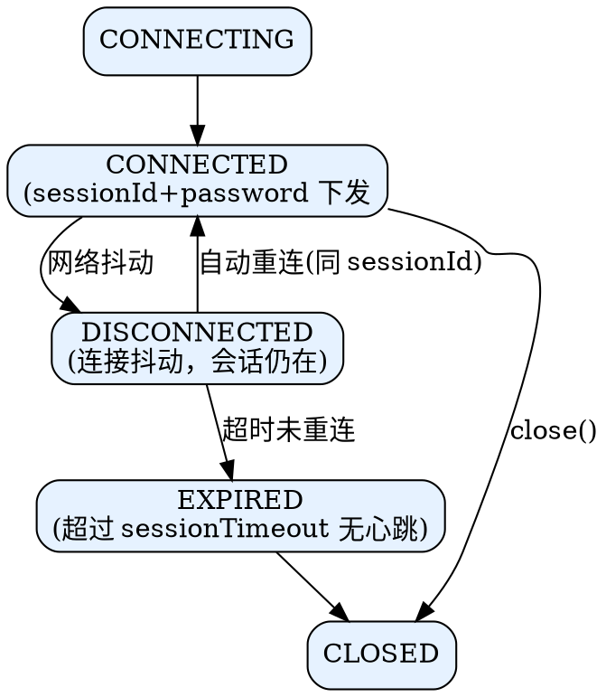

## Introduction

ZooKeeper 的 Java 客户端是 `org.apache.zookeeper.ZooKeeper`：它线程安全、内部用一条 `SendThread` 维护与某个服务端的长连接，所有 API 调用都经 `ClientCnxn` 异步发包、用 `Watcher` / `Callback` 回调结果。相比 etcd 的 gRPC 客户端，ZK 客户端有几个"反直觉"处：**Watcher 一次性触发**、**连接丢失可重试而会话过期不可重试**、**读默认非强一致需靠 watch 缓存或 sync()**。

本篇覆盖连接串与 chroot、会话生命周期、Watcher 语义、异常分类与重试策略、ACL 设置、Jute 序列化与最佳实践。更上层的配方（锁 / 选主 / 屏障）直接用 Curator，见 [Curipes](/docs/CS/Framework/ZooKeeper/Recipes.md) 与 [Curator](/docs/CS/Framework/ZooKeeper/Curator.md)；服务端请求如何流动见 [pipeline](/docs/CS/Framework/ZooKeeper/pipeline.md)。

> [!NOTE]
> 版本基线：持久化 watch（`addWatch`，递归/标准）自 3.6.0 起；当前主线 3.9.6。客户端 3.5+ 与 3.9 服务端完全兼容。

## 连接串与 chroot

```java
ZooKeeper zk = new ZooKeeper(
    "zk1:2181,zk2:2181,zk3:2181/app",  // connectString，末尾 /app 为 chroot
    30000,                             // sessionTimeout(ms)
    new Watcher() { public void process(WatchedEvent e) { /* 默认 watcher */ } });
```

- **connectString**：逗号分隔的 `host:port` 列表。客户端随机选一个建连；断开后在新会话期内会尝试其他地址（受 `sessionTimeout` 约束）。
- **chroot**（可选，形如 `/app`）：把该客户端的所有路径自动加前缀 `/app`，实现多应用共享一个集群时的命名空间隔离，等价于"逻辑多租户"（配合 ACL 见 [security](/docs/CS/Framework/ZooKeeper/security.md)）。底层就是服务端把请求 path 拼上 chroot。

## 会话生命周期



- 建连成功后服务端下发 `sessionId` + `password`；客户端重连时携带它们即可**恢复同一会话**（临时节点不丢、watch 不丢）。
- **会话超时**：`sessionTimeout` 必须在服务端 `minSessionTimeout` ~ `maxSessionTimeout` 之间（默认 `2×tickTime` ~ `20×tickTime`）。客户端发心跳（ping）续租；若服务端在 `sessionTimeout` 内未收到任何包，判定会话过期。
- **过期后果（不可逆）**：该会话创建的 **ephemeral 节点被删除**，已注册的 watch 全部失效，客户端必须新建 `ZooKeeper` 实例。这是 `SessionExpiredException` 必须当作"致命、重建"而不是"重试"的根本原因。

## Watcher：一次性语义

ZooKeeper 的 watch 是**一次性**的——触发一次后就被注销，需重新注册才能继续接收：

```java
zk.getData("/app/config", new Watcher() {
    public void process(WatchedEvent e) {
        if (e.getType() == Event.EventType.NodeDataChanged) {
            // 重新 getData，并再次注册同一个 watcher
            byte[] d = zk.getData(e.getPath(), this, stat);  // this = 重新注册
        }
    }
}, stat);
```

`WatchedEvent` 携带 `KeeperState`（连接状态）、`EventType`（节点事件）、`getPath()`。`EventType.None` 表示是**会话状态变化**（如 `Expired` / `Disconnected`），务必在默认 watcher 里处理。

> [!WARNING]
> **一次性 watch 的"丢失窗口"**：在 `getData` 返回到 `process` 触发、再到你重新注册的间隙，若数据又变了，这一变更可能不被看到（因为旧 watch 已消费、新 watch 还没挂上）。高频变更场景必须用 **持久化 watch**：`zk.addWatch(path, watcher, AddWatchMode.PERSISTENT)`（3.6+），或标准 watch + `with(` 递归模式，避免错过事件。

读路径上的 watch 与本地读语义见 [pipeline](/docs/CS/Framework/ZooKeeper/pipeline.md)；Kleppmann 的经典文章指出一次性 watch 正是 ZooKeeper 分布式锁的脆弱点之一（见 [Recipes](/docs/CS/Framework/ZooKeeper/Recipes.md)）。

## 异常分类与重试策略

所有异常都派生自 `KeeperException`（服务端返回码）或 `IOException`（网络）。常见：

| 异常 | 含义 | 是否可重试 |
| :--- | :--- | :--- |
| `ConnectionLossException` | 请求发出后连接断了，不知道服务端有没有执行 | **可重试**（需幂等校验） |
| `SessionExpiredException` | 会话已过期，必须重建实例 | 不可重试（重建） |
| `NoNodeException` | 节点不存在（顺序依赖） | 视业务 |
| `NodeExistsException` | 节点已存在（create 竞态） | 视为成功 |
| `BadVersionException` | 乐观锁版本不匹配 | 不可重试（需重读） |
| `AuthFailedException` | 认证失败 | 不可重试（检查 ACL/身份） |

重试要点：

- **ConnectionLoss**：网络层抖动导致"结果未知"。ZooKeeper 客户端会自动重连，但**单个 API 调用不会自动重放**——应用需根据自身幂等性决定是否重发。例如 `create` 重发前应先 `exists` 确认是否已被创建（`NodeExistsException` 可当成功）。
- **SessionExpired**：不是重试能解决的，必须 `new ZooKeeper(...)` 重建会话，并重新 `addAuthInfo`、重新注册 watch。
- Curator 的 `RetryNTimes` / `RetryUntilElapsed` / `ExponentialBackoffRetry` 已封装了 `ConnectionLoss` 的安全重试与幂等判断，强烈建议直接用 Curator 而非裸客户端。

## ACL 与认证

```java
zk.addAuthInfo("digest", "alice:secret".getBytes());      // 注入身份
zk.create("/app/secrets", data,
    ZooDefs.Ids.CREATOR_ALL_ACL, CreateMode.PERSISTENT);   // 创建者获全权
```

- 详见节点级 ACL 的 scheme 与权限位：[security](/docs/CS/Framework/ZooKeeper/security.md)。
- 注意：`delete` 权限在**父节点**，不意外的"删不掉子节点"多因父节点缺 `d` 位。

## Jute 序列化

ZooKeeper 的线格式与磁盘格式都用自研的 **Jute**（源自 Hadoop）：记录实现 `org.apache.jute.Record`，经 `OutputArchive` / `InputArchive`（`BinaryInputArchive` / `BinaryOutputArchive` 等）序列化。请求体、事务体、快照都靠它编解码——这也是 ZK 协议"难用 curl 直接调试"的原因（对比 etcd 的 protobuf/gRPC，见 [与 etcd 对照](/docs/CS/Framework/ZooKeeper/ZooKeeper.md?id=与-etcd-对照)）。深入见 [Jute](/docs/CS/Framework/ZooKeeper/Jute.md)。

## 最佳实践

- **每进程一个 `ZooKeeper` 实例**：客户端内部线程安全且自带连接池语义，不要每次调用 new 一个——会刷爆会话与连接数（看 [monitoring](/docs/CS/Framework/ZooKeeper/monitoring.md) 的 `zk_num_alive_connections`）。
- **统一在默认 Watcher 处理会话状态**：`Expired` / `Disconnected` / `AuthFailed` 必须有兜底，否则 watch 静默失效你还以为在监听。
- **高频 watch 用 `addWatch` 持久化**（3.6+），避免一次性 watch 的丢失窗口。
- **sessionTimeout 别设太短**：GC 停顿 / 网络抖动易触发 `Expired`；但也别太长，过期节点清理慢。
- **写路径用 Curator 配方**：锁 / 选主 / 屏障见 [Recipes](/docs/CS/Framework/ZooKeeper/Recipes.md)，不要自己手写 ephemeral 顺序节点逻辑（坑多）。
- **读写分离意识**：读本地快但非强一致；要强一致先 `sync()`，或用 watch 缓存 + 变更回调。

## Links

- [ZooKeeper（架构与数据模型）](/docs/CS/Framework/ZooKeeper/ZooKeeper.md)
- [请求处理器链 pipeline](/docs/CS/Framework/ZooKeeper/pipeline.md)
- [安全 security](/docs/CS/Framework/ZooKeeper/security.md)
- [Recipes（协调原语）](/docs/CS/Framework/ZooKeeper/Recipes.md)
- [Curator](/docs/CS/Framework/ZooKeeper/Curator.md)
- [Jute（序列化）](/docs/CS/Framework/ZooKeeper/Jute.md)

## References

1. [ZooKeeper Programmer's Guide](https://zookeeper.apache.org/doc/current/zookeeperProgrammers.html)
2. [ZooKeeper Java Client API](https://zookeeper.apache.org/doc/current/apidocs/)
3. [How to do distributed locking (Kleppmann)](https://martin.kleppmann.com/2016/02/08/how-to-do-distributed-locking.html)
