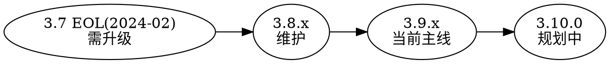

## Introduction

ZooKeeper 集群（ensemble）是"奇数个投票节点（peer）+ 可选 Observer"的主备复制组。它的运维要点与 etcd 的 quorum 集群高度相似，但有几个 ZK 特有概念：**Observer（不参与投票的只读扩展）**、**动态重配置（reconfig）**、**chroot 多租户**、以及把快照与日志分离放置。本篇覆盖规模规划、quorum 数学、Observer、动态重配置、滚动升级、备份恢复与关键超时参数。共识与日志复制见 [Zab](/docs/CS/Framework/ZooKeeper/Zab.md)，快照/日志存储见 [storage](/docs/CS/Framework/ZooKeeper/storage.md)，告警见 [monitoring](/docs/CS/Framework/ZooKeeper/monitoring.md)。

> [!NOTE]
> 版本基线：动态重配置自 3.5.0，但 **3.5.3 起默认关闭**（`reconfigEnabled=false`）；当前主线 3.9.6，维护线 3.9.x / 3.8.x，3.7 已于 2024-02 EOL。

## 集群规模与 quorum 数学

ZooKeeper 用**多数派（quorum）**做容错：写入需被超过半数投票节点确认。因此节点数取奇数 `2n+1`，能容忍 `n` 个失效：

| 节点数 | 容忍失效 | 备注 |
| :--- | :--- | :--- |
| 1 | 0 | 单机/测试，无容错 |
| 3 | 1 | 最小生产集群 |
| 5 | 2 | 常见生产（允许 1 台维护 + 1 台故障） |
| 7 | 3 | 大规模，写延迟略升 |

> [!WARNING]
> 不要部署偶数个投票节点（如 4 个）：容忍失效数仍是 1，却多了一台写开销，毫无收益。读可扩展靠 **Observer**，不是加投票节点。

## Observer：跨 DC 只读扩展

Observer 是**不参与投票**的 learner——它接收 Leader 的 PROPOSAL/COMMIT 来保持数据最新，但**不回 ACK、不计入 quorum**。典型用途：

- 跨机房部署只读副本，降低写延迟对远距离节点的依赖。
- 横向扩展读能力而不增加 quorum 规模（不牺牲写性能）。

配置：在 `zoo.cfg` 的 `server.x` 行加 `:observer`，并设置 `peerType=observer`：

```properties
server.1=zk1:2888:3888
server.2=zk2:2888:3888
server.3=zk3:2888:3888
server.4=zk4:2888:3888:observer
```

请求链路见 [pipeline](/docs/CS/Framework/ZooKeeper/pipeline.md?id=follower--observer-侧链路)。

## 动态重配置 reconfig

3.5 之前成员变更只能"滚动重启 + 改静态配置"，易出错甚至丢数据。动态重配置允许**运行时增删成员、不改静态文件、不重启**：

- 开启：`reconfigEnabled=true`（3.5.3+ 默认关）。
- 多成员变更需 `standaloneEnabled=false`（允许 ensemble 规模动态变化）。
- 客户端用 `reconfig()` API 做增量（`add/remove`）或全量重配置；变更经 Zab 提交后集群即时生效。
- 关键约束：**重配置过程中必须始终保留一个 quorum 的投票成员在线**，否则会丢 Leader、进入只读（见 [troubleshooting](/docs/CS/Framework/ZooKeeper/troubleshooting.md)）。

## 滚动升级与版本线



- **支持线**：社区同时维护两条——当前主线 3.9.x 与维护线 3.8.x；3.7 已 EOL，不再收补丁/CVE。
- **兼容**：客户端 3.5.x+ 与 3.9 服务端完全兼容；滚动升级时只要不启用新特性，quorum 全程可用。
- **建议路径**：3.7 → 3.8.x → 3.9.x。升级前读对应版本的 Release Notes（3.9.0 引入 TLS 动态加载、AdminServer 快照 API 等）。
- 升级中若启用动态重配置，先确认 `reconfigEnabled`。

## 备份与恢复

ZooKeeper 的"备份"就是**快照 + 其后事务日志**：

- 在线：拷贝 `dataDir`（快照）与 `dataLogDir`（TxnLog）到异地；或利用 3.9 的 AdminServer 快照流式 API。
- 离线：停服后整目录拷贝最稳妥。
- 恢复：把备份文件放回 `dataDir` / `dataLogDir`，启动后走"最新快照 + 日志 replay"自动还原（见 [storage](/docs/CS/Framework/ZooKeeper/storage.md) 的恢复流程）。
- 工具：`zkCopy`（跨集群复制）、`zkCli` 导出；损坏检查用 `zkTxnLogToolkit.sh` / `zkSnapShotToolkit.sh`（见 [troubleshooting](/docs/CS/Framework/ZooKeeper/troubleshooting.md)）。

> [!TIP]
> 备份频率取决于 RPO 容忍度。由于恢复会 replay 快照之后的全部日志，**保留的日志越旧，恢复越慢**——备份窗口与 `snapCount` 调参要联动考虑。

## 关键超时参数

| 参数 | 含义 | 默认 |
| :--- | :--- | :--- |
| `tickTime` | 心跳基准（ms） | 2000 |
| `initLimit` |  follower 初始同步 Leader 的 tick 上限 | 10（=20s） |
| `syncLimit` | follower 与 Leader 心跳超时的 tick 上限 | 5（=10s） |
| `minSessionTimeout` / `maxSessionTimeout` | 会话超时区间（= tickTime×2 ~ ×20） | 4000 ~ 40000 |
| `clientPort` | 客户端端口 | 2181 |
| `secureClientPort` | TLS 客户端端口（3.9+） | 2182 |
| `admin.serverPort` | AdminServer HTTP | 8080 |

`syncLimit` 过小会在 GC / 网络抖动时误判 follower 掉线、诱发 leader 切换（见 [troubleshooting](/docs/CS/Framework/ZooKeeper/troubleshooting.md) 的 flapping）。

## chroot：共享集群多租户

同一 ensemble 上可按 `connectString` 末尾的 `/app` 前缀做命名空间隔离（见 [client](/docs/CS/Framework/ZooKeeper/client.md?id=连接串与-chroot)），配合 [security](/docs/CS/Framework/ZooKeeper/security.md) 的 ACL 实现多应用共享一个集群的逻辑隔离，降低运维成本。

## Links

- [ZooKeeper（架构与数据模型）](/docs/CS/Framework/ZooKeeper/ZooKeeper.md)
- [Zab（共识与日志复制）](/docs/CS/Framework/ZooKeeper/Zab.md)
- [存储层 storage](/docs/CS/Framework/ZooKeeper/storage.md)
- [请求处理器链 pipeline](/docs/CS/Framework/ZooKeeper/pipeline.md)
- [安全 security](/docs/CS/Framework/ZooKeeper/security.md)
- [客户端 client](/docs/CS/Framework/ZooKeeper/client.md)
- [监控 monitoring](/docs/CS/Framework/ZooKeeper/monitoring.md)
- [故障排查](/docs/CS/Framework/ZooKeeper/troubleshooting.md)

## References

1. [ZooKeeper Administrator's Guide](https://zookeeper.apache.org/doc/current/zookeeperAdmin.html)
2. [Dynamic Reconfiguration of Primary/Backup Clusters (USENIX ATC '12)](https://www.usenix.org/system/files/conference/atc12/atc12-final74.pdf)
3. [ZooKeeper 3.9.0 Release Notes](https://zookeeper.apache.org/doc/r3.9.0/releaseNotes.html)
