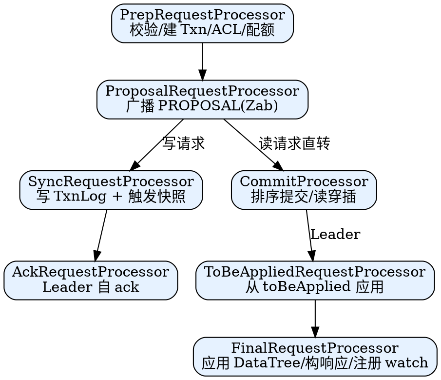
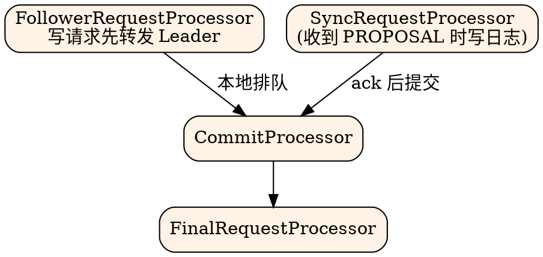
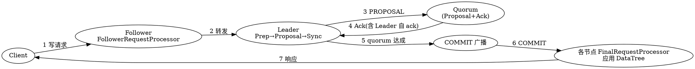
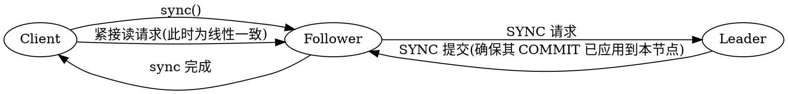

## Introduction

客户端的一个请求从 `ClientCnxn` 发到服务端后，会经过一串 **RequestProcessor** 流水线才最终落到内存的 `DataTree`。理解这条链路，才能讲清 ZooKeeper 两个最常被误解的特性：**读请求在任意节点本地完成（快但不一定线性一致）**，以及 **写请求必须经由 Leader 走 Zab 达成 quorum 后才提交**。

本篇梳理 Leader / Follower / Observer 三种角色各自的 RequestProcessor 链，以及一次读、一次写、一次 `sync()` 的完整包流向。共识细节（PROPOSAL/COMMIT 如何广播）见 [Zab](/docs/CS/Framework/ZooKeeper/Zab.md)；落盘与快照见 [storage](/docs/CS/Framework/ZooKeeper/storage.md)；客户端如何感知这些语义见 [client](/docs/CS/Framework/ZooKeeper/client.md)。

> [!NOTE]
> 本文类名对应 `zookeeper-server/.../server/quorum/` 与 `.../server/`，当前主线 3.9.6 仍保持这一链路结构。

## RequestProcessor Interface

所有处理器实现同一个接口：

```java
public interface RequestProcessor {
    void processRequest(Request request) throws RequestProcessorException;
    void shutdown();
}
```

每个处理器通常是一个独立线程，靠阻塞队列串联（`requestThrottler` 还会在前端做限流）。请求在处理器间以 `Request` 对象传递，携带 `zxid`、`type`、`cxid`、`sessionId` 等。

## Leader Side Chain



1. **PrepRequestProcessor**：做预处理——权限校验（ACL）、构造事务体（`Txn`）、配额检查、把会话/ watch 元数据补到请求上。它是唯一在 Leader 上对所有请求做 ACL 检查的地方。
2. **ProposalRequestProcessor**：
   - 对**写请求**：调用 `leader.propose()` 把事务通过 Zab 广播给全体投票成员，同时把请求交给 `SyncRequestProcessor` 持久化；并挂一个 `AckRequestProcessor` 让 Leader 自己对自己发 ack。
   - 对**读请求（非事务）**：直接转发给 `CommitProcessor`，不经过 Zab。
3. **SyncRequestProcessor**：把事务追加到 `FileTxnLog`，命中 `shouldSnapshot()` 时物化快照（见 [storage](/docs/CS/Framework/ZooKeeper/storage.md)）。
4. **AckRequestProcessor**（仅 Leader）：模拟一个投票者，给 Leader 回 ack，使 Leader 在达到 quorum 时不漏算自己。
5. **CommitProcessor**：按顺序提交——保证同一会话的写请求按序生效，并在"前面没有待提交写"时才放行读请求，避免读到落后于已提交写的状态。
6. **ToBeAppliedRequestProcessor**（仅 Leader）：从 `leader.toBeApplied` 队列取出已提交事务，应用到 `ZKDatabase`，再交给 `FinalRequestProcessor`。
7. **FinalRequestProcessor**：真正改 `DataTree`、构造响应、按请求注册 watch、把响应发回。

## Follower / Observer Side Chain



- **FollowerRequestProcessor**：对写请求，先转发给 Leader（由 Leader 走完整提案流程），同时把请求放进 `CommitProcessor` 队列，待收到 Leader 的 COMMIT 后才真正处理；对读请求直接进 `CommitProcessor`。
- Follower 收到 Leader 的 PROPOSAL 时由自己的 `SyncRequestProcessor` 写日志并回 ACK；收到 COMMIT 后 `CommitProcessor` 放行到 `FinalRequestProcessor`。
- **Observer** 用 `ObserverRequestProcessor`，链路同 Follower 但不参与投票（不回 ACK、不出现在 quorum 计算中），用于跨 DC 只读扩展（见 [cluster](/docs/CS/Framework/ZooKeeper/cluster.md)）。

## Complete Path of a Write Request



1. 客户端把写请求发给任一节点（通常是 Follower）。
2. Follower 转给 Leader；Leader 的 `PrepRequestProcessor` → `ProposalRequestProcessor` 把事务通过 Zab 广播。
3. 各投票节点 `SyncRequestProcessor` 写 TxnLog 并回 ACK。
4. Leader 收到 quorum 的 ACK（含自己的 `AckRequestProcessor`）即认为提交。
5. Leader 广播 COMMIT；各节点 `CommitProcessor` 放行到 `FinalRequestProcessor` 应用，响应客户端。

**写必须过 Leader 且经 quorum**：这是 Zab "原子广播" 的本质，也是 ZooKeeper 写吞吐低于"多主可写"类系统的原因。

## Read Path and sync() Linearizable Read

读请求（exists / getData / getChildren）**不走 Zab**，在本节点 `CommitProcessor → FinalRequestProcessor` 直接从内存 `DataTree` 返回：

- 优点：**任意节点本地读，延迟极低、可水平扩展读**。
- 代价：**默认不保证线性一致**——若本节点落后于 Leader 的最新提交，会读到旧值。

保证读到"已提交最新状态"需显式 `sync()`：



`sync()` 本身是一条会经 Zab 提交的空写，强制本节点先 apply 到 Leader 已提交的最新 zxid，之后的读即线性一致。但 `sync()` 不是默认行为——客户端缓存 + watch 才是 ZooKeeper 扛读的主流手段（见 [client](/docs/CS/Framework/ZooKeeper/client.md) 的 watch 一节）。这与 etcd 默认 `ReadIndex` 线性读（见 [etcd read](/docs/CS/Framework/etcd/read.md)）形成对照。

## ReadOnlyRequestProcessor and Read-Only Mode

当集群失去 quorum 或处于维护期，存活节点进入**只读模式**（`ReadOnlyRequestProcessor` 接管），只接受读、拒绝写，并打 `will be dropped if server is in read-only mode` 日志。这是 ZooKeeper 在分区下的"保护式降级"——宁可不写，也不在无法确认 quorum 时写，避免脑裂造成不一致（排查见 [troubleshooting](/docs/CS/Framework/ZooKeeper/troubleshooting.md)）。

## Links

- [ZooKeeper（架构与数据模型）](/docs/CS/Framework/ZooKeeper/ZooKeeper.md)
- [Zab（共识与日志复制）](/docs/CS/Framework/ZooKeeper/Zab.md)
- [存储层 storage](/docs/CS/Framework/ZooKeeper/storage.md)
- [客户端 client](/docs/CS/Framework/ZooKeeper/client.md)
- [故障排查](/docs/CS/Framework/ZooKeeper/troubleshooting.md)

## References

1. [ZooKeeper Source: RequestProcessor](https://github.com/apache/zookeeper/tree/master/zookeeper-server/src/main/java/org/apache/zookeeper/server/quorum)
2. [ZooKeeper Internals](https://zookeeper.apache.org/doc/current/zookeeperInternals.html)
3. [Zab: High-performance broadcast for primary-backup systems](https://www.usenix.org/legacy/event/atc10/tech/full_papers/Hunt.pdf)
