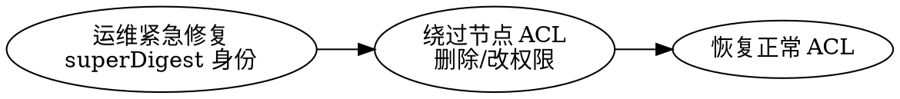

## Introduction

ZooKeeper 的安全分三层：**ACL（节点级授权）**、**认证（客户端身份如何证明）**、**传输安全（SASL / TLS）**。它不像 etcd 那样有 RBAC + mTLS 的一站式模型，而是把"谁能访问哪个 znode"拆成 scheme:id:permission 的细粒度 ACL，把"身份从哪来"交给 digest / IP / SASL 等多种 scheme，把"链路加密"长期依赖 SASL，直到 3.9 才补齐 TLS 的动态加载。

本篇覆盖 ACL 的 scheme 与权限位、如何 `addAuthInfo`、SASL（Kerberos）、TLS（含 3.9 的动态 keystore 重加载）、AdminServer 安全与应急 superDigest。横向对比 etcd 的 RBAC/mTLS 见 [与 etcd 对照](/docs/CS/Framework/ZooKeeper/ZooKeeper.md?id=与-etcd-对照)；客户端如何设置 ACL 见 [client](/docs/CS/Framework/ZooKeeper/client.md)。

> [!NOTE]
> 版本基线：TLS 动态加载 keystore/truststore 自 3.9.0 起；`secureClientPort`（默认 2182）、`secureAdminServerPort`；当前主线 3.9.6。

## ACL 模型：scheme:id:permission

每个 znode 上挂着一组 ACL 项，格式为 `scheme:id:permission`。访问时服务器用"请求携带的身份"去匹配对应 scheme 的 id，并校验权限位。

### scheme（身份来源）

| scheme | id 含义 | 说明 |
| :--- | :--- | :--- |
| `world` | `anyone` | 默认，任何人都有 `cdrwa` |
| `auth` | 空（用当前已认证身份） | 匹配"已通过任意 scheme 认证的用户" |
| `digest` | `user:base64(sha1(user:password))` | 最常用，用户名+口令摘要 |
| `ip` | `host` 或 `CIDR` | 按客户端 IP 授权 |
| `sasl` | Kerberos principal | 与 SASL 认证配合 |
| `super` | superDigest 对应身份 | 超级用户，绕过 ACL（应急用） |
| `x509` | 客户端证书主体 | 配合 TLS 客户端认证（3.9+） |

### permission（权限位）

`c r w d a` 五位，合起来即 `cdrwa`：

- `c` create：创建子节点
- `r` read：读取本节点数据与子节点列表
- `w` write：写入（setData）
- `d` delete：删除本节点（注意：删子节点的权限在**父节点**的 `d` 位，不是子节点自身）
- `a` admin：设置 ACL

> [!WARNING]
> ZooKeeper 的 ACL 是**节点级、不继承**的：子节点不会自动获得父节点的 ACL，创建子节点时若不带 ACL 则采用 `world:anyone:cdrwa`（除非父节点设了 `CREATOR_ALL_ACL` 策略）。这是"误配导致裸奔"的高发点——务必在创建关键节点时显式带 ACL。

## 认证：addAuthInfo

客户端在连接后用 `addAuthInfo(scheme, auth)` 注入身份；可多次调用叠加多个 scheme。以 digest 为例：

```java
zk.addAuthInfo("digest", "alice:secret".getBytes());
zk.create("/app/config", data,
    ZooDefs.Ids.CREATOR_ALL_ACL,  // 创建者获得全部权限
    CreateMode.PERSISTENT);
```

- `digest` 的 id 是 `user:base64(sha1(user:password))`，可用 `org.apache.zookeeper.server.auth.DigestAuthenticationProvider` 计算。
- 口令只在认证握手中传输（建议配合 TLS/SASL 加密链路），不持久化明文。
- 会话级：认证信息绑定当前会话，会话失效需重新 `addAuthInfo`。

## SASL：Kerberos 集成

ZooKeeper 原生支持 SASL，常用于 Hadoop / Kafka 等 Kerberos 环境：

- 客户端：`zookeeper.sasl.client=true` + JAAS 配置（`ZooKeeperClient` login），走 `ZooKeeperSaslClient` 完成 GSSAPI 握手，身份为 Kerberos principal。
- 服务端：`zookeeper.sasl.serverconfig` 指向服务端 JAAS，`jaasLoginRenew` 控制票据续期。
- 节点 ACL 用 `sasl:<principal>` 授权，实现"哪个 Kerberos 主体能访问哪个 znode"。

## TLS：3.9 起补齐传输加密

在 3.9 之前，ZooKeeper 没有原生的 TLS，链路加密只能靠 SASL（GSSAPI）或外部隧道（stunnel / 业务侧 mTLS）。3.9.0 引入：

- **secureClientPort**（默认 2182）：启用 TLS 的客户端端口，与明文 2181 并存。
- **secureAdminServerPort**：AdminServer 的 TLS 端口。
- **动态加载**：keystore / truststore 变更后无需重启即可热加载（`ZooKeeperServer` 监听文件 mtime），对应 3.9 的 "TLS — dynamic loading for client trust/key store"。
- Netty 传输层支持 SSL；客户端用 `zookeeper.client.secure` 与对应 ssl 配置连 secureClientPort。
- 客户端证书可用 `x509` scheme 做 ACL 授权（3.9+）。

> [!TIP]
> 生产建议：明文 2181 仅内网管控面使用，**对外/client 走 secureClientPort + `x509` ACL**，避免口令与数据在链路上暴露。3.9 之前的老版本只能靠 SASL 或运维层网络隔离兜底。

## superDigest：应急超级用户

`zookeeper.DigestAuthenticationProvider.superDigest` 配置一个 `super:base64(sha1(super:password))`。持有该身份的连接拥有**绕过一切 ACL** 的权限，用于 ACL 配错导致锁死时的应急修复。



> [!WARNING]
> superDigest 等同 root，必须存于安全的运维配置、绝不进代码仓库；一旦泄露可任意篡改集群数据。

## AdminServer 安全

`AdminServer` 默认在 `8080` 暴露 HTTP 管理接口（含 3.9 的 snapshot 流式 API），需收紧：

- `admin.enableServer=false` 可整体关闭。
- `admin.serverInetAddress` 绑定到管理网段，避免 0.0.0.0 暴露。
- 配合防火墙仅放行运维网段；快照接口会泄露数据，尤其要限制。

## 与 etcd 的安全对照

| 维度 | ZooKeeper | etcd |
| :--- | :--- | :--- |
| 授权模型 | 节点级 ACL（scheme:id:permission） | 集群级 RBAC（角色+用户） |
| 身份来源 | digest / ip / sasl / x509 / super | 客户端证书 / 用户名密码 |
| 链路加密 | SASL 历史为主，3.9 起 TLS | 内置 mTLS（早且成熟） |
| 超级权限 | superDigest | root 角色 |
| 多租户隔离 | 靠 chroot + ACL | 靠 auth token 范围 |

etcd 的 RBAC 是"集群级、角色化"，更适合多团队共享；ZooKeeper 的 ACL 是"节点级、scheme 多元"，粒度更细但运维更繁琐，且历史上是 Java 生态（Hadoop/Kafka）内安全，跨生态的 mTLS 长期薄弱。

## Links

- [ZooKeeper（架构与数据模型）](/docs/CS/Framework/ZooKeeper/ZooKeeper.md)
- [客户端 client](/docs/CS/Framework/ZooKeeper/client.md)
- [集群运维 cluster](/docs/CS/Framework/ZooKeeper/cluster.md)
- [故障排查](/docs/CS/Framework/ZooKeeper/troubleshooting.md)
- [etcd 横向对照](/docs/CS/Framework/etcd/compare.md)

## References

1. [ZooKeeper Programmer's Guide: Access Control](https://zookeeper.apache.org/doc/current/zookeeperProgrammers.html#sc_ZooKeeperAccessControl)
2. [ZooKeeper 3.9.0 Release Notes (TLS dynamic loading)](https://zookeeper.apache.org/doc/r3.9.0/releaseNotes.html)
3. [ZooKeeper Administrator's Guide: Authentication](https://zookeeper.apache.org/doc/current/zookeeperAdmin.html#sc_auth)
