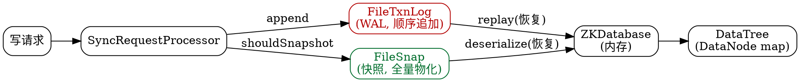
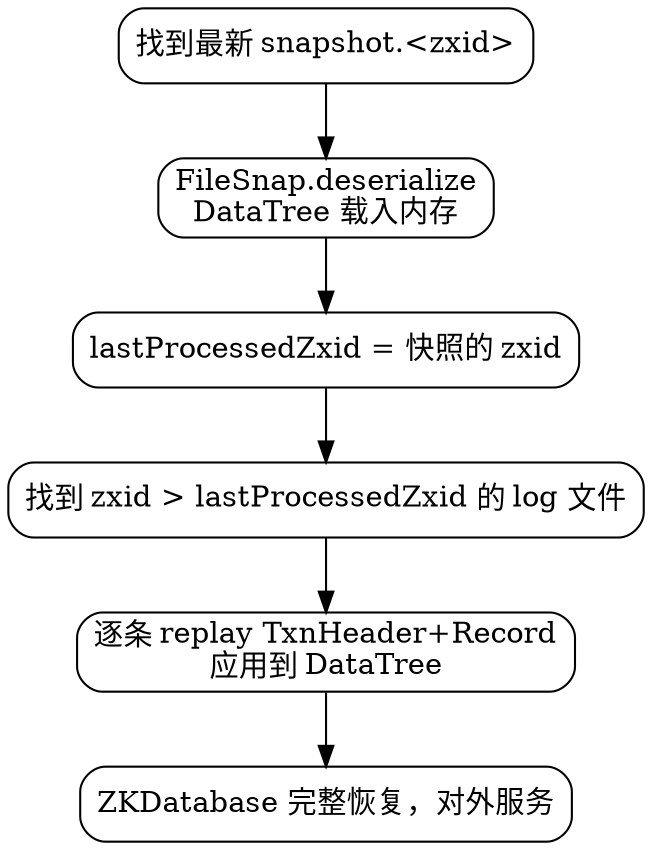

## Introduction

ZooKeeper 的所有写操作都先落 **事务日志（TxnLog，WAL）**，再周期性地物化 **快照（SnapShot）**，二者配合在重启时恢复出完整的内存数据树（DataTree）。这套机制与 etcd 的 boltdb、Redis 的 RDB+AOF 思路一致，但 ZooKeeper 把"全量内存 + WAL + 快照"三者耦合得更紧：服务器把整棵 znode 树常驻内存，磁盘只是持久化与恢复的副产物。

本篇聚焦磁盘侧的存储引擎——`FileTxnLog` / `FileSnap` / `FileTxnSnapLog` 以及内存侧的 `ZKDatabase` / `DataTree` / `DataNode`，并解释 zxid 的构成、快照触发条件与启动恢复流程。共识层为何把这些事务广播出去，见 [Zab](/docs/CS/Framework/ZooKeeper/Zab.md)；一次写请求如何流经各处理器并最终落到这里，见 [pipeline](/docs/CS/Framework/ZooKeeper/pipeline.md)。

> [!NOTE]
> 版本基线：事务日志的 Adler-32 校验和在 3.4.x 已默认开启；快照文件头含 `count` 字段（3.6+）；当前主线 3.9.6，维护线 3.9.x / 3.8.x，3.7 已 EOL。

## Overall Structure



- **TxnLog**：接口，磁盘实现 `FileTxnLog`。顺序追加的 WAL，一个事务一条记录，是持久化的"真相来源"。
- **SnapShot**：接口，磁盘实现 `FileSnap`。某一时刻 DataTree 的全量物化，加速重启。
- **FileTxnSnapLog**：同时持有 TxnLog 与 SnapShot 的适配层，被 `ZKDatabase` 持有。
- **ZKDatabase**：内存数据库，持有 `DataTree`（znode 树）、会话超时表与 `lastProcessedZxid`。

## zxid: Unique Transaction Sequence Number

每个事务都带一个 64 位 `zxid = epoch(高 32 位) + counter(低 32 位)`：

- **epoch**：Leader 任期号，每次新 Leader 选举产生会自增（`currentEpoch` 文件持久化）。它让旧 Leader 的提案不会在新任期被误接受。
- **counter**：当前任期内的单调递增计数器。

zxid 同时是**快照与日志文件命名的依据**，也是数据一致性的全局版本号——客户端 `sync()` 后读到的是"已提交且 zxid 最大"的状态。DataNode 的 `Stat` 里 `czxid` / `mzxid` / `pzxid` 记录了创建、修改、子节点变更对应的 zxid。

## Transaction Log FileTxnLog

`FileTxnLog` 位于 `zookeeper-server/.../server/persistence/`，在 `dataLogDir` 下写入 `log.<zxid>` 文件，文件名中的 zxid 是**该文件第一条事务的 zxid**。

每条事务在磁盘上的布局（由 `TxnLog` 格式约定）：

```
+---------------------------------------------------------------+
| TxnHeader: clientId | cxid | zxid | time | type              |  <- Jute 序列化
+---------------------------------------------------------------+
| Record(body): 具体事务负载，如 CreateTxn / SetDataTxn / ...   |  <- Jute 序列化
+---------------------------------------------------------------+
| checksum: Adler-32(long)，覆盖前面所有字节                    |
+---------------------------------------------------------------+
```

要点：

- **顺序追加 + `forceSync`**：`SyncRequestProcessor` 默认在返回客户端响应前把事务刷盘（`forceSync=yes`，调用 `fsync`），这正是 ZooKeeper 写吞吐受事务日志磁盘 I/O 约束的根因——因此官方建议把 `dataLogDir` 挂到独立磁盘。
- **预分配**：最后一个日志文件按 `preAllocSize`（默认 64KB）预先 `preallocate`，减少文件系统元数据开销。
- **滚动**：当 `shouldRoll()` 命中（文件大小超过阈值或跨 epoch）时换新文件。
- **校验**：默认开启 Adler-32，读取时若校验失败会报日志损坏，可用 `zkTxnLogToolkit.sh` 检查/修复。

> [!WARNING]
> 不要把 `dataLogDir` 和放快照的 `dataDir` 放在同一块盘上。事务日志的写延迟直接决定集群写吞吐；快照生成与日志写入争抢 I/O 会让 P99 延迟陡增。

## Snapshot FileSnap

`FileSnap` 在 `dataDir` 下写入 `snapshot.<zxid>`，文件名中的 zxid 是**该快照包含的最后一条事务的 zxid**。文件内含：

1. `FileHeader`：`magic` / `version` / `dbId` / `count`（3.6+ 记录节点数，用于快速校验）。
2. 序列化的 `DataTree`：所有 `DataNode`（path → data、acl、stat、children）、ACL 字典（去重后的 `ACL` 列表）、以及会话超时表。
3. 末尾 Adler-32 校验和。

快照是**模糊快照（fuzzy snapshot）**：生成期间仍有写请求落到内存树，因此快照内容对应的是"某一瞬间的近似值"，但配合其后 replay 的日志即可还原到精确状态。

## Snapshot Trigger: shouldSnapshot

`SyncRequestProcessor.shouldSnapshot()` 决定何时物化快照（见 [ZooKeeper](/docs/CS/Framework/ZooKeeper/ZooKeeper.md) 的 `Issues` 段源码）：

```java
private boolean shouldSnapshot() {
    int logCount = zks.getZKDatabase().getTxnCount();
    long logSize = zks.getZKDatabase().getTxnSize();
    return (logCount > (snapCount / 2 + randRoll))
           || (snapSizeInBytes > 0 && logSize > (snapSizeInKB / 2 + randSize));
}
```

- `snapCount`（`zookeeper.snapCount`，默认 100000）：当事务数超过 `snapCount/2 + randRoll`（随机抖动，避免集群同时打快照）时触发。
- `snapSizeLimitInKb`（`zookeeper.snapSizeLimitInKb`，3.6+）：按事务日志体积触发，默认 4GB。
- `randRoll` / `randSize`：随机量，`(0, 阈值/2)`，打散各节点快照时机。

触发快照的另外两类场景：节点启动加载完数据、集群产生新 Leader。

**调大 `snapCount` / `snapSizeLimitInKb`** 能降低快照频率，但会让重启时 replay 的日志变长、恢复变慢——这是"写入频率 vs 恢复时间"的权衡。

## In-Memory Data Tree ZKDatabase / DataTree / DataNode

`ZKDatabase`（内存）是服务器的"实时状态"，所有读请求直接打这里：

- **DataTree**：`ConcurrentHashMap<String, DataNode> nodes`（path → DataNode），`ephemerals`（sessionId → 该会话的临时节点集合），ACL 前缀树 `pTrie`。
- **DataNode**：`byte[] data`、`Long acl`、`StatPersisted stat`、`Set<String> children`（排序的有序集合）。
- **sessionsWithTimeouts**：`sessionId → timeout`，用于会话恢复后重建。
- **lastProcessedZxid**：已应用到内存的最新事务号，恢复时作为日志 replay 的起点。

ZooKeeper 把整棵树常驻内存，因此**数据量受 JVM 堆上限约束（GB 级）**——这是它与 etcd（boltdb 仅缓存热数据、可存 TB 级）最本质的容量差异（对比见 [与 etcd 对照](/docs/CS/Framework/ZooKeeper/ZooKeeper.md?id=comparison-with-etcd)）。

## Startup Recovery Flow

服务器 `loadData()` 的双阶段恢复，等价于"快照打底 + 日志增量 replay"：



1. 选定 `dataDir` 中 zxid 最大的快照文件，反序列化为 DataTree，把 `lastProcessedZxid` 设为快照 zxid。
2. 扫描 `dataLogDir` 中 zxid 大于该值的日志文件，按序 replay 每条事务到内存树。
3. 恢复完成，进入选举/同步阶段。

> [!TIP]
> 因为恢复靠"最新快照 + 其后的日志"，所以 `autopurge` 清理旧文件时**绝不能只删日志不删快照**——保留的快照必须与其后的日志配套，否则会丢数据。清理策略见 [troubleshooting](/docs/CS/Framework/ZooKeeper/troubleshooting.md)。

## Operations-Related Parameters

| 参数 | 含义 | 默认 |
| :--- | :--- | :--- |
| `dataDir` | 快照存放目录（也放 `myid`、`currentEpoch`） | — |
| `dataLogDir` | 事务日志目录，建议独立磁盘 | 同 `dataDir` |
| `snapCount` | 触发快照的事务数阈值 | 100000 |
| `snapSizeLimitInKb` | 触发快照的日志体积阈值（3.6+） | 4194304 KB |
| `preAllocSize` | 日志文件预分配大小 | 65536 KB |
| `forceSync` | 每条事务是否 fsync | yes |
| `autopurge.snapRetainCount` | 保留的快照/日志文件数 | 3 |
| `autopurge.purgeInterval` | 自动清理间隔（小时，0=关） | 0 |

## Links

- [ZooKeeper（架构与数据模型）](/docs/CS/Framework/ZooKeeper/ZooKeeper.md)
- [Zab（共识与日志复制）](/docs/CS/Framework/ZooKeeper/Zab.md)
- [请求处理器链 pipeline](/docs/CS/Framework/ZooKeeper/pipeline.md)
- [故障排查](/docs/CS/Framework/ZooKeeper/troubleshooting.md)
- [集群运维 cluster](/docs/CS/Framework/ZooKeeper/cluster.md)

## References

1. [ZooKeeper Internals: File Tx Log](https://zookeeper.apache.org/doc/current/zookeeperInternals.html)
2. [Recovery in ZooKeeper](https://zookeeper.apache.org/doc/r3.9.0/zookeeperAdmin.html#sc_maintenance)
3. [ZooKeeper: Wait-free coordination for Internet-scale systems](https://www.usenix.org/legacy/event/atc10/tech/full_papers/Hunt.pdf)
