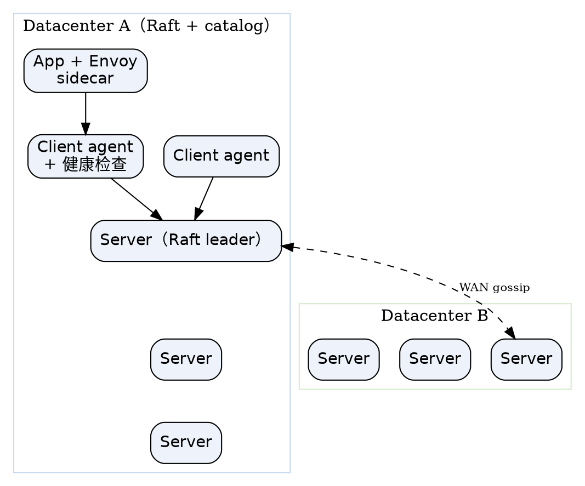

## Introduction

Consul 是 HashiCorp 出品的**服务网络平台（service networking）**：把服务发现、配置（KV）、服务网格（mTLS + 流量授权）与多数据中心联邦打包在一起。它的定位比 etcd / ZooKeeper 更"上层"——后两者是通用的强一致键值协调底座，需要业务自己封装上层；Consul 直接把"注册发现 + 安全通信 + 跨机房"做成开箱能力。完整的横向维度矩阵见 [etcd 横向对照](/docs/CS/Framework/etcd/compare.md)。

Consul 的架构分两面：**控制面（control plane）**维护一个中心化的服务注册表（服务名 → IP / 健康状态），**数据面（data plane）**里 Consul 进程本身不跑业务流量，但开启服务网格时会在每个服务旁部署 sidecar 代理（Envoy）来管理服务间的 L4 / L7 流量。

> [!NOTE]
> 版本与许可：当前主线 **2.0.4**（2026-09-09 发布；2.0 分支 2026-05-24 GA，支持至 2028-04-30），维护线 1.22.x（安全支持至 2026-10-31）/ 1.21.x；1.20 已于 2026-05 EOL。自 **1.18.0（2023-08）起改为 Business Source License（BSL）1.1**，1.17 及更早为 MPL；选型商业场景需注意许可约束（详见 [版本与许可](#版本与许可)）。HashiCorp 已于 2025-02-27 被 IBM 收购，但 Consul 的 BSL 许可模型未变。

## 版本与许可

| 项 | 值 |
| :--- | :--- |
| 当前版本 | **2.0.4**（2.0 主线，2026-05 发布） |
| 维护线 | 1.22.x / 1.21.x（1.20 已于 2026-05 EOL） |
| 许可 | **BSL（Business Source License）1.1**，自 1.18.0 起；1.17 及更早为 MPL |
| 语言 | Go（单二进制 `consul`） |
| 共识 | Raft（仅 server 参与） |
| 成员发现 | Serf gossip（LAN + WAN 两套池） |

BSL 与纯粹开源（如 etcd 的 Apache-2.0）不同：它在限定场景下对商业使用收费，但源码可见、可自部署。在"和 etcd / Nacos 对比"时，许可是 Consul 常被提及的取舍点之一。

## 架构总览

每个 Consul 节点跑一个 **agent**，agent 有两种模式：

- **Server**：参与 Raft、持有注册表状态、响应 RPC 与查询；生产建议 **3 或 5 个**（奇数，容忍 `(n-1)/2` 故障）。
- **Client**：轻量代理，把本节点服务的注册 / 健康检查 / 查询转发给 server，自身不参与 Raft；业务机器上通常跑 client。

控制面由若干 server 组成 Raft 组，维护全局目录（catalog）；数据面由 sidecar 代理承载服务间加密流量。

## 共识与成员发现（Raft + Serf）

Consul 同时用两套分布式机制，各管一摊：

- **Raft（共识）**：只在 server 之间跑，选主后所有写（注册、KV 写、ACL 变更）走 leader，follower 复制日志。状态以 **WAL（LogStore，append-only 轮转日志）+ Raft 索引**持久化在 `-data-dir`。这与 etcd 的 etcd-raft、Nacos 的 JRaft 是同类机制，但 Consul 不对外暴露线性一致读开关——KV 读默认走 Raft 一致性，目录查询则可走本地缓存（见 [服务发现](#服务发现)）。
- **Serf gossip（成员发现）**：基于 HashiCorp Serf 的 gossip 协议，负责节点加入 / 离开、故障检测、事件广播。Consul 维护**两套** gossip 池——**LAN 池**（同数据中心内）与 **WAN 池**（跨数据中心）。
- **网络坐标（network coordinates）**：Serf 顺带算出各节点的网络坐标，估算任意两节点 RTT。Consul 据此能返回**最近的服务节点**，或在故障时 failover 到下一个最近的机房——这是 etcd / ZooKeeper 没有的原生能力。
- **Autopilot**（1.4+）：自动化 Raft 运维安全，如稳定的 server 集合、平滑的 leader 转移，降低运维误操作风险。

## 数据模型

Consul 的状态由三块组成：

- **KV 存储**：Raft 强一致的键值，命令 `consul kv` / HTTP `/v1/kv`。支持 **session**（类似 etcd 的 lease）：把 key 绑到 session，session 失效（持有者宕机 / TTL 过期）后 key 自动删除——因此可实现分布式锁、leader 选举、临时键。
- **服务目录（catalog）**：services、nodes、health checks 的关系表，由 server 维护。服务注册来源有三：agent 配置文件、HTTP API、或 DNS；catalog 与"本地 agent 注册"分离（agent 挂了不影响 catalog 中已由 server 确认的服务）。
- **健康检查（health check）**：类型覆盖 `script` / `HTTP` / `TCP` / `gRPC` / `TTL`。检查失败的服务会从 DNS / 健康查询中剔除，流量不再路由到它。

## 服务发现

服务注册并伴随健康检查后，消费方有三种发现入口：

- **DNS**：`<service>.service.consul`（默认在 8600 端口），业务可用普通 `dig` / `nslookup` 发现，无需 SDK——这是 Consul 相对 etcd（需 gRPC 客户端）最友好的接入方式。
- **HTTP API**：`/v1/catalog`（全量目录）、`/v1/health`（带健康过滤）、`/v1/agent`（本节点视角）。
- **Agent 缓存（stale 读）**：客户端 agent 默认缓存目录结果，查询走本地、可用性高但可能短暂陈旧；需要强一致时显式请求 leader 读。可对比 etcd 的 linearizable / serializable 双读模型——Consul 把"默认 AP 式可用"作为发现的主路径。

**阻塞查询（blocking query）**：HTTP 带 `index` + `wait` 参数做长轮询，服务端在状态变更或超时前挂起返回——语义上比 watch 灵活、但不支持 etcd 那种按 `revision` 历史回溯。

## 服务网格（Consul service mesh）

Consul 的差异化王牌。早期叫 **Connect**，现统称 **Consul service mesh**：

- **Sidecar 代理**：每个服务旁部署 Envoy，通过 gRPC（端口 8502，xDS）从 Consul 拉取配置；业务代码零改造即可接入。
- **mTLS**：Consul 内置 CA，自动为服务签发、轮转证书，服务间通信默认双向 TLS 加密 + 身份认证。
- **Intentions（意图）**：服务间访问授权，支持 L4（服务到服务）与 L7（按路径 / 方法）粒度；默认 deny，需显式放行。
- **网关**：mesh gateway 让跨数据中心的服务网格流量走 Wan，不必把每个 sidecar 暴露到公网。

这套"注册 + mTLS + 意图"全家桶，是 etcd（只做 KV，网格要自己拿 Envoy 拼）、ZooKeeper（无原生网格）、Nacos（无原生网格）都不内置的。

## 多数据中心

Consul **原生多数据中心**，这是它和竞品最硬的差异点之一：

- 每个数据中心是**独立的 Raft 组 + 独立 catalog**，互不影响可用性；server 之间通过 **WAN gossip** 池互联。
- 目录读默认本地（stale），写落到**本地 DC**；跨 DC 查询经 gateway / `/v1/catalog/datacenters` 聚合。数据**不**跨 DC 自动复制（各 DC 自洽）。
- 配合 [网络坐标](#共识与成员发现raft--serf)，可实现"本 DC 优先、故障 failover 到最近 DC"的就近路由。

> [!TIP]
> 与 etcd 对比：etcd 集群是单一 Raft 组，跨数据中心需要外部复制（如机架间异步），Consul 把"多活 DC + 就近 failover"做成一等能力。代价是 Consul 的跨 DC 一致性弱（各 DC 自己一致，不保证全局线性）。

## API 与客户端

- **多协议接入**：HTTP API（8500）+ gRPC（8502，xDS）+ DNS（8600）+ CLI `consul`。无需私有 SDK 即可用通用工具（curl、dig）调试——对比 ZooKeeper 的 Jute 私有协议，这是 Consul 运维友好的来源。
- **配置**：HCL 文件，`consul agent -config-file=<f>` 或 `-config-dir=<dir>` 合并；新节点用 `retry_join` / `retry_join_wan` 自动加入集群或跨 DC。

## 安全

- **ACL**：令牌（token）+ 策略（policy）。**出厂默认 `allow`、且 ACL 默认不启用**（`acl.enabled=false`）；生产强烈建议 `acl.enabled=true` 且 `default_policy="deny"`（新 DC 直接 deny，已运行集群先 allow 过渡，待令牌分发完毕再切 deny）。`acl_datacenter` 指定存放 ACL 的权威 DC。
- **传输加密**：RPC 走 TLS；gossip 用对称密钥环（keyring）加密；服务网格内 mTLS 由 Consul CA 托管。
- 对比 etcd 的 RBAC + mTLS、ZooKeeper 的 digest / IP ACL、Nacos 的 ACL，Consul 的 ACL 体系最贴近"零信任网络"的默认收口。

## 运维

- **端口**：server RPC `8300`、Serf LAN `8301`（TCP/UDP）、Serf WAN `8302`（TCP/UDP）、HTTP `8500`、DNS `8600`（TCP/UDP）、gRPC/xDS `8502`、CLI RPC `8400`（legacy）。防火墙需放行同 DC 全套 + 跨 DC 的 `8302`。
- **监控**：Prometheus 指标在 `/v1/agent/metrics?format=prometheus`（1.4/1.5+），也可走 statsd；关键指标含 Raft 任期 / 提交延时、Serf 成员数、leader 切换、健康检查失败数。
- **备份**：`consul snapshot save` 对 Raft 状态做快照（含 KV + catalog + ACL）；WAN 各 DC 独立，需分别备份。
- **升级**：Autopilot 保证 server 集合稳定；跨大版本（尤其 1.x → 2.0）需看官方升级指南与 BSL 许可变化。

## 调优

- **Server 数量**：3（小集群）或 5（生产），过多拖慢 Raft 提交；不要为"高可用"堆到 7+。
- **Raft**：`-data-dir` 放低延迟磁盘；WAL 与快照分离；调 `raft_multiplier` 平衡响应速度与心跳开销。
- **Serf**：跨可用区时调 `serf_lan` 重传；WAN 池只在跨 DC 场景启用。
- **ACL / 网格**：开启 ACL 后所有调用需 token，务必先配策略再切默认 deny；sidecar 资源按业务 QPS 预留。
- **客户端缓存**：读多写少且可容忍短暂陈旧的发现场景，开 agent 缓存降低 server 压力。

## 与 etcd / ZooKeeper / Nacos 对照

Consul 和 etcd / ZooKeeper / Nacos 都提供"一致性的分布式键值 + 协调能力"，但定位分野明显（完整矩阵见 [etcd 横向对照](/docs/CS/Framework/etcd/compare.md)）：

| 维度 | Consul | etcd | ZooKeeper | Nacos |
| :--- | :--- | :--- | :--- | :--- |
| 定位 | 服务发现 + 配置 + **服务网格** + 多 DC | 通用 CP KV 协调 | 通用协调（大数据依赖） | 配置 + 注册中心 |
| 共识 | Raft（server） | etcd-raft | Zab | JRaft / Distro |
| 服务网格 | **原生（Envoy mTLS + intentions）** | 需自拼 | 无 | 无 |
| 多数据中心 | **原生 WAN gossip + 就近 failover** | 需外部复制 | 无 | 弱 |
| 发现接入 | **DNS + HTTP + gRPC** | gRPC | 私有 ZTP | HTTP / gRPC |
| KV 一致性 | CP（Raft） | CP | 无历史 | CP / AP 混合 |
| 许可 | BSL（1.18+） | Apache-2.0 | Apache-2.0 | Apache-2.0 |

**Consul 的不可替代点**是服务网格与多数据中心：要"注册发现 + mTLS 零信任 + 跨机房"一条龙，它比 etcd（K8s 后端）、ZooKeeper（HBase/Kafka 历史依赖）、Nacos（Java 配置/注册中心）都更省心。代价是 KV 不是它的主战场、跨 DC 不保证全局强一致、且 BSL 许可对商业使用有约束。

## Links

- [Consul 目录索引（按层导航）](/docs/CS/Framework/consul/README.md)
- [Raft（共识）](/docs/CS/Framework/consul/raft.md)
- [Serf（成员发现）](/docs/CS/Framework/consul/serf.md)
- [KV（存储）](/docs/CS/Framework/consul/kv.md)
- [Discovery（服务发现）](/docs/CS/Framework/consul/discovery.md)
- [Mesh（服务网格）](/docs/CS/Framework/consul/mesh.md)
- [Gateway（网关与联邦）](/docs/CS/Framework/consul/gateway.md)
- [Security（安全）](/docs/CS/Framework/consul/security.md)
- [Monitoring（监控）](/docs/CS/Framework/consul/monitoring.md)
- [Troubleshooting（故障排查）](/docs/CS/Framework/consul/troubleshooting.md)
- [Client（客户端）](/docs/CS/Framework/consul/client.md)
- [Cluster（集群运维）](/docs/CS/Framework/consul/cluster.md)
- [Tuning（调优）](/docs/CS/Framework/consul/tuning.md)
- [etcd 横向对照](/docs/CS/Framework/etcd/compare.md)
- [etcd](/docs/CS/Framework/etcd/etcd.md)
- [ZooKeeper](/docs/CS/Framework/ZooKeeper/ZooKeeper.md)
- [Nacos](/docs/CS/Framework/nacos/Nacos.md)
- [Spring Cloud Consul](/docs/CS/Framework/Spring_Cloud/Consul.md)

## References

1. [Consul Architecture](https://developer.hashicorp.com/consul/docs/architecture)
2. [Consul Consensus Protocol (Raft)](https://developer.hashicorp.com/consul/docs/concept/consul-internals/consensus)
3. [Consul Gossip Protocol](https://developer.hashicorp.com/consul/docs/concept/gossip)
4. [Consul Service Mesh](https://developer.hashicorp.com/consul/docs/connect)
5. [Consul Security](https://developer.hashicorp.com/consul/docs/architecture/security)
6. [HashiCorp Consul End-of-life](https://endoflife.date/consul)
