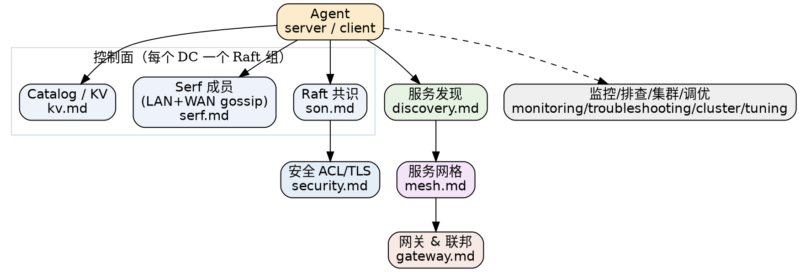

## Introduction

本目录是 Consul 的专题索引。Consul 是 HashiCorp 出品的**服务网络平台**：把服务发现、KV 配置、服务网格（mTLS + 意图授权）与多数据中心联邦打包进单个二进制。与 etcd / ZooKeeper / Nacos 这类"通用强一致键值底座"不同，Consul 直接把**注册发现 + 安全通信 + 跨机房**做成开箱能力，业务无需自己拼上层。

建议阅读路线：先读 [Consul（架构与启动流程）](/docs/CS/Framework/consul/Consul.md) 建立全局心智，再按"共识 Raft → 成员 Serf → 存储 KV → 服务发现 → 服务网格 → 网关联邦 → 安全 → 运维"逐层下钻。横向取舍见 [etcd 横向对照](/docs/CS/Framework/etcd/compare.md)。

## 总览与启动

- [Consul（架构与启动流程）](/docs/CS/Framework/consul/Consul.md)：agent 双模式（server / client）、控制面 / 数据面、版本与 BSL 许可、整体能力地图、与 etcd/ZooKeeper/Nacos 的维度对照。

## 共识层：Raft（仅 server）

- [Raft](/docs/CS/Framework/consul/raft.md)：Consul 为何在 server 间跑 Raft、LogStore/SnapshotStore 持久化、snapshot 阈值、Autopilot 自动化运维（稳定期 / 死节点清理 / 最大落后日志）、`/v1/operator/autopilot` 健康检查；与 etcd-raft / Zab / JRaft 对照。

## 成员发现层：Serf gossip

- [Serf](/docs/CS/Framework/consul/serf.md)：SWIM 风格的故障检测、LAN 与 WAN 两套 gossip 池、网络坐标（network coordinates）估算 RTT、对称密钥环加密；etcd / ZooKeeper 无原生成员发现的对照。

## 存储层：KV

- [KV](/docs/CS/Framework/consul/kv.md)：KV 语义（无历史版本）、CAS（ModifyIndex）、单值 512KB 上限、session（lock_delay / TTL / behavior）、分布式锁与信号量、阻塞查询；与 etcd 的 MVCC + lease 对照。

## 服务发现

- [Discovery](/docs/CS/Framework/consul/discovery.md)：DNS（`<svc>.service.consul`）、HTTP API（catalog / health / agent）、健康检查（script / http / tcp / grpc / ttl）、prepared queries、agent 缓存 stale 读、阻塞查询。

## 服务网格（差异化王牌）

- [Mesh](/docs/CS/Framework/consul/mesh.md)：Connect → Consul service mesh、Envoy sidecar、xDS（gRPC 8502）、mTLS（connect CA）、intentions（默认 deny，L4/L7）、transparent proxy、proxy-defaults / service-resolver / router / splitter 配置项。

## 网关与多数据中心联邦

- [Gateway](/docs/CS/Framework/consul/gateway.md)：mesh gateway（WAN 联邦，local / remote 模式）、ingress / terminating / API gateway、WAN federation 的两种形态、primary_datacenter 与 primary_gateways。

## 安全

- [Security](/docs/CS/Framework/consul/security.md)：ACL（默认不启用、default_policy 出厂 allow、策略 / 角色 / 令牌 / 认证方法）、传输 TLS（RPC / HTTPS 8501 / gRPC TLS 8503 / gossip keyring / auto_encrypt）、connect CA；与 etcd RBAC + mTLS 对照。

## 监控、排查与集群运维

- [Monitoring](/docs/CS/Framework/consul/monitoring.md)：telemetry（statsd / prometheus）、`/v1/agent/metrics`、关键指标表、健康检查端点、agent 缓存、告警项。
- [Troubleshooting](/docs/CS/Framework/consul/troubleshooting.md)：quorum 丢失只读、gossip 分区、ACL token 问题、mesh / xDS 连接、snapshot 恢复失败、时钟偏移、KV 值过大、leader flapping。
- [Cluster](/docs/CS/Framework/consul/cluster.md)：server / client 规模、bootstrap_expect、retry_join、参考架构（3/5 server、gossip RTT 约束）、备份恢复、滚动升级、ACL 复制、namespaces / partitions。
- [Tuning](/docs/CS/Framework/consul/tuning.md)：raft_multiplier、snapshot 阈值、Serf 重传、ACL 缓存 TTL、资源 sizing、2.0 起的 HTTP 超时调整。

## 客户端

- [Client](/docs/CS/Framework/consul/client.md)：go-client（api 包）、DNS 调试、HTTP API（curl）、CLI、服务注册与检查、阻塞查询 SDK、与 etcd clientv3 对照。

## Links

- [etcd 横向对照](/docs/CS/Framework/etcd/compare.md)
- [etcd](/docs/CS/Framework/etcd/etcd.md)
- [ZooKeeper](/docs/CS/Framework/ZooKeeper/ZooKeeper.md)
- [Nacos](/docs/CS/Framework/nacos/Nacos.md)
- [Spring Cloud Consul](/docs/CS/Framework/Spring_Cloud/Consul.md)

## References

1. [Consul Architecture](https://developer.hashicorp.com/consul/docs/architecture)
2. [Consul Consensus (Raft)](https://developer.hashicorp.com/consul/docs/concept/consul-internals/consensus)
3. [Consul Gossip Protocol](https://developer.hashicorp.com/consul/docs/concept/gossip)
4. [Consul Service Mesh](https://developer.hashicorp.com/consul/docs/connect)
5. [HashiCorp Consul End-of-life](https://endoflife.date/consul)
