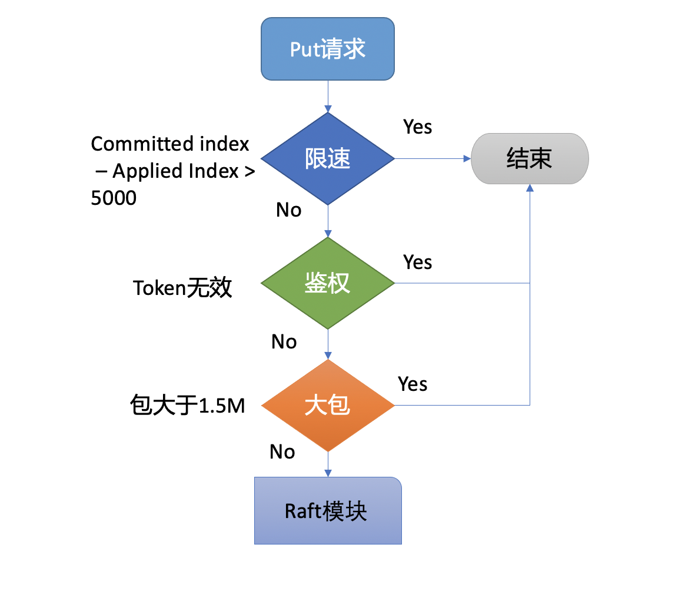

## Introduction

etcd的使用场景是一种“读多写少”的场景，etcd里  的一个key，其实并不会发生频繁的变更，但是一旦发生变更，etcd就需要通知监控这个key的所有客户端

etcd本质上是内存数据库，所有的数据都是加载到了内存中，当然，它跟redis一样，数据都是持久化了的，只是在启动的时候，将文件数据重新全部加载到内存中

etcd v2 是一个内存数据库，整个数据库拥有一个`Stop-the-World`的大锁，通过锁机制来解决并发带来的数据竞争。

但是存在**并发性能问题**：

- 1）锁的粒度不好控制，每次都会锁整个数据库
- 2）写锁和读锁相互阻塞。
- 3）前面的事务会阻塞后面的事务，对并发性能影响很大。

同时在高并发环境下还存在另一个严重的问题：

- **watch 机制可靠性问题**：etcd 中的 watch 机制会依赖旧数据，v2 版本基于滑动窗口实现的 watch 机制，只能保留最近的 1000 条历史事件版本，当 etcd server 写请求较多、网络波动时等场景，很容易出现事件丢失问题，进而又触发 client 数据全量拉取，产生大量 expensive request，甚至导致 etcd 雪崩。


etcd v2并未实时地将数据写入磁盘，持久化是靠快照来实现的，具体实现就是  将整个内存中的数据复制一份出来，然后序列化成JSON，写入磁盘  中，成为一个快照


etcd v3 为什么要选择 MVCC


多版本并发控制 (Multiversion concurrency control) 模块是为了解决etcd v2 不支持保存 key 的历史版本、不支持多 key 事务等问题而产生的
它核心由内存树形索引模块 (treeIndex) 和嵌入式的 KV 持久化存储库 boltdb 组成

treeIndex模块是基于Google开源的内存版btree库实现的 treeIndex模块只会保存用户的key和相关版本号信息，用户key的value数据存储在boltdb里面，相比ZooKeeper和etcd v2全内存存储，etcd v3对内存要求更低


boltdb的key是全局递增的版本号(revision)，value是用户key、value等字段组合成的结构体，然后通过treeIndex模块来保存用户key和版本号的映射关系。

读事务流程从treeIndex中获取key的版本号

在获取到版本号信息后，就可从boltdb模块中获取用户的key-value数据了。不过并不是所有请求都一定要从boltdb获取数据 etcd出于数据一致性、性能等考虑，在访问boltdb前，首先会从一个内存读事务buffer中，二分查找你要访问key是否在buffer里面，若命中则直接返回

若buffer未命中，此时就真正需要向boltdb模块查询数据 
boltdb里每个bucket类似对应MySQL一个表，用户的key数据存放的bucket名字的是key，etcd MVCC元数据存放的bucket是meta。

因boltdb使用B+ tree来组织用户的key-value数据，获取bucket key对象后，通过boltdb的游标Cursor可快速在B+ tree找到key hello对应的value数据，返回给client


重建内存索引btree的时候，遍历boltdb，从版本号0到最大版本号不断遍历，从value里面解析出对应的key、revision等信息，重建btree


当etcd收到一个请求Get Key时，请求被层层传递到了mvcc层后，它首先需要从内存索引btree中查找key对应的版本号，随后从boltdb里面根据版本号查出对应的value, 然后返回给client


当你执行 put 命令后，请求经过 gRPC KV Server、Raft 模块流转，对应的日志条目被提交后，Apply 模块开始执行此日志内容


**MVCC 模块**将请求请划分成两个类别，分别是读事务（ReadTxn）和写事务（WriteTxn）。读事务负责处理 range 请求，写事务负责 put/delete 操作。读写事务基于 treeIndex、Backend/boltdb 提供的能力，实现对 key-value 的增删改查功能。

**treeIndex 模块**基于内存版 B-tree 实现了 key 索引管理，它保存了用户 key 与版本号（revision）的映射关系等信息。

**Backend 模块**负责 etcd 的 key-value 持久化存储，主要由 ReadTx、BatchTx、Buffer 组成，ReadTx 定义了抽象的读事务接口，BatchTx 在 ReadTx 之上定义了抽象的写事务接口，Buffer 是数据缓存区


**treeIndex 模块正是为了解决这个问题**，支持保存 key 的历史版本，提供稳定的 Watch 机制和事务隔离等能力。

etcd 在每次修改 key 时会生成一个全局递增的版本号（revision）。

- 然后通过数据结构 B-tree 保存用户 key 与版本号之间的关系；
- 再以版本号作为 boltdb key，以用户的 key-value 等信息作为 boltdb value，保存到 boltdb


```go
type ResponseHeader struct {
	// cluster_id is the ID of the cluster which sent the response.
	ClusterId uint64 `protobuf:"varint,1,opt,name=cluster_id,json=clusterId,proto3" json:"cluster_id,omitempty"`
	// member_id is the ID of the member which sent the response.
	MemberId uint64 `protobuf:"varint,2,opt,name=member_id,json=memberId,proto3" json:"member_id,omitempty"`
	// revision is the key-value store revision when the request was applied.
	// For watch progress responses, the header.revision indicates progress. All future events
	// recieved in this stream are guaranteed to have a higher revision number than the
	// header.revision number.
	Revision int64 `protobuf:"varint,3,opt,name=revision,proto3" json:"revision,omitempty"`
	// raft_term is the raft term when the request was applied.
	RaftTerm             uint64   `protobuf:"varint,4,opt,name=raft_term,json=raftTerm,proto3" json:"raft_term,omitempty"`
	XXX_NoUnkeyedLiteral struct{} `json:"-"`
	XXX_unrecognized     []byte   `json:"-"`
	XXX_sizecache        int32    `json:"-"`
}
```

ResponseHeader.Revision代表该请求成功执行之后etcd的revision


键值对数据结构的定义具体如下

```go

type KeyValue struct {
	// key is the key in bytes. An empty key is not allowed.
	Key []byte `protobuf:"bytes,1,opt,name=key,proto3" json:"key,omitempty"`
	// create_revision is the revision of last creation on this key.
	CreateRevision int64 `protobuf:"varint,2,opt,name=create_revision,json=createRevision,proto3" json:"create_revision,omitempty"`
	// mod_revision is the revision of last modification on this key.
	ModRevision int64 `protobuf:"varint,3,opt,name=mod_revision,json=modRevision,proto3" json:"mod_revision,omitempty"`
	// version is the version of the key. A deletion resets
	// the version to zero and any modification of the key
	// increases its version.
	Version int64 `protobuf:"varint,4,opt,name=version,proto3" json:"version,omitempty"`
	// value is the value held by the key, in bytes.
	Value []byte `protobuf:"bytes,5,opt,name=value,proto3" json:"value,omitempty"`
	// lease is the ID of the lease that attached to key.
	// When the attached lease expires, the key will be deleted.
	// If lease is 0, then no lease is attached to the key.
	Lease                int64    `protobuf:"varint,6,opt,name=lease,proto3" json:"lease,omitempty"`
	XXX_NoUnkeyedLiteral struct{} `json:"-"`
	XXX_unrecognized     []byte   `json:"-"`
	XXX_sizecache        int32    `json:"-"`
}
```

KeyValue.CreateRevision代表etcd的某个key最后一次创建时etcd的  revison，KeyValue.ModRevision则代表etcd的某个key最后一次更新  时etcd的revison。verison特指etcd键空间某个key从创建开始被修改  的次数，即KeyValue.Version


etcd将物理数据存储为一棵持久B+树中的键值对。为了高效，每  个revision的存储状态都只包含相对于之前revision的增量。一个  revision可能对应于树中的多个key


B+树中键值对的key即revision，revision是一个2元组（main，  sub），其中main是该revision的主版本号，sub是同一revision的副版本  号，其用于区分同一个revision的不同key。B+树中键值对的value包含  了相对于之前revision的修改，即相对于之前revision的一个增量。  

B+树按key的字典字节序进行排序。这样，etcd v3对revision增量的  范围查询（range query，即从某个revision到另一个revision）会很快  ——因为我们已经记录了从一个特定revision到其他revision的修改量。  etcd v3的压缩操作会删除过时的键值对

etcd v3还在内存中维护了一个基于B树的二级索引来加快对key的  范围查询。该B树索引的key是向用户暴露的etcd v3存储的key，而该B  树索引的value则是一个指向上文讨论的持久化B+树的增量的指针。  etcd v3的压缩操作会删除指向B树索引的无效指针


etcd v2的每个key只保留一个value，所以数据库并不大，可以直  接放在内存中。但是etcd v3实现了MVCC以后，每个key的value都需要  保存多个历史版本，这就极大地增加了存储的数据量，因此内存中就  会存储不下这么多数据。对此，一个自然的解决方案就是将数据存储  在磁盘里。etcd v3当前使用BoltDB将数据存储在磁盘中


## put

一个 put 命令流程如下：

首先是流程一client端发起gRPC调用到etcd节点，和读请求不一样的是，写请求需要经过db配额（Quota）模块

1. 首先它需要从 treeIndex 模块中查询 key 的 keyIndex 索引信息
2. 其次 etcd 会根据当前的全局版本号（空集群启动时默认为 1）自增，生成 put hello 操作对应的版本号 revision{2,0}，这就是 boltdb 的 key

当etcd server收到put/txn等写请求的时候，会首先检查下当前etcd db大小加上你请求的key-value大小之和是否超过了配额（quota-backend-bytes）。
如果超过了配额，它会产生一个告警（Alarm）请求，告警类型是NO SPACE，并通过Raft日志同步给其它节点，告知db无空间了，并将告警持久化存储到db中。
最终，无论是API层gRPC模块还是负责将Raft侧已提交的日志条目应用到状态机的Apply模块，都拒绝写入，集群只读

为什么当你把配额（quota-backend-bytes）调大后，集群依然拒绝写入呢?

原因就是我们前面提到的NO SPACE告警。Apply模块在执行每个命令的时候，都会去检查当前是否存在NO SPACE告警，如果有则拒绝写入。所以还需要你额外发送一个取消告警（etcdctl alarm disarm）的命令，以消除所有告警

其次你需要检查etcd的压缩（compact）配置是否开启、配置是否合理。etcd保存了一个key所有变更历史版本，如果没有一个机制去回收旧的版本，那么内存和db大小就会一直膨胀，在etcd里面，压缩模块负责回收旧版本的工作。
压缩模块支持按多种方式回收旧版本，比如保留最近一段时间内的历史版本。不过你要注意，它仅仅是将旧版本占用的空间打个空闲（Free）标记，后续新的数据写入的时候可复用这块空间，而无需申请新的空间
如果你需要回收空间，减少db大小，得使用碎片整理（defrag）， 它会遍历旧的db文件数据，写入到一个新的db文件。但是它对服务性能有较大影响，不建议你在生产集群频繁使用

最后你需要注意配额（quota-backend-bytes）的行为，默认’0’就是使用etcd默认的2GB大小，你需要根据你的业务场景适当调优。如果你填的是个小于0的数，就会禁用配额功能，这可能会让你的db大小处于失控，导致性能下降，不建议你禁用配额


通过流程二的配额检查后，请求就从API层转发到了流程三的KVServer模块的put方法，我们知道etcd是基于Raft算法实现节点间数据复制的，因此它需要将put写请求内容打包成一个提案消息，提交给Raft模块。不过KVServer模块在提交提案前，还有如下的一系列检查和限速


<div style="text-align: center;">



</div>

<p style="text-align: center;">Fig.1. put</p>


最后通过一系列检查之后，会生成一个唯一的ID，将此请求关联到一个对应的消息通知channel，然后向Raft模块发起（Propose）一个提案（Proposal）

向Raft模块发起提案后，KVServer模块会等待此put请求，等待写入结果通过消息通知channel返回或者超时。etcd默认超时时间是7秒（5秒磁盘IO延时+2*1秒竞选超时时间），如果一个请求超时未返回结果，则可能会出现你熟悉的etcdserver: request timed out错误

Raft模块收到提案后，如果当前节点是Follower，它会转发给Leader，只有Leader才能处理写请求。Leader收到提案后，通过Raft模块输出待转发给Follower节点的消息和待持久化的日志条目，日志条目则封装了提案内容

etcdserver从Raft模块获取到以上消息和日志条目后，作为Leader，它会将put提案消息广播给集群各个节点，同时需要把集群Leader任期号、投票信息、已提交索引、提案内容持久化到一个WAL（Write Ahead Log）日志文件中，用于保证集群的一致性、可恢复性


## Links

- [etcd](/docs/CS/Framework/etcd/etcd.md)


## References

1. [etcd教程(六)---etcd多版本并发控制 - (lixueduan.com)](https://www.lixueduan.com/posts/etcd/06-why-mvcc/)
