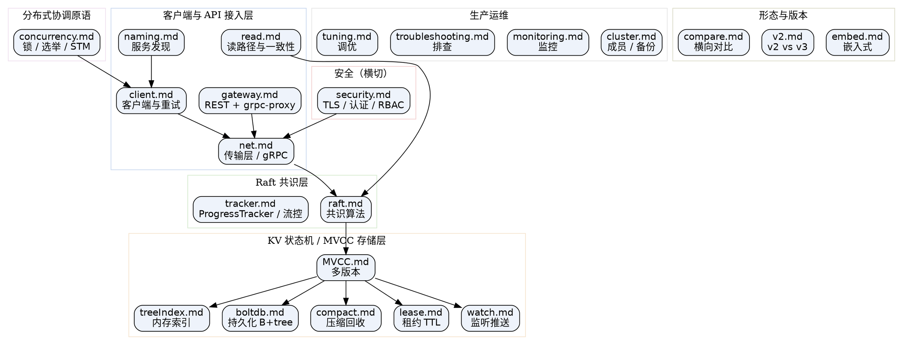

## Introduction

etcd 是 Kubernetes 的默认后端存储，也是一个通用的强一致键值仓库。本目录按"从对外 API 到底层存储"的纵向分层来组织笔记：请求先进入客户端 / API 接入层，经 Raft 达成共识，再落到 KV 状态机（MVCC + boltdb）完成持久化；协调原语、安全、运维、版本与横向对比则横贯或补充在这条主链之外。

[etcd](/docs/CS/Framework/etcd/etcd.md) 是本目录的技术总文档，覆盖架构、构建部署、启动链（`start` → `startEtcd` → `NewServer` → `serveClients`）、server 结构、quota、节点消息处理（get/put）、网络 `Serve`/`ServeHTTP`、Peer 通信与特性（Discovery / Transaction）。本页是这些笔记的导航索引：如果你想顺着一条请求理解全貌，建议的阅读顺序是「总览与启动 → 共识层 Raft → 存储与 MVCC 引擎 → 客户端与 API」，再按需跳到协调原语、安全、运维与版本对比。

## Layered Architecture Diagram

下图把每条笔记映射到它在 etcd 中的层次。实线箭头表示一次写请求自上而下经过的主链路；协调原语建立在客户端之上，安全横切传输层。

## Overview and Startup

[etcd](/docs/CS/Framework/etcd/etcd.md) 是入口：它把架构、构建部署、从进程启动到 gRPC server 拉起的完整调用链、quota 限流、节点消息处理与网络服务都串在一起，末尾还直接给出与 ZooKeeper / Consul 的差异速览（更完整的横向对比见 [compare](/docs/CS/Framework/etcd/compare.md)）。如果需要把 etcd 作为库嵌进自己的进程，而不是独立部署，看 [embed](/docs/CS/Framework/etcd/embed.md)（`server/embed` 模块，3.5 起稳定）。

## Consensus Layer: Raft

etcd 的一致性由 [raft](/docs/CS/Framework/etcd/raft.md) 提供——日志复制、领导人选举、状态机应用都在这里。想深入"Leader 如何感知每个 Follower 追到哪了、如何做窗口流控与暂停"，读 [tracker](/docs/CS/Framework/etcd/tracker.md)：它拆解 `ProgressTracker`、`Inflights` 环形窗口、`Probe` / `Replicate` / `Snapshot` 三种状态，以及 `IsPaused()`、`Committed()`、`QuorumActive()` 跳过 learner 的细节。读路径的线性一致性也依赖 Raft 的 ReadIndex，见 [read](/docs/CS/Framework/etcd/read.md)。

## Storage and MVCC Engine

共识层之上是 KV 状态机。[MVCC](/docs/CS/Framework/etcd/MVCC.md) 讲解多版本模型：每次写生成全局递增的 `revision`（`main` + `sub`），put / delete / tx 如何借此保留历史。[treeIndex](/docs/CS/Framework/etcd/treeIndex.md) 是内存中的 B-tree 键索引，维护 `key → revision` 的映射；真正落盘的是 [boltdb](/docs/CS/Framework/etcd/boltdb.md)（bbolt 的 B+tree、页结构、bucket 与事务）。历史不会被无限保留——[compact](/docs/CS/Framework/etcd/compact.md) 负责压缩与回收，[lease](/docs/CS/Framework/etcd/lease.md) 管理带 TTL 的租约及其附加键，[watch](/docs/CS/Framework/etcd/watch.md) 则把键变更以事件流推送给监听方（含 synced / unsynced 两条队列）。

## Client, Network and API

对使用者而言，起点是 [client](/docs/CS/Framework/etcd/client.md)：clientv3 的连接管理、`isSafeRetry` 重试策略与认证。底层传输见 [net](/docs/CS/Framework/etcd/net.md)（gRPC server 与 peer 通信）。若需要 REST / JSON 或一层无状态代理，看 [gateway](/docs/CS/Framework/etcd/gateway.md)——它区分 gRPC-gateway（需单独进程暴露 REST）与 grpc-proxy（L7 代理，可做 watch / lease 合并与 namespace）。基于 etcd 自身实现服务发现，见 [naming](/docs/CS/Framework/etcd/naming.md)（gRPC resolver + endpoints，借助 `WithLease` 自动下线）。读请求的一致性语义单独拆在 [read](/docs/CS/Framework/etcd/read.md)：linearizable 走 ReadIndex，serializable 直接读本地。

## Distributed Coordination Primitives

在客户端之上，[concurrency](/docs/CS/Framework/etcd/concurrency.md) 提供开箱即用的分布式原语：`Session`、`Mutex`（含 `NewLocker`）、`STM`、`Election`，默认隔离级别 `SerializableSnapshot`。注意 clientv3 并发包没有 Queue 实现。

## Security

[security](/docs/CS/Framework/etcd/security.md) 横切传输与访问：TLS 加密、认证（auth）与 RBAC 鉴权。它与 [compare](/docs/CS/Framework/etcd/compare.md) 中提到的"etcd 实现 RBAC、ZooKeeper / Consul 仅 ACL"形成对照。

## Production Operations

落地到生产，四篇互为补充：[cluster](/docs/CS/Framework/etcd/cluster.md) 讲成员变更、快照备份恢复与 learner；[monitoring](/docs/CS/Framework/etcd/monitoring.md) 讲 Prometheus 指标与告警阈值；[troubleshooting](/docs/CS/Framework/etcd/troubleshooting.md) 汇总常见故障（如 `database space exceeded`、成员异常）；[tuning](/docs/CS/Framework/etcd/tuning.md) 汇总运维调优旋钮与默认值（如 `--snapshot-count`、`/livez`、`/readyz`）。

## Form and Version

[embed](/docs/CS/Framework/etcd/embed.md) 覆盖嵌入式形态；[v2](/docs/CS/Framework/etcd/v2.md) 讲 v2 与 v3 的差异、迁移路径，以及 3.6 起移除 v2 的事实；[compare](/docs/CS/Framework/etcd/compare.md) 把 etcd 与 ZooKeeper / Nacos / Consul 在共识算法、一致性读、权限、事务、多数据中心等维度做横向对比。

## Links

- [ZooKeeper](/docs/CS/Framework/ZooKeeper/ZooKeeper.md)
- [Nacos](/docs/CS/Framework/nacos/Nacos.md)
- [K8s 中的 etcd 存储](/docs/CS/Container/k8s/etcd.md)
- [K8s](/docs/CS/Container/k8s/K8s.md)

## References

1. [etcd 官方文档](https://etcd.io/docs/)
2. [深入浅出 etcd 系列 part 1 – 解析 etcd 的架构和代码框架](https://mp.weixin.qq.com/s/C2WKrfcJ1sVQuSxlpi6uNQ)
3. [深入浅出etcd/raft —— 0x00 引言](https://blog.mrcroxx.com/posts/code-reading/etcdraft-made-simple/0-introduction/)
