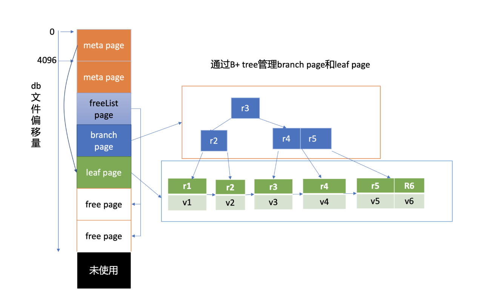

## Introduction

boltdb文件指的是你etcd数据目录下的member/snap/db的文件， etcd的key-value、lease、meta、member、cluster、auth等所有数据存储在其中。etcd启动的时候，会通过mmap机制将db文件映射到内存，后续可从内存中快速读取文件中的数据。写请求通过fwrite和fdatasync来写入、持久化数据到磁盘

Fig.1. boltdb文件

文件的内容由若干个page组成，一般情况下page size为4KB。

page按照功能可分为元数据页(meta page)、B+ tree索引节点页(branch page)、B+ tree 叶子节点页(leaf page)、空闲页管理页(freelist page)、空闲页(free page)。

文件最开头的两个page是固定的db元数据meta page，空闲页管理页记录了db中哪些页是空闲、可使用的。索引节点页保存了B+ tree的内部节点，如图中的右边部分所示，它们记录了key值，叶子节点页记录了B+ tree中的key-value和bucket数据。

boltdb逻辑上通过B+ tree来管理branch/leaf page， 实现快速查找、写入key-value数据

boltdb提供了非常简单的API给上层业务使用，当我们执行一个put hello为world命令时，boltdb实际写入的key是版本号，value为mvccpb.KeyValue结构体

## struct

### freelist

## Links

- [etcd](/docs/CS/Framework/etcd/etcd.md)

## References

