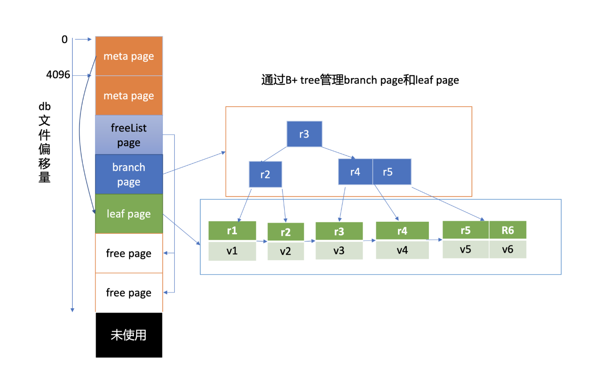

## Introduction

boltdb 指的是 etcd 数据目录下的 `member/snap/db` 文件——etcd 的 key-value、lease、meta、member、cluster、auth 等**所有**数据都存在这一个文件里。它不是 etcd 自己实现的，而是用 bbolt（etcd 贡献回社区的 Bolt 分支）。

etcd 启动时通过 **mmap** 把 db 文件映射到内存，之后的读操作直接从内存走；写操作则通过文件操作 + `fdatasync` 落盘持久化。

boltdb 的核心是 **B+ tree**：所有 key-value 都组织成一棵 B+ tree，写入、查找、范围扫描全部在树上完成。理解 etcd 的存储，第一步是理解这个文件的字节级布局。

> [!NOTE]
> 本篇的 key 编码、bucket 清单、tombstone 标记等结论均来自 etcd **v3.4.9** 源码（`mvcc/revision.go`、`mvcc/kvstore.go`、`mvcc/kvstore_txn.go`、`mvcc/key_index.go`），代码片段保持原样。这些结构在 3.5/3.6 未发生实质变化。

## Page 结构

文件内容由若干 **page** 组成，page size 固定 **4KB**。按功能分为五类：

| 类型 | 职责 |
| :--- | :--- |
| meta page | 记录事务的元信息 |
| branch page | B+ tree 的内部节点，保存索引 key |
| leaf page | B+ tree 的叶子节点，保存实际 key-value 与 bucket |
| freelist page | 记录哪些页是空闲可复用的 |
| free page | 空闲页本体 |

<div style="text-align: center;">



</div>

<p style="text-align: center;">
Fig.1. boltdb 文件结构
</p>

文件最开头的**两个 page 是固定的 meta page**。freelist page 记录了 db 中哪些页是空闲、可使用的；branch page 保存 B+ tree 的内部节点（对应图中右边部分），leaf page 保存 key-value 和 bucket 数据。

逻辑上，boltdb 通过 B+ tree 管理 branch/leaf page，实现快速的查找与写入。

## Bucket

boltdb 的 API 非常简单——只有**一个** bucket（`bucket`）概念，本质是一棵独立的 B+ tree。上层业务用它做命名空间隔离。

etcd 使用的 bucket 常量定义在 `mvcc/kvstore.go`：

```go
keyBucketName  = []byte("key")
metaBucketName = []byte("meta")
```

| Bucket | 内容 |
| :--- | :--- |
| `key` | **用户数据**。key 是序列化后的 revision，value 是序列化后的 `mvccpb.KeyValue` |
| `meta` | MVCC 运行期元数据：已 compact 的 revision、关联 Raft 日志的 index、consistentIndex、confState、term 等 |
| `lease` | [lease](/docs/CS/Framework/etcd/lease.md) 及其关联的 key 列表 |
| `cluster` | 集群成员信息、集群版本 |
| `members` | 成员记录（`members_` 前缀的 bolt bucket） |
| `auth` / `authUsers` / `authRoles` | [鉴权](/docs/CS/Framework/etcd/security.md) 的用户、角色、权限关系 |
| `alarm` | NOSPACE 等集群告警记录 |

> [!WARNING]
> 只有 `key` 与 `meta` 是 mvcc 层的 bucket 常量，其余（lease、cluster、auth 等）由**各自模块**（lessor、cluster、auth store）独立管理，写入同一份 db 文件。理解这点很重要：`db` 文件里的数据是多个模块共同写入的，不属于 MVCC 体系。

## Key 的编码

执行 `put hello world` 时，**boltdb 实际写入的 key 是版本号（revision），value 是 `mvccpb.KeyValue` 结构体**。这里有个反直觉的事实：磁盘 key 里**并不包含用户的 `hello`**——用户 key 存在 value 内部。

revision 本身由 main 与 sub 两部分组成（`mvcc/revision.go`）：

```go
// revBytesLen is the byte length of a normal revision.
// First 8 bytes is the revision.main in big-endian format. The 9th byte
// is a '_'. The last 8 bytes is the revision.sub in big-endian format.
const revBytesLen = 8 + 1 + 8

// A revision indicates modification of the key-value space.
// The set of changes that share same main revision changes the key-value space atomically.
type revision struct {
	// main is the main revision of a set of changes that happen atomically.
	main int64

	// sub is the sub revision of a change in a set of changes that happen
	// atomically. Each change has different increasing sub revision in that
	// set.
	sub int64
}
```

编码函数：

```go
func revToBytes(rev revision, bytes []byte) {
	binary.BigEndian.PutUint64(bytes, uint64(rev.main))
	bytes[8] = '_'
	binary.BigEndian.PutUint64(bytes[9:], uint64(rev.sub))
}

func bytesToRev(bytes []byte) revision {
	return revision{
		main: int64(binary.BigEndian.Uint64(bytes[0:8])),
		sub:  int64(binary.BigEndian.Uint64(bytes[9:])),
	}
}
```

所以正常 revision 是 **17 字节**：`main(8, big-endian) + '_' + sub(8, big-endian)`。

`main` 是一次原子变更的版本号，`sub` 用于区分**同一次 Raft 日志提交内的多个 key**——一个 Txn 里改 3 个 key，这 3 个 key 共享同一个 `main`，但 `sub` 依次递增。所以磁盘上实际是：

```text
磁盘 key:  [ main(8) ][ '_' ][ sub(8) ]        ← 共 17 字节
           └────────────── 磁盘排序依据 ──────────┘
磁盘 value: mvccpb.KeyValue{ Key, Value, CreateRevision, ModRevision, Version, Lease }
```

> [!TIP]
> **为什么要把 revision 放在 key 里？** 因为 B+ tree 按 key 有序排列，把单调递增的 revision 编码进 key，天然保证磁盘上"同一 key 的所有版本按版本号物理相邻"。范围查询 `[start, end)` 就退化成一次 B+ tree 的顺序扫描——这正是 `--prefix` 查询能高效工作的底层原因。用户 key 放在 value 里，反而让 key 保持定长（17 或 18 字节），B+ tree 的节点更紧凑。

### Tombstone 标记

删除 key 时，etcd 不做物理擦除，而是写一条**只有 key、没有 value** 的记录，并加上墓碑标记（`mvcc/kvstore.go`）：

```go
const (
	// markedRevBytesLen is the byte length of marked revision.
	// The first `revBytesLen` bytes represents a normal revision. The last
	// one byte is the mark.
	markedRevBytesLen      = revBytesLen + 1
	markBytePosition       = markedRevBytesLen - 1
	markTombstone     byte = 't'
)

// appendMarkTombstone appends tombstone mark to normal revision bytes.
func appendMarkTombstone(lg *zap.Logger, b []byte) []byte {
	if len(b) != revBytesLen {
		if lg != nil {
			lg.Panic(
				"cannot append tombstone mark to non-normal revision bytes",
				zap.Int("expected-revision-bytes-size", revBytesLen),
				zap.Int("given-revision-bytes-size", len(b)),
			)
		} else {
			plog.Panicf("cannot append mark to non normal revision bytes")
		}
	}
	return append(b, markTombstone)
}

// isTombstone checks whether the revision bytes is a tombstone.
func isTombstone(b []byte) bool {
	return len(b) == markedRevBytesLen && b[markBytePosition] == markTombstone
}
```

标记字节是**追加在尾部**的 `'t'`（不是 0x01，也不是头部的前缀 0x00）：

| 类型 | 长度 | 末字节 |
| :--- | :--- | :--- |
| 正常 revision | 17 | sub 的高位字节 |
| tombstone | **18** | `'t'`（`0x74`） |

> [!NOTE]
> 网上流传的"8 字节 main + 1 字节 tombstone 标记 + 用户 key"是**错的**。真实布局是 `main(8) + '_' + sub(8)`，标记追加在尾部，用户 key 根本不在磁盘 key 里。

## 读写路径

写路径（`mvcc/kvstore_txn.go` 的 `storeTxnWrite.put`）：

```go
func (tw *storeTxnWrite) put(key, value []byte, leaseID lease.LeaseID) {
	rev := tw.beginRev + 1
	c := rev
	oldLease := lease.NoLease

	// if the key exists before, use its previous created and
	// get its previous leaseID
	_, created, ver, err := tw.s.kvindex.Get(key, rev)
	if err == nil {
		c = created.main
		oldLease = tw.s.le.GetLease(lease.LeaseItem{Key: string(key)})
	}
	tw.trace.Step("get key's previous created_revision and leaseID")
	ibytes := newRevBytes()
	idxRev := revision{main: rev, sub: int64(len(tw.changes))}
	revToBytes(idxRev, ibytes)

	ver = ver + 1
	kv := mvccpb.KeyValue{
		Key:            key,
		Value:          value,
		CreateRevision: c,
		ModRevision:    rev,
		Version:        ver,
		Lease:          int64(leaseID),
	}

	d, err := kv.Marshal()
	// ...
	tw.trace.Step("marshal mvccpb.KeyValue")
	tw.tx.UnsafeSeqPut(keyBucketName, ibytes, d)
	tw.s.kvindex.Put(key, idxRev)
	tw.changes = append(tw.changes, kv)
	tw.trace.Step("store kv pair into bolt db")
	// ...
}
```

值得注意的几点：

- `CreateRevision` 只在 key **首次创建**时取当前 rev，后续更新沿用旧值；`Version` 每次 put 递增。
- `sub: int64(len(tw.changes))` —— 用已变更条数当 sub，这就是同一次 Txn 内多个 key 共享 main 的实现方式。
- 写 boltdb 与更新内存索引 `kvindex` 在同一函数内完成，保证两者一致。
- lease 的 `Detach`/`Attach` 也在此处理：换了 lease 要先摘旧挂新。

读路径（`rangeKeys`）则是"先查内存索引拿 revision 列表，再逐个点查 bbolt"：

```go
	revpairs := tr.s.kvindex.Revisions(key, end, rev)
	tr.trace.Step("range keys from in-memory index tree")
	// ...
	revBytes := newRevBytes()
	for i, revpair := range revpairs[:len(kvs)] {
		revToBytes(revpair, revBytes)
		_, vs := tr.tx.UnsafeRange(keyBucketName, revBytes, nil, 0)
		// ...
		if err := kvs[i].Unmarshal(vs[0]); err != nil {
			// ...
		}
	}
	tr.trace.Step("range keys from bolt db")
```

> [!NOTE]
> 注意**读路径没有直接扫 bbolt**，而是先走内存 [treeIndex](/docs/CS/Framework/etcd/treeIndex.md) 拿到候选 revision 列表再点查。这印证了 treeIndex 的定位：它是内存索引，bbolt 是持久层，二者严格分工。

## struct

`keyIndex`（定义在 `mvcc/key_index.go`）是内存索引的节点，**一个用户 key 对应一个 keyIndex**：

```go
// keyIndex stores the revisions of a key in the backend.
// Each keyIndex has at least one key generation.
// Each generation might have several key versions.
// Tombstone on a key appends an tombstone version at the end
// of the current generation and creates a new empty generation.
// Each version of a key has an index pointing to the backend.
//
// For example: put(1.0);put(2.0);tombstone(3.0);put(4.0);tombstone(5.0) on key "foo"
// generate a keyIndex:
// key:     "foo"
// rev: 5
// generations:
//    {empty}
//    {4.0, 5.0(t)}
//    {1.0, 2.0, 3.0(t)}
//
// Compact a keyIndex removes the versions with smaller or equal to
// rev except the largest one. If the generation becomes empty
// during compaction, it will be removed. if all the generations get
// removed, the keyIndex should be removed.
//
// For example:
// compact(2) on the previous example
// generations:
//    {empty}
//    {4.0, 5.0(t)}
//    {2.0, 3.0(t)}
//
// compact(4)
// generations:
//    {empty}
//    {4.0, 5.0(t)}
//
// compact(5):
//    {empty} -> key SHOULD be removed.
//
// compact(6):
//    {empty} -> key SHOULD be removed.
type keyIndex struct {
	key         []byte
	modified    revision // the main rev of the last modification
	generations []generation
}
```

**generation 的划分逻辑是理解 etcd 删除语义的关键**。一个 generation = key 从"被创建"到"被删除"的一段完整生命周期。tombstone 会在当前 generation 末尾追加一条 tombstone 版本，**并新建一个空 generation**。

以 `put(1.0); put(2.0); tombstone(3.0); put(4.0); tombstone(5.0)` 为例，删除后再创建同名的 key 就进入了新的 generation，而 `version` 号在删除后**会重新从 1 开始**——因为 version 是按 generation 内的 `g.ver` 计数的。

generation 结构本身很轻量：

```go
// generation contains multiple revisions of a key.
type generation struct {
	ver     int64
	created revision // when the generation is created (put in first revision).
	revs    []revision
}
```

`walk` 方法按**降序**遍历（从最新版本往回走），compact 正是靠它实现的：

```go
// walk walks through the revisions in the generation in descending order.
// It passes the revision to the given function.
// walk returns until: 1. it finishes walking all pairs 2. the function returns false.
// walk returns the position at where it stopped. If it stopped after
// finishing walking, -1 will be returned.
func (g *generation) walk(f func(rev revision) bool) int {
	l := len(g.revs)
	for i := range g.revs {
		ok := f(g.revs[l-i-1])
		if !ok {
			return l - i - 1
		}
	}
	return -1
}
```

`compact` 保留了"≤ atRev 的版本里最大的那一个"，这个"留一个"的策略很关键——它让 compact 后的 key 仍能被读到某个至少不早于 atRev 的状态，而不必立即把 key 从索引里删掉：

```go
// compact compacts a keyIndex by removing the versions with smaller or equal
// revision than the given atRev except the largest one (If the largest one
// is a tombstone, it will not be kept).
// If a generation becomes empty during compaction, it will be removed.
func (ki *keyIndex) compact(lg *zap.Logger, atRev int64, available map[revision]struct{}) {
	// ...
	genIdx, revIndex := ki.doCompact(atRev, available)

	g := &ki.generations[genIdx]
	if !g.isEmpty() {
		// remove the previous contents.
		if revIndex != -1 {
			g.revs = g.revs[revIndex:]
		}
		// remove any tombstone
		if len(g.revs) == 1 && genIdx != len(ki.generations)-1 {
			delete(available, g.revs[0])
			genIdx++
		}
	}

	// remove the previous generations.
	ki.generations = ki.generations[genIdx:]
}
```

## freelist

`freelist` 是 boltdb 的**空闲页管理器**——记录哪些 page 当前是空闲可复用的，位于 db 文件开头的 meta page 之后。

理解 freelist 的关键前提是：**bbolt 不会自动缩小文件**。

MVCC 与 [compact](/docs/CS/Framework/etcd/compact.md) 只能删除 key-value 条目，删除后这些 page 变成空闲，被**记录进 freelist 等待复用**，但**磁盘文件大小保持不变**。这就是为什么"compact 之后 db 文件还是很大"——被删掉的空间只进了 freelist，没有还给文件系统。

> [!NOTE]
> freelist 存在 O(N) 的问题：一个频繁删除大 value 的 key 会把大量 page 释放进 freelist。官方在 etcd.md 的 [quota 章节](/docs/CS/Framework/etcd/etcd.md) 分析过这一机制——`freelist` 的扫描成本随空闲页数线性增长，碎片过多时 compaction 本身会变慢。

唯一的回收方式是 **defrag**：重建一个紧凑的 db 文件并原子替换，把空闲页彻底丢弃。`etcdctl defrag` 正是干这个。它是**阻塞操作**（期间该节点不响应请求），所以生产上要逐台执行。完整的处置流程见 [troubleshooting.md](/docs/CS/Framework/etcd/troubleshooting.md) 的 NOSPACE 章节。

## Links

- [treeIndex（内存键索引）](/docs/CS/Framework/etcd/treeIndex.md)
- [MVCC（多版本并发控制）](/docs/CS/Framework/etcd/MVCC.md)
- [compact（历史版本压缩）](/docs/CS/Framework/etcd/compact.md)
- [troubleshooting（NOSPACE 处置与 defrag）](/docs/CS/Framework/etcd/troubleshooting.md)
- [cluster（磁盘数据布局）](/docs/CS/Framework/etcd/cluster.md)
- [tuning（--backend-batch-interval / --backend-batch-limit）](/docs/CS/Framework/etcd/tuning.md)

## References

1. [etcd mvcc/revision.go (v3.4.9)](https://github.com/etcd-io/etcd/blob/v3.4.9/mvcc/revision.go)
2. [etcd mvcc/kvstore.go (v3.4.9)](https://github.com/etcd-io/etcd/blob/v3.4.9/mvcc/kvstore.go)
3. [etcd mvcc/kvstore_txn.go (v3.4.9)](https://github.com/etcd-io/etcd/blob/v3.4.9/mvcc/kvstore_txn.go)
4. [etcd mvcc/key_index.go (v3.4.9)](https://github.com/etcd-io/etcd/blob/v3.4.9/mvcc/key_index.go)
5. [bbolt (Bolt 的派生分支)](https://github.com/etcd-io/bbolt)
6. [etcd Documentation - Maintenance](https://etcd.io/docs/v3.5/op-guide/maintenance/)
7. [etcd 3.5.9 源代码分析](https://www.cnblogs.com/janeysj/p/17401891.html)
