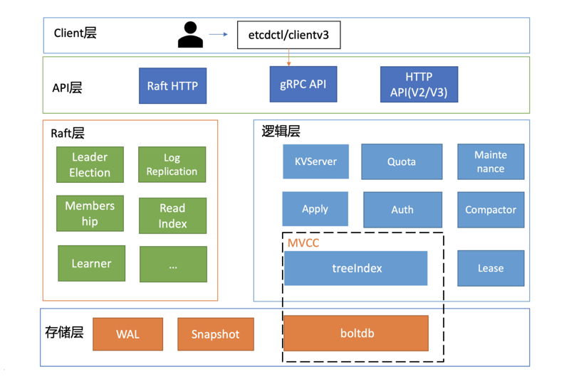

## Introduction

etcd is a distributed reliable key-value store for the most critical data of a distributed system, with a focus on being:

* *Simple*: well-defined, user-facing API (gRPC)
* *Secure*: automatic TLS with optional client cert authentication
* *Fast*: benchmarked 10,000 writes/sec
* *Reliable*: properly distributed using Raft

etcd is written in Go and uses the [Raft](/docs/CS/Distributed/Raft.md) consensus algorithm to manage a highly-available replicated log.
etcd 通过 Raft 协议进行 leader 选举和数据备份，对外提供高可用的数据存储，能有效应对网络问题和机器故障带来的数据丢失问题。
同时它还可以提供服务发现、分布式锁、分布式数据队列、分布式通知和协调、集群选举等功能

> etcd这个名字来源于unix的“/etc”文件夹和分布式系统(“D”istribute system)的D，组合在一起表示etcd是用于存储分布式配置的信息存储服务

etcd 是 Kubernetes 的后端唯一存储实现

> 为什么不用ZooKeeper呢？
>
> 从高可用性、数据一致性、功能这三个角度来说，ZooKeeper是满足CoreOS诉求的。然而当时的ZooKeeper不支持通过API安全地变更成员，需要人工修改一个个节点的配置，并重启进程。
>
> 若变更姿势不正确，则有可能出现脑裂等严重故障。适配云环境、可平滑调整集群规模、在线变更运行时配置是CoreOS的期望目标，而ZooKeeper在这块的可维护成本相对较高。
>
> 其次ZooKeeper是用 Java 编写的，部署较繁琐，占用较多的内存资源，同时ZooKeeper RPC的序列化机制用的是Jute，自己实现的RPC API。无法使用curl之类的常用工具与之互动，CoreOS期望使用比较简单的HTTP + JSON


## Build

为了保证etcd可运行，我们先在根目录上运行go mod tidy，保证依赖库没有问题。
接着，我们阅读Makefile文件，发现其提供了make build指令。运行后，在bin目录下生成了etcd/etcdctl/etcdutl三个可执行文件，并且打印出了版本信息


## Architecture


etcd 整体架构如下图所示：


<div style="text-align: center;">



</div>

<p style="text-align: center;">
Fig.1. Architecture
</p>

从大体上可以将其划分为以下 4 个模块：

- http：负责对外提供 http 访问接口和 http client
- raft 状态机：根据接受的 raft 消息进行状态转移，调用各状态下的动作。
- wal 日志存储：持久化存储日志条目。
- kv 数据存储：kv 数据的存储引擎，v3 支持不同的后端存储，当前采用 boltdb。通过 boltdb 支持事务操作。


etcd v2的问题

首先是功能局限性问题。它主要是指etcd v2不支持范围和分页查询、不支持多key事务。
第一，etcd v2不支持范围查询和分页。分页对于数据较多的场景是必不可少的。在Kubernetes中，在集群规模增大后，Pod、Event等资源可能会出现数千个以上，但是etcd v2不支持分页，不支持范围查询，大包等expensive request会导致严重的性能乃至雪崩问题。
第二，etcd v2不支持多key事务。在实际转账等业务场景中，往往我们需要在一个事务中同时更新多个key。
然后是Watch机制可靠性问题。Kubernetes项目严重依赖etcd Watch机制，然而etcd v2是内存型、不支持保存key历史版本的数据库，只在内存中使用滑动窗口保存了最近的1000条变更事件，当etcd server写请求较多、网络波动时等场景，很容易出现事件丢失问题，进而又触发client数据全量拉取，产生大量expensive request，甚至导致etcd雪崩。
其次是性能瓶颈问题。etcd v2早期使用了简单、易调试的HTTP/1.x API，但是随着Kubernetes支撑的集群规模越来越大，HTTP/1.x协议的瓶颈逐渐暴露出来。比如集群规模大时，由于HTTP/1.x协议没有压缩机制，批量拉取较多Pod时容易导致APIServer和etcd出现CPU高负载、OOM、丢包等问题。
另一方面，etcd v2 client会通过HTTP长连接轮询Watch事件，当watcher较多的时候，因HTTP/1.x不支持多路复用，会创建大量的连接，消耗server端过多的socket和内存资源。
同时etcd v2支持为每个key设置TTL过期时间，client为了防止key的TTL过期后被删除，需要周期性刷新key的TTL。
实际业务中很有可能若干key拥有相同的TTL，可是在etcd v2中，即使大量key TTL一样，你也需要分别为每个key发起续期操作，当key较多的时候，这会显著增加集群负载、导致集群性能显著下降。
最后是内存开销问题。etcd v2在内存维护了一颗树来保存所有节点key及value。在数据量场景略大的场景，如配置项较多、存储了大量Kubernetes Events， 它会导致较大的内存开销，同时etcd需要定时把全量内存树持久化到磁盘。这会消耗大量的CPU和磁盘 I/O资源，对系统的稳定性造成一定影响

etcd v3就是为了解决以上稳定性、扩展性、性能问题而诞生的。
在内存开销、Watch事件可靠性、功能局限上，它通过引入B-tree、boltdb实现一个MVCC数据库，数据模型从层次型目录结构改成扁平的key-value，提供稳定可靠的事件通知，实现了事务，支持多key原子更新，同时基于boltdb的持久化存储，显著降低了etcd的内存占用、避免了etcd v2定期生成快照时的昂贵的资源开销。
性能上，首先etcd v3使用了gRPC API，使用protobuf定义消息，消息编解码性能相比JSON超过2倍以上，并通过HTTP/2.0多路复用机制，减少了大量watcher等场景下的连接数。
其次使用Lease优化TTL机制，每个Lease具有一个TTL，相同的TTL的key关联一个Lease，Lease过期的时候自动删除相关联的所有key，不再需要为每个key单独续期。
最后是etcd v3支持范围、分页查询，可避免大包等expensive request

相对于 v2，v3 的主要改动点为：

1. 使用 grpc 进行 peer 之间和与客户端之间通信；
2. v2 的 store 是在内存中的一棵树，v3 采用抽象了一个 kvstore，支持不同的后端存储数据库。增强了事务能力。
3. 去除单元测试代码，etcd v2 的代码行数约 40k，v3 的代码行数约 70k。
4. 2.3 典型内部处理流程
5. 我们将上面架构图的各个部分进行编号，以便下文的处理流程介绍中，对应找到每个流程处理的组件位置。

在 Etcd v2 与 v3 两个版本中，使用的存储方式完全不同，所以两个版本的数据并不兼容，对外提供的接口也是不一样的，不同版本的数据是相互隔离的，只能使用对应的版本去存储与获取

在v3中，store的实现分为两部分
- backend store：可以使用不同的存储，默认使用BoltDB(单机的支持事务的键值对存储)
- 内存索引，基于 http://github.com/google/btree 的b树索引实现

etcd 在 BoltDB 中存储的 key是 revision，value 是 etcd 自定义的键值对组合，etcd 会将键值对的每个版本都保存到 BoltDB 中，所以 etcd 能实现多版本的机制
每次查询键值对需要通过 revision 来查找，所以会在内存中维护一份 B树索引，关联了一个 keyIndex 实例用来映射 key 与 revision，并维护了多个版本的 revision，客户端只会根据 key 去获取数据而不是 revision

v3版本的存储废弃了树形的存储结构但是可以通过前缀的方式来模拟 更接近ZooKeeper的实现


EtcdServer:是整个 etcd 节点的功能的入口，包含 etcd 节点运行过程中需要的大部分成员。


raftNode 是 Raft 节点，维护 Raft 状态机的步进和状态迁移


### Data Model

数据模型参考了ZooKeeper，使用的是基于目录的层次模式。API相比ZooKeeper来说，使用了简单、易用的REST API，提供了常用的Get/Set/Delete/Watch等API，实现对key-value数据的查询、更新、删除、监听等操作。
key-value存储引擎上，ZooKeeper使用的是Concurrent HashMap，而etcd使用的是则是简单内存树，它的节点数据结构精简后如下，含节点路径、值、孩子节点信息。这是一个典型的低容量设计，数据全放在内存，无需考虑数据分片，只能保存key的最新版本，简单易实现

```go
type node struct {
    Path string

    CreatedIndex  uint64
    ModifiedIndex uint64

    Parent *node `json:"-"` // should not encode this field! avoid circular dependency.

    ExpireTime time.Time
    Value      string           // for key-value pair
    Children   map[string]*node // for directory

    // A reference to the store this node is attached to.
    store *store
}
```

## start

主入口函数 etcdmain.Main

```go
func Main(args []string) {
    checkSupportArch()

    if len(args) > 1 {
        cmd := args[1]
        switch cmd {
        case "gateway", "grpc-proxy":
            if err := rootCmd.Execute(); err != nil {
                fmt.Fprint(os.Stderr, err)
                os.Exit(1)
            }
            return
        }
    }

    startEtcdOrProxyV2(args)
}
```


startEtcdOrProxyV2
```go
func startEtcdOrProxyV2(args []string) {
    grpc.EnableTracing = false

    cfg := newConfig()
    defaultInitialCluster := cfg.ec.InitialCluster

    err := cfg.parse(args[1:])
    lg := cfg.ec.GetLogger()
    // If we failed to parse the whole configuration, print the error using
    // preferably the resolved logger from the config,
    // but if does not exists, create a new temporary logger.
    if lg == nil {
        var zapError error
        // use this logger
        lg, zapError = logutil.CreateDefaultZapLogger(zap.InfoLevel)
        if zapError != nil {
            fmt.Printf("error creating zap logger %v", zapError)
            os.Exit(1)
        }
    }

    cfg.ec.SetupGlobalLoggers()

    defer func() {
        logger := cfg.ec.GetLogger()
        if logger != nil {
            logger.Sync()
        }
    }()

    defaultHost, dhErr := (&cfg.ec).UpdateDefaultClusterFromName(defaultInitialCluster)
    if defaultHost != "" {
        lg.Info(
            "detected default host for advertise",
            zap.String("host", defaultHost),
        )
    }
    if dhErr != nil {
        lg.Info("failed to detect default host", zap.Error(dhErr))
    }

    if cfg.ec.Dir == "" {
        cfg.ec.Dir = fmt.Sprintf("%v.etcd", cfg.ec.Name)
        lg.Warn(
            "'data-dir' was empty; using default",
            zap.String("data-dir", cfg.ec.Dir),
        )
    }

    var stopped <-chan struct{}
    var errc <-chan error

    which := identifyDataDirOrDie(cfg.ec.GetLogger(), cfg.ec.Dir)
    if which != dirEmpty {
        switch which {
            // start etcd
        case dirMember:
            stopped, errc, err = startEtcd(&cfg.ec)
        case dirProxy:
            err = startProxy(cfg)
        default:
            lg.Panic(
                "unknown directory type",
                zap.String("dir-type", string(which)),
            )
        }
    } else {
        shouldProxy := cfg.isProxy()
        if !shouldProxy {
            stopped, errc, err = startEtcd(&cfg.ec)
            if derr, ok := err.(*etcdserver.DiscoveryError); ok && derr.Err == v2discovery.ErrFullCluster {
                if cfg.shouldFallbackToProxy() {
                    lg.Warn(
                        "discovery cluster is full, falling back to proxy",
                        zap.String("fallback-proxy", fallbackFlagProxy),
                        zap.Error(err),
                    )
                    shouldProxy = true
                }
            } else if err != nil {
                lg.Warn("failed to start etcd", zap.Error(err))
            }
        }
        if shouldProxy {
            err = startProxy(cfg)
        }
    }

    if err != nil {
        if derr, ok := err.(*etcdserver.DiscoveryError); ok {
            switch derr.Err {
            case v2discovery.ErrDuplicateID:
                lg.Warn(
                    "member has been registered with discovery service",
                    zap.String("name", cfg.ec.Name),
                    zap.String("discovery-token", cfg.ec.Durl),
                    zap.Error(derr.Err),
                )
                lg.Warn(
                    "but could not find valid cluster configuration",
                    zap.String("data-dir", cfg.ec.Dir),
                )
                lg.Warn("check data dir if previous bootstrap succeeded")
                lg.Warn("or use a new discovery token if previous bootstrap failed")

            case v2discovery.ErrDuplicateName:
                lg.Warn(
                    "member with duplicated name has already been registered",
                    zap.String("discovery-token", cfg.ec.Durl),
                    zap.Error(derr.Err),
                )
                lg.Warn("cURL the discovery token URL for details")
                lg.Warn("do not reuse discovery token; generate a new one to bootstrap a cluster")

            default:
                lg.Warn(
                    "failed to bootstrap; discovery token was already used",
                    zap.String("discovery-token", cfg.ec.Durl),
                    zap.Error(err),
                )
                lg.Warn("do not reuse discovery token; generate a new one to bootstrap a cluster")
            }
            os.Exit(1)
        }

        if strings.Contains(err.Error(), "include") && strings.Contains(err.Error(), "--initial-cluster") {
            lg.Warn("failed to start", zap.Error(err))
            if cfg.ec.InitialCluster == cfg.ec.InitialClusterFromName(cfg.ec.Name) {
                lg.Warn("forgot to set --initial-cluster?")
            }
            if types.URLs(cfg.ec.AdvertisePeerUrls).String() == embed.DefaultInitialAdvertisePeerURLs {
                lg.Warn("forgot to set --initial-advertise-peer-urls?")
            }
            if cfg.ec.InitialCluster == cfg.ec.InitialClusterFromName(cfg.ec.Name) && len(cfg.ec.Durl) == 0 {
                lg.Warn("--discovery flag is not set")
            }
            os.Exit(1)
        }
        lg.Fatal("discovery failed", zap.Error(err))
    }

    osutil.HandleInterrupts(lg)

    // At this point, the initialization of etcd is done.
    // The listeners are listening on the TCP ports and ready
    // for accepting connections. The etcd instance should be
    // joined with the cluster and ready to serve incoming
    // connections.
    notifySystemd(lg)

    select {
    case lerr := <-errc:
        // fatal out on listener errors
        lg.Fatal("listener failed", zap.Error(lerr))
    case <-stopped:
    }

    osutil.Exit(0)
}
```

### startEtcd

这个函数的功能：
1. 启动etcd，如果失败则通过error返回；
2. 启动etcd后，本节点会加入到整个集群中，就绪后则通过channele.Server.ReadyNotify()收到消息；
3. 启动etcd后，如果遇到异常，则会通过channele.Server.StopNotify()收到消息；


```go
// startEtcd runs StartEtcd in addition to hooks needed for standalone etcd.
func startEtcd(cfg *embed.Config) (<-chan struct{}, <-chan error, error) {
    e, err := embed.StartEtcd(cfg)
    if err != nil {
        return nil, nil, err
    }
    osutil.RegisterInterruptHandler(e.Close)
    select {
    case <-e.Server.ReadyNotify(): // wait for e.Server to join the cluster
    case <-e.Server.StopNotify(): // publish aborted from 'ErrStopped'
    }
    return e.Server.StopNotify(), e.Err(), nil
}
```

StartEtcd launches the etcd server and HTTP handlers for client/server communication.
The returned Etcd.Server is not guaranteed to have joined the cluster. Wait on the Etcd.Server.ReadyNotify() channel to know when it completes and is ready for use.


```go
func StartEtcd(inCfg *Config) (e *Etcd, err error) {
    if err = inCfg.Validate(); err != nil {
        return nil, err
    }
    serving := false
    e = &Etcd{cfg: *inCfg, stopc: make(chan struct{})}
    cfg := &e.cfg
    defer func() {
        if e == nil || err == nil {
            return
        }
        if !serving {
            // errored before starting gRPC server for serveCtx.serversC
            for _, sctx := range e.sctxs {
                close(sctx.serversC)
            }
        }
        e.Close()
        e = nil
    }()

    if !cfg.SocketOpts.Empty() {
        cfg.logger.Info(
            "configuring socket options",
            zap.Bool("reuse-address", cfg.SocketOpts.ReuseAddress),
            zap.Bool("reuse-port", cfg.SocketOpts.ReusePort),
        )
    }
    e.cfg.logger.Info(
        "configuring peer listeners",
        zap.Strings("listen-peer-urls", e.cfg.getListenPeerUrls()),
    )
    if e.Peers, err = configurePeerListeners(cfg); err != nil {
        return e, err
    }

    e.cfg.logger.Info(
        "configuring client listeners",
        zap.Strings("listen-client-urls", e.cfg.getListenClientUrls()),
    )
    if e.sctxs, err = configureClientListeners(cfg); err != nil {
        return e, err
    }

    for _, sctx := range e.sctxs {
        e.Clients = append(e.Clients, sctx.l)
    }

    var (
        urlsmap types.URLsMap
        token   string
    )
    memberInitialized := true
    if !isMemberInitialized(cfg) {
        memberInitialized = false
        urlsmap, token, err = cfg.PeerURLsMapAndToken("etcd")
        if err != nil {
            return e, fmt.Errorf("error setting up initial cluster: %v", err)
        }
    }

    // AutoCompactionRetention defaults to "0" if not set.
    if len(cfg.AutoCompactionRetention) == 0 {
        cfg.AutoCompactionRetention = "0"
    }
    autoCompactionRetention, err := parseCompactionRetention(cfg.AutoCompactionMode, cfg.AutoCompactionRetention)
    if err != nil {
        return e, err
    }

    backendFreelistType := parseBackendFreelistType(cfg.BackendFreelistType)
    // ...
    }
```


```go
func StartEtcd(inCfg *Config) (e *Etcd, err error) {
    // ...
    srvcfg := config.ServerConfig{
        Name:                                     cfg.Name,
        ClientURLs:                               cfg.AdvertiseClientUrls,
        PeerURLs:                                 cfg.AdvertisePeerUrls,
        DataDir:                                  cfg.Dir,
        DedicatedWALDir:                          cfg.WalDir,
        SnapshotCount:                            cfg.SnapshotCount,
        SnapshotCatchUpEntries:                   cfg.SnapshotCatchUpEntries,
        MaxSnapFiles:                             cfg.MaxSnapFiles,
        MaxWALFiles:                              cfg.MaxWalFiles,
        InitialPeerURLsMap:                       urlsmap,
        InitialClusterToken:                      token,
        DiscoveryURL:                             cfg.Durl,
        DiscoveryProxy:                           cfg.Dproxy,
        NewCluster:                               cfg.IsNewCluster(),
        PeerTLSInfo:                              cfg.PeerTLSInfo,
        TickMs:                                   cfg.TickMs,
        ElectionTicks:                            cfg.ElectionTicks(),
        InitialElectionTickAdvance:               cfg.InitialElectionTickAdvance,
        AutoCompactionRetention:                  autoCompactionRetention,
        AutoCompactionMode:                       cfg.AutoCompactionMode,
        QuotaBackendBytes:                        cfg.QuotaBackendBytes,
        BackendBatchLimit:                        cfg.BackendBatchLimit,
        BackendFreelistType:                      backendFreelistType,
        BackendBatchInterval:                     cfg.BackendBatchInterval,
        MaxTxnOps:                                cfg.MaxTxnOps,
        MaxRequestBytes:                          cfg.MaxRequestBytes,
        MaxConcurrentStreams:                     cfg.MaxConcurrentStreams,
        SocketOpts:                               cfg.SocketOpts,
        StrictReconfigCheck:                      cfg.StrictReconfigCheck,
        ClientCertAuthEnabled:                    cfg.ClientTLSInfo.ClientCertAuth,
        AuthToken:                                cfg.AuthToken,
        BcryptCost:                               cfg.BcryptCost,
        TokenTTL:                                 cfg.AuthTokenTTL,
        CORS:                                     cfg.CORS,
        HostWhitelist:                            cfg.HostWhitelist,
        InitialCorruptCheck:                      cfg.ExperimentalInitialCorruptCheck,
        CorruptCheckTime:                         cfg.ExperimentalCorruptCheckTime,
        CompactHashCheckEnabled:                  cfg.ExperimentalCompactHashCheckEnabled,
        CompactHashCheckTime:                     cfg.ExperimentalCompactHashCheckTime,
        PreVote:                                  cfg.PreVote,
        Logger:                                   cfg.logger,
        ForceNewCluster:                          cfg.ForceNewCluster,
        EnableGRPCGateway:                        cfg.EnableGRPCGateway,
        ExperimentalEnableDistributedTracing:     cfg.ExperimentalEnableDistributedTracing,
        UnsafeNoFsync:                            cfg.UnsafeNoFsync,
        EnableLeaseCheckpoint:                    cfg.ExperimentalEnableLeaseCheckpoint,
        LeaseCheckpointPersist:                   cfg.ExperimentalEnableLeaseCheckpointPersist,
        CompactionBatchLimit:                     cfg.ExperimentalCompactionBatchLimit,
        WatchProgressNotifyInterval:              cfg.ExperimentalWatchProgressNotifyInterval,
        DowngradeCheckTime:                       cfg.ExperimentalDowngradeCheckTime,
        WarningApplyDuration:                     cfg.ExperimentalWarningApplyDuration,
        ExperimentalMemoryMlock:                  cfg.ExperimentalMemoryMlock,
        ExperimentalTxnModeWriteWithSharedBuffer: cfg.ExperimentalTxnModeWriteWithSharedBuffer,
        ExperimentalStopGRPCServiceOnDefrag:      cfg.ExperimentalStopGRPCServiceOnDefrag,
        ExperimentalBootstrapDefragThresholdMegabytes: cfg.ExperimentalBootstrapDefragThresholdMegabytes,
        V2Deprecation: cfg.V2DeprecationEffective(),
    }

    if srvcfg.ExperimentalEnableDistributedTracing {
        tctx := context.Background()
        tracingExporter, err := newTracingExporter(tctx, cfg)
        if err != nil {
            return e, err
        }
        e.tracingExporterShutdown = func() {
            tracingExporter.Close(tctx)
        }
        srvcfg.ExperimentalTracerOptions = tracingExporter.opts

        e.cfg.logger.Info("distributed tracing setup enabled")
    }

    print(e.cfg.logger, *cfg, srvcfg, memberInitialized)

    if e.Server, err = etcdserver.NewServer(srvcfg); err != nil {
        return e, err
    }

    // buffer channel so goroutines on closed connections won't wait forever
    e.errc = make(chan error, len(e.Peers)+len(e.Clients)+2*len(e.sctxs))

    // newly started member ("memberInitialized==false")
    // does not need corruption check
    if memberInitialized && srvcfg.InitialCorruptCheck {
        if err = e.Server.CorruptionChecker().InitialCheck(); err != nil {
            // set "EtcdServer" to nil, so that it does not block on "EtcdServer.Close()"
            // (nothing to close since rafthttp transports have not been started)

            e.cfg.logger.Error("checkInitialHashKV failed", zap.Error(err))
            e.Server.Cleanup()
            e.Server = nil
            return e, err
        }
    }
    e.Server.Start()

    if err = e.servePeers(); err != nil {
        return e, err
    }
    if err = e.serveClients(); err != nil {
        return e, err
    }
    if err = e.serveMetrics(); err != nil {
        return e, err
    }

    e.cfg.logger.Info(
        "now serving peer/client/metrics",
        zap.String("local-member-id", e.Server.ID().String()),
        zap.Strings("initial-advertise-peer-urls", e.cfg.getAdvertisePeerUrls()),
        zap.Strings("listen-peer-urls", e.cfg.getListenPeerUrls()),
        zap.Strings("advertise-client-urls", e.cfg.getAdvertiseClientUrls()),
        zap.Strings("listen-client-urls", e.cfg.getListenClientUrls()),
        zap.Strings("listen-metrics-urls", e.cfg.getMetricsURLs()),
    )
    serving = true
    return e, nil
}
```


### serveClients

serve accepts incoming connections on the listener l, creating a new service goroutine for each. The service goroutines read requests and then call handler to reply to them.

```go
func (e *Etcd) serveClients() (err error) {
    if !e.cfg.ClientTLSInfo.Empty() {
        e.cfg.logger.Info(
            "starting with client TLS",
            zap.String("tls-info", fmt.Sprintf("%+v", e.cfg.ClientTLSInfo)),
            zap.Strings("cipher-suites", e.cfg.CipherSuites),
        )
    }

    // Start a client server goroutine for each listen address
    var h http.Handler
    if e.Config().EnableV2 {
        if e.Config().V2DeprecationEffective().IsAtLeast(config.V2_DEPR_1_WRITE_ONLY) {
            return fmt.Errorf("--enable-v2 and --v2-deprecation=%s are mutually exclusive", e.Config().V2DeprecationEffective())
        }
        e.cfg.logger.Warn("Flag `enable-v2` is deprecated and will get removed in etcd 3.6.")
        if len(e.Config().ExperimentalEnableV2V3) > 0 {
            e.cfg.logger.Warn("Flag `experimental-enable-v2v3` is deprecated and will get removed in etcd 3.6.")
            srv := v2v3.NewServer(e.cfg.logger, v3client.New(e.Server), e.cfg.ExperimentalEnableV2V3)
            h = v2http.NewClientHandler(e.GetLogger(), srv, e.Server.Cfg.ReqTimeout())
        } else {
            h = v2http.NewClientHandler(e.GetLogger(), e.Server, e.Server.Cfg.ReqTimeout())
        }
    } else {
        mux := http.NewServeMux()
        etcdhttp.HandleBasic(e.cfg.logger, mux, e.Server)
        etcdhttp.HandleMetrics(mux)
        etcdhttp.HandleHealth(e.cfg.logger, mux, e.Server)
        h = mux
    }

    gopts := []grpc.ServerOption{}
    if e.cfg.GRPCKeepAliveMinTime > time.Duration(0) {
        gopts = append(gopts, grpc.KeepaliveEnforcementPolicy(keepalive.EnforcementPolicy{
            MinTime:             e.cfg.GRPCKeepAliveMinTime,
            PermitWithoutStream: false,
        }))
    }
    if e.cfg.GRPCKeepAliveInterval > time.Duration(0) &&
        e.cfg.GRPCKeepAliveTimeout > time.Duration(0) {
        gopts = append(gopts, grpc.KeepaliveParams(keepalive.ServerParameters{
            Time:    e.cfg.GRPCKeepAliveInterval,
            Timeout: e.cfg.GRPCKeepAliveTimeout,
        }))
    }

    splitHttp := false
    for _, sctx := range e.sctxs {
        if sctx.httpOnly {
            splitHttp = true
        }
    }

    // start client servers in each goroutine
    for _, sctx := range e.sctxs {
        go func(s *serveCtx) {
            e.errHandler(s.serve(e.Server, &e.cfg.ClientTLSInfo, h, e.errHandler, e.grpcGatewayDial(splitHttp), splitHttp, gopts...))
        }(sctx)
    }
    return nil
}
```


EtcdServer::Start -> EtcdServer::start -> EtcdServer::run

```go
func (s *EtcdServer) run() {
    lg := s.Logger()

    sn, err := s.r.raftStorage.Snapshot()
    if err != nil {
        lg.Panic("failed to get snapshot from Raft storage", zap.Error(err))
    }

    // asynchronously accept apply packets, dispatch progress in-order
    sched := schedule.NewFIFOScheduler()

    var (
        smu   sync.RWMutex
        syncC <-chan time.Time
    )
    setSyncC := func(ch <-chan time.Time) {
        smu.Lock()
        syncC = ch
        smu.Unlock()
    }
    getSyncC := func() (ch <-chan time.Time) {
        smu.RLock()
        ch = syncC
        smu.RUnlock()
        return
    }
    rh := &raftReadyHandler{
        getLead:    func() (lead uint64) { return s.getLead() },
        updateLead: func(lead uint64) { s.setLead(lead) },
        updateLeadership: func(newLeader bool) {
            if !s.isLeader() {
                if s.lessor != nil {
                    s.lessor.Demote()
                }
                if s.compactor != nil {
                    s.compactor.Pause()
                }
                setSyncC(nil)
            } else {
                if newLeader {
                    t := time.Now()
                    s.leadTimeMu.Lock()
                    s.leadElectedTime = t
                    s.leadTimeMu.Unlock()
                }
                setSyncC(s.SyncTicker.C)
                if s.compactor != nil {
                    s.compactor.Resume()
                }
            }
            if newLeader {
                s.leaderChangedMu.Lock()
                lc := s.leaderChanged
                s.leaderChanged = make(chan struct{})
                close(lc)
                s.leaderChangedMu.Unlock()
            }
            // TODO: remove the nil checking
            // current test utility does not provide the stats
            if s.stats != nil {
                s.stats.BecomeLeader()
            }
        },
        updateCommittedIndex: func(ci uint64) {
            cci := s.getCommittedIndex()
            if ci > cci {
                s.setCommittedIndex(ci)
            }
        },
    }
    s.r.start(rh)

    ep := etcdProgress{
        confState: sn.Metadata.ConfState,
        snapi:     sn.Metadata.Index,
        appliedt:  sn.Metadata.Term,
        appliedi:  sn.Metadata.Index,
    }

    defer func() {
        s.wgMu.Lock() // block concurrent waitgroup adds in GoAttach while stopping
        close(s.stopping)
        s.wgMu.Unlock()
        s.cancel()
        sched.Stop()

        // wait for gouroutines before closing raft so wal stays open
        s.wg.Wait()

        s.SyncTicker.Stop()

        // must stop raft after scheduler-- etcdserver can leak rafthttp pipelines
        // by adding a peer after raft stops the transport
        s.r.stop()

        s.Cleanup()

        close(s.done)
    }()

    var expiredLeaseC <-chan []*lease.Lease
    if s.lessor != nil {
        expiredLeaseC = s.lessor.ExpiredLeasesC()
    }

    for {
        select {
        case ap := <-s.r.apply():
            f := func(context.Context) { s.applyAll(&ep, &ap) }
            sched.Schedule(f)
        case leases := <-expiredLeaseC:
            s.revokeExpiredLeases(leases)
        case err := <-s.errorc:
            lg.Warn("server error", zap.Error(err))
            lg.Warn("data-dir used by this member must be removed")
            return
        case <-getSyncC():
            if s.v2store.HasTTLKeys() {
                s.sync(s.Cfg.ReqTimeout())
            }
        case <-s.stop:
            return
        }
    }
}
```


## server

etcd server定义了如下的Service KV和Range方法，启动的时候它会将实现KV各方法的对象注册到gRPC Server，并在其上注册对应的拦截器。下面的代码中的Range接口就是负责读取etcd key-value的的RPC接口

```go
service KV {  
  // Range gets the keys in the range from the key-value store.  
  rpc Range(RangeRequest) returns (RangeResponse) {  
      option (google.api.http) = {  
        post: "/v3/kv/range"  
        body: "*"  
      };  
  }  
  ....
}
```

其次 etcd 会根据当前的全局版本号（空集群启动时默认为 1）自增，生成 put hello 操作对应的版本号 revision{2,0}，这就是 boltdb 的 key


拦截器提供了在执行一个请求前后的hook能力，除了我们上面提到的debug日志、metrics统计、对etcd Learner节点请求接口和参数限制等能力，etcd还基于它实现了以下特性:

- 要求执行一个操作前集群必须有Leader；
- 请求延时超过指定阈值的，打印包含来源IP的慢查询日志(3.5版本)。

server收到client的Range RPC请求后，根据ServiceName和RPC Method将请求转发到对应的handler实现，handler首先会将上面描述的一系列拦截器串联成一个执行，在拦截器逻辑中，通过调用KVServer模块的Range接口获取数据

## quota


ReadIndex

当收到一个线性读请求时，被请求的server首先会从Leader获取集群最新的已提交的日志索引(committed index)

Leader收到ReadIndex请求时，为防止脑裂等异常场景，会向Follower节点发送心跳确认，一半以上节点确认Leader身份后才能将已提交的索引(committed index)返回给节点C

被请求节点则会等待，直到状态机已应用索引(applied index)大于等于Leader的已提交索引时(committed Index)(上图中的流程四)，然后去通知读请求，数据已赶上Leader，你可以去状态机中访问数据了

以上就是线性读通过ReadIndex机制保证数据一致性原理， 当然还有其它机制也能实现线性读，如在早期etcd 3.0中读请求通过走一遍Raft协议保证一致性， 这种Raft log read机制依赖磁盘IO， 性能相比ReadIndex较差

```go
const (
    // DefaultQuotaBytes is the number of bytes the backend Size may
    // consume before exceeding the space quota.
    DefaultQuotaBytes = int64(2 * 1024 * 1024 * 1024) // 2GB
    // MaxQuotaBytes is the maximum number of bytes suggested for a backend
    // quota. A larger quota may lead to degraded performance.
    MaxQuotaBytes = int64(8 * 1024 * 1024 * 1024) // 8GB
)
```
不建议db配置超过8g原因
1. 启动时重建内存treeIndex

treeIndex模块维护了用户key与boltdb key的映射关系，boltdb的key、value又包含了构建treeIndex的所需的数据。因此etcd启动的时候，会启动不同角色的goroutine并发完成treeIndex构建。

首先是主goroutine。它的职责是遍历boltdb，获取所有key-value数据，并将其反序列化成etcd的mvccpb.KeyValue结构。核心原理是基于etcd存储在boltdb中的key数据有序性，按版本号从1开始批量遍历，每次查询10000条key-value记录，直到查询数据为空。

其次是构建treeIndex索引的goroutine。它从主goroutine获取mvccpb.KeyValue数据，基于key、版本号、是否带删除标识等信息，构建keyIndex对象，插入到treeIndex模块的B-tree中。

因可能存在多个goroutine并发操作treeIndex，treeIndex的Insert函数会加全局锁，如下所示。etcd启动时只有一个构建treeIndex索引的goroutine，因此key多时，会比较慢。之前我尝试优化成多goroutine并发构建，但是效果不佳，大量耗时会消耗在此锁上
```go
func (ti *treeIndex) Insert(ki *keyIndex) {
    ti.Lock()
    defer ti.Unlock()
    ti.tree.ReplaceOrInsert(ki)
}
```

etcd在启动的时候，会通过boltdb的Open API获取数据库对象，而Open API它会通过mmap机制将db文件映射到内存中。
由于etcd调用boltdb Open API的时候，设置了mmap的MAP_POPULATE flag，它会告诉Linux内核预读文件，将db文件内容全部从磁盘加载到物理内存中。
在节点内存充足的情况下 启动后你看到的etcd占用内存，一般是db文件大小与内存treeIndex之和
在节点内存充足的情况下，启动后，client后续发起对etcd的读操作，可直接通过内存获取boltdb的key-value数据，不会产生任何磁盘IO，具备良好的读性能、稳定性。
而当你的db文件大小超过节点内存配置时，若你查询的key所相关的branch page、leaf page不在内存中，那就会触发主缺页中断，导致读延时抖动、QPS下降。
因此为了保证etcd集群性能的稳定性，我建议你的etcd节点内存规格要大于你的etcd db文件大小


在etcd 3.4中提供了trace特性，它可帮助我们定位、分析请求耗时过长问题。不过你需要特别注意的是，此特性在etcd 3.4中，因为依赖zap logger，默认为关闭。你可以通过设置etcd启动参数中的–logger=zap来开启。
开启之后，我们可以在etcd日志中找到类似如下的耗时记录

若treeIndex中存储了百万级的key 它可能也会产生几十毫秒到数百毫秒的延时，对于期望业务延时稳定在较小阈值内的业务，就无法满足其诉求

事务提交延时抖动的原因主要是在B+ tree树的重平衡和分裂过程中，它需要从freelist中申请若干连续的page存储数据，或释放空闲的page到freelist。
freelist后端实现在boltdb中是array。当申请一个连续的n个page存储数据时，它会遍历boltdb中所有的空闲页，直到找到连续的n个page。因此它的时间复杂度是O(N)。若db文件较大，又存在大量的碎片空闲页，很可能导致超时。
同时事务提交过程中，也可能会释放若干个page给freelist，因此需要合并到freelist的数组中，此操作时间复杂度是O(NLog N)
db文件增大后，另外一个非常大的隐患是用户client发起的expensive request，容易导致集群出现各种稳定性问题。
本质原因是etcd不支持数据分片，各个节点保存了所有key-value数据，同时它们又存储在boltdb的一个bucket里面。当你的集群含有百万级以上key的时候，任意一种expensive read请求都可能导致etcd出现OOM、丢包等情况发生。
那么有哪些expensive read请求会导致etcd不稳定性呢？
首先是简单的count only查询。如下图所示，当你想通过API统计一个集群有多少key时，如果你的key较多，则有可能导致内存突增和较大的延时


为了保证集群稳定性，避免雪崩，任何提交到Raft模块的请求，都会做一些简单的限速判断。如下面的流程图所示，首先，如果Raft模块已提交的日志索引（committed index）比已应用到状态机的日志索引（applied index）超过了5000，那么它就返回一个”etcdserver: too many requests”错误给client

然后它会尝试去获取请求中的鉴权信息，若使用了密码鉴权、请求中携带了token，如果token无效，则返回”auth: invalid auth token”错误给client。

其次它会检查你写入的包大小是否超过默认的1.5MB， 如果超过了会返回”etcdserver: request is too large”错误给给client

最后通过一系列检查之后，会生成一个唯一的ID，将此请求关联到一个对应的消息通知channel，然后向Raft模块发起（Propose）一个提案（Proposal）

向Raft模块发起提案后，KVServer模块会等待此put请求，等待写入结果通过消息通知channel返回或者超时。etcd默认超时时间是7秒（5秒磁盘IO延时+2*1秒竞选超时时间），如果一个请求超时未返回结果，则可能会出现你熟悉的etcdserver: request timed out错误


```go
func (s *EtcdServer) processInternalRaftRequestOnce(ctx context.Context, r pb.InternalRaftRequest) (*applyResult, error) {
    ai := s.getAppliedIndex()
    ci := s.getCommittedIndex()
    if ci > ai+maxGapBetweenApplyAndCommitIndex {
        return nil, ErrTooManyRequests
    }
    // check authinfo if it is not InternalAuthenticateRequest

    // max-request-bytes '1572864' 1.5M
    if len(data) > int(s.Cfg.MaxRequestBytes) {
		return nil, ErrRequestTooLarge
	}
    
    // ...
    err = s.r.Propose(cctx, data)

    select {
	case x := <-ch:
		return x.(*applyResult), nil
	case <-cctx.Done():
		proposalsFailed.Inc()
		s.w.Trigger(id, nil) // GC wait
		return nil, s.parseProposeCtxErr(cctx.Err(), start)
	case <-s.done:
		return nil, ErrStopped
	}
    
    }
```


Raft模块收到提案后，如果当前节点是Follower，它会转发给Leader，只有Leader才能处理写请求。Leader收到提案后，通过Raft模块输出待转发给Follower节点的消息和待持久化的日志条目，日志条目则封装了我们上面所说的put hello提案内容。

etcdserver从Raft模块获取到以上消息和日志条目后，作为Leader，它会将put提案消息广播给集群各个节点，同时需要把集群Leader任期号、投票信息、已提交索引、提案内容持久化到一个WAL（Write Ahead Log）日志文件中，用于保证集群的一致性、可恢复性


WAL模块如何持久化Raft日志条目。它首先先将Raft日志条目内容（含任期号、索引、提案内容）序列化后保存到WAL记录的Data字段， 然后计算Data的CRC值，设置Type为Entry Type， 以上信息就组成了一个完整的WAL记录。

最后计算WAL记录的长度，顺序先写入WAL长度（Len Field），然后写入记录内容，调用fsync持久化到磁盘，完成将日志条目保存到持久化存储中。

当一半以上节点持久化此日志条目后， Raft模块就会通过channel告知etcdserver模块，put提案已经被集群多数节点确认，提案状态为已提交，你可以执行此提案内容了。

于是进入流程六，etcdserver模块从channel取出提案内容，添加到先进先出（FIFO）调度队列，随后通过Apply模块按入队顺序，异步、依次执行提案内容


newRaftNode

```go
func newRaftNode(cfg raftNodeConfig) *raftNode {
	var lg raft.Logger
	if cfg.lg != nil {
		lg = NewRaftLoggerZap(cfg.lg)
	} else {
		lcfg := logutil.DefaultZapLoggerConfig
		var err error
		lg, err = NewRaftLogger(&lcfg)
		if err != nil {
			log.Fatalf("cannot create raft logger %v", err)
		}
	}
	raft.SetLogger(lg)
	r := &raftNode{
		lg:             cfg.lg,
		tickMu:         new(sync.Mutex),
		raftNodeConfig: cfg,
		// set up contention detectors for raft heartbeat message.
		// expect to send a heartbeat within 2 heartbeat intervals.
		td:         contention.NewTimeoutDetector(2 * cfg.heartbeat),
		readStateC: make(chan raft.ReadState, 1),
		msgSnapC:   make(chan raftpb.Message, maxInFlightMsgSnap),
		applyc:     make(chan apply),
		stopped:    make(chan struct{}),
		done:       make(chan struct{}),
	}
	if r.heartbeat == 0 {
		r.ticker = &time.Ticker{}
	} else {
		r.ticker = time.NewTicker(r.heartbeat)
	}
	return r
}
```

EtcdServer::Start -> EtcdServer::start -> EtcdServer::run


```go
func (s *EtcdServer) run() {
    lg := s.Logger()

    sn, err := s.r.raftStorage.Snapshot()
    if err != nil {
        lg.Panic("failed to get snapshot from Raft storage", zap.Error(err))
    }

    // asynchronously accept apply packets, dispatch progress in-order
    sched := schedule.NewFIFOScheduler()

    var (
        smu   sync.RWMutex
        syncC <-chan time.Time
    )
    setSyncC := func(ch <-chan time.Time) {
        smu.Lock()
        syncC = ch
        smu.Unlock()
    }
    getSyncC := func() (ch <-chan time.Time) {
        smu.RLock()
        ch = syncC
        smu.RUnlock()
        return
    }
    rh := &raftReadyHandler{
        getLead:    func() (lead uint64) { return s.getLead() },
        updateLead: func(lead uint64) { s.setLead(lead) },
        updateLeadership: func(newLeader bool) {
            if !s.isLeader() {
                if s.lessor != nil {
                    s.lessor.Demote()
                }
                if s.compactor != nil {
                    s.compactor.Pause()
                }
                setSyncC(nil)
            } else {
                if newLeader {
                    t := time.Now()
                    s.leadTimeMu.Lock()
                    s.leadElectedTime = t
                    s.leadTimeMu.Unlock()
                }
                setSyncC(s.SyncTicker.C)
                if s.compactor != nil {
                    s.compactor.Resume()
                }
            }
            if newLeader {
                s.leaderChangedMu.Lock()
                lc := s.leaderChanged
                s.leaderChanged = make(chan struct{})
                close(lc)
                s.leaderChangedMu.Unlock()
            }
            // TODO: remove the nil checking
            // current test utility does not provide the stats
            if s.stats != nil {
                s.stats.BecomeLeader()
            }
        },
        updateCommittedIndex: func(ci uint64) {
            cci := s.getCommittedIndex()
            if ci > cci {
                s.setCommittedIndex(ci)
            }
        },
    }
    s.r.start(rh)

    ep := etcdProgress{
        confState: sn.Metadata.ConfState,
        snapi:     sn.Metadata.Index,
        appliedt:  sn.Metadata.Term,
        appliedi:  sn.Metadata.Index,
    }

    defer func() {
        s.wgMu.Lock() // block concurrent waitgroup adds in GoAttach while stopping
        close(s.stopping)
        s.wgMu.Unlock()
        s.cancel()
        sched.Stop()

        // wait for gouroutines before closing raft so wal stays open
        s.wg.Wait()

        s.SyncTicker.Stop()

        // must stop raft after scheduler-- etcdserver can leak rafthttp pipelines
        // by adding a peer after raft stops the transport
        s.r.stop()

        s.Cleanup()

        close(s.done)
    }()

    var expiredLeaseC <-chan []*lease.Lease
    if s.lessor != nil {
        expiredLeaseC = s.lessor.ExpiredLeasesC()
    }

    for {
        select {
        case ap := <-s.r.apply():
            f := func(context.Context) { s.applyAll(&ep, &ap) }
            sched.Schedule(f)
        case leases := <-expiredLeaseC:
            s.revokeExpiredLeases(leases)
        case err := <-s.errorc:
            lg.Warn("server error", zap.Error(err))
            lg.Warn("data-dir used by this member must be removed")
            return
        case <-getSyncC():
            if s.v2store.HasTTLKeys() {
                s.sync(s.Cfg.ReqTimeout())
            }
        case <-s.stop:
            return
        }
    }
}
```


raftNode::start

```go
func (r *raftNode) start(rh *raftReadyHandler) {
	internalTimeout := time.Second

	go func() {
		defer r.onStop()
		islead := false

		for {
			select {
			case <-r.ticker.C:
				r.tick()
			case rd := <-r.Ready():
				if rd.SoftState != nil {
					newLeader := rd.SoftState.Lead != raft.None && rh.getLead() != rd.SoftState.Lead
					if newLeader {
						leaderChanges.Inc()
					}

					if rd.SoftState.Lead == raft.None {
						hasLeader.Set(0)
					} else {
						hasLeader.Set(1)
					}

					rh.updateLead(rd.SoftState.Lead)
					islead = rd.RaftState == raft.StateLeader
					if islead {
						isLeader.Set(1)
					} else {
						isLeader.Set(0)
					}
					rh.updateLeadership(newLeader)
					r.td.Reset()
				}

				if len(rd.ReadStates) != 0 {
					select {
					case r.readStateC <- rd.ReadStates[len(rd.ReadStates)-1]:
					case <-time.After(internalTimeout):
						r.lg.Warn("timed out sending read state", zap.Duration("timeout", internalTimeout))
					case <-r.stopped:
						return
					}
				}

				notifyc := make(chan struct{}, 1)
				ap := apply{
					entries:  rd.CommittedEntries,
					snapshot: rd.Snapshot,
					notifyc:  notifyc,
				}

				updateCommittedIndex(&ap, rh)

				waitWALSync := shouldWaitWALSync(rd)
				if waitWALSync {
					// gofail: var raftBeforeSaveWaitWalSync struct{}
					if err := r.storage.Save(rd.HardState, rd.Entries); err != nil {
						r.lg.Fatal("failed to save Raft hard state and entries", zap.Error(err))
					}
				}

				select {
				case r.applyc <- ap:
				case <-r.stopped:
					return
				}

				// the leader can write to its disk in parallel with replicating to the followers and them
				// writing to their disks.
				// For more details, check raft thesis 10.2.1
				if islead {
					// gofail: var raftBeforeLeaderSend struct{}
					r.transport.Send(r.processMessages(rd.Messages))
				}

				// Must save the snapshot file and WAL snapshot entry before saving any other entries or hardstate to
				// ensure that recovery after a snapshot restore is possible.
				if !raft.IsEmptySnap(rd.Snapshot) {
					// gofail: var raftBeforeSaveSnap struct{}
					if err := r.storage.SaveSnap(rd.Snapshot); err != nil {
						r.lg.Fatal("failed to save Raft snapshot", zap.Error(err))
					}
					// gofail: var raftAfterSaveSnap struct{}
				}

				if !waitWALSync {
					// gofail: var raftBeforeSave struct{}
					if err := r.storage.Save(rd.HardState, rd.Entries); err != nil {
						r.lg.Fatal("failed to save Raft hard state and entries", zap.Error(err))
					}
				}
				if !raft.IsEmptyHardState(rd.HardState) {
					proposalsCommitted.Set(float64(rd.HardState.Commit))
				}
				// gofail: var raftAfterSave struct{}

				if !raft.IsEmptySnap(rd.Snapshot) {
					// Force WAL to fsync its hard state before Release() releases
					// old data from the WAL. Otherwise could get an error like:
					// panic: tocommit(107) is out of range [lastIndex(84)]. Was the raft log corrupted, truncated, or lost?
					// See https://github.com/etcd-io/etcd/issues/10219 for more details.
					if err := r.storage.Sync(); err != nil {
						r.lg.Fatal("failed to sync Raft snapshot", zap.Error(err))
					}

					// etcdserver now claim the snapshot has been persisted onto the disk
					notifyc <- struct{}{}

					// gofail: var raftBeforeApplySnap struct{}
					r.raftStorage.ApplySnapshot(rd.Snapshot)
					r.lg.Info("applied incoming Raft snapshot", zap.Uint64("snapshot-index", rd.Snapshot.Metadata.Index))
					// gofail: var raftAfterApplySnap struct{}

					if err := r.storage.Release(rd.Snapshot); err != nil {
						r.lg.Fatal("failed to release Raft wal", zap.Error(err))
					}
					// gofail: var raftAfterWALRelease struct{}
				}

				r.raftStorage.Append(rd.Entries)

				if !islead {
					// finish processing incoming messages before we signal raftdone chan
					msgs := r.processMessages(rd.Messages)

					// now unblocks 'applyAll' that waits on Raft log disk writes before triggering snapshots
					notifyc <- struct{}{}

					// Candidate or follower needs to wait for all pending configuration
					// changes to be applied before sending messages.
					// Otherwise we might incorrectly count votes (e.g. votes from removed members).
					// Also slow machine's follower raft-layer could proceed to become the leader
					// on its own single-node cluster, before apply-layer applies the config change.
					// We simply wait for ALL pending entries to be applied for now.
					// We might improve this later on if it causes unnecessary long blocking issues.
					waitApply := false
					for _, ent := range rd.CommittedEntries {
						if ent.Type == raftpb.EntryConfChange {
							waitApply = true
							break
						}
					}
					if waitApply {
						// blocks until 'applyAll' calls 'applyWait.Trigger'
						// to be in sync with scheduled config-change job
						// (assume notifyc has cap of 1)
						select {
						case notifyc <- struct{}{}:
						case <-r.stopped:
							return
						}
					}

					// gofail: var raftBeforeFollowerSend struct{}
					r.transport.Send(msgs)
				} else {
					// leader already processed 'MsgSnap' and signaled
					notifyc <- struct{}{}
				}

				r.Advance()
			case <-r.stopped:
				return
			}
		}
	}()
}
```


Etcdserver/raft.go

```go
// start prepares and starts raftNode in a new goroutine. It is no longer safe
// to modify the fields after it has been started.
func (r *raftNode) start(rh *raftReadyHandler) {
    internalTimeout := time.Second

    go func() {
        defer r.onStop()
        islead := false

        for {
            select {
            case <-r.ticker.C:
                r.tick()
            case rd := <-r.Ready():
                if rd.SoftState != nil {
                    newLeader := rd.SoftState.Lead != raft.None && rh.getLead() != rd.SoftState.Lead
                    if newLeader {
                        leaderChanges.Inc()
                    }

                    if rd.SoftState.Lead == raft.None {
                        hasLeader.Set(0)
                    } else {
                        hasLeader.Set(1)
                    }

                    rh.updateLead(rd.SoftState.Lead)
                    islead = rd.RaftState == raft.StateLeader
                    if islead {
                        isLeader.Set(1)
                    } else {
                        isLeader.Set(0)
                    }
                    rh.updateLeadership(newLeader)
                    r.td.Reset()
                }

                if len(rd.ReadStates) != 0 {
                    select {
                    case r.readStateC <- rd.ReadStates[len(rd.ReadStates)-1]:
                    case <-time.After(internalTimeout):
                        r.lg.Warn("timed out sending read state", zap.Duration("timeout", internalTimeout))
                    case <-r.stopped:
                        return
                    }
                }

                notifyc := make(chan struct{}, 1)
                ap := apply{
                    entries:  rd.CommittedEntries,
                    snapshot: rd.Snapshot,
                    notifyc:  notifyc,
                }

                updateCommittedIndex(&ap, rh)

                waitWALSync := shouldWaitWALSync(rd)
                if waitWALSync {
                    // gofail: var raftBeforeSaveWaitWalSync struct{}
                    if err := r.storage.Save(rd.HardState, rd.Entries); err != nil {
                        r.lg.Fatal("failed to save Raft hard state and entries", zap.Error(err))
                    }
                }

                select {
                case r.applyc <- ap:
                case <-r.stopped:
                    return
                }

                // the leader can write to its disk in parallel with replicating to the followers and them
                // writing to their disks.
                // For more details, check raft thesis 10.2.1
                if islead {
                    // gofail: var raftBeforeLeaderSend struct{}
                    r.transport.Send(r.processMessages(rd.Messages))
                }

                // Must save the snapshot file and WAL snapshot entry before saving any other entries or hardstate to
                // ensure that recovery after a snapshot restore is possible.
                if !raft.IsEmptySnap(rd.Snapshot) {
                    // gofail: var raftBeforeSaveSnap struct{}
                    if err := r.storage.SaveSnap(rd.Snapshot); err != nil {
                        r.lg.Fatal("failed to save Raft snapshot", zap.Error(err))
                    }
                    // gofail: var raftAfterSaveSnap struct{}
                }

                if !waitWALSync {
                    // gofail: var raftBeforeSave struct{}
                    if err := r.storage.Save(rd.HardState, rd.Entries); err != nil {
                        r.lg.Fatal("failed to save Raft hard state and entries", zap.Error(err))
                    }
                }
                if !raft.IsEmptyHardState(rd.HardState) {
                    proposalsCommitted.Set(float64(rd.HardState.Commit))
                }
                // gofail: var raftAfterSave struct{}

                if !raft.IsEmptySnap(rd.Snapshot) {
                    // Force WAL to fsync its hard state before Release() releases
                    // old data from the WAL. Otherwise could get an error like:
                    // panic: tocommit(107) is out of range [lastIndex(84)]. Was the raft log corrupted, truncated, or lost?
                    // See https://github.com/etcd-io/etcd/issues/10219 for more details.
                    if err := r.storage.Sync(); err != nil {
                        r.lg.Fatal("failed to sync Raft snapshot", zap.Error(err))
                    }

                    // etcdserver now claim the snapshot has been persisted onto the disk
                    notifyc <- struct{}{}

                    // gofail: var raftBeforeApplySnap struct{}
                    r.raftStorage.ApplySnapshot(rd.Snapshot)
                    r.lg.Info("applied incoming Raft snapshot", zap.Uint64("snapshot-index", rd.Snapshot.Metadata.Index))
                    // gofail: var raftAfterApplySnap struct{}

                    if err := r.storage.Release(rd.Snapshot); err != nil {
                        r.lg.Fatal("failed to release Raft wal", zap.Error(err))
                    }
                    // gofail: var raftAfterWALRelease struct{}
                }

                r.raftStorage.Append(rd.Entries)

                if !islead {
                    // finish processing incoming messages before we signal raftdone chan
                    msgs := r.processMessages(rd.Messages)

                    // now unblocks 'applyAll' that waits on Raft log disk writes before triggering snapshots
                    notifyc <- struct{}{}

                    // Candidate or follower needs to wait for all pending configuration
                    // changes to be applied before sending messages.
                    // Otherwise we might incorrectly count votes (e.g. votes from removed members).
                    // Also slow machine's follower raft-layer could proceed to become the leader
                    // on its own single-node cluster, before apply-layer applies the config change.
                    // We simply wait for ALL pending entries to be applied for now.
                    // We might improve this later on if it causes unnecessary long blocking issues.
                    waitApply := false
                    for _, ent := range rd.CommittedEntries {
                        if ent.Type == raftpb.EntryConfChange {
                            waitApply = true
                            break
                        }
                    }
                    if waitApply {
                        // blocks until 'applyAll' calls 'applyWait.Trigger'
                        // to be in sync with scheduled config-change job
                        // (assume notifyc has cap of 1)
                        select {
                        case notifyc <- struct{}{}:
                        case <-r.stopped:
                            return
                        }
                    }

                    // gofail: var raftBeforeFollowerSend struct{}
                    r.transport.Send(msgs)
                } else {
                    // leader already processed 'MsgSnap' and signaled
                    notifyc <- struct{}{}
                }

                r.Advance()
            case <-r.stopped:
                return
            }
        }
    }()
}
```

## node


node启动时是启动了一个协程，处理node的里的多个通道，包括tickc，调用tick()方法。该方法会动态改变，对于follower和candidate，它就是tickElection，对于leader和，它就是tickHeartbeat。tick就像是一个etcd节点的心脏跳动，在follower这里，每次tick会去检查是不是leader的心跳是不是超时了。对于leader，每次tick都会检查是不是要发送心跳了


当集群已经产生了leader，则leader会在固定间隔内给所有节点发送心跳。其他节点收到心跳以后重置心跳等待时间，只要心跳等待不超时，follower的状态就不会改变。
具体的过程如下：
\1. 对于leader，tick被设置为tickHeartbeat，tickHeartbeat会产生增长递增心跳过期时间计数(heartbeatElapsed)，如果心跳过期时间超过了心跳超时时间计数(heartbeatTimeout)，它会产生一个MsgBeat消息。心跳超时时间计数是系统设置死的，就是1。也就是说只要1次tick时间过去，基本上会发送心跳消息。发送心跳首先是调用状态机的step方法


```go
func (r *raft) Step(m pb.Message) error {
    // Handle the message term, which may result in our stepping down to a follower.
    switch {
    case m.Term == 0:
        // local message
    case m.Term > r.Term:
        if m.Type == pb.MsgVote || m.Type == pb.MsgPreVote {
            force := bytes.Equal(m.Context, []byte(campaignTransfer))
            inLease := r.checkQuorum && r.lead != None && r.electionElapsed < r.electionTimeout
            if !force && inLease {
                // If a server receives a RequestVote request within the minimum election timeout
                // of hearing from a current leader, it does not update its term or grant its vote
                r.logger.Infof("%x [logterm: %d, index: %d, vote: %x] ignored %s from %x [logterm: %d, index: %d] at term %d: lease is not expired (remaining ticks: %d)",
                    r.id, r.raftLog.lastTerm(), r.raftLog.lastIndex(), r.Vote, m.Type, m.From, m.LogTerm, m.Index, r.Term, r.electionTimeout-r.electionElapsed)
                return nil
            }
        }
        switch {
        case m.Type == pb.MsgPreVote:
            // Never change our term in response to a PreVote
        case m.Type == pb.MsgPreVoteResp && !m.Reject:
            // We send pre-vote requests with a term in our future. If the
            // pre-vote is granted, we will increment our term when we get a
            // quorum. If it is not, the term comes from the node that
            // rejected our vote so we should become a follower at the new
            // term.
        default:
            r.logger.Infof("%x [term: %d] received a %s message with higher term from %x [term: %d]",
                r.id, r.Term, m.Type, m.From, m.Term)
            if m.Type == pb.MsgApp || m.Type == pb.MsgHeartbeat || m.Type == pb.MsgSnap {
                r.becomeFollower(m.Term, m.From)
            } else {
                r.becomeFollower(m.Term, None)
            }
        }

    case m.Term < r.Term:
        if (r.checkQuorum || r.preVote) && (m.Type == pb.MsgHeartbeat || m.Type == pb.MsgApp) {
            // We have received messages from a leader at a lower term. It is possible
            // that these messages were simply delayed in the network, but this could
            // also mean that this node has advanced its term number during a network
            // partition, and it is now unable to either win an election or to rejoin
            // the majority on the old term. If checkQuorum is false, this will be
            // handled by incrementing term numbers in response to MsgVote with a
            // higher term, but if checkQuorum is true we may not advance the term on
            // MsgVote and must generate other messages to advance the term. The net
            // result of these two features is to minimize the disruption caused by
            // nodes that have been removed from the cluster's configuration: a
            // removed node will send MsgVotes (or MsgPreVotes) which will be ignored,
            // but it will not receive MsgApp or MsgHeartbeat, so it will not create
            // disruptive term increases, by notifying leader of this node's activeness.
            // The above comments also true for Pre-Vote
            //
            // When follower gets isolated, it soon starts an election ending
            // up with a higher term than leader, although it won't receive enough
            // votes to win the election. When it regains connectivity, this response
            // with "pb.MsgAppResp" of higher term would force leader to step down.
            // However, this disruption is inevitable to free this stuck node with
            // fresh election. This can be prevented with Pre-Vote phase.
            r.send(pb.Message{To: m.From, Type: pb.MsgAppResp})
        } else if m.Type == pb.MsgPreVote {
            // Before Pre-Vote enable, there may have candidate with higher term,
            // but less log. After update to Pre-Vote, the cluster may deadlock if
            // we drop messages with a lower term.
            r.logger.Infof("%x [logterm: %d, index: %d, vote: %x] rejected %s from %x [logterm: %d, index: %d] at term %d",
                r.id, r.raftLog.lastTerm(), r.raftLog.lastIndex(), r.Vote, m.Type, m.From, m.LogTerm, m.Index, r.Term)
            r.send(pb.Message{To: m.From, Term: r.Term, Type: pb.MsgPreVoteResp, Reject: true})
        } else {
            // ignore other cases
            r.logger.Infof("%x [term: %d] ignored a %s message with lower term from %x [term: %d]",
                r.id, r.Term, m.Type, m.From, m.Term)
        }
        return nil
    }

    switch m.Type {
    case pb.MsgHup:
        if r.preVote {
            r.hup(campaignPreElection)
        } else {
            r.hup(campaignElection)
        }

    case pb.MsgVote, pb.MsgPreVote:
        // We can vote if this is a repeat of a vote we've already cast...
        canVote := r.Vote == m.From ||
            // ...we haven't voted and we don't think there's a leader yet in this term...
            (r.Vote == None && r.lead == None) ||
            // ...or this is a PreVote for a future term...
            (m.Type == pb.MsgPreVote && m.Term > r.Term)
        // ...and we believe the candidate is up to date.
        if canVote && r.raftLog.isUpToDate(m.Index, m.LogTerm) {
            // Note: it turns out that that learners must be allowed to cast votes.
            // This seems counter- intuitive but is necessary in the situation in which
            // a learner has been promoted (i.e. is now a voter) but has not learned
            // about this yet.
            // For example, consider a group in which id=1 is a learner and id=2 and
            // id=3 are voters. A configuration change promoting 1 can be committed on
            // the quorum `{2,3}` without the config change being appended to the
            // learner's log. If the leader (say 2) fails, there are de facto two
            // voters remaining. Only 3 can win an election (due to its log containing
            // all committed entries), but to do so it will need 1 to vote. But 1
            // considers itself a learner and will continue to do so until 3 has
            // stepped up as leader, replicates the conf change to 1, and 1 applies it.
            // Ultimately, by receiving a request to vote, the learner realizes that
            // the candidate believes it to be a voter, and that it should act
            // accordingly. The candidate's config may be stale, too; but in that case
            // it won't win the election, at least in the absence of the bug discussed
            // in:
            // https://github.com/etcd-io/etcd/issues/7625#issuecomment-488798263.
            r.logger.Infof("%x [logterm: %d, index: %d, vote: %x] cast %s for %x [logterm: %d, index: %d] at term %d",
                r.id, r.raftLog.lastTerm(), r.raftLog.lastIndex(), r.Vote, m.Type, m.From, m.LogTerm, m.Index, r.Term)
            // When responding to Msg{Pre,}Vote messages we include the term
            // from the message, not the local term. To see why, consider the
            // case where a single node was previously partitioned away and
            // it's local term is now out of date. If we include the local term
            // (recall that for pre-votes we don't update the local term), the
            // (pre-)campaigning node on the other end will proceed to ignore
            // the message (it ignores all out of date messages).
            // The term in the original message and current local term are the
            // same in the case of regular votes, but different for pre-votes.
            r.send(pb.Message{To: m.From, Term: m.Term, Type: voteRespMsgType(m.Type)})
            if m.Type == pb.MsgVote {
                // Only record real votes.
                r.electionElapsed = 0
                r.Vote = m.From
            }
        } else {
            r.logger.Infof("%x [logterm: %d, index: %d, vote: %x] rejected %s from %x [logterm: %d, index: %d] at term %d",
                r.id, r.raftLog.lastTerm(), r.raftLog.lastIndex(), r.Vote, m.Type, m.From, m.LogTerm, m.Index, r.Term)
            r.send(pb.Message{To: m.From, Term: r.Term, Type: voteRespMsgType(m.Type), Reject: true})
        }

    default:
        err := r.step(r, m)
        if err != nil {
            return err
        }
    }
    return nil
}
```


StartEtcd -> Etcd::serveClients -> serveCtx::serve


```go
func (sctx *serveCtx) registerGateway(dial func(ctx context.Context) (*grpc.ClientConn, error)) (*gw.ServeMux, error) {
    ctx := sctx.ctx

    conn, err := dial(ctx)
    if err != nil {
        return nil, err
    }
    gwmux := gw.NewServeMux()

    handlers := []registerHandlerFunc{
        etcdservergw.RegisterKVHandler,
        etcdservergw.RegisterWatchHandler,
        etcdservergw.RegisterLeaseHandler,
        etcdservergw.RegisterClusterHandler,
        etcdservergw.RegisterMaintenanceHandler,
        etcdservergw.RegisterAuthHandler,
        v3lockgw.RegisterLockHandler,
        v3electiongw.RegisterElectionHandler,
    }
    for _, h := range handlers {
        if err := h(ctx, gwmux, conn); err != nil {
            return nil, err
        }
    }
    go func() {
        <-ctx.Done()
        if cerr := conn.Close(); cerr != nil {
            sctx.lg.Warn(
                "failed to close connection",
                zap.String("address", sctx.l.Addr().String()),
                zap.Error(cerr),
            )
        }
    }()

    return gwmux, nil
}
```


quotaKVServer::Put

EtcdServer::Put -> EtcdServer::raftRquest -> EtcdServer::processInternalRaftRequestOnce -> raftNode::Propose


## 消息处理

消息入口

一个 etcd 节点运行以后，有 3 个通道接收外界消息，以 kv 数据的增删改查请求处理为例，介绍这 3 个通道的工作机制

1. client 的 http 调用：会通过注册到 http 模块的 keysHandler 的 ServeHTTP 方法处理。解析好的消息调用 EtcdServer 的 Do()方法处理
2. client 的 grpc 调用：启动时会向 grpc server 注册 quotaKVServer 对象，quotaKVServer 是以组合的方式增强了 kvServer 这个数据结构。grpc 消息解析完以后会调用 kvServer 的 Range、Put、DeleteRange、Txn、Compact 等方法。kvServer 中包含有一个 RaftKV 的接口，由 EtcdServer 这个结构实现。所以最后就是调用到 EtcdServer 的 Range、Put、DeleteRange、Txn、Compact 等方法
3. 节点之间的 grpc 消息：每个 EtcdServer 中包含有 Transport 结构，Transport 中会有一个 peers 的 map，每个 peer 封装了节点到其他某个节点的通信方式。包括 streamReader、streamWriter 等，用于消息的发送和接收。streamReader 中有 recvc 和 propc 队列，streamReader 处理完接收到的消息会将消息推到这连个队列中。由 peer 去处理，peer 调用 raftNode 的 Process 方法处理消息


clientv3库基于gRPC client API封装了操作etcd KVServer、Cluster、Auth、Lease、Watch等模块的API，同时还包含了负载均衡、健康探测和故障切换等特性 在解析完请求中的参数后，etcdctl会创建一个clientv3库对象，使用KVServer模块的API来访问etcd server

clientv3库采用的负载均衡算法为Round-robin。针对每一个请求，Round-robin算法通过轮询的方式依次从endpoint列表中选择一个endpoint访问(长连接)，使etcd server负载尽量均衡

> 1. 如果你的client 版本<= 3.3，那么当你配置多个endpoint时，负载均衡算法仅会从中选择一个IP并创建一个连接（Pinned endpoint），这样可以节省服务器总连接数。但在这我要给你一个小提醒，在heavy usage场景，这可能会造成server负载不均衡。
> 2. 在client 3.4之前的版本中，负载均衡算法有一个严重的Bug：如果第一个节点异常了，可能会导致你的client访问etcd server异常，特别是在Kubernetes场景中会导致APIServer不可用。不过，该Bug已在 Kubernetes 1.16版本后被修复

为请求选择好etcd server节点，client就可调用etcd server的KVServer模块的Range RPC方法，把请求发送给etcd server


```go

func (kv *kv) Do(ctx context.Context, op Op) (OpResponse, error) {
	var err error
	switch op.t {
	case tRange:
		var resp *pb.RangeResponse
		resp, err = kv.remote.Range(ctx, op.toRangeRequest(), kv.callOpts...)
		if err == nil {
			return OpResponse{get: (*GetResponse)(resp)}, nil
		}
	case tPut:
		var resp *pb.PutResponse
		r := &pb.PutRequest{Key: op.key, Value: op.val, Lease: int64(op.leaseID), PrevKv: op.prevKV, IgnoreValue: op.ignoreValue, IgnoreLease: op.ignoreLease}
		resp, err = kv.remote.Put(ctx, r, kv.callOpts...)
		if err == nil {
			return OpResponse{put: (*PutResponse)(resp)}, nil
		}
	case tDeleteRange:
		var resp *pb.DeleteRangeResponse
		r := &pb.DeleteRangeRequest{Key: op.key, RangeEnd: op.end, PrevKv: op.prevKV}
		resp, err = kv.remote.DeleteRange(ctx, r, kv.callOpts...)
		if err == nil {
			return OpResponse{del: (*DeleteResponse)(resp)}, nil
		}
	case tTxn:
		var resp *pb.TxnResponse
		resp, err = kv.remote.Txn(ctx, op.toTxnRequest(), kv.callOpts...)
		if err == nil {
			return OpResponse{txn: (*TxnResponse)(resp)}, nil
		}
	default:
		panic("Unknown op")
	}
	return OpResponse{}, ContextError(ctx, err)
}

```


KVClient is the client API for KV service.

```go

// For semantics around ctx use and closing/ending streaming RPCs, please refer to https://godoc.org/google.golang.org/grpc#ClientConn.NewStream.
type KVClient interface {
	// Range gets the keys in the range from the key-value store.
	Range(ctx context.Context, in *RangeRequest, opts ...grpc.CallOption) (*RangeResponse, error)
	// Put puts the given key into the key-value store.
	// A put request increments the revision of the key-value store
	// and generates one event in the event history.
	Put(ctx context.Context, in *PutRequest, opts ...grpc.CallOption) (*PutResponse, error)
	// DeleteRange deletes the given range from the key-value store.
	// A delete request increments the revision of the key-value store
	// and generates a delete event in the event history for every deleted key.
	DeleteRange(ctx context.Context, in *DeleteRangeRequest, opts ...grpc.CallOption) (*DeleteRangeResponse, error)
	// Txn processes multiple requests in a single transaction.
	// A txn request increments the revision of the key-value store
	// and generates events with the same revision for every completed request.
	// It is not allowed to modify the same key several times within one txn.
	Txn(ctx context.Context, in *TxnRequest, opts ...grpc.CallOption) (*TxnResponse, error)
	// Compact compacts the event history in the etcd key-value store. The key-value
	// store should be periodically compacted or the event history will continue to grow
	// indefinitely.
	Compact(ctx context.Context, in *CompactionRequest, opts ...grpc.CallOption) (*CompactionResponse, error)
}
```


```go
func (c *kVClient) Range(ctx context.Context, in *RangeRequest, opts ...grpc.CallOption) (*RangeResponse, error) {
	out := new(RangeResponse)
	err := c.cc.Invoke(ctx, "/etcdserverpb.KV/Range", in, out, opts...)
	if err != nil {
		return nil, err
	}
	return out, nil
}
```


etcd server定义了如下的Service KV和Range方法，启动的时候它会将实现KV各方法的对象注册到gRPC Server，并在其上注册对应的拦截器

```protobuf
service KV {
  // Range gets the keys in the range from the key-value store.
  rpc Range(RangeRequest) returns (RangeResponse) {
      option (google.api.http) = {
        post: "/v3/kv/range"
        body: "*"
    };
  }
}
```

拦截器提供了在执行一个请求前后的hook能力，除了我们上面提到的debug日志、metrics统计、对etcd Learner节点请求接口和参数限制等能力，etcd还基于它实现了以下特性:

- 要求执行一个操作前集群必须有Leader；
- 请求延时超过指定阈值的，打印包含来源IP的慢查询日志(3.5版本)

server收到client的Range RPC请求后，根据ServiceName和RPC Method将请求转发到对应的handler实现，handler首先会将上面描述的一系列拦截器串联成一个执行，在拦截器逻辑中，通过调用KVServer模块的Range接口获取数据


对于客户端消息，调用到 EtcdServer 处理时，一般都是先注册一个等待队列，调用 node 的 Propose 方法，然后用等待队列阻塞等待消息处理完成。Propose 方法会往 propc 队列中推送一条 MsgProp 消息。 对于节点间的消息，raftNode 的 Process 是直接调用 node 的 step 方法，将消息推送到 node 的 recvc 或者 propc 队列中。 可以看到，外界所有消息这时候都到了 node 结构中的 recvc 队列或者 propc 队列中


node 处理消息

node 启动时会启动一个协程，处理 node 的各个队列中的消息，当然也包括 recvc 和 propc 队列。从 propc 和 recvc 队列中拿到消息，会调用 raft 对象的 Step 方法，raft 对象封装了 raft 的协议数据和操作，其对外的 Step 方法是真正 raft 协议状态机的步进方法。当接收到消息以后，根据协议类型、Term 字段做相应的状态改变处理，或者对选举请求做相应处理。对于一般的 kv 增删改查数据请求消息，会调用内部的 step 方法。


内部的 step 方法是一个可动态改变的方法，将随状态机的状态变化而变化。当状态机处于 leader 状态时，该方法就是 stepLeader；当状态机处于 follower 状态时，该方法就是 stepFollower；当状态机处于 Candidate 状态时，该方法就是 stepCandidate。leader 状态会直接处理 MsgProp 消息。将消息中的日志条目存入本地缓存。follower 则会直接将 MsgProp 消息转发给 leader，转发的过程是将先将消息推送到 raft 的 msgs 数组中。 node 处理完消息以后，要么生成了缓存中的日志条目，要么生成了将要发送出去的消息。缓存中的日志条目需要进一步处理(比如同步和持久化)，而消息需要进一步处理发送出去。


处理过程还是在 node 的这个协程中，在循环开始会调用 newReady，将需要进一步处理的日志和需要发送出去的消息，以及状态改变信息，都封装在一个 Ready 消息中。Ready 消息会推行到 readyc 队列中。(图中 5)


raftNode 的处理

raftNode 的 start()方法另外启动了一个协程，处理 readyc 队列(图中 6)。

取出需要发送的 message，调用 transport 的 Send 方法并将其发送出去(图中 4)。

调用 storage 的 Save 方法持久化存储日志条目或者快照(图中 9、10)，更新 kv 缓存。

另外需要将已经同步好的日志应用到状态机中，让状态机更新状态和 kv 存储，通知等待请求完成的客户端。因此需要将已经确定同步好的日志、快照等信息封装在一个 apply 消息中推送到 applyc 队列。

 

EtcdServer 的 apply 处理

EtcdServer 会处理这个 applyc 队列，会将 snapshot 和 entries 都 apply 到 kv 存储中去


最后调用 applyWait 的 Trigger，唤醒客户端请求的等待线程，返回客户端的请求。


put 流程


client 通过 grpc 发送一个 Put kv request，etcd server 的 rpc server 收到这个请求，通过 node 模块的 Propose 接口提交，node 模块将这个 Put kv request 转换成 raft StateMachine 认识的 MsgProp Msg 并通过 propc Channel 传递给 node 模块的 coroutine；
node 模块 coroutine 监听在 propc Channel 中，收到 MsgProp Msg 之后，通过 raft.Step(Msg) 接口将其提交给 raft StateMachine 处理；
raft StateMachine 处理完这个 MsgProp Msg 会产生 1 个 Op log entry 和 2 个发送给另外两个副本的 Append entries 的 MsgApp messages，node 模块会将这两个输出打包成 Ready，然后通过 readyc Channel 传递给 raftNode 模块的 coroutine；
raftNode 模块的 coroutine 通过 readyc 读取到 Ready，首先通过网络层将 2 个 append entries 的 messages 发送给两个副本(PS:这里是异步发送的)；
raftNode 模块的 coroutine 自己将 Op log entry 通过持久化层的 WAL 接口同步的写入 WAL 文件中
raftNode 模块的 coroutine 通过 advancec Channel 通知当前 Ready 已经处理完，请给我准备下一个 带出的 raft StateMachine 输出Ready；
其他副本的返回 Append entries 的 response： MsgAppResp message，会通过 node 模块的接口经过 recevc Channel 提交给 node 模块的 coroutine；
node 模块 coroutine 从 recev Channel 读取到 MsgAppResp，然后提交给 raft StateMachine 处理。node 模块 coroutine 会驱动 raft StateMachine 得到关于这个 committedEntires，也就是一旦大多数副本返回了就可以 commit 了，node 模块 new 一个新的 Ready其包含了 committedEntries，通过 readyc Channel 传递给 raftNode 模块 coroutine 处理；
raftNode 模块 coroutine 从 readyc Channel 中读取 Ready结构，然后取出已经 commit 的 committedEntries 通过 applyc 传递给另外一个 etcd server coroutine 处理，其会将每个 apply 任务提交给 FIFOScheduler 调度异步处理，这个调度器可以保证 apply 任务按照顺序被执行，因为 apply 的执行是不能乱的；
raftNode 模块的 coroutine 通过 advancec Channel 通知当前 Ready 已经处理完，请给我准备下一个待处理的 raft StateMachine 输出Ready；
FIFOScheduler 调度执行 apply 已经提交的 committedEntries
AppliedIndex 推进，通知 ReadLoop coroutine，满足 applied index>= commit index 的 read request 可以返回；
调用网络层接口返回 client 成功。
OK，整个 Put kv request 的处理请求流程大致介绍完。需要注意的是，上面尽管每个步骤都有严格的序号，但是很多操作是异步，并发甚至并行的发生的，序号并不是严格的发生先后顺序，例如上面的 11 和 12，分别在不同 coroutine 并行处理，并非严格的发生时间序列。


### read
一个读请求从 client 通过 Round-robin 负载均衡算法，选择一个 etcd server 节点，发出 gRPC 请求，经过 etcd server 的 KVServer 模块、线性读模块、 MVCC 的 treeIndex 和 boltdb 模块紧密协作，完成了一个读请求


## Network

```go
func (t *Transport) Handler() http.Handler {
	pipelineHandler := newPipelineHandler(t, t.Raft, t.ClusterID)
	streamHandler := newStreamHandler(t, t, t.Raft, t.ID, t.ClusterID)
	snapHandler := newSnapshotHandler(t, t.Raft, t.Snapshotter, t.ClusterID)
	mux := http.NewServeMux()
	mux.Handle(RaftPrefix, pipelineHandler)
	mux.Handle(RaftStreamPrefix+"/", streamHandler)
	mux.Handle(RaftSnapshotPrefix, snapHandler)
	mux.Handle(ProbingPrefix, probing.NewHandler())
	return mux
}
```

## Serve

Serve accepts incoming connections on the Listener l, creating a new service goroutine for each.
The service goroutines read requests and then call srv.Handler to reply to them.

HTTP/2 support is only enabled if the Listener returns *tls.Conn connections and they were configured with "h2" in the TLS Config.NextProtos.

Serve always returns a non-nil error and closes l.
After Shutdown or Close, the returned error is ErrServerClosed.

```go
func (srv *Server) Serve(l net.Listener) error {
	if fn := testHookServerServe; fn != nil {
		fn(srv, l) // call hook with unwrapped listener
	}

	origListener := l
	l = &onceCloseListener{Listener: l}
	defer l.Close()

	if err := srv.setupHTTP2_Serve(); err != nil {
		return err
	}

	if !srv.trackListener(&l, true) {
		return ErrServerClosed
	}
	defer srv.trackListener(&l, false)

	baseCtx := context.Background()
	if srv.BaseContext != nil {
		baseCtx = srv.BaseContext(origListener)
		if baseCtx == nil {
			panic("BaseContext returned a nil context")
		}
	}

	var tempDelay time.Duration // how long to sleep on accept failure

	ctx := context.WithValue(baseCtx, ServerContextKey, srv)
	for {
		rw, err := l.Accept()
		if err != nil {
			select {
			case <-srv.getDoneChan():
				return ErrServerClosed
			default:
			}
			if ne, ok := err.(net.Error); ok && ne.Temporary() {
				if tempDelay == 0 {
					tempDelay = 5 * time.Millisecond
				} else {
					tempDelay *= 2
				}
				if max := 1 * time.Second; tempDelay > max {
					tempDelay = max
				}
				srv.logf("http: Accept error: %v; retrying in %v", err, tempDelay)
				time.Sleep(tempDelay)
				continue
			}
			return err
		}
		connCtx := ctx
		if cc := srv.ConnContext; cc != nil {
			connCtx = cc(connCtx, rw)
			if connCtx == nil {
				panic("ConnContext returned nil")
			}
		}
		tempDelay = 0
		c := srv.newConn(rw)
		c.setState(c.rwc, StateNew, runHooks) // before Serve can return
		go c.serve(connCtx)
	}
}
```
Accept
```go
func (ln stoppableListener) Accept() (c net.Conn, err error) {
	connc := make(chan *net.TCPConn, 1)
	errc := make(chan error, 1)
	go func() {
		tc, err := ln.AcceptTCP()
		if err != nil {
			errc <- err
			return
		}
		connc <- tc
	}()
	select {
	case <-ln.stopc:
		return nil, errors.New("server stopped")
	case err := <-errc:
		return nil, err
	case tc := <-connc:
		tc.SetKeepAlive(true)
		tc.SetKeepAlivePeriod(3 * time.Minute)
		return tc, nil
	}
}
```

Serve a new connection.

```go

func (c *conn) serve(ctx context.Context) {
	c.remoteAddr = c.rwc.RemoteAddr().String()
	ctx = context.WithValue(ctx, LocalAddrContextKey, c.rwc.LocalAddr())
	var inFlightResponse *response
	defer func() {
		if err := recover(); err != nil && err != ErrAbortHandler {
			const size = 64 << 10
			buf := make([]byte, size)
			buf = buf[:runtime.Stack(buf, false)]
			c.server.logf("http: panic serving %v: %v\n%s", c.remoteAddr, err, buf)
		}
		if inFlightResponse != nil {
			inFlightResponse.cancelCtx()
		}
		if !c.hijacked() {
			if inFlightResponse != nil {
				inFlightResponse.conn.r.abortPendingRead()
				inFlightResponse.reqBody.Close()
			}
			c.close()
			c.setState(c.rwc, StateClosed, runHooks)
		}
	}()

	if tlsConn, ok := c.rwc.(*tls.Conn); ok {
		tlsTO := c.server.tlsHandshakeTimeout()
		if tlsTO > 0 {
			dl := time.Now().Add(tlsTO)
			c.rwc.SetReadDeadline(dl)
			c.rwc.SetWriteDeadline(dl)
		}
		if err := tlsConn.HandshakeContext(ctx); err != nil {
			// If the handshake failed due to the client not speaking
			// TLS, assume they're speaking plaintext HTTP and write a
			// 400 response on the TLS conn's underlying net.Conn.
			if re, ok := err.(tls.RecordHeaderError); ok && re.Conn != nil && tlsRecordHeaderLooksLikeHTTP(re.RecordHeader) {
				io.WriteString(re.Conn, "HTTP/1.0 400 Bad Request\r\n\r\nClient sent an HTTP request to an HTTPS server.\n")
				re.Conn.Close()
				return
			}
			c.server.logf("http: TLS handshake error from %s: %v", c.rwc.RemoteAddr(), err)
			return
		}
		// Restore Conn-level deadlines.
		if tlsTO > 0 {
			c.rwc.SetReadDeadline(time.Time{})
			c.rwc.SetWriteDeadline(time.Time{})
		}
		c.tlsState = new(tls.ConnectionState)
		*c.tlsState = tlsConn.ConnectionState()
		if proto := c.tlsState.NegotiatedProtocol; validNextProto(proto) {
			if fn := c.server.TLSNextProto[proto]; fn != nil {
				h := initALPNRequest{ctx, tlsConn, serverHandler{c.server}}
				// Mark freshly created HTTP/2 as active and prevent any server state hooks
				// from being run on these connections. This prevents closeIdleConns from
				// closing such connections. See issue https://golang.org/issue/39776.
				c.setState(c.rwc, StateActive, skipHooks)
				fn(c.server, tlsConn, h)
			}
			return
		}
	}

	// HTTP/1.x from here on.

	ctx, cancelCtx := context.WithCancel(ctx)
	c.cancelCtx = cancelCtx
	defer cancelCtx()

	c.r = &connReader{conn: c}
	c.bufr = newBufioReader(c.r)
	c.bufw = newBufioWriterSize(checkConnErrorWriter{c}, 4<<10)

	for {
		w, err := c.readRequest(ctx)
		if c.r.remain != c.server.initialReadLimitSize() {
			// If we read any bytes off the wire, we're active.
			c.setState(c.rwc, StateActive, runHooks)
		}
		if err != nil {
			const errorHeaders = "\r\nContent-Type: text/plain; charset=utf-8\r\nConnection: close\r\n\r\n"

			switch {
			case err == errTooLarge:
				// Their HTTP client may or may not be
				// able to read this if we're
				// responding to them and hanging up
				// while they're still writing their
				// request. Undefined behavior.
				const publicErr = "431 Request Header Fields Too Large"
				fmt.Fprintf(c.rwc, "HTTP/1.1 "+publicErr+errorHeaders+publicErr)
				c.closeWriteAndWait()
				return

			case isUnsupportedTEError(err):
				// Respond as per RFC 7230 Section 3.3.1 which says,
				//      A server that receives a request message with a
				//      transfer coding it does not understand SHOULD
				//      respond with 501 (Unimplemented).
				code := StatusNotImplemented

				// We purposefully aren't echoing back the transfer-encoding's value,
				// so as to mitigate the risk of cross side scripting by an attacker.
				fmt.Fprintf(c.rwc, "HTTP/1.1 %d %s%sUnsupported transfer encoding", code, StatusText(code), errorHeaders)
				return

			case isCommonNetReadError(err):
				return // don't reply

			default:
				if v, ok := err.(statusError); ok {
					fmt.Fprintf(c.rwc, "HTTP/1.1 %d %s: %s%s%d %s: %s", v.code, StatusText(v.code), v.text, errorHeaders, v.code, StatusText(v.code), v.text)
					return
				}
				publicErr := "400 Bad Request"
				fmt.Fprintf(c.rwc, "HTTP/1.1 "+publicErr+errorHeaders+publicErr)
				return
			}
		}

		// Expect 100 Continue support
		req := w.req
		if req.expectsContinue() {
			if req.ProtoAtLeast(1, 1) && req.ContentLength != 0 {
				// Wrap the Body reader with one that replies on the connection
				req.Body = &expectContinueReader{readCloser: req.Body, resp: w}
				w.canWriteContinue.setTrue()
			}
		} else if req.Header.get("Expect") != "" {
			w.sendExpectationFailed()
			return
		}

		c.curReq.Store(w)

		if requestBodyRemains(req.Body) {
			registerOnHitEOF(req.Body, w.conn.r.startBackgroundRead)
		} else {
			w.conn.r.startBackgroundRead()
		}

		// HTTP cannot have multiple simultaneous active requests.[*]
		// Until the server replies to this request, it can't read another,
		// so we might as well run the handler in this goroutine.
		// [*] Not strictly true: HTTP pipelining. We could let them all process
		// in parallel even if their responses need to be serialized.
		// But we're not going to implement HTTP pipelining because it
		// was never deployed in the wild and the answer is HTTP/2.
		inFlightResponse = w
		serverHandler{c.server}.ServeHTTP(w, w.req)
		inFlightResponse = nil
		w.cancelCtx()
		if c.hijacked() {
			return
		}
		w.finishRequest()
		if !w.shouldReuseConnection() {
			if w.requestBodyLimitHit || w.closedRequestBodyEarly() {
				c.closeWriteAndWait()
			}
			return
		}
		c.setState(c.rwc, StateIdle, runHooks)
		c.curReq.Store((*response)(nil))

		if !w.conn.server.doKeepAlives() {
			// We're in shutdown mode. We might've replied
			// to the user without "Connection: close" and
			// they might think they can send another
			// request, but such is life with HTTP/1.1.
			return
		}

		if d := c.server.idleTimeout(); d != 0 {
			c.rwc.SetReadDeadline(time.Now().Add(d))
			if _, err := c.bufr.Peek(4); err != nil {
				return
			}
		}
		c.rwc.SetReadDeadline(time.Time{})
	}
}
```

### ServeHTTP

```go

func (sh serverHandler) ServeHTTP(rw ResponseWriter, req *Request) {
	handler := sh.srv.Handler
	if handler == nil {
		handler = DefaultServeMux
	}
	if req.RequestURI == "*" && req.Method == "OPTIONS" {
		handler = globalOptionsHandler{}
	}

	if req.URL != nil && strings.Contains(req.URL.RawQuery, ";") {
		var allowQuerySemicolonsInUse int32
		req = req.WithContext(context.WithValue(req.Context(), silenceSemWarnContextKey, func() {
			atomic.StoreInt32(&allowQuerySemicolonsInUse, 1)
		}))
		defer func() {
			if atomic.LoadInt32(&allowQuerySemicolonsInUse) == 0 {
				sh.srv.logf("http: URL query contains semicolon, which is no longer a supported separator; parts of the query may be stripped when parsed; see golang.org/issue/25192")
			}
		}()
	}

	handler.ServeHTTP(rw, req)
}
```

A Handler responds to an HTTP request.

ServeHTTP should write reply headers and data to the ResponseWriter and then return.
Returning signals that the request is finished; it is not valid to use the ResponseWriter or read from the Request.Body after or concurrently with the completion of the ServeHTTP call.

Depending on the HTTP client software, HTTP protocol version, and any intermediaries between the client and the Go server, it may not be possible to read from the Request.Body after writing to the ResponseWriter. Cautious handlers should read the Request.Body first, and then reply.

Except for reading the body, handlers should not modify the provided Request.

If ServeHTTP panics, the server (the caller of ServeHTTP) assumes that the effect of the panic was isolated to the active request.
It recovers the panic, logs a stack trace to the server error log, and either closes the network connection or sends an HTTP/2 RST_STREAM, depending on the HTTP protocol.
To abort a handler so the client sees an interrupted response but the server doesn't log an error, panic with the value ErrAbortHandler.

```go
type Handler interface {
	ServeHTTP(ResponseWriter, *Request)
}
```

RoundTripper is an interface representing the ability to execute a single HTTP transaction, obtaining the Response for a given Request.

A RoundTripper must be safe for concurrent use by multiple goroutines.

RoundTrip executes a single HTTP transaction, returning a Response for the provided Request.

RoundTrip should not attempt to interpret the response.
In particular, RoundTrip must return err == nil if it obtained a response, regardless of the response's HTTP status code.
A non-nil err should be reserved for failure to obtain a response.
Similarly, RoundTrip should not attempt to handle higher-level protocol details such as redirects, authentication, or cookies.

RoundTrip should not modify the request, except for consuming and closing the Request's Body. RoundTrip may read fields of the request in a separate goroutine.
Callers should not mutate or reuse the request until the Response's Body has been closed.

RoundTrip must always close the body, including on errors, but depending on the implementation may do so in a separate goroutine even after RoundTrip returns.
This means that callers wanting to reuse the body for subsequent requests must arrange to wait for the Close call before doing so.

The Request's URL and Header fields must be initialized.

```go
type RoundTripper interface {

	RoundTrip(*Request) (*Response, error)
}
```

RoundTrip implements the RoundTripper interface.

For higher-level HTTP client support (such as handling of cookies and redirects), see Get, Post, and the Client type.

Like the RoundTripper interface, the error types returned by RoundTrip are unspecified.

```go
func (t *Transport) RoundTrip(req *Request) (*Response, error) {
return t.roundTrip(req)
}
```

## Peer

```go

type Peer interface {
	// send sends the message to the remote peer. 
	// The function is non-blocking and has no promise that the message will be received by the remote.
	// When it fails to send message out, it will report the status to underlying raft.
	send(m raftpb.Message)

	// sendSnap sends the merged snapshot message to the remote peer. Its behavior is similar to send.
	sendSnap(m snap.Message)

	// update updates the urls of remote peer.
	update(urls types.URLs)

	// attachOutgoingConn attaches the outgoing connection to the peer for
	// stream usage. After the call, the ownership of the outgoing
	// connection hands over to the peer. The peer will close the connection when it is no longer used.
	attachOutgoingConn(conn *outgoingConn)

	// activeSince returns the time that the connection with the peer becomes active.
	activeSince() time.Time

	// stop performs any necessary finalization and terminates the peer elegantly.
	stop()
}
```

## Tuning


The default settings in etcd should work well for installations on a local network where the average network latency is low. However, when using etcd across multiple data centers or over networks with high latency, the heartbeat interval and election timeout settings may need tuning.
The network isn’t the only source of latency. Each request and response may be impacted by slow disks on both the leader and follower. Each of these timeouts represents the total time from request to successful response from the other machine.

The underlying distributed consensus protocol relies on two separate time parameters to ensure that nodes can handoff leadership if one stalls or goes offline. The first parameter is called the Heartbeat Interval. This is the frequency with which the leader will notify followers that it is still the leader. For best practices, the parameter should be set around round-trip time between members. By default, etcd uses a 100ms heartbeat interval.

The second parameter is the Election Timeout. This timeout is how long a follower node will go without hearing a heartbeat before attempting to become leader itself. By default, etcd uses a 1000ms election timeout.

Adjusting these values is a trade off. The value of heartbeat interval is recommended to be around the maximum of average round-trip time (RTT) between members, normally around 0.5-1.5x the round-trip time. If heartbeat interval is too low, etcd will send unnecessary messages that increase the usage of CPU and network resources. On the other side, a too high heartbeat interval leads to high election timeout. Higher election timeout takes longer time to detect a leader failure. The easiest way to measure round-trip time (RTT) is to use PING utility.

The election timeout should be set based on the heartbeat interval and average round-trip time between members. Election timeouts must be at least 10 times the round-trip time so it can account for variance in the network.
The upper limit of election timeout is 50000ms (50s), which should only be used when deploying a globally-distributed etcd cluster.

The heartbeat interval and election timeout value should be the same for all members in one cluster. Setting different values for etcd members may disrupt cluster stability.

etcd appends all key changes to a log file. This log grows forever and is a complete linear history of every change made to the keys. A complete history works well for lightly used clusters but clusters that are heavily used would carry around a large log.
To avoid having a huge log etcd makes periodic snapshots. These snapshots provide a way for etcd to compact the log by saving the current state of the system and removing old logs.

Creating snapshots with the V2 backend can be expensive, so snapshots are only created after a given number of changes to etcd. By default, snapshots will be made after every 10,000 changes. 


disk


An etcd cluster is very sensitive to disk latencies. Since etcd must persist proposals to its log, disk activity from other processes may cause long fsync latencies. The upshot is etcd may miss heartbeats, causing request timeouts and temporary leader loss. An etcd server can sometimes stably run alongside these processes when given a high disk priority.

On Linux, etcd’s disk priority can be configured with ionice:
```
# best effort, highest priority
$ sudo ionice -c2 -n0 -p `pgrep etcd`
```

Network

If the etcd leader serves a large number of concurrent client requests, it may delay processing follower peer requests due to network congestion. This manifests as send buffer error messages on the follower nodes:
```
dropped MsgProp to 247ae21ff9436b2d since streamMsg’s sending buffer is full
dropped MsgAppResp to 247ae21ff9436b2d since streamMsg‘s sending buffer is full

```


These errors may be resolved by prioritizing etcd’s peer traffic over its client traffic. On Linux, peer traffic can be prioritized by using the traffic control mechanism:
```
tc qdisc add dev eth0 root handle 1: prio bands 3
tc filter add dev eth0 parent 1: protocol ip prio 1 u32 match ip sport 2380 0xffff flowid 1:1
tc filter add dev eth0 parent 1: protocol ip prio 1 u32 match ip dport 2380 0xffff flowid 1:1
tc filter add dev eth0 parent 1: protocol ip prio 2 u32 match ip sport 2379 0xffff flowid 1:1
tc filter add dev eth0 parent 1: protocol ip prio 2 u32 match ip dport 2379 0xffff flowid 1:1
```


CPU

As etcd is very sensitive to latency, performance can further be optimized on Linux systems by setting the CPU governor to performance or conservative mode.

On Linux, the CPU governor can be configured to performance mode:
```
echo performance | tee /sys/devices/system/cpu/cpu*/cpufreq/scaling_governor
```


## Comparison

比较

- 共识算法上，etcd和Consul使用的是Raft，ZooKeeper使用的是Zab
- 线性读。etcd和Consul都支持线性读 ZooKeeper默认是非强一致性读，不过业务可以通过sync()接口，等待Follower数据追赶上Leader进度，以读取最新值
- 权限机制比较。etcd实现了RBAC的权限校验，而ZooKeeper和Consul实现的ACL。
- 事务比较。etcd和Consul都提供了简易的事务能力，支持对字段进行比较，而ZooKeeper只提供了版本号检查能力，功能较弱
- Consul提供了原生的分布式锁、健康检查、服务发现机制支持，让业务可以更省心，不过etcd和ZooKeeper也都有相应的库，帮助你降低工作量
- 多数据中心。在多数据中心支持上，只有Consul是天然支持的，虽然它本身不支持数据自动跨数据中心同步，但是它提供的服务发现机制、[Prepared Query](https://www.consul.io/api-docs/query)功能，赋予了业务在一个可用区后端实例故障时，可将请求转发到最近的数据中心实例。而etcd和ZooKeeper并不支持


## Links

- [K8s](/docs/CS/Container/K8s.md)


## References

1. [深入浅出 etcd 系列 part 1 – 解析 etcd 的架构和代码框架](https://mp.weixin.qq.com/s/C2WKrfcJ1sVQuSxlpi6uNQ)
1. [深入浅出etcd/raft —— 0x00 引言](https://blog.mrcroxx.com/posts/code-reading/etcdraft-made-simple/0-introduction/)