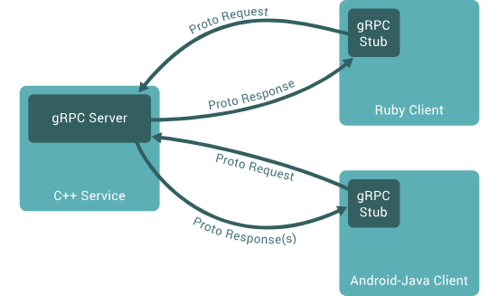

## Introduction

[gRPC](https://grpc.io/) is a modern open source high performance Remote Procedure Call (RPC) framework that can run in any environment. 
It can efficiently connect services in and across data centers with pluggable support for load balancing, tracing, health checking and authentication. 
It is also applicable in last mile of distributed computing to connect devices, mobile applications and browsers to backend services.

In gRPC, a client application can directly call a method on a server application on a different machine as if it were a local object, making it easier for you to create distributed applications and services. As in many RPC systems, gRPC is based around the idea of defining a service, specifying the methods that can be called remotely with their parameters and return types. On the server side, the server implements this interface and runs a gRPC server to handle client calls. On the client side, the client has a stub (referred to as just a client in some languages) that provides the same methods as the server.

## Links

- [Dubbo](/docs/CS/Framework/Dubbo/Dubbo.md)