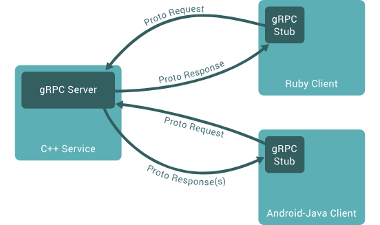

## Introduction

[gRPC](https://grpc.io/) 是一个现代开源高性能远程过程调用（RPC）框架，可在任何环境中运行。
它可以通过可插拔的负载均衡、链路追踪、健康检查和认证支持，高效地连接数据中心内部及跨数据中心的服務。
它也适用于分布式计算的最后一公里，用于连接设备、移动应用和浏览器与后端服务。

在 gRPC 中，客户端应用可以直接调用不同机器上服务器应用的方法，就像调用本地对象一样，这使得创建分布式应用和服务变得更加容易。与许多 RPC 系统一样，gRPC 基于定义服务的思想，指定可以通过远程调用的方法及其参数和返回类型。在服务端，服务器实现该接口并运行一个 gRPC 服务器来处理客户端调用。在客户端，客户端有一个 stub（在某些语言中简称为 client），它提供与服务器相同的方法。

## Links

- [Dubbo](/docs/CS/Framework/Dubbo/Dubbo.md)
