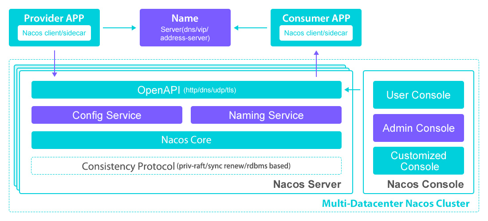
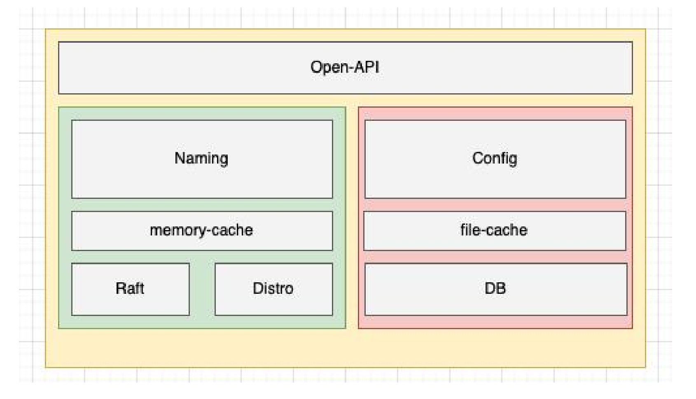
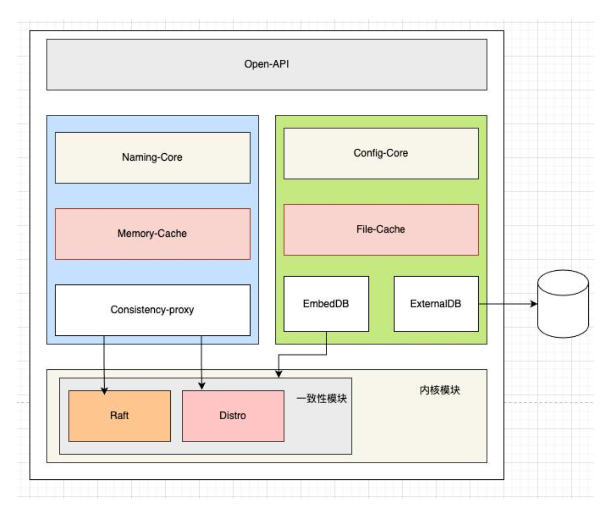

## Introduction

Nacos `/nɑ:kəʊs/` 是 Dynamic Naming and Configuration Service的首字母简称，一个更易于构建云原生应用的动态服务发现、配置管理和服务管理平台 

来源于阿里内部三个产品（Configserver 非持久注册中心， VIPServer 持久化注册中心， Diamond 配置中心 最早⼀个产品逐步演化成 3 个产品的）   

Nacos 支持将注册中心(Service Registry）与配置中心(Config Center) 在一个进程合并部署或者将2者分离部署的两种模式 服务（Service）是 Nacos 世界的一等公民。Nacos 支持几乎所有主流类型的“服务”的发现、配置和管理


Nacos 的关键特性包括:

- **Service Discovery And Service Health Check**
  Nacos supports both DNS-based and RPC-based (Dubbo/gRPC) [service discovery](/docs/CS/Framework/Spring_Cloud/nacos/registry.md). 
  After a service provider registers a service with native, OpenAPI, or a dedicated agent, a consumer can discover the service with either DNS or HTTP.
  Nacos provides real-time health check to prevent services from sending requests to unhealthy hosts or service instances. 
  Nacos supports both transport layer (PING or TCP) health check and application layer (such as HTTP, Redis, MySQL, and user-defined protocol) health check. 
  For the health check of complex clouds and network topologies(such as VPC, Edge Service etc), Nacos provides both agent mode and server mode health check. 
  Nacos also provide a unity service health dashboard to help you manage the availability and traffic of services.
- **Dynamic configuration management**
  [Dynamic configuration](/docs/CS/Framework/Spring_Cloud/nacos/config.md) service allows you to manage the configuration of all applications and services in a centralized, externalized and dynamic manner across all environments.
  Dynamic configuration eliminates the need to redeploy applications and services when configurations are updated.
  Centralized management of configuration makes it more convenient for you to achieve stateless services and elastic expansion of service instances on-demand.
  Nacos provides an easy-to-use UI (DEMO) to help you manage all of your application or services's configurations. 
  It provides some out-of-box features including configuration version tracking, canary/beta release, configuration rollback, and client configuration update status tracking to ensure the safety and control the risk of configuration change.

- **Dynamic DNS service**
  Dynamic DNS service which supports weighted routing makes it easier for you to implement mid-tier load balancing, flexible routing policies, traffic control, and simple DNS resolution services in your production environment within your data center. 
  Dynamic DNS service makes it easier for you to implement DNS-based Service discovery.
  Nacos provides some simple DNS APIs TODO for you to manage your DNS domain names and IPs.
- **Service governance and metadata management**
  Nacos allows you to manage all of your services and metadata from the perspective of a microservices platform builder. 
  This includes managing service description, life cycle, service static dependencies analysis, service health status, service traffic management，routing and security rules, service SLA, and first line metrics.


Run and Debug

```shell
git clone https://github.com/alibaba/nacos.git
cd nacos/
# -Drat.skip=true 
mvn -Prelease-nacos -Dmaven.test.skip=true clean install -U  
ls -al distribution/target/

// change the $version to your actual path
cd distribution/target/nacos-server-$version/nacos/bin
```

Run Nacos.java file in module nacos-console with VM options `-Dnacos.standalone=true`

cluster.conf文件需配置在 ～/nacos/conf/下
在console module下的application.properties里配置mysql

> [!TIP]
>
> Windows下编译太困难 在protobuf上

## Architecture

整体架构分为用户层、 业务层、 内核层和插件， 用户层主要解决用户使用的易用性问题， 业务层主要解决服务发现和配置管理的功能问题， 内核层解决分布式系统⼀致性、 存储、 高可用等核心问题，插件解决扩展性问题。  



采⽤了阿⾥巴巴内部⾃研的 Distro 协议来实现数据弱⼀致性同步。其中所有节点都将存储集群内所有服务元数据，因此都可以提供数据读取服务，但每个节点只负责⼀部分客户端的数据写服务

## start

com.alibaba.nacos.core.code.SpringApplicationRunListener

```java
public class SpringApplicationRunListener implements org.springframework.boot.SpringApplicationRunListener, Ordered {

}
```

专有线程池做log 在 started后shutdownNow

```java
public class StartingApplicationListener implements NacosApplicationListener {
    @Override
    public void contextPrepared(ConfigurableApplicationContext context) {
        logClusterConf();

        logStarting();
    }

    private void logStarting() {
        if (!EnvUtil.getStandaloneMode()) {
            
            scheduledExecutorService = ExecutorFactory
                    .newSingleScheduledExecutorService(new NameThreadFactory("com.alibaba.nacos.core.nacos-starting"));
            
            scheduledExecutorService.scheduleWithFixedDelay(() -> {
                if (starting) {
                    LOGGER.info("Nacos is starting...");
                }
            }, 1, 1, TimeUnit.SECONDS);
        }
    }
}
```

judge if is storage mode

```java
public class StartingApplicationListener implements NacosApplicationListener {
    @Override
    public void started(ConfigurableApplicationContext context) {
    starting = false;
    
    closeExecutor();
    
    ApplicationUtils.setStarted(true);
    judgeStorageMode(context.getEnvironment());
    }
}
```


## grpc

sdkserver 端口 server.port+1000

grpcserver端口 server.port+1001

 ## Consistency


Nacos 是⼀个集服务注册发现以及配置管理于⼀体的组件， 因此对于集群下， 各个节点之间的数据⼀致性保障问题， 需要拆分成两个方面
- 对于服务注册
  - 针对于 Nacos 服务发现注册中的非持久化服务 为了满足服务发现注册中心的可用性， 强⼀致性的共识算法不太合适
  - 而对于 Nacos 服务发现注册中的持久化服务， 因为所有的数据都是直接使用调用 Nacos服务端直接创建， 因此需要由 Nacos 保障数据在各个节点之间的强⼀致性， 故而针对此类型的服务数据， 选择了强⼀致性共识算法来保障数据的⼀致性
- 配置数据的管理， 是必须要求集群中大部分的节点是强⼀致的， 而这里的话只能使用强⼀致性共识算法



在早期的 Nacos 架构中， 服务注册和配置管理⼀致性协议是分开的， 没有下沉到 Nacos 的内核模块作为通用能力演进， 服务发现模块⼀致性协议的实现和服务注册发现模块的逻辑强耦合在⼀起， 并且充斥着服务注册发现的⼀些概念。 
这使得 Nacos 的服务注册发现模块的逻辑变得复杂且难以维护， 耦合了⼀致性协议层的数据状态， 难以做到计算存储彻底分离， 以及对计算层的无限水平扩容能力也有⼀定的影响

需要对 Nacos 的⼀致性协议做抽象以及下沉， 使其成为 Core 模块的能力， 彻底让服务注册发现模块只充当计算能力， 同时为配置模块去外 部数据库存储打下了架构基础



⼀致性协议抽象

其实， ⼀致性协议，就是用来保证数据⼀致的，而数据的产生，必然有 个写入的动作；同时还要能够读数据，并且保证读数据的动作以及得到的数据结果，并且能够得到 致性协议的保障。因此，⼀致性协议最最基础的两个方法，就是写动作和读动作

```java
public interface ConsistencyProtocol<T extends Config, P extends RequestProcessor> extends CommandOperations {
    Response getData(ReadRequest request) throws Exception;
    Response write(WriteRequest request) throws Exception;
    // ...
}
```

一致性协议已经被抽象在了 consistency 的包中，Nacos 对于 AP、CP 的 致性协议接口使用抽象都在里面，并且在实现具体的 致性协议时，采用了插件可插拔的形式，一步将一致性协议具体实现逻辑和服务注册发现、配置管理两个模块达到解耦的目的


```java
@Component(value = "ProtocolManager")
public class ProtocolManager extends MemberChangeListener implements DisposableBean {
    private void initCPProtocol() {
        ApplicationUtils.getBeanIfExist(CPProtocol.class, protocol -> {
            Class configType = ClassUtils.resolveGenericType(protocol.getClass());
            Config config = (Config) ApplicationUtils.getBean(configType);
            injectMembers4CP(config);
            protocol.init(config);
            ProtocolManager.this.cpProtocol = protocol;
        });
    }
}
```

服务发现以及配置模块，更多应该专注于数据的使用以及计算，而非数据怎么存储、怎么保障数据 致性，数据存储以及多节点 致的问题应该交由存储层来保证。为了进 步降低 致性协议出现在服务注册发现以及配置管理两个模块的频次以及尽可能让 致性协议只在内核模块中感知，Nacos 这里又做了另 份工作 数据存储抽象。


致性协议，就是用来保证数据 致的，如果利用 致性协议实现 个存储，那么服务模块以及配置模块，就由原来的依赖 致性协议接口转变为了依赖存储接口，而存储接口后面的具体实现，就比 致性协议要丰富得多了，并且服务模块以及配置模块也无需为直接依赖 致性协议而承担多余的编码工作（快照、状态机实现、数据同步）。使得这两个模块可以更加的专注自己的核心逻辑。


由于 Nacos 的服务模块存储，更多的都是根据单个或者多个唯 key 去执行点查的操作，因此Key Value 类型的存储接口最适合不过

```java
public interface KvStorage {
    
    enum KvType {
        /**
         * Local file storage.
         */
        File,
    
        /**
         * Local memory storage.
         */
        Memory,
    
        /**
         * RocksDB storage.
         */
        RocksDB,
    }
}
```


### JRaft

A concrete implementation of CP protocol: JRaft.

```java
/**
 * <pre>
 *                                           ┌──────────────────────┐
 *            ┌──────────────────────┐       │                      ▼
 *            │   ProtocolManager    │       │        ┌───────────────────────────┐
 *            └──────────────────────┘       │        │for p in [LogProcessor4CP] │
 *                        │                  │        └───────────────────────────┘
 *                        ▼                  │                      │
 *      ┌──────────────────────────────────┐ │                      ▼
 *      │    discovery LogProcessor4CP     │ │             ┌─────────────────┐
 *      └──────────────────────────────────┘ │             │  get p.group()  │
 *                        │                  │             └─────────────────┘
 *                        ▼                  │                      │
 *                 ┌─────────────┐           │                      │
 *                 │ RaftConfig  │           │                      ▼
 *                 └─────────────┘           │      ┌──────────────────────────────┐
 *                        │                  │      │  create raft group service   │
 *                        ▼                  │      └──────────────────────────────┘
 *              ┌──────────────────┐         │
 *              │  JRaftProtocol   │         │
 *              └──────────────────┘         │
 *                        │                  │
 *                     init()                │
 *                        │                  │
 *                        ▼                  │
 *               ┌─────────────────┐         │
 *               │   JRaftServer   │         │
 *               └─────────────────┘         │
 *                        │                  │
 *                        │                  │
 *                        ▼                  │
 *             ┌────────────────────┐        │
 *             │JRaftServer.start() │        │
 *             └────────────────────┘        │
 *                        │                  │
 *                        └──────────────────┘
 * </pre>
 *
 */
```

端口号 server.port - 1000


## Cluster

目前需要手动配置在cluster.conf文件里 未来预期通过其它web服务获取

### MemberLookup


#### StandaloneMemberLookup

单机模式的寻址模式很简单，其实就是找到自己的 P:PORT 组合信息，然后格式化为 个节点信息

```java
public class StandaloneMemberLookup extends AbstractMemberLookup {
    
    @Override
    public void doStart() {
        String url = EnvUtil.getLocalAddress();
        afterLookup(MemberUtil.readServerConf(Collections.singletonList(url)));
    }
    
    @Override
    public boolean useAddressServer() {
        return false;
    }
}
```

#### FileConfigMemberLookup

文件寻址模式是 Nacos 集群模式下的默认寻址实现。文件寻址模式很简单，其实就是每个 Nacos节点需要维护 个叫做 cluster.conf 的文件。

该文件默认只需要填写每个成员节点的 P 信息即可，端口会自动选择 Nacos 的默认端口 8848，如过说有特殊需求更改了 Nacos 的端口信息，则需要在该文件将该节点的完整网路地址信息补充完整（ P:PORT）。

当 Nacos 节点启动时，会读取该文件的内容，然后将文件内的 P 解析为节点列表，调用 afterLookup 存入 ServerMemberManager

WatchFileCenter注册文件变更监听

```java
public class WatchFileCenter {
    public static synchronized boolean registerWatcher(final String paths, FileWatcher watcher) throws NacosException {
        checkState();
        if (NOW_WATCH_JOB_CNT == MAX_WATCH_FILE_JOB) {
            return false;
        }
        WatchDirJob job = MANAGER.get(paths);
        if (job == null) {
            job = new WatchDirJob(paths);
            job.start();
            MANAGER.put(paths, job);
            NOW_WATCH_JOB_CNT++;
        }
        job.addSubscribe(watcher);
        return true;
    }
}
```

FileConfigMemberLookup实现了Watcher并在时间处理中重新解析cluster配置文件

```java
public class FileConfigMemberLookup extends AbstractMemberLookup {
    
    private static final String DEFAULT_SEARCH_SEQ = "cluster.conf";
    
    private FileWatcher watcher = new FileWatcher() {
        @Override
        public void onChange(FileChangeEvent event) {
            readClusterConfFromDisk();
        }
        
        @Override
        public boolean interest(String context) {
            return StringUtils.contains(context, DEFAULT_SEARCH_SEQ);
        }
    };
    
    private void readClusterConfFromDisk() {
        Collection<Member> tmpMembers = new ArrayList<>();
        try {
            List<String> tmp = EnvUtil.readClusterConf();
            tmpMembers = MemberUtil.readServerConf(tmp);
        } catch (Throwable e) {
            Loggers.CLUSTER
                    .error("nacos-XXXX [serverlist] failed to get serverlist from disk!, error : {}", e.getMessage());
        }
        
        afterLookup(tmpMembers);
    }
}
```


如果发现集群扩缩容，那么就需要修改每个 Nacos 节点下的 cluster.conf 文件，然后 Nacos 内部的文件变动监听中心会自动发现文件修改，重新读取文件内容、加载 P 列表信息、更新新增的节点。


但是，这种默认寻址模式有 个缺点 运维成本较大，可以想象下，当你新增 个 Nacos 节点时，需要去手动修改每个 Nacos 节点下的 cluster.conf 文件，这是多么辛苦的 件工作，或者稍微高端 点，利用 ansible 等自动化部署的工具去推送 cluster.conf 文件去代替自己的手动操作，虽然说省去了较为繁琐的人工操作步骤，但是仍旧存在 个问题 每 个 Nacos 节点都存在 份cluster.conf 文件，如果其中 个节点的 cluster.conf 文件修改失败，就造成了集群间成员节点列表数据的不 致性，因此，又引申出了新的寻址模式 地址服务器寻址模式。


#### AddressServerMemberLookup

地址服务器寻址模式是 Nacos 官方推荐的 种集群成员节点信息管理，该模式利用了 个简易的web 服务器，用于管理 cluster.conf 文件的内容信息，这样，运维人员只需要管理这 份集群成员节点内容即可，而每个 Nacos 成员节点，只需要向这个 web 节点定时请求当前最新的集群成员节点列表信息即可。


因此，通过地址服务器这种模式，大大简化了 Nacos 集群节点管理的成本，同时，地址服务器是个非常简单的 web 程序，其程序的稳定性能够得到很好的保障。


Nacos 的集群节点管理，还都是属于人工操作，因此，未来期望能够基于寻址模式，实现集群节点自动管理的功能

```java
public class AddressServerMemberLookup extends AbstractMemberLookup {

    @Override
    public void doStart() throws NacosException {
        this.maxFailCount = Integer.parseInt(EnvUtil.getProperty(HEALTH_CHECK_FAIL_COUNT_PROPERTY, DEFAULT_HEALTH_CHECK_FAIL_COUNT));
        initAddressSys();
        run();
    }


    private void initAddressSys() {
        String envDomainName = System.getenv(ADDRESS_SERVER_DOMAIN_ENV);
        if (StringUtils.isBlank(envDomainName)) {
            domainName = EnvUtil.getProperty(ADDRESS_SERVER_DOMAIN_PROPERTY, DEFAULT_SERVER_DOMAIN);
        } else {
            domainName = envDomainName;
        }
        String envAddressPort = System.getenv(ADDRESS_SERVER_PORT_ENV);
        if (StringUtils.isBlank(envAddressPort)) {
            addressPort = EnvUtil.getProperty(ADDRESS_SERVER_PORT_PROPERTY, DEFAULT_SERVER_POINT);
        } else {
            addressPort = envAddressPort;
        }
        String envAddressUrl = System.getenv(ADDRESS_SERVER_URL_ENV);
        if (StringUtils.isBlank(envAddressUrl)) {
            addressUrl = EnvUtil.getProperty(ADDRESS_SERVER_URL_PROPERTY, EnvUtil.getContextPath() + "/" + "serverlist");
        } else {
            addressUrl = envAddressUrl;
        }
        addressServerUrl = HTTP_PREFIX + domainName + ":" + addressPort + addressUrl;
        envIdUrl = HTTP_PREFIX + domainName + ":" + addressPort + "/env";
    }

    @SuppressWarnings("PMD.UndefineMagicConstantRule")
    private void run() throws NacosException {
        // With the address server, you need to perform a synchronous member node pull at startup
        // Repeat three times, successfully jump out
        boolean success = false;
        Throwable ex = null;
        int maxRetry = EnvUtil.getProperty(ADDRESS_SERVER_RETRY_PROPERTY, Integer.class, DEFAULT_SERVER_RETRY_TIME);
        for (int i = 0; i < maxRetry; i++) {
            try {
                syncFromAddressUrl();
                success = true;
                break;
            } catch (Throwable e) {
                ex = e;
                Loggers.CLUSTER.error("[serverlist] exception, error : {}", ExceptionUtil.getAllExceptionMsg(ex));
            }
        }
        if (!success) {
            throw new NacosException(NacosException.SERVER_ERROR, ex);
        }

        GlobalExecutor.scheduleByCommon(new AddressServerSyncTask(), DEFAULT_SYNC_TASK_DELAY_MS);
    }
}
```


## Tuning

### 限流


Tomcat限流 maxConnection


Nginx限流


限制qps


Nacos 每个接口执行的代价不尽相同， 般来说写操作代价比读操作大，与此同时还有高频操作和低频操作之分，SDK 调用的接口 般来说是高频接口，容易出现问题，所以在生产环境需要将这些接口区别对待，根据服务自身的实际情况采取合理的限流策略，以防错用方打垮 Nacos 服务。


限制单个接口的请求 QPS

limit get config 对读操作进行限流，正常使用 Nacos 获取动态配置 般就启动和运行时修改配置推送到 client，获取配置相对来说是低频操作，如果频繁获取配置肯定是 client 有错用或者应用不正常（比如数据平台任务 failover 重试任务）。


limit publish config 对写操作进行限流，可以有效防止热点写问题。对同 个数据的高频写会触发 mysql 的行锁，从而导致 mysql 的多线程任务因等待行锁排队，最终导致 mysql 所有操作都超时服务不可用。这里通过 nginx lua 模块获取 post 请求的参数，设置 limit key 。


限制单机访问 QPS

perclient 对单个 client 的所有请求限制低于 500QPS，可以有效防止单台 client 的重试攻击。


限制 Nacos 服务 QPS

perserver 限制整个 Nacos 服务的 QPS，Nacos 的服务部署在 nginx 之后，nginx 可以保证到达

Nacos 的流量不会打垮 Nacos。


限制并发连接数


/nacos/v1/cs/configs/listener 接口是 Nacos 的长连接通道， 般来说， 个 client 个长连接就可以满足生产需求。limit conn client 限制 client 的连接数不超过 10 个，limit conn server限制 Nacos 单机（8 核 16 G 内存）支撑最多 9000 个长连接，最多可以同时服务 9000 个应用节点。


黑名单

1、 P 黑名单

当生产环境发现有错用的 client 影响到 Nacos 服务，可以使用 nginx 黑名单限制 client 的访问。


读写黑名单分离

有时候通过 P 维度直接限制 client 访问所有 Nacos 接口粒度过大，会导致应用服务不可用，可以将读操作和写操作分开，禁止 client 写 Nacos，依然允许其进行读。

```shell
# 1 limit read, 0 no limit
map "$remote addr" $limit read {
#10.2.24.252 1;
default 0;
}
# 1 limit write, 0 no limit
map "$remote addr" $limit write {
#10.2.24.252 1;
default 0;
}
location /some url to write {
if ($limit write = 1) {
return 403;
}
}
```


应用黑名单

P 黑名单功能是 nginx 提供的基础能力，能够限制某些 P 的访问，但是 般 个应用会有很多台机器，当 个应用出问题的时候，会有很多 P 访问都有问题，通过 P 的维度来限制访问达不到预期，需要有应用的维度来限制。

namespace（命名空间）是 个可以区分不同应用的维度，不同的应用 般会使用不同的 namespace，这样可以在 namespace 维度对服务的访问进行限制。


## Links


- [Spring Cloud](/docs/CS/Framework/Spring_Cloud/Spring_Cloud.md)

## References
1. [Quick Start for Nacos Spring Boot Projects](https://nacos.io/en-us/docs/quick-start-spring-boot.html)