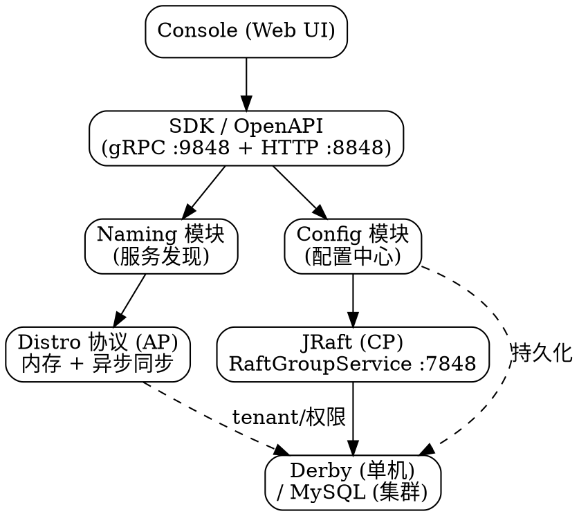

# Nacos Index

## Introduction

Nacos 是**注册中心（Service Registry）与配置中心（Config Center）合一**的平台，与 etcd / ZooKeeper / Consul 这类「单一 KV 或单一协调原语」的中间件定位不同：它在**一个进程内同时承载命名发现与配置管理**两套子系统，并给两者选了不同的一致性模型——

- **命名（服务发现）走 AP**：用自研 **Distro 协议**做临时实例的弱一致同步，每个节点只负责一部分写、但全量可读，牺牲强一致换取高可用与写扩展。
- **配置走 CP**：用 **JRaft**（Raft 实现）保证配置变更的强一致与持久化，依赖外部数据库（Derby / MySQL）落盘。

这套「AP + CP 混合」架构是 Nacos 区别于 etcd（全程 Raft + boltdb）和 ZooKeeper（全程 Zab）的根本特征。本目录按「对外 API / 共识层 / 存储层 / 子系统 / 客户端 / 运维」分层组织，建议阅读顺序：**先 `Nacos.md` 总览与启动 → `jraft.md` 理解 CP 侧共识 → `storage.md` 理解持久化边界（哪些在内存、哪些落库）→ `registry.md` / `config.md` 两个子系统 → `client.md` / `security.md` / `monitoring.md` / `troubleshooting.md` 生产面**。

## Overview and Startup

- [Nacos](/docs/CS/Framework/nacos/Nacos.md)：架构（用户层 / 业务层 / 内核层 / 插件）、安装编译、启动链路、gRPC 端口、JRaft 与 Cluster 内联段、调优、与 etcd 对照。版本基线见其顶部 NOTE。
- [ConfigServer](/docs/CS/Framework/nacos/ConfigServer.md)：阿里内部 ConfigServer 演进来源。
- [Diamond](/docs/CS/Framework/nacos/Diamond.md)：Diamond 配置中心演进来源。

## Consensus Layer: AP / CP Coexist

- [一致性抽象层](/docs/CS/Framework/nacos/consistency.md)：两套一致性抽象（ConsistencyProtocol / ConsistencyService）、按 key 路由 AP/CP、临时实例走 Distro / 持久实例走 JRaft 的双写、为什么 AP+CP 能共存。
- [Distro（AP 协议深潜）](/docs/CS/Framework/nacos/distro.md)：责任分片、双层任务引擎、两阶段延迟合并（1000ms 窗口）、定时校验与自愈、新节点全量加载、失败重试。
- [JRaft](/docs/CS/Framework/nacos/jraft.md)：Nacos 为什么在配置侧用 Raft、Leader 选举 / 日志复制 / 提交 / 快照 / 成员变更、端口与 Distro 的分工。

## Storage and Persistence

- [Storage](/docs/CS/Framework/nacos/storage.md)：AP 命名在内存、CP 配置落库的边界；Derby（单机不可集群）与 MySQL（集群生产）；表结构、data_id+group_id+tenant_id 唯一键、容量 quota、PostgreSQL 插件。

## Subsystem

- [Registry](/docs/CS/Framework/nacos/registry.md)：服务发现数据模型、Client 注册 / Server 处理、Distro 同步、健康心跳、订阅、选实例、调优。
- [Config](/docs/CS/Framework/nacos/config.md)：配置发布 / dump / 长轮询与 gRPC 推送、Spring Cloud 集成、Server 端配置、灰度（beta/tag/aggr）。
- [Config Push（配置推送深潜）](/docs/CS/Framework/nacos/config-push.md)：轻量通知 + 主动拉取设计、2.x 长轮询 vs 3.x gRPC 推送、dump 全量同步、灰度监听、3.x 废弃 HTTP 长轮询监听。
- [nacos-spring](/docs/CS/Framework/nacos/nacos-spring.md)：Spring / Spring Boot 接入注解。

## Client and Ecosystem

- [Client](/docs/CS/Framework/nacos/client.md)：Java / Go SDK 与 Spring Cloud Alibaba 最佳实践、配置监听、服务订阅、namespace/group/dataId、长连接与重连。

## Security

- [Security](/docs/CS/Framework/nacos/security.md)：开启鉴权、JWT token、RBAC（users/roles/permissions）、鉴权插件、控制台关闭、弱鉴权定位。

## Production Operations

- [Monitoring](/docs/CS/Framework/nacos/monitoring.md)：Actuator 暴露 Prometheus、关键指标、3.x 健康检查接口、Grafana 与告警。
- [Troubleshooting](/docs/CS/Framework/nacos/troubleshooting.md)：端口冲突、成员列表不一致、Derby 不可集群、403 token、推送失败、Distro 重启丢实例、长连接上限、版本错配。
- 集群与调优目前内联在 [Nacos](/docs/CS/Framework/nacos/Nacos.md) 的 `## Cluster`（MemberLookup：Standalone / FileConfig / AddressServer）与 `## Tuning`（限流 / 黑名单）段。

## Horizontal Comparison

- [etcd 横向对照](/docs/CS/Framework/etcd/compare.md)：etcd / ZooKeeper / Nacos / Consul 维度矩阵（Nacos 在 `## Nacos 特有能力` 段）。
- [ZooKeeper](/docs/CS/Framework/ZooKeeper/ZooKeeper.md)、[Consul](/docs/CS/Framework/consul/Consul.md)、[etcd](/docs/CS/Framework/etcd/etcd.md)。

## Links

- [Spring Cloud Alibaba](/docs/CS/Framework/Spring_Cloud/Alibaba.md)
- [etcd 横向对照](/docs/CS/Framework/etcd/compare.md)

## References

- <https://nacos.io/>
- <https://nacos.io/docs/v3.0/manual/admin/auth/>
- <https://nacos.io/docs/latest/manual/admin/monitor/>
- <https://nacos.io/download/release-history>
